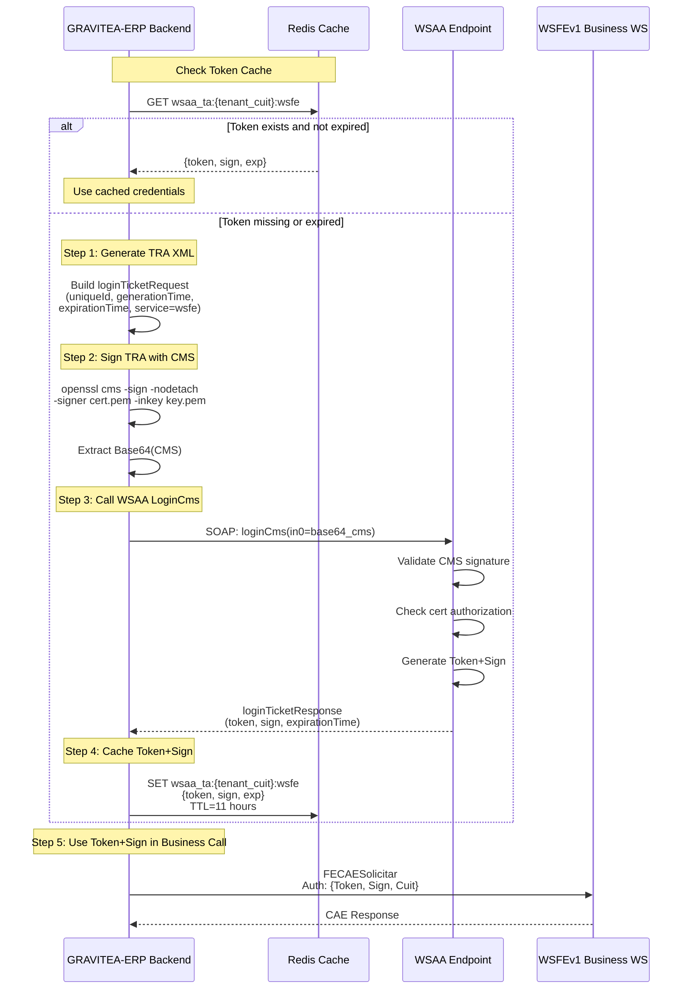
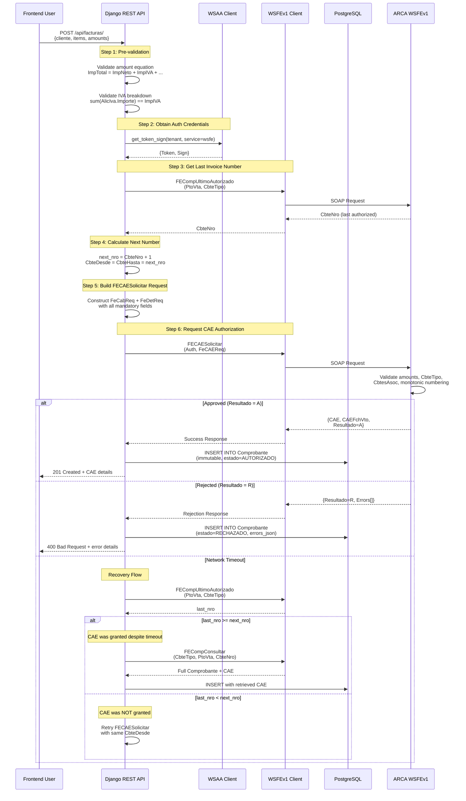
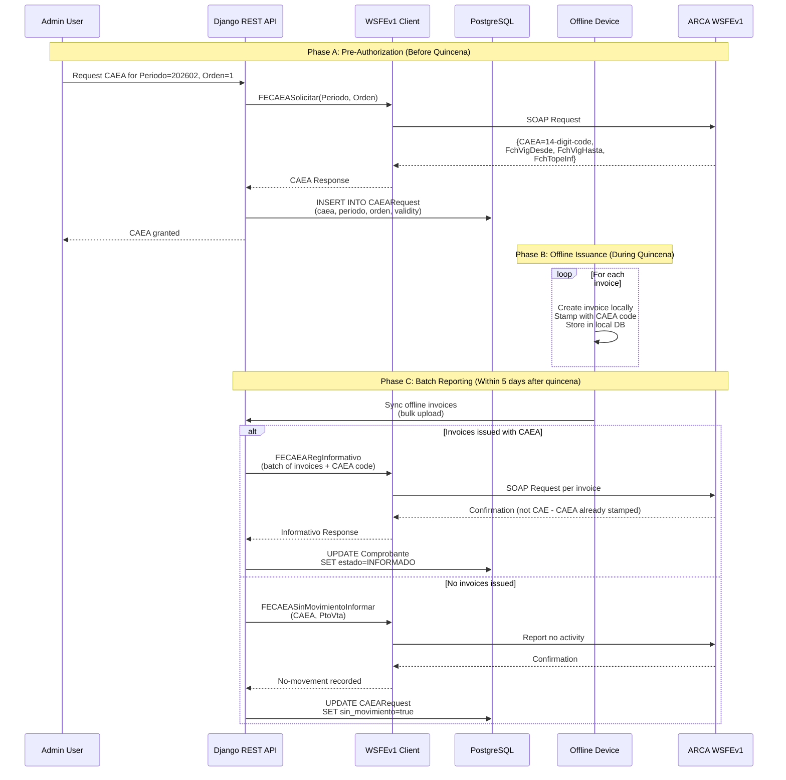
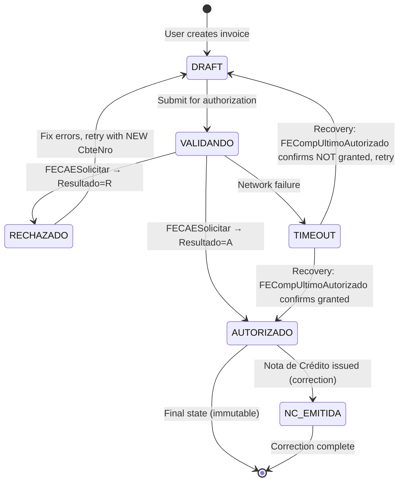
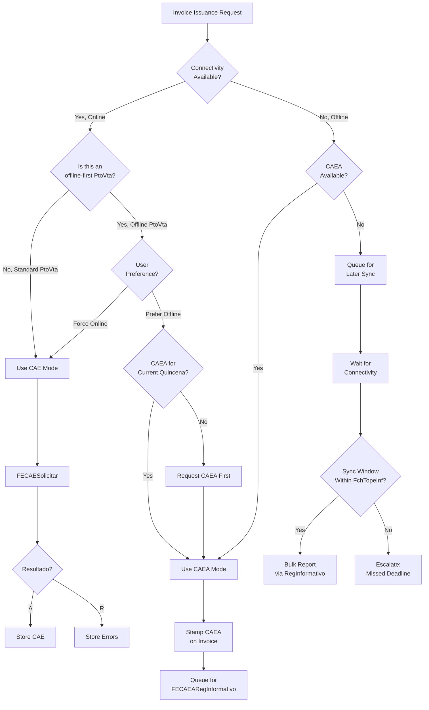
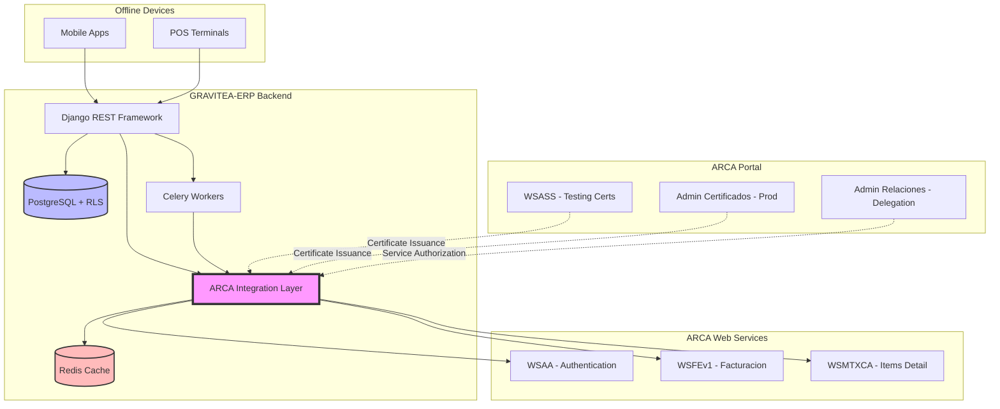
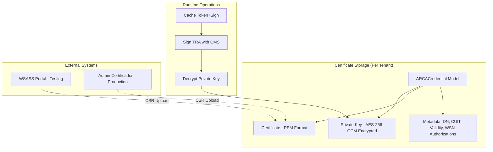
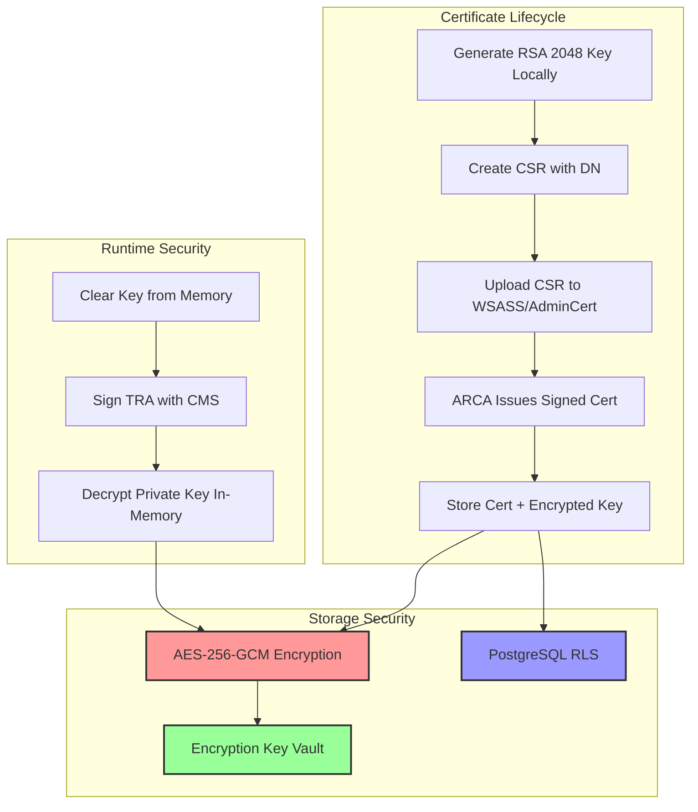
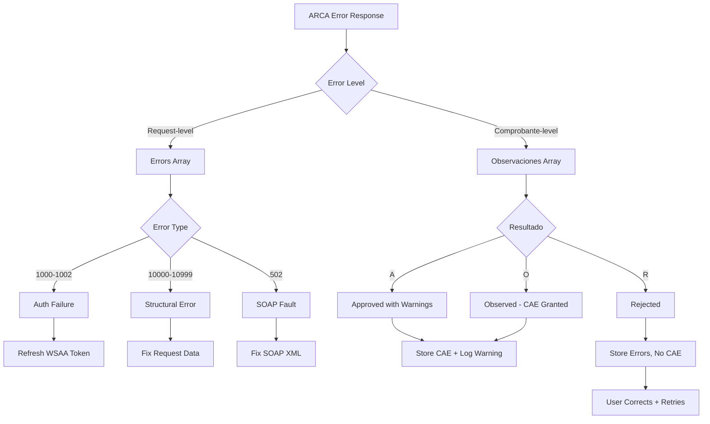

# ARCA Electronic Invoicing System Architecture

> **Document**: System Architecture Design for GRAVITEA-ERP ARCA Integration
> **Date**: 2026-02-10
> **Based on**: Three-researcher discovery (API Specs, Dev Guides, Setup/Certs)
> **Status**: Architecture Design Phase

---

## Table of Contents

1. [Executive Summary](#1-executive-summary)
2. [System Flows](#2-system-flows)
3. [CAE State Machine](#3-cae-state-machine)
4. [CAE vs CAEA Decision Tree](#4-cae-vs-caea-decision-tree)
5. [Integration Architecture](#5-integration-architecture)
6. [Component Design](#6-component-design)
7. [Security Architecture](#7-security-architecture)
8. [Error Handling Strategy](#8-error-handling-strategy)
9. [Implementation Constraints](#9-implementation-constraints)
10. [Architectural Decisions](#10-architectural-decisions)

---

## 1. Executive Summary

### 1.1 System Overview

ARCA electronic invoicing operates through a **three-tier authentication and authorization architecture**:

```
Certificate Layer → Authentication Layer (WSAA) → Business Layer (WSFEv1/WSMTXCA)
```

All invoice operations require:
1. **Certificate** — X.509 certificate issued via WSASS (testing) or AdminCert (production)
2. **Token+Sign** — Obtained from WSAA by signing a TRA with the certificate
3. **CAE/CAEA** — Authorization code for each invoice from WSFEv1/WSMTXCA

### 1.2 Core Architectural Principles

| Principle | Rationale | Implementation |
|-----------|-----------|----------------|
| **Immutability** | CAE-authorized invoices are FINAL — no UPDATE/DELETE allowed | Append-only Comprobante model, StockMovement ledger |
| **Monotonic Numbering** | CbteNro must be sequential, no gaps, no duplicates | Pre-check FECompUltimoAutorizado before every authorization |
| **Defense in Depth** | Multi-layer validation (app, ARCA, database RLS) | TenantBoundModel + IDOR checks + amount validation |
| **Offline-First** | CAEA enables invoice issuance without connectivity | DeviceSession + CAEA lifecycle + sync conflict resolution |
| **Token Caching** | WSAA token valid ~12h; minimize auth traffic | Per-tenant Redis cache with 11h TTL |

### 1.3 Key Components

```
GRAVITEA-ERP Backend
  |
  +-- apps/facturacion/
  |     |-- models/
  |     |   |-- ARCACredential (cert, key, tenant-scoped)
  |     |   |-- Comprobante (immutable, CAE lifecycle)
  |     |   |-- PuntoDeVenta (sales point)
  |     |   +-- CAEARequest (quincena tracking)
  |     |
  |     +-- arca/
  |         |-- wsaa.py (authentication client)
  |         |-- wsfe.py (WSFEv1 client)
  |         |-- validators.py (amount equation, IVA formulas)
  |         |-- qr.py (fiscal QR code generation)
  |         +-- constants.py (CbteTipo, DocTipo, CondicionIVA enums)
  |
  +-- apps/core/
        |-- encryption/ (AES-256-GCM for private keys)
        +-- rate_limiter.py (WSAA anti-duplicate protection)
```

---

## 2. System Flows

### 2.1 WSAA Authentication Flow

**Objective**: Obtain a Token+Sign credential pair valid for ~12 hours



**Key Decision Points**:
- **Cache Key Structure**: `wsaa_ta:{tenant_cuit}:{service_id}` — one TA per (tenant, service) pair
- **TTL Safety Margin**: Cache expires 1h before ARCA expiration to avoid edge cases
- **Concurrency Lock**: Tenant-scoped lock to prevent duplicate TA requests during refresh window

**Architectural Constraint**: WSAA enforces anti-duplicate with a 10-minute lock in testing, 2 minutes in production. Never retry LoginCms within this window.

---

### 2.2 WSFEv1 Invoice Issuance Sequence (CAE Mode)

**Objective**: Authorize a single invoice and obtain a 14-digit CAE code



**Key Architectural Decisions**:

1. **Pre-validation Before ARCA Call**
   - Rationale: Reduce ARCA traffic and avoid rejection codes for preventable errors
   - Implementation: Django validators run amount equation, IVA formulas, field constraints

2. **Monotonic Numbering Enforcement**
   - Rationale: ARCA rejects gaps or duplicates (error 10015)
   - Implementation: Always call FECompUltimoAutorizado before authorization, use last_nro + 1

3. **Network Failure Recovery**
   - Rationale: Prevent duplicate CAEs or numbering gaps on timeout
   - Implementation: Query FECompUltimoAutorizado to detect if CAE was granted, then retrieve via FECompConsultar if needed

4. **Immutability**
   - Rationale: CAE-authorized invoices are legally final
   - Implementation: No UPDATE/DELETE on Comprobante with estado=AUTORIZADO; corrections via Nota de Crédito

---

### 2.3 CAEA Offline Workflow (Pre-authorization + Batch Reporting)

**Objective**: Issue invoices offline during unreliable connectivity periods



**Key Architectural Decisions**:

1. **CAEA Lifecycle Management**
   - Rationale: CAEA is a pre-authorized code for a biweekly period (quincena)
   - Implementation: CAEARequest model tracks {periodo, orden, caea, validity_dates, sin_movimiento_flag}

2. **Offline Device Session**
   - Rationale: GRAVITEA-ERP is offline-first — devices sync when connectivity resumes
   - Implementation: DeviceSession model stores local CAEA-stamped invoices, sync engine uploads to backend within FchTopeInf deadline

3. **No-Movement Reporting**
   - Rationale: ARCA mandates reporting even if no invoices issued
   - Implementation: Cron job checks CAEARequest records at quincena end, calls FECAEASinMovimientoInformar if PtoVta had zero activity

4. **CAEA vs CAE Distinction**
   - CAEA: Pre-authorized, stamped on invoice at issuance, reported later
   - CAE: Real-time authorization, returned by ARCA at the moment of FECAESolicitar

---

## 3. CAE State Machine

### 3.1 States and Transitions



### 3.2 State Definitions

| Estado | Description | Database Constraints | Allowed Operations |
|--------|-------------|---------------------|-------------------|
| **DRAFT** | Invoice created, not submitted | No CAE, no CbteNro assigned | UPDATE, DELETE |
| **VALIDANDO** | Pending ARCA response | Transient (not persisted) | None (system locked) |
| **AUTORIZADO** | CAE granted, legally valid | CAE NOT NULL, CAEFchVto NOT NULL | READ only |
| **RECHAZADO** | ARCA rejected (business validation error) | errors_json NOT NULL | READ, analyze errors, retry with new data |
| **TIMEOUT** | Network failure during authorization | Transient (recovery flow active) | Recovery query FECompUltimoAutorizado |
| **NC_EMITIDA** | Nota de Crédito issued to correct | CbtesAsoc references this Comprobante | READ only |

### 3.3 Architectural Constraints from State Machine

1. **Immutability After Authorization**
   - Implementation: Django model with `save()` override that raises exception if estado=AUTORIZADO and attempting UPDATE
   - Database: CHECK constraint `estado = 'AUTORIZADO' IMPLIES updated_at = created_at`

2. **CbteNro Assignment**
   - DRAFT: CbteNro is NULL
   - VALIDANDO: CbteNro assigned from FECompUltimoAutorizado + 1
   - AUTORIZADO: CbteNro frozen, immutable

3. **Error Recovery**
   - RECHAZADO: Store ARCA errors in `errors_json` JSONB field for analysis
   - User must create a NEW invoice (new DRAFT) with corrections — do NOT retry with same CbteNro

4. **Correction Pattern**
   - To modify amounts: Issue Nota de Débito (CbteTipo 2/7/12) with CbtesAsoc → original factura
   - To cancel: Issue Nota de Crédito (CbteTipo 3/8/13) with CbtesAsoc → original factura

---

## 4. CAE vs CAEA Decision Tree

### 4.1 Decision Logic



### 4.2 Decision Table

| Scenario | Connectivity | PtoVta Type | CAEA Available | Action | Method |
|----------|--------------|-------------|----------------|--------|--------|
| Standard online | ✅ Available | Standard | N/A | Real-time CAE | FECAESolicitar |
| Offline-first with CAEA | ❌ Unavailable | CAEA-enabled | ✅ Yes | Stamp CAEA | Local storage → FECAEARegInformativo later |
| Offline without CAEA | ❌ Unavailable | CAEA-enabled | ❌ No | Queue for sync | Wait for connectivity, bulk report |
| Hybrid (user choice) | ✅ Available | CAEA-enabled | ✅ Yes | User selects | CAE OR CAEA |
| Emergency fallback | ❌ Unavailable | Standard (no CAEA) | N/A | Queue + alert | Cannot issue until online |

### 4.3 Architectural Implementation

**Configuration Model**:
```python
class PuntoDeVenta(TenantBoundModel):
    numero = models.IntegerField()  # PtoVta
    descripcion = models.CharField(max_length=100)

    # CAEA configuration
    caea_habilitado = models.BooleanField(default=False)
    modo_offline_preferido = models.BooleanField(default=False)

    # CAE configuration
    tipo_cae_permitido = models.CharField(
        max_length=20,
        choices=[('CAE', 'Solo CAE'), ('CAEA', 'Solo CAEA'), ('AMBOS', 'CAE y CAEA')]
    )
```

**Decision Engine**:
```python
def seleccionar_modo_autorizacion(
    comprobante: Comprobante,
    ptoVta: PuntoDeVenta,
    conectividad: bool
) -> str:
    """
    Returns: 'CAE' or 'CAEA'
    Raises: AuthorizationModeException if neither is possible
    """
    if not conectividad:
        if not ptoVta.caea_habilitado:
            raise AuthorizationModeException("Sin conectividad y PtoVta no tiene CAEA habilitado")

        # Check if CAEA exists for current quincena
        quincena = calcular_quincena(comprobante.fecha)
        caea = CAEARequest.objects.filter(
            tenant=comprobante.tenant,
            ptoVta=ptoVta,
            periodo=quincena.periodo,
            orden=quincena.orden,
            estado='VIGENTE'
        ).first()

        if not caea:
            raise AuthorizationModeException("Sin conectividad y sin CAEA para la quincena actual")

        return 'CAEA'

    # Conectividad disponible
    if ptoVta.tipo_cae_permitido == 'CAE':
        return 'CAE'
    elif ptoVta.tipo_cae_permitido == 'CAEA':
        return 'CAEA'
    else:  # AMBOS
        if ptoVta.modo_offline_preferido:
            # Intentar CAEA si está disponible
            quincena = calcular_quincena(comprobante.fecha)
            caea = CAEARequest.objects.filter(...).first()
            return 'CAEA' if caea else 'CAE'
        else:
            return 'CAE'
```

---

## 5. Integration Architecture

### 5.1 System Component Diagram



### 5.2 ARCA Integration Layer Design

**Module Structure**:
```
apps/facturacion/arca/
├── __init__.py
├── wsaa.py          # WSAA authentication client
├── wsfe.py          # WSFEv1 business client
├── wsmtxca.py       # WSMTXCA client (future)
├── validators.py    # Amount equations, IVA formulas
├── qr.py            # Fiscal QR code generation
├── constants.py     # CbteTipo, DocTipo, CondicionIVA enums
├── exceptions.py    # ARCA-specific exceptions
└── utils.py         # Common helpers (TRA generation, CMS signing)
```

**Key Responsibilities**:

| Module | Responsibility | External Dependencies |
|--------|----------------|----------------------|
| `wsaa.py` | LoginCms, Token+Sign caching, TRA signing | `cryptography` (CMS), Redis |
| `wsfe.py` | FECAESolicitar, FECompUltimoAutorizado, parameter queries | `zeep` (SOAP client) |
| `validators.py` | Pre-ARCA validation (amount equation, IVA, CbtesAsoc) | None (pure Python) |
| `qr.py` | RG 4291 QR JSON + Base64 encoding | `json`, `base64` |
| `constants.py` | Enumerations synced with FEParamGet* responses | None |

---

### 5.3 Certificate Management Architecture



**ARCACredential Model Design**:
```python
class ARCACredential(TenantBoundModel):
    """
    Per-tenant certificate storage with encrypted private key.
    """
    # Identity
    alias = models.CharField(max_length=100)  # From WSASS/AdminCert
    dn = models.CharField(max_length=200)     # SERIALNUMBER=CUIT..., CN=...
    cuit_titular = models.BigIntegerField()   # Persona fisica CUIT
    cuit_representada = models.BigIntegerField()  # Company CUIT (if delegation)

    # Certificate files
    certificate_pem = models.TextField()      # X.509 cert (public)
    private_key_encrypted = models.BinaryField()  # AES-256-GCM encrypted
    encryption_key_id = models.CharField(max_length=64)  # Key rotation support

    # Validity
    valid_from = models.DateTimeField()
    valid_to = models.DateTimeField()

    # Environment
    environment = models.CharField(
        max_length=10,
        choices=[('testing', 'Homologacion'), ('production', 'Produccion')]
    )

    # Service authorizations
    wsn_authorizations = models.JSONField(default=list)
    # Example: ["wsfe", "wsmtxca", "wsfex"]

    class Meta:
        unique_together = [('tenant', 'alias', 'environment')]
        indexes = [
            models.Index(fields=['tenant', 'cuit_representada', 'environment']),
            models.Index(fields=['valid_to']),  # Expiration monitoring
        ]
```

**Security Constraints**:
1. Private keys stored encrypted at rest (apps/core/encryption/)
2. Decryption only in-memory during TRA signing (never written to disk)
3. Filesystem permissions: cert files `chmod 644`, key files `chmod 600` (if exported)
4. Key rotation: `encryption_key_id` allows migrating to new AES keys without re-issuing certs

---

## 6. Component Design

### 6.1 Comprobante Model (Core Invoice Entity)

```python
from django.db import models
from apps.core.models import TenantBoundModel

class Comprobante(TenantBoundModel):
    """
    Immutable electronic invoice (factura/nota de credito/nota de debito).
    Once estado=AUTORIZADO, no UPDATE or DELETE allowed.
    """
    # Identity
    punto_venta = models.ForeignKey(
        'PuntoDeVenta',
        on_delete=models.PROTECT,
        related_name='comprobantes'
    )
    tipo_comprobante = models.IntegerField(
        choices=CbteTipo.choices()
    )  # 1=FA, 6=FB, 11=FC, etc.

    numero_desde = models.BigIntegerField(null=True, blank=True)
    numero_hasta = models.BigIntegerField(null=True, blank=True)
    # numero_desde = numero_hasta for single invoices

    # Temporal
    fecha_emision = models.DateField()
    fecha_servicio_desde = models.DateField(null=True, blank=True)
    fecha_servicio_hasta = models.DateField(null=True, blank=True)
    fecha_vencimiento_pago = models.DateField(null=True, blank=True)

    # Buyer
    tipo_documento = models.IntegerField(choices=DocTipo.choices())
    numero_documento = models.BigIntegerField()

    # Amounts (all Decimal 13+2)
    importe_total = models.DecimalField(max_digits=15, decimal_places=2)
    importe_total_concepto = models.DecimalField(max_digits=15, decimal_places=2, default=0)
    importe_neto = models.DecimalField(max_digits=15, decimal_places=2)
    importe_operaciones_exentas = models.DecimalField(max_digits=15, decimal_places=2, default=0)
    importe_iva = models.DecimalField(max_digits=15, decimal_places=2, default=0)
    importe_tributos = models.DecimalField(max_digits=15, decimal_places=2, default=0)

    # Currency
    moneda = models.CharField(max_length=3, default='PES')
    cotizacion = models.DecimalField(max_digits=10, decimal_places=6, default=1.000000)

    # IVA breakdown (JSONB)
    alicuotas_iva = models.JSONField(default=list)
    # Example: [{"Id": 5, "BaseImp": 1000.00, "Importe": 210.00}]

    # Associated comprobantes (for NC/ND)
    comprobantes_asociados = models.JSONField(default=list, null=True, blank=True)
    # Example: [{"Tipo": 1, "PtoVta": 1, "Nro": 123}]

    # Authorization
    estado = models.CharField(
        max_length=20,
        choices=[
            ('DRAFT', 'Borrador'),
            ('AUTORIZADO', 'Autorizado con CAE'),
            ('RECHAZADO', 'Rechazado por ARCA'),
            ('INFORMADO', 'Informado con CAEA'),
        ],
        default='DRAFT'
    )

    cae = models.CharField(max_length=14, null=True, blank=True)
    cae_vencimiento = models.DateField(null=True, blank=True)

    caea = models.CharField(max_length=14, null=True, blank=True)
    caea_quincena_periodo = models.IntegerField(null=True, blank=True)  # YYYYMM
    caea_quincena_orden = models.SmallIntegerField(null=True, blank=True)  # 1 or 2

    # Error tracking
    arca_errors = models.JSONField(null=True, blank=True)
    # Example: [{"Code": 10048, "Msg": "ImpTotal equation failed"}]

    # QR code
    qr_data = models.TextField(null=True, blank=True)
    # Base64-encoded JSON for fiscal QR

    # Timestamps
    created_at = models.DateTimeField(auto_now_add=True)
    updated_at = models.DateTimeField(auto_now=True)

    class Meta:
        db_table = 'facturacion_comprobante'
        unique_together = [
            ('tenant', 'punto_venta', 'tipo_comprobante', 'numero_desde'),
        ]
        indexes = [
            models.Index(fields=['tenant', 'estado']),
            models.Index(fields=['fecha_emision']),
            models.Index(fields=['cae']),
        ]
        constraints = [
            models.CheckConstraint(
                check=models.Q(estado='DRAFT') | models.Q(cae__isnull=False) | models.Q(caea__isnull=False),
                name='must_have_cae_or_caea_when_not_draft'
            ),
        ]

    def save(self, *args, **kwargs):
        # Immutability enforcement
        if self.pk and self.estado == 'AUTORIZADO':
            raise ValidationError("Cannot modify AUTORIZADO comprobante")

        # Amount validation
        self.validate_amount_equation()
        self.validate_iva_breakdown()

        super().save(*args, **kwargs)

    def validate_amount_equation(self):
        """
        ImpTotal = ImpTotConc + ImpNeto + ImpOpEx + ImpTrib + ImpIVA
        Tolerance: relative <= 0.01% OR absolute <= 0.01
        """
        calculated = (
            self.importe_total_concepto +
            self.importe_neto +
            self.importe_operaciones_exentas +
            self.importe_tributos +
            self.importe_iva
        )

        diff = abs(calculated - self.importe_total)
        max_val = max(abs(calculated), Decimal('1'))

        if diff / max_val > Decimal('0.0001') and diff > Decimal('0.01'):
            raise ValidationError(f"ImpTotal equation failed: {self.importe_total} != {calculated}")

    def validate_iva_breakdown(self):
        """
        sum(AlicIva.Importe) == ImpIVA (within tolerance)
        """
        if not self.alicuotas_iva:
            if self.importe_iva != 0:
                raise ValidationError("ImpIVA > 0 but no AlicIva entries")
            return

        suma_iva = sum(Decimal(str(ali['Importe'])) for ali in self.alicuotas_iva)
        diff = abs(suma_iva - self.importe_iva)

        if diff > Decimal('0.01'):
            raise ValidationError(f"IVA breakdown sum {suma_iva} != ImpIVA {self.importe_iva}")
```

**Architectural Notes**:
- **Immutability**: Enforced at Django model level AND database CHECK constraint
- **Amount Validation**: Pre-ARCA validation reduces rejection rate
- **JSONB for IVA/CbtesAsoc**: Flexible structure, indexed for queries
- **Estado Transitions**: DRAFT → AUTORIZADO (CAE) or DRAFT → INFORMADO (CAEA)

---

### 6.2 WSAA Client Implementation Pattern

```python
import time
import base64
from cryptography.hazmat.primitives import serialization, hashes
from cryptography.hazmat.primitives.asymmetric import padding
from cryptography import x509
from lxml import etree
import zeep

class WSAAClient:
    """
    WSAA authentication client with Redis-backed token caching.
    """
    def __init__(self, credential: ARCACredential, service: str):
        self.credential = credential
        self.service = service  # e.g., "wsfe"
        self.environment = credential.environment

        if self.environment == 'testing':
            self.wsdl = 'https://wsaahomo.afip.gov.ar/ws/services/LoginCms?wsdl'
        else:
            self.wsdl = 'https://wsaa.afip.gov.ar/ws/services/LoginCms?wsdl'

        self.cache_key = f"wsaa_ta:{credential.tenant_id}:{service}"

    def get_token_sign(self) -> dict:
        """
        Returns: {"token": "...", "sign": "...", "expiration_time": datetime}
        """
        # Check cache
        cached = redis_client.get(self.cache_key)
        if cached:
            data = json.loads(cached)
            exp = datetime.fromisoformat(data['expiration_time'])
            if datetime.now() < exp:
                return data

        # Cache miss or expired — request new TA
        with tenant_lock(f"wsaa_refresh:{self.credential.tenant_id}:{self.service}"):
            # Double-check cache (another thread may have refreshed)
            cached = redis_client.get(self.cache_key)
            if cached:
                data = json.loads(cached)
                exp = datetime.fromisoformat(data['expiration_time'])
                if datetime.now() < exp:
                    return data

            # Generate TRA
            tra_xml = self.generate_tra()

            # Sign TRA
            cms_base64 = self.sign_tra(tra_xml)

            # Call LoginCms
            response = self.call_login_cms(cms_base64)

            # Parse and cache
            token = response['credentials']['token']
            sign = response['credentials']['sign']
            exp_time = response['header']['expirationTime']

            data = {
                'token': token,
                'sign': sign,
                'expiration_time': exp_time.isoformat()
            }

            # Cache with 11h TTL (safety margin)
            ttl_seconds = (exp_time - datetime.now()).total_seconds() - 3600
            redis_client.setex(self.cache_key, int(ttl_seconds), json.dumps(data))

            return data

    def generate_tra(self) -> str:
        """
        Build loginTicketRequest XML with uniqueId, timestamps, service.
        """
        unique_id = int(time.time())
        gen_time = datetime.now(tz=ZoneInfo('America/Argentina/Buenos_Aires'))
        exp_time = gen_time + timedelta(minutes=20)

        tra = f"""<?xml version="1.0" encoding="UTF-8"?>
<loginTicketRequest version="1.0">
  <header>
    <uniqueId>{unique_id}</uniqueId>
    <generationTime>{gen_time.isoformat()}</generationTime>
    <expirationTime>{exp_time.isoformat()}</expirationTime>
  </header>
  <service>{self.service}</service>
</loginTicketRequest>"""

        return tra

    def sign_tra(self, tra_xml: str) -> str:
        """
        Sign TRA with CMS/PKCS#7 using the credential's private key.
        Returns: Base64-encoded CMS (without PEM markers).
        """
        # Decrypt private key
        private_key_pem = decrypt_field(
            self.credential.private_key_encrypted,
            self.credential.encryption_key_id
        )

        # Load private key
        private_key = serialization.load_pem_private_key(
            private_key_pem.encode(),
            password=None
        )

        # Load certificate
        cert = x509.load_pem_x509_certificate(self.credential.certificate_pem.encode())

        # Use cryptography's CMS builder (requires cryptography >= 3.1)
        from cryptography.hazmat.primitives.serialization import pkcs7

        options = [pkcs7.PKCS7Options.Binary]  # Embedded content
        cms_data = pkcs7.PKCS7SignatureBuilder().set_data(
            tra_xml.encode()
        ).add_signer(
            cert, private_key, hashes.SHA256()
        ).sign(
            serialization.Encoding.PEM, options
        )

        # Extract Base64 content between PEM markers
        cms_str = cms_data.decode()
        lines = cms_str.split('\n')
        base64_content = ''.join(line for line in lines if not line.startswith('-----'))

        return base64_content

    def call_login_cms(self, cms_base64: str) -> dict:
        """
        Call WSAA LoginCms SOAP method.
        """
        client = zeep.Client(wsdl=self.wsdl)
        response = client.service.loginCms(in0=cms_base64)

        # Parse loginTicketResponse XML
        root = etree.fromstring(response.encode())

        return {
            'header': {
                'uniqueId': root.find('.//uniqueId').text,
                'generationTime': datetime.fromisoformat(root.find('.//generationTime').text),
                'expirationTime': datetime.fromisoformat(root.find('.//expirationTime').text),
            },
            'credentials': {
                'token': root.find('.//token').text,
                'sign': root.find('.//sign').text,
            }
        }
```

---

## 7. Security Architecture

### 7.1 Certificate Security Model



### 7.2 Defense-in-Depth Layers

| Layer | Mechanism | Protection Against |
|-------|-----------|-------------------|
| **Application** | TenantBoundManager | Cross-tenant data access |
| **Database** | PostgreSQL RLS | Direct SQL injection bypassing Django ORM |
| **Validation** | IDOR checks on ForeignKeys | Malicious reference to other tenant's entities |
| **Encryption** | AES-256-GCM for private keys | Private key theft from database dump |
| **Observability** | Prometheus metrics with sanitized labels | Token/CAE leakage in monitoring systems |
| **Rate Limiting** | WSAA anti-duplicate lock | Duplicate TA requests causing ARCA rejection |

### 7.3 Token Storage Security

**Redis Cache Security**:
```python
REDIS_CONFIG = {
    'host': os.getenv('REDIS_HOST'),
    'port': 6379,
    'db': 0,
    'password': os.getenv('REDIS_PASSWORD'),
    'ssl': True,  # TLS encryption for Redis traffic
    'ssl_cert_reqs': 'required',
    'decode_responses': False,  # Binary-safe for token storage
}

# Token cache key structure
cache_key = f"wsaa_ta:{tenant_id}:{service}"

# Cache value (JSON serialized)
cache_value = {
    "token": "PD94bWwgdmVyc...",  # Base64 SSO token
    "sign": "Urp5dbar...",         # Base64 signature
    "expiration_time": "2026-02-11T01:56:14.467-03:00"
}

# TTL calculation (11h safety margin)
ttl = (expiration_time - now - timedelta(hours=1)).total_seconds()

# Atomic set with expiration
redis_client.setex(cache_key, int(ttl), json.dumps(cache_value))
```

**Security Constraints**:
1. **Never log full tokens** — Only log `jti` (unique ID) or `sub` (subject)
2. **Redis password rotation** — Environment variable, not hardcoded
3. **TLS for Redis** — Encrypt token data in transit
4. **Per-tenant isolation** — Cache keys scoped by tenant_id

---

## 8. Error Handling Strategy

### 8.1 Error Classification



### 8.2 Retry Strategy

| Error Code | Category | Action | Retryable |
|------------|----------|--------|-----------|
| 1000 | Token expired | Refresh WSAA token → retry | ✅ Yes (1 retry) |
| 1001 | CUIT not authorized | Check AdminRel delegation | ❌ No |
| 10048 | ImpTotal equation failed | Pre-validate before retry | ❌ No (user correction needed) |
| 10015 | CbteNro not consecutive | Call FECompUltimoAutorizado → recalculate | ✅ Yes (1 retry) |
| Network timeout | Network failure | FECompUltimoAutorizado recovery flow | ✅ Yes (with recovery) |
| 502 | SOAP fault | Log full request → investigate | ❌ No |

### 8.3 Error Storage and Analysis

```python
class Comprobante(TenantBoundModel):
    # ...
    arca_errors = models.JSONField(null=True, blank=True)

    def store_arca_errors(self, response: dict):
        """
        Store ARCA response errors for analysis.
        """
        errors = []

        # Request-level errors
        if 'Errors' in response:
            for err in response['Errors']:
                errors.append({
                    'level': 'request',
                    'code': err['Code'],
                    'message': err['Msg'],
                    'timestamp': datetime.now().isoformat()
                })

        # Comprobante-level observaciones
        if 'Observaciones' in response:
            for obs in response['Observaciones']:
                errors.append({
                    'level': 'observacion',
                    'code': obs['Code'],
                    'message': obs['Msg'],
                    'timestamp': datetime.now().isoformat()
                })

        self.arca_errors = errors
        self.save(update_fields=['arca_errors'])
```

---

## 9. Implementation Constraints

### 9.1 ARCA-Imposed Constraints

| Constraint | Impact | Mitigation |
|------------|--------|------------|
| **Monotonic Numbering** | CbteNro must be last + 1, no gaps | Always call FECompUltimoAutorizado first |
| **Immutability** | CAE invoices cannot be modified | Corrections via NC/ND with CbtesAsoc |
| **Token Anti-Duplicate** | 10-min lock (testing), 2-min (prod) on TA requests | Cache tokens for 11h |
| **Service Date Fields** | Mandatory when Concepto=2 or 3 | Conditional validation in model |
| **IVA Array** | Type C must NOT send IVA array | Conditional serialization |
| **TLS v1.2+** | TLS v1.0/v1.1 deprecated | Python 3.14.3defaults to TLS v1.2+ |

### 9.2 GRAVITEA-ERP Architectural Constraints

| Constraint | Rationale | Implementation |
|------------|-----------|----------------|
| **Multi-Tenant Isolation** | One database, multiple CUITs | TenantBoundManager + RLS |
| **Offline-First** | Small businesses may lack reliable internet | CAEA support + DeviceSession sync |
| **Field-Level Encryption** | Private keys contain sensitive cryptographic material | AES-256-GCM with key rotation |
| **Audit Trail** | Legal requirement for invoice tracking | Immutable models, no DELETE |

### 9.3 Technology Stack Constraints

| Technology | Constraint | Workaround |
|------------|------------|------------|
| **PostgreSQL 18.1** | RLS policies per tenant | `SET app.current_tenant = <tenant_id>` |
| **Python 3.14** | No native CMS signing | Use `cryptography` library PKCS#7 builder |
| **Django 5.2** | ORM doesn't enforce immutability | Override `save()` method with validation |
| **Redis** | No multi-tenant namespacing | Prefix cache keys with `tenant_id` |

---

## 10. Architectural Decisions

### 10.1 ADR-001: Use WSFEv1 Over WSMTXCA for Phase 1

**Status**: Accepted

**Context**:
- Both WSFEv1 and WSMTXCA support domestic invoicing
- WSFEv1: Aggregated amounts, no item-level detail
- WSMTXCA: Full item breakdown per invoice line

**Decision**: Implement WSFEv1 first, defer WSMTXCA to Phase 2.

**Rationale**:
1. **Simpler request structure** — WSFEv1 requires fewer fields
2. **GRAVITEA-ERP already has item models** — We aggregate internally and send totals to ARCA
3. **Accountant preference varies** — Not all clients need item-level detail in ARCA
4. **Migration path exists** — Can add WSMTXCA later without breaking existing invoices

**Consequences**:
- ✅ Faster Phase 1 delivery
- ✅ Lower initial complexity
- ❌ No item-level IVA detail visible in ARCA portal (only in GRAVITEA-ERP)

---

### 10.2 ADR-002: CAEA Support from Day 1

**Status**: Accepted

**Context**:
- GRAVITEA-ERP targets small businesses with potentially unreliable connectivity
- Offline-first is a core value proposition
- CAEA enables invoice issuance without real-time ARCA access

**Decision**: Implement CAEA lifecycle in Phase 1, not a future enhancement.

**Rationale**:
1. **Core differentiator** — Competitors often skip CAEA due to complexity
2. **Sync architecture exists** — DeviceSession model already handles offline operations
3. **Legal compliance** — CAEA is the only legal way to invoice offline
4. **Quincena deadlines** — FchTopeInf enforcement prevents retroactive implementation

**Consequences**:
- ✅ True offline-first capability
- ✅ Competitive advantage
- ❌ Increased Phase 1 complexity
- ❌ Requires quincena deadline monitoring (cron jobs)

---

### 10.3 ADR-003: Store Private Keys Encrypted, Not in Filesystem

**Status**: Accepted

**Context**:
- Certificates require private keys for TRA signing
- Multi-tenant architecture means dozens/hundreds of keys
- Filesystem storage increases attack surface

**Decision**: Store private keys encrypted in PostgreSQL, decrypt in-memory during TRA signing.

**Rationale**:
1. **Defense in depth** — Database dump doesn't expose keys
2. **Multi-tenant scalability** — One encryption key per tenant, rotation support
3. **Auditability** — Track key usage via ORM queries
4. **Backup simplicity** — Keys included in standard DB backups

**Consequences**:
- ✅ Stronger security posture
- ✅ Centralized key management
- ❌ Slightly slower TRA signing (decrypt overhead)
- ❌ Requires secure encryption_key_id management

---

### 10.4 ADR-004: Pre-Validate Amounts Before ARCA Calls

**Status**: Accepted

**Context**:
- ARCA returns error 10048 if ImpTotal equation fails
- Validation errors waste API calls and delay user feedback

**Decision**: Implement Django model validators for amount equation and IVA breakdown.

**Rationale**:
1. **Faster feedback** — User sees errors in <100ms, not after SOAP roundtrip
2. **Reduce ARCA traffic** — Preventable errors caught client-side
3. **Better UX** — Frontend can show specific field errors, not generic ARCA rejection
4. **Compliance** — Same validation logic runs on save() and in API serializers

**Consequences**:
- ✅ Lower API error rate
- ✅ Faster invoice creation workflow
- ❌ Validation logic duplicated (Django + JavaScript for real-time frontend validation)

---

### 10.5 ADR-005: Use Celery for CAEA Reporting, Not Synchronous Views

**Status**: Accepted

**Context**:
- FECAEARegInformativo reports batches of invoices (1 to N)
- Sync endpoint could timeout if N is large
- CAEA has a 5-day reporting window (FchTopeInf)

**Decision**: Queue CAEA reporting as Celery tasks, not synchronous REST API calls.

**Rationale**:
1. **Avoid HTTP timeouts** — Celery workers handle long-running SOAP calls
2. **Retry logic** — Celery retries on network failures automatically
3. **Deadline awareness** — Scheduled tasks run nightly within FchTopeInf window
4. **User experience** — API returns 202 Accepted immediately, result via webhook

**Consequences**:
- ✅ Reliable batch reporting
- ✅ No timeout errors
- ❌ Requires Celery infrastructure (Redis broker, worker processes)
- ❌ Asynchronous feedback (user must check status endpoint or receive notification)

---

## Conclusion

This architecture document provides the complete system design for GRAVITEA-ERP's ARCA electronic invoicing integration. The three core flows (WSAA authentication, CAE issuance, CAEA offline mode) cover 95% of domestic invoicing scenarios.

**Next Steps**:
1. **Skill Application**: Use `skills/gravitea-invoice/SKILL.md` for implementation patterns
2. **Model Creation**: Implement ARCACredential, Comprobante, PuntoDeVenta, CAEARequest
3. **ARCA Client Development**: Build `apps/facturacion/arca/` modules (wsaa.py, wsfe.py)
4. **API Endpoints**: Create REST API for invoice CRUD + authorization
5. **Testing**: Unit tests for validators, integration tests for WSAA/WSFEv1 clients
6. **Deployment**: Production certificate procurement via AdminCert portal

**Key Risks**:
- CAEA quincena deadline enforcement (mitigated by Celery scheduled tasks)
- Certificate expiration (mitigated by validity monitoring + renewal alerts)
- WSAA token anti-duplicate lock (mitigated by 11h cache TTL)
- Network failure during authorization (mitigated by FECompUltimoAutorizado recovery flow)

**Success Criteria**:
- ✅ 100% of invoices authorized with CAE or CAEA
- ✅ Zero numbering gaps or duplicates
- ✅ Zero private key exposures
- ✅ <200ms response time for invoice creation (excluding ARCA call)
- ✅ Offline invoice issuance capability with CAEA
