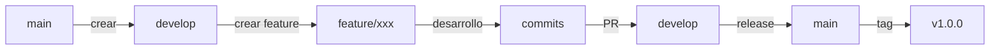

# 📚 Guía Completa de Git y GitHub - GRAVITEA ERP

## 📋 Tabla de Contenidos

1. [Introducción y Conceptos Fundamentales](#introducción-y-conceptos-fundamentales)
2. [Configuración Inicial](#configuración-inicial)
3. [Flujo de Trabajo del Proyecto](#flujo-de-trabajo-del-proyecto)
4. [Comandos Esenciales de Git](#comandos-esenciales-de-git)
5. [Gestión de Ramas (Branching)](#gestión-de-ramas-branching)
6. [Pull Requests y Code Reviews](#pull-requests-y-code-reviews)
7. [Versionado Semántico](#versionado-semántico)
8. [CI/CD/CT - Integración y Despliegue Continuo](#cicdct---integración-y-despliegue-continuo)
9. [GitHub Actions](#github-actions)
10. [Resolución de Conflictos](#resolución-de-conflictos)
11. [Mejores Prácticas](#mejores-prácticas)
12. [Troubleshooting](#troubleshooting)
13. [Herramientas y Extensiones](#herramientas-y-extensiones)
14. [Casos de Uso Específicos](#casos-de-uso-específicos)
15. [Checklists y Procedimientos](#checklists-y-procedimientos)

---

## 🎯 Introducción y Conceptos Fundamentales

### ¿Qué es Git?
Git es un **sistema de control de versiones distribuido** que permite:
- 📝 Rastrear cambios en el código
- 👥 Colaboración entre múltiples desarrolladores
- 🔄 Gestión de versiones y releases
- ⏪ Reversión de cambios cuando sea necesario
- 🌿 Desarrollo paralelo mediante ramas

### Conceptos Clave

#### **Repositorio (Repository)**
- **Local**: Copia del proyecto en tu computadora
- **Remoto**: Copia centralizada en GitHub

#### **Commit**
- Instantánea del código en un momento específico
- Incluye: cambios, autor, fecha, mensaje descriptivo

#### **Branch (Rama)**
- Línea independiente de desarrollo
- Permite trabajar sin afectar el código principal

#### **Merge**
- Combinar cambios de una rama en otra

#### **Pull Request (PR)**
- Solicitud para integrar cambios
- Permite revisión de código antes de fusionar

### Estados de los Archivos en Git

```
Untracked → Modified → Staged → Committed → Pushed
    ↑                     ↓
    └──── Ciclo de trabajo ────┘
```

1. **Untracked**: Archivos nuevos no rastreados
2. **Modified**: Archivos con cambios no preparados
3. **Staged**: Cambios listos para commit
4. **Committed**: Cambios guardados localmente
5. **Pushed**: Cambios enviados al repositorio remoto

---

## 🔧 Configuración Inicial

### 1. Instalar Git
```bash
# Windows
# Descargar desde: https://git-scm.com/download/win

# Linux
sudo apt-get install git  # Debian/Ubuntu
sudo yum install git       # RedHat/CentOS

# macOS
brew install git
```

### 2. Configuración Global
```bash
# Configurar nombre (OBLIGATORIO)
git config --global user.name "Tu Nombre"

# Configurar email (OBLIGATORIO)
git config --global user.email "tu.email@ejemplo.com"

# Editor por defecto
git config --global core.editor "code --wait"  # Visual Studio Code
git config --global core.editor "nano"         # Nano
git config --global core.editor "vim"          # Vim

# Configuración de línea de fin (IMPORTANTE para equipos mixtos)
# Windows
git config --global core.autocrlf true
# Linux/macOS
git config --global core.autocrlf input

# Colores en la terminal
git config --global color.ui auto

# Alias útiles
git config --global alias.st status
git config --global alias.co checkout
git config --global alias.br branch
git config --global alias.ci commit
git config --global alias.lg "log --oneline --graph --all"
```

### 3. Configuración de SSH para GitHub

```bash
# Generar clave SSH
ssh-keygen -t ed25519 -C "tu.email@ejemplo.com"

# Iniciar agente SSH
eval "$(ssh-agent -s)"

# Agregar clave al agente
ssh-add ~/.ssh/id_ed25519

# Copiar clave pública
cat ~/.ssh/id_ed25519.pub
# Copiar el output y agregarlo en GitHub Settings → SSH Keys

# Probar conexión
ssh -T git@github.com
```

### 4. Clonar el Repositorio
```bash
# HTTPS (más simple pero requiere credenciales)
git clone https://github.com/Bruno-Ghiberto/GRAVITEA-ERP.git

# SSH (recomendado una vez configurado)
git clone git@github.com:Bruno-Ghiberto/GRAVITEA-ERP.git

# Entrar al directorio
cd GRAVITEA-ERP
```

---

## 🔄 Flujo de Trabajo del Proyecto

### Estructura de Ramas

```
main (producción)
│
└── develop (integración)
    │
    ├── feature/inventory-backend (Bruno)
    ├── feature/inventory-frontend (Frontend Dev)
    └── feature/inventory-database (Database Dev)
```

### Flujo GitFlow Adaptado



### Workflow Diario del Desarrollador

#### 🌅 **Inicio del Día**
```bash
# 1. Actualizar tu rama con los últimos cambios
git checkout feature/inventory-backend  # Tu rama
git pull origin feature/inventory-backend
git pull origin develop
git merge develop

# 2. Verificar estado
git status
git log --oneline -5
```

#### 💻 **Durante el Desarrollo**
```bash
# Hacer cambios en el código...

# 3. Ver qué archivos cambiaste
git status
git diff                    # Ver cambios no preparados
git diff --staged          # Ver cambios preparados

# 4. Agregar cambios
git add archivo.js         # Archivo específico
git add .                  # Todos los archivos
git add -p                 # Agregar interactivamente

# 5. Hacer commit
git commit -m "feat(inventory): agregar validación de productos"
```

#### 🌙 **Fin del Día**
```bash
# 6. Push a tu rama
git push origin feature/inventory-backend

# 7. Crear Pull Request si está listo
# Ir a GitHub y crear PR hacia develop
```

---

## 💡 Comandos Esenciales de Git

### Comandos Básicos

#### **Información y Estado**
```bash
git status                  # Estado actual del repositorio
git status -s              # Estado resumido
git log                    # Historial de commits
git log --oneline          # Historial resumido
git log --graph --all      # Historial gráfico de todas las ramas
git log -p -2              # Últimos 2 commits con cambios
git log --since="2 weeks"  # Commits de las últimas 2 semanas
git show                   # Detalles del último commit
git show abc123            # Detalles de commit específico
git diff                   # Cambios no preparados
git diff --staged          # Cambios preparados
git diff branch1 branch2   # Diferencias entre ramas
```

#### **Gestión de Cambios**
```bash
# Agregar archivos
git add archivo.txt        # Archivo específico
git add *.js              # Todos los .js
git add .                 # Todo
git add -A                # Todo incluyendo eliminados
git add -p                # Modo interactivo

# Commits
git commit -m "mensaje"    # Commit con mensaje
git commit -am "mensaje"   # Add + commit (solo tracked files)
git commit --amend         # Modificar último commit
git commit --amend --no-edit  # Modificar sin cambiar mensaje

# Deshacer cambios
git restore archivo.txt    # Descartar cambios locales
git restore --staged archivo.txt  # Quitar de staging
git reset HEAD~1          # Deshacer último commit (mantiene cambios)
git reset --hard HEAD~1   # Deshacer último commit (elimina cambios)
git revert abc123         # Crear commit que revierte otro
```

### Comandos de Ramas

```bash
# Listar ramas
git branch                 # Ramas locales
git branch -a             # Todas las ramas (locales + remotas)
git branch -v             # Ramas con último commit
git branch --merged       # Ramas ya fusionadas

# Crear y cambiar ramas
git branch nueva-rama      # Crear rama
git checkout nueva-rama    # Cambiar a rama
git checkout -b nueva-rama # Crear y cambiar
git switch nueva-rama      # Cambiar (comando nuevo)
git switch -c nueva-rama   # Crear y cambiar (comando nuevo)

# Eliminar ramas
git branch -d rama        # Eliminar rama local (seguro)
git branch -D rama        # Eliminar rama local (forzado)
git push origin --delete rama  # Eliminar rama remota

# Fusionar ramas
git merge rama            # Fusionar rama en actual
git merge --no-ff rama    # Fusionar sin fast-forward
git merge --abort         # Abortar fusión en conflicto
```

### Comandos Remotos

```bash
# Ver remotos
git remote -v             # Ver URLs de remotos
git remote show origin    # Detalles del remoto

# Fetch y Pull
git fetch                 # Traer cambios sin fusionar
git fetch --all          # Traer de todos los remotos
git pull                 # Fetch + merge
git pull --rebase        # Fetch + rebase

# Push
git push                 # Enviar cambios
git push -u origin rama  # Establecer upstream y push
git push --force         # Push forzado (PELIGROSO)
git push --force-with-lease  # Push forzado seguro
```

### Comandos Avanzados

```bash
# Stash (guardar temporalmente)
git stash                # Guardar cambios temporalmente
git stash save "mensaje" # Guardar con descripción
git stash list          # Listar stashes
git stash apply         # Aplicar último stash
git stash pop           # Aplicar y eliminar stash
git stash drop          # Eliminar stash

# Cherry-pick (traer commit específico)
git cherry-pick abc123   # Aplicar commit en rama actual

# Rebase (reorganizar historia)
git rebase develop       # Reorganizar sobre develop
git rebase -i HEAD~3    # Rebase interactivo últimos 3 commits

# Bisect (encontrar bug)
git bisect start        # Iniciar búsqueda
git bisect bad          # Marcar commit malo
git bisect good abc123  # Marcar commit bueno
git bisect reset        # Terminar búsqueda

# Reflog (historial de referencias)
git reflog              # Ver historial de HEAD
git reset --hard HEAD@{2}  # Volver a estado anterior
```

---

## 🌿 Gestión de Ramas (Branching)

### Estrategia de Ramas del Proyecto

#### **Ramas Principales**
- `main`: Código en producción
- `develop`: Integración y pruebas

#### **Ramas de Feature**
- Nomenclatura: `feature/modulo-componente`
- Ejemplos:
  - `feature/inventory-backend`
  - `feature/inventory-frontend`
  - `feature/inventory-database`

#### **Ramas de Hotfix**
- Nomenclatura: `hotfix/descripcion-corta`
- Se crean desde `main`
- Se fusionan en `main` Y `develop`

#### **Ramas de Release**
- Nomenclatura: `release/v1.0.0`
- Se crean desde `develop`
- Se fusionan en `main` y `develop`

### Flujos de Trabajo por Tipo de Rama

#### **Feature Branch Workflow**
```bash
# 1. Crear rama desde develop
git checkout develop
git pull origin develop
git checkout -b feature/nueva-funcionalidad

# 2. Trabajar y hacer commits
git add .
git commit -m "feat: agregar nueva funcionalidad"

# 3. Mantener actualizada con develop
git fetch origin develop
git merge origin/develop  # o git rebase origin/develop

# 4. Push y crear PR
git push -u origin feature/nueva-funcionalidad
# Crear PR en GitHub hacia develop
```

#### **Hotfix Workflow**
```bash
# 1. Crear desde main
git checkout main
git pull origin main
git checkout -b hotfix/corregir-login

# 2. Hacer la corrección
git add .
git commit -m "fix: corregir error crítico en login"

# 3. Push y PR a main
git push -u origin hotfix/corregir-login
# PR hacia main

# 4. Después de aprobar, también fusionar en develop
git checkout develop
git merge hotfix/corregir-login
git push origin develop
```

#### **Release Workflow**
```bash
# 1. Crear desde develop cuando esté listo
git checkout develop
git pull origin develop
git checkout -b release/v1.0.0

# 2. Preparar release (actualizar versión, etc.)
# Actualizar package.json, README, etc.
git commit -am "chore: preparar release v1.0.0"

# 3. Push y PR a main
git push -u origin release/v1.0.0
# PR hacia main

# 4. Después de aprobar, tag y fusionar en develop
git checkout main
git pull origin main
git tag -a v1.0.0 -m "Release version 1.0.0"
git push origin v1.0.0

git checkout develop
git merge release/v1.0.0
git push origin develop
```

---

## 🔍 Pull Requests y Code Reviews

### Creación de Pull Requests

#### **Antes de Crear un PR**
```bash
# 1. Asegurar que tu rama esté actualizada
git pull origin develop
git merge develop  # o rebase

# 2. Ejecutar pruebas localmente
npm test
npm run lint

# 3. Revisar tus cambios
git diff develop..HEAD
git log develop..HEAD --oneline

# 4. Squash commits si es necesario
git rebase -i develop  # Combinar commits relacionados
```

#### **Crear PR en GitHub**

1. Ir a: https://github.com/Bruno-Ghiberto/GRAVITEA-ERP
2. Click en "Pull requests" → "New pull request"
3. Seleccionar: `base: develop` ← `compare: tu-rama`
4. Completar la plantilla:

```markdown
## 📋 Descripción
Breve descripción de los cambios realizados.

## 🎯 Tipo de Cambio
- [ ] 🐛 Bug fix
- [ ] ✨ Nueva funcionalidad
- [ ] 🔧 Refactoring
- [ ] 📚 Documentación
- [ ] 🎨 UI/UX
- [ ] ⚡ Performance
- [ ] 🔒 Seguridad

## 💡 Cambios Realizados
- Cambio 1
- Cambio 2
- Cambio 3

## 🧪 Testing
- [ ] Pruebas unitarias pasando
- [ ] Pruebas de integración pasando
- [ ] Pruebas manuales realizadas

## 📸 Screenshots (si aplica)
[Agregar imágenes si hay cambios visuales]

## ✅ Checklist
- [ ] Mi código sigue el estilo del proyecto
- [ ] He realizado auto-revisión
- [ ] He comentado código complejo
- [ ] He actualizado la documentación
- [ ] Mis cambios no generan warnings
- [ ] He agregado tests que prueban mi fix/feature
- [ ] Todos los tests pasan localmente
- [ ] No hay conflictos con develop

## 🔗 Issues Relacionados
Closes #123  (si resuelve un issue)
```

### Proceso de Code Review

#### **Como Revisor**

##### **Qué Revisar**
1. **Funcionalidad**
   - ¿El código hace lo que debe hacer?
   - ¿Resuelve el problema planteado?

2. **Diseño**
   - ¿La arquitectura es apropiada?
   - ¿Sigue los patrones del proyecto?

3. **Complejidad**
   - ¿Es fácil de entender?
   - ¿Se puede simplificar?

4. **Tests**
   - ¿Hay tests suficientes?
   - ¿Los tests son efectivos?

5. **Nomenclatura**
   - ¿Los nombres son descriptivos?
   - ¿Siguen las convenciones?

6. **Comentarios**
   - ¿Los comentarios son útiles?
   - ¿Explican el "por qué"?

7. **Documentación**
   - ¿Se actualizó la documentación?
   - ¿Los cambios están documentados?

##### **Cómo Comentar**
```markdown
# Sugerencia (no bloqueante)
💡 **Sugerencia**: Considera usar un Map en lugar de un objeto para mejor performance.

# Pregunta
❓ **Pregunta**: ¿Por qué elegiste este enfoque en lugar de usar el patrón Factory?

# Issue (debe corregirse)
🚨 **Issue**: Esta función puede causar un memory leak. Necesita cleanup.

# Nitpick (opcional)
📝 **Nit**: Typo en el comentario: "fucntion" → "function"

# Aprobación con sugerencias
✅ **LGTM con sugerencias menores**: El código se ve bien, pero considera los comentarios arriba.
```

#### **Como Autor del PR**

##### **Responder a Comentarios**
```markdown
# Aceptar sugerencia
✅ Buena idea, actualizado en commit abc123

# Explicar decisión
📝 Elegí este enfoque porque [razón]. ¿Te parece bien o prefieres que lo cambie?

# Pedir clarificación
❓ No estoy seguro de entender. ¿Podrías dar un ejemplo?

# Marcar como resuelto
✔️ Resuelto en commit def456
```

### Comandos Git para PRs

```bash
# Actualizar PR con cambios de develop
git checkout tu-rama
git pull origin develop
git merge develop
git push origin tu-rama

# Aplicar sugerencias del review
git add archivos-modificados
git commit -m "fix: aplicar sugerencias del code review"
git push origin tu-rama

# Squash commits antes de merge (si se requiere)
git rebase -i develop
# Marcar commits para squash
git push --force-with-lease origin tu-rama
```

---

## 📦 Versionado Semántico

### Formato: MAJOR.MINOR.PATCH

```
v1.2.3
│ │ └── PATCH: Correcciones de bugs compatibles
│ └──── MINOR: Nueva funcionalidad compatible
└────── MAJOR: Cambios incompatibles con versiones anteriores
```

### Reglas de Versionado

#### **PATCH (v1.0.X)**
- Correcciones de bugs
- Mejoras menores de performance
- Actualizaciones de documentación

#### **MINOR (v1.X.0)**
- Nueva funcionalidad
- Deprecación de features (sin eliminar)
- Mejoras sustanciales

#### **MAJOR (vX.0.0)**
- Cambios breaking
- Rediseño de API
- Eliminación de funcionalidad deprecada

### Gestión de Versiones

```bash
# Crear tag de versión
git tag -a v1.0.0 -m "Release: Primera versión estable"
git push origin v1.0.0

# Listar versiones
git tag
git tag -l "v1.*"

# Ver detalles de versión
git show v1.0.0

# Eliminar tag
git tag -d v1.0.0              # Local
git push origin --delete v1.0.0 # Remoto
```

### Pre-releases y Builds

```
v1.0.0-alpha    # Alpha release
v1.0.0-beta.1   # Beta release
v1.0.0-rc.1     # Release candidate
v1.0.0+build.123 # Build metadata
```

---

## 🚀 CI/CD/CT - Integración y Despliegue Continuo

### Conceptos Fundamentales

#### **CI - Continuous Integration**
- Integración automática de código
- Ejecución de tests en cada push
- Detección temprana de errores

#### **CD - Continuous Delivery/Deployment**
- **Delivery**: Código listo para producción
- **Deployment**: Despliegue automático a producción

#### **CT - Continuous Testing**
- Tests automatizados en todo el pipeline
- Tests unitarios, integración, E2E

### Pipeline CI/CD para el Proyecto

```yaml
# Flujo del Pipeline
1. Push/PR → 2. Build → 3. Test → 4. Deploy → 5. Monitor
```

#### **Etapa 1: Build**
```yaml
build:
  - Instalar dependencias
  - Compilar código
  - Generar artefactos
  - Verificar sintaxis
```

#### **Etapa 2: Test**
```yaml
test:
  - Tests unitarios
  - Tests de integración
  - Análisis de código (linting)
  - Cobertura de código
  - Tests de seguridad
```

#### **Etapa 3: Deploy**
```yaml
deploy:
  desarrollo:
    - branch: develop
    - ambiente: staging
    - automático: true

  producción:
    - branch: main
    - ambiente: production
    - automático: false (requiere aprobación)
```

---

## 🤖 GitHub Actions

### Configuración Básica

Crear archivo: `.github/workflows/ci.yml`

```yaml
name: CI/CD Pipeline

# Cuándo ejecutar
on:
  push:
    branches: [ main, develop ]
  pull_request:
    branches: [ develop ]

  # Permitir ejecución manual
  workflow_dispatch:

# Variables de entorno
env:
  NODE_VERSION: '18.x'
  PYTHON_VERSION: '3.10'

jobs:
  # Job de Testing
  test:
    name: Test Suite
    runs-on: ubuntu-latest

    strategy:
      matrix:
        node-version: [16.x, 18.x, 20.x]

    steps:
      # 1. Checkout código
      - name: Checkout código
        uses: actions/checkout@v3

      # 2. Setup Node.js
      - name: Setup Node.js
        uses: actions/setup-node@v3
        with:
          node-version: ${{ matrix.node-version }}
          cache: 'npm'

      # 3. Instalar dependencias
      - name: Instalar dependencias
        run: npm ci

      # 4. Ejecutar linter
      - name: Lint
        run: npm run lint

      # 5. Ejecutar tests
      - name: Tests
        run: npm test

      # 6. Generar reporte de cobertura
      - name: Cobertura
        run: npm run coverage

      # 7. Subir cobertura a Codecov
      - name: Upload coverage
        uses: codecov/codecov-action@v3
        with:
          file: ./coverage/lcov.info

  # Job de Build
  build:
    name: Build
    runs-on: ubuntu-latest
    needs: test  # Requiere que test pase

    steps:
      - uses: actions/checkout@v3

      - name: Setup Node.js
        uses: actions/setup-node@v3
        with:
          node-version: ${{ env.NODE_VERSION }}

      - name: Install & Build
        run: |
          npm ci
          npm run build

      # Guardar artefactos
      - name: Upload artifacts
        uses: actions/upload-artifact@v3
        with:
          name: build-files
          path: dist/

  # Job de Deploy (solo en main)
  deploy:
    name: Deploy to Production
    runs-on: ubuntu-latest
    needs: [test, build]
    if: github.ref == 'refs/heads/main'

    steps:
      - uses: actions/checkout@v3

      # Descargar artefactos del build
      - name: Download artifacts
        uses: actions/download-artifact@v3
        with:
          name: build-files
          path: dist/

      # Deploy (ejemplo con diferentes servicios)
      - name: Deploy to Server
        run: |
          echo "Deploying to production..."
          # Comandos de deploy específicos
```

### Workflows Específicos

#### **Workflow para PRs**
`.github/workflows/pr-validation.yml`

```yaml
name: PR Validation

on:
  pull_request:
    types: [opened, synchronize, reopened]

jobs:
  validate:
    runs-on: ubuntu-latest

    steps:
      - uses: actions/checkout@v3

      # Validar título del PR
      - name: Validate PR title
        uses: amannn/action-semantic-pull-request@v5
        env:
          GITHUB_TOKEN: ${{ secrets.GITHUB_TOKEN }}

      # Chequear tamaño del PR
      - name: Check PR size
        uses: codelytv/pr-size-labeler@v1
        with:
          GITHUB_TOKEN: ${{ secrets.GITHUB_TOKEN }}
          xs_label: 'size/XS'
          xs_max_size: 10
          s_label: 'size/S'
          s_max_size: 100
          m_label: 'size/M'
          m_max_size: 500
          l_label: 'size/L'
          l_max_size: 1000
          xl_label: 'size/XL'

      # Auto-assign reviewers
      - name: Auto-assign reviewers
        uses: kentaro-m/auto-assign-action@v1.2.5
        with:
          configuration-path: '.github/auto-assign.yml'
```

#### **Workflow de Release**
`.github/workflows/release.yml`

```yaml
name: Release

on:
  push:
    tags:
      - 'v*'

jobs:
  release:
    runs-on: ubuntu-latest

    steps:
      - uses: actions/checkout@v3

      # Crear release en GitHub
      - name: Create Release
        uses: actions/create-release@v1
        env:
          GITHUB_TOKEN: ${{ secrets.GITHUB_TOKEN }}
        with:
          tag_name: ${{ github.ref }}
          release_name: Release ${{ github.ref }}
          body: |
            ## Cambios en esta versión
            - Feature 1
            - Feature 2
            - Bug fixes
          draft: false
          prerelease: false
```

### Secretos y Variables

```yaml
# Configurar en: Settings → Secrets and variables → Actions

# Secretos (encriptados)
secrets:
  DATABASE_URL
  API_KEY
  DEPLOY_TOKEN

# Variables (texto plano)
vars:
  ENVIRONMENT
  APP_NAME
  VERSION
```

Uso en workflows:
```yaml
- name: Use secrets
  env:
    DB_URL: ${{ secrets.DATABASE_URL }}
    API_KEY: ${{ secrets.API_KEY }}
  run: |
    echo "Connecting to database..."
    # El valor real está oculto
```

---

## 🔧 Resolución de Conflictos

### Tipos de Conflictos

#### **Conflicto de Merge**
Ocurre cuando dos ramas modifican las mismas líneas

#### **Conflicto de Rebase**
Similar al merge pero durante reorganización de commits

### Proceso de Resolución

#### **1. Identificar Conflictos**
```bash
git status
# Muestra archivos en conflicto

git diff
# Muestra marcadores de conflicto
```

#### **2. Entender los Marcadores**
```
<<<<<<< HEAD
Código en tu rama actual
=======
Código en la rama que estás fusionando
>>>>>>> develop
```

#### **3. Resolver Manualmente**
```javascript
// Archivo con conflicto
<<<<<<< HEAD
const precio = 100;
=======
const precio = 150;
>>>>>>> develop

// Resolución (elegir o combinar)
const precio = 150; // Decidir cuál es correcto
```

#### **4. Marcar como Resuelto**
```bash
# Después de editar
git add archivo-resuelto.js
git commit -m "fix: resolver conflicto de merge"
```

### Estrategias de Resolución

#### **Estrategia 1: Aceptar Todo de Una Rama**
```bash
# Aceptar todo de tu rama
git checkout --ours archivo.js

# Aceptar todo de la otra rama
git checkout --theirs archivo.js

git add archivo.js
git commit
```

#### **Estrategia 2: Usar Herramienta de Merge**
```bash
# Configurar herramienta
git config --global merge.tool vscode
git config --global mergetool.vscode.cmd 'code --wait $MERGED'

# Usar herramienta
git mergetool
```

#### **Estrategia 3: Abortar y Reintentando**
```bash
# Abortar merge
git merge --abort

# Actualizar y reintentar
git pull origin develop
git merge develop
```

### Prevención de Conflictos

1. **Comunicación**: Coordinar con el equipo qué archivos se modifican
2. **Pull frecuente**: Actualizar tu rama regularmente
3. **Commits pequeños**: Cambios más pequeños = menos conflictos
4. **Feature flags**: Permitir desarrollo paralelo sin conflictos
5. **Modularización**: Código bien separado reduce conflictos

---

## ✅ Mejores Prácticas

### Commits

#### **Mensajes de Commit**
```bash
# Formato
<tipo>(<alcance>): <descripción corta>

<descripción larga opcional>

<footer opcional>
```

#### **Tipos de Commit**
- `feat`: Nueva funcionalidad
- `fix`: Corrección de bug
- `docs`: Cambios en documentación
- `style`: Formato (no afecta lógica)
- `refactor`: Refactoring de código
- `test`: Agregar o corregir tests
- `chore`: Tareas de mantenimiento
- `perf`: Mejoras de performance
- `ci`: Cambios en CI/CD
- `build`: Cambios en build system
- `revert`: Revertir commit anterior

#### **Ejemplos Buenos vs Malos**
```bash
# ❌ MALO
git commit -m "cambios"
git commit -m "fix"
git commit -m "actualizacion de codigo"

# ✅ BUENO
git commit -m "feat(auth): implementar autenticación JWT"
git commit -m "fix(inventory): corregir cálculo de stock"
git commit -m "docs(api): actualizar documentación de endpoints"
```

### Reglas de Oro

1. **Nunca hacer push a main directamente**
2. **Siempre trabajar en rama de feature**
3. **Un commit = un cambio lógico**
4. **Hacer pull antes de push**
5. **Revisar cambios antes de commit**
6. **No commitear secretos o credenciales**
7. **Mantener historia limpia**
8. **Tests deben pasar antes de push**
9. **Documentar cambios significativos**
10. **Usar .gitignore apropiadamente**

### Flujo de Trabajo Seguro

```bash
# ANTES de empezar a trabajar
git checkout develop
git pull origin develop
git checkout -b feature/nueva

# DURANTE el trabajo
git add -p  # Revisar cambios
git commit -m "feat: mensaje descriptivo"

# ANTES de hacer push
git pull origin develop
git merge develop
npm test
git push origin feature/nueva

# DESPUÉS de aprobar PR
git checkout develop
git pull origin develop
git branch -d feature/nueva  # Limpiar rama local
```

### Code Review Checklist

#### **Para el Autor**
- [ ] ¿El código compila sin warnings?
- [ ] ¿Los tests pasan?
- [ ] ¿El código es autodocumentado?
- [ ] ¿Seguí las convenciones del proyecto?
- [ ] ¿Actualicé la documentación?
- [ ] ¿Consideré casos edge?
- [ ] ¿El PR es de tamaño manejable?

#### **Para el Revisor**
- [ ] ¿El código hace lo que dice?
- [ ] ¿Hay tests suficientes?
- [ ] ¿El código es mantenible?
- [ ] ¿Hay código duplicado?
- [ ] ¿Los nombres son descriptivos?
- [ ] ¿Hay potenciales problemas de seguridad?
- [ ] ¿El performance es aceptable?

---

## 🔨 Troubleshooting

### Problemas Comunes y Soluciones

#### **"Detached HEAD"**
```bash
# Problema: No estás en ninguna rama
git branch  # Muestra * (HEAD detached at abc123)

# Solución: Crear rama desde el estado actual
git checkout -b nueva-rama
# O volver a una rama existente
git checkout main
```

#### **"Cannot push - rejected"**
```bash
# Problema: El remoto tiene cambios que no tienes
# Solución:
git pull origin tu-rama
# Resolver conflictos si hay
git push origin tu-rama
```

#### **"Changes would be overwritten"**
```bash
# Problema: Tienes cambios locales no guardados
# Solución 1: Guardar temporalmente
git stash
git pull
git stash pop

# Solución 2: Commitear cambios
git add .
git commit -m "WIP: trabajo en progreso"
git pull
```

#### **Eliminé archivos por error**
```bash
# Si no has hecho commit:
git checkout -- archivo.txt

# Si ya hiciste commit:
git revert HEAD

# Si ya hiciste push:
git revert abc123
git push
```

#### **Commitee en la rama equivocada**
```bash
# Mover último commit a otra rama
git checkout rama-correcta
git cherry-pick rama-incorrecta
git checkout rama-incorrecta
git reset --hard HEAD~1
```

#### **Mensaje de commit incorrecto**
```bash
# Último commit (no pushed)
git commit --amend -m "Mensaje correcto"

# Commit ya pushed (NO recomendado)
# Mejor hacer nuevo commit aclarando
```

#### **Necesito deshacer último push**
```bash
# PELIGROSO: Coordinar con equipo
git reset --hard HEAD~1
git push --force-with-lease

# Más seguro: Revertir
git revert HEAD
git push
```

#### **Archivos grandes no me dejan hacer push**
```bash
# Error: File too large
# Solución: Usar Git LFS
git lfs track "*.pdf"
git add .gitattributes
git add archivo-grande.pdf
git commit -m "feat: agregar archivo con LFS"
```

### Recuperación de Desastres

#### **Recuperar rama eliminada**
```bash
# Buscar el commit
git reflog
# Encontrar el SHA del último commit de la rama

# Recrear la rama
git checkout -b rama-recuperada abc123
```

#### **Recuperar commits perdidos**
```bash
# Ver historial completo
git reflog

# Volver a un estado anterior
git reset --hard HEAD@{2}
```

#### **Limpiar repositorio**
```bash
# Eliminar archivos no rastreados
git clean -n  # Dry run (ver qué se eliminará)
git clean -f  # Eliminar archivos
git clean -fd # Eliminar archivos y directorios

# Resetear todo al último commit
git reset --hard HEAD
```

---

## 🛠️ Herramientas y Extensiones

### IDEs y Editores

#### **Visual Studio Code**
```bash
# Extensiones recomendadas
- GitLens: Visualización avanzada de Git
- Git Graph: Historial gráfico
- Git History: Historial de archivos
- Conventional Commits: Ayuda con mensajes
```

#### **Configuración VS Code**
```json
// settings.json
{
  "git.autofetch": true,
  "git.confirmSync": false,
  "git.enableSmartCommit": true,
  "git.postCommitCommand": "push",
  "gitlens.hovers.currentLine.over": "line",
  "gitlens.codeLens.enabled": true
}
```

### Herramientas de Línea de Comandos

#### **tig** - Interface de texto para Git
```bash
# Instalar
apt-get install tig  # Linux
brew install tig     # macOS

# Usar
tig              # Vista general
tig status       # Como git status interactivo
tig blame file   # Blame interactivo
```

#### **lazygit** - Terminal UI para Git
```bash
# Instalar
brew install lazygit  # macOS
choco install lazygit # Windows

# Usar
lazygit  # Interface completa
```

#### **gh** - GitHub CLI
```bash
# Instalar
brew install gh  # macOS
choco install gh # Windows

# Autenticar
gh auth login

# Comandos útiles
gh repo create
gh pr create
gh pr list
gh pr checkout 123
gh issue create
gh workflow run
```

### Herramientas GUI

- **GitKraken**: Interface gráfica multiplataforma
- **SourceTree**: GUI gratuita de Atlassian
- **GitHub Desktop**: Cliente oficial de GitHub
- **Tower**: Cliente Git profesional
- **Fork**: Cliente Git rápido y ligero

### Configuración de Hooks

#### **Pre-commit Hook**
`.git/hooks/pre-commit`

```bash
#!/bin/sh
# Ejecutar tests antes de commit
npm test
if [ $? -ne 0 ]; then
  echo "Tests fallaron. Commit cancelado."
  exit 1
fi

# Ejecutar linter
npm run lint
if [ $? -ne 0 ]; then
  echo "Linter falló. Commit cancelado."
  exit 1
fi
```

#### **Commit-msg Hook**
`.git/hooks/commit-msg`

```bash
#!/bin/sh
# Validar formato de mensaje de commit
commit_regex='^(feat|fix|docs|style|refactor|test|chore)(\(.+\))?: .{1,50}'

if ! grep -qE "$commit_regex" "$1"; then
  echo "Mensaje de commit inválido!"
  echo "Formato: tipo(alcance): descripción"
  exit 1
fi
```

### Herramientas de Análisis

#### **git-stats** - Estadísticas de Git
```bash
npm install -g git-stats
git-stats
```

#### **git-quick-stats** - Estadísticas rápidas
```bash
git clone https://github.com/arzzen/git-quick-stats.git
cd git-quick-stats
make install
git-quick-stats
```

---

## 📚 Casos de Uso Específicos

### Caso 1: Iniciar Nueva Feature

```bash
# Desarrollador Backend (Bruno)
git checkout develop
git pull origin develop
git checkout -b feature/inventory-api
# Trabajar en backend/src/api/inventory.js
git add backend/src/api/inventory.js
git commit -m "feat(api): crear endpoints CRUD para inventario"
git push -u origin feature/inventory-api

# Desarrollador Frontend
git checkout develop
git pull origin develop
git checkout -b feature/inventory-ui
# Trabajar en frontend/src/components/Inventory.jsx
git add frontend/src/components/Inventory.jsx
git commit -m "feat(ui): crear componente de lista de inventario"
git push -u origin feature/inventory-ui

# Desarrollador Database
git checkout develop
git pull origin develop
git checkout -b feature/inventory-schema
# Trabajar en database/migrations/001_create_inventory.sql
git add database/migrations/001_create_inventory.sql
git commit -m "feat(db): crear schema de tablas de inventario"
git push -u origin feature/inventory-schema
```

### Caso 2: Hotfix en Producción

```bash
# 1. Detectan bug crítico en producción
git checkout main
git pull origin main
git checkout -b hotfix/fix-login-crash

# 2. Arreglar el bug
# Editar backend/src/auth/login.js
git add backend/src/auth/login.js
git commit -m "fix(auth): prevenir crash cuando password es null"

# 3. Probar localmente
npm test

# 4. Push y PR urgente
git push -u origin hotfix/fix-login-crash
# Crear PR hacia main con prioridad URGENT

# 5. Después de merge a main
git checkout develop
git pull origin main
git push origin develop
```

### Caso 3: Preparar Release

```bash
# 1. Feature freeze - no más features nuevas
git checkout develop
git pull origin develop
git checkout -b release/v1.0.0

# 2. Actualizar versión
# Editar package.json: version: "1.0.0"
git add package.json
git commit -m "chore: bump version to 1.0.0"

# 3. Actualizar CHANGELOG
echo "## v1.0.0 - $(date +%Y-%m-%d)" >> CHANGELOG.md
echo "### Features" >> CHANGELOG.md
echo "- Gestión completa de inventario" >> CHANGELOG.md
echo "- Sistema de autenticación" >> CHANGELOG.md
echo "### Fixes" >> CHANGELOG.md
echo "- Correcciones menores de UI" >> CHANGELOG.md
git add CHANGELOG.md
git commit -m "docs: actualizar CHANGELOG para v1.0.0"

# 4. Push y crear PR
git push -u origin release/v1.0.0
# PR hacia main

# 5. Después de aprobar
git checkout main
git pull origin main
git tag -a v1.0.0 -m "Release version 1.0.0 - Módulo Inventario"
git push origin v1.0.0

# 6. Actualizar develop
git checkout develop
git merge main
git push origin develop
```

### Caso 4: Colaboración en Feature Compartida

```bash
# Desarrollador 1 inicia
git checkout -b feature/shared-feature
git push -u origin feature/shared-feature

# Desarrollador 2 colabora
git fetch origin
git checkout feature/shared-feature
git pull origin feature/shared-feature

# Trabajo simultáneo con comunicación
# Dev 1: "Voy a trabajar en el archivo A"
# Dev 2: "Yo trabajo en el archivo B"

# Dev 1
git add archivoA.js
git commit -m "feat: implementar parte A"
git push

# Dev 2
git pull  # Traer cambios de Dev 1
git add archivoB.js
git commit -m "feat: implementar parte B"
git push
```

### Caso 5: Rollback de Producción

```bash
# Opción 1: Revertir último deploy
git checkout main
git pull origin main
git revert HEAD
git push origin main
# Trigger nuevo deploy

# Opción 2: Volver a versión anterior conocida
git checkout main
git reset --hard v0.9.5  # Versión estable anterior
git push --force-with-lease origin main

# Opción 3: Cherry-pick fix específico
git checkout main
git cherry-pick abc123  # Commit con el fix
git push origin main
```

---

## 📋 Checklists y Procedimientos

### Checklist Diario para Desarrolladores

#### **Inicio del Día**
- [ ] `git pull origin develop`
- [ ] `git pull origin mi-rama`
- [ ] `git status` - Verificar estado limpio
- [ ] Revisar PRs asignados para review
- [ ] Verificar CI/CD status

#### **Antes de Cada Commit**
- [ ] `git diff` - Revisar cambios
- [ ] Ejecutar tests localmente
- [ ] Ejecutar linter
- [ ] Verificar que no hay console.logs
- [ ] Verificar que no hay credenciales

#### **Fin del Día**
- [ ] Commit de trabajo en progreso si necesario
- [ ] `git push origin mi-rama`
- [ ] Actualizar status en Jira/Trello
- [ ] Comunicar bloqueos al equipo

### Checklist para Pull Requests

#### **Antes de Crear PR**
- [ ] Rama actualizada con develop
- [ ] Tests pasando (locales y CI)
- [ ] Código cumple con estándares
- [ ] Sin conflictos de merge
- [ ] Commits con mensajes apropiados
- [ ] Documentación actualizada

#### **Crear PR**
- [ ] Título descriptivo
- [ ] Descripción completa
- [ ] Labels apropiados
- [ ] Asignar revisores
- [ ] Vincular issues relacionados
- [ ] Screenshots si hay cambios UI

#### **Después de Aprobación**
- [ ] Squash commits si necesario
- [ ] Actualizar con últimos cambios de develop
- [ ] Verificar CI verde
- [ ] Merge con estrategia acordada
- [ ] Eliminar rama si ya no se necesita
- [ ] Actualizar documentación de release

### Procedimiento de Release

#### **1 Semana Antes**
- [ ] Feature freeze anunciado
- [ ] Lista de features incluidas
- [ ] Testing plan definido
- [ ] Rollback plan preparado

#### **3 Días Antes**
- [ ] Crear rama release/vX.X.X
- [ ] Actualizar versiones
- [ ] Testing en staging
- [ ] Preparar notas de release

#### **Día de Release**
- [ ] PR de release aprobado
- [ ] Tests en staging pasando
- [ ] Backup de producción
- [ ] Merge a main
- [ ] Tag de versión creado
- [ ] Deploy a producción
- [ ] Verificación post-deploy
- [ ] Actualizar develop con main
- [ ] Comunicar al equipo
- [ ] Actualizar documentación externa

### Procedimiento de Hotfix

#### **Detección**
- [ ] Severidad evaluada (P0, P1, P2, P3)
- [ ] Impacto documentado
- [ ] Equipo notificado

#### **Implementación**
- [ ] Rama hotfix desde main
- [ ] Fix implementado
- [ ] Test específico agregado
- [ ] Review acelerado

#### **Deploy**
- [ ] PR a main creado
- [ ] Aprobación de emergencia
- [ ] Deploy a producción
- [ ] Verificación inmediata
- [ ] Merge a develop
- [ ] Post-mortem agendado

---

## 🚨 Comandos de Emergencia

### Break Glass - Solo en Emergencias

```bash
# RESETEAR TODO (DESTRUCTIVO)
git fetch origin
git reset --hard origin/main

# ELIMINAR TODOS LOS CAMBIOS LOCALES
git clean -xfd
git reset --hard

# SINCRONIZAR FORZADAMENTE CON REMOTO
git fetch origin
git reset --hard origin/develop
git clean -fd

# RECUPERAR DE BACKUP
git clone https://github.com/Bruno-Ghiberto/GRAVITEA-ERP.git nuevo-directorio

# CAMBIAR AUTOR DE ÚLTIMO COMMIT
git commit --amend --author="Nombre <email@ejemplo.com>"

# ELIMINAR ARCHIVO DE TODA LA HISTORIA (PELIGROSO)
git filter-branch --force --index-filter \
  'git rm --cached --ignore-unmatch path/to/file' \
  --prune-empty --tag-name-filter cat -- --all
```

---

## 📞 Contactos y Recursos

### Equipo de Desarrollo

| Rol | Nombre | GitHub | Responsabilidad |
|-----|--------|--------|-----------------|
| Git Admin | Bruno | @Bruno-Ghiberto | Backend, Git |
| Frontend Dev | TBD | @username | UI/UX |
| Database Dev | TBD | @username | Schema, Migrations |
| DevOps | TBD | @username | CI/CD, Deploy |

### Recursos Útiles

- **Documentación Git**: https://git-scm.com/doc
- **GitHub Guides**: https://guides.github.com/
- **Atlassian Git Tutorial**: https://www.atlassian.com/git/tutorials
- **Oh Shit, Git!?!**: https://ohshitgit.com/
- **Learn Git Branching**: https://learngitbranching.js.org/
- **Conventional Commits**: https://www.conventionalcommits.org/

### Herramientas de Comunicación

- **Slack/Discord Canal**: #git-help
- **Issues**: https://github.com/Bruno-Ghiberto/GRAVITEA-ERP/issues
- **Wiki**: https://github.com/Bruno-Ghiberto/GRAVITEA-ERP/wiki

---

## 🎯 Quick Reference Card

### Comandos Más Usados

```bash
# Estado y Navegación
git status                      # Ver estado
git log --oneline -10          # Últimos 10 commits
git checkout rama              # Cambiar rama
git checkout -b nueva-rama     # Crear y cambiar

# Trabajo Diario
git pull                       # Actualizar
git add .                      # Preparar todo
git commit -m "tipo: mensaje"  # Commitear
git push                       # Enviar

# Colaboración
git fetch --all                # Traer todo
git merge develop              # Fusionar
git rebase develop             # Reorganizar
git cherry-pick abc123         # Traer commit

# Emergencias
git stash                      # Guardar temporal
git reset --hard HEAD          # Descartar cambios
git revert HEAD                # Revertir commit
git merge --abort              # Cancelar merge
```

### Flujo Visual

```
┌─────────────┐     ┌─────────────┐     ┌─────────────┐
│   DEVELOP   │────▶│   FEATURE   │────▶│   COMMIT    │
└─────────────┘     └─────────────┘     └─────────────┘
       ▲                    │                    │
       │                    ▼                    ▼
┌─────────────┐     ┌─────────────┐     ┌─────────────┐
│    MAIN     │◀────│     PR      │◀────│    PUSH     │
└─────────────┘     └─────────────┘     └─────────────┘
```

---

## 📝 Notas Finales

Esta guía es un documento vivo que debe actualizarse según:
- Cambios en el flujo de trabajo del equipo
- Nuevas herramientas adoptadas
- Lecciones aprendidas
- Feedback del equipo

**Última actualización**: Noviembre 2024
**Versión**: 1.0.0
**Mantenido por**: Bruno (Git Admin)

---

> 💡 **Recuerda**: Git es una herramienta poderosa. Con gran poder viene gran responsabilidad.
> Siempre puedes preguntar antes de ejecutar un comando destructivo.

---

*"El código es poesía, pero Git es la imprenta que la preserva para la posteridad."*

**¡Happy Coding! 🚀**