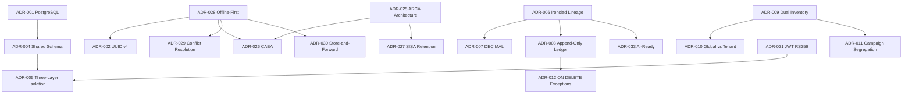

# Implementation Context: Architecture Decision Records (ADR)

**Branch**: `004-acopio-adr` | **Date**: 2026-03-17
**Spec**: `specs/004-acopio-adr/spec.md` | **Plan**: `specs/004-acopio-adr/plan.md`
**Target deliverable**: `Docs/Project Blueprint/Architecture Decision Records (ADR).md` (NEW FILE)

---

## 1. What You Are Writing

A single Markdown file (~800–1200 lines) that formalizes 35 architectural decisions for the GraviTea Acopio ERP. This is the **institutional memory** of the project — the "why" behind every significant technical choice.

**This is a documentation-only task.** No code, no migrations, no tests. The output is a navigable reference document read by developers, AI agents, architects, and product owners.

**Primary source of content**: `specs/004-acopio-adr/research.md` contains pre-extracted excerpts from all 5 source documents. Do not context-switch to the original source documents — research.md has everything you need. Use RAG only when a specific ADR needs supplementary technical detail not found in research.md (protocol names, regulatory specifics, etc.).

---

## 2. Source Files — What to Read Before Writing

| File | Purpose | Read When |
|------|---------|-----------|
| `specs/004-acopio-adr/research.md` | **PRIMARY** — all ADR content pre-extracted | Before starting any ADR section |
| `specs/004-acopio-adr/quickstart.md` | ADR template, writing order, 5 checkpoint gates, 12-item done criteria | Before starting, and at each gate |
| `specs/004-acopio-adr/tasks.md` | Task IDs, exact content requirements per ADR, acceptance scenario coverage | During writing (per-task reference) |
| `specs/004-acopio-adr/plan.md` | Per-ADR writing briefs, RAG query table, section-by-section plan | Before starting §4+; for rejected alternatives |

---

## 3. ADR Entry Template (Mandatory for Every ADR)

Every ADR MUST follow this exact structure, no exceptions:

```markdown
### ADR-NNN: Title

**Status**: Accepted | **Date**: 2026-03-17

**Context**: [2–4 sentences: the problem, need, or constraint that prompted this decision]

**Decision**: [1–3 sentences: what was decided, stated declaratively]

**Consequences**:
- (+) [Positive consequence 1]
- (+) [Positive consequence 2]
- (-) [Negative consequence 1]
- (-) [Negative consequence 2]

**Alternatives Considered**:
- [Alternative A] — Rejected because [specific rationale]
- [Alternative B] — Rejected because [specific rationale] (if multiple)

**Cross-References**: [Upstream document vX.Y Section Z.Z]
```

**Template Rules** (failure on any = Gate failure):
- Every field is mandatory — no omissions
- Context: problem/need/constraint (not the solution)
- Decision: declarative, present tense ("We use X", not "We decided to use X")
- Consequences: ≥1 positive, ≥1 negative — no one-sided entries
- Alternatives: ≥1 rejected option with a specific 1–2 sentence rationale
- Cross-References: exact format — "Vision v1.0 Section 2.3" or "Constitution Principle VII" or "spec-03 research Decision D-004"
- No "TBD", "TODO", "FIXME", "possibly", "might consider" anywhere

---

## 4. Writing Order (Do Not Deviate)

Write sections in this order — the §2 Index is ALWAYS written last (it derives from completed entries):

| Step | Section | Tasks | ADRs |
|------|---------|-------|------|
| 1 | §1 Document Metadata | T003 | — |
| 2 | §3 How to Read This Document (§3.1–§3.4) | T004–T007 | — |
| 3 | §2 ADR Index placeholder (35 TBD rows) | T008 | — |
| 4 | §4 Infrastructure (ADR-001–005) | T009–T013 | 5 |
| 5 | §5 Data Architecture (ADR-006–013) | T014–T021 | 8 |
| 6 | §6 Grain Domain (ADR-014–020) | T022–T028 | 7 |
| — | **Gate 2 verification** | T029 | — |
| 7 | §7 Security (ADR-021–024) | T030–T033 | 4 |
| 8 | §8 Fiscal Integration (ADR-025–027) | T034–T036 | 3 |
| — | **Gate 3 verification** | T037 | — |
| 9 | §9 Offline & Sync (ADR-028–030) | T038–T040 | 3 |
| 10 | §10 Performance (ADR-031–032) | T041–T042 | 2 |
| — | **Gate 4 verification** | T043 | — |
| 11 | §11 AI/ML Readiness (ADR-033–035) | T044–T046 | 3 |
| 12 | §12 Decision Dependency Graph (Mermaid) | T047 | — |
| 13 | §2 ADR Index (final population) | T048 | — |
| — | **Gate 5 + final checklist** | T049–T054 | — |

---

## 5. Section Drafting Instructions

### §1 Document Metadata (T003)

Write a metadata table at the top of the document:

```markdown
# Architecture Decision Records

## 1. Document Metadata

| Field | Value |
|-------|-------|
| Title | Architecture Decision Records |
| Version | 1.0 |
| Date | 2026-03-17 |
| Owner | GraviTea Architecture Team |
| Status | Accepted |
| Upstream Documents | Vision v1.0, PRD v1.0, Data Model v1.0, Constitution |
```

Add a 2–3 sentence scope statement: "This document captures architectural decisions from Vision v1.0, PRD v1.0, Data Model v1.0, the Constitution, and spec-03 domain research decisions (D-001–D-007). Each ADR entry formalizes a decision that is already implemented or committed; all entries are Accepted status."

---

### §3 How to Read This Document (T004–T007)

Write 4 subsections. See `specs/004-acopio-adr/quickstart.md` §4 for the exact outline.

**§3.1 ADR Format Template** (T004): Show the complete 7-field template from Section 3 of this file, using a fictional example ADR-000 to illustrate all fields. Label each field with its purpose.

**§3.2 Status Lifecycle** (T005):
- `Proposed` — decision under consideration, not yet committed
- `Accepted` — committed architectural decision; all entries in this document are Accepted
- `Superseded` — replaced by a newer ADR; original preserved for history
- `Deprecated` — no longer relevant; technology/context has changed

**§3.3 Cross-Reference Convention** (T006): Explain format "Document vX.Y Section Z.Z". List where to find each upstream document:

| Reference Format | File Location |
|-----------------|---------------|
| Constitution Principle N | `.specify/memory/constitution.md` |
| Vision v1.0 Section X.Y | `Docs/Project Blueprint/Product Vision & Scope.md` |
| PRD v1.0 Section X.Y | `Docs/Project Blueprint/PRD.md` |
| Data Model v1.0 Section X.Y | `Docs/Project Blueprint/Data Model & Domain Model.md` |
| spec-03 research Decision D-NNN | `specs/003-acopio-data-model/research.md` |

**§3.4 Supersession Rules** (T007): A new ADR supersedes an existing one by: (a) creating a new entry with status `Proposed` referencing the original by ID, (b) updating the original entry's status line to `Superseded by ADR-NNN`, and (c) leaving both entries in the document — the original for historical record, the new one for current guidance. A superseded ADR is never deleted.

---

### §2 ADR Index Placeholder (T008)

After §3, insert §2 with the table header and 35 placeholder rows:

```markdown
## 2. ADR Index

| ID | Title | Category | Status | Date |
|----|-------|----------|--------|------|
| ADR-001 | _(to be populated)_ | Infrastructure | Accepted | 2026-03-17 |
...
```

Populate all 35 rows as TBD placeholders now. T048 replaces them with real titles and anchors.

---

### §4 Infrastructure Decisions — ADR-001 through ADR-005 (T009–T013)

**Source**: `specs/004-acopio-adr/research.md` §4

**Critical domain facts for this section**:
- PostgreSQL 18.1 has native Row Level Security (RLS); MySQL and SQLite do not
- "Shared Database, Shared Schema, Hardened RLS" is the exact phrase from Data Model §1
- Three-layer isolation: Layer 1 = TenantBoundManager (ORM), Layer 2 = RLS (session variable `app.current_tenant_id`, SET LOCAL, transaction-scoped), Layer 3 = IDOR validation (JWT claims `iss`, `aud`, `exp` on every request)
- UUID v4 prevents sequential enumeration attacks AND eliminates sync collision risk between offline branches that might generate the same auto-increment ID

**ADR-001** (T009): PostgreSQL 18.1 as Primary Database
- Context: need for engine-enforced integrity, RLS capability, financial precision constraints
- Decision: PostgreSQL 18.1 (Cloud SQL Enterprise Plus) as the primary database
- Rejected: MySQL (no native RLS), SQLite (no concurrent multi-tenant writes), MSSQL (licensing cost, no RLS)
- Cross-ref: Constitution Principle I, Data Model v1.0 §1

**ADR-002** (T010): UUID v4 as Primary Key Strategy
- Context: offline-first architecture requires distributed ID generation; security requires non-enumerable IDs
- Decision: UUID v4 auto-generated on all entities
- Rejected: Auto-increment integer — sequential enumeration attack surface (IDOR vulnerability) AND sync conflicts between offline branches generating overlapping sequences
- Cross-ref: Data Model v1.0 §1 Metadata, Constitution Principle VII

**ADR-003** (T011): Modular Monolith via Django Apps (Not Microservices)
- Context: SMB team, need for clear module boundaries and independent testability
- Decision: Modular monolith using Django Apps (`acopio`, `cuentas`, `facturacion`, `sync`, `core`)
- Rejected: Microservices from day one — premature distribution complexity for SMB team; operational overhead (service mesh, inter-service auth, distributed tracing) incompatible with resource constraints
- Cross-ref: Constitution Principle III

**ADR-004** (T012): Shared Database / Shared Schema Multi-Tenancy
- Context: SaaS pricing requires affordable per-tenant cost
- Decision: Single database, shared schema, PostgreSQL RLS enforces tenant isolation
- Rejected: Schema-per-tenant (migration complexity scales with tenant count, connection pooling overhead), Database-per-tenant (cost per tenant — incompatible with SMB SaaS pricing model)
- Cross-ref: Constitution Principle II, Data Model v1.0 §1

**ADR-005** (T013): Three-Layer Tenant Isolation (ORM + RLS + IDOR)
- Context: single-point failure risk in any one isolation layer
- Decision: Layer 1 (TenantBoundManager auto-filters queries), Layer 2 (PostgreSQL RLS via session variable), Layer 3 (IDOR validation on every request)
- Rejected: ORM-only isolation — a raw SQL query or ORM bug bypasses the entire protection
- Cross-ref: Constitution Principles II and V, Data Model v1.0 §4.9

---

### §5 Data Architecture Decisions — ADR-006 through ADR-013 (T014–T021)

**Source**: `specs/004-acopio-adr/research.md` §5

**Critical domain facts for this section**:
- Three independent principle sets: Constitution I–XI, Vision §2.3 (6 principles), Data Model P1–P5. They do not conflict but have different scope. Constitution is foundational (all backend code). Vision adds strategic framing (offline-first as Principle 1, regulatory automation as Principle 5). Data Model extends with P4 (ML First — "we discard nothing") and P5 (AI-Ready — provenance on all models), which have no equivalent in Constitution or Vision.
- FLOAT/DOUBLE prohibition is absolute. A 168 kg error per 30-tonne truck results from using the wrong humidity value (Hf vs Humedad Base) — rounding is not acceptable in grain financial calculations.
- Append-only entities: `StockMovement`, `Comprobante` (AUTORIZADO/OBSERVADO status), `GrainMovement`, `AccountMovement`, `MermaCalculation`. Errors corrected via contra-entries (INSERT), never via UPDATE.
- GLOBAL entities (no tenant FK, no RLS): `GrainType`, `ToleranceTable`, `MermaTable`, `BusinessTemplate`. These are legally mandated by Cámara Arbitral de Cereales / ARCA / SAGPyA and apply uniformly to all tenants.
- CampanaConfig format: "YYYY/YY" (human-readable, 7 chars, e.g., "2024/25"). WSLPG uses 4-digit: "2425". Campaigns run April 1 – March 31.
- ON DELETE CASCADE applies ONLY to 1:1 satellite records: CPE → Romaneo, QualityAnalysis → Romaneo, MermaCalculation → Romaneo. These have no meaning without their parent.
- ON DELETE SET_NULL applies to nullable assignment fields: `Romaneo.weighbridge_device_id`, `Romaneo.storage_unit_id`, `Romaneo.grain_lot_id`. Deleting a device must not cascade to historical romaneos.
- Default for all other FK relationships: RESTRICT (Django: PROTECT).
- Posición consolidada is always computed on-demand; never stored as aggregate.

**ADR-006** (T014): Ironclad Principles Lineage and Reconciliation
- Context: three independent principle sets exist across Constitution, Vision, and Data Model
- Decision: Constitution I–XI is the foundational layer for all backend code; Vision §2.3 adds strategic framing (offline-first, regulatory automation as product strategy); Data Model P4/P5 extends with ML First and AI-Ready database-specific patterns that have no equivalent in Constitution or Vision
- No single "rejected alternative" exists here — this ADR formalizes the reconciliation between three co-existing principle sets
- Provide at least one consequence showing the value of this reconciliation (e.g., "developers know which layer takes precedence when principles appear to conflict") and one negative (e.g., "three separate documents must all be consulted when evaluating a data architecture change")
- Cross-ref: Constitution I–XI, Vision v1.0 Section 2.3, Data Model v1.0 Section 2.1

**ADR-007** (T015): DECIMAL(17,3) for Weights/Money, DECIMAL(5,2) for Percentages
- Include the 168 kg error example as context evidence
- Rejected: FLOAT/DOUBLE — binary floating-point rounding errors in financial grain calculations; prohibited with zero exceptions
- Cross-ref: Constitution Principle I, Data Model v1.0 P1

**ADR-008** (T016): Append-Only Ledger for Financial Immutability
- Context: grain settlements (liquidaciones) require forensic traceability for every kilogram
- Decision: StockMovement, Comprobante, GrainMovement, AccountMovement, MermaCalculation are APPEND-ONLY; errors corrected via counter-entries (INSERT), never via UPDATE
- Rejected: Soft-delete with audit log — allows mutation (UPDATE on status fields), which breaks forensic traceability and enables retroactive data manipulation
- Cross-ref: Data Model v1.0 P3, Vision v1.0 Section 2.3

**ADR-009** (T017): Dual Inventory Architecture (Grain Continuous vs Discrete SKU)
- Context: grain is measured continuously in kg; agronomía inputs are counted in discrete units — these have different ledger semantics
- Decision: Grain inventory uses `GrainLot + GrainMovement` (kg-based continuous ledger); agronomía inputs use `Product + StockMovement` (unit-based discrete ledger)
- Rejected: Single unified inventory model — grain cannot be modeled as discrete units; requires campaign segregation (no agronomía equivalent); grain quality degradation tracking has no analogue in SKU lifecycle
- Cross-ref: Data Model v1.0 Sections 5.6 and 7, PRD v1.0 Sections 4.3 and 4.7

**ADR-010** (T018): Global vs Per-Tenant Entity Classification
- MUST explicitly name all GLOBAL entities: `GrainType`, `ToleranceTable`, `MermaTable`, `BusinessTemplate`
- Context: tolerance tables are issued by Cámara Arbitral de Cereales and are legally binding on all market participants
- Decision: GLOBAL entities have no tenant FK and are excluded from RLS policies; per-tenant entities have all operational data
- Rejected: Per-tenant tolerance table overrides — tolerance tables are legally mandated; divergence from official tables exposes tenants to commercial dispute risk
- Cross-ref: spec-03 research Decisions D-004 and D-006, Data Model v1.0 Sections 5.1 and 5.2

**ADR-011** (T019): Campaign-Year Segregation Pattern
- MUST document all three interaction types in the consequences or context:
  - **Storage**: grain in silos is segregated by `(grain_type, campaign_id, storage_unit_id)` composite key per RG 3593
  - **Accounting**: `ProducerAccount` grain sub-ledger is campaign-scoped; cross-campaign balances do not net
  - **Fiscal**: WSLPG `campania` XML field uses 4-digit format ("2425"), not the human-readable "2024/25" stored in `CampanaConfig.campaign_code`
- Rejected: Calendar-year segregation — Argentine harvest campaigns span two calendar years (April–March); a 2024/25 campaign cannot be split across year boundaries
- Cross-ref: PRD v1.0 Sections 4.3 (storage), 4.4 (accounting), 4.5 (fiscal), Data Model v1.0 Section 5.1

**ADR-012** (T020): ON DELETE Behavior — RESTRICT Default with CASCADE/SET_NULL Exceptions
- MUST list ALL exceptions explicitly:
  - CASCADE: `CPE → Romaneo`, `QualityAnalysis → Romaneo`, `MermaCalculation → Romaneo` (1:1 satellite records with no meaning without parent)
  - SET_NULL: `Romaneo.weighbridge_device_id`, `Romaneo.storage_unit_id`, `Romaneo.grain_lot_id` (nullable assignment fields)
  - Default: RESTRICT (Django: PROTECT) for all other FK relationships
- Rejected alternative for CASCADE exception: applying RESTRICT on satellites — makes Romaneo draft deletion impossible (cannot delete a draft romaneo without first deleting its associated CPE, QualityAnalysis, MermaCalculation individually)
- Cross-ref: spec-03 research Decision D-007, Constitution Principle I, Data Model v1.0 P1

**ADR-013** (T021): Posición Consolidada as Derived View (Not Stored)
- Context: a stored aggregate can diverge from the source ledger; PRD explicitly prohibits using it as source of truth
- Decision: cross-plant consolidated view computed on-demand by aggregating per-plant `ProducerAccount` balances for the same producer CUIT across all plants of the same tenant
- Rejected: Materialized view or stored aggregate — consistency risk when contra-entries post to one plant but the aggregate has not yet been refreshed; deferred to implementation optimization phase if query profiling shows latency need
- Cross-ref: spec-03 research Decision D-005, PRD v1.0 Section 4.4

---

### §6 Grain Domain Decisions — ADR-014 through ADR-020 (T022–T028)

**Source**: `specs/004-acopio-adr/research.md` §6

**Critical domain facts for this section**:
- **Merma** (grain loss): four sequential deduction types — zarandeo (sieving, variable), secado (drying, humidity-based), manipuleo (handling, fixed per grain), volátil (volatility, fixed per grain)
- **MermaTable**: holds only zarandeo thresholds (versioned because Cámara Arbitral periodically updates them). Manipuleo and volátil are fixed regulatory constants that have never changed since publication — they live as constants on `GrainType`, not in MermaTable
- **Fixed merma constants on GrainType**:
  - Manipuleo: trigo 0.10%, maíz 0.25%, soja 0.25%, girasol 0.20%, sorgo 0.25%
  - Volátil: cereals (trigo/maíz/sorgo) 0.30%, oleaginosas (soja/girasol) 0.50%
- **9 fixed quality parameters** on `QualityAnalysis`: humedad, materias_extrañas, granos_dañados, granos_quebrados, peso_hectolítrico (cereals only), proteína (trigo only), granos_verdes (soja only), granos_ardidos, cuerpos_extraños
- **MermaCalculation fields**: 4 input percentages + 4 `peso_post_*` intermediate weights + `total_merma_kg` + `total_factor_pct` + `peso_final_kg`. Individual step-kg (zarandeo_kg etc.) are NOT stored — they are derivable as the difference between consecutive `peso_post_*` fields.
- **WSLPG Form 1116-C constraint**: `codGrano` field appears at the XML root level (not inside a line item), making one grain type per submission a hard protocol constraint. Software must split multi-grain liquidaciones into separate payloads.
- **Own grain vs third-party**: `GrainLot.is_own_grain` Boolean field. Own grain = balance-sheet asset (account 1.3.XX Bienes de cambio). Third-party (custodial) = off-balance-sheet (account 8.1.XX Cuentas de orden).
- **Romaneo grade fields**: `grado_asignado` (int) and `bonificacion_rebaja_pct` (DECIMAL 5,2) live on `Romaneo`, NOT on `QualityAnalysis`. Grade is the commercial outcome of quality analysis. For oleaginosas, `grado_asignado = 0`.
- **WeighbridgeDevice** is a separate entity with: name, serial_number, branch FK, is_active, interface_type, connection_address. It accumulates calibration history over its lifetime and enables multi-scale branch configurations.

**ADR-014** (T022): MermaTable Scope — Zarandeo Only, Constants on GrainType
- Include the fixed constants table in the context or decision
- Rejected: full MermaTable with manipuleo and volátil (these have never changed since regulatory publication; versioning unnecessary overhead for fixed values)
- Cross-ref: spec-03 research Decision D-001

**ADR-015** (T023): QualityParameter Inline on QualityAnalysis (Not Separate Entity)
- List all 9 fixed parameters; grain-type conditionality captured in `help_text` at application layer
- Rejected: standalone `QualityParameter` entity — 9-parameter fixed set queried on every QualityAnalysis read without enabling any flexibility; over-engineering for a fixed domain constraint
- Cross-ref: spec-03 research Decision D-002

**ADR-016** (T024): WeighbridgeDevice as Separate Entity
- Context: weighbridge is a distinct physical asset (serial number, calibration certificates required by regulators)
- Rejected: FK to Branch (no device-level traceability, prevents multi-scale branches); FK to StorageUnit (wrong entity type — a weighbridge is not a storage unit)
- Cross-ref: spec-03 research Decision D-003

**ADR-017** (T025): Grade Fields on Romaneo (Not QualityAnalysis)
- Context: grade is the commercial outcome of quality analysis — it belongs on the reception document
- Decision: `grado_asignado` and `bonificacion_rebaja_pct` on `Romaneo`; for oleaginosas `grado_asignado = 0`
- This ADR has no canonical "rejected alternative" in spec-03 — provide a reasonable one: placing grade fields on QualityAnalysis (rejected because grade is a commercial decision derived from analysis, not a lab measurement itself; separating them conflates two distinct concerns)
- Cross-ref: Data Model v1.0 Section 5.3

**ADR-018** (T026): Per-Step Merma kg Not Stored (Derived from Intermediates)
- Context: storing step-kg alongside the intermediates that can derive them creates a consistency risk
- Decision: `MermaCalculation` stores 4 input `_pct` fields, 4 `peso_post_*` intermediate weights, `total_merma_kg`, `total_factor_pct`, `peso_final_kg` — individual step-kg are derivable as consecutive differences
- Rejected: storing step-kg explicitly — redundant with derivable values; a stored `zarandeo_kg` could diverge from `peso_bruto - peso_post_zarandeo` if records are ever corrected
- Cross-ref: Data Model v1.0 Section 5.5

**ADR-019** (T027): Single Form 1116-C per Grain Type (WSLPG Constraint)
- MUST explicitly state the WSLPG single-grain-type constraint
- Context: `codGrano` field appears at the XML root level in WSLPG Form 1116-C, making one grain type per submission a hard protocol constraint
- Decision: software generates separate WSLPG XML payloads for each grain type in a liquidación; multi-grain liquidaciones are split before filing
- Rejected: a single multi-grain XML submission — rejected because `codGrano` at the root level of the WSLPG schema physically prevents it; the web service will reject the submission
- Cross-ref: PRD v1.0 Section 4.5, Data Model v1.0 Section 8.3

**ADR-020** (T028): Own Grain vs Third-Party Grain Accounting Separation
- Context: custodial grain held on behalf of producers is never an asset of the acopiador
- Decision: `GrainLot.is_own_grain` Boolean determines accounting treatment; own grain posts to 1.3.XX (balance-sheet Bienes de cambio); third-party grain posts to 8.1.XX (off-balance-sheet Cuentas de orden)
- Rejected: uniform balance-sheet treatment for all grain — custodial grain would inflate the acopiador's reported asset base with grain they do not own, violating Argentine accounting standards
- Cross-ref: Data Model v1.0 Section 5.6

**Gate 2 verification** (T029): After completing §4–§6, run Gate 2 checks (see Section 7 below).

---

### §7 Security Decisions — ADR-021 through ADR-024 (T030–T033)

**Source**: `specs/004-acopio-adr/research.md` §7

**Critical domain facts for this section**:
- JWT algorithm: RS256 (asymmetric RSA 4096-bit). HS256/HS512 explicitly prohibited. Algorithm whitelist is enforced server-side on every request.
- Custom JWT claims: `tenant_id`, `branch_id`, `email`, `full_name`. Token lifetimes: access 15 minutes, refresh 7 days.
- HS256 blast radius: if the symmetric secret leaks, ALL tenants are compromised simultaneously. RS256 limits blast radius to the private key holder.
- AES-256-GCM field-level encryption for PII. Master keys stored in Google Cloud Secret Manager, never in code/Docker/Git. Blind index = HMAC-SHA256 deterministic hash on normalized plaintext for searchable encrypted fields.
- Rust acceleration (feature 018): AES-256-GCM 8.7x speedup, HMAC blind index 8.8x speedup.
- Argon2 (argon2-cffi): memory-hard password hashing resists GPU/ASIC parallel cracking. bcrypt is GPU-parallelizable, meaning modern GPU rigs crack bcrypt hashes faster than Argon2.
- SSRF pipeline (feature 022): `validate_url_safety` + `check_resolved_ip`. 831 lines, 308 tests. Rust regex prevents ReDoS on malformed URLs; resolved IP check prevents DNS rebinding bypass.

**ADR-021** (T030): JWT RS256 with Custom Tenant/Branch Claims
- Rejected: HS256 (symmetric HMAC) — key compromise affects all tenants simultaneously; asymmetric RS256 limits blast radius to the private key holder
- Cross-ref: Constitution Principles V and XI

**ADR-022** (T031): AES-256-GCM Field-Level Encryption with HMAC-SHA256 Blind Index
- Include Rust acceleration context (8.7x) as a positive consequence
- Rejected: Database-level TDE (Transparent Data Encryption) — does not protect against application-layer breaches; the encryption key is stored in database infrastructure with the same breach radius as the data
- Cross-ref: Constitution Principle IV

**ADR-023** (T032): Argon2 Password Hashing (Not bcrypt)
- Rejected: bcrypt — GPU-parallelizable; lower resistance than Argon2's memory-hard design against modern hardware accelerators
- Cross-ref: Constitution Principle V

**ADR-024** (T033): SSRF Validation Pipeline (Rust)
- Context: webhook integrations and URL-based imports require validated user-supplied URLs; adversarial input must not reach internal network
- Decision: two-phase validation — `validate_url_safety` (schema, hostname, known-bad patterns) + `check_resolved_ip` (CIDR deny-list of 10 private/reserved ranges); implemented in Rust for ReDoS-safe regex
- Cross-ref: Feature branch 022-ssrf-validation-pipeline

**Gate 3 verification** (T037): After completing §7–§8, run Gate 3 checks (see Section 7 below).

---

### §8 Fiscal Integration Decisions — ADR-025 through ADR-027 (T034–T036)

**Source**: `specs/004-acopio-adr/research.md` §8

**Critical domain facts for this section**:
- WSAA flow: TRA (Ticket de Requerimiento de Acceso) generation → X.509 certificate signing → CMS (Cryptographic Message Syntax) creation → Base64 encoding → LoginCMS SOAP call → Token + Sign receipt. Tokens expire every 12 hours.
- Service map: WSAA authenticates all services. WSFEv1 = standard invoicing (CAE). WSLPG = grain liquidaciones. WSCPE = CPE/CTG lifecycle (alta, confirmación de arribo, descargado, confirmación definitiva). Each service requires a separate certificate.
- **CAE vs CAEA legal constraint**: ARCA requires authorization BEFORE invoice issuance for legal validity. CAE = per-invoice online authorization (requires connectivity). CAEA = Código de Autorización Electrónico Anticipado — pre-authorized batch codes issued for a 15-day quincena period. Using CAEA, invoices can be legally issued offline during the quincena period without per-invoice connectivity.
- CAE-only + store-and-forward = INVALID: the invoice would be issued offline WITHOUT ARCA authorization. That document is legally invalid until authorization is obtained retroactively — and ARCA does not accept retroactive CAE requests. CAEA is the only legal mechanism for offline fiscal operations.
- **SISA retention rates** (at WSLPG filing time):
  - Estado 1: IVA 5%, Ganancias 0%
  - Estado 2: IVA 8%, Ganancias 2%
  - Estado 3: IVA 10.5%, Ganancias 15%
  - Non-registered: IVA 16%, Ganancias 30%
- SISA verification is a **BLOCKING GATE** before WSLPG filing. Cannot be bypassed.
- Regulatory references: RG 3419/2012, RG 3690/2014, RG 3691/2014 (WSLPG/Form 1116); RG 5689/2025 (SISA replacing RUCA); RG 5821/2026 (CPE issuance linked to SISA compliance).

**ADR-025** (T034): ARCA Web Service Architecture (WSAA → WSLPG + WSCPE + WSFEv1)
- Context: Argentine fiscal regulations require electronic filing via specific ARCA web services for invoicing, grain liquidaciones, and CPE lifecycle management
- Decision: Hub-and-spoke architecture — WSAA handles authentication for all downstream services; WSFEv1 for CAE (standard invoicing), WSLPG for grain liquidaciones, WSCPE for CPE/CTG lifecycle
- Provide at least one rejected alternative: a single-certificate shared across all services — rejected because ARCA issues separate certificates per service and each service has distinct authorization scope
- Cross-ref: Constitution Principle VI, PRD v1.0 Sections 4.5 and 4.6

**ADR-026** (T035): CAEA for Offline Fiscal Operations During Harvest
- MUST explicitly state the legal constraint: ARCA requires authorization BEFORE invoice issuance for legal validity. Deferred CAE = legally invalid document.
- Decision: CAEA (batch pre-authorized codes for a 15-day quincena) enables legally valid invoice issuance during offline harvest operations
- Rejected: CAE-only + store-and-forward — the invoice would be issued offline WITHOUT ARCA authorization; that document is legally invalid at the moment of issuance; ARCA does not accept retroactive CAE requests
- Cross-ref: PRD v1.0 Section 4.6, Feature branch 024-rust-arca-batch

**ADR-027** (T036): SISA-Tier Retention Calculation at LPG Filing Time
- Include the IVA rate table (Estado 1/2/3/unregistered) in the decision or consequences
- Include the blocking gate requirement explicitly in the decision
- SISA query failure = block the liquidación (cannot proceed to WSLPG filing)
- Cross-ref: PRD v1.0 Section 4.5, RG 5689/2025

---

### §9 Offline & Sync Decisions — ADR-028 through ADR-030 (T038–T040)

**Source**: `specs/004-acopio-adr/research.md` §9

**Critical domain facts for this section**:
- Market evidence (include in ADR-028 context): 44% of operators report only "regular" connectivity quality (INTA/ENACOM 2021 survey). Rural Argentine acopios have intermittent connectivity during harvest peak — the highest-demand period.
- Offline-first means: the system assumes the network is unreliable. Every truck reception (romaneo) completes entirely offline. Sync is a secondary, non-blocking process.
- ADR-028 depends on ADR-002 (UUID v4 must be used because offline branches need conflict-free distributed ID generation).
- **5 conflict resolution strategies** (all must appear in ADR-029):
  1. `server_wins` → configuration data (tenant settings, tolerance tables, grain type definitions)
  2. `last_write_wins` → inventory levels (with audit trail of all writes)
  3. `additive` → sales transactions / romaneo entries (all transactions from all branches accumulate)
  4. `most_complete_wins` → customer/producer data (merge, preference for complete records)
  5. `server_assigns_final` → document numbering (offline temporary numbers replaced by server-assigned sequence at sync)
- Rust implementation for `most_complete_wins`: feature 023 (`023-rust-sync-conflict`) via `serde_json` with GIL-released batch processing.
- **Store-and-forward CPE calls**: `confirmarArriboCPE`, `descargadoDestinoCPE`, `confirmacionDefinitivaCPEAutomotor`. CPE validity window: 5 days from issuance. Calls queued in `PendingOperation` entity, transmitted on connectivity restore.

**ADR-028** (T038): Offline-First as Base Architecture (Not Fallback)
- Include the 44% connectivity statistic as context evidence
- Decision: offline is the base architecture, not a fallback mode; every truck reception completes locally regardless of connectivity; sync is secondary and non-blocking
- Rejected: online-first with offline fallback — "fallback" implies degraded experience; during harvest peak (the highest-demand period), connectivity is least reliable; cannot design the primary use case around an unreliable dependency
- Cross-ref: Vision v1.0 Section 2.3, Constitution Principle VII

**ADR-029** (T039): Conflict Resolution Taxonomy (5 Strategies by Data Type)
- MUST list ALL 5 strategies with their exact data-type mapping (see domain facts above)
- Cross-ref: Constitution Principle VII

**ADR-030** (T040): Store-and-Forward Queue for ARCA Web Service Calls
- List the 3 specific CPE confirmation calls by name
- Include the 5-day CPE validity window as a consequence (negative: calls must transmit before the window expires)
- Cross-ref: PRD v1.0 Section 4.1

**Gate 4 verification** (T043): After completing §9–§10, run Gate 4 checks (see Section 7 below).

---

### §10 Performance Decisions — ADR-031 through ADR-032 (T041–T042)

**Source**: `specs/004-acopio-adr/research.md` §10

**Critical domain facts for this section**:
- **Rust/PyO3 measured benchmarks** (from feature branches 017–025):

| Module | Feature Branch | Speedup |
|--------|---------------|---------|
| AES-256-GCM encryption | 018-rust-crypto | 8.7x |
| HMAC blind index | 018-rust-crypto | 8.8x |
| IVA calculation | 019-rust-fiscal-compute | 4.4x |
| CUIT validation | 019-rust-fiscal-compute | 3.1x |
| Importes validation | 019-rust-fiscal-compute | 2.7x |
| Stock aggregation | 019-rust-fiscal-compute | 2.1x |
| Observability label sanitization | 021-rust-observability | 2.6x |

- **Move to Rust criteria** (4 conditions): (a) latency-sensitive hot path (>1,000 calls/sec), (b) GIL contention in batch processing, (c) CPU-bound computation (crypto, regex, merma calculation), (d) adversarial input validation (SSRF, URL parsing)
- **Stay in Python criteria** (4 conditions): (a) ORM/database operations (Django handles this well), (b) business orchestration logic (readability > speed), (c) API endpoint handlers (Django REST Framework), (d) one-time operations (not worth compile overhead)
- **Weighbridge protocol stack**:
  - Primary: Modbus RTU (Sipel Orion scales) or command/response ASCII (Systel scales)
  - Fallback: continuous ASCII stream (GaMa A12 and similar)
  - Network bridge: KYASERV RS232-Ethernet adapter for LAN access from application server

**ADR-031** (T041): Rust/PyO3 Acceleration Boundary (When Rust, When Python)
- MUST include the benchmark table (all 7 entries above)
- MUST include the 4 "move to Rust" criteria AND 4 "stay in Python" criteria
- Rejected: Pure Python everywhere — measured 2.1x–8.7x slowdowns on hot paths; Pure Rust server — loses the Django ecosystem (ORM, DRF, migrations, admin panel)
- Cross-ref: Feature branches 017–025, CLAUDE.md Active Technologies

**ADR-032** (T042): Weighbridge Integration Architecture (RS-232 / Modbus / TCP Bridge)
- MUST include the full protocol fallback chain (Modbus RTU → ASCII stream → TCP bridge)
- Context: weighbridge integration enables automatic weight capture without manual transcription (PRD US-R03)
- Cross-ref: PRD v1.0 Section 4.1

---

### §11 AI/ML Readiness Decisions — ADR-033 through ADR-035 (T044–T046)

**Source**: `specs/004-acopio-adr/research.md` §11

**Critical domain facts for this section**:
- **4-Layer Data Strategy** (from Data Model §12.1):
  1. **Operational Data**: All grain domain fields captured in real-time with full timestamps
  2. **Behavioural Data**: `operator_id`, `laboratorista_id`, `device_id`, 6 named per-process timestamps per romaneo
  3. **Quality History**: `QualityAnalysis` rows accumulate over time per (grain_type, campaign, storage_unit)
  4. **Physical State (IoT-Ready)**: `StorageUnit.environment_sensor_id` as IoT anchor for future sensor integration
- **Provenance fields on all grain domain models**: `created_at` (auto_now_add), `updated_at` (auto_now), `created_by` (FK → AppUser), `device_id` (CharField on Romaneo)
- **6 named timestamps per Romaneo**: `ts_entrada`, `ts_pesada_bruta`, `ts_calado`, `ts_analisis`, `ts_descarga`, `ts_tara`
- Measurement-timestamp pairing enables: arrival-to-departure cycle time analysis, throughput bottleneck detection, weighbridge fraud detection (anomaly detection on weight/operator patterns), quality drift monitoring per storage unit
- "Captured as structured data from day one" — no post-hoc data migration needed for ML Phase 4 features

**ADR-033** (T044): AI-Ready Data Architecture (4-Layer Strategy)
- MUST describe all 4 layers by name
- Context: ML features in Phase 4 roadmap require structured historical data; post-hoc data structuring requires months of data archaeology
- Decision: 4-layer data strategy captured from day one — operational, behavioural, quality history, IoT-ready physical state
- Rejected: post-hoc data structuring after collecting unstructured records — requires data archaeology; ML training delayed by months; "structured from day one" is the design commitment
- Cross-ref: Data Model v1.0 Section 12.1, P4 (Machine Learning First), P5 (AI-Ready Data Architecture), Vision v1.0 Section 2.3

**ADR-034** (T045): Provenance Fields on All Grain Domain Models
- Context: behavioral analytics and fraud detection require knowing who did what, when, and from which device
- Decision: `created_at`, `updated_at`, `created_by`, `device_id` on all grain domain models
- Provide a meaningful negative consequence (e.g., all grain domain models are wider by 4 columns, increasing storage footprint)
- Cross-ref: Data Model v1.0 P5 and Section 12.3

**ADR-035** (T046): Measurement-Timestamp Pairing for Behavioral Analytics
- Context: a measurement without a timestamp cannot be used for time-series analysis or anomaly detection
- Decision: each measurement field is paired with a named timestamp; Romaneo has 6 named process timestamps; derived fields store all intermediate values
- Provide a specific use case in the consequences (e.g., weighbridge fraud detection uses `Romaneo.patente_chasis + peso_bruto_kg + operator_id + ts_pesada_bruta` for anomaly detection)
- Cross-ref: Data Model v1.0 P5 and Section 5.3

---

### §12 Decision Dependency Graph (T047)

Write a Mermaid `graph TD` diagram. Use the starter from `specs/004-acopio-adr/quickstart.md` Section 5 and expand with all key dependency chains:



Additional chains to add: `ADR022[ADR-022 AES-256-GCM] --> ADR021` (encryption uses the same JWT tenant claims for key derivation context); `ADR031[ADR-031 Rust Boundary] --> ADR022` (Rust accelerates the encryption hot path identified in ADR-031).

---

### §2 ADR Index — Final Population (T048)

Replace all 35 placeholder rows with real entries. Format each row as:

```markdown
| [ADR-001](#adr-001-postgresql-181-as-primary-database) | PostgreSQL 18.1 as Primary Database | Infrastructure | Accepted | 2026-03-17 |
```

Anchor format rule: `#adr-NNN-title-words-hyphenated-lowercase`. Derive from the heading `### ADR-NNN: Title` — strip the colon, lowercase everything, replace spaces with hyphens.

Sort rows by category in this order: Infrastructure → Data Architecture → Grain Domain → Security → Fiscal Integration → Offline & Sync → Performance → AI/ML Readiness.

Verify all 35 anchor links resolve to actual headings before finalizing.

---

## 6. RAG Query Protocol

Use the RAG pipeline only for supplementary technical details not found in `research.md`. Do not use it as a substitute for the pre-extracted content.

```bash
.venv/bin/python scripts/qdrant/qdrant_search.py -q "QUERY" -l 5
```

**When to use RAG** — specific situations where research.md may lack technical depth:

| ADR | Query | Use When |
|-----|-------|----------|
| ADR-011 (campaign) | `"campaign year management grain segregation Argentina"` | Need regulatory citation for RG 3593 composite key |
| ADR-014 (merma) | `"merma calculation formula sequential zarandeo secado manipuleo"` | Need exact zarandeo threshold examples for context |
| ADR-019 (WSLPG) | `"WSLPG Form 1116-C XML field types codGrano"` | Need exact XML field name confirmation |
| ADR-027 (SISA) | `"SISA retention rates IVA Ganancias grain liquidacion"` | Need additional retention tier details beyond what's in research.md |
| ADR-028 (offline) | `"offline first sync conflict resolution grain operations"` | Need additional market evidence examples |
| ADR-032 (weighbridge) | `"weighbridge scale integration protocol RS232 Modbus TCP Sipel Systel"` | Need model-specific protocol details |

**When NOT to use RAG**: For Constitution principles, Data Model entity fields, spec-03 domain decisions — all of these are fully captured in `research.md`.

---

## 7. Checkpoint Gates

Run each gate as a verification pass before proceeding to the next phase.

### Gate 1 — After §1–§3 (T005 equivalent; before starting §4)

- [ ] §1 Metadata table present with Version 1.0, Date 2026-03-17, Owner, Status Accepted, all 4 upstream document names listed
- [ ] §2 Index placeholder exists with all 35 rows (even if TBD)
- [ ] §3.1 shows the exact 7-field template
- [ ] §3.2 defines all 4 status states: Proposed, Accepted, Superseded, Deprecated
- [ ] §3.3 explains the "Document vX.Y Section Z.Z" format with repo paths for all 5 upstream docs
- [ ] §3.4 explains supersession rules (new entry with Proposed, original updated to Superseded, both coexist)

### Gate 2 — After §4–§6 (T029, before starting §7)

- [ ] All 5 Infrastructure ADRs (001–005): complete template fields including ≥1 rejected alternative each
- [ ] All 8 Data Architecture ADRs (006–013): complete template fields including ≥1 rejected alternative each
- [ ] Constitution Principles I, II, III each referenced from ≥1 ADR in §4
- [ ] ADR-006 reconciles all three principle sets (Constitution, Vision, Data Model)
- [ ] ADR-010 explicitly names GLOBAL entities: GrainType, ToleranceTable, MermaTable, BusinessTemplate
- [ ] ADR-012 lists all CASCADE exceptions (CPE, QualityAnalysis, MermaCalculation) AND all SET_NULL fields (weighbridge_device, storage_unit, grain_lot on Romaneo)
- [ ] ADR-011 documents all three interaction types: storage (composite key per RG 3593), accounting (sub-ledger campaign-scoped), fiscal (4-digit WSLPG format)

### Gate 3 — After §7–§8 (T037, before starting §9)

- [ ] All 7 Grain Domain ADRs (014–020) written; each spec-03 Decision D-001–D-007 traceable to ≥1 ADR
- [ ] All 4 Security ADRs (021–024) written: auth (021), encryption (022), password (023), SSRF (024)
- [ ] All 3 Fiscal ADRs (025–027) written: ARCA architecture (025), CAEA (026), SISA retention (027)
- [ ] ADR-019 explicitly states the WSLPG single-grain-type constraint (`codGrano` at XML root level)
- [ ] ADR-026 explicitly states: "ARCA requires authorization BEFORE invoice issuance for legal validity; deferred CAE = legally invalid document"
- [ ] Constitution Principles IV, V, VI, XI each referenced from ≥1 ADR in §7–§8
- [ ] Every ADR in §6–§8 has ≥1 rejected alternative with rationale

### Gate 4 — After §9–§10 (T043, before starting §11)

- [ ] All 3 Offline ADRs (028–030): offline-first (028), conflict taxonomy (029), store-and-forward (030)
- [ ] Both Performance ADRs (031–032): Rust boundary (031), weighbridge (032)
- [ ] ADR-029 lists ALL 5 strategies with per-data-type mapping (server_wins, last_write_wins, additive, most_complete_wins, server_assigns_final)
- [ ] ADR-031 includes decision criteria (4 "move to Rust" conditions) AND benchmark table (≥5 measured speedups)
- [ ] ADR-032 includes full protocol fallback chain (Modbus RTU → ASCII stream → KYASERV TCP bridge)
- [ ] Constitution Principles VII and VIII each referenced from ≥1 ADR in §9–§10
- [ ] Every ADR in §9–§10 has ≥1 rejected alternative with rationale

### Gate 5 — Final Verification (T049–T054)

- [ ] Count headings matching `### ADR-NNN:` pattern — total must be ≥ 30 (target: 35)
- [ ] §2 Index table fully populated: all 35 rows with working Markdown anchors
- [ ] §12 Mermaid graph syntax valid (paste into mermaid.live to verify rendering)
- [ ] All 11 Constitution Principles (I–XI) referenced in at least 1 ADR's Cross-References field
- [ ] All 7 spec-03 domain decisions (D-001 through D-007) captured: check `research.md` traceability table
- [ ] Every ADR has all 7 template fields: title, status, date, context, decision, consequences (+/-), alternatives, cross-references
- [ ] Zero hedging language: grep for "TBD", "TODO", "FIXME", "possibly", "might consider", "under review", "to be determined" — all must return 0 matches in the ADR entries (§4–§11 only; §2 placeholder rows are temporary)

---

## 8. Review Checklist — Per-ADR Quality

Apply this checklist to each ADR before marking it done:

- [ ] **Title** accurately describes the decision (not the problem)
- [ ] **Status**: Accepted | **Date**: 2026-03-17 exactly as formatted
- [ ] **Context** explains the problem/need, NOT the solution (2–4 sentences)
- [ ] **Decision** is declarative and states what was chosen (1–3 sentences)
- [ ] **Consequences** has ≥1 positive (+) and ≥1 negative (-) — no one-sided entries
- [ ] **Alternatives Considered** has ≥1 rejected option with specific rationale (not "it was worse")
- [ ] **Cross-References** uses exact format: "Vision v1.0 Section 2.3" — no bare section numbers without document name
- [ ] No Spanish domain terms introduced without English in parentheses on first occurrence within the ADR
- [ ] No code examples (this is rationale, not a cookbook)
- [ ] No hedging language anywhere in the entry

---

## 9. Done Criteria

The document `Docs/Project Blueprint/Architecture Decision Records (ADR).md` is complete when all of the following are true:

1. File created and saved as v1.0 at `Docs/Project Blueprint/Architecture Decision Records (ADR).md`
2. ADR count ≥ 30 entries (target: 35) spanning all 8 categories
3. §2 Index table contains one row per ADR with working Markdown anchor links
4. All 11 Constitution principles (I through XI) traced to at least 1 ADR
5. All 7 spec-03 domain decisions (D-001 through D-007) captured as individual ADRs
6. Every ADR has complete template fields: title, status, date, context, decision, consequences (+/-), alternatives (≥1 rejected), cross-references
7. ADR-006 (Ironclad Principles Lineage) reconciles all three principle sets (Constitution I–XI, Vision 6 principles, Data Model P1–P5)
8. ADR-031 (Rust/PyO3 Acceleration Boundary) includes specific decision criteria AND the measured benchmark table (≥5 speedup values from feature branches 018–025)
9. ADR-029 (Conflict Resolution Taxonomy) maps all 5 strategies to specific data types
10. ADR-026 (CAEA for Offline Fiscal) explicitly states the legal constraint: authorization must precede issuance; CAE-only + store-and-forward = legally invalid document
11. §12 Mermaid dependency graph renders without syntax errors (verified in mermaid.live)
12. Zero hedging language: grep for "TBD", "TODO", "FIXME", "possibly", "might consider", "under review" in §4–§11 returns 0 matches
