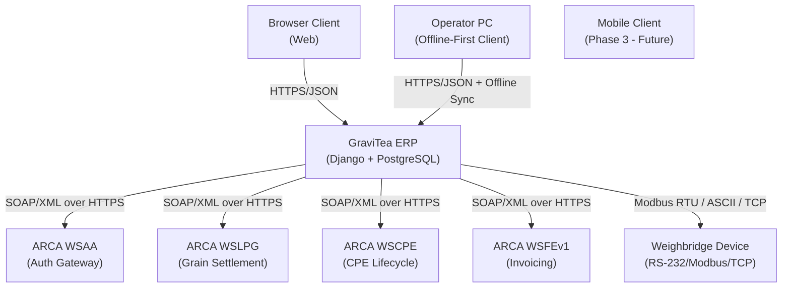
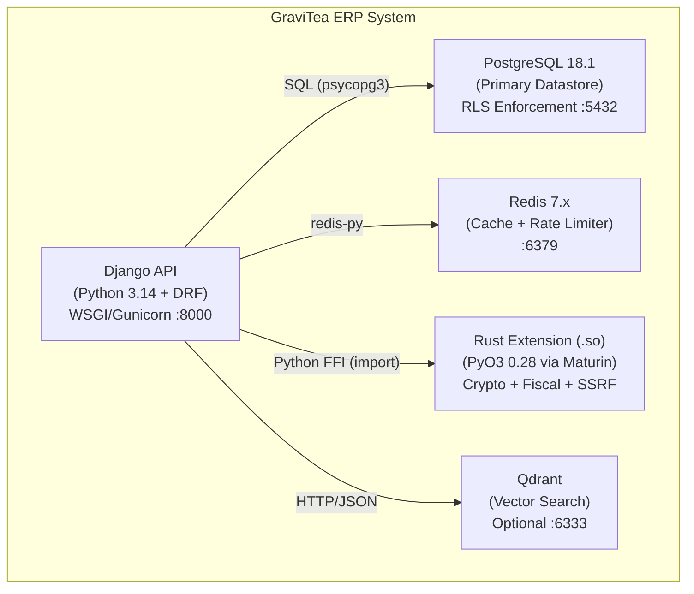
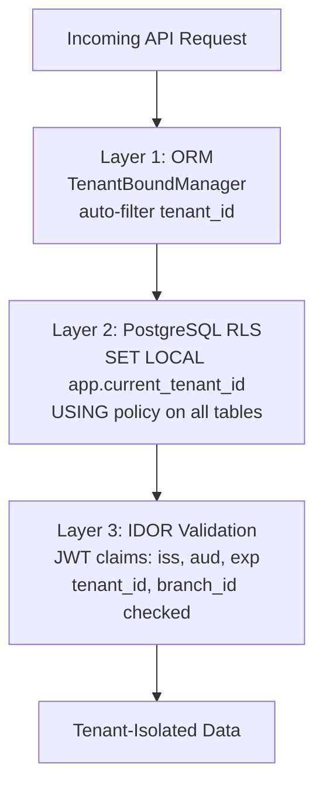
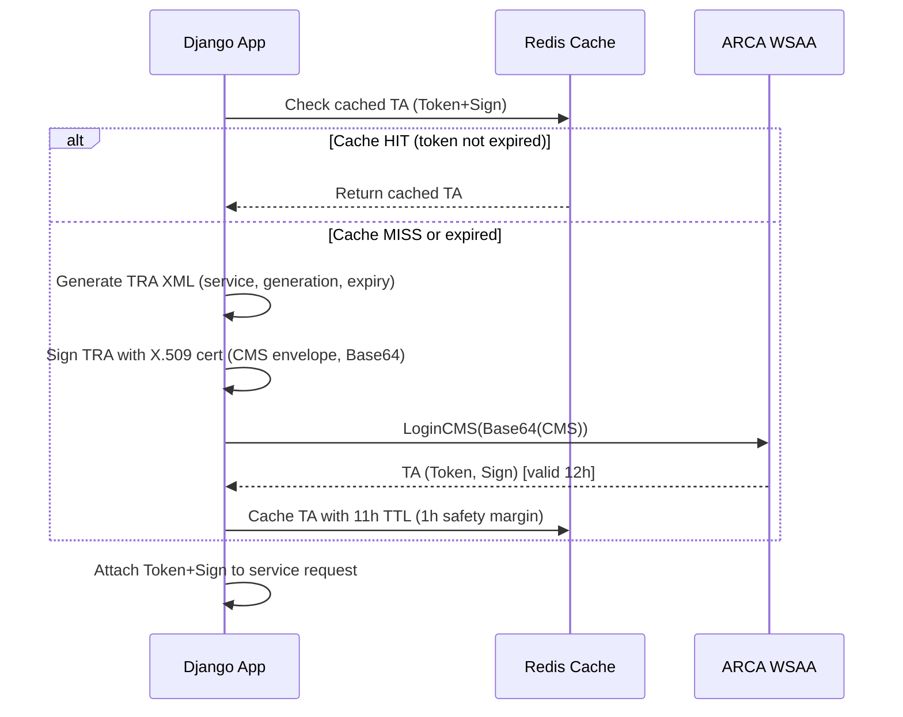
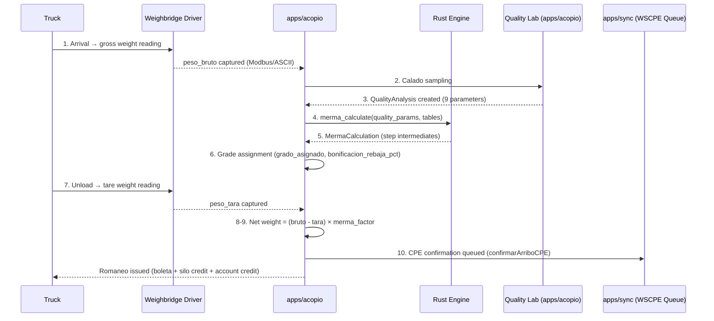
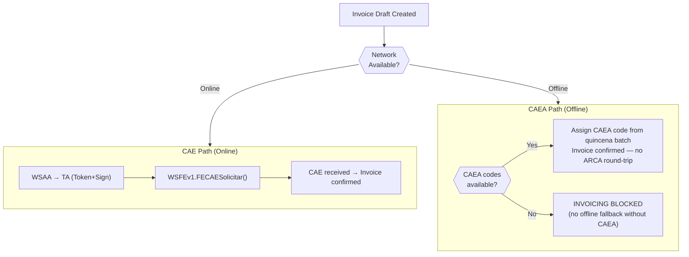

# Writing Plan: High-Level Design (HLD) Document

**Target deliverable**: `Docs/Project Blueprint/High-Level Design (HLD).md`
**Feature branch**: `005-acopio-hld`
**Plan date**: 2026-03-17
**Status**: Active

This plan guides the author through writing the HLD document section by section. It is the
input consumed by `/speckit.plan` to produce `specs/005-acopio-hld/plan.md`. Every section
map, diagram skeleton, and checkpoint gate below derives from `specs/005-acopio-hld/spec.md`
and the Critical Domain Facts in `Docs/PROMPTS/spec-05-hld/05-specify.md`.

---

## 1. Overview

The HLD translates four upstream blueprint documents — Vision v1.0, PRD v1.0, Data Model v1.0,
and ADR v1.0 — into a single, diagram-driven architecture reference. It does not invent new
decisions; it visualises decisions already captured in the 35 ADRs. The document must be
self-contained: a new engineer who reads only the HLD must understand the container structure,
external integrations, core data flows, and architectural constraints without reading specs
01–04.

**Output path**: `Docs/Project Blueprint/High-Level Design (HLD).md`
**Document version**: 1.0, Date: 2026-03-17, Status: Accepted
**Owner**: GraviTea Architecture Team
**Sections**: 13 top-level sections, each with 2–7 subsections (≥40 headings total)

---

## 2. Upstream Sources Table

| Source | File | Feeds HLD Sections |
|--------|------|--------------------|
| spec.md (spec-05) | `specs/005-acopio-hld/spec.md` | §1 metadata, all acceptance criteria |
| 05-specify.md | `Docs/PROMPTS/spec-05-hld/05-specify.md` | All Critical Domain Facts (verbatim constraints) |
| ADR document | `Docs/Project Blueprint/Architecture Decision Records (ADR).md` | §3 (ADR-001–003), §4 (ADR-001–004), §5 (ADR-010), §6 (ADR-025–027), §7 (ADR-032), §8 (ADR-028–030), §10 (ADR-005, 021–022), §11 (ADR-003–004), §12 (ADR-033–035), §13 (all 35) |
| PRD v1.0 | `Docs/Project Blueprint/PRD.md` | §5 app component list, §4.1 romaneo steps |
| Data Model v1.0 | `Docs/Project Blueprint/Data Model & Domain Model.md` | §5 entity-to-app mapping, §3.1 global ERD |
| WSLPG RAG results | Qdrant `acopio_research` collection | §6.2 WSAA auth, §6.3 WSLPG endpoints and methods |
| Weighbridge RAG results | Qdrant `acopio_research` collection | §7.2–7.4 protocol tiers |
| CPE RAG results | Qdrant `acopio_research` collection | §6.4 WSCPE lifecycle, §8.5 store-and-forward |
| CLAUDE.md technology stack | `/home/brunoghiberto/Documents/Projects/GraviTea/CLAUDE.md` | §4.2 container descriptions, §4.3 protocol matrix |

---

## 3. Writing Order

Write sections in this order to minimise context switching between source documents:

1. **§1 Document Metadata** — mechanical, no research required
2. **§2 System Overview** — brief orientation; write out-of-scope list from spec.md Scope section
3. **§13 Technology Cross-Reference Table (skeleton)** — draft the table structure with all 8 ADR categories and placeholder ADR IDs; fill in exact ADRs after writing the content sections
4. **§3 System Context (C4 L1)** — expand the context diagram skeleton; write actor descriptions
5. **§4 Container Architecture (C4 L2)** — expand container diagram; write Rust acceleration criteria and benchmark table here
6. **§5 Component Overview by Django App** — map entities from Data Model ERD to apps; apply Phase 2 annotations
7. **§6 ARCA Integration Architecture** — longest section; write WSAA flow first, then WSLPG, WSCPE, WSFEv1, CAEA; error paths last
8. **§7 Weighbridge Integration Architecture** — 3-tier diagram and entity description
9. **§8 Offline-First Architecture** — conflict resolution table, store-and-forward queue, CAEA fiscal path
10. **§9 Data Flow Diagrams** — romaneo 10-step flow, fiscal CAE/CAEA flowchart, sync flow
11. **§10 Security Architecture** — defense-in-depth diagram, layer descriptions, field encryption, key management
12. **§11 Deployment Topology** — Docker Compose service list, production topology diagram
13. **§12 AI/ML Readiness Architecture** — 4-layer strategy, Qdrant optional, Phase 4 reference only
14. **§13 (complete)** — fill in all ADR IDs from content sections written in steps 4–13

Rationale: §13 is scaffolded early as a tracking mechanism, then completed last when all
ADR references are confirmed. §6 and §8 are written before §9 because the data flow diagrams
reference ARCA states and conflict strategies established in those sections.

---

## 4. Section-by-Section Writing Plan

### §1 — Document Metadata

**Source material**: spec.md metadata fields (version, date, status, owner); ADR document §1
for metadata format reference.

**Content guidelines**: Render as a Markdown table matching the ADR document's metadata block
exactly. All four fields (Version, Date, Owner, Status) must be present. Add an "Upstream
Documents" row citing ADR v1.0, Data Model v1.0, PRD v1.0, Vision v1.0.

**Key facts that MUST appear**:
- Version 1.0
- Date 2026-03-17
- Status: Accepted
- Owner: GraviTea Architecture Team

**No diagram required.**

---

### §2 — System Overview

**Source material**: spec.md §Scope (In Scope / Out of Scope list); spec.md User Story 1 intro.

**Content guidelines**: Three subsections — §2.1 what this document is, §2.2 what it is not
(explicit out-of-scope list), §2.3 how to read it (Mermaid notation, ADR cross-reference
convention). Keep each subsection to 3–6 sentences. Avoid prose summaries of other upstream
documents; point readers there instead.

**Key facts that MUST appear**:
- "ADR-NNN" cross-reference format stated explicitly
- Out-of-scope list: database ERD/field details (spec-03), individual ADR rationale (spec-04),
  REST API endpoint specs (spec-06), ARCA SOAP XML schemas (spec-08a), Phase 4 ML model
  implementation details, frontend architecture

**No diagram required.**

---

### §3 — System Context (C4 Level 1)

**Source material**: FR-0501, ADR-001/002/003 (infrastructure decisions), ADR-025 (ARCA
architecture), spec.md §Assumptions for actor enumeration.

**Diagram type**: Mermaid `graph TD` — C4 Level 1 Context diagram.

**Diagram structure**: Use the starter skeleton in §5 of this plan (C4 Level 1). The diagram
must include all 8 external actors: ARCA WSAA, ARCA WSLPG, ARCA WSCPE, ARCA WSFEv1,
Weighbridge Device, Browser Client, Mobile Client (Phase 3 — Future), Operator PC. Label
every arrow with its protocol. GraviTea ERP is the system boundary box.

**Content guidelines**: §3.1 is the diagram. §3.2 provides one-paragraph descriptions of
each external actor (purpose, protocol, regulatory context). §3.3 defines the system boundary:
what is inside (the Django containers), what is outside (ARCA services, physical devices,
browsers). Do not describe internal containers here — those belong in §4.

**Key facts that MUST appear**:
- ARCA WSAA described as the authentication gateway — all service calls route through it first
- Mobile client explicitly marked as Phase 3 target, not present in Phase 1 or Phase 2
- Weighbridge uses RS-232/Modbus/TCP (ADR-032) — cite the ADR

---

### §4 — Container Architecture (C4 Level 2)

**Source material**: FR-0502, FR-0507, ADR-001 through ADR-004, ADR-031, CLAUDE.md technology
stack table.

**Diagram type**: Mermaid `graph TD` — C4 Level 2 Container diagram.

**Diagram structure**: Use the starter skeleton in §5 of this plan (C4 Level 2). The subgraph
boundary is the GraviTea system. Five containers: Django API, PostgreSQL 18.1, Redis 7.x,
Rust Extension (.so), Qdrant (optional). All connection arrows carry labeled protocols:
`SQL (psycopg3)`, `redis-py`, `Python FFI (import)`, `HTTP/JSON`.

**Content guidelines**: §4.1 is the diagram. §4.2 describes each container in a table or
prose block: technology, version, role, port. §4.3 is a communication matrix (container ×
container, protocol, direction). Include the Rust acceleration boundary as its own subsection
(§4.4 or named "Rust/PyO3 Acceleration Boundary") — this is where the 4 criteria and benchmark
table live. Cross-reference from §4.2 Rust container description to §4.4.

**Key facts that MUST appear**:
- Python 3.14.3 + Django 5.2.x, WSGI + Gunicorn, port 8000
- PostgreSQL 18.1, port 5432, RLS enforcement
- Redis 7.x, port 6379, used for session cache, rate limiter, TA token cache
- Rust 1.93.1 + PyO3 0.28 + Maturin 1.12.4 — loaded at Django startup
- Qdrant: optional container, not required for Phase 1 or Phase 2 production
- Python fallback activates automatically if the Rust `.so` module fails to load — no operator
  intervention required
- 4 criteria for Rust (any one triggers): >1,000 calls/second hot path; GIL contention in
  batch; CPU-bound (crypto, regex, merma); adversarial input requiring ReDoS protection
- Benchmark table (all 7 rows with × symbol, feature branch, module name)

**Benchmark table (must be exact)**:

| Module | Feature Branch | Speedup vs Python |
|--------|---------------|-------------------|
| AES-256-GCM encryption | 018-rust-crypto | 8.7× |
| HMAC blind index | 018-rust-crypto | 8.8× |
| IVA calculation | 019-rust-fiscal-compute | 4.4× |
| CUIT validation | 019-rust-fiscal-compute | 3.1× |
| Importes validation | 019-rust-fiscal-compute | 2.7× |
| Stock aggregation | 019-rust-fiscal-compute | 2.1× |
| Observability label sanitization | 021-rust-observability | 2.6× |

---

### §5 — Component Overview by Django App

**Source material**: FR-0501 app list, spec.md §Assumptions (Phase 1/2 annotation rule),
Data Model §3.1 Global ERD (entity-to-app mapping), PRD §3.1 Module Architecture.

**Content guidelines**: Present all 8 apps in a consistent structure (brief description,
owned entities, key external calls, phase annotation). Use a subsection per app (§5.1–§5.8).
Do not include field-level detail — that is spec-03 scope. For `apps/facturacion` and
`apps/liquidaciones`, add the inline annotation "(Phase 2)" in the subsection heading or
opening sentence. Do not annotate Phase 1 apps.

**Phase 1 apps (no annotation)**: `apps/core`, `apps/auth`, `apps/acopio`, `apps/cuentas`,
`apps/sync`, `apps/core/observability`

**Phase 2 apps (add annotation)**: `apps/facturacion` (electronic invoicing, Wave 6),
`apps/liquidaciones` (WSLPG client, SISA gate, spec-14)

**Key facts that MUST appear per app**:
- `apps/core`: Tenant, Branch, TenantBoundManager, RLS middleware, AES-256-GCM encryption
  utilities, Prometheus observability, SSRF validation (ADR-024)
- `apps/auth`: JWT RS256, Argon2, rate limiting, token lifecycle (ADR-021, ADR-023)
- `apps/acopio`: Romaneo, QualityAnalysis, MermaCalculation, CPE, StorageUnit, GrainLot,
  GrainMovement, WeighbridgeDevice, CampanaConfig (core grain domain)
- `apps/cuentas`: ProducerAccount, AccountMovement, FijacionRecord (dual-ledger accounts)
- `apps/facturacion` (Phase 2): Comprobante, CAEA, ArcaCredential, PuntoDeVenta, WSAA client,
  WSFEv1 client
- `apps/liquidaciones` (Phase 2): LiquidacionPrimaria, WSLPG client, SISA gate
- `apps/sync`: SyncSession, PendingOperation, conflict resolution engine (ADR-028–030)
- `apps/core/observability`: Prometheus metrics, OpenTelemetry tracing, Rust-accelerated
  label sanitization (ADR-031)

---

### §6 — ARCA Integration Architecture

**Source material**: FR-0503, ADR-025 (ARCA hub-and-spoke), ADR-026 (CAEA offline), ADR-027
(SISA tier), Critical Domain Facts (ARCA section in 05-specify.md), WSLPG RAG results,
CPE RAG results.

**Diagram type (§6.1)**: Mermaid `graph LR` hub-and-spoke — WSAA at center, three spokes to
WSLPG, WSCPE, WSFEv1. Label each spoke with service name and SOAP method category.

**Diagram type (§6.2)**: Mermaid `sequenceDiagram` — WSAA authentication flow. Use the
starter skeleton in §5 of this plan (WSAA Authentication Flow).

**Content guidelines**: This is the longest and most important section. Write in this order:
§6.1 hub-and-spoke overview diagram → §6.2 WSAA auth flow with sequence diagram → §6.3
WSLPG integration → §6.4 WSCPE lifecycle → §6.5 WSFEv1/CAEA → §6.6 certificate management
→ §6.7 error paths. Each subsection cites its ADR. Do not include SOAP XML examples — those
are spec-08a scope.

**Key facts that MUST appear**:
- WSAA TRA → CMS signing → Base64 → LoginCMS → TA (Token + Sign pair), 12-hour expiry
- Redis TA cache with 11-hour TTL (1-hour safety margin)
- WSLPG production URL: `https://serviciosjava.afip.gob.ar/wslpg/LpgService?wsdl`
- WSLPG homologation URL: `https://fwshomo.afip.gov.ar/wslpg/LpgService?wsdl`
- Homologation requires pre-seeded ARCA test CUITs — random CUITs fail validation
- `liquidacionAutorizar` returns COE (Código de Operación Electrónico)
- `codGrano` at XML root — one submission per grain type (ADR-019 constraint)
- SISA blocking gate before every WSLPG filing; four retention tiers:
  Estado 1 → IVA 5% / Ganancias 0%; Estado 2 → IVA 8% / Ganancias 2%;
  Estado 3 → IVA 10.5% / Ganancias 15%; Non-registered → IVA 16% / Ganancias 30%
- WSCPE CPE lifecycle: Activa (issued, 5-day Automotor validity) → Arribo
  (confirmarArriboCPE) → Descargada (descargadoDestinoCPE) → Confirmada_Definitiva
  (confirmacionDefinitivaCPEAutomotor). "Vencida" is a derived condition, not a
  WSCPE state code.
- WSFEv1: per-invoice CAE round-trip to ARCA; returns CAE code
- CAEA section 6.5 MUST include verbatim: "CAEA codes MUST be obtained before the offline
  period begins. An invoice issued with a deferred CAE (authorization obtained after
  issuance) is a legally invalid fiscal document."
- Rust CAEA batch builder (feature 024, serde_json, GIL-released batch processing)
- Each ARCA service requires a separate X.509 certificate; shared certificate is rejected
- Private keys in Google Cloud Secret Manager
- Error paths: WSAA timeout (exponential backoff + retry), token expiry mid-batch
  (re-authenticate and resume), WSLPG rejection (schema error, SISA block → user-facing
  error), CPE validity window expiry → operator alert, no automatic extension

---

### §7 — Weighbridge Integration Architecture

**Source material**: FR-0504, ADR-032, Critical Domain Facts (weighbridge section in
05-specify.md), Weighbridge RAG results from `3.1 Weighbridge Integration Standards.md`.

**Diagram type (§7.1)**: Mermaid `graph TD` or ASCII art — 3-tier protocol stack. Show the
three tiers stacked vertically: Tier 1 (Modbus RTU / ASCII), Tier 2 (Continuous ASCII
stream), Tier 3 (KYASERV network bridge). Show the WeighbridgeDevice entity connecting to
the Django API via each tier path.

**Content guidelines**: §7.1 is the 3-tier diagram. §7.2 covers Tier 1 (Sipel Orion Modbus
RTU and Systel ASCII). §7.3 covers Tier 2 fallback (GaMa A12 continuous stream). §7.4
covers Tier 3 KYASERV bridge. §7.5 describes the WeighbridgeDevice entity (first-class
entity, not configuration). §7.6 covers error paths. Each tier cites ADR-032.

**Key facts that MUST appear**:
- RS-232: 9600 baud, 8N1; universal baseline for all Argentine indicator brands
- Sipel Orion: Modbus RTU over RS-232; memory map: Address 0 = Gross weight (2 registers,
  32-bit signed int), Address 2 = Tare, Address 4 = Net weight, Address 6 = Flags/Status;
  supported functions: 03h, 06h, 10h
- Systel (Clipse, Croma, Bumer): command/response ASCII over RS-232, no Modbus support
- GaMa A12: continuous ASCII stream parsing (Tier 2 fallback); frame: {STX}{weight}{CR/LF}
  at 9600 baud, 8N1
- KYASERV RS-232-to-Ethernet bridge: converts RS-232 to UDP/TCP-IP over LAN; application
  server connects to KYASERV IP:port; eliminates requirement for app server to be weighbridge PC
- WeighbridgeDevice: first-class entity with interface_type, connection_address, calibration
  records; Romaneo.weighbridge_device_id nullable FK (SET_NULL on decommission)
- Error paths: RS-232 disconnect → watchdog reconnection loop + operator alert; stable-weight
  timeout → configurable threshold + manual entry override; KYASERV unreachable → fall back
  to manual entry mode

---

### §8 — Offline-First Architecture

**Source material**: FR-0505, ADR-028 (offline base), ADR-029 (conflict resolution), ADR-030
(store-and-forward), ADR-026 (CAEA offline fiscal), Critical Domain Facts (offline section
in 05-specify.md).

**Content guidelines**: §8.1 architecture principle (cite connectivity statistic, ADR-028).
§8.2 local data store (SQLite client / on-premises PostgreSQL, UUID v4 prevents collision).
§8.3 sync protocol (push/pull idempotent, vector clock, SyncSession watermark). §8.4
conflict resolution engine — render as a table, one row per strategy. §8.5 store-and-forward
queue entity description. §8.6 CAEA offline fiscal path. §8.7 error paths. No diagram
required for §8 itself (the data flows for sync appear in §9).

**Conflict resolution table (§8.4 — must appear exactly)**:

| Strategy | Target Data Type | Implementation |
|----------|-----------------|----------------|
| `server_wins` | Configuration data (tenant settings, tolerance tables, grain type definitions) | Server version always wins; client changes discarded |
| `last_write_wins` | Inventory levels | Latest timestamp wins |
| `additive` | Sales transactions / romaneo entries | All records merged; none discarded |
| `most_complete_wins` | Customer / producer data | Merge; prefer more complete record; Rust implementation (feature 023) |
| `server_assigns_final` | Document numbering | Temporary offline IDs replaced at sync |

**Key facts that MUST appear**:
- "44% of operators report 'regular' (not good) connectivity quality (INTA/ENACOM 2021)"
- "Offline is the base operating mode, not a degraded fallback" (ADR-028)
- PendingOperation fields: operation_type, payload, status, retry_count
- Queue is durable across device restarts; transmitted FIFO on reconnect
- Queued operations: confirmarArriboCPE, descargadoDestinoCPE,
  confirmacionDefinitivaCPEAutomotor
- Store-and-forward NOT used for fiscal invoice issuance — CAEA handles that path
- CPE validity window: 5 days (Automotor) — alert on approaching expiry during outage
- CAEA quincena expiry during extended outage → invoicing blocked; no workaround

---

### §9 — Data Flow Diagrams

**Source material**: FR-0508 (romaneo flow), FR-0509 (fiscal flow), ADR-029 (sync merge),
PRD §4.1 (romaneo 11-step breakdown), Critical Domain Facts.

**Diagram type (§9.1)**: Mermaid `sequenceDiagram` — Romaneo Reception Flow. Use the starter
skeleton in §5 of this plan (Romaneo Reception Flow).

**Diagram type (§9.2)**: Mermaid `flowchart TD` — Fiscal Authorization Flow. Use the starter
skeleton in §5 of this plan (Fiscal Authorization Flow).

**Diagram type (§9.3)**: Mermaid `sequenceDiagram` or `flowchart` — abbreviated sync flow.
Nodes: Local write → SyncSession queue → connectivity check → batch push → conflict
resolution → server merge → pull delta → local apply.

**Content guidelines**: Each data flow subsection includes (1) the diagram, (2) a step-by-step
numbered list that names the responsible component at each step, and (3) a note on error/offline
behaviour at steps where applicable. The romaneo flow must follow exactly 10 steps — do not
collapse or split steps.

**Romaneo 10-step component mapping (for §9.1 step list)**:

| Step | Action | Responsible Component |
|------|--------|-----------------------|
| 1 | Arrival — gross weight reading | Weighbridge Driver (apps/acopio) |
| 2 | peso_bruto captured | Weighbridge Driver → apps/acopio |
| 3 | Calado sampling | apps/acopio (lab workflow) |
| 4 | QualityAnalysis created (9 parameters) | apps/acopio |
| 5 | merma_calculate(quality_params, tables) | Rust Engine (via PyO3 FFI) |
| 6 | Grade assignment (grado_asignado, bonificacion_rebaja_pct) | apps/acopio |
| 7 | Unload → tare weight reading | Weighbridge Driver (apps/acopio) |
| 8 | peso_tara captured | Weighbridge Driver → apps/acopio |
| 9 | Net weight = (bruto − tara) × merma_factor | apps/acopio |
| 10 | Romaneo issuance (boleta + silo credit + account credit); CPE confirmation queued | apps/acopio + apps/sync (WSCPE queue) |

---

### §10 — Security Architecture

**Source material**: FR-0506, ADR-005 (three-layer defense), ADR-021 (JWT RS256), ADR-022
(AES-256-GCM), Critical Domain Facts (security section in 05-specify.md).

**Diagram type (§10.1)**: Mermaid `graph TD` — defense-in-depth. Use the starter skeleton
in §5 of this plan (Defense-in-Depth).

**Content guidelines**: §10.1 is the diagram. §10.2 describes Layer 1 ORM. §10.3 describes
Layer 2 PostgreSQL RLS. §10.4 describes Layer 3 IDOR/JWT validation. §10.5 covers field-level
encryption. §10.6 covers key management. Each subsection cites its ADR.

**Key facts that MUST appear**:
- Layer 1: TenantBoundManager auto-filters ALL ORM queries by tenant_id
- Layer 2: `SET LOCAL app.current_tenant_id = '{uuid}'` (transaction-scoped session variable)
- RLS policy: `USING (tenant_id = current_setting('app.current_tenant_id')::uuid)` applied
  on all per-tenant tables; global tables (GrainType, ToleranceTable) exempt (ADR-010)
- Layer 3: JWT RS256 claims checked on every request: iss, aud, exp, tenant_id, branch_id
- Algorithm whitelist: RS256 only; HS256 / none rejected at middleware
- JWT: 4096-bit RSA key; access token 15 minutes; refresh token 7 days (ADR-021)
- AES-256-GCM for PII; HMAC-SHA256 blind index for searchable fields (ADR-022)
- Encrypted fields: producer CUIT, full name, address, DNI, contact data
- Blind index limitation: equality search only — no range queries, no LIKE patterns on
  encrypted fields
- All master keys in Google Cloud Secret Manager — never in code, env vars, Docker configs,
  or git history

---

### §11 — Deployment Topology

**Source material**: FR-0512, ADR-003 (modular monolith), ADR-004 (shared schema cost),
AC-0512 (both environments), spec.md §Assumptions (GCP as production cloud provider).

**Diagram type (§11.3)**: Mermaid `graph TD` — production topology. Show two topology options
side by side (full-cloud and hybrid plant/cloud) with labeled arrows.

**Content guidelines**: §11.1 development Docker Compose environment — list all services,
ports, and the Rust multi-stage build stage. §11.2 production topology narrative. §11.3 is
the production topology diagram. §11.4 infrastructure cost rationale citing ADR-004.

**Key facts that MUST appear**:
- Docker Compose services: django-api (:8000), postgres (:5432), redis (:6379), rust-builder
  (Maturin build stage, not a runtime service), qdrant (:6333, optional, disabled by default)
- Rust modules built in multi-stage Docker build (rust-builder stage)
- Local weighbridge simulated via mock serial device in dev environment
- Production target: 1–5 plants, small-to-medium acopiadores
- Full-cloud option: Django + PostgreSQL on GCP Cloud Run + Cloud SQL Enterprise Plus
- Hybrid option: plant server (Windows or Linux PC) with offline client + local PostgreSQL;
  cloud server handles sync and ARCA calls
- Deployment unit: single Django process, modular monolith (ADR-003)
- No microservices, no service mesh, no Kubernetes for initial scale
- Shared schema: fixed DB cost regardless of tenant count (ADR-004); compatible with
  USD 90–360/month SMB SaaS budget

---

### §12 — AI/ML Readiness Architecture

**Source material**: FR-0510, ADR-033 (4-layer strategy), ADR-034 (provenance fields),
ADR-035 (measurement-timestamp pairing), Critical Domain Facts (AI/ML section in 05-specify.md).

**Content guidelines**: §12.1 4-layer strategy overview (one paragraph per layer). §12.2
Layer 1 — Operational. §12.3 Layer 2 — Behavioural. §12.4 Layer 3 — Quality History.
§12.5 Layer 4 — Physical State (IoT-Ready). §12.6 Phase 4 ML capabilities (reference only,
informative, explicitly noted as out-of-scope for this document). §12.7 Qdrant optional
container. This section is informative — do not add requirements. Cite ADR-033, ADR-034,
ADR-035 in each layer subsection.

**Key facts that MUST appear**:
- Layer 1: all grain domain fields captured real-time with full timestamps; DECIMAL(17,3)
  precision; no rounding at rest (ADR-007)
- Layer 2: operator_id, laboratorista_id, device_id on all grain domain models; 6 named
  romaneo timestamps: ts_entrada, ts_pesada_bruta, ts_calado, ts_analisis, ts_descarga, ts_tara
- Layer 3: QualityAnalysis rows per (grain_type, campaign, storage_unit); longitudinal quality
  record per silo enables degradation prediction (3D-CNN + LSTM, Phase 4)
- Layer 4: StorageUnit.environment_sensor_id as nullable FK anchor; populating this FK in a
  future phase requires no structural schema change
- Qdrant: optional container; used in development for RAG-based query expansion; not required
  for Phase 1 or Phase 2 production

---

### §13 — Technology Decisions Cross-Reference Table

**Source material**: All 35 ADRs from `Docs/Project Blueprint/Architecture Decision Records (ADR).md`.

**Content guidelines**: One table with columns: HLD Section | ADR IDs | ADR Titles | Category.
Group rows by the 8 ADR categories. Every ADR-NNN reference uses the exact ID format from
the ADR index. At least one ADR per HLD section that makes architectural decisions. Every
HLD section from §3 through §12 must appear in at least one row. Fill this section last,
after all content sections are complete.

**8 ADR categories and their ADR IDs**:

| Category | ADR IDs |
|----------|---------|
| Infrastructure | ADR-001, ADR-002, ADR-003, ADR-004, ADR-005 |
| Data Architecture | ADR-006, ADR-007, ADR-008, ADR-009, ADR-010, ADR-011, ADR-012, ADR-013 |
| Grain Domain | ADR-014, ADR-015, ADR-016, ADR-017, ADR-018, ADR-019, ADR-020 |
| Security | ADR-021, ADR-022, ADR-023, ADR-024 |
| Fiscal Integration | ADR-025, ADR-026, ADR-027 |
| Offline & Sync | ADR-028, ADR-029, ADR-030 |
| Performance | ADR-031, ADR-032 |
| AI/ML Readiness | ADR-033, ADR-034, ADR-035 |

---

## 5. Mermaid Diagram Specifications

### Diagram 1 — C4 Level 1 System Context (§3.1)

**Type**: `graph TD`
**Required nodes**: GraviTea ERP (system boundary), Browser Client, Operator PC, Mobile
Client (Phase 3), ARCA WSAA, ARCA WSLPG, ARCA WSCPE, ARCA WSFEv1, Weighbridge Device.
**Required edges**: labeled with protocol (HTTPS/JSON, SOAP/XML over HTTPS, Modbus
RTU/ASCII/TCP).



**Expand by**: (1) adding subgraph or styling to visually distinguish GraviTea from external
actors; (2) confirming MobileClient arrow direction (future — show dashed or label "Phase 3");
(3) verifying all 8 external actors are present.

---

### Diagram 2 — C4 Level 2 Container Architecture (§4.1)

**Type**: `graph TD` with subgraph
**Required nodes**: Django API, PostgreSQL 18.1, Redis 7.x, Rust Extension (.so), Qdrant (optional).
**Required edges**: labeled with exact protocol strings.



**Expand by**: (1) adding ARCA external services and Weighbridge as external nodes with arrows
from DjangoAPI; (2) marking Qdrant as optional with a note or dashed border style.

---

### Diagram 3 — Defense-in-Depth Security (§10.1)

**Type**: `graph TD`
**Required nodes**: Incoming API Request, Layer 1 ORM, Layer 2 PostgreSQL RLS, Layer 3 IDOR
Validation, Tenant-Isolated Data.
**Required edges**: linear flow top-to-bottom.



**Expand by**: (1) adding a rejection/error path out of each layer for failed checks;
(2) noting the error response (HTTP 403, database-level rejection) at each failure branch.

---

### Diagram 4 — WSAA Authentication Flow (§6.2)

**Type**: `sequenceDiagram`
**Required participants**: Django App, Redis Cache, ARCA WSAA.
**Required paths**: cache hit path and cache miss path (alt block).



**Expand by**: (1) adding an error path for WSAA timeout (exponential backoff retry);
(2) adding the token expiry mid-batch path (re-authenticate and resume at current operation).

---

### Diagram 5 — Romaneo Reception Flow (§9.1)

**Type**: `sequenceDiagram`
**Required participants**: Truck, Weighbridge Driver, apps/acopio, Rust Engine, Quality Lab,
apps/sync (WSCPE Queue).
**Required steps**: exactly 10, matching the canonical flow.



**Expand by**: (1) adding a note on step 10 that the queue is durable (PendingOperation);
(2) adding an error/offline note on step 1 indicating the weighbridge watchdog reconnection
loop triggers if RS-232 is disconnected.

---

### Diagram 6 — Fiscal Authorization Flow (§9.2)

**Type**: `flowchart TD`
**Required nodes**: Invoice Draft, online/offline decision, CAE subgraph (WSAA, WSFEv1,
CAE received), CAEA subgraph (CAEA available check, assign code, or blocked).



**Expand by**: (1) adding a note on the "Blocked" node referencing the legal constraint
sentence from §6.5; (2) showing the quincena batch pre-fetch that populates CAEA codes
before the offline period begins.

---

## 6. Research-to-Section Mapping

| Source Document / ADR | Content Type | Feeds HLD Section(s) |
|-----------------------|-------------|----------------------|
| ADR-001 (PostgreSQL 18.1) | Infrastructure decision | §4.2, §13 |
| ADR-002 (UUID v4) | Infrastructure decision | §8.2, §13 |
| ADR-003 (Modular Monolith) | Infrastructure decision | §4.2, §11.2, §13 |
| ADR-004 (Shared Schema) | Infrastructure decision | §11.4, §13 |
| ADR-005 (Three-Layer Isolation) | Security decision | §10.1–10.4, §13 |
| ADR-007 (DECIMAL precision) | Data architecture | §12.2, §13 |
| ADR-010 (Global vs Per-Tenant) | Data architecture | §10.3 (RLS exemptions), §13 |
| ADR-019 (Single grain per WSLPG) | Grain domain | §6.3, §13 |
| ADR-021 (JWT RS256) | Security | §10.4, §13 |
| ADR-022 (AES-256-GCM) | Security | §10.5, §13 |
| ADR-024 (SSRF Rust) | Security | §5.1, §13 |
| ADR-025 (ARCA architecture) | Fiscal integration | §6.1, §6.2, §13 |
| ADR-026 (CAEA offline) | Fiscal integration | §6.5, §8.6, §9.2, §13 |
| ADR-027 (SISA tier retention) | Fiscal integration | §6.3, §13 |
| ADR-028 (Offline-first base) | Offline & sync | §8.1, §13 |
| ADR-029 (Conflict resolution) | Offline & sync | §8.4, §13 |
| ADR-030 (Store-and-forward) | Offline & sync | §8.5, §9.3, §13 |
| ADR-031 (Rust boundary) | Performance | §4.4, §13 |
| ADR-032 (Weighbridge) | Performance | §7.1–7.4, §13 |
| ADR-033 (AI 4-layer) | AI/ML readiness | §12.1–12.5, §13 |
| ADR-034 (Provenance fields) | AI/ML readiness | §12.2–12.3, §13 |
| ADR-035 (Measurement-timestamp) | AI/ML readiness | §12.3, §13 |
| Research 3.1 (Weighbridge Standards) | Domain research (RAG) | §7.2–7.4 |
| Research 5.1 (WSLPG Technical) | Domain research (RAG) | §6.2–6.3 |
| Research 1.1 (CPE Lifecycle) | Domain research (RAG) | §6.4, §8.5 |
| Data Model §3.1 Global ERD | Entity mapping | §5.1–5.8 |
| PRD §4.1 romaneo workflow | Process steps | §9.1 |
| CLAUDE.md technology stack | Technology versions | §4.2, §4.3 |

---

## 7. Content Guidelines

**Tone**: Declarative and precise. Every sentence states what the system does, not what it
might do. Write in present tense ("The system uses…", "Layer 2 enforces…").

**Audience**: Backend developers, architects, and AI implementation agents. Readers have
strong technical backgrounds but may not know the acopio domain or Argentine fiscal systems.
Define domain terms (WSLPG, CPE, CAEA, romaneo, merma) on first use in each major section.

**Level of technical detail**:
- Container level: yes (versions, ports, protocols, communication matrix)
- Component level: yes (which app owns which entity, what external calls it makes)
- Field level: no (spec-03 scope)
- SOAP XML schema level: no (spec-08a scope)
- REST endpoint level: no (spec-06 scope)
- ML model hyperparameters: no (spec-08b scope)

**Naming conventions**:
- Apps: `apps/core`, `apps/auth`, `apps/acopio` (backtick code format)
- Entities: `Romaneo`, `QualityAnalysis`, `PendingOperation` (PascalCase, backtick format)
- ARCA services: WSAA, WSLPG, WSCPE, WSFEv1 (caps, no backticks)
- ADR references: "ADR-NNN (Title)" — number with leading zeros to 3 digits
- All SOAP method names in backtick code format: `liquidacionAutorizar`, `confirmarArriboCPE`
- Speedup values use × symbol (not lowercase x): 8.7×, 8.8×, 4.4×

**Hedging prohibition**: Zero instances of "TBD", "TODO", "FIXME", "possibly", "might consider".
If a topic is deferred to a future spec, say so explicitly: "Detailed SOAP XML schemas are
documented in spec-08a (ARCA Grain Integration Guide)."

**Cross-reference convention**: Every architecture section must cite at least one ADR using
the exact format "ADR-NNN" (e.g., "ADR-025 (ARCA Web Service Architecture)"). The HLD cites
ADRs; it does not reproduce their rationale text.

**Error paths**: Every external integration section (§6, §7, §8) must include an explicit
error paths subsection identifying: (1) the failure mode, (2) the system response, (3)
whether operator intervention is required.

---

## 8. Checkpoint Gates

### Gate 1 — After §§1–3 (Metadata + Context)

Verify before proceeding to §4:

```bash
# Confirm no ADR headings reproduced in HLD (HLD cites, does not reproduce)
grep -c "^### ADR-" "Docs/Project Blueprint/High-Level Design (HLD).md"
# Expected: 0

# Confirm document metadata is present
grep "Version 1.0" "Docs/Project Blueprint/High-Level Design (HLD).md"
# Expected: matches §1 metadata table row

# Confirm all 8 external actors named in §3.2
grep -c "WSAA\|WSLPG\|WSCPE\|WSFEv1\|Weighbridge\|Browser\|Mobile\|Operator" \
  "Docs/Project Blueprint/High-Level Design (HLD).md"
# Expected: ≥ 8 distinct matches
```

---

### Gate 2 — After §§4–6 (Containers + Components + ARCA)

Verify before proceeding to §7:

```bash
# Confirm minimum ADR cross-references written so far
grep -c "ADR-" "Docs/Project Blueprint/High-Level Design (HLD).md"
# Expected: ≥ 20

# Confirm CAEA legal constraint sentence is present verbatim (or in substance)
grep "CAEA codes MUST be obtained before" "Docs/Project Blueprint/High-Level Design (HLD).md"
# Expected: 1 match (section 6.5)

# Confirm WSLPG single-grain constraint present
grep "codGrano" "Docs/Project Blueprint/High-Level Design (HLD).md"
# Expected: ≥ 1 match

# Confirm benchmark table speedup values with × symbol
grep "8\.7×\|8\.8×\|4\.4×" "Docs/Project Blueprint/High-Level Design (HLD).md"
# Expected: 3 matches (section 4.4 benchmark table)

# Confirm Phase 2 annotation present
grep "Phase 2" "Docs/Project Blueprint/High-Level Design (HLD).md"
# Expected: ≥ 2 matches (facturacion and liquidaciones)
```

---

### Gate 3 — After §§7–9 (Weighbridge + Offline + Data Flows)

Verify before proceeding to §10:

```bash
# Confirm all 3 CPE WSCPE method calls named
grep "confirmarArriboCPE\|descargadoDestinoCPE\|confirmacionDefinitivaCPEAutomotor" \
  "Docs/Project Blueprint/High-Level Design (HLD).md"
# Expected: ≥ 3 matches (sections 6.4, 8.5, 9.1)

# Confirm all 5 conflict resolution strategies
grep "server_wins\|last_write_wins\|additive\|most_complete_wins\|server_assigns_final" \
  "Docs/Project Blueprint/High-Level Design (HLD).md"
# Expected: 5 matches (section 8.4 table)

# Confirm connectivity statistic
grep "44%" "Docs/Project Blueprint/High-Level Design (HLD).md"
# Expected: ≥ 1 match (section 8.1)

# Confirm KYASERV named
grep "KYASERV" "Docs/Project Blueprint/High-Level Design (HLD).md"
# Expected: ≥ 1 match (section 7.4)
```

---

### Gate 4 — After §§10–12 (Security + Deployment + AI/ML)

Verify before proceeding to §13:

```bash
# Confirm RLS session variable present
grep "SET LOCAL app.current_tenant_id" "Docs/Project Blueprint/High-Level Design (HLD).md"
# Expected: ≥ 1 match (section 10.3)

# Confirm all benchmark values with × symbol are present
grep "8\.7×\|8\.8×\|4\.4×" "Docs/Project Blueprint/High-Level Design (HLD).md"
# Expected: 3 matches (should have been set at Gate 2; verify not lost)

# Confirm Docker Compose ports listed
grep ":8000\|:5432\|:6379" "Docs/Project Blueprint/High-Level Design (HLD).md"
# Expected: 3 matches (section 11.1)

# Confirm IoT anchor field named
grep "environment_sensor_id" "Docs/Project Blueprint/High-Level Design (HLD).md"
# Expected: ≥ 1 match (section 12.5)

# Confirm 6 romaneo timestamps listed
grep "ts_entrada\|ts_pesada_bruta\|ts_calado\|ts_analisis\|ts_descarga\|ts_tara" \
  "Docs/Project Blueprint/High-Level Design (HLD).md"
# Expected: ≥ 6 matches (section 12.3)
```

---

### Gate 5 — Final (All Sections Complete)

Run before committing the file:

```bash
# Zero hedging language — must return empty output
grep -i "TBD\|TODO\|FIXME\|possibly\|might consider" \
  "Docs/Project Blueprint/High-Level Design (HLD).md"
# Expected: 0 matches (empty output)

# Minimum heading count (13 H2 + subsections ≥ 40 total)
grep -c "^## \|^### " "Docs/Project Blueprint/High-Level Design (HLD).md"
# Expected: ≥ 40

# Confirm all 8 ADR categories represented in §13 table
grep "Infrastructure\|Data Architecture\|Grain Domain\|Security\|Fiscal Integration\|Offline.*Sync\|Performance\|AI/ML Readiness" \
  "Docs/Project Blueprint/High-Level Design (HLD).md"
# Expected: 8 matches

# Confirm Mermaid code blocks present (at least 6 diagrams)
grep -c '```mermaid' "Docs/Project Blueprint/High-Level Design (HLD).md"
# Expected: ≥ 6

# Confirm document file exists at correct path
test -f "Docs/Project Blueprint/High-Level Design (HLD).md" && echo "EXISTS" || echo "MISSING"
# Expected: EXISTS
```

---

## 9. Done Criteria

The HLD document is complete when all 12 items are satisfied:

- [ ] 1. File created at `Docs/Project Blueprint/High-Level Design (HLD).md`
- [ ] 2. §1 metadata table: Version 1.0, Date 2026-03-17, Status Accepted, Owner GraviTea
         Architecture Team, Upstream Documents row present
- [ ] 3. C4 Level 1 diagram (§3.1) renders in Mermaid — all 8 external actors visible
         (WSAA, WSLPG, WSCPE, WSFEv1, Weighbridge, Browser, Mobile Client, Operator PC)
- [ ] 4. C4 Level 2 diagram (§4.1) renders in Mermaid — 5 containers visible with labeled
         protocol on every connection arrow
- [ ] 5. Section 5 presents all 8 apps; `apps/facturacion` and `apps/liquidaciones`
         annotated "(Phase 2)"; no Phase 1 app is annotated
- [ ] 6. CAEA legal constraint sentence appears in §6.5: "CAEA codes MUST be obtained before
         the offline period begins" (verbatim or equivalent substance)
- [ ] 7. Romaneo data flow (§9.1) covers all 10 steps in sequence; component responsible
         identified at every step; no steps collapsed or split
- [ ] 8. Conflict resolution table (§8.4) lists all 5 strategies with target data types:
         `server_wins`, `last_write_wins`, `additive`, `most_complete_wins`,
         `server_assigns_final`
- [ ] 9. Rust benchmark table (§4.4) shows all 7 speedup values using × symbol (not x),
         with feature branch reference for each row
- [ ] 10. Technology cross-reference table (§13) covers all 8 ADR categories; every HLD
          section from §3–§12 maps to at least one ADR-NNN reference
- [ ] 11. Zero hedging language — grep for `TBD|TODO|FIXME|possibly|might consider` returns
          0 matches
- [ ] 12. All 6 Mermaid diagrams render without syntax errors: C4 context (§3.1), C4
          container (§4.1), defense-in-depth (§10.1), romaneo flow (§9.1), fiscal flow (§9.2),
          production topology (§11.3)
