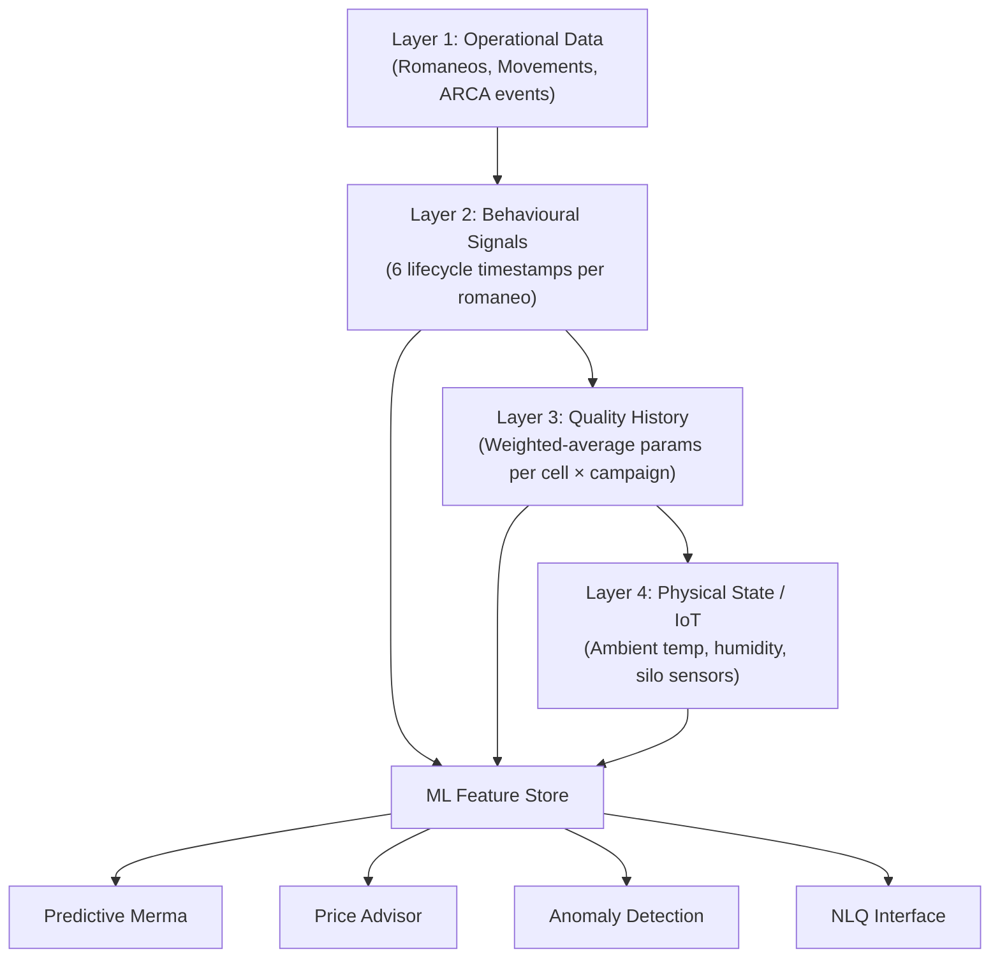

# AI-ML Feature Roadmap — GraviTea Acopio ERP

**Version**: 1.0
**Date**: 2026-03-18
**Status**: Approved
**Author**: Product Team

---

## Table of Contents

1. [Purpose and Scope](#1-purpose-and-scope)
2. [Strategic Rationale](#2-strategic-rationale)
3. [Data Strategy — Four-Layer Architecture](#3-data-strategy--four-layer-architecture)
4. [Phase Alignment](#4-phase-alignment)
5. [Phase 3 ML Feature Catalogue](#5-phase-3-ml-feature-catalogue)
   - 5.1 [P3-Q1: Predictive Merma Engine](#51-p3-q1-predictive-merma-engine)
   - 5.2 [P3-Q2: Price Optimisation Advisor](#52-p3-q2-price-optimisation-advisor)
   - 5.3 [P3-Q3: Anomaly Detection Pipeline](#53-p3-q3-anomaly-detection-pipeline)
   - 5.4 [P3-Q4: Natural Language Query Interface](#54-p3-q4-natural-language-query-interface)
6. [Data Collection Requirements by Phase](#6-data-collection-requirements-by-phase)
7. [Architecture Overview](#7-architecture-overview)
8. [ADR Cross-Reference](#8-adr-cross-reference)
9. [Metrics and Success Criteria](#9-metrics-and-success-criteria)
10. [Risks and Mitigations](#10-risks-and-mitigations)

---

## 1. Purpose and Scope

This document defines the AI and machine-learning feature roadmap for GraviTea Acopio ERP.
It describes the data strategy that must be established during Phase 1 (MVP) and Phase 2
(Advanced) so that Phase 3 (Intelligence) ML workloads have sufficient, high-quality
training data when those features are built.

The roadmap covers four ML feature families scheduled for Phase 3 delivery:

1. **Predictive Merma Engine** — forecast grain weight loss before physical measurement
2. **Price Optimisation Advisor** — recommend optimal sell-timing for stored grain
3. **Anomaly Detection Pipeline** — flag suspicious quality entries, weights, and fiscal events
4. **Natural Language Query Interface** — allow non-technical users to query operational data
   in plain Spanish

This document does **not** specify the implementation stack for ML workloads; it defines
what data must be captured, what business outcomes each model must achieve, and what
readiness gates must be met before Phase 3 begins.

---

## 2. Strategic Rationale

Grain-storage operations in Argentina generate rich operational data that is currently
locked in paper romaneos, spreadsheets, and siloed legacy software. By systematically
capturing this data from Phase 1 onwards, GraviTea can deliver predictive and advisory
capabilities that create a sustainable competitive moat.

Three business drivers motivate the AI-ML investment:

**Driver 1 — Merma Accuracy**: Grain weight loss (merma) is the largest single source of
producer disputes and acopiador liability. A model that predicts merma within ±0.3% before
analysis completes reduces disputes and accelerates truck turnaround.

**Driver 2 — Commercialisation Timing**: Argentine grain prices fluctuate significantly with
export tonnage, weather, and MATBA-ROFEX futures. An advisor that recommends optimal sell
windows, personalised to a tenant's storage cost and producer commitments, converts data
into direct ARS savings.

**Driver 3 — Compliance Integrity**: ARCA audits increasingly cross-reference WSLPG/WSCPE
data with weighbridge records. An anomaly-detection layer that flags inconsistencies before
ARCA does reduces fiscal-penalty exposure for the acopiador.

---

## 3. Data Strategy — Four-Layer Architecture

GraviTea's data architecture is designed to serve both operational and analytical workloads.
The four-layer model (ADR-033) defines how raw events are promoted through enrichment stages
to become ML-ready features.



### Layer 1 — Operational Data

Layer 1 is the primary transaction log generated by Phase 1 modules. Every romaneo,
stock movement, quality entry, CPE/CTG event, and invoice is recorded as an immutable
append-only record. Layer 1 data is captured starting from the first day of Phase 1
production use.

Key Layer 1 entities for ML purposes:

| Entity | ML Relevance |
|--------|-------------|
| Romaneo | Ground truth for weight, grain type, producer, campaign |
| Quality entry | Training labels for predictive merma |
| Stock movement | Inventory velocity features for price optimisation |
| WSLPG settlement | Settlement timing and pricing for price model |
| ARCA CPE event | Transit time and route features |

### Layer 2 — Behavioural Signals

Layer 2 enriches each romaneo with six lifecycle timestamps that capture process timing
as a behavioural signal. These timestamps are collected passively as operators progress
through the workflow and require no additional UI changes.

The six timestamps per romaneo are:

| Timestamp Field | Meaning | ML Signal |
|----------------|---------|-----------|
| `ts_truck_arrival` | Truck gate entry | Queue wait time feature |
| `ts_gross_weight` | Gross weight captured | Weighbridge dwell time |
| `ts_quality_start` | Lab sample taken | Pre-analysis dwell (corr. with moisture) |
| `ts_quality_complete` | Quality data saved | Lab processing duration |
| `ts_romaneo_confirmed` | Operator confirms romaneo | Total cycle time |
| `ts_cell_assigned` | Grain assigned to cell | Post-confirmation delay |

The delta between `ts_quality_start` and `ts_quality_complete` correlates with grain
moisture content (wet grain requires longer drying-time analysis). This behavioural
signal is a low-cost proxy feature that reduces dependency on IoT sensors in Phase 3.

### Layer 3 — Quality History

Layer 3 aggregates quality measurements into a running weighted-average per storage cell
per grain type per campaign. This layer supports two use cases:

1. **Blending prediction**: When a new reception is assigned to a cell, predict the
   resulting blended quality grade using Layer 3 history plus the incoming romaneo quality.
2. **Merma trend analysis**: Track how quality parameters evolve over storage duration,
   enabling time-in-storage correction factors in the predictive merma model.

Layer 3 records are created automatically by the Quality Analysis module (SRS-CA06)
and do not require additional data collection beyond what Phase 1 already captures.

### Layer 4 — Physical State and IoT

Layer 4 captures ambient and in-silo sensor data: temperature, humidity, CO₂ concentration,
and insect-presence indicators. This layer is **optional for Phase 1 and 2** but is
designed as an extension point from the first release.

The data schema reserves `sensor_readings` as a JSONB column on the `Cell` model, allowing
IoT sensor payloads to be stored without a schema migration when Phase 3 hardware
integrations are enabled.

Sensors supported (planned for Phase 3):

| Sensor Type | Protocol | Measurement |
|-------------|----------|------------|
| Temperature probe chain | Modbus RTU | °C per vertical zone |
| Ambient humidity sensor | RS-232 ASCII | % RH |
| CO₂ detector | TCP/IP | ppm |
| Grain temperature & moisture | Modbus RTU | °C + % |

---

## 4. Phase Alignment

The product uses a three-phase model. AI-ML features belong exclusively to Phase 3, but
data collection infrastructure must be established in Phase 1 and Phase 2 to ensure
sufficient training data volume before Phase 3 begins.

```mermaid
gantt
    title GraviTea AI-ML Readiness Timeline
    dateFormat  YYYY-QN
    axisFormat %Y Q%q

    section Phase 1 — MVP
    Core modules (RE, CA, AL, CC)     :done, p1core, 2026-Q2, 2026-Q4
    Layer 1 data collection begins    :done, p1l1,   2026-Q2, 2026-Q4
    Layer 2 timestamps instrumented   :done, p1l2,   2026-Q3, 2026-Q4

    section Phase 2 — Advanced
    LQ / FA / AG modules              :p2mod, 2027-Q1, 2027-Q3
    Layer 3 quality history           :p2l3,  2027-Q1, 2027-Q2
    Layer 4 IoT schema (reserved)     :p2l4,  2027-Q2, 2027-Q3
    ML readiness gate (≥12 months data):milestone, mlgate, 2027-Q4, 0d

    section Phase 3 — Intelligence
    P3-Q1 Predictive Merma            :p3q1, 2028-Q1, 2028-Q2
    P3-Q2 Price Optimisation Advisor  :p3q2, 2028-Q2, 2028-Q3
    P3-Q3 Anomaly Detection Pipeline  :p3q3, 2028-Q3, 2028-Q4
    P3-Q4 Natural Language Query      :p3q4, 2028-Q4, 2029-Q1
```

### ML Readiness Gate

Phase 3 ML development **shall not begin** until the following readiness conditions are met:

| Condition | Threshold | Measurement |
|-----------|-----------|------------|
| Training data volume | ≥ 10,000 confirmed romaneos | Database count |
| Quality data completeness | ≥ 95% of romaneos have full quality entries | Null-field ratio |
| Temporal coverage | ≥ 12 months of continuous data | Date range span |
| Tenant diversity | ≥ 5 tenants with ≥ 500 romaneos each | Tenant distribution |
| Layer 2 timestamps | ≥ 90% of romaneos have all 6 timestamps | Null-timestamp ratio |

These gates ensure that models are trained on representative, production-quality data
rather than sparse early-adopter samples.

---

## 5. Phase 3 ML Feature Catalogue

### 5.1 P3-Q1: Predictive Merma Engine

**Delivery**: Phase 3, Quarter 1
**Business outcome**: Reduce romaneo processing time by 40% by providing a merma estimate
before lab analysis completes, enabling cell assignment to begin earlier.

#### Problem Statement

Current workflow: truck arrives → gross weight → lab sample → wait 20–60 minutes for
analysis → quality entry → merma calculation → cell assignment. The lab wait is the
primary bottleneck. If the system can estimate merma with sufficient accuracy from
pre-analysis signals, cell assignment can be tentatively started while the lab runs.

#### Input Features

| Feature | Layer | Source |
|---------|-------|--------|
| Grain type (CUIG) | L1 | Romaneo |
| Campaign month (harvest timing) | L1 | Romaneo date |
| Origin province (from CTG) | L1 | CTG data |
| Producer historical average humidity | L3 | Quality history |
| Cell weighted-average humidity (current occupant) | L3 | Layer 3 |
| Lab dwell time (`ts_quality_complete` − `ts_quality_start`) | L2 | Behavioural signal |
| Ambient humidity at time of arrival | L4 | IoT (optional; degrades gracefully if absent) |
| Rolling 7-day regional humidity trend | L3 | Aggregated quality history |

#### Target Variable

Total merma percentage (`merma_total_pct`) from the confirmed quality entry.

#### Model Approach

Gradient-boosted regression (e.g., XGBoost or LightGBM) trained on confirmed romaneo
records. Model is retrained monthly per tenant to capture seasonal drift. A global
fallback model is available for new tenants with insufficient local data.

#### Acceptance Criteria

| Metric | Target |
|--------|--------|
| Mean Absolute Error (MAE) on held-out test set | ≤ 0.3 percentage points |
| 95th-percentile absolute error | ≤ 0.8 percentage points |
| Prediction latency | ≤ 500 ms |
| Graceful degradation (L4 absent) | MAE ≤ 0.5 pp without IoT features |

#### User Interface

- Merma estimate is displayed as a confidence band (e.g., "Estimated: 1.2% ± 0.4%")
  in the quality entry screen before the operator enters actual measurements.
- Actual measurements always override the estimate; the model never writes to the romaneo.
- Operator can dismiss the estimate panel; dismissal is logged as a feedback signal for
  model improvement.

---

### 5.2 P3-Q2: Price Optimisation Advisor

**Delivery**: Phase 3, Quarter 2
**Business outcome**: Increase acopiador and producer revenue by 2–5% through data-driven
sell-timing recommendations.

#### Problem Statement

Grain prices at Argentine inland ports (FAS precio) fluctuate daily based on export
licence slots (ROE/DJVE), international CBOT prices, ARS/USD exchange rate movements,
and local supply/demand. Acopiadores frequently sell grain sub-optimally because they
lack a unified view of storage costs, price trends, and producer commitment calendars.

#### Input Features

| Feature | Layer | Source |
|---------|-------|--------|
| Current stock per grain type per cell | L1 | Stock ledger |
| Storage cost per day per tonne (configurable) | L1 | Tenant config |
| WSLPG historical settlement prices | L1 | Settlement records |
| MATBA-ROFEX futures prices | External | Market data API (Phase 3) |
| FAS price historical series | External | Bolsa de Cereales API |
| Storage days elapsed per romaneo | L2 | `ts_romaneo_confirmed` delta |
| Producer commitment calendar (vencimientos) | L2 | CC module Phase 2 |
| Regional weather outlook (precipitation) | External | SMN API (Phase 3) |

#### Model Approach

Time-series forecasting (Prophet or LSTM) for price trajectory over 30/60/90-day
horizons, combined with a constrained optimisation layer that accounts for storage
capacity, storage costs, and producer payment commitments.

The advisor outputs a ranked list of sell-window recommendations per grain type, each
with an estimated revenue uplift versus selling today.

#### Acceptance Criteria

| Metric | Target |
|--------|--------|
| 30-day price forecast MAPE | ≤ 8% |
| Recommendation acceptance rate (operator follows advice) | ≥ 25% within 6 months |
| Revenue uplift (A/B test, advised vs. unadvised tenants) | ≥ 2% over 12-month period |
| Recommendation latency | ≤ 2 seconds |

#### User Interface

- "Sell Window Advisor" panel on the stock dashboard, visible to Gestor Comercial role.
- Each recommendation shows: grain type, recommended sell window (date range), estimated
  FAS price, estimated revenue vs. selling today, and confidence level.
- Operator can mark a recommendation as "followed", "declined", or "pending". This
  feedback trains the reinforcement-learning layer.

---

### 5.3 P3-Q3: Anomaly Detection Pipeline

**Delivery**: Phase 3, Quarter 3
**Business outcome**: Reduce ARCA audit findings by 80% by self-detecting inconsistencies
before they are filed with ARCA.

#### Problem Statement

Three anomaly families are known to trigger ARCA audits in acopio operations:

1. **Weight anomalies**: Gross weight significantly outside the historical range for the
   truck plate, grain type, and season.
2. **Quality anomalies**: Quality parameters inconsistent with regional averages for the
   grain type and harvest period (e.g., humidity 6% lower than regional average).
3. **Fiscal anomalies**: Settlement values, retention rates, or invoice amounts inconsistent
   with the recorded quality and weight data.

#### Detection Approach

**Weight anomalies**: Isolation Forest trained on historical gross/tare/net weights per
truck plate. Alert threshold: weight outside the 3-sigma band for that truck and grain type.

**Quality anomalies**: Z-score comparison against the rolling 30-day regional distribution
of each quality parameter per grain type and province. Alert when any parameter is > 2.5σ
from regional mean.

**Fiscal anomalies**: Rule-based cross-validation layer (not ML) that checks:
- SISA retention rate applied matches the SISA estado at settlement time
- Invoice amount = settlement net weight × price ± 0.5%
- CAE/CAEA code format and quincena match invoice date

#### Anomaly Severity Levels

| Level | Description | Action |
|-------|-------------|--------|
| INFO | Minor statistical outlier | Log only; no operator notification |
| WARNING | Moderate anomaly; may require explanation | Orange badge on romaneo; optional review |
| ALERT | Significant anomaly; likely data entry error | Red badge; blocks ARCA submission until reviewed |
| CRITICAL | Potential fiscal irregularity | Blocks submission; notifies Administrador; creates audit log entry |

#### Acceptance Criteria

| Metric | Target |
|--------|--------|
| Precision (ALERT + CRITICAL) | ≥ 85% (< 15% false-positive rate) |
| Recall on known-bad test set | ≥ 90% |
| Latency (real-time check on romaneo save) | ≤ 1 second |
| False-positive operator override rate | ≤ 10% of ALERTs overridden as false positives |

---

### 5.4 P3-Q4: Natural Language Query Interface

**Delivery**: Phase 3, Quarter 4
**Business outcome**: Reduce support tickets related to report generation by 60% by
enabling non-technical operators to query data in plain Spanish.

#### Problem Statement

Acopiador staff are not data analysts. Generating custom reports currently requires
either IT involvement or knowledge of the export filters. A natural-language query
interface allows operators to ask questions like:

- "¿Cuántas toneladas de soja recibimos en marzo?"
- "Mostrame el stock de maíz en silos 3 y 4 de la campaña actual"
- "¿Qué productores tienen más de 500 toneladas pendientes de liquidar?"
- "Calculame la retención promedio de los últimos 30 romaneos de girasol"

#### Architecture

The NLQ interface uses a Retrieval-Augmented Generation (RAG) pattern:

1. **Intent classifier**: Lightweight fine-tuned model classifies query intent
   (stock query / quality query / account query / ARCA status query).
2. **Schema-aware SQL generator**: LLM with in-context schema documentation generates
   a parameterised Django ORM query (never raw SQL). The generated query is validated
   against an allowlist of safe operations before execution.
3. **Response formatter**: Results are formatted as a natural-language summary plus a
   data table, with an option to export as PDF/XLSX.

Security constraints (ADR-034):
- NLQ queries are scoped to the authenticated tenant via the existing RLS context
- The SQL generator is prohibited from generating mutations (INSERT/UPDATE/DELETE)
- Generated queries are logged with the operator CUIT for audit purposes
- Maximum result set size: 10,000 rows (to prevent bulk data extraction)

#### Acceptance Criteria

| Metric | Target |
|--------|--------|
| Query intent classification accuracy | ≥ 90% on test set of 500 labelled queries |
| Correct SQL generation rate | ≥ 80% of queries return expected results without operator correction |
| Query latency (p95) | ≤ 5 seconds end-to-end |
| Tenant isolation (security test) | 100% — no cross-tenant data leakage |

---

## 6. Data Collection Requirements by Phase

The following table specifies what data collection work must be completed in Phase 1 and
Phase 2 to ensure the ML readiness gate is met before Phase 3 begins.

### Phase 1 Data Collection Requirements

| Requirement | Module | Priority | ML Feature Beneficiary |
|-------------|--------|----------|----------------------|
| Capture all 6 Layer 2 timestamps per romaneo | RE, CA | Must Have | P3-Q1, P3-Q3 |
| Store origin province from CTG in romaneo record | RE | Must Have | P3-Q1 |
| Record lab dwell time as derived field | CA | Must Have | P3-Q1 |
| Maintain quality history per cell per campaign | CA, AL | Must Have | P3-Q1, P3-Q2 |
| Store WSLPG settlement price in settlement record | CC | Must Have | P3-Q2 |
| Log operator overrides (grade, merma, SISA) | RE, CA, CC | Must Have | P3-Q3 |
| Reserve `sensor_readings` JSONB on Cell model | AL | Should Have | P3-Q1 (L4) |
| Log anomaly flags and operator resolutions | All | Should Have | P3-Q3 feedback |

### Phase 2 Data Collection Requirements

| Requirement | Module | Priority | ML Feature Beneficiary |
|-------------|--------|----------|----------------------|
| Capture producer sell-timing preferences | CC | Must Have | P3-Q2 |
| Store storage cost configuration per cell per period | AL | Must Have | P3-Q2 |
| Ingest MATBA-ROFEX historical prices | External | Must Have | P3-Q2 |
| Activate IoT sensor ingestion (optional tenants) | HW | Should Have | P3-Q1 (L4) |
| Enrich Layer 3 with time-in-storage quality decay | CA, AL | Must Have | P3-Q1 |
| Collect NLQ query feedback (thumbs up/down) | UI | Should Have | P3-Q4 fine-tuning |

---

## 7. Architecture Overview

### ML Pipeline Architecture

```mermaid
flowchart LR
    subgraph "Phase 1-2: Data Platform"
        DB[(PostgreSQL\nOperational DB)]
        FS[Feature Store\nTimescaleDB ext.]
        DW[Data Warehouse\nread replica]
        DB -->|CDC / triggers| FS
        DB -->|nightly ETL| DW
    end

    subgraph "Phase 3: ML Platform"
        TR[Training\nPipeline]
        RE2[Model Registry]
        SV[Serving Layer\nFastAPI + Redis]
        FS --> TR
        DW --> TR
        TR --> RE2
        RE2 --> SV
    end

    subgraph "Application Layer"
        BE[Django Backend]
        SV -->|REST| BE
        BE -->|inline call| SV
    end

    style "Phase 1-2: Data Platform" fill:#e8f4e8
    style "Phase 3: ML Platform" fill:#e8f0ff
    style "Application Layer" fill:#fff8e8
```

### Model Lifecycle

Each ML model follows a four-stage lifecycle governed by ADR-035:

| Stage | Description | Approval Required |
|-------|-------------|------------------|
| Experimental | Training on historical data; offline evaluation only | None |
| Shadow | Model runs alongside production; predictions logged but not shown | Engineering lead |
| Canary | Predictions shown to 10% of users; A/B metrics collected | Product lead |
| Production | Full rollout; monitored via drift detection | Product + operations |

Models are automatically rolled back to the previous production version if drift metrics
exceed defined thresholds (see §9 for per-model metrics).

### Data Privacy Constraints

All ML training pipelines operate on pseudonymised data per ADR-033:
- Producer CUITs are replaced with stable hash identifiers in the feature store
- Producer names and contact information (Layer 1 PII) are excluded from ML features
- The NLQ interface queries production data but is subject to the same RLS isolation
  as all other application queries

---

## 8. ADR Cross-Reference

| ADR | Title | Relevant Sections |
|-----|-------|------------------|
| ADR-033 | Four-Layer AI Data Strategy | §3, §6 — data layer architecture and collection requirements |
| ADR-034 | NLQ Security Constraints | §5.4 — SQL generation allowlist, mutation prohibition, audit logging |
| ADR-035 | ML Model Lifecycle Governance | §7 — experimental/shadow/canary/production stages, rollback criteria |

### ADR-033 Summary

ADR-033 establishes that GraviTea's AI readiness depends on capturing four layers of data
from the earliest production release, not retrofitting data collection when ML features are
requested. The four-layer architecture (§3) directly implements ADR-033's directive that
Layer 2 behavioural signals be instrumented passively during Phase 1 — no new UI fields,
only timestamp capture at existing workflow transitions.

### ADR-034 Summary

ADR-034 governs the security perimeter of the Natural Language Query interface. The key
decision is that the NLQ layer must never generate raw SQL; it must generate Django ORM
queryset expressions validated against an allowlist. This ensures RLS context is preserved
and prevents prompt-injection attacks from escaping tenant scope.

### ADR-035 Summary

ADR-035 defines the model governance process to prevent untested ML predictions from
reaching production. The shadow stage (predictions logged but not shown) is mandatory for
all models; the canary stage may be skipped only for non-user-facing models (e.g., the
internal anomaly detection log). Rollback is automated when the primary evaluation metric
degrades by more than 20% relative to the production baseline over a 7-day rolling window.

---

## 9. Metrics and Success Criteria

### Feature-Level Metrics

| Feature | Primary Metric | Target | Measurement Period |
|---------|---------------|--------|-------------------|
| P3-Q1 Predictive Merma | MAE (percentage points) | ≤ 0.3 pp | 3 months post-launch |
| P3-Q2 Price Advisor | Revenue uplift (A/B) | ≥ 2% | 12 months post-launch |
| P3-Q3 Anomaly Detection | ALERT precision | ≥ 85% | 6 months post-launch |
| P3-Q4 NLQ | Query success rate | ≥ 80% | 3 months post-launch |

### Platform-Level Metrics

| Metric | Target | Rationale |
|--------|--------|-----------|
| Feature store freshness (lag from operational DB) | ≤ 15 minutes | Ensures predictions use recent data |
| Model serving p95 latency | ≤ 500 ms | Inline use in reception workflow |
| Training pipeline completion | ≤ 4 hours for full retraining | Monthly cadence |
| Data quality score (completeness + validity) | ≥ 95% | Required for ML readiness gate |

### Business Impact KPIs

| KPI | Baseline (Phase 1 end) | Target (12 months post-Phase 3) |
|-----|----------------------|-------------------------------|
| Average romaneo cycle time | To be measured in Phase 1 | −40% with P3-Q1 |
| ARCA audit findings per tenant per year | To be measured in Phase 2 | −80% with P3-Q3 |
| Report generation support tickets | To be measured in Phase 2 | −60% with P3-Q4 |
| Net Revenue Retention (NRR) uplift from AI features | — | +15% |

---

## 10. Risks and Mitigations

| Risk | Likelihood | Impact | Mitigation |
|------|-----------|--------|-----------|
| Insufficient training data volume at Phase 3 start | Medium | High | ML readiness gate (§4); minimum 10,000 romaneos required before P3-Q1 begins |
| Layer 2 timestamps not captured due to workflow skipping | Medium | High | Mandatory timestamp capture at save; null timestamps trigger validation warning |
| ARCA data-sharing restrictions limit external data ingestion | Low | Medium | Price advisor falls back to tenant-internal WSLPG history; external API is optional enhancement |
| LLM provider dependency for NLQ (P3-Q4) | Medium | Medium | NLQ designed with provider-agnostic abstraction layer (ADR-034); fallback to template-based query builder |
| Model drift from regulatory changes (SISA tiers, merma tables) | Low | High | Merma and SISA tables are versioned configuration, not model parameters; table changes trigger automatic model revalidation |
| Tenant data-sovereignty concerns about ML training | Low | High | ADR-033 mandates pseudonymisation; no cross-tenant training without explicit opt-in; training data remains in Argentine jurisdiction per SRS-DA03 |

---

*GraviTea Acopio ERP — AI-ML Feature Roadmap v1.0*
*© 2026 GraviTea Team. Internal use only.*
