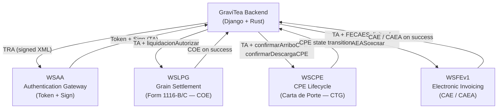
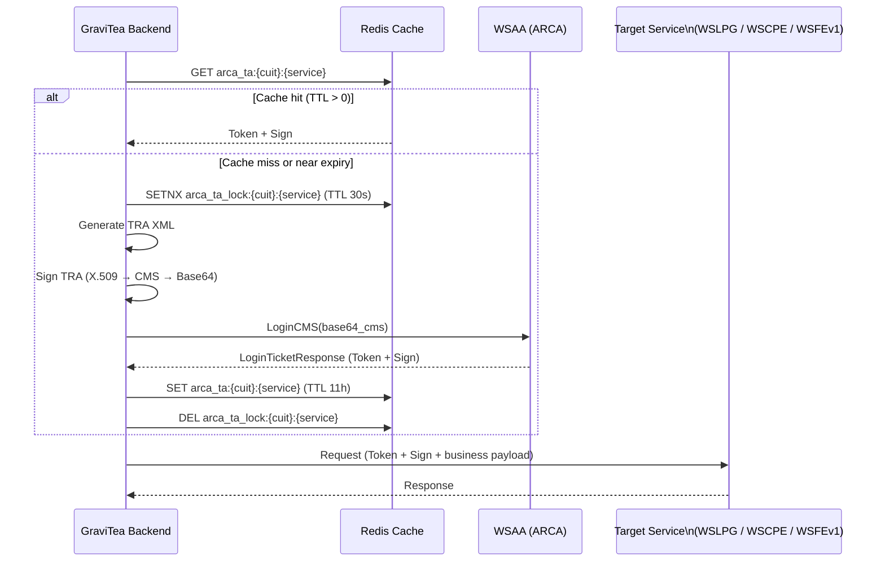
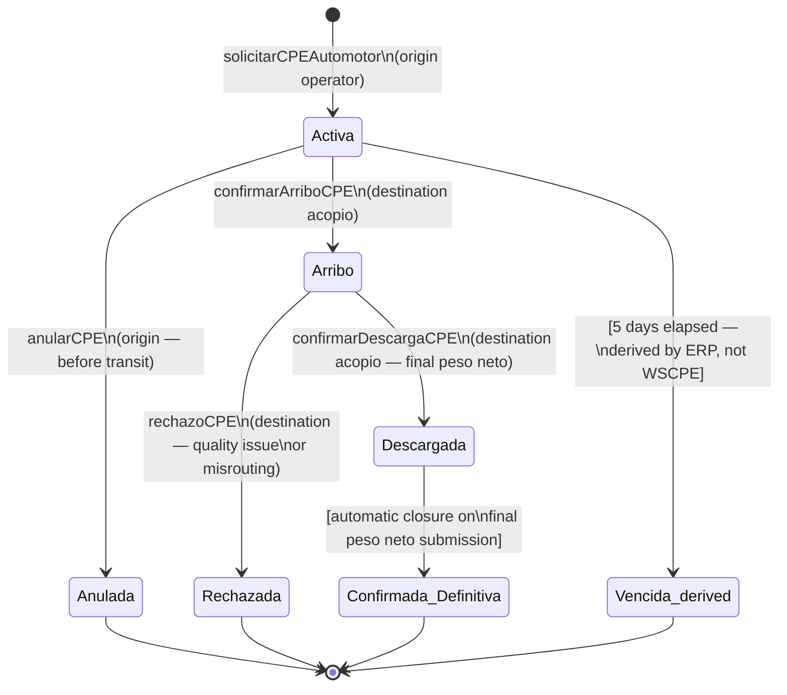
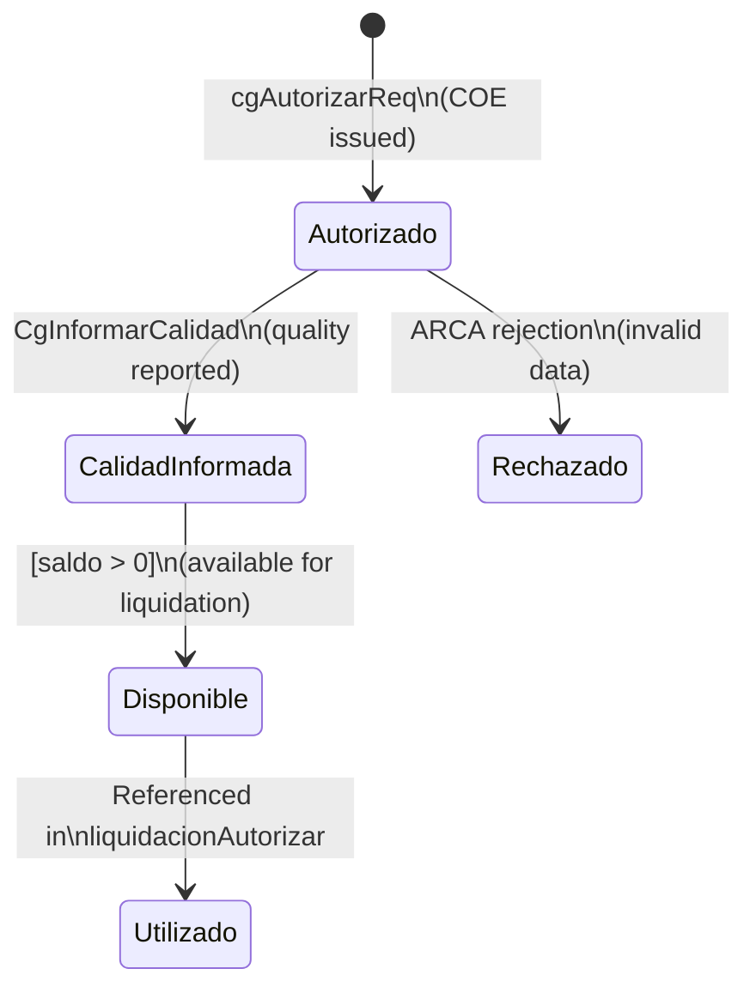

# ARCA Grain Integration Guide

| Field | Value |
|-------|-------|
| **Document ID** | spec-08a |
| **Version** | 1.1 |
| **Status** | Active |
| **Date** | 2026-03-18 |
| **Branch** | `008-acopio-new-docs` |
| **Authors** | GraviTea Team |
| **Upstream** | HLD §6 (ARCA Integration Architecture), ADR v1.0, PRD §6 (Regulatory Compliance) |

## Changelog

| Version | Date | Author | Summary |
|---------|------|--------|---------|
| 1.1 | 2026-03-18 | GraviTea Team | T011-T019: Renumbered sections (§6-§11 -> §11-§16). Added §6 SIRE retention certificates, §7 grain deposit certificates (via WSLPG), §8 WS Padron A4 & WS Constancia Inscripcion, §9 cross-service error catalog, §10 WSCDC comprobante verification. Enriched §3 (WSAA) with certificate chain, CSR format, TLS requirements, ADMINREL delegation. Enriched §4 (WSLPG) with Form 1116-B field catalog and deposit certificate fields. Enriched §5 (WSCPE) with XML field catalog and error codes. Updated §2.2 service catalog with SIRE IVA, WSLPG Grain Certificates, WS Padron A4, WS Constancia Inscripcion, WSCDC. Updated §15 ADR cross-references and §16 glossary. |
| 1.0 | 2026-03-18 | GraviTea Team | Initial version. Covers WSAA, WSLPG, WSCPE, WSFEv1/CAEA, certificate management, homologation testing, and open-source references. |

## Reading Guide

This document is the **developer reference** for ARCA grain web service integration in GraviTea. It bridges the architectural overview in HLD §6 with actionable SOAP endpoint details, XML schema summaries, certificate management procedures, error-handling strategies, and testing guidance against the ARCA homologation environment.

**Primary audience**: Backend developers implementing spec-10 (Romaneo Core), spec-14 (WSLPG Integration), and any future ARCA-dependent feature.

**How to read this document**:
1. Start with §2 (ARCA Service Overview) for the architectural picture.
2. Read §3 (WSAA) first — every other service call requires a Token+Sign from WSAA.
3. Read §4–§5 (WSLPG, WSCPE) for grain-specific service details; then §6–§10 for SIRE, grain deposit certificates, WS Padron, error catalog, and WSCDC.
4. Read §11 (WSFEv1) for electronic invoicing.
5. Return to §12 (Certificate Management) and §13 (Homologation Testing) when provisioning a new environment.

**Upstream dependencies**:

| Document | What it provides |
|----------|-----------------|
| HLD §6 | Architectural overview — expanded here with endpoint-level detail |
| ADR v1.0 | Architectural constraints cited throughout — see §15 |
| PRD §6 | Regulatory compliance rules: RG 3419/2012, RG 3690/2014, mandatory SISA query |
| Roadmap §5–§6 | Phase context — WSCPE + WSLPG in Phase 1; WSFEv1 in Phase 2 |

---

## §2 ARCA Service Overview

*ARCA* (Administración de Recursos de la Capacidad Almacenadora, formerly AFIP) provides four SOAP web services used by GraviTea for grain operations and fiscal compliance.

### §2.1 Hub-and-Spoke Architecture

WSAA acts as the single authentication gateway for all grain and fiscal services. No service accepts a business request without a valid Token+Sign pair (TA) obtained from WSAA.



### §2.2 Service Catalog

| Service | Purpose | Phase | Production URL | Homologation URL |
|---------|---------|-------|---------------|-----------------|
| **WSAA** | Authentication gateway — issues Token+Sign for all other services | Phase 1 | `https://wsaa.afip.gov.ar/ws/services/LoginCms` | `https://wsaahomo.afip.gov.ar/ws/services/LoginCms` |
| **WSLPG** | Grain settlement — authorizes Form 1116-B/C; returns COE | Phase 1 (spec-14) | `https://serviciosjava.afip.gob.ar/wslpg/LpgService?wsdl` | `https://fwshomo.afip.gov.ar/wslpg/LpgService?wsdl` |
| **WSCPE** | CPE lifecycle — confirms truck arrival, unloading, and CTG closure | Phase 1 (spec-10) | `https://serviciosjava.afip.gob.ar/wscpe/services/CPEService?wsdl` | `https://fwshomo.afip.gov.ar/wscpe/services/CPEService?wsdl` |
| **WSFEv1** | Electronic invoicing — per-invoice CAE or batch-offline CAEA | Phase 2 (spec-17) | `https://servicios1.afip.gov.ar/wsfev1/service.asmx?wsdl` | `https://wswhomo.afip.gov.ar/wsfev1/service.asmx?wsdl` |
| **SIRE IVA** | IVA retention certificate emission — SIRE system for withholding tax reporting | Phase 1 (spec-14) | (SIRE production URL not in RAG) | (SIRE homologation URL not in RAG) |
| **WSLPG Grain Certificates** | Grain deposit certificate authorization — sub-service of WSLPG for deposit certificate lifecycle (`cgAutorizarReq`, `cgConsultarXCoe`) | Phase 1 (spec-10) | Same as WSLPG | Same as WSLPG |
| **WS Padron A4** | CUIT/taxpayer data lookup — returns full padron data including tax registrations, activities, domicilios | Phase 1 (spec-10) | `https://aws.afip.gov.ar/sr-padron/webservices/personaServiceA4?WSDL` | `https://awshomo.afip.gov.ar/sr-padron/webservices/personaServiceA4?WSDL` |
| **WS Constancia Inscripcion** | Inscription constancy verification — confirms active SISA registration | Phase 1 (spec-10) | (Production URL not in RAG) | (Homologation URL not in RAG) |
| **WSCDC** | Comprobante verification — validates CAE/CAI/CAEA codes against ARCA records (`ComprobanteConstatar`) | Phase 2 (spec-17) | (Production URL not in RAG) | (Homologation URL not in RAG) |

WSLPG is currently at Manual del Desarrollador **v1.24** (January 30, 2026). Before each major integration sprint, verify the WSDL version by fetching the production WSDL and comparing the `wsdl:definitions@version` attribute.

### §2.3 Authentication Prerequisite

Every WSLPG, WSCPE, and WSFEv1 request **must** include a valid Token+Sign pair obtained from WSAA. Token+Sign pairs are **service-specific**: a TA for WSLPG cannot authenticate WSCPE or WSFEv1 calls. See §3 for the complete WSAA flow.

---

## §3 WSAA Authentication

WSAA implements certificate-based mutual authentication. GraviTea acts as the Ente Emisor (EE); ARCA acts as the Certificate Authority (CA) and issues X.509 certificates **free of charge**. See §12 for certificate provisioning.

### §3.1 TRA Generation

A *Ticket de Requerimiento de Acceso* (TRA) is the XML document requesting access to a specific service. It must be generated fresh for each WSAA login call (i.e., whenever the cached Token+Sign is absent or near expiry).

**TRA XML structure (abbreviated schema):**

```xml
<loginTicketRequest version="1.0">
  <header>
    <destination>cn=wsaa,o=afip,c=ar,serialNumber=CUIT 33693450239</destination>
    <uniqueId><!-- Monotonic counter or UUID — must be unique per request --></uniqueId>
    <generationTime><!-- ISO 8601, e.g. 2026-03-18T08:00:00-03:00 --></generationTime>
    <expirationTime><!-- generationTime + up to 12 hours --></expirationTime>
  </header>
  <service><!-- wslpg | wscpe | wsfe --></service>
</loginTicketRequest>
```

Key fields:

| Field | Constraint |
|-------|-----------|
| `uniqueId` | Must be globally unique per EE. Use a monotonic integer or UUID. WSAA rejects duplicates. |
| `generationTime` | Current timestamp ± 5 minutes (WSAA validates clock skew). |
| `expirationTime` | `generationTime + 12h` maximum. Longer windows are silently truncated by WSAA. |
| `service` | Target WSN identifier: `"wslpg"`, `"wscpe"`, or `"wsfe"`. Determines which service the TA authorises. |
| `destination` | WSAA DN of the target environment — differs between homologation and production. |

### §3.2 Certificate Signing

The TRA XML is signed with the EE's X.509 private key and wrapped in a CMS *SignedData* envelope:

1. Compute a SHA-1 with RSA digital signature over the TRA XML.
2. Embed the signed TRA in a PKCS#7/S/MIME `SignedData` structure (CMS). The EE's X.509 certificate is included in `SignedData.certificates` so WSAA can verify identity without a prior certificate exchange.
3. Base64-encode the CMS envelope to produce `LoginTicketRequest.xml.cms.base64`.

### §3.3 LoginCMS Invocation

Submit the Base64 CMS to WSAA via the `LoginCMS` SOAP method:

| Parameter | Type | Value |
|-----------|------|-------|
| `in0` | `xsd:string` | Base64-encoded CMS (`LoginTicketRequest.xml.cms.base64`) |

**Response** — `LoginTicketResponse` XML:

```
<loginTicketResponse>
  <credentials>
    <token>...</token>  <!-- The Token component of TA -->
    <sign>...</sign>    <!-- The Sign component of TA -->
  </credentials>
  <header>
    <generationTime>...</generationTime>
    <expirationTime>...</expirationTime>
  </header>
</loginTicketResponse>
```

Both `token` and `sign` are required in every subsequent WSLPG, WSCPE, and WSFEv1 request. The TA is valid until `expirationTime`.

### §3.4 Token+Sign Caching

**Token+Sign lifetime**: 12 hours from `generationTime`.

**Redis caching strategy**:

| Parameter | Value |
|-----------|-------|
| Cache key | `arca_ta:{cuit}:{service}` (e.g., `arca_ta:30712345678:wslpg`) |
| Cache TTL | **11 hours** — 1-hour safety margin to avoid using a near-expiry token mid-batch |
| Cache value | JSON: `{"token": "...", "sign": "...", "expires_at": "..."}` |

**Concurrent refresh handling**: Multiple workers may simultaneously detect a cache miss during harvest peaks. Implement a distributed lock using Redis SETNX on `arca_ta_lock:{cuit}:{service}` (TTL: 30 seconds). The first worker to acquire the lock performs the WSAA call and populates the cache. All others wait and then read the newly cached TA.

### §3.5 WSAA Authentication Sequence



### §3.6 Error Handling

| WSAA Error Code | Meaning | System Response |
|-----------------|---------|-----------------|
| `wsaa.expiredCredential` | TA has expired | Invalidate Redis cache entry; trigger fresh WSAA call |
| `wsaa.invalidCredential` | Certificate rejected or not linked to WSN | Alert operator; verify certificate provisioning in ARCA portal |
| `wsn.notFound` | `<service>` tag value unknown or unregistered | Check WSN name in TRA; verify ARCA service identifier |
| `wsaa.unavailable` | WSAA momentarily offline | Retry with exponential backoff: 3 attempts at 5 s, 15 s, 60 s; circuit-break after 3rd failure |
| `wsaa.internalError` | WSAA processing failure | Log `uniqueId`; retry once; if persists, escalate to operations team |
| Certificate expiry (hard) | Private key no longer matches certificate | Queue all pending operations via ADR-030; alert admin for emergency certificate renewal |

### §3.7 Certificate Chain

ARCA operates as the Certificate Authority (CA) for all web service X.509 certificates.

**Homologation Certificate Chain** (from WSASS manual):

| Level | Name | Organization | Country | Notes |
|-------|------|-------------|---------|-------|
| Issuer CA | Computadoras Test | AFIP | AR | Issues all testing/homologation certificates |
| End-entity | `SERIALNUMBER=CUIT {11-digit}, CN={alias}` | AFIP | AR | Issued via WSASS portal |

**Production Certificate Chain**: Production certificates are obtained via the ARCA production portal (arca.gob.ar) with Clave Fiscal Level 3. The issuing CA differs from homologation. Default validity: 2 years (production) vs 90 days (homologation).

> **Note**: Exact production CA name (expected: an "AFIP" or "ARCA" root CA) requires confirmation from the production portal. The homologation issuer is confirmed as `CN=Computadoras Test, O=AFIP, C=AR` from WSASS-issued certificates.

### §3.8 CSR Distinguished Name Format

The Certificate Signing Request (CSR) must use the following DN fields:

| DN Field | Value | Example |
|----------|-------|---------|
| Country (C) | `AR` | Always Argentina |
| Organization (O) | Company name | `MiEmpresa` |
| Common Name (CN) | System/application name | `TestSystem` |
| Serial Number | `CUIT` followed by space and 11-digit CUIT | `CUIT 20123456789` |

**OpenSSL command**:
```
openssl req -new -key {key_file}.key \
  -subj "/C=AR/O={company}/CN={system}/serialNumber=CUIT {11_digit_cuit}" \
  -out {csr_file}.csr
```

> **IMPORTANT**: The `serialNumber` field must contain the literal string `CUIT` followed by a single space and exactly 11 digits with no hyphens or separators.

### §3.9 TLS Requirements

ARCA is migrating all web service endpoints to **TLS v1.2** minimum. TLS v1.0 and v1.1 are being discontinued as obsolete and subject to security risks.

**Affected endpoints** (from ARCA TLS migration schedule):

| Endpoint | TLS v1.2 Requirement |
|----------|---------------------|
| `auth.afip.gob.ar` | Scheduled |
| `servicios1.afip.gob.ar` | Scheduled |
| `serviciosjava.afip.gob.ar` | Scheduled |
| `wsaa.afip.gov.ar` / `wsaahomo.afip.gov.ar` | Scheduled |

All GraviTea ARCA clients **must** enforce TLS v1.2 or higher. Configure the HTTP/SOAP transport library to reject TLS versions below 1.2.

### §3.10 ADMINREL — Multi-Tenant Certificate Delegation

For multi-tenant deployments where a software provider (EE) operates on behalf of multiple taxpayers (CUITs), ARCA provides the ADMINREL (Administrador de Relaciones) delegation mechanism.

**Delegation workflow**:

1. The taxpayer (CUIT owner) accesses the ARCA portal with Clave Fiscal Level 3.
2. Navigate to "Administrador de Relaciones de Clave Fiscal".
3. Select "Agregar una relacion" and search for the software provider's CUIT.
4. Select the target web service (e.g., WSLPG, WSCPE, WSFEv1).
5. Confirm the delegation — the provider is now authorized to act on behalf of the taxpayer for that service.
6. The provider creates a certificate with their own CUIT and uses the `cuitRepresentada` field in WSAA calls to operate as the delegated taxpayer.
7. The delegation can be revoked at any time by the taxpayer through the ADMINREL portal.

> **Multi-tenant implication**: Each tenant's CUIT must delegate the required services to the GraviTea operator's CUIT. This is a manual process requiring the tenant's Clave Fiscal. GraviTea stores the operator's single certificate set and uses `cuitRepresentada` to switch between tenants.

---

## §4 WSLPG — Grain Settlement (Form 1116-B/C)

### §4.1 Purpose and Regulatory Context

WSLPG (*Web Service de Liquidación Primaria de Granos*) electronically authorizes primary grain settlements. Each successful call returns a **COE** (Código de Operación Electrónico) — the legally binding identifier for the transaction. WSLPG is governed by:

- **RG 3419/2012** — established the electronic Liquidación Primaria de Granos (LPG) as the mandatory replacement for paper Forms 1116-B/C.
- **RG 3690/2014** — extended LPG requirements to grain certification operations.
- **RG 3691/2014** — grain certification and quality reporting extensions.

Current WSDL version: **v1.24** (January 30, 2026). Always check version currency before a new integration sprint.

### §4.2 Service URLs

| Environment | WSLPG WSDL URL |
|-------------|----------------|
| **Production** | `https://serviciosjava.afip.gob.ar/wslpg/LpgService?wsdl` |
| **Homologation** | `https://fwshomo.afip.gov.ar/wslpg/LpgService?wsdl` |

### §4.3 liquidacionAutorizar Method

The primary WSLPG call that creates and authorizes a grain settlement.

**Key XML fields in the request (abbreviated schema):**

| Field | Type | Required | Description |
|-------|------|----------|-------------|
| `auth.token` | string | Yes | WSAA Token (from §3) |
| `auth.sign` | string | Yes | WSAA Sign (from §3) |
| `auth.cuit` | long | Yes | Acopiador CUIT (11 digits) |
| `cuitVendedor` | long | Yes | Producer's CUIT |
| `codGrano` | short | Yes | Grain species code — **single value at root** (see §4.4) |
| `codTipoOperacion` | short | Yes | 01 = Compra-Venta, 02 = Consignación |
| `nroCartaDePorte` | long | Yes | CPE Carta de Porte number |
| `nroCTG` | long | Yes | CTG number (from WSCPE) |
| `campania` | short | Yes | Campaign code (e.g., `2324` = 2023/2024 season) |
| `cantKilosConfirmados` | decimal | Yes | Final net kilograms confirmed at unloading |
| `codGradoRef` | string | Yes | Reference grade code (from `codigoGradoReferenciaConsultar`) |
| `valGradoEnt` | decimal | Cond. | Delivered grade value |
| `factorEnt` | decimal | Cond. | Factor for grade adjustment |
| `precioRef` | decimal | Yes | Reference price (ARS per ton) |
| `precioMercTotal` | decimal | Yes | Total market price |
| `importeTotal` | decimal | Yes | Total amount before retenciones/deducciones |
| `retencion[]` | array | Cond. | Retention entries: IVA (per RG 2300/SISA), Ganancias (per RG 4325) |
| `deduccion[]` | array | Cond. | Deduction entries: AL (Almacenaje), CO (Comisión), OD (Otras) |

**On success**, WSLPG returns:

| Response Field | Description |
|----------------|-------------|
| `coe` | COE — authoritative legal identifier; persist to database immediately on receipt |
| `nroOrden` | WSLPG internal order number |
| `estado` | Status code: `"AC"` = Activo, `"AN"` = Anulado |
| `fechaLiquidacion` | Authorized settlement date |
| `topeKilos` | Maximum authorised kilogram ceiling |

### §4.4 Single Grain Type Constraint

Per **ADR-019 (Single Form 1116-C per Grain Type)**, `codGrano` sits at the XML root of the settlement. A single `liquidacionAutorizar` call covers exactly **one grain type**. If a reception involves multiple species (uncommon but possible), the ERP generates separate `liquidacionAutorizar` calls — one per grain type per CTG.

This constraint shapes the GraviTea data model: `TipoGrano` is associated at the *romaneo* level, not the storage batch level.

**Available grain codes** are fetched via the `tipoGranoConsultar` parameter lookup method at WSLPG startup. Common codes:

| codGrano | Species |
|---------- |---------|
| 23 | Soja (Soybean) |
| 31 | Maíz (Corn) |
| 54 | Trigo Pan (Bread Wheat) |
| 44 | Girasol (Sunflower) |
| 83 | Sorgo Granífero (Grain Sorghum) |

### §4.5 SISA Blocking Gate

Per **ADR-027 (SISA-Tier Retention Calculation at WSLPG Filing Time)**, the ERP **must** query the producer's SISA status before every `liquidacionAutorizar` call. SISA (*Sistema de Información Simplificado Agrícola*) is ARCA's real-time compliance scoring system for grain market participants.

**SISA retention tiers (2025–2026, RG 4325 for Ganancias / SISA-IVA regime):**

| SISA Estado | Riesgo | IVA Retention (RG 2300) | Ganancias Retention (RG 4325) |
|-------------|--------|-------------------------|-------------------------------|
| **Estado 1** | RIESGO BAJO | **5%** of taxable IVA base | **0%** |
| **Estado 2** | RIESGO MEDIO | **8%** of taxable IVA base | **2%** |
| **Estado 3** | RIESGO ALTO | **10.5%** of taxable IVA base | **15%** |
| Non-registered / suspended | — | **16%** of taxable IVA base | **30%** |
| Monotributista / IVA-exempt | — | 0% (regime not applicable) | 0% (excluded) |

**Implementation rules:**
- Query SISA at the time of settlement. SISA state can change periodically; do not cache between romaneos.
- SISA Estado 1 IVA retentions are refundable by ARCA to the producer via a systematic credit mechanism.
- Store the queried SISA estado and query timestamp in the WSLPG liquidacion record for audit purposes.
- A failed SISA query (network error) must block the `liquidacionAutorizar` call — do not proceed with a default rate.

### §4.6 Response Parsing and COE Extraction

A successful response contains both the `coe` and any non-fatal warnings in `errorCodes[]`. Non-fatal warnings do not prevent authorization but must be logged. Persist the COE immediately on receipt — it is required for downstream SIRE F.2005 retention certificates.

### §4.7 Parameter Lookup Methods

WSLPG exposes reference data methods that must be called at startup to seed the ERP's local lookup tables:

| SOAP Method | Returns |
|-------------|---------|
| `tipoGranoConsultar` | Grain type codes + descriptions |
| `codigoGradoReferenciaConsultar` | Reference grade codes per grain type |
| `codigoGradoEntregadoXTipoGranoConsultar` | Delivered grade codes and values per grain type |
| `tipoCertificadoDepositoConsultar` | Deposit certificate types (1=F1116/RT, 5=F1116/A, 332=Electronic) |
| `tipoDeduccionConsultar` | Deduction type codes (AL, CO, OD, etc.) |
| `tipoRetencionConsultar` | Retention type codes (RI=IVA, RG=Ganancias, etc.) |
| `puertoConsultar` | Enabled grain export ports |
| `campaniasConsultar` | Available campaign codes (e.g., `2324`) |
| `tipoOperacionXActividadConsultar` | Operation types per registered activity |

All lookup methods return `LpgCodigoDescripcionType[]` arrays with `codigo` and `descripcion` fields.

### §4.8 Error Codes and Handling

| Error Code | Description | Action |
|------------|-------------|--------|
| `10001` | Invalid CUIT format | Verify producer CUIT (11 digits, Luhn check) |
| `10016` | Comprobante not found or CTG mismatch | Verify CPE / carta de porte / CTG alignment |
| `10030` | CUIT not registered in ARCA padrón | Check producer's ARCA registration status |
| `1110` | CTG already associated to a previous settlement | Run idempotency check — settlement may have succeeded previously |
| `700` | SISA blocking gate failed | Query SISA API directly; check if producer is suspended or excluded |
| Auth failure | Invalid Token+Sign | Force WSAA refresh via §3; retry once |

### §4.9 Form 1116-B XML Field Catalog (liquidacionAutorizar)

The primary `liquidacionAutorizar` method accepts the following XML structure. Fields are grouped by logical section within the request.

**Cabecera (Header)**:

| Field | Type | Length | Required | Description |
|-------|------|--------|----------|-------------|
| `ptoEmision` | LpgPtoEmision | 4 | Yes | Punto de emision |
| `nroOrden` | long | 18 | Yes | Numero de orden |
| `cuitComprador` | LpgCuitType | 11 | Yes | CUIT comprador |
| `nroIngBrutoComprador` | LpgIbType | — | Yes | Ingresos brutos comprador |
| `cuitVendedor` | LpgCuitType | 11 | Yes | CUIT vendedor |
| `nroActVendedor` | LpgActividadType | — | Yes | Nro actividad vendedor |
| `nroIngBrutoVendedor` | LpgIbType | — | Yes | Ingresos brutos vendedor |
| `actuaCorredor` | LpgSiNoType | 1 | Yes | S/N actua corredor |
| `liquidaCorredor` | LpgSiNoType | 1 | Yes | S/N liquida corredor |
| `cuitCorredor` | LpgCuitType | 11 | Cond. | CUIT corredor (required if `actuaCorredor=S`) |
| `codGrano` | LpgCodigoGranoType | 3 | Yes | Codigo de grano (see §4.4) |
| `pesoNetoEnTn` | Numero_8_3_Type | — | Yes | Peso neto en toneladas |
| `campania` | LpgCampaniaType | 4 | Yes | Campania (e.g. `2324`) |
| `fechaPrecioOperacion` | date | — | Yes | Fecha precio operacion |
| `codPuerto` | LpgCodPuertoType | — | Yes | Codigo puerto |
| `precioReferenciaTn` | LpgPrecioRefTnType | — | Yes | Precio referencia por Tn |
| `precioOperacionTn` | LpgPrecioOperacionTn | — | Yes | Precio operacion por Tn |
| `alicuotaIvaOperacion` | LpgAlicuotaType | — | Yes | Alicuota IVA operacion |

**Certificados array** (within 1116-B):

| Field | Type | Length | Required | Description |
|-------|------|--------|----------|-------------|
| `tipoCertificado` | String | 1 | Yes | P=Primaria, R=Retiro/Transferencia |
| `nroCTG` | Numero_12_0_Type | 12 | Yes | Numero CTG |
| `nroCartaDePorte` | Numero_13_0_Type | 13 | Yes | Numero carta de porte |
| `pesoNetoConfirmadoDefinitivo` | NumeroZ_8_2_Type | — | Yes | Peso neto confirmado |
| `porcentajeSecadoHumedad` | LpgPorcentajeType | — | Yes | % secado humedad |
| `importeSecado` | NumeroZ_8_2_Type | — | Yes | Importe secado |
| `pesoNetoMermaSecado` | NumeroZ_8_2_Type | — | Yes | Peso neto merma secado |

**Form 1116-C (secundaria)** adds the `deduccion` array:

| Field | Type | Length | Required | Description |
|-------|------|--------|----------|-------------|
| `deduccion.detalleAclaratoria` | String_50_Type | 50 | Yes (per item) | Detalle aclaratorio |

> Full 1116-B/C field schemas: see WSLPG Manual v1.24 pp. 216-240.

### §4.10 Grain Deposit Certificates (via WSLPG)

WSLPG includes a sub-module for grain deposit certificate management. These certificates record grain received and stored at an acopiador's establishment. They are authorized via WSLPG and are required for downstream liquidation and withdrawal operations.

**Certificate Methods**:

| Method | Description | Key Parameters |
|--------|-------------|---------------------|
| `cgAutorizarReq` | Authorize a new grain deposit certificate | `tipoCertificado` (P/R), `ptoEmision`, `codGrano`, `campania`, CTG data, quality metrics |
| `cgConsultarXCoe` | Query certificate by COE | `auth`, `coe` |
| `cgBuscarCertConSaldoDisponible` | Find certificates with available balance | `cuitDepositante`, `codGrano`, `campania`, date range |
| `CgInformarCalidad` | Report quality analysis for a certificate | `coe`, `analisisMuestra`, `codGrado`, `valorContProteico` |
| `tipoCertificadoDepositoConsultar` | Query valid certificate types | `auth` |

**Certificate types** (from `tipoCertificadoDepositoConsultar`):

| Code | Description |
|------|-------------|
| 1 | F1116/RT (standard retention/transfer) |
| 5 | F1116/A |
| 332 | Electronic (electronic deposit certificate) |

**Key XML fields** (from `cgAutorizarReq`):

| Field | Type | Required | Description |
|-------|------|----------|-------------|
| `tipoCertificado` | String(1) | Yes | P=Primaria, R=Retiro/Transferencia |
| `ptoEmision` | LpgPtoEmision | Yes | Punto de emision |
| `nroOrden` | long | Yes | Numero de orden |
| `nroIngBrutoDepositario` | LpgIbType | Yes | Ingresos brutos depositario |
| `titularGrano` | CgTipoTitularGranoType(1) | Yes | Titular del grano (T=Titular) |
| `cuitDepositante` | LpgCuitType | No | CUIT depositante |
| `codGrano` | LpgCodigoGranoType(3) | Yes | Codigo grano |
| `campania` | LpgCampaniaType(4) | Yes | Campania |
| `nroPlanta` | Numero_6_0_Type | No | Numero de planta |
| `cuitDepositario` | LpgCuitType | Yes | CUIT depositario |
| `codLocalidad` | LpgCodLocProcedenciaType | Yes | Codigo localidad |
| `codProvincia` | LpgCodProvProcedenciaType | Yes | Codigo provincia |

**Primaria sub-fields** (CTG data within the certificate):

| Field | Type | Description |
|-------|------|-------------|
| `nroCTG` | Numero_12_0_Type | Numero CTG (from WSCPE) |
| `nroCartaDePorte` | Numero_13_0_Type | Carta de porte number |
| `pesoNetoConfirmadoDefinitivo` | NumeroZ_8_2_Type | Final confirmed net weight |
| `porcentajeSecadoHumedad` | LpgPorcentajeType | Drying/humidity percentage |
| `importeSecado` | NumeroZ_8_2_Type | Drying cost |
| `pesoNetoMermaSecado` | NumeroZ_8_2_Type | Net weight after drying loss |
| `montoAlmacenaje` | NumeroZ_8_2_Type | Storage cost |
| `montoAcarreo` | NumeroZ_8_2_Type | Hauling cost |

**Quality reporting** (via `CgInformarCalidad`):

| Field | Type | Description |
|-------|------|-------------|
| `analisisMuestra` | numeric | Sample analysis number |
| `nroBoletin` | numeric | Bulletin number |
| `codGrado` | string | Grade code (G1, G2, G3) |
| `valorContProteico` | numeric | Protein content value |
| `valorFactor` | numeric | Factor value |

**Certificate lifecycle**: Authorized (COE issued) -> Quality Informed -> Available for liquidation/withdrawal/transfer. Certificates with `kilosDisponibles > 0` can be used in `liquidacionAutorizar` calls. Retiro/transferencia certificates reference an existing deposit certificate via `coeCertificadoDeposito`.

> **Integration with romaneo**: When grain arrives at the acopio, the romaneo workflow creates a WSCPE confirmation (§5) and a grain deposit certificate (via `cgAutorizarReq`). The certificate references the CTG and carta de porte data. The `CertificadoDepositoCereal` entity in GraviTea tracks this relationship.

---

## §5 WSCPE — CPE Lifecycle

### §5.1 CPE/CTG Overview

A *Carta de Porte Electrónica* (CPE) is the mandatory electronic waybill for grain transport in Argentina. It is created by the origin operator (producer or grain broker) before the truck departs. Each CPE carries a *CTG* (Código de Trazabilidad de Granos) — the numeric identifier used in downstream WSLPG filings and romaneo records.

The destination *acopio* interacts with WSCPE at two points in the *romaneo* workflow:

1. **Truck arrival** — `confirmarArriboCPE` signals ARCA that the truck reached its declared destination.
2. **Unloading completion** — `confirmarDescargaCPE` records the final net weight and legally closes the CPE.

Regulatory basis: CPE is mandatory under Resolution SENASA and ARCA joint regulations. The SMS shortcode 2347 can be used as a fallback for CPE verification when the web service is unavailable during transit.

### §5.2 CPE State Machine



> **Note on "Vencida"**: A CPE Automotor is valid for exactly **5 days** from issuance. "Vencida" (expired) is **not a WSCPE state code** returned by the service — it is a **derived condition** computed by the ERP by comparing the CPE creation timestamp (`fechaEmision`) against the current time. A vencida CPE cannot be confirmed through WSCPE; the producer must request a new CPE.

### §5.3 Method Catalog

| WSCPE Method | Caller | Purpose |
|--------------|--------|---------|
| `solicitarCPEAutomotor` | Origin operator | Creates a new CPE and returns the CTG number |
| `consultarCPEAutomotor` | Any | Retrieves current state and metadata of an existing CPE |
| `confirmarArriboCPE` | Destination acopio | Registers truck arrival; transitions state from Activa → Arribo |
| `confirmarDescargaCPE` | Destination acopio | Confirms unloading; records final net weight; closes the CTG |
| `anularCPE` | Origin operator | Cancels a CPE before the truck has physically departed |
| `rechazoCPE` | Destination acopio | Rejects an arrived CPE due to quality issues or misrouting |
| `consultarRenspa` | Any | Validates the sanitary registration polygon of the origin producer (added in WSCPE v2.0.6) |

> **Method name note**: The ARCA WSCPE WSDL defines the unloading confirmation method as **`confirmarDescargaCPE`**. Earlier drafts of HLD §6 used the incorrect name; all references have been corrected to the WSDL-authoritative name. Use `confirmarDescargaCPE` in all implementations.

**confirmarArriboCPE** key parameters:
- `nroCartaDePorte` — CPE number
- `cuitTransportista` — truck carrier CUIT
- `pesoRecibido` — estimated kilograms at arrival (not the final weight; overwritten by `confirmarDescargaCPE`)

**confirmarDescargaCPE** key parameters:
- `nroCartaDePorte` — CPE number
- `pesoNeto` — **final net weight derived from the romaneo** (Peso Bruto − Tara) — this value legally overwrites the CPE's estimated field weight and closes the CTG
- `codigoLocalidadDestino` — destination locality code
- `kilosRecibidos` — confirmed kilograms received

### §5.4 CPE Automotor Validity Window

A CPE Automotor is valid for **5 days** from issuance. ERP responsibilities:

1. Display a **warning** when a queued romaneo references a CPE within 24 hours of the 5-day expiry.
2. Reject `confirmarArriboCPE` calls against locally-detected expired CPEs before submitting to WSCPE (validate locally first to avoid unnecessary SOAP round-trips).
3. Log expired CPE events and notify the origin operator to reissue.
4. Never attempt `confirmarDescargaCPE` against an expired CPE — WSCPE will reject it.

### §5.5 Offline Store-and-Forward

Per **ADR-030 (Store-and-Forward Queue for ARCA Web Service Calls)**, when the ERP has no internet connectivity, WSCPE method calls are serialised as `PendingOperation` records with status `PENDING`. On reconnection, a background sync worker drains the queue.

**Queue ordering is critical**: `confirmarArriboCPE` must always precede `confirmarDescargaCPE` for the same CPE. The PendingOperation model preserves FIFO ordering within a CPE scope.

This behaviour implements **ADR-028 (Offline-First as Base Architecture)** — the acopio must be able to receive and weigh grain without real-time ARCA connectivity. **ADR-029 (Conflict Resolution Taxonomy)** governs how conflicting state transitions are resolved when reconnecting after an extended offline period.

### §5.6 Error Paths

| WSCPE Condition | Cause | Resolution |
|-----------------|-------|------------|
| CPE not in Activa state on `confirmarArriboCPE` | Duplicate arrival confirmation or CPE already in Arribo | Query `consultarCPEAutomotor`; check if already confirmed |
| CPE vencida (5-day window elapsed) | Truck arrived after validity | Request producer to reissue CPE; log for audit trail |
| `rechazoCPE` after arrival | Quality failure or misrouting at destination | Notify origin operator; generate rejection receipt |
| Offline queue overflow | Extended offline period exceeds queue capacity | Alert operator; pause new romaneo intake; prioritise connectivity restoration |
| WSCPE unavailable | ARCA service outage | Queue via ADR-030; retry using exponential backoff |

### §5.7 WSCPE XML Field Catalog

**Cabecera fields** (common to all CPE methods):

| Field | Type | Required | Description |
|-------|------|----------|-------------|
| `tipoCartaPorte` | integer | Yes | Tipo CPE (e.g. 74=Automotor Granos) |
| `sucursal` | integer | Yes | Sucursal (punto de venta) |
| `nroOrden` | integer | Yes | Numero de orden |
| `nroCTG` | long | Yes | Codigo de Trazabilidad de Granos |
| `fechaEmision` | date | Yes | Fecha de emision |
| `estado` | string | Yes | Estado actual de la CPE |
| `fechaInicioEstado` | date | Yes | Fecha inicio estado actual |
| `fechaVencimiento` | date | Yes | Fecha vencimiento (emision + 5 dias para Automotor) |

**solicitarCPEAutomotor** additional fields:

| Field | Type | Required | Description |
|-------|------|----------|-------------|
| `origen.cuit` | long | Yes | CUIT del remitente |
| `origen.codLocalidadOrigen` | integer | Yes | Codigo localidad origen |
| `destino.cuit` | long | Yes | CUIT del destinatario (acopio) |
| `destino.codLocalidadDestino` | integer | Yes | Codigo localidad destino |
| `datosGenerales.codGrano` | integer | Yes | Codigo de grano |
| `datosGenerales.pesoBrutoKg` | decimal | Yes | Peso bruto en kg |
| `datosGenerales.pesoTaraKg` | decimal | Yes | Peso tara en kg |
| `transporte.cuitTransportista` | long | Yes | CUIT transportista |
| `transporte.dominioCamion` | string | Yes | Dominio/patente del camion |
| `transporte.dominioAcoplado` | string | No | Dominio/patente del acoplado |

**CPE state codes** returned by WSCPE (from WSCPE Manual v2.2.0):

| Code | State | Description |
|------|-------|-------------|
| PE | Pendiente | CPE pending confirmation |
| PO | Procesada/Otorgada | CPE processed, CTG assigned |
| AC | Activa | CPE active, truck in transit |
| DE | Descargada | Grain unloaded at destination |
| CF | Confirmada Definitiva | Terminal — CPE closed |
| AN | Anulada | Terminal — CPE cancelled |
| PR | Presentada ante ARCA | CPE presented to ARCA |

> **Note**: WSCPE v2.2.0 (rev 4.7.19) defines variant methods for different CPE sub-types (e.g. `DescargadoDestinoCPEEmisionDestinoDG` for Emision Destino DG variant). The standard grain acopio workflow uses `confirmarDescargaCPE` for the unloading step.

### §5.8 WSCPE Error Codes

| Error Pattern | Description | Resolution |
|--------------|-------------|-----------|
| CPE state invalid | Method called on CPE in wrong state | Query `consultarCPEAutomotor` to check current state |
| CTG already used | CTG referenced in another active operation | Verify CTG uniqueness in romaneo records |
| CPE expired (5 days) | Validity window elapsed | Request producer to reissue CPE |
| Auth failure | Invalid Token+Sign | Force WSAA refresh (§3.4); retry once |
| Format errors | Missing or malformed XML fields | Validate request against WSCPE WSDL schema |

> Complete WSCPE error code table: see WSCPE Manual v2.2.0 Annex. Error responses use `<errores><error><codigo>string</codigo><descripcion>string</descripcion></error></errores>` structure.

---

## §6 SIRE — Retention Certificate Services

### §6.1 Overview

SIRE (*Sistema Integral de Retenciones Electronicas*) is ARCA's electronic retention certificate system. Acopiadores use SIRE to emit and manage IVA and Ganancias retention certificates as part of grain liquidation (WSLPG) operations.

SIRE provides two web service interfaces:
- **SIRE General** — for Ganancias and other non-IVA retentions
- **SIRE IVA** — specifically for IVA retentions

Both interfaces support individual retention emission via SOAP and batch emission via file import ("Emision por Lote").

### §6.2 SIRE IVA — Retention Fields

The SIRE IVA specification (effective 01-December-2019, `SOAP-SIRE-IVA-Manualparaeldesarrollador_V1_0_0.pdf`) defines the following fields for retention emission:

| Field | Type | Description / Validation |
|-------|------|-------------------------|
| `fechaRetencion` | date | Retention date |
| `condicion` | code | Must exist in ARCA table `CONDICION` |
| `imposibilidadRetencion` | boolean | `false` = Retention performed; `true` = Not performed |
| `motivoNoRetencion` | string | Required when `imposibilidadRetencion=true` |
| `importeRetencion` | decimal | Retention amount |
| `importeBaseCalculo` | decimal | Base calculation amount |
| `regimenExclusion` | boolean | `false` = Not excluded; `true` = Excluded from regime |
| `porcentajeExclusion` | decimal | 50 or 100. Required if `regimenExclusion=true` |
| `fechaPublicacion` | date | ARCA certificate publication or exclusion expiry date |
| `tipoComprobante` | code | Must exist in ARCA table `TIPO_COMPROBANTE` |
| `fechaComprobante` | date | Must be <= `fechaRetencion`. For types [3, 19, 20]: must equal `fechaRetencion` |
| `numeroComprobante` | string | Format per `TIPO_COMPROBANTE` table |
| `coe` | string | COE from WSLPG liquidation |
| `importeComprobante` | decimal | Comprobante total amount |
| `cuitRetenido` | CUIT | CUIT/CUIL/CDI of the retained party — must exist in ARCA |
| `numeroCertificadoOriginal` | string | Required for annulment operations |

### §6.3 Batch Lote Import

SIRE supports batch retention emission via file upload ("Emision por Lote" — `SIRE-especificacion-para-emision-por-lote.pdf`). Key characteristics:

- Batch files can be uploaded via the SIRE web interface
- When a file contains errors, the system identifies erroneous lines and saves only valid records
- Imported retentions can be queried via "Busqueda de Certificados"
- Detailed error descriptions are provided for each rejected line

> Full batch file format specification: see `SIRE-especificacion-para-emision-por-lote.pdf` (10 pages). File encoding and record structure require PDF fallback — not fully indexed in RAG.

### §6.4 Retention Tier Table

The SISA retention tiers apply to WSLPG grain settlements. These percentages are applied by the ERP based on the producer's SISA risk category (see §8.4 for the SISA validation workflow).

| SISA Estado | Riesgo | IVA Retention (RG 2300) | Ganancias Retention (RG 4325) |
|-------------|--------|-------------------------|-------------------------------|
| **Estado 1** | RIESGO BAJO | **5%** of taxable IVA base | **0%** |
| **Estado 2** | RIESGO MEDIO | **8%** of taxable IVA base | **2%** |
| **Estado 3** | RIESGO ALTO | **10.5%** of taxable IVA base | **15%** |
| Non-registered / Suspended | — | **16%** of taxable IVA base | **30%** |
| Monotributista / IVA-exempt | — | 0% (regime not applicable) | 0% (excluded) |

> **Cross-document consistency (SC-007)**: These values **must** appear identically in §4.5 (WSLPG SISA Blocking Gate), ADR-027, and SRS wherever the SISA tier table is documented.

> **Regulatory basis**: IVA retentions per RG 2300/SISA regime. Ganancias retentions per RG 4325. SIRE IVA fields reference these rates via `importeRetencion` and `importeBaseCalculo`.

---

## §7 Grain Deposit Certificates (via WSLPG)

### §7.1 Regulatory Obligation

Argentine law requires registered acopiadores (depositarios) to issue grain deposit certificates for grain received at their establishments. These certificates are managed electronically through WSLPG's certificate module (`cg*` methods) — they are NOT a separate ARCA web service but a sub-module within WSLPG.

> **Disambiguation**: "WSCDC" in the ARCA ecosystem refers to *Web Service Constatacion de Comprobantes* — a service for **verifying** existing comprobantes (invoices/receipts). It is NOT related to grain deposit certificates. See §10 for WSCDC Constatacion details.

All registered depositarios must issue certificates. Required fields include the depositario's CUIT, Ingresos Brutos, and activity number.

### §7.2 Certificate Lifecycle



Certificates with `kilosDisponibles > 0` can be found via `cgBuscarCertConSaldoDisponible` and referenced in downstream `liquidacionAutorizar` calls. Retiro/transferencia certificates reference a parent deposit certificate via `coeCertificadoDeposito`.

### §7.3 Certificate Methods

| Method | Description | Caller |
|--------|-------------|--------|
| `cgAutorizarReq` | Authorize a new grain deposit certificate | Acopiador (depositario) |
| `cgConsultarXCoe` | Query certificate by COE | Any authorized party |
| `cgBuscarCertConSaldoDisponible` | Find certificates with available balance | Acopiador |
| `CgInformarCalidad` | Report quality analysis (grade, protein, factor) | Acopiador |
| `tipoCertificadoDepositoConsultar` | Query valid certificate types (1, 5, 332) | Any |

### §7.4 XML Field Catalog

See §4.10 for the complete field catalog of `cgAutorizarReq`, quality fields, and certificate types.

### §7.5 Integration with Romaneo

When grain arrives at the acopio, the romaneo workflow triggers:

1. `confirmarArriboCPE` (§5) — registers truck arrival
2. `confirmarDescargaCPE` (§5) — records final net weight, closes CTG
3. `cgAutorizarReq` — authorizes grain deposit certificate with CTG and weight data
4. `CgInformarCalidad` — reports quality analysis results

The `CertificadoDepositoCereal` entity in GraviTea maps to the WSLPG grain certificate. The entity's `arca_nro_certificado` field stores the COE returned by `cgAutorizarReq`. See Data Model for entity definition.

> **Error handling**: If `cgAutorizarReq` fails (ARCA unavailable), the certificate transitions to `Pendiente` state and is retried via the store-and-forward queue (ADR-030).

---

## §8 WS Padron A4 & WS Constancia Inscripcion

### §8.1 Purpose

WS Padron A4 (`ws_sr_padron_a4`, v1.3) provides comprehensive taxpayer data from ARCA's unified taxpayer registry (*Padron Unico de Contribuyentes*). GraviTea uses it at romaneo reception to retrieve producer registration data and determine applicable retention tiers for WSLPG liquidation.

WS Constancia Inscripcion (`WS_SR_constancia_inscripcion`, v4.1) provides inscription constancy data, including a batch query method (`getPersonaList_v2`).

### §8.2 WS Padron A4 — getPersona

**Service**: `ws_sr_padron_a4`
**Namespace**: `http://a4.soap.ws.server.puc.sr/`
**Method**: `getPersona`

**Request parameters**:

| Parameter | Type | Required | Description |
|-----------|------|----------|-------------|
| `token` | String | Yes | Token from WSAA |
| `sign` | String | Yes | Sign from WSAA |
| `cuitRepresentada` | CUIT | Yes | CUIT of the authorized representative (must match WSAA token `relations`) |
| `idPersona` | CUIT | Yes | CUIT to query |

**Response — Persona fields**:

| Field | Type | Mult. | Description |
|-------|------|-------|-------------|
| `idPersona` | CUIT | 1..1 | Queried CUIT |
| `apellido` | String | 0..1 | Surname (persona fisica) |
| `nombre` | String | 0..1 | First name (persona fisica) |
| `razonSocial` | String | 0..1 | Company name (persona juridica) |
| `estadoClave` | String | 1..1 | Clave fiscal status (e.g. `ACTIVO`) |
| `formaJuridica` | String | 0..1 | Legal form |

**Impuesto (tax registration) array** — key for SISA determination:

| Field | Type | Description |
|-------|------|-------------|
| `idImpuesto` | Integer | Tax code: 11=Ganancias, 20=Monotributo, 30=IVA |
| `descripcionImpuesto` | String | Tax name (e.g. `GANANCIAS PERSONAS FISICAS`, `IVA`) |
| `estado` | String | Registration status: `ACTIVO`, `BAJA DEFINITIVA`, etc. |
| `ffInscripcion` | DateTime | Inscription date |
| `periodo` | String | Period (AAAAMM format) |

**Actividad (economic activity) array**:

| Field | Type | Description |
|-------|------|-------------|
| `idActividad` | Integer | ARCA activity code |
| `descripcionActividad` | String | Activity description |

**Domicilio array**:

| Field | Type | Description |
|-------|------|-------------|
| `tipoDomicilio` | String | `FISCAL`, `LEGAL/REAL`, `LOCALES Y ESTABLECIMIENTOS` |
| `direccion` | String | Street address |
| `localidad` | String | Locality |
| `descripcionProvincia` | String | Province name |
| `codPostal` | String | Postal code |

### §8.3 WS Constancia Inscripcion

**Service**: `WS_SR_constancia_inscripcion` (v4.1)
**Key method**: `getPersonaList_v2` — batch query for multiple CUITs
**Response**: Includes `domicilioFiscal` and `estadoImpuesto` (e.g. `AC` for Activo)

WS Constancia is used to confirm a producer's active SISA registration before finalizing liquidation.

### §8.4 SISA Validation Workflow

The SISA risk categorization (Estado 1/2/3) determines the retention percentages applied in WSLPG liquidations (see §6.4 Retention Tier Table). The workflow to determine a producer's tier:

1. Call `getPersona(idPersona=CUIT)` via WS Padron A4
2. Extract the `impuesto` array from the response
3. Check for `idImpuesto=30` (IVA) — if `estado=ACTIVO`, the CUIT is IVA-registered
4. Check for `idImpuesto=20` (Monotributo) — if `estado=ACTIVO`, apply Monotributista tier (0%/0%)
5. If neither IVA nor Monotributo are active: apply "Non-registered/Suspended" tier (16%/30%)
6. For IVA-registered CUITs: the SISA risk category (Estado 1/2/3) determines the specific IVA and Ganancias retention percentages — see §6.4

> **SISA Estado gap**: The SISA risk categorization (Estado 1/2/3) is **not a direct field** in the WS Padron A4 `getPersona` response. The SISA Estado is maintained by ARCA's internal risk engine. The exact mechanism for querying SISA Estado programmatically (whether via SIRE, a dedicated SISA WS, or the ARCA web portal) requires further investigation with ARCA developer support.

**Caching strategy**: Cache `getPersona` results per CUIT for 24 hours (Redis). SISA status changes are infrequent — daily cache refresh is sufficient for non-critical operations. For WSLPG liquidation, always query fresh SISA status (do not rely on cache).

---

## §9 Cross-Service Error Code Catalog

All ARCA SOAP web services return errors in a consistent XML structure:

```xml
<errores>
  <error>
    <codigo>string</codigo>
    <descripcion>string</descripcion>
  </error>
</errores>
```

Some services also return `erroresFormato` (validation/format errors) and `eventos` (informational events).

### §9.1 WSCPE Error Codes

| Error Pattern | Description | Recommended Action |
|--------------|-------------|-------------------|
| State transition invalid | Method called on CPE in wrong state | Query `consultarCPEAutomotor`; verify current state before retrying |
| CTG already used | CTG referenced in another active operation | Run idempotency check on romaneo records |
| CPE expired | 5-day validity window elapsed | Notify origin operator to reissue CPE |
| Auth failure | Invalid Token+Sign | Force WSAA refresh (§3.4); retry once |

> Complete WSCPE error code table: see WSCPE Manual v2.2.0 Annex.

### §9.2 WSLPG Error Codes

| Code / Pattern | Description | Recommended Action |
|---------------|-------------|-------------------|
| `10001` | Invalid CUIT format | Verify CUIT (11 digits, Luhn check) |
| `10016` | Comprobante/CTG mismatch | Verify CPE/carta de porte/CTG alignment |
| `10030` | CUIT not in ARCA padron | Check producer's registration status |
| `1110` | CTG already associated to previous settlement | Run idempotency check — may have succeeded |
| `700` | SISA blocking gate failed | Query SISA directly; check if suspended |
| Contract invalid | Corredor/Comprador/Vendedor vs Regimen Registracion de Contratos | Verify contract registration data |
| Retention error | e.g. MONOTRIBUTISTA edge case | Check producer tax regime before liquidation |
| Format errors | Missing required XML elements | Validate against WSLPG WSDL schema |

> Complete WSLPG error code table: see WSLPG Manual v1.24 Annex.

### §9.3 WSCDC Constatacion Error Codes

| Code | Description |
|------|-------------|
| `500` | Error interno de aplicacion |
| `501` | Error interno de base de datos |
| `502` | Transaccion activa |
| `503` | No existen datos en nuestros registros |

---

## §10 WSCDC — Comprobante Verification

WSCDC (*Web Service Constatacion de Comprobantes*, v4) is an ARCA service for **verifying** the validity of existing comprobantes (invoices, receipts, fiscal documents) against ARCA records.

> **Important**: WSCDC is NOT related to grain deposit certificates. Grain deposit certificates are managed via WSLPG certificate methods (§7). WSCDC is used for post-hoc validation of CAE, CAI, and CAEA codes.

**Primary method**: `ComprobanteConstatar` — verifies a comprobante's fiscal authorization status.

**Error codes**: See §9.3.

**Use in GraviTea**: WSCDC can be used in Phase 2 to validate fiscal documents received from suppliers or producers. Not required for Phase 1 grain reception workflows.

---

## §11 WSFEv1/CAEA — Electronic Invoicing

WSFEv1 (*Web Service de Facturación Electrónica v1*) handles fiscal authorization of electronic invoices. GraviTea uses two authorization paths depending on connectivity at the time of invoice issuance.

### §11.1 CAE Online Path

When the backend is online, each invoice is individually authorized via `FECAESolicitar`:

| Parameter | Description |
|-----------|-------------|
| `Auth` | Token + Sign + CUIT (from WSAA §3) |
| `FeCabReq.CbteTipo` | Invoice type code (1=Factura A, 6=Factura B, 11=Factura C, etc.) |
| `FeCabReq.PtoVta` | Sale point number |
| `FeDetReq[].ImpTotal` | Invoice total amount |
| `FeDetReq[].DocNro` | Receptor's CUIT/DNI |

**On success**: `FECAESolicitar` returns one **CAE** (Código de Autorización Electrónico) per invoice plus `CAEFchVto` (expiry date for printing). The CAE must be stored in the database and printed on the invoice.

### §11.2 CAEA Offline Path

When operating offline — common during harvest campaigns in regions with poor connectivity (44% of harvest days per Roadmap §7.3) — GraviTea uses CAEA (*Código de Autorización Electrónico Anticipado*): batch authorization codes obtained in advance per *quincena* (15-day fiscal period).

**FECAEASolicitar** parameters:

| Parameter | Type | Description |
|-----------|------|-------------|
| `Periodo` | `yyyymm` | The quincena month (e.g., `202603` for March 2026) |
| `Orden` | short | 1 = first quincena (days 1–15), 2 = second quincena (days 16–end) |

Returns: an 18-digit CAEA code valid for that quincena.

Invoices issued during the offline period use the CAEA in place of a CAE. After reconnection, they are reported to ARCA via `FECAEARegInformativo`. Unused CAEA codes must be declared via `FECAEASinMovimientoConsultar` before the quincena expires.

> **WARNING**: CAEA codes **must be obtained before the offline period begins**. ARCA provides **no mechanism for retroactive CAEA authorization**. A quincena's CAEA must be requested during the second half of the preceding quincena: for Q1 of any month, request between days 16–31 of the prior month; for Q2, request between days 1–15 of the same month. CAEA codes **cannot roll over** to the next quincena. Failure to report a CAEA sin movimiento before its expiry results in ARCA sanctions.

This constraint is codified in **ADR-026 (CAEA for Offline Fiscal Operations)**.

### §11.3 Rust CAEA Batch Builder

GraviTea implements CAEA invoice serialization in Rust (feature **024-rust-arca-batch**) using `serde_json` with PyO3 bindings and explicit GIL release. This separates CAEA batch construction from the Python interpreter and enables concurrent invoice building during peak harvest periods without blocking the Django event loop.

### §11.4 Error Paths

| WSFEv1 Error Code | Description | Action |
|-------------------|-------------|--------|
| `600` | Invalid Token+Sign | Force WSAA refresh (§3.4 cache invalidation); retry once |
| `10016` | Invoice already authorized | Idempotency check — CAE previously obtained for this comprobante |
| `10030` | Receptor CUIT not in ARCA padrón | Verify receptor CUIT; check for deregistration |
| CAEA quincena mismatch | Invoice date falls outside CAEA quincena | Check invoice date vs. CAEA quincena boundary; obtain next CAEA |
| `FECAEASinMovimiento` penalty risk | CAEA obtained but unused at quincena end | Report via `FECAEASinMovimientoConsultar` before expiry |

---

## §12 Certificate Management

### §12.1 Per-Service Certificate Requirement

ARCA issues one X.509 certificate per Ente Emisor (EE) per service. A GraviTea tenant integrating WSLPG + WSCPE + WSFEv1 requires **three separate certificates**. Attempting to reuse a single certificate across multiple WSN services results in `wsaa.invalidCredential` errors.

This requirement is established in **ADR-025 (ARCA Web Service Architecture)**: the hub-and-spoke WSAA model enforces per-service authorization at certificate provisioning time, not just at call time.

For multi-tenant deployments, each tenant's CUIT requires its own certificate set (3 certificates per tenant, per service combination required).

### §12.2 Certificate Provisioning Procedure

**Homologation (testing) certificates** — via WSASS:

1. Access the ARCA Clave Fiscal portal.
2. Navigate to WSASS (*Autogestión de Certificados para Servicios Web — Ambiente de Testing*).
3. Generate a CSR (Certificate Signing Request) using OpenSSL: `openssl req -new -newkey rsa:2048 -keyout private.key -out request.csr`.
4. Upload the CSR via WSASS and link it to the target WSN (WSLPG, WSCPE, or WSFEv1).
5. Download the issued `.crt` certificate.
6. Testing support contact: soporte-ws-testing@arca.gob.ar

**Production certificates:**

1. Obtain Clave Fiscal Level 3 at an ARCA branch office (required for production access).
2. Access the ARCA production web services portal at arca.gob.ar.
3. Generate CSR → upload → associate with target WSN → download `.crt`.
4. ARCA issues production certificates free of charge. Default validity: **2 years** (testing: 90 days).

### §12.3 Private Key Storage

All ARCA private keys **must** be stored in **Google Cloud Secret Manager** exclusively:

| Rule | Detail |
|------|--------|
| Storage location | `projects/{project_id}/secrets/arca_privkey_{tenant_id}_{service}/versions/latest` |
| Loading | Django ARCA client fetches the key at service startup and holds it in memory; never written to disk |
| Forbidden locations | Code, `.env` files, Docker images, CI/CD pipeline variables, application logs, database |

Any exposure of an ARCA private key constitutes a critical security incident. Rotate the affected certificate immediately upon detection.

### §12.4 Certificate Rotation Procedure

1. Generate a new CSR and private key pair on a secure workstation.
2. Upload the CSR to ARCA (WSASS for homologation; production portal for production).
3. Download the new `.crt` and store the new private key in Secret Manager as a new version.
4. Update the Django ARCA client to reference the new Secret Manager version.
5. Run full WSAA authentication end-to-end in staging to validate the new certificate.
6. Deploy to production during a low-traffic window.
7. After confirming production health, delete the old Secret Manager version.

### §12.5 Certificate Expiry Detection and Alerting

| Threshold | Action |
|-----------|--------|
| `notAfter − now() < 60 days` | Log WARNING on every startup |
| `notAfter − now() < 30 days` | Fire Prometheus alert (`arca_cert_expiry_days{service} < 30`); send PagerDuty notification |
| `notAfter − now() < 7 days` | Escalate to critical; initiate emergency rotation procedure |
| `notAfter` passed | Hard auth failure; WSAA returns `wsaa.invalidCredential`; all ARCA operations blocked |

Certificate expiry mid-harvest is a critical operational risk. Automate detection with Prometheus. Do not rely on calendar reminders.

---

## §13 Homologation Testing Guide

### §13.1 Homologation Environment Overview

ARCA maintains a dedicated testing environment on the `fwshomo.afip.gov.ar` and `wsaahomo.afip.gov.ar` domains. All WSLPG, WSCPE, and WSFEv1 integration must be validated in homologation before any production access.

**Key differences from production:**

| Aspect | Homologation | Production |
|--------|--------------|------------|
| CUITs | Pre-seeded test CUITs only; real CUITs rejected | Live registered CUITs |
| Certificates | Issued via WSASS (90-day validity) | Issued via ARCA portal (2-year validity) |
| COE numbers | Synthetic test identifiers | Legally binding fiscal identifiers |
| WSLPG version | May lag production by one minor version | Latest WSDL (v1.24) |
| WSCPE validity windows | May differ from production 5-day constraint | 5-day constraint strictly enforced |
| WSFEv1 CAEA | Fully exercisable including quincena boundaries | Live fiscal codes |

### §13.2 Complete Service URL Table

| Service | Production URL | Homologation URL |
|---------|---------------|-----------------|
| **WSAA** | `https://wsaa.afip.gov.ar/ws/services/LoginCms` | `https://wsaahomo.afip.gov.ar/ws/services/LoginCms` |
| **WSLPG** | `https://serviciosjava.afip.gob.ar/wslpg/LpgService?wsdl` | `https://fwshomo.afip.gov.ar/wslpg/LpgService?wsdl` |
| **WSCPE** | `https://serviciosjava.afip.gob.ar/wscpe/services/CPEService?wsdl` | `https://fwshomo.afip.gov.ar/wscpe/services/CPEService?wsdl` |
| **WSFEv1** | `https://servicios1.afip.gov.ar/wsfev1/service.asmx?wsdl` | `https://wswhomo.afip.gov.ar/wsfev1/service.asmx?wsdl` |

### §13.3 Pre-Seeded Test Values

From the WSLPG developer manual v1.24:

| Field | Test Value |
|-------|-----------|
| CUIT (vendedor) | `20267565393` |
| Carta de Porte | `530306310` |
| CTG | `892` |
| codGrano (grain code) | `23` (Soja) |
| Campaña | `1314` (2013/2014) |

Use the WSASS portal to provision test certificates linked to test CUITs. ARCA periodically resets the homologation environment — test certificates may be invalidated. Monitor the ARCA developer mailing list for reset notices.

### §13.4 Known Homologation Quirks

| Service | Known Quirk |
|---------|------------|
| **WSLPG** | `tipoRetencionConsultar` may return empty arrays in homologation — pre-seed the ERP lookup tables with known retention type codes |
| **WSCPE** | CPE 5-day validity enforcement varies by homologation version; confirm behaviour with ARCA support before relying on edge-case tests |
| **WSFEv1** | CAE numbers returned in homologation are synthetic test identifiers — not valid for production invoice printing |
| **WSAA** | Homologation certificates expire after 90 days; set a calendar reminder or automate WSASS renewal |
| **All services** | ARCA homologation environment undergoes periodic maintenance windows; schedule integration testing around ARCA maintenance calendars |

### §13.5 Per-Service Testing Checklist

**WSAA (all environments):**
- [ ] WSASS certificate issued and linked to target WSN
- [ ] `LoginCMS` call succeeds and returns Token+Sign
- [ ] Token `expirationTime` = `generationTime + 12h` (verify programmatically)
- [ ] Duplicate `uniqueId` returns error code (idempotency check)
- [ ] Concurrent refresh lock behaviour tested with simulated race condition

**WSLPG:**
- [ ] `tipoGranoConsultar` returns grain type list including codGrano 23 (Soja)
- [ ] `liquidacionAutorizar` with test data returns a COE
- [ ] Single grain type constraint enforced (multi-grain request returns error)
- [ ] SISA tier lookup applied correctly to retention calculation
- [ ] Error code `700` (SISA blocking gate) tested with known-bad CUIT
- [ ] COE persisted to database on first receipt (before further processing)

**WSCPE:**
- [ ] `solicitarCPEAutomotor` creates CPE and returns CTG number
- [ ] `consultarCPEAutomotor` returns Activa state for new CPE
- [ ] `confirmarArriboCPE` transitions state to Arribo
- [ ] `confirmarDescargaCPE` records final net weight and transitions to Confirmada_Definitiva
- [ ] 5-day expiry rejection tested (simulate elapsed time)
- [ ] Offline store-and-forward queue drains correctly on reconnection
- [ ] `rechazoCPE` tested for quality-failure scenario

**WSFEv1:**
- [ ] `FECAESolicitar` returns CAE for single invoice
- [ ] `FECAEASolicitar` returns CAEA code for current quincena
- [ ] `FECAEARegInformativo` submits offline-issued invoices successfully
- [ ] `FECAEASinMovimientoConsultar` handles unused CAEA reporting
- [ ] Quincena boundary scenario tested (CAEA requested before, invoices issued after boundary)

### §13.6 Promoting from Homologation to Production

1. All per-service testing checklist items above pass.
2. Certificate rotation procedure executed and verified end-to-end in staging.
3. SISA retention tier calculation validated against known test cases (all four SISA tiers).
4. WSAA concurrent refresh tested under simulated concurrent load (10+ simultaneous workers).
5. Offline queue drain tested with >= 100 queued WSCPE + WSFEv1 operations.
6. Production CUIT registered with ARCA for each required WSN.
7. Production certificates provisioned and private keys stored in Secret Manager.
8. Prometheus alert rules for certificate expiry verified in staging.
9. Set `ARCA_ENV=production` and `ARCA_WSLPG_URL`, `ARCA_WSCPE_URL`, `ARCA_WSFEV1_URL` to production URLs in deployment configuration.
10. Conduct a supervised production smoke test on non-fiscal test data before going live.

---

## §14 Open-Source Reference Implementations

### §14.1 pyafipws

**pyafipws** ([reingart/pyafipws](https://github.com/reingart/pyafipws)) is the primary open-source Python library for ARCA web services. It is the most comprehensive existing implementation and covers all four services relevant to GraviTea:

| Module | Covers |
|--------|--------|
| `wsaa.py` | WSAA TRA generation, X.509 signing, LoginCMS invocation |
| `wslpg.py` | Full WSLPG `liquidacionAutorizar`, all parameter lookup methods |
| `wsfev1.py` | WSFEv1 CAE and CAEA authorization |
| `wscpe.py` | WSCPE CPE lifecycle methods |

**What is directly usable**: XML schema documentation, complete parameter lists for `liquidacionAutorizar`, error code tables, and homologation test data patterns. The `wslpg.py` source is the most reliable reference for the full parameter list outside of the ARCA PDF manual.

**What requires adaptation**: pyafipws uses a Python 2-heritage COM-style execution model (e.g., `wslpg.Cuit = "..."`, `wslpg.LpgLiquidacionAutorizar()`) incompatible with idiomatic Django service design. GraviTea wraps the underlying SOAP patterns in clean Django service classes. The SOAP transport library (`zeep` or `httpx`) must also be evaluated for Python 3.14 compatibility.

### §14.2 Other Community Libraries

| Library | Repository | Scope | Notes |
|---------|-----------|-------|-------|
| `py3afipws` | [PyPI: py3afipws](https://pypi.org/project/py3afipws/) | Python 3 fork of pyafipws | Community-maintained; check activity before relying on it |
| `django-afip` | [WhyNotHugo/django-afip](https://github.com/WhyNotHugo/django-afip) | Django models + WSFEv1 invoicing | Active; well-documented; WSFEv1-focused |
| `afip.py` / Afip SDK | [afipsdk.com](https://afipsdk.com) | Hosted API wrapper (WSLPG, WSFEv1, others) | Commercial; requires `access_token` from afipsdk.com |
| `arca_arg` | [relopezbriega/arca_arg](https://github.com/relopezbriega/arca_arg) | Modern Python 3 ARCA library (2025+) | Active; newer architecture than pyafipws |
| `arca-lpg-ocr` | [gteijeiro/arca-lpg-ocr](https://github.com/gteijeiro/arca-lpg-ocr) | OCR extraction from LPG PDF documents | Niche read-only tool; not for web service calls |
| SistemasAgiles wiki | [sistemasagiles.com.ar — LiquidacionPrimariaGranos](https://www.sistemasagiles.com.ar/trac/wiki/LiquidacionPrimariaGranos) | Community documentation for WSLPG | Reference material; not a library |

### §14.3 Adaptation Notes for GraviTea

| Decision | Rationale |
|----------|-----------|
| **Do not use** `afip.py` / Afip SDK | Hosted service model introduces a third-party dependency for fiscal operations. Incompatible with GraviTea's offline-first requirement and data sovereignty rules. |
| **Use** `django-afip` as WSFEv1 design reference only | Django model patterns and XML builders are useful references. No WSLPG or WSCPE support — cannot be used as-is. |
| **Use** pyafipws as documentation source only | XML schema summaries and error code tables are reliable. COM-style execution model and Python 2 heritage are not used in GraviTea. |
| **Use** `arca_arg` as a secondary verification source | Newer Python 3 design is closer to GraviTea's architecture. Cross-check parameter names against pyafipws and ARCA manuals. |
| **Implement** Rust CAEA batch builder internally | No open-source Python library provides GIL-free CAEA batch construction. Feature 024-rust-arca-batch fills this gap. |
| **Implement** custom Django ARCA service classes | All WSAA, WSLPG, WSCPE, WSFEv1 clients are first-party Django service classes. This gives full control over caching, error handling, and offline queue integration. |

---

## §15 ADR Cross-Reference

| ADR | Title | Impact on ARCA Integration | Primary Section |
|-----|-------|--------------------------|-----------------|
| **ADR-019** | Single Form 1116-C per Grain Type | `codGrano` at XML root; one `liquidacionAutorizar` per grain type per settlement | §4.4 |
| **ADR-025** | ARCA Web Service Architecture | Hub-and-spoke pattern; WSAA as single auth gateway; per-service X.509 certificates required | §2, §12 |
| **ADR-026** | CAEA for Offline Fiscal Operations | CAEA obtained before offline period; quincena codes cannot roll over; `FECAEARegInformativo` after reconnection | §11.2 |
| **ADR-027** | SISA-Tier Retention Calculation at WSLPG Filing Time | SISA query mandatory before every `liquidacionAutorizar`; retention tiers stored per filing for audit | §4.5 |
| **ADR-028** | Offline-First as Base Architecture | WSCPE and WSFEv1 calls must function without ARCA connectivity; WSLPG is online-only (COE cannot be obtained offline) | §5.5, §11.2 |
| **ADR-029** | Conflict Resolution Taxonomy | WSCPE store-and-forward queue must respect CPE state machine ordering; `confirmarArriboCPE` must precede `confirmarDescargaCPE` | §5.5 |
| **ADR-030** | Store-and-Forward Queue for ARCA Web Service Calls | `PendingOperation` model queues WSCPE and WSFEv1 calls during offline periods; FIFO drain on reconnection | §5.5, §7.5 |

**Additional cross-references for new sections**:

| Section | Related ADRs / Upstream | Notes |
|---------|------------------------|-------|
| §6 (SIRE) | ADR-027 (SISA-tier retention) | SIRE retention percentages must match §4.5 SISA tier table |
| §7 (Grain Deposit Certificates) | ADR-030 (Store-and-Forward) | `cgAutorizarReq` failures queued via store-and-forward |
| §8 (WS Padron A4) | ADR-027 (SISA-tier retention) | Padron lookup feeds SISA tier determination for §4.5 and §6.4 |
| §9 (Error Catalog) | All ADRs | Consolidated error reference across WSCPE, WSLPG, WSCDC |
| §10 (WSCDC) | — | Phase 2; comprobante verification for received fiscal documents |

---

## §16 Glossary

*ARCA-specific terms not covered in the PRD §2.1 glossary. Spanish domain terms are italicized on first use in this document.*

| Term | Definition |
|------|------------|
| **ARCA** | Administración de Recursos de la Capacidad Almacenadora (formerly AFIP). Argentina's federal fiscal authority. Operates WSAA, WSLPG, WSCPE, and WSFEv1. |
| **CAEA** | *Codigo de Autorizacion Electronico Anticipado.* Pre-obtained batch fiscal code for an entire quincena. Used for invoice authorization when WSFEv1 is unreachable offline. |
| **CAE** | *Codigo de Autorizacion Electronico.* Per-invoice fiscal code returned by `FECAESolicitar` when online. |
| **CertificadoDepositoCereal** | GraviTea domain entity representing an electronic grain deposit certificate issued via WSLPG `cgAutorizarReq`. Stores the COE in `arca_nro_certificado`. See §7. |
| **CMS** | Cryptographic Message Syntax (PKCS#7 / S/MIME). The envelope format used to sign the TRA for WSAA authentication via SHA-1 + RSA. |
| **COE** | *Código de Operación Electrónico.* The unique WSLPG identifier returned on successful `liquidacionAutorizar`. The authoritative legal reference for a grain settlement record. |
| **CPE** | *Carta de Porte Electrónica.* Electronic grain transport waybill. Issued by the origin operator; confirmed at destination by the acopio via WSCPE methods. |
| **CTG** | *Código de Trazabilidad de Granos.* Numeric traceability code embedded in the CPE. Key parameter in `liquidacionAutorizar` and romaneo records. |
| **codGrano** | ARCA grain species code (e.g., 23 = Soja, 31 = Maíz, 54 = Trigo Pan). Single value at the XML root of each WSLPG settlement per ADR-019. |
| **Form 1116-B/C** | Physical forms for primary grain liquidation. Form B for non-registered producers; Form C for SISA-registered. WSLPG generates the electronic equivalent. |
| **homologación** | ARCA's testing environment on `fwshomo.afip.gov.ar`. All integration development must be validated against homologación before production access. |
| **liquidación primaria** | Primary grain settlement — the legal transaction record when an acopiador receives grain from a producer. Authorized via WSLPG. |
| **quincena** | A 15-day fiscal period. CAEA codes are issued per quincena: Q1 covers days 1–15; Q2 covers days 16 through month-end. |
| **SIRE** | *Sistema Integral de Retenciones Electronicas.* ARCA's electronic retention certificate system for IVA and Ganancias withholdings. Used to emit retention certificates linked to WSLPG liquidation COEs. See §6. |
| **SISA** | *Sistema de Informacion Simplificado Agricola.* ARCA's real-time compliance scoring system for grain market participants. Determines IVA and Ganancias retention rates applied in WSLPG settlements. |
| **SISA Estado** | Risk categorization assigned by ARCA's SISA system: Estado 1 (Riesgo Bajo), Estado 2 (Riesgo Medio), Estado 3 (Riesgo Alto). Determines specific IVA and Ganancias retention percentages per §6.4. Queried indirectly via WS Padron A4 (§8). |
| **TA** | *Ticket de Acceso.* The Token+Sign pair issued by WSAA. Service-specific; valid for 12 hours. |
| **Token+Sign** | Two-component WSAA credential (Token and Sign) authorizing access to a specific WSLPG, WSCPE, or WSFEv1 service for 12 hours. |
| **TRA** | *Ticket de Requerimiento de Acceso.* XML access request document signed with the EE's X.509 certificate and submitted to WSAA via `LoginCMS`. |
| **WSAA** | *Web Service de Autenticación y Autorización.* ARCA's central authentication gateway. Issues Token+Sign pairs for all grain and fiscal services. |
| **WS Constancia Inscripcion** | *Web Service de Constancia de Inscripcion* (`WS_SR_constancia_inscripcion`, v4.1). Provides inscription constancy data and batch CUIT queries via `getPersonaList_v2`. See §8.3. |
| **WS Padron A4** | *Web Service Padron A4* (`ws_sr_padron_a4`, v1.3). Provides comprehensive taxpayer data from ARCA's unified registry: tax registrations, activities, domicilios. Used for SISA tier determination. See §8.2. |
| **WSCDC** | *Web Service Constatacion de Comprobantes* (v4). ARCA service for **verifying** existing comprobantes (CAE/CAI/CAEA) against ARCA records. NOT related to grain deposit certificates. See §10. |
| **WSCPE** | *Web Service de Carta de Porte Electronica.* ARCA service managing the CPE lifecycle: creation, arrival confirmation, unloading confirmation, annulment. |
| **WSFEv1** | *Web Service de Facturacion Electronica v1.* ARCA service for electronic invoice authorization. Supports CAE (online per-invoice) and CAEA (offline batch) modes. |
| **WSLPG** | *Web Service de Liquidacion Primaria de Granos.* ARCA service for authorizing primary grain settlements (Form 1116-B/C). Returns a COE on success. |
