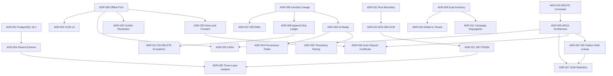

# Architecture Decision Records

## 1. Document Metadata

| Field | Value |
|-------|-------|
| Title | Architecture Decision Records |
| Version | 1.0 |
| Date | 2026-03-17 |
| Owner | GraviTea Architecture Team |
| Status | Accepted |
| Upstream Documents | Vision v1.0, PRD v1.0, Data Model v1.0, Constitution, spec-03 research |

This document captures architectural decisions from Vision v1.0, PRD v1.0, Data Model v1.0, the Constitution, and spec-03 domain research decisions (D-001–D-007). Each entry formalizes a decision that is already implemented or committed. All entries carry **Accepted** status; no decision in this document is under consideration or tentative.

---

## 2. ADR Index

| ID | Title | Category | Status | Date |
|----|-------|----------|--------|------|
| [ADR-001](#adr-001-postgresql-181-as-primary-database) | PostgreSQL 18.1 as Primary Database | Infrastructure | Accepted | 2026-03-17 |
| [ADR-002](#adr-002-uuid-v4-as-primary-key-strategy) | UUID v4 as Primary Key Strategy | Infrastructure | Accepted | 2026-03-17 |
| [ADR-003](#adr-003-modular-monolith-via-django-apps-not-microservices) | Modular Monolith via Django Apps (Not Microservices) | Infrastructure | Accepted | 2026-03-17 |
| [ADR-004](#adr-004-shared-database--shared-schema-multi-tenancy) | Shared Database / Shared Schema Multi-Tenancy | Infrastructure | Accepted | 2026-03-17 |
| [ADR-005](#adr-005-three-layer-tenant-isolation-orm--rls--idor) | Three-Layer Tenant Isolation (ORM + RLS + IDOR) | Infrastructure | Accepted | 2026-03-17 |
| [ADR-006](#adr-006-ironclad-principles-lineage-and-reconciliation) | Ironclad Principles Lineage and Reconciliation | Data Architecture | Accepted | 2026-03-17 |
| [ADR-007](#adr-007-decimal173-for-weightsmoney-decimal52-for-percentages) | DECIMAL(17,3) for Weights/Money, DECIMAL(5,2) for Percentages | Data Architecture | Accepted | 2026-03-17 |
| [ADR-008](#adr-008-append-only-ledger-for-financial-immutability) | Append-Only Ledger for Financial Immutability | Data Architecture | Accepted | 2026-03-17 |
| [ADR-009](#adr-009-dual-inventory-architecture-grain-continuous-vs-discrete-sku) | Dual Inventory Architecture (Grain Continuous vs Discrete SKU) | Data Architecture | Accepted | 2026-03-17 |
| [ADR-010](#adr-010-global-vs-per-tenant-entity-classification) | Global vs Per-Tenant Entity Classification | Data Architecture | Accepted | 2026-03-17 |
| [ADR-011](#adr-011-campaign-year-segregation-pattern) | Campaign-Year Segregation Pattern | Data Architecture | Accepted | 2026-03-17 |
| [ADR-012](#adr-012-on-delete-behavior-restrict-default-with-cascadeset_null-exceptions) | ON DELETE Behavior: RESTRICT Default with CASCADE/SET_NULL Exceptions | Data Architecture | Accepted | 2026-03-17 |
| [ADR-013](#adr-013-posicin-consolidada-as-derived-view-not-stored) | Posición Consolidada as Derived View (Not Stored) | Data Architecture | Accepted | 2026-03-17 |
| [ADR-014](#adr-014-mermatable-scope-zarandeo-only-constants-on-graintype) | MermaTable Scope: Zarandeo Only, Constants on GrainType | Grain Domain | Accepted | 2026-03-17 |
| [ADR-015](#adr-015-qualityparameter-inline-on-qualityanalysis-not-separate-entity) | QualityParameter Inline on QualityAnalysis (Not Separate Entity) | Grain Domain | Accepted | 2026-03-17 |
| [ADR-016](#adr-016-weighbridgedevice-as-separate-entity) | WeighbridgeDevice as Separate Entity | Grain Domain | Accepted | 2026-03-17 |
| [ADR-017](#adr-017-grade-fields-on-romaneo-not-qualityanalysis) | Grade Fields on Romaneo (Not QualityAnalysis) | Grain Domain | Accepted | 2026-03-17 |
| [ADR-018](#adr-018-per-step-merma-kg-not-stored-derived-from-intermediates) | Per-Step Merma kg Not Stored (Derived from Intermediates) | Grain Domain | Accepted | 2026-03-17 |
| [ADR-019](#adr-019-single-form-1116-c-per-grain-type-wslpg-constraint) | Single Form 1116-C per Grain Type (WSLPG Constraint) | Grain Domain | Accepted | 2026-03-17 |
| [ADR-020](#adr-020-own-grain-vs-third-party-grain-accounting-separation) | Own Grain vs Third-Party Grain Accounting Separation | Grain Domain | Accepted | 2026-03-17 |
| [ADR-021](#adr-021-jwt-rs256-with-custom-tenantbranch-claims) | JWT RS256 with Custom Tenant/Branch Claims | Security | Accepted | 2026-03-17 |
| [ADR-022](#adr-022-aes-256-gcm-field-level-encryption-with-hmac-sha256-blind-index) | AES-256-GCM Field-Level Encryption with HMAC-SHA256 Blind Index | Security | Accepted | 2026-03-17 |
| [ADR-023](#adr-023-argon2-password-hashing-not-bcrypt) | Argon2 Password Hashing (Not bcrypt) | Security | Accepted | 2026-03-17 |
| [ADR-024](#adr-024-ssrf-validation-pipeline-rust) | SSRF Validation Pipeline (Rust) | Security | Accepted | 2026-03-17 |
| [ADR-025](#adr-025-arca-web-service-architecture-wsaa-wslpg--wscpe--wsfev1) | ARCA Web Service Architecture (WSAA → WSLPG + WSCPE + WSFEv1) | Fiscal Integration | Accepted | 2026-03-17 |
| [ADR-026](#adr-026-caea-for-offline-fiscal-operations-during-harvest) | CAEA for Offline Fiscal Operations During Harvest | Fiscal Integration | Accepted | 2026-03-17 |
| [ADR-027](#adr-027-sisa-tier-retention-calculation-at-wslpg-filing-time) | SISA-Tier Retention Calculation at WSLPG Filing Time | Fiscal Integration | Accepted | 2026-03-17 |
| [ADR-028](#adr-028-offline-first-as-base-architecture-not-fallback) | Offline-First as Base Architecture (Not Fallback) | Offline & Sync | Accepted | 2026-03-17 |
| [ADR-029](#adr-029-conflict-resolution-taxonomy-5-strategies-by-data-type) | Conflict Resolution Taxonomy (5 Strategies by Data Type) | Offline & Sync | Accepted | 2026-03-17 |
| [ADR-030](#adr-030-store-and-forward-queue-for-arca-web-service-calls) | Store-and-Forward Queue for ARCA Web Service Calls | Offline & Sync | Accepted | 2026-03-17 |
| [ADR-031](#adr-031-rustpyo3-acceleration-boundary-when-rust-when-python) | Rust/PyO3 Acceleration Boundary (When Rust, When Python) | Performance | Accepted | 2026-03-17 |
| [ADR-032](#adr-032-weighbridge-integration-architecture-rs-232--modbus--tcp-bridge) | Weighbridge Integration Architecture (RS-232 / Modbus / TCP Bridge) | Performance | Accepted | 2026-03-17 |
| [ADR-033](#adr-033-ai-ready-data-architecture-4-layer-strategy) | AI-Ready Data Architecture (4-Layer Strategy) | AI/ML Readiness | Accepted | 2026-03-17 |
| [ADR-034](#adr-034-provenance-fields-on-all-grain-domain-models) | Provenance Fields on All Grain Domain Models | AI/ML Readiness | Accepted | 2026-03-17 |
| [ADR-035](#adr-035-measurement-timestamp-pairing-for-behavioral-analytics) | Measurement-Timestamp Pairing for Behavioral Analytics | AI/ML Readiness | Accepted | 2026-03-17 |
| [ADR-036](#adr-036-grain-deposit-certificate-integration-at-romaneo-reception-via-wslpg) | Grain Deposit Certificate Integration at Romaneo Reception (via WSLPG) | External Integration / Legal Compliance | Accepted | 2026-03-18 |
| [ADR-037](#adr-037-ws-padron-a4-sisa-tier-lookup-at-romaneo-reception) | WS Padron A4 SISA Tier Lookup at Romaneo Reception | External Integration / Fiscal Compliance | Accepted | 2026-03-18 |

---

## 3. How to Read This Document

### 3.1 ADR Format Template

Every ADR in this document follows this exact structure:

```
### ADR-NNN: Title

**Status**: Accepted | **Date**: YYYY-MM-DD

**Context**: [2–4 sentences describing the problem, need, or constraint that prompted this
decision — not the solution]

**Decision**: [1–3 sentences stating what was decided, phrased declaratively]

**Consequences**:
- (+) [Positive consequence]
- (+) [Additional positive consequence]
- (-) [Negative consequence or accepted tradeoff]
- (-) [Additional negative consequence or tradeoff]

**Alternatives Considered**:
- [Alternative A] — Rejected because [specific rationale]
- [Alternative B] — Rejected because [specific rationale]

**Cross-References**: [Upstream document vX.Y Section Z.Z]
```

**Field requirements**: All fields are mandatory. Context explains the problem, not the solution. Decision is declarative. Consequences include at least one positive and one negative. Alternatives include at least one rejected option with explicit rationale. Cross-References use the exact format defined in §3.3.

### 3.2 Status Lifecycle

All entries in this document are **Accepted**. The full lifecycle is:

- `Proposed` — The decision is under consideration and has not yet been committed. Proposed entries are not included in this document.
- `Accepted` — The decision is committed. All 37 entries in this document are Accepted as of 2026-03-18.
- `Superseded` — The decision has been replaced by a newer ADR. The original entry is preserved for historical record with a forward reference. See §3.4 for the supersession process.
- `Deprecated` — The decision is no longer relevant because the technology, context, or constraint has changed and there is no replacement. Deprecated entries are preserved in the document for historical record.

### 3.3 Cross-Reference Convention

Cross-References use the format **"Document vX.Y Section Z.Z"** or **"Document Principle N"**. Where to find each upstream document in this repository:

| Reference Format | File Path |
|-----------------|-----------|
| `Constitution Principle N` | `.specify/memory/constitution.md` |
| `Vision v1.0 Section X.Y` | `Docs/Project Blueprint/Product Vision & Scope.md` |
| `PRD v1.0 Section X.Y` | `Docs/Project Blueprint/PRD.md` |
| `Data Model v1.0 Section X.Y` | `Docs/Project Blueprint/Data Model & Domain Model.md` |
| `Data Model v1.0 PX` | `Docs/Project Blueprint/Data Model & Domain Model.md` (§2 Ironclad Principles) |
| `spec-03 research Decision D-NNN` | `specs/003-acopio-data-model/research.md` |
| `Feature branch NNN-name` | `specs/NNN-name/` |

Example: "Constitution Principle I" refers to Principle I in `.specify/memory/constitution.md`. "PRD v1.0 Section 4.5" refers to the LIQUIDACIONES section of the PRD.

### 3.4 Supersession Rules

When a newer decision supersedes an existing ADR:

1. **Create a new entry** with status `Proposed`, referencing the original ADR by ID in the context (e.g., "This supersedes ADR-026").
2. **Update the original entry's status line** to `Superseded by ADR-NNN` where NNN is the new ADR's number.
3. **Both entries coexist** in the document: the original provides historical rationale, the new entry provides current guidance.
4. The new entry advances from `Proposed` to `Accepted` only when the team commits to the replacement decision.
5. A superseded ADR is never deleted — its historical context remains part of the institutional record.

---

## 4. Infrastructure Decisions

### ADR-001: PostgreSQL 18.1 as Primary Database

**Status**: Accepted | **Date**: 2026-03-17

**Context**: A multi-tenant grain ERP requires a database engine capable of enforcing integrity constraints at the storage layer, not just at the application layer. The system handles financial data where rounding errors and referential integrity failures carry regulatory and commercial consequences. The database must support Row Level Security (RLS) as a mandatory layer of tenant isolation.

**Decision**: We use PostgreSQL 18.1 (Cloud SQL Enterprise Plus) as the primary database. All financial precision, referential integrity, and tenant isolation policies are enforced at the database engine level.

**Consequences**:
- (+) Native Row Level Security (RLS) enables physical enforcement of tenant isolation — no tenant can access another tenant's rows regardless of application-layer bugs.
- (+) `DECIMAL` type support and `CHECK` constraint enforcement guarantee financial precision and data integrity without relying solely on application validation.
- (+) `ON DELETE RESTRICT` (PROTECT) as the default FK behavior prevents cascading data loss from application-layer mistakes.
- (-) Cloud SQL Enterprise Plus incurs higher infrastructure cost compared to commodity shared-hosting databases.
- (-) PostgreSQL-specific features (RLS, advisory locks, `pg_trgm`) create vendor dependency that would complicate migration to other database engines.

**Alternatives Considered**:
- MySQL — Rejected because MySQL lacks native Row Level Security, making database-layer tenant isolation impossible.
- SQLite — Rejected because SQLite does not support concurrent multi-tenant writes or Row Level Security.
- Microsoft SQL Server — Rejected because of licensing cost and absence of a native RLS implementation equivalent to PostgreSQL's.

**Cross-References**: Constitution Principle I, Data Model v1.0 §1 Metadata, Data Model v1.0 P1

---

### ADR-002: UUID v4 as Primary Key Strategy

**Status**: Accepted | **Date**: 2026-03-17

**Context**: An offline-first system requires that client devices can create records locally without consulting the server for ID assignment. Sequential integer primary keys create two failure modes: they are predictable (enabling IDOR enumeration attacks), and they produce collision conflicts when two offline branches generate IDs for the same table independently.

**Decision**: We use UUID v4 auto-generated identifiers as the primary key for all entities. IDs are generated at the client (device or application server) at record creation time, with no server round-trip required.

**Consequences**:
- (+) Offline branches can create records independently without ID collision risk — UUID v4 collision probability across the observable universe of records is negligible.
- (+) Sequential enumeration attacks are impossible — guessing one record's ID does not predict any other record's ID.
- (+) IDs remain stable across branch merges and sync reconciliation cycles.
- (-) UUID v4 values are 16 bytes vs. 4–8 bytes for integers, increasing index size and join cost on large tables.
- (-) UUIDs are not human-readable, making debugging and support queries less ergonomic than integer IDs.

**Alternatives Considered**:
- Auto-increment integer — Rejected because sequential integer IDs expose IDOR vulnerability (enumerating `/records/1`, `/records/2` … enables cross-tenant access if authorization fails) and generate sync collisions when two offline branches independently insert into the same table with overlapping sequences.

**Cross-References**: Data Model v1.0 §1 Metadata, Constitution Principle VII

---

### ADR-003: Modular Monolith via Django Apps (Not Microservices)

**Status**: Accepted | **Date**: 2026-03-17

**Context**: The system must support multiple functional domains (grain reception, current accounts, invoicing, sync, observability) with clear boundaries and independent testability. The team operates at SMB scale during the initial build phase. Distributed systems introduce significant operational overhead (service mesh, inter-service authentication, distributed tracing, independent deployments) that is disproportionate to team size.

**Decision**: We use a modular monolith architecture implemented as Django Apps with enforced module boundaries. Each domain (`acopio`, `cuentas`, `facturacion`, `sync`, `core`) is a self-contained Django app with explicit inter-module dependencies. Views remain lightweight orchestration layers; business invariants live in domain services.

**Consequences**:
- (+) Independent testability per module — each Django app can be tested in isolation with its own fixtures and test suite.
- (+) Future service extraction is possible without a full rewrite — well-bounded Django apps can be promoted to standalone services when scale justifies it.
- (+) Lower operational complexity during initial build — single deployment unit, single database connection pool, no inter-service authentication overhead.
- (-) As the codebase grows, enforcing module boundaries requires discipline; Django does not prevent cross-app imports at the framework level.
- (-) A single deployment unit means all modules share the same process memory and deployment lifecycle — a bug in one module can affect the whole system.

**Alternatives Considered**:
- Microservices from day one — Rejected because the operational overhead (service mesh, distributed tracing, per-service CI/CD, inter-service authentication) is disproportionate to team size and initial scale; premature distribution complicates development velocity.

**Cross-References**: Constitution Principles III and X

---

### ADR-004: Shared Database / Shared Schema Multi-Tenancy

**Status**: Accepted | **Date**: 2026-03-17

**Context**: A SaaS product serving Argentine acopios (grain brokers) must keep per-tenant infrastructure cost low enough to support SMB pricing. Multi-tenancy implementation choices (shared schema, schema-per-tenant, database-per-tenant) have direct implications for operational cost, migration complexity, and isolation guarantees.

**Decision**: We use Shared Database, Shared Schema multi-tenancy. All tenants share the same PostgreSQL instance and schema. Row Level Security (RLS) enforces isolation at the database layer by filtering all queries to the current tenant's rows via a transaction-scoped session variable (`app.current_tenant_id`).

**Consequences**:
- (+) Single database instance and schema — operational cost is fixed regardless of tenant count; onboarding a new tenant requires only data insertion, not infrastructure provisioning.
- (+) Schema migrations apply once across all tenants simultaneously — no per-tenant migration fan-out.
- (+) PostgreSQL RLS provides physical isolation that is enforced even for raw SQL queries that bypass the ORM.
- (-) A bug in RLS policy configuration could expose cross-tenant data — RLS policies become a critical security surface that must be rigorously tested.
- (-) All tenants share query performance — a large tenant's heavy queries can degrade response times for smaller tenants (noisy neighbor risk).

**Alternatives Considered**:
- Schema-per-tenant — Rejected because the number of schemas scales linearly with tenant count, creating migration complexity (N schema migrations per deployment) and connection pooling overhead.
- Database-per-tenant — Rejected because provisioning a dedicated PostgreSQL instance per tenant is incompatible with SMB SaaS pricing; infrastructure cost would make the product uneconomical for small acopios.

**Cross-References**: Constitution Principle II, Data Model v1.0 §1 Metadata

---

### ADR-005: Three-Layer Tenant Isolation (ORM + RLS + IDOR)

**Status**: Accepted | **Date**: 2026-03-17

**Context**: Relying on a single layer of tenant isolation creates a single point of failure. An ORM-only approach can be bypassed by raw SQL queries. A database-only approach provides no defense against IDOR (Insecure Direct Object Reference) vulnerabilities in the API layer. Defense in depth requires independent enforcement at every layer.

**Decision**: We implement three independent tenant isolation layers: Layer 1 — `TenantBoundManager` auto-filters all ORM queries by `tenant_id`; Layer 2 — PostgreSQL RLS enforces isolation at the database level via the session variable `app.current_tenant_id` (set with `SET LOCAL`, transaction-scoped); Layer 3 — IDOR validation on every request validates that the requested resource belongs to the authenticated tenant using JWT claims (`iss`, `aud`, `exp`).

**Consequences**:
- (+) Any single layer can fail without exposing cross-tenant data — the remaining two layers still enforce isolation.
- (+) The three layers enforce isolation at three distinct trust boundaries: application code, database session, and JWT token claims.
- (+) Audit and debugging are cleaner — each layer logs enforcement independently, enabling precise root cause analysis when an isolation breach attempt is detected.
- (-) Three layers of isolation add latency overhead per request — each query incurs ORM filtering, a session variable set, and JWT claim validation.
- (-) Maintaining three layers requires synchronized correctness: a new model added to the ORM must have corresponding RLS policies and IDOR validation added simultaneously.

**Alternatives Considered**:
- ORM-only isolation (TenantBoundManager alone) — Rejected because raw SQL queries in migrations, admin commands, or ORM bugs can bypass the manager; a single bypass point exposes all tenants simultaneously.

**Cross-References**: Constitution Principles II, V, and IX, Data Model v1.0 §4.9

---

## 5. Data Architecture Decisions

### ADR-006: Ironclad Principles Lineage and Reconciliation

**Status**: Accepted | **Date**: 2026-03-17

**Context**: Three independent principle sets govern the system's data architecture: the Constitution (Principles I–XI) establishes foundational technical rules for all backend code; Vision v1.0 (§2.3, 6 principles) provides strategic product framing; Data Model v1.0 (P1–P5) extends with database-specific patterns. These sets were authored independently at different points in the project lifecycle. Developers and AI agents modifying the codebase need to know which layer takes precedence when principles appear to overlap.

**Decision**: The Constitution I–XI is the foundational layer governing all backend code. Vision v1.0 §2.3 adds strategic framing (offline-first as Principle 1, regulatory automation as Principle 5) that extends the Constitution at the product strategy level. Data Model v1.0 P4 (Machine Learning First — "we discard nothing") and P5 (AI-Ready Data Architecture — provenance on all grain domain models) extend the Constitution with database-specific patterns that have no equivalent in Constitution or Vision. When these three layers appear to conflict, the Constitution takes precedence; Vision provides the "why" at the product level; Data Model P1–P5 provides the "how" at the database level.

**Consequences**:
- (+) A clear hierarchy prevents ambiguity when principle sets overlap — developers always know which layer to consult first.
- (+) The reconciliation identifies that P4 (ML First) and P5 (AI-Ready) are additive extensions not present in the Constitution, ensuring they are not overlooked in new model design.
- (-) Three separate documents must be consulted when evaluating a data architecture change — no single reference covers all layers.
- (-) Future changes to the Constitution require evaluating downstream impact on both Vision framing and Data Model extensions.

**Alternatives Considered**:
- Merging all three principle sets into a single document — Rejected because the three sets have different audiences (Constitution = developers/agents, Vision = product strategy, Data Model = database engineers) and different update cadences; merging would produce a monolithic document that is harder to maintain and evolves incoherently.

**Cross-References**: Constitution I–XI, Vision v1.0 Section 2.3, Data Model v1.0 Section 2.1

---

### ADR-007: DECIMAL(17,3) for Weights/Money, DECIMAL(5,2) for Percentages

**Status**: Accepted | **Date**: 2026-03-17

**Context**: Grain settlements (liquidaciones) involve weight measurements, price calculations, and retention withholdings. Binary floating-point types (`FLOAT`, `DOUBLE`) cannot represent many decimal fractions exactly, accumulating rounding errors across sequential calculations. In grain operations, this has measurable financial consequences: using the wrong humidity value (Hf instead of Humedad Base) in a merma (grain loss) calculation produces a ~168 kg error per 30-tonne truck — a material discrepancy in a commercial settlement.

**Decision**: We use `DECIMAL(17,3)` for all weight and monetary fields; `DECIMAL(5,2)` for all percentage fields. `FLOAT` and `DOUBLE` types are prohibited with zero exceptions. Display rounding to 2 decimal places is applied at the presentation layer only.

**Consequences**:
- (+) All financial calculations produce exact decimal arithmetic — no rounding error accumulates across sequential merma deductions, price multiplications, or retention calculations.
- (+) The PostgreSQL `DECIMAL` type is exact for the declared precision and scale — stored values are identical to computed values.
- (-) `DECIMAL` arithmetic is slower than `FLOAT` arithmetic for bulk calculations; this cost is accepted in exchange for exactness.
- (-) Developers accustomed to Python's `float` type must explicitly use `Decimal` objects in application code to maintain precision end-to-end.

**Alternatives Considered**:
- FLOAT/DOUBLE — Rejected because binary floating-point rounding errors are unacceptable in financial grain calculations; the ~168 kg error per 30-tonne truck illustrates the real-world materiality of this choice.

**Cross-References**: Constitution Principle I, Data Model v1.0 P1

---

### ADR-008: Append-Only Ledger for Financial Immutability

**Status**: Accepted | **Date**: 2026-03-17

**Context**: Grain settlements require forensic traceability for every kilogram from romaneo (weighing ticket) entry to liquidación (settlement) completion. Regulatory and commercial audits require the ability to reconstruct the exact sequence of transactions that produced a final balance. Allowing `UPDATE` or soft-delete on financial records creates a retroactive editing surface that breaks auditability.

**Decision**: The following entities are append-only: `StockMovement`, `Comprobante` (authorized/observed status), `GrainMovement`, `AccountMovement`, and `MermaCalculation`. Errors are corrected by inserting a counter-entry (a new row that reverses the incorrect entry), never by updating or deleting the original row. The past is not edited; it is corrected.

**Consequences**:
- (+) Complete forensic traceability — every kilogram and every peso can be traced to its origin transaction through an unbroken chain of INSERT-only records.
- (+) Any point-in-time balance is reconstructible by replaying the ledger from the beginning, enabling audits and dispute resolution.
- (+) No retroactive data manipulation is possible — the ledger is a write-once record of facts.
- (-) Storage grows monotonically — corrections require two rows (original + counter-entry) instead of one updated row.
- (-) Balances must always be computed by aggregation (SUM of debits and credits), not by reading a stored balance field; this increases read complexity on ledger tables.

**Alternatives Considered**:
- Soft-delete with audit log — Rejected because soft-delete still allows `UPDATE` on status fields (e.g., marking a record as `deleted=True`), which mutates the record and breaks forensic traceability; an audit log records the change but the original fact is altered.

**Cross-References**: Data Model v1.0 P3, Vision v1.0 Section 2.3, Constitution Principle I

---

### ADR-009: Dual Inventory Architecture (Grain Continuous vs Discrete SKU)

**Status**: Accepted | **Date**: 2026-03-17

**Context**: The acopio (grain brokerage) manages two fundamentally different types of inventory: grain (a continuous commodity measured in kilograms, segregated by campaña — campaign year — quality grade, and silo) and agronomía inputs (discrete units: bags of fertilizer, herbicide bottles, tools counted in whole units). These two inventory types have incompatible accounting semantics: grain has no expiration but degrades in quality; inputs expire but do not degrade. A single unified model cannot represent both without forcing artificial constraints.

**Decision**: We use a dual inventory architecture. Grain inventory uses `GrainLot` + `GrainMovement` — a kg-based continuous ledger segregated by grain type, campaign, and storage unit. Agronomía inputs use `Product` + `StockMovement` — a unit-based discrete ledger with standard in/out movements.

**Consequences**:
- (+) Each inventory model is optimized for its domain — grain movements track quality progression and campaign membership; input movements track unit counts and cost basis.
- (+) Reporting is semantically correct: grain reports show kilograms and quality grades; input reports show units and valuations.
- (+) The separation enforces that grain-specific logic (merma calculations, campaign segregation, quality analysis linkage) never contaminates the simpler input inventory model.
- (-) Developers must understand which inventory system to use for a given entity — the dual model adds conceptual overhead.
- (-) Cross-inventory reports (e.g., total assets) must aggregate across two different data structures.

**Alternatives Considered**:
- Single unified inventory model — Rejected because grain is measured in continuous kilograms (not discrete units), requires campaign-year segregation with a composite key, and tracks quality degradation over time — none of which has an analogue in the discrete unit SKU lifecycle; forcing both into one model would require nullable or overloaded fields that obscure the domain.

**Cross-References**: Data Model v1.0 Sections 5.6 and 7, PRD v1.0 Sections 4.3 and 4.7

---

### ADR-010: Global vs Per-Tenant Entity Classification

**Status**: Accepted | **Date**: 2026-03-17

**Context**: Some reference data in the grain domain is legally mandated and applies uniformly to all market participants — it is not configurable per tenant. Tolerance tables are issued by the Cámara Arbitral de Cereales de la Bolsa de Comercio de Rosario via SAGPyA/SENASA resolutions. Grain type definitions (humidity constants, merma constants, ARCA species codes) are defined by ARCA and SAGPyA regulations. Allowing tenants to override this data would create legal and commercial dispute risk.

**Decision**: The following entities are **GLOBAL** — they carry no tenant foreign key and are excluded from RLS policies: `GrainType`, `ToleranceTable`, `MermaTable`, `BusinessTemplate`. All operational entities (`CampanaConfig`, `Romaneo`, `StorageUnit`, `GrainLot`, `ProducerAccount`, `AccountMovement`, `LiquidacionPrimaria`, and all domain-specific entities) are per-tenant and subject to RLS.

**Consequences**:
- (+) Regulatory data is authoritative — all tenants use the same legally mandated tolerance tables, eliminating divergence and dispute risk.
- (+) Global entities are maintained centrally — an update to a tolerance table (e.g., new zarandeo schedule) applies to all tenants simultaneously with a single migration.
- (-) Global entities cannot be customized per tenant — if a future regulatory change requires regional variations, the global classification would need to be revisited.
- (-) The distinction between global and per-tenant entities must be explicitly documented and communicated to developers, as Django's ORM does not enforce this distinction by convention.

**Alternatives Considered**:
- Per-tenant tolerance table overrides — Rejected because tolerance tables are legally mandated by the Cámara Arbitral; divergence from official tables exposes tenants to commercial dispute risk and potential regulatory non-compliance.

**Cross-References**: spec-03 research Decisions D-004 and D-006, Data Model v1.0 Sections 5.1 and 5.2

---

### ADR-011: Campaign-Year Segregation Pattern

**Status**: Accepted | **Date**: 2026-03-17

**Context**: Argentine grain harvests are organized by campaña (campaign year), a period running from April 1 through March 31 of the following year. Grain stored, accounts receivable, and fiscal filings must all be associated with the correct campaign. A 2024/25 campaign spans two calendar years, making calendar-year segregation semantically incorrect for this domain.

**Decision**: We use the format "YYYY/YY" (7 characters, e.g., "2024/25") for human-readable campaign identification in `CampanaConfig.campaign_code`. Campaigns run April 1–March 31. `CampanaConfig` enforces a unique constraint on `(tenant, is_active=True)` — only one active campaign per tenant at a time. The campaign affects three integration points: (1) **storage** — grain in silos is segregated by composite key `(grain_type, campaign_id, storage_unit_id)` per RG 3593; (2) **accounting** — `ProducerAccount` grain sub-ledgers are campaign-scoped and cross-campaign balances do not net; (3) **fiscal** — WSLPG `campania` XML field uses 4-digit format ("2425"), which the system converts from the human-readable "2024/25" at filing time.

**Consequences**:
- (+) Campaign segregation matches the Argentine regulatory and commercial reality — grain settled in one campaign cannot be confused with grain from another campaign.
- (+) The WSLPG format conversion ("2024/25" → "2425") is handled centrally, preventing malformed submissions at any filing point.
- (+) The single-active-campaign constraint prevents accidental dual-campaign operations during campaign handover.
- (-) Reporting across campaigns requires explicit campaign filtering; a naïve aggregate query across all time will mix campaign data unless campaign-scoped.
- (-) The 4-digit WSLPG format conversion is a subtle transformation that must be applied consistently at every WSLPG submission point.

**Alternatives Considered**:
- Calendar-year segregation — Rejected because Argentine harvest campaigns span two calendar years (April–March); a 2024/25 campaign starting in April 2024 and ending in March 2025 cannot be split across calendar year boundaries without producing incorrect regulatory filings and mismatched grain accounts.

**Cross-References**: PRD v1.0 Sections 4.3 (storage), 4.4 (accounting), 4.5 (fiscal), Data Model v1.0 Section 5.1

---

### ADR-012: ON DELETE Behavior: RESTRICT Default with CASCADE/SET_NULL Exceptions

**Status**: Accepted | **Date**: 2026-03-17

**Context**: Every foreign key relationship requires a deliberate ON DELETE policy. The wrong default (CASCADE everywhere) can silently delete financial records when a parent is deleted. The wrong constraint (RESTRICT on all) makes it impossible to delete parent records that should clean up their dependents (e.g., a draft romaneo — weighing ticket — with its analysis records). Each relationship type requires explicit classification.

**Decision**: The default ON DELETE behavior is RESTRICT (Django: `PROTECT`) for all FK relationships. Three relationship types receive explicit exceptions: **CASCADE** applies to 1:1 satellite records that have no meaning without their parent: `CPE → Romaneo`, `QualityAnalysis → Romaneo`, `MermaCalculation → Romaneo`. **SET_NULL** applies to nullable assignment fields on `Romaneo`: `weighbridge_device_id`, `storage_unit_id`, `grain_lot_id` — deleting a device or storage unit must not cascade to delete historical reception records.

**Consequences**:
- (+) RESTRICT as default prevents accidental cascading data loss — a deletion attempt on a referenced parent raises an explicit error, forcing intentional cleanup.
- (+) CASCADE on 1:1 satellites keeps the database self-consistent — a deleted Romaneo cleanly removes its associated CPE, QualityAnalysis, and MermaCalculation records.
- (+) SET_NULL on assignment fields preserves historical Romaneo records when hardware (weighbridge) or infrastructure (storage unit) is decommissioned.
- (-) CASCADE on satellites means that deleting a committed Romaneo also deletes its quality analysis and CPE records — this must be prevented at the application layer by prohibiting deletion of committed (non-draft) Romaneos.
- (-) The exception list must be maintained in sync with the domain model; adding a new 1:1 satellite relationship requires a conscious classification decision.

**Alternatives Considered**:
- RESTRICT on all FK relationships — Rejected because 1:1 satellite records (CPE, QualityAnalysis, MermaCalculation) have no independent existence; applying RESTRICT would require manually deleting each satellite before deleting a draft parent, making draft cleanup error-prone and requiring additional application logic.

**Cross-References**: spec-03 research Decision D-007, Constitution Principle I, Data Model v1.0 P1

---

### ADR-013: Posición Consolidada as Derived View (Not Stored)

**Status**: Accepted | **Date**: 2026-03-17

**Context**: An acopiador with multiple plants (branches) needs a consolidated view of a producer's position across all plants — the posición consolidada (consolidated position). This could be stored as a cached aggregate or computed on demand from per-plant ledgers. The PRD explicitly prohibits using a stored consolidated position as the source of truth because an aggregate can diverge from the per-plant source ledgers when new transactions post.

**Decision**: We do not implement a `PosicionConsolidada` model. The consolidated position is computed on demand by aggregating per-plant `ProducerAccount` balances for the same producer CUIT across all plants of the same tenant. This view is never persisted. A materialized view or cached aggregate may be introduced as a read-optimization in a later implementation phase, subject to query profiling evidence.

**Consequences**:
- (+) The consolidated position is always consistent with the underlying per-plant ledgers — there is no synchronization lag and no reconciliation process required.
- (+) The implementation is simpler — no cache invalidation logic, no scheduled refresh, no divergence monitoring.
- (-) Every consolidated position query performs a live aggregation across multiple plant ledgers; for producers with many plants and many movements, this may be slow.
- (-) The read path cannot be trivially cached without re-introducing the consistency risk that motivated this decision.

**Alternatives Considered**:
- Materialized view or stored aggregate — Rejected because a stored aggregate can diverge from the source ledgers when contra-entries post to one plant but the aggregate has not yet been refreshed; deferred to implementation optimization phase if query profiling shows a latency problem.

**Cross-References**: spec-03 research Decision D-005, PRD v1.0 Section 4.4

---

## 6. Grain Domain Decisions

### ADR-014: MermaTable Scope: Zarandeo Only, Constants on GrainType

**Status**: Accepted | **Date**: 2026-03-17

**Context**: Merma (grain loss) calculations involve four sequential deduction types: zarandeo (sieving), secado (drying), manipuleo (handling), and volátil (volatility). These types have different regulatory origins: zarandeo thresholds are periodically updated by the Cámara Arbitral de Cereales and vary by grain condition grade. Manipuleo and volátil rates are fixed regulatory constants that have not changed since their original publication.

**Decision**: `MermaTable` holds only zarandeo thresholds, versioned with `valid_from`/`valid_to` date fields to track Cámara Arbitral schedule updates. Manipuleo and volátil rates are stored as static constants on `GrainType`. Fixed values: manipuleo — trigo 0.10%, maíz 0.25%, soja 0.25%, girasol 0.20%, sorgo 0.25%; volátil — cereals (trigo/maíz/sorgo) 0.30%, oleaginosas (soja/girasol) 0.50%.

**Consequences**:
- (+) `MermaTable` versioning reflects the actual regulatory lifecycle — only zarandeo schedules change; fixed constants do not need version tracking.
- (+) Fixed constants on `GrainType` are immediately accessible without a table lookup during merma calculation, reducing query complexity.
- (-) If the regulatory authority ever changes manipuleo or volátil rates (unprecedented since publication), the constants would require a data migration from `GrainType` fields to a versioned table.

**Alternatives Considered**:
- Full MermaTable with all four deduction types — Rejected because manipuleo and volátil have never changed since regulatory publication; storing them in a versioned table adds unnecessary schema complexity for values that function as permanent domain constants.

**Cross-References**: spec-03 research Decision D-001

---

### ADR-015: QualityParameter Inline on QualityAnalysis (Not Separate Entity)

**Status**: Accepted | **Date**: 2026-03-17

**Context**: Quality analysis of grain at reception measures a fixed set of parameters defined by Argentine grain trade regulations. The question is whether these parameters should be modeled as rows in a separate `QualityParameter` reference table (enabling dynamic parameter addition) or as inline fields on `QualityAnalysis` (treating the parameter set as a fixed domain constant).

**Decision**: Quality measurement parameters are defined as inline fields on `QualityAnalysis`. The nine fixed parameters are: `humedad` (moisture), `materias_extranas` (foreign matter), `granos_dañados` (damaged grains), `granos_quebrados` (broken grains), `peso_hectolítrico` (test weight, cereals only), `proteína` (protein, trigo — wheat — only), `granos_verdes` (green beans, soja — soy — only), `granos_ardidos` (heated grains), `cuerpos_extraños` (foreign bodies). Grain-type conditionality is enforced at the application layer via `help_text` annotations.

**Consequences**:
- (+) Simpler schema and simpler queries — reading a quality analysis record returns all parameters in a single row scan, with no JOIN to a parameter table.
- (+) The fixed parameter set is self-documenting in the model definition — a developer can read `QualityAnalysis` and immediately understand the full measurement vocabulary.
- (-) Adding a new quality parameter requires a schema migration — there is no dynamic parameter extension without altering the table.
- (-) Grain-type conditionality (which parameters apply to which grain) is enforced only at the application layer, not at the database constraint level.

**Alternatives Considered**:
- Standalone `QualityParameter` entity — Rejected because the 9-parameter set is defined by regulation and has not changed; a lookup table queried on every `QualityAnalysis` read adds JOIN overhead without enabling any meaningful flexibility; over-engineering for a fixed regulatory domain constraint.

**Cross-References**: spec-03 research Decision D-002

---

### ADR-016: WeighbridgeDevice as Separate Entity

**Status**: Accepted | **Date**: 2026-03-17

**Context**: A weighbridge (balanza de camiones — truck scale) is a distinct physical asset in a grain plant. It has a serial number, a calibration certificate required by Argentine regulatory standards, and a lifecycle independent of any specific reception or storage unit. A plant may have multiple active weighbridges, and each weighbridge accumulates a history of calibration records over years of operation.

**Decision**: `WeighbridgeDevice` is a first-class entity with fields: `name`, `serial_number`, `branch` (FK), `is_active` (Boolean), `interface_type`, `connection_address`. Each weighbridge device accumulates calibration records over its lifetime. `Romaneo` records a nullable FK `weighbridge_device_id` — nullable because historical records may predate device tracking.

**Consequences**:
- (+) Full device traceability — any `Romaneo` record can be traced to the specific weighbridge that captured the weight, enabling drift detection and calibration audit trails.
- (+) Multi-scale branches are supported — a branch with two weighbridges can record which scale captured which reception.
- (+) Decommissioning a device uses `is_active=False`; historical `Romaneo` records retain the device FK for audit purposes.
- (-) An additional model and foreign key relationship adds schema complexity compared to a simple string field on Romaneo.

**Alternatives Considered**:
- FK to Branch directly (no device entity) — Rejected because this provides no device-level traceability, prevents multi-scale branches, and loses serial number and calibration certificate tracking required for regulatory audits.
- FK to StorageUnit — Rejected because a weighbridge is not a storage unit; conflating the two entities creates incorrect domain semantics.

**Cross-References**: spec-03 research Decision D-003

---

### ADR-017: Grade Fields on Romaneo (Not QualityAnalysis)

**Status**: Accepted | **Date**: 2026-03-17

**Context**: When grain is received at a plant, a quality analysis determines its parameters (moisture, damaged grains, etc.). Based on the analysis results, a commercial grade (`grado_asignado`) and a bonus/deduction percentage (`bonificacion_rebaja_pct`) are assigned to the reception. These two fields represent the commercial outcome of the quality analysis — they are the producer's contractual basis for settlement, not a measurement result.

**Decision**: `grado_asignado` (int) and `bonificacion_rebaja_pct` (DECIMAL 5,2) are fields on `Romaneo`, not on `QualityAnalysis`. Grade is assigned at the reception level. For oleaginosas (soja, girasol), `grado_asignado = 0` by convention (oleaginosas do not use a numeric grading scale in Argentine commercial practice).

**Consequences**:
- (+) Clear separation of concerns — `QualityAnalysis` holds laboratory measurements; `Romaneo` holds the commercial outcome derived from those measurements.
- (+) The grade and bonus/deduction are accessible directly from the reception record without requiring a JOIN to the quality analysis.
- (-) The grade on `Romaneo` must be synchronized with the quality analysis results; if quality analysis is corrected after initial entry, the grade on `Romaneo` must be updated through a separate application operation.

**Alternatives Considered**:
- Grade fields on `QualityAnalysis` — Rejected because grade is a commercial decision derived from analysis, not a laboratory measurement; placing it on `QualityAnalysis` conflates the measurement record with the commercial outcome, making `QualityAnalysis` responsible for two distinct concerns.

**Cross-References**: Data Model v1.0 Section 5.3

---

### ADR-018: Per-Step Merma kg Not Stored (Derived from Intermediates)

**Status**: Accepted | **Date**: 2026-03-17

**Context**: The merma (grain loss) calculation proceeds through four sequential deduction steps. Each step produces an intermediate weight (`peso_post_*`). The per-step deduction in kilograms (e.g., how many kg were deducted for zarandeo) can be computed as the difference between consecutive `peso_post_*` values. The question is whether to store these derived per-step kg values explicitly or rely on derivation from stored intermediates.

**Decision**: `MermaCalculation` stores: four input percentage fields (`_pct` suffix), four intermediate weight fields (`peso_post_zarandeo_kg`, `peso_post_secado_kg`, `peso_post_manipuleo_kg`, `peso_post_volatil_kg`), `total_merma_kg`, `total_factor_pct`, and `peso_final_kg`. Individual per-step deductions in kg (e.g., `zarandeo_kg`) are not stored — they are derived as `peso_post_zarandeo_kg − peso_post_secado_kg` at query time.

**Consequences**:
- (+) No redundancy — derived values cannot diverge from their inputs; there is no inconsistency risk between a stored `zarandeo_kg` and the derivable value.
- (+) The stored intermediates provide full auditability — any step's deduction is reproducible from the stored `peso_post_*` chain.
- (-) Queries that need per-step deductions must compute them — this adds arithmetic to the query or application layer; cost is minimal for single-record reads but aggregates across many records require care.

**Alternatives Considered**:
- Storing per-step kg values alongside intermediates — Rejected because stored `zarandeo_kg`, `secado_kg`, etc. are fully derivable from consecutive `peso_post_*` fields; storing them creates a consistency risk if records are corrected via contra-entry (the stored step-kg must also be corrected, introducing a second source of truth).

**Cross-References**: Data Model v1.0 Section 5.5

---

### ADR-019: Single Form 1116-C per Grain Type (WSLPG Constraint)

**Status**: Accepted | **Date**: 2026-03-17

**Context**: Argentine grain settlements (liquidaciones primarias — primary settlements) are filed electronically via the WSLPG (Web Service Liquidaciones Primarias de Granos) web service using Form 1116-C (or 1116-B for standard settlements). The WSLPG XML schema places the `codGrano` (grain type code, 2-digit integer) at the document root level — outside all line items. This is a hard protocol constraint that limits each WSLPG submission to a single grain type.

**Decision**: The software generates one WSLPG XML payload per grain type. When a liquidación involves multiple grain types (e.g., a producer with both trigo and soja to settle), the system splits it into separate payloads before WSLPG filing — one payload per grain type, each submitted as a separate Form 1116-C.

**Consequences**:
- (+) WSLPG submissions are structurally valid — the single-grain-type constraint is enforced at payload generation, preventing web service rejection.
- (+) Auditing and reconciliation are simpler when each WSLPG submission corresponds to exactly one grain type.
- (-) A producer with multiple grain types in a single settlement requires multiple WSLPG submissions, adding processing overhead per liquidación.
- (-) The multi-grain splitting logic must be implemented and tested as a core part of the WSLPG filing workflow.

**Alternatives Considered**:
- A single multi-grain XML submission — Rejected because the WSLPG schema places `codGrano` at the document root level, making it physically impossible to represent multiple grain types in a single submission; the web service would reject such a payload at schema validation.

**Cross-References**: PRD v1.0 Section 4.5, Data Model v1.0 Section 8.3

---

### ADR-020: Own Grain vs Third-Party Grain Accounting Separation

**Status**: Accepted | **Date**: 2026-03-17

**Context**: An acopiador holds two categories of grain: grain purchased outright for resale (own grain) and grain deposited by producers for storage and eventual sale (third-party grain, grano de terceros — custodial grain). These two categories have fundamentally different accounting treatments under Argentine standards. Own grain held for resale is a balance-sheet asset. Grain held on behalf of producers is custodial — it belongs to the producer and must never appear as an asset of the acopiador.

**Decision**: `GrainLot` carries an `is_own_grain` BooleanField. When `is_own_grain=True`, grain movements post to account 1.3.XX (Bienes de cambio — balance-sheet asset). When `is_own_grain=False`, grain movements post to account 8.1.XX (Cuentas de orden — off-balance-sheet custodial). This routing is enforced at the chart-of-accounts layer.

**Consequences**:
- (+) The acopiador's balance sheet accurately reflects only grain it owns — third-party grain does not inflate reported assets.
- (+) Cuentas de orden tracking provides a complete view of custodial obligations without distorting financial ratios.
- (-) Every grain movement must correctly classify the grain as own or third-party — a misclassification at lot creation propagates through all downstream accounting entries.

**Alternatives Considered**:
- Uniform balance-sheet treatment for all grain — Rejected because custodial grain would inflate the acopiador's reported asset base with grain it does not own, violating Argentine accounting standards and misrepresenting the company's financial position to creditors, tax authorities, and regulators.

**Cross-References**: Data Model v1.0 Section 5.6, Data Model v1.0 §7 (chart of accounts)

---

## 7. Security Decisions

### ADR-021: JWT RS256 with Custom Tenant/Branch Claims

**Status**: Accepted | **Date**: 2026-03-17

**Context**: Authentication tokens must carry tenant and branch context to support multi-tenant request routing and RLS enforcement. The choice of JWT signing algorithm determines the blast radius of a key compromise: a symmetric algorithm shares the same key between issuer and all verifiers, while an asymmetric algorithm limits the signing key to the token issuer only.

**Decision**: We use RS256 (RSA-PKCS1v15 with SHA-256, 4096-bit key) for JWT signing. HS256 and HS512 are explicitly prohibited — the algorithm is enforced via a server-side whitelist on every request. Custom claims include: `tenant_id`, `branch_id`, `email`, `full_name`. Token lifetimes: access token 15 minutes, refresh token 7 days.

**Consequences**:
- (+) Asymmetric RS256 limits key compromise blast radius — the private signing key is held only by the authentication service; a compromised application server holds only a public verification key, which cannot forge tokens.
- (+) Custom claims carry full tenant and branch context, enabling RLS session variable initialization and IDOR validation without additional database lookups per request.
- (+) The algorithm whitelist prevents algorithm substitution attacks (e.g., an attacker sending `"alg": "none"` or `"alg": "HS256"` when the server holds an RSA public key).
- (-) RSA key operations are slower than HMAC operations — RS256 verification adds measurable latency at high token-validation throughput.
- (-) 4096-bit RSA key management (rotation, storage in Secret Manager, distribution to verifying services) adds operational complexity compared to a single HMAC secret.

**Alternatives Considered**:
- HS256 (symmetric HMAC) — Rejected because a compromised HMAC secret affects all tenants simultaneously; the shared secret is held by every service that verifies tokens, multiplying the number of potential compromise points.

**Cross-References**: Constitution Principles V and XI

---

### ADR-022: AES-256-GCM Field-Level Encryption with HMAC-SHA256 Blind Index

**Status**: Accepted | **Date**: 2026-03-17

**Context**: Personally identifiable information (PII) and fiscal data (CUIT numbers, personal names, addresses) stored in the database must be protected against application-layer breaches in addition to infrastructure-level attacks. Database-level encryption does not protect against an attacker who gains application-layer access. Searchable encrypted fields (e.g., searching by CUIT) require a deterministic index that does not expose the plaintext.

**Decision**: Sensitive fields use application-level AES-256-GCM encryption via Python's `cryptography` library, implemented in `apps/core/encryption/`. Master keys are stored in Google Cloud Secret Manager and never in code, environment variables, Docker configurations, or Git history. Searchable encrypted fields use a HMAC-SHA256 blind index — a deterministic hash of the normalized plaintext — stored alongside the ciphertext for equality searches. The encryption hot path is accelerated in Rust (feature 018: 8.7× speedup for AES-256-GCM, 8.8× for HMAC blind index).

**Consequences**:
- (+) Application-layer encryption protects PII even if database credentials are compromised — an attacker sees only ciphertext without the application-layer keys.
- (+) GCM mode provides authenticated encryption — ciphertext tampering is detected, preventing data modification attacks.
- (+) Rust acceleration reduces encryption latency on hot paths to less than 12% of the Python baseline.
- (-) Blind index search supports only equality queries — range queries, LIKE patterns, and full-text search on encrypted fields are not possible without decryption.
- (-) Key rotation requires re-encrypting all affected rows — a planned but operationally complex migration process.

**Alternatives Considered**:
- Database-level Transparent Data Encryption (TDE) — Rejected because TDE protects data at rest against disk-level theft but does not protect against an attacker with application-layer or database-credential access; the encryption key is managed within the database infrastructure, which has the same breach radius as the data itself.

**Cross-References**: Constitution Principle IV

---

### ADR-023: Argon2 Password Hashing (Not bcrypt)

**Status**: Accepted | **Date**: 2026-03-17

**Context**: Password hashing must resist offline brute-force attacks using modern hardware accelerators (GPUs, ASICs, FPGAs). The hashing algorithm determines the cost of an attack: a GPU-parallelizable algorithm can be attacked with commodity gaming hardware at high throughput; a memory-hard algorithm cannot be efficiently parallelized on GPU hardware because GPU L1/L2 cache is insufficient for large memory workloads.

**Decision**: We use Argon2 (via the `argon2-cffi` library) as the password hashing algorithm, configured as `ArgonPasswordHasher` in Django settings. Argon2 is the winner of the Password Hashing Competition (2015) and is the current OWASP recommendation for password storage.

**Consequences**:
- (+) Argon2's memory-hard design makes GPU/ASIC parallel attacks significantly more expensive than with bcrypt — GPU hardware cannot efficiently parallelize memory-hard workloads due to memory bandwidth constraints.
- (+) Argon2 parameters (memory cost, time cost, parallelism) are configurable and can be increased as hardware improves, without invalidating existing hashes.
- (-) Argon2 is slower per hash than bcrypt at equivalent security parameters — login endpoints must account for this in rate limit and timeout configuration.

**Alternatives Considered**:
- bcrypt — Rejected because bcrypt is GPU-parallelizable; modern GPU rigs can test bcrypt hashes at rates orders of magnitude faster than the CPU-optimized bcrypt baseline, reducing the practical cost of an offline dictionary attack.

**Cross-References**: Constitution Principle V

---

### ADR-024: SSRF Validation Pipeline (Rust)

**Status**: Accepted | **Date**: 2026-03-17

**Context**: The system supports webhook integrations and URL-based import operations where users supply URLs for external resources. User-supplied URLs must be validated to prevent SSRF (Server-Side Request Forgery) attacks, where an attacker supplies a URL pointing to internal network resources (cloud metadata services, database management ports, internal APIs). URL validation against adversarial input requires robust regex matching resistant to ReDoS (Regular Expression Denial of Service) attacks.

**Decision**: We implement a two-phase SSRF validation pipeline in Rust (feature branch 022): Phase 1 — `validate_url_safety` checks URL schema, hostname format, and known-bad patterns using the Rust `url` crate (WHATWG-compliant URL parsing) and `regex` crate. Phase 2 — `check_resolved_ip` resolves the hostname to an IP address and validates it against a deny list of 10 CIDR ranges covering private, loopback, link-local, and cloud metadata service IP ranges. The pipeline contains 831 lines of Rust, validated by 308 tests including an 83-entry adversarial corpus.

**Consequences**:
- (+) The Rust `regex` crate guarantees linear-time matching — ReDoS attacks using pathologically crafted URLs cannot cause CPU exhaustion.
- (+) DNS rebinding attacks are mitigated by checking the resolved IP at validation time — a hostname cannot be rebinded to a private IP after passing schema validation.
- (+) The adversarial test corpus (83 entries) validates that known SSRF bypass techniques (IPv6, octal notation, URL encoding) are correctly rejected.
- (-) DNS resolution at validation time adds latency to every URL-bearing request — a slow DNS resolver increases endpoint response time.
- (-) The CIDR deny list must be maintained as new cloud provider metadata service IPs are assigned.

**Alternatives Considered**:
- Python-based URL validation with `re` module — Rejected because Python's `re` module is not guaranteed to run in linear time on all inputs; adversarial URLs with catastrophic backtracking patterns can cause ReDoS in Python regex execution.

**Cross-References**: Feature branch 022-ssrf-validation-pipeline

---

## 8. Fiscal Integration Decisions

### ADR-025: ARCA Web Service Architecture (WSAA → WSLPG + WSCPE + WSFEv1)

**Status**: Accepted | **Date**: 2026-03-17

**Context**: Argentine fiscal regulations require electronic filing via ARCA (Administración de Recursos de la Cadena Agroalimentaria, formerly AFIP) web services for three distinct operations: standard electronic invoicing (WSFEv1), grain settlement filings (WSLPG), and Carta de Porte Electrónica (CPE — electronic grain transport document) lifecycle management (WSCPE). Each service requires its own authentication flow through the WSAA (Web Service de Autenticación y Autorización) gateway.

**Decision**: We implement a hub-and-spoke ARCA integration architecture. WSAA is the authentication gateway for all downstream services. The WSAA flow is: TRA (Ticket de Requerimiento de Acceso — access request ticket) generation → X.509 certificate signing → CMS (Cryptographic Message Syntax) creation → Base64 encoding → `LoginCMS` SOAP invocation → `Token` and `Sign` receipt. Downstream services: WSFEv1 for standard CAE (Código de Autorización Electrónico — electronic authorization code) invoicing; WSLPG for grain liquidaciones (Form 1116-B/C); WSCPE for CPE/CTG lifecycle operations. Each service has its own certificate and token lifecycle (tokens expire every 12 hours).

**Certificate Environments**:
- **Homologation (testing)**: CA chain issuer `CN=Computadoras Test, O=AFIP, C=AR`; end-entity certificate validity: 90 days. Certificates are generated via ARCA's homologation portal for development and integration testing.
- **Production**: Certificates obtained via ARCA portal with Clave Fiscal Level 3 authentication; end-entity certificate validity: 2 years. Certificate renewal must be tracked per service to avoid expiration during harvest operations.
- **ADMINREL delegation rationale**: The ADMINREL (Administrador de Relaciones) mechanism enables a single operator entity to represent multiple CUITs (taxpayer identifiers) through delegated authority. This is essential for multi-tenant architecture — an acopiador operating on behalf of multiple producers or legal entities can authenticate and file via a single set of operator credentials while maintaining per-CUIT authorization scope.

**Consequences**:
- (+) WSAA provides a unified authentication layer — changes to the token protocol affect one integration point, not each downstream service independently.
- (+) Per-service certificate management enables fine-grained certificate rotation — revoking one service's certificate does not affect other services.
- (+) WSCPE integration captures the full CPE lifecycle from issuance to final confirmation, enabling automated compliance tracking.
- (-) Each WSAA token expires every 12 hours — token refresh logic must handle concurrent refresh races correctly for each service.
- (-) SOAP-over-HTTPS communication is verbose and requires XML handling that is less ergonomic than REST JSON APIs.

**Alternatives Considered**:
- A single shared certificate across all ARCA services — Rejected because ARCA issues separate certificates per service (WSFEv1, WSLPG, WSCPE each require a distinct certificate registration); a shared certificate would be rejected by downstream service authentication.

**Cross-References**: Constitution Principle VI, PRD v1.0 Sections 4.5 and 4.6, ARCA Guide §3 (WSAA certificate lifecycle)

---

### ADR-026: CAEA for Offline Fiscal Operations During Harvest

**Status**: Accepted | **Date**: 2026-03-17

**Context**: Argentine harvest operations peak during periods of intermittent rural connectivity. Invoicing must continue during connectivity outages because grain deliveries and settlements cannot be paused. ARCA requires that authorization precede invoice issuance for legal validity — an invoice issued without prior authorization is legally invalid. CAE (Código de Autorización Electrónico) requires a per-invoice ARCA round-trip at issuance time, which is incompatible with offline operations.

**Decision**: We implement CAEA (Código de Autorización Electrónico Anticipado — anticipated electronic authorization code) for offline fiscal operations during harvest. CAEA provides pre-authorized batch codes for a quincena (15-day period) obtained before the offline period begins. Invoices issued using CAEA codes are legally valid at the moment of issuance because the authorization was obtained in advance. The CAEA batch builder is implemented in Rust (feature branch 024, `serde_json`-based payload construction with GIL-released batch processing).

**Consequences**:
- (+) Invoices issued offline during a CAEA quincena are legally valid at the moment of issuance — no retroactive authorization is required or possible.
- (+) Harvest-season fiscal continuity is guaranteed even during multi-day connectivity outages, provided CAEA codes are obtained before the outage begins.
- (+) The Rust batch builder handles CAEA payload construction efficiently for high-volume harvest periods.
- (-) CAEA codes must be obtained before the quincena begins — if connectivity fails before codes are fetched, offline invoicing cannot proceed for that period.
- (-) CAEA introduces a quincena-level authorization granularity; unused codes within a quincena cannot be rolled over.

**Alternatives Considered**:
- CAE-only with store-and-forward — Rejected because ARCA requires authorization to precede invoice issuance for the document to be legally valid at the moment of issuance. A CAE request submitted after the invoice is issued represents deferred authorization, which ARCA does not accept; the invoice would be legally invalid for the entire duration of the connectivity outage. CAEA is the only mechanism for legally valid offline invoice issuance.

**Cross-References**: PRD v1.0 Section 4.6, Feature branch 024-rust-arca-batch, Constitution Principle VI

---

### ADR-027: SISA-Tier Retention Calculation at WSLPG Filing Time

**Status**: Accepted | **Date**: 2026-03-17

**Context**: Argentine grain settlements require withholding tax (retenciones — withholdings) from the producer's settlement amount. The retention rates for IVA (Impuesto al Valor Agregado — value-added tax) and Ganancias (income tax) are determined by the producer's registration status in SISA (Sistema de Información Simplificado Agrícola, per RG 5689/2025, replacing RUCA). SISA Estado is a real-time administrative status that can change between the settlement date and the WSLPG filing date.

**Decision**: SISA producer status is queried immediately before every WSLPG liquidación filing. The SISA query is a **blocking gate** — if the query fails or returns an invalid/suspended status, the liquidación is blocked from proceeding to WSLPG submission. Retention rates by SISA Estado: Estado 1 → IVA 5%, Ganancias 0%; Estado 2 → IVA 8%, Ganancias 2%; Estado 3 → IVA 10.5%, Ganancias 15%; Non-registered → IVA 16%, Ganancias 30%; Monotributista → IVA 0%, Ganancias 0%.

**SISA Tier Retention Schedule**:

| SISA Estado | IVA Retention | Ganancias Retention |
|-------------|--------------|---------------------|
| Estado 1 | 5% | 0% |
| Estado 2 | 8% | 2% |
| Estado 3 | 10.5% | 15% |
| Non-registered | 16% | 30% |
| Monotributista | 0% | 0% |

These values MUST match ARCA Guide §6.4 and SRS (SC-007). Any discrepancy between this table and the upstream regulatory source must be resolved in favor of the ARCA Guide.

**SIRE Integration**: Electronic retention certificates are emitted via the SIRE (Sistema Integral de Retenciones Electrónicas) SOAP system. SIRE IVA fields include `importeRetencion` (retention amount) and `importeBaseCalculo` (calculation base amount). Retention certificates generated at WSLPG filing time must be transmitted to SIRE for compliance.

**Consequences**:
- (+) Retention rates always reflect the producer's current SISA status at filing time — a producer whose status changes between settlement creation and filing receives the correct rates.
- (+) The blocking gate prevents WSLPG filings with incorrect retention rates, protecting the acopiador from regulatory penalties for under-retention.
- (+) SIRE integration provides electronic retention certificate traceability — each retention is documented with `importeRetencion` and `importeBaseCalculo` for audit purposes.
- (-) SISA query failure at filing time blocks the settlement workflow — if ARCA's SISA service is unavailable, liquidaciones cannot be filed until the service restores.
- (-) The blocking gate requires user-facing messaging for SISA connectivity failures to prevent user confusion about why a filing is blocked.
- (-) SIRE SOAP integration adds a second external dependency at filing time — both SISA and SIRE must be reachable for a complete filing with retention certificates.

**Alternatives Considered**:
- SISA query at settlement creation time (not at filing time) — Rejected because SISA Estado can change between settlement creation and WSLPG filing; querying at creation time captures a stale status that may produce incorrect retention rates at filing.

**Cross-References**: PRD v1.0 Section 4.5, RG 5689/2025, RG 5821/2026, ARCA Guide §6.4 (SISA tier schedule), SRS SC-007

---

## 9. Offline & Sync Decisions

### ADR-028: Offline-First as Base Architecture (Not Fallback)

**Status**: Accepted | **Date**: 2026-03-17

**Context**: Argentine grain acopios operate in rural locations with intermittent cellular and landline connectivity. An INTA/ENACOM 2021 survey found that 44% of operators report only "regular" connectivity quality. Harvest peak — the period of maximum system load — coincides with the period of maximum connectivity unreliability. A system designed for connectivity with an offline fallback degrades exactly when it is needed most.

**Decision**: Offline is the base architecture, not a fallback mode. The system assumes the network is unreliable. Every core operation — truck reception (romaneo), quality analysis, silo assignment, inter-silo transfers, and position queries — completes locally on the device regardless of connectivity. Synchronization to the server is a secondary, non-blocking process that runs when connectivity is available. Network-dependent operations (ARCA CPE calls, WSLPG filings) are queued for deferred execution (see ADR-030).

**Consequences**:
- (+) The system provides full functionality during connectivity outages — harvest operations are never blocked by network failures.
- (+) Offline-first enforces a discipline of local-first data modeling that makes sync, conflict resolution, and device state management explicit design concerns rather than afterthoughts.
- (+) The 44% of operators with poor connectivity receive the same user experience as well-connected operators.
- (-) Offline-first requires every core workflow to be designed without network assumptions, increasing design complexity compared to a purely online system.
- (-) Data viewed offline may be stale — a user sees the local device state, not the server's current state, until synchronization completes.

**Alternatives Considered**:
- Online-first with offline fallback — Rejected because "offline fallback" implies degraded mode; in rural Argentine harvest operations, connectivity outages during peak periods are not edge cases but the normal operating condition; designing the primary path around an unreliable resource inverts the reliability requirement.

**Cross-References**: Vision v1.0 Section 2.3, Constitution Principle VII

---

### ADR-029: Conflict Resolution Taxonomy (5 Strategies by Data Type)

**Status**: Accepted | **Date**: 2026-03-17

**Context**: When multiple offline devices sync to the server concurrently, conflicting writes on the same records must be resolved deterministically. Different data types have different semantics that determine the correct resolution strategy — there is no single policy that is semantically correct for all data types. A configuration setting requires a different strategy than a grain transaction.

**Decision**: We implement five conflict resolution strategies, each mapped to a specific data type category:

1. `server_wins` → **Configuration data** (tenant settings, tolerance tables, grain type definitions) — server values always take precedence; devices pull configuration from the server and cannot override it.
2. `last_write_wins` → **Inventory levels** — the most recent update prevails; all writes are recorded in the audit trail.
3. `additive` → **Sales transactions / romaneo entries** — transactions from all devices accumulate; no transaction is discarded during conflict resolution.
4. `most_complete_wins` → **Customer/producer data** — records are merged with preference for the more complete record; a field present in one version and absent in another is always retained.
5. `server_assigns_final` → **Document numbering** — offline-generated temporary document numbers are replaced by the server-assigned sequence at sync time; the server is the authoritative numbering authority.

The `most_complete_wins` merge is implemented in Rust (feature branch 023, `serde_json`-based merge with GIL-released batch processing).

**Consequences**:
- (+) Each data type's conflict resolution matches its business semantics — romaneo entries are never lost, configuration is always authoritative from the server, document numbers are always unique.
- (+) The five strategies provide a complete vocabulary for resolving any conflict type that arises in the grain domain.
- (-) Developers must correctly classify each new data entity into one of the five strategy buckets — an incorrect classification can result in data loss (wrong use of `last_write_wins` on transaction data) or stale data (wrong use of `additive` on configuration data).

**Alternatives Considered**:
- Universal last-write-wins — Rejected because applying last-write-wins to transaction data (e.g., two offline devices each receiving the same truck at their respective plants) would discard one transaction; applying it to document numbering would produce duplicate invoice numbers.

**Cross-References**: Constitution Principle VII

---

### ADR-030: Store-and-Forward Queue for ARCA Web Service Calls

**Status**: Accepted | **Date**: 2026-03-17

**Context**: CPE (Carta de Porte Electrónica — electronic grain transport document) lifecycle operations require calls to ARCA's WSCPE web service. These calls must be completed within CPE validity windows, but the acopio device may be offline when the triggering event occurs (e.g., a truck arriving at the destination when connectivity is down).

**Decision**: ARCA web service calls triggered during offline operations are queued in a `PendingOperation` entity in the sync module. The queue persists through device restarts. When connectivity restores, the queue processor transmits pending operations to ARCA in order. The store-and-forward buffer specifically queues: `confirmarArriboCPE`, `confirmarDescargaCPE`, and `confirmacionDefinitivaCPEAutomotor` calls. Note: fiscal invoice issuance is handled via CAEA (ADR-026) rather than store-and-forward, because ARCA requires authorization to precede issuance.

> **Method name correction**: `confirmarDescargaCPE` is the WSDL-authoritative method name for CPE unloading confirmation. Earlier documents used an incorrect variant; all references have been corrected. See ARCA Guide §5 for the full CPE state machine and XML field catalog.

**Consequences**:
- (+) CPE lifecycle operations complete correctly even when connectivity was absent at the triggering event — the queue ensures all confirmation steps eventually reach ARCA.
- (+) The `PendingOperation` queue is durable — device restarts do not lose queued operations.
- (-) CPE documents have a 5-day validity window from issuance — queued operations must be transmitted before this window expires; a connectivity outage longer than 5 days produces expired CPE documents.
- (-) The queue processor must handle idempotency — if a queued call was transmitted but the acknowledgment was not received, retransmission must not create duplicate ARCA records.

**Alternatives Considered**:
- Store-and-forward for fiscal invoice issuance (CAE) — Rejected and handled separately via CAEA (ADR-026) because ARCA requires authorization to precede invoice issuance; store-and-forward would issue invoices without prior authorization, producing legally invalid documents.

**Cross-References**: PRD v1.0 Section 4.1, Constitution Principle VII, ARCA Guide §5 (CPE state machine)

---

## 10. Performance Decisions

### ADR-031: Rust/PyO3 Acceleration Boundary (When Rust, When Python)

**Status**: Accepted | **Date**: 2026-03-17

**Context**: Python with Django is the primary backend language, providing excellent developer productivity, ORM integration, and ecosystem maturity. However, certain hot paths (cryptographic operations, bulk data validation, regex-heavy parsing) hit Python's inherent performance limits and the GIL (Global Interpreter Lock), causing measurable latency. The decision of when to accelerate with Rust/PyO3 requires explicit criteria and measured evidence.

**Decision**: We use Rust (via PyO3/Maturin) for acceleration when the code path meets any of these criteria: (a) **latency-sensitive hot path** at >1,000 calls/second; (b) **GIL contention** in batch processing where Python threads cannot parallelize; (c) **CPU-bound computation** (cryptography, regex, merma calculations); or (d) **adversarial input validation** (SSRF, URL parsing requiring ReDoS protection). We stay in Python when the code path involves: ORM/database operations, business orchestration logic, API endpoint handlers, or one-time operations where the Rust compile overhead is not amortized.

**Measured benchmarks from feature branches 017–025:**

| Module | Feature Branch | Speedup vs Python |
|--------|---------------|--------------------|
| AES-256-GCM encryption | 018-rust-crypto | 8.7× |
| HMAC blind index | 018-rust-crypto | 8.8× |
| IVA calculation | 019-rust-fiscal-compute | 4.4× |
| CUIT validation | 019-rust-fiscal-compute | 3.1× |
| Importes validation | 019-rust-fiscal-compute | 2.7× |
| Stock aggregation | 019-rust-fiscal-compute | 2.1× |
| Observability label sanitization | 021-rust-observability | 2.6× |

**Consequences**:
- (+) Measured 2.1×–8.7× speedups on hot paths reduce API latency and server resource consumption on critical grain processing workflows.
- (+) Rust's type system and ownership model eliminate memory safety vulnerabilities in the accelerated modules.
- (+) GIL-released Rust extensions enable true parallelism on batch operations that Python threads cannot achieve.
- (-) Rust modules require Maturin build infrastructure — CI/CD must include a Rust compilation step; build times increase.
- (-) Rust code maintenance requires Rust expertise — the acceleration boundary creates a two-language codebase with higher cognitive overhead for developers unfamiliar with Rust.

**Alternatives Considered**:
- Pure Python everywhere — Rejected based on measured evidence: 2.1×–8.7× performance gaps on hot paths that process every grain reception and every fiscal document; at harvest-peak volumes, these gaps produce unacceptable API latency.
- Pure Rust server — Rejected because it would lose the Django ecosystem (ORM with migration management, Django REST Framework, admin panel, established security middleware) that provides essential ERP functionality.

**Cross-References**: Feature branches 017–025, CLAUDE.md Active Technologies, Constitution Principle VIII

---

### ADR-032: Weighbridge Integration Architecture (RS-232 / Modbus / TCP Bridge)

**Status**: Accepted | **Date**: 2026-03-17

**Context**: Grain reception (romaneo) requires automatic weight capture from a weighbridge (balanza de camiones — truck scale) to eliminate manual transcription errors. Argentine acopios use a range of weighbridge makes (Sipel Orion, Systel, GaMa A12) with different communication protocols. The weighbridge is typically co-located with the grain plant, not the application server — a network bridge is required for remote access.

**Decision**: We implement a three-tier protocol stack for weighbridge integration: (1) **Primary** — Modbus RTU over RS-232 for Sipel Orion scales; command/response ASCII protocol for Systel scales; (2) **Fallback** — continuous ASCII stream parsing for GaMa A12 and similar scales that do not support Modbus; (3) **Network bridge** — KYASERV RS232-Ethernet adapter provides LAN access to the RS-232 port, enabling the application server to communicate with the weighbridge over TCP/IP without requiring a direct serial connection.

**Consequences**:
- (+) The three-tier protocol stack covers the dominant weighbridge makes used by Argentine acopios, minimizing integration friction at customer sites.
- (+) The KYASERV bridge enables software deployment on a separate application server without requiring the application to run on the weighbridge-connected PC.
- (+) Automatic weight capture eliminates manual entry errors and transcription time per truck reception.
- (-) Three distinct communication protocols increase implementation and testing surface — each protocol must be separately integrated and tested against hardware or a hardware simulator.
- (-) RS-232 serial connections are susceptible to physical cable degradation and require on-site troubleshooting when communication fails.

**Alternatives Considered**:
- Manual weight entry only — Rejected because manual transcription of weighbridge readings introduces human error that directly affects settlement calculations; PRD user story US-R03 explicitly requires automatic weighbridge capture.

**Cross-References**: PRD v1.0 Section 4.1

---

## 11. AI/ML Readiness Decisions

### ADR-033: AI-Ready Data Architecture (4-Layer Strategy)

**Status**: Accepted | **Date**: 2026-03-17

**Context**: The product roadmap includes ML-powered features in Phase 4 (quality prediction, fraud detection, throughput optimization). Building these features requires structured historical training data. Systems that collect unstructured or minimally structured data require months of data archaeology and schema migration before ML models can be trained. The decision is whether to invest in structured data capture from day one or defer it until ML features are prioritized.

**Decision**: We implement a 4-layer data strategy from the first production deployment, capturing structured data across all layers simultaneously: **Layer 1 — Operational Data**: all grain domain fields captured in real-time with full timestamps; **Layer 2 — Behavioural Data**: `operator_id`, `laboratorista_id`, `device_id`, and 6 named per-process timestamps per romaneo; **Layer 3 — Quality History**: `QualityAnalysis` rows accumulate over time per `(grain_type, campaign, storage_unit)`, building a longitudinal quality record for each silo; **Layer 4 — Physical State (IoT-Ready)**: `StorageUnit.environment_sensor_id` as an IoT anchor for future sensor integration.

**Consequences**:
- (+) ML features in Phase 4 can use production data from day one of deployment — no data archaeology or schema migration is required.
- (+) Behavioural data (Layer 2) enables fraud detection and operator performance baselines from the moment the system goes live.
- (+) Layer 4 IoT readiness means sensor integration in a later phase requires only populating the anchor FK, not a structural schema change.
- (-) Four layers of data capture add schema width to grain domain models — each model is wider than the minimum required for core business logic.
- (-) Capturing behavioural timestamps requires UI changes to prompt operators at each process step, adding friction to the reception workflow.

**Alternatives Considered**:
- Post-hoc data structuring after collecting unstructured records — Rejected because ML training cannot begin until the data is structured; "data archaeology" (extracting structure from free-text notes or aggregate timestamps) typically takes 3–6 months and produces lower-quality training data than purpose-built structured capture.

**Cross-References**: Data Model v1.0 Section 12.1, Data Model v1.0 P4 (Machine Learning First), Data Model v1.0 P5 (AI-Ready Data Architecture), Vision v1.0 Section 2.3

---

### ADR-034: Provenance Fields on All Grain Domain Models

**Status**: Accepted | **Date**: 2026-03-17

**Context**: Behavioural analytics and fraud detection require knowing who performed an action, when it was performed, and from which device. Without per-record provenance, anomaly detection cannot establish a baseline of normal behaviour per operator or per device. Provenance fields must be captured consistently across all grain domain models to enable cross-entity analysis (e.g., correlating operator behaviour across romaneo entry, quality analysis entry, and silo assignment).

**Decision**: All grain domain models carry four provenance fields: `created_at` (auto_now_add DateTimeField), `updated_at` (auto_now DateTimeField), `created_by` (FK → AppUser), `device_id` (CharField on Romaneo and related entities). These fields are populated automatically at record creation and are not user-editable.

**Consequences**:
- (+) Every grain domain record can be attributed to a specific operator and device — enabling operator performance baselines, device drift detection, and anomaly alerts.
- (+) Cross-entity behavioural analytics are possible: correlating an operator's romaneo entry times, quality analysis entry times, and silo assignment times reveals full reception workflow efficiency per operator.
- (-) All grain domain models are wider by 4 columns, increasing storage footprint and index maintenance cost.
- (-) `created_by` requires an authenticated user context on every record creation — background jobs or admin migrations must provide a valid user FK or use a designated system user.

**Alternatives Considered**:
- Provenance fields only on high-risk models (Romaneo, LiquidacionPrimaria) — Rejected because cross-entity behavioural analytics require provenance on all grain domain models; partial coverage produces gaps in the behavioural audit trail that allow anomalies to be obscured by switching to unprovenienced entities.

**Cross-References**: Data Model v1.0 P5, Data Model v1.0 Section 12.3

---

### ADR-035: Measurement-Timestamp Pairing for Behavioral Analytics

**Status**: Accepted | **Date**: 2026-03-17

**Context**: A measurement value without a timestamp cannot be used for time-series analysis, anomaly detection, or cycle time optimization. Storing a single aggregate timestamp (e.g., one `created_at` per reception) loses the per-step timing information needed to analyze the reception workflow. Individual process steps have distinct business meanings and can be independently optimized.

**Decision**: Each measurement field is paired with a named timestamp for its specific process step. `Romaneo` carries six named process timestamps: `ts_entrada` (truck arrival), `ts_pesada_bruta` (gross weight capture), `ts_calado` (quality sampling), `ts_analisis` (quality analysis completion), `ts_descarga` (grain unloading), `ts_tara` (tare weight capture). Intermediate computed values are stored alongside their inputs in `MermaCalculation` (the four `peso_post_*` fields enable per-step duration and deduction analysis).

**Consequences**:
- (+) Arrival-to-departure cycle time analysis is possible per truck, per operator, per grain type, and per period — enabling throughput bottleneck identification at each step.
- (+) Weighbridge fraud detection uses `Romaneo.patente_chasis + peso_bruto_kg + operator_id + ts_pesada_bruta` as a feature vector for anomaly detection on weight/operator patterns over time.
- (+) Quality drift monitoring per storage unit uses the temporal sequence of `QualityAnalysis.analysis_timestamp` records to detect quality degradation trends in a silo.
- (-) Six named timestamps per reception requires the operator interface to record each step transition explicitly — the UI must guide operators through the step sequence to capture timestamps accurately.
- (-) Timestamps captured on offline devices have device-local times — clock skew between devices must be handled during sync to produce accurate cross-device timeline analysis.

**Alternatives Considered**:
- Single aggregate timestamp per reception (`created_at` only) — Rejected because a single timestamp cannot support per-step analysis; the difference between `ts_entrada` and `ts_tara` (total cycle time) is meaningful only when both timestamps are captured; an aggregate timestamp collapses the entire reception into a single moment.

**Cross-References**: Data Model v1.0 P5, Data Model v1.0 Section 5.3

---

### ADR-036: Grain Deposit Certificate Integration at Romaneo Reception (via WSLPG)

**Status**: Accepted | **Date**: 2026-03-18

**Context**: Argentine law requires registered acopiadores to issue grain deposit certificates for grain received at the establishment. These certificates are managed via WSLPG's certificate module (`cgAutorizarReq`, `cgConsultarXCoe`, `CgInformarCalidad`). This obligation was not documented in specs 01–08. The grain certificate is authorized at romaneo reception time, concurrent with WSCPE CPE confirmation.

> **Disambiguation**: WSCDC (Web Service Constatacion de Comprobantes) is for invoice/receipt verification, NOT grain deposit certificates. Grain certificates are a WSLPG sub-module.

**Decision**: Invoke WSLPG `cgAutorizarReq` at romaneo reception confirmation time, immediately after WSCPE `confirmarDescargaCPE` succeeds. Store the returned certificate COE in `CertificadoDepositoCereal`. Certificate authorization errors are non-blocking for romaneo record creation but must retry to eventual consistency.

**Consequences**:
- (+) Grain deposit certificates are issued in compliance with Argentine law at the point of grain reception — no manual filing required.
- (+) The non-blocking design ensures romaneo record creation is never delayed by WSLPG certificate service unavailability — certificates retry to eventual consistency.
- (-) Spec-11 (Romaneo Core) must implement `cgAutorizarReq` call in the romaneo reception workflow, adding integration complexity.
- (-) New entity `CertificadoDepositoCereal` required in `gravitea_acopio` module, expanding the data model.

**Alternatives Considered**:
- Manual certificate filing outside the system — Rejected because manual filing is error-prone, non-auditable, and disconnected from the romaneo workflow; automated filing via `cgAutorizarReq` ensures every reception has a corresponding certificate.

**Cross-References**: WSLPG Manual v1.24 (§cgAutorizarReq), FR-005, SC-003, spec-11

> **Implementation notes**: REST proxy endpoint required: `POST /api/v1/arca/wslpg/grain-certificate`. WSLPG credentials scoped per tenant (same WSAA token flow as WSCPE).

---

### ADR-037: WS Padron A4 SISA Tier Lookup at Romaneo Reception

**Status**: Accepted | **Date**: 2026-03-18

**Context**: WSLPG grain liquidation requires retention percentages (IVA and Ganancias) based on the producer's SISA registration category. The producer's tax registration status must be determined before WSLPG `liquidacionAutorizar` is invoked. WS Padron A4 `getPersona(CUIT)` is the authoritative ARCA source for taxpayer data.

**Decision**: Query WS Padron A4 `getPersona(CUIT)` at romaneo reception to retrieve the producer's tax registration status (`impuesto` array for IVA/Monotributo/Ganancias). Cache the result per CUIT for 24 hours (Redis) to reduce ARCA API calls. Use the registration status to determine the applicable retention tier at WSLPG liquidation time.

> **SISA Estado gap**: The SISA risk categorization (Estado 1/2/3) is not directly available in the WS Padron A4 response. The exact mechanism for querying SISA Estado programmatically requires further investigation with ARCA developer support.

**Consequences**:
- (+) Producer tax registration status is available at romaneo reception time — retention tier determination does not require a separate manual lookup before liquidation.
- (+) 24-hour Redis cache reduces redundant ARCA API calls for producers delivering multiple loads within a day.
- (-) WS Padron A4 unavailability at reception time means the producer's tax status cannot be pre-cached — the lookup must succeed before WSLPG liquidation filing (fallback to ADR-027 blocking gate).
- (-) The SISA Estado gap requires further investigation — until the programmatic query mechanism is confirmed, Estado determination may require manual input or a secondary data source.

**Alternatives Considered**:
- SISA lookup only at WSLPG filing time (not at reception) — Rejected because pre-caching at reception reduces filing-time latency and enables the operator to see the producer's retention tier before settlement creation, improving transparency.

**Cross-References**: WS Padron A4 Manual v1.3 (getPersona), FR-007, SC-001, spec-13, ADR-027

> **Implementation notes**: REST endpoint required: `GET /api/v1/arca/padron/sisa-status/{cuit}`. 24-hour Redis cache required per CUIT. WS Padron credentials scoped per tenant (same WSAA token flow). Spec-13 (Producer Accounts) depends on this lookup for retention calculation.

---

## 12. Decision Dependency Graph

The following graph shows which ADRs depend on or are constrained by other ADRs. An arrow from A to B means "A must be in place for B to be valid" or "A directly constrains the design of B."


