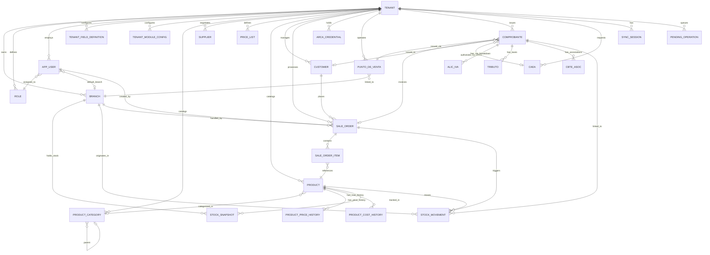
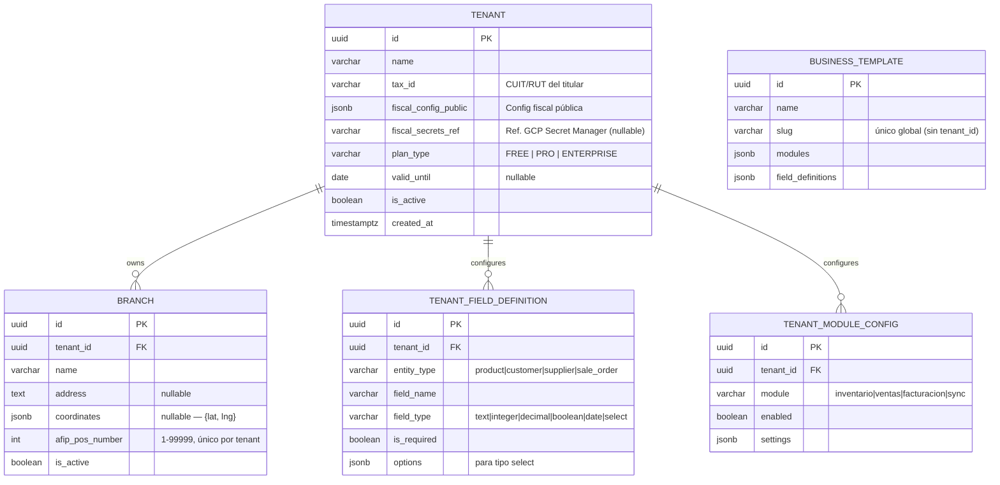
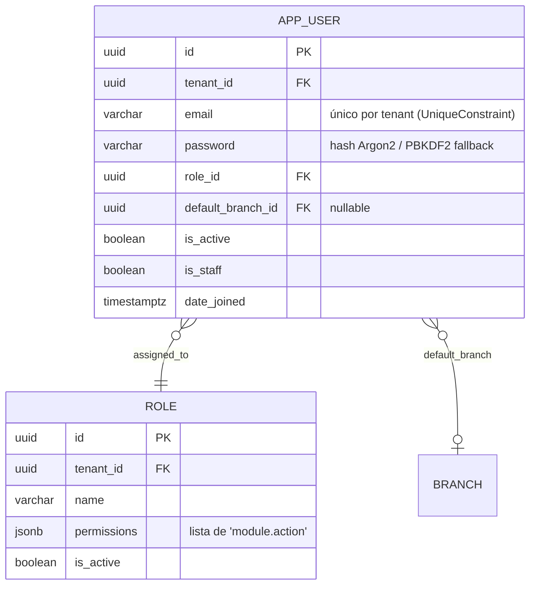
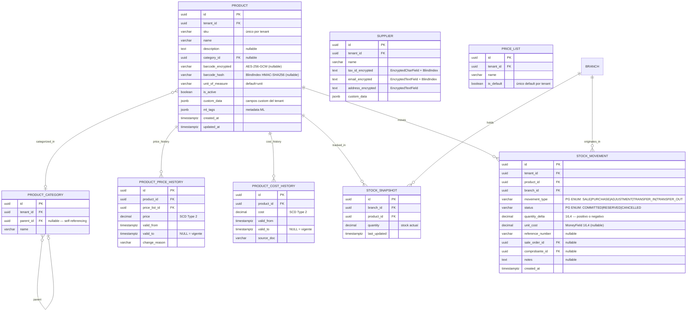
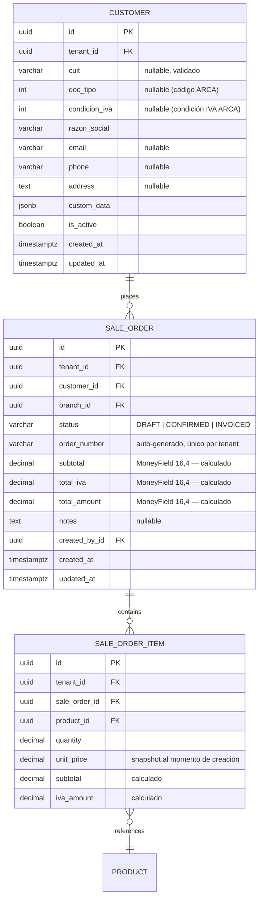
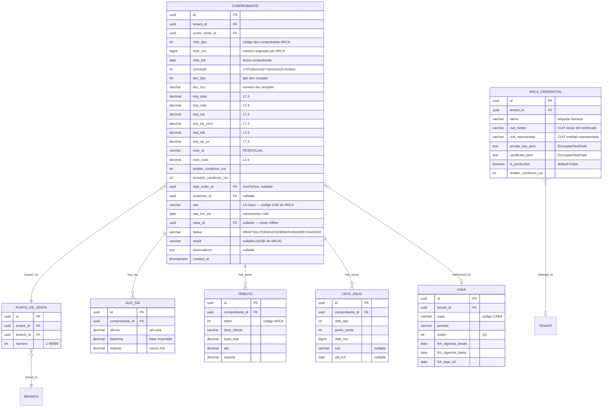
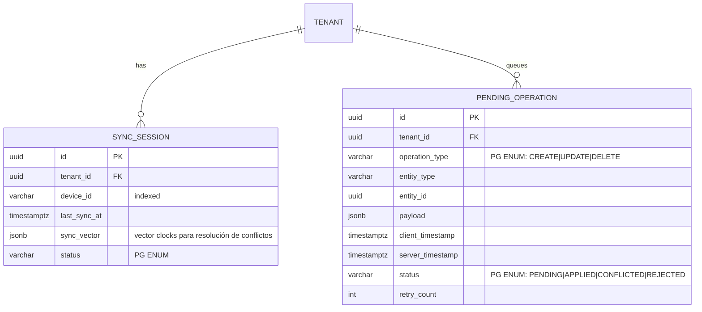
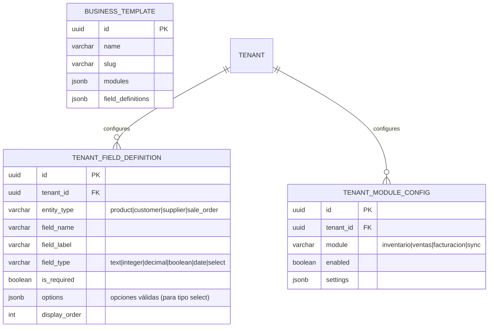

# Data Model & Domain Model - Gravitea ERP

## 1. Metadatos
| Campo | Valor |
| --- | --- |
| **Owner** | Lead Data Architect |
| **Versión** | 0.3 |
| **Last Updated** | 2026-03-01 |
| **Estado** | **Features 001-025 Completas — Aceleración Rust Done — Fase de Investigación Vertical SaaS** |
| **Motor DB** | PostgreSQL 18.1 |
| **Estrategia ID** | **UUID v4 autogenerado** |
| **Tenancy** | Shared Database, Shared Schema, **Hardened RLS** |

## 2. Manifiesto de Diseño "Ironclad"
Para cumplir con la promesa de una "Base de Datos de Acero", este diseño prioriza la **integridad mecánica** sobre la flexibilidad de desarrollo. La base de datos es la última línea de defensa.

### 2.1 Principios Inquebrantables
1.  **Integridad forzada por Motor**: No confiamos en el Backend.
    *   *Constraint*: Todas las FKs tienen `ON DELETE RESTRICT`.
    *   *Check*: Precios y cantidades nunca pueden ser negativos (salvo en ledger explícito).
    *   *Currency*: `DECIMAL(16, 4)` / `DECIMAL(17, 3)` según el campo. Prohibido `FLOAT/DOUBLE`.
2.  **Aislamiento Multi-Tenant Nativo (RLS)**:
    *   La seguridad no es un `WHERE` en el ORM.
    *   Usamos **PostgreSQL Row Level Security** combinado con `TenantBoundManager` (Django ORM) e **IDOR validation** para que sea imposible que un tenant lea datos de otro.
    *   Estrategia de "Defensa en Profundidad": Capa 1 (ORM Manager) → Capa 2 (RLS) → Capa 3 (Validación IDOR).
3.  **Inmutabilidad Financiera (Append-Only Ledger)**:
    *   **Regla de Oro**: "El pasado no se edita, se corrige".
    *   Tablas `StockMovement` y `Comprobante` (estado AUTORIZADO/OBSERVADO) son **APPEND-ONLY**. Un error se corrige con un contra-asiento, nunca con un `UPDATE`.
4.  **Machine Learning First**:
    *   No tiramos datos. Guardamos **contexto** e **historia**.
    *   Tablas temporales (`valid_from`, `valid_to`) para precios y costos (SCD Type 2).
    *   Columnas `custom_data` / `ml_tags` (JSONB) para metadata extensible.

## 3. Diagrama Entidad-Relación (ERD) Completo

### 3.1 ERD — Visión Global (Relaciones Cross-Módulo)



### 3.2 Módulo Core — Tenancy y Configuración



> **Nota**: `BusinessTemplate` es una entidad **system-wide** — no tiene `tenant_id` y aplica como plantilla de onboarding global.

### 3.3 Módulo Auth — Usuarios y Roles



**Patrones clave**:
- `USERNAME_FIELD = email`. El email es único por tenant (no globalmente).
- Los permisos en `Role.permissions` son strings en formato `module.action` (ej: `inventario.view`, `facturacion.create`).
- JWT custom claims: `tenant_id`, `branch_id`, `role_id`, `permissions`.
- Algoritmo JWT: **RS256** (4096-bit RSA). HS256/HS512 prohibidos.
- Rate limiting de login: 3 niveles (5/min → 3/min → lockout 15 min tras 5 fallos).

### 3.4 Módulo Inventario



**Patrones clave**:
- `StockMovement` es un **LEDGER INMUTABLE** — solo GET + POST. No UPDATE/DELETE.
- PII del Supplier cifrada con AES-256-GCM + BlindIndex HMAC-SHA256 para búsqueda. Operaciones criptográficas aceleradas por Rust `crypto.rs` (spec 018, 8.7x speedup) con fallback a Python puro.
- `Product.barcode` cifrado; búsqueda por `barcode_hash`.
- Cálculos de stock (`aggregate_stock_levels`) acelerados por Rust `compute.rs` (spec 019, 2.1x speedup).

### 3.5 Módulo Ventas



**Ciclo de vida SaleOrder**: `DRAFT → CONFIRMED → INVOICED`
- `INVOICED` es **estado terminal inmutable**.
- Acciones disponibles: `POST /orders/{id}/confirm/`, `POST /orders/{id}/authorize/`, `POST /orders/{id}/invoice/`.
- Routing anidado: `GET /api/v1/ventas/orders/{order_pk}/items/`.

### 3.6 Módulo Facturacion (ARCA)



**Ciclo de vida Comprobante**: `DRAFT → AUTORIZADO | OBSERVADO | RECHAZADO`
- `AUTORIZADO` y `OBSERVADO` son **estados terminales inmutables** (fiscal compliance).
- `AlicIva`, `Tributo`, `CbteAsoc`: NO tienen `tenant_id` propio — aislamiento por FK-subquery RLS via `Comprobante`.
- Acciones: `POST /comprobantes/{id}/emitir/`, `/qr/`, `/authorize/`.
- CAEA: autorización offline con periodos y validez temporal. Acciones: `/solicitar/`, `/sin-movimiento/`. Batch construction acelerada por Rust `arca.rs` (spec 024) con serde JSON.
- Errores: formato **Problem+JSON (RFC 9457)**.

### 3.7 Módulo Sync — Sincronización Offline-First



**Patrones clave**:
- Vector clocks (`sync_vector`) para detección de conflictos.
- Push idempotente: UUIDs generados por el cliente.
- Pull cursor-based: filtrado por entidad.
- Resolución de conflictos `most_complete_wins` acelerada por Rust `sync.rs` (spec 023) — merge JSON con serde, GIL release en batch.

### 3.8 Módulo Tenant Customization



**Patrones clave**:
- `custom_data` (JSONField) en las entidades Product, Supplier, Customer, SaleOrder almacena los valores de los campos custom.
- `CustomFieldsMixin` (DRF serializer) valida, crea defaults y actualiza los valores de `custom_data`.
- `BusinessTemplate` es **system-wide** — sin `tenant_id` — funciona como plantilla de onboarding global.
- 6 tipos de campo soportados: `text`, `integer`, `decimal`, `boolean`, `date`, `select`. Validación acelerada por Rust `validation.rs` (spec 025) con fallback a Python.

## 4. Arquitectura Física & Seguridad

### 4.1 Configuración de Aislamiento (Defense in Depth)
Implementación de tres capas de seguridad para aislamiento multi-tenant:

**Capa 1 — ORM (Python/Django)**:
- `TenantBoundManager`: auto-filtra todas las queries ORM por `tenant_id` del contexto.
- `TenantContextMiddleware`: extrae `tenant_id` del JWT y lo establece en el contexto de la sesión.
- `_validate_tenant_references()`: valida todas las FK writes contra el tenant actual (prevención IDOR).

**Capa 2 — Base de Datos (PostgreSQL RLS)**:
- Variable de sesión: `app.current_tenant_id` (SET LOCAL, scope de transacción).
- RLS directo: tablas con `tenant_id` (TenantBoundModel).
- RLS por FK-subquery: `AlicIva`, `Tributo`, `CbteAsoc` (via Comprobante).

```sql
-- Función PG para evaluación de políticas RLS
CREATE OR REPLACE FUNCTION get_current_tenant_id() RETURNS uuid AS $$
    SELECT nullif(current_setting('app.current_tenant_id', true), '')::uuid;
$$ LANGUAGE sql STABLE SECURITY DEFINER;

-- Política RLS base (aplicada por módulo)
ALTER TABLE products ENABLE ROW LEVEL SECURITY;

CREATE POLICY tenant_isolation ON products
    AS PERMISSIVE FOR ALL TO public
    USING (tenant_id = get_current_tenant_id())
    WITH CHECK (tenant_id = get_current_tenant_id());
```

**Capa 3 — Validación**:
- JWT: se validan `iss`, `aud`, `exp` en cada request.
- Algoritmo: solo RS256 (whitelist explícito, HS* prohibido).
- PII cifrada: AES-256-GCM con BlindIndex HMAC-SHA256 para búsqueda por igualdad. Acelerado por Rust `crypto.rs` (spec 018).
- SSRF: validación de URLs via Rust `security.rs` (spec 022) — 5 formatos IP, 10 rangos CIDR, 83 entradas adversariales.

### 4.2 Cobertura RLS por Módulo

| Módulo | Tablas con RLS Directo | Tablas con RLS por FK-subquery |
|--------|----------------------|-------------------------------|
| facturacion | ARCACredential, PuntoDeVenta, Comprobante, CAEA | AlicIva, Tributo, CbteAsoc |
| ventas | Customer, SaleOrder, SaleOrderItem | — |
| auth | (via TenantBoundManager) | — |
| inventario | (via TenantBoundManager) | — |
| sync | (via TenantBoundManager) | — |
| core | (via TenantBoundManager) | — |

## 5. Diseño del Esquema para Machine Learning (ML-Ready)

### 5.1 Feature Store Nativo
Para que el ERP tenga capacidades predictivas (Churn, Demand Forecasting, Dynamic Pricing), la DB actúa como un Feature Store transaccional.

*   **Tablas de Hechos (Facts)**: `stock_movements`, `comprobantes`. Optimizadas para escritura rápida.
*   **Tablas de Dimensiones (Dims)**: `products`, `customers`. Enriquecidas con vectors y metadata.
*   **Contexto Rico (The "Why")**:
    *   Columnas `ml_tags` (JSONB) en `Product` para categorización AI.
    *   `custom_data` (JSONB) extensible por tenant para features adicionales.

### 5.2 Historización de Precios (SCD Type 2)
Para predecir demanda, necesitamos saber cuánto costaba el producto en ese momento exacto.

**Tabla: `ProductPriceHistory`**

| Campo | Tipo | Descripción |
| :--- | :--- | :--- |
| `id` | UUID | PK |
| `product_id` | UUID FK | Producto |
| `price_list_id` | UUID FK | Lista de precios |
| `price` | DECIMAL | El precio en ese momento |
| `valid_from` | TIMESTAMPTZ | Inicio de vigencia |
| `valid_to` | TIMESTAMPTZ | Fin de vigencia (NULL = actual) |
| `change_reason` | TEXT | Motivo del cambio |

**Tabla: `ProductCostHistory`** — mismo patrón SCD Type 2 para costos.

## 6. Estructuras de Datos Críticas

### 6.1 Entidad `StockMovement` — Ledger Inmutable de Inventario

Esta tabla es la fuente de la verdad del inventario. **No se modifica ni se elimina**. Correcciones vía contra-asientos.

| Campo | Tipo | Restricción |
| :--- | :--- | :--- |
| `id` | UUID PK | auto-generado |
| `tenant_id` | UUID FK | requerido |
| `product_id` | UUID FK | requerido |
| `branch_id` | UUID FK | requerido |
| `movement_type` | PG ENUM | SALE \| PURCHASE \| ADJUSTMENT \| TRANSFER_IN \| TRANSFER_OUT |
| `status` | PG ENUM | COMMITTED \| RESERVED \| CANCELLED |
| `quantity_delta` | DECIMAL(16,4) | positivo o negativo |
| `unit_cost` | DECIMAL(16,4) | MoneyField (nullable) |
| `sale_order_id` | UUID FK | nullable |
| `comprobante_id` | UUID FK | nullable |
| `created_at` | TIMESTAMPTZ | auto_now_add |

**APPEND-ONLY**: El ViewSet expone solo GET + POST. No PUT/PATCH/DELETE.

### 6.2 Entidad `Comprobante` — Ledger Fiscal Inmutable

Tabla de comprobantes electrónicos ARCA. Una vez en estado AUTORIZADO u OBSERVADO, **no se puede modificar**.

6 campos de montos en DECIMAL(17,3): `imp_total`, `imp_neto`, `imp_iva`, `imp_tot_conc`, `imp_trib`, `imp_op_ex`.

### 6.3 Tipos ENUM de PostgreSQL (PostgresEnumField)

Los campos de estado usan PostgreSQL ENUM nativo para integridad a nivel de DB:

| Entidad | Campo | Valores |
| :--- | :--- | :--- |
| StockMovement | movement_type | SALE, PURCHASE, ADJUSTMENT, TRANSFER_IN, TRANSFER_OUT |
| StockMovement | status | COMMITTED, RESERVED, CANCELLED |
| SyncSession | status | (definidos en sync/models.py) |
| PendingOperation | operation_type | CREATE, UPDATE, DELETE |
| PendingOperation | status | PENDING, APPLIED, CONFLICTED, REJECTED |

### 6.4 Cifrado de Campos PII

| Entidad | Campo | Cifrado |
| :--- | :--- | :--- |
| Supplier | tax_id, email, address | AES-256-GCM + BlindIndex |
| Product | barcode | AES-256-GCM + BlindIndex |
| ARCACredential | private_key_pem, certificate_pem | AES-256-GCM (EncryptedTextField) |

Formato de almacenamiento: `base64(nonce || ciphertext || tag)`.

> **Aceleración Rust (spec 018)**: Las operaciones AES-256-GCM y HMAC-SHA256 son despachadas a `crypto.rs` via `crypto_engine.py` (8.7x speedup). Si el módulo Rust no está disponible, fallback transparente a Python puro.

## 7. Performance y Mantenimiento

### 7.1 Paginación
- **Cursor-based por defecto** (`StandardCursorPagination`, PAGE_SIZE=100).
- Consistente con el módulo sync (pull cursor-based).
- Superior a offset-based para datasets grandes y en movimiento.

### 7.2 Índices Estratégicos
*   **BlindIndex**: Para búsqueda por igualdad en campos cifrados (`barcode_hash`, `email_hash` de Supplier).
*   **UniqueConstraint compuesto**: `(tenant_id, email)` en AppUser, `(tenant_id, afip_pos_number)` en Branch, `(branch_id, product_id)` en StockSnapshot.
*   **ForeignKey indexes**: Automáticos en Django para todas las FK.

### 7.3 Health Checks Automatizados
- **Kubernetes probes**: `GET /health/live` (liveness) y `GET /health/ready` (readiness).
- **Combined health**: `GET /api/v1/health/` — verifica DB, cache, y servicios externos.
- **StockSnapshot**: Vista materializada de stock actual por branch+product.

## 8. Mapeo Local (Offline-First)

El módulo `sync` implementa sincronización bidireccional entre clientes y el servidor:

**Estado actual (implementado)**:
- `SyncSession`: sesión de dispositivo con vector clocks.
- `PendingOperation`: cola de operaciones pendientes con retry y estado de conflicto.
- `POST /api/v1/sync/push/`: batch push idempotente con UUIDs de cliente.
- `GET /api/v1/sync/pull/`: pull cursor-based con filtrado por entidad.
- `GET /api/v1/sync/status/{device_id}/`: estado del dispositivo + conteos pendientes/conflictos.

**Arquitectura de conflictos**:
- Detección: vector clocks en `SyncSession.sync_vector`.
- Resolución: servidor autoritativo. Operaciones conflictuadas quedan en estado `CONFLICTED`.
- Idempotencia: UUIDs generados por cliente en operaciones de push.

**Estado planificado (Electron + SQLite)**:
- Base de datos SQLite cifrada con SQLCipher en cliente desktop.
- Replicación de subconjunto de tablas PostgreSQL (productos, precios, clientes frecuentes).
- `_queue` local para transacciones offline antes de sincronizar.

---

*Documento actualizado a partir de la implementación real del sistema (branches 001-025, Marzo 2026). Incluye capa de aceleración Rust/PyO3 (specs 017-025) y contexto de investigación Vertical SaaS (ADR-016).*
