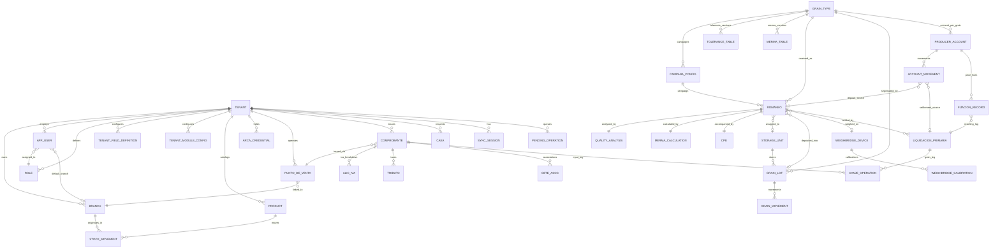
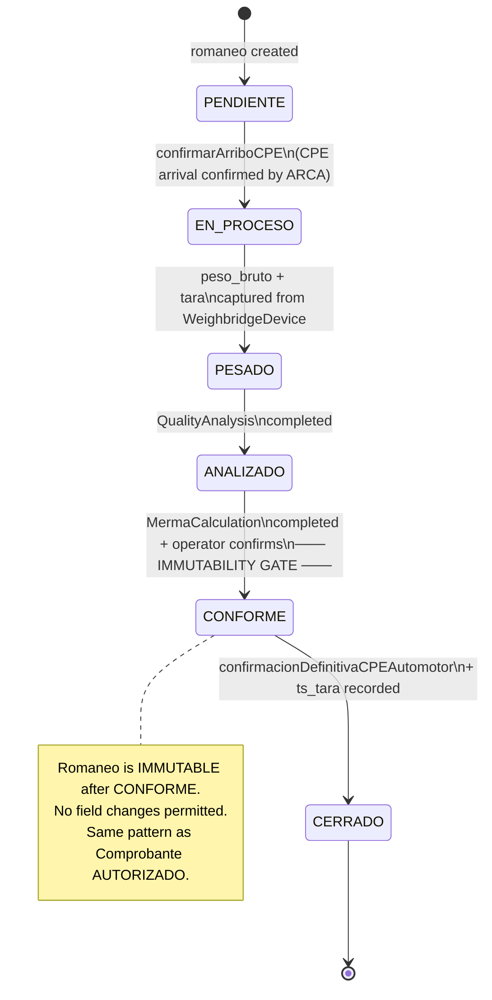
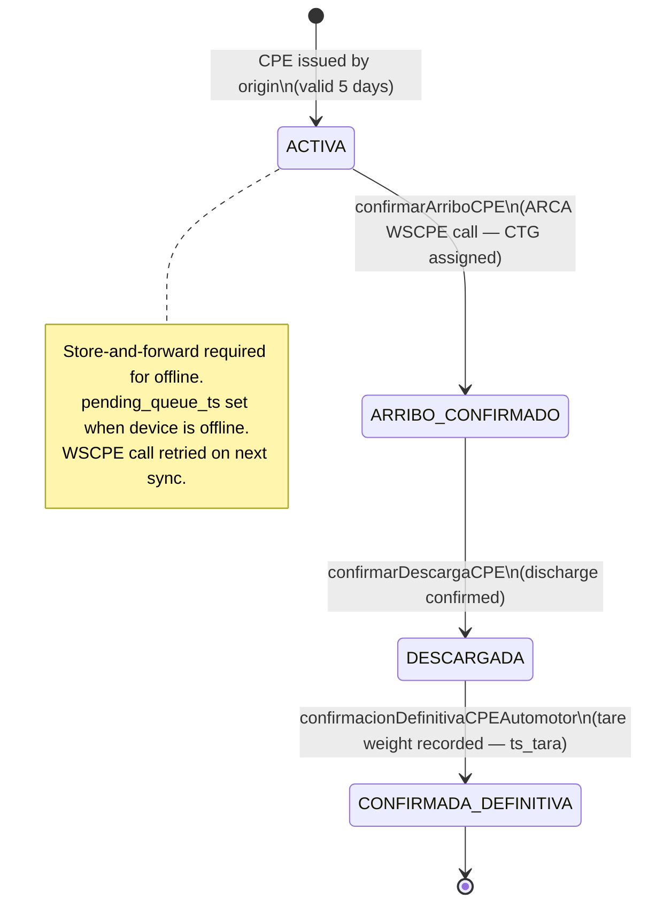
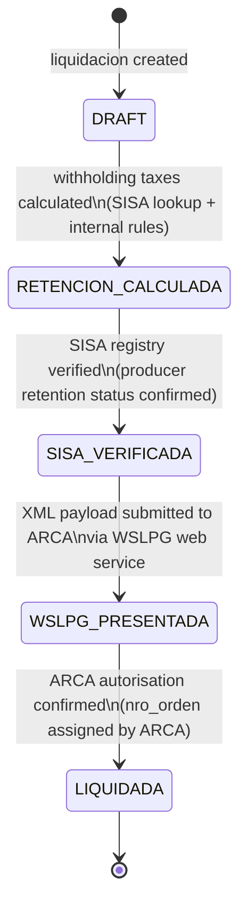

# Data Model & Domain Model — Grain Domain v1.0

## 1. Metadata

| Field | Value |
|-------|-------|
| **Title** | Data Model & Domain Model — Grain Domain v1.0 |
| **Version** | 1.0 |
| **Date** | 2026-03-16 |
| **Owner** | Bruno Ghiberto |
| **Language** | English (primary) |
| **Status** | **Acopio de Granos Vertical — Active** |
| **Database** | PostgreSQL 18.1 |
| **ID Strategy** | UUID v4 auto-generated |
| **Tenancy** | Shared Database, Shared Schema, Hardened RLS |
| **Scope** | SINGLE SOURCE OF TRUTH for all Django models; grain domain v1.0. All implementation specs (09+) derive from this document. |

---

## 2. Design Manifesto "Ironclad"

To honour the promise of a "Steel Database", this design prioritises **mechanical integrity** over development flexibility. The database is the last line of defence.

### 2.1 Ironclad Principles

**P1 — Engine-Enforced Integrity**: We do not trust the backend.
- All FKs carry `ON DELETE RESTRICT` (Django: `on_delete=models.PROTECT`).
- Prices and quantities can never be negative (except in explicit ledger entries).
- `DECIMAL(17,3)` for all weights and monetary fields. `DECIMAL(5,2)` for all percentages. **`FLOAT`/`DOUBLE` are prohibited — zero exceptions.**

**P2 — Native Multi-Tenant Isolation (RLS)**:
- Security is not a `WHERE` clause in the ORM.
- **Defence-in-Depth**: Layer 1 (ORM — `TenantBoundManager`) → Layer 2 (DB — PostgreSQL RLS) → Layer 3 (Validation — IDOR checks).
- Session variable `app.current_tenant_id` scoped per transaction.

**P3 — Financial Immutability (Append-Only Ledger)**:
- **Golden Rule**: "The past is not edited; it is corrected."
- `StockMovement`, `Comprobante` (AUTORIZADO/OBSERVADO), `GrainMovement`, `AccountMovement`, and `MermaCalculation` are **APPEND-ONLY**. Errors are corrected via counter-entries, never via `UPDATE`.

**P4 — Machine Learning First**:
- We discard nothing. We store **context** and **history**.
- Temporal tables (`valid_from`, `valid_to`) for regulatory reference data (ToleranceTable, MermaTable).
- Grain domain examples: quality degradation prediction, silo assignment optimisation, weighbridge fraud detection, pizarra price forecasting.
- All measurement fields paired with timestamps; derived values stored alongside inputs for full audit trail.

**P5 — AI-Ready Data Architecture**:
- **Provenance fields** present on all grain domain models: `created_at`, `updated_at`, `created_by`, `device_id`.
- **Measurement fields** paired with timestamps (e.g., `QualityAnalysis.analysis_timestamp`, `Romaneo.ts_pesada_bruta`).
- **Derived fields** stored alongside inputs (e.g., `MermaCalculation` stores all 4 intermediate `peso_post_*` values plus all formula inputs).
- No post-hoc data reconstruction needed — ML training pipelines can start from production day 1.

---

## 3. Entity-Relationship Diagrams (ERD)

### 3.1 Global ERD — All Modules



### 3.2 Grain Domain Detail ERD

```mermaid
erDiagram
    ROMANEO {
        uuid id PK
        varchar romaneo_number
        varchar status "PENDIENTE|EN_PROCESO|PESADO|ANALIZADO|CONFORME|CERRADO"
        uuid grain_type_id FK
        uuid campaign_id FK
        uuid branch_id FK
        datetime ts_entrada
        datetime ts_pesada_bruta
        datetime ts_calado
        datetime ts_analisis
        datetime ts_descarga
        datetime ts_tara
        varchar patente_chasis
        varchar patente_acoplado
        varchar driver_name
        varchar driver_dni
        decimal peso_bruto_kg "DECIMAL(17,3)"
        decimal tara_kg "DECIMAL(17,3)"
        decimal peso_neto_bruto_kg "DECIMAL(17,3)"
        uuid weighbridge_device_id FK
        varchar cpe_numero
        varchar ctg_codigo
        varchar producer_cuit
        varchar origin_locality
        uuid storage_unit_id FK
        uuid grain_lot_id FK
        uuid operator_id FK
        uuid laboratorista_id FK
        varchar device_id
        int grado_asignado
        decimal bonificacion_rebaja_pct "DECIMAL(5,2)"
        uuid tolerance_table_version_id FK
        decimal peso_neto_conforme_kg "DECIMAL(17,3)"
    }

    QUALITY_ANALYSIS {
        uuid id PK
        uuid romaneo_id FK "OneToOne"
        decimal humedad_pct "DECIMAL(5,2) — Hi"
        decimal materias_extranas_pct "DECIMAL(5,2)"
        decimal granos_danados_pct "DECIMAL(5,2)"
        decimal granos_quebrados_pct "DECIMAL(5,2)"
        decimal peso_hectolitrico_kg "DECIMAL(5,2) — cereals only"
        decimal proteina_pct "DECIMAL(5,2) — trigo only"
        decimal granos_verdes_pct "DECIMAL(5,2) — soja only"
        decimal granos_ardidos_pct "DECIMAL(5,2)"
        decimal cuerpos_extranos_pct "DECIMAL(5,2)"
        datetime analysis_timestamp
        varchar sample_reference
    }

    MERMA_CALCULATION {
        uuid id PK
        uuid romaneo_id FK "OneToOne"
        uuid merma_table_version_id FK
        decimal peso_neto_bruto_input_kg "DECIMAL(17,3)"
        decimal hi_input_pct "DECIMAL(5,2)"
        decimal hf_used_pct "DECIMAL(5,2)"
        decimal materias_extranas_input_pct "DECIMAL(5,2)"
        decimal zarandeo_pct "DECIMAL(5,2)"
        decimal secado_pct "DECIMAL(5,2)"
        decimal manipuleo_pct "DECIMAL(5,2)"
        decimal volatil_pct "DECIMAL(5,2)"
        decimal peso_post_zarandeo_kg "DECIMAL(17,3)"
        decimal peso_post_secado_kg "DECIMAL(17,3)"
        decimal peso_post_manipuleo_kg "DECIMAL(17,3)"
        decimal peso_final_kg "DECIMAL(17,3)"
        decimal total_merma_kg "DECIMAL(17,3)"
        decimal total_factor_pct "DECIMAL(7,4)"
        datetime calculated_at
        uuid calculated_by_id FK
    }

    GRAIN_LOT {
        uuid id PK
        uuid tenant_id FK
        varchar lot_code
        uuid branch_id FK
        uuid grain_type_id FK
        uuid campaign_id FK
        int grado
        uuid storage_unit_id FK
        decimal total_kg "DECIMAL(17,3)"
        boolean is_own_grain
    }

    STORAGE_UNIT {
        uuid id PK
        uuid tenant_id FK
        varchar name
        varchar unit_type
        uuid branch_id FK
        decimal capacity_tonnes "DECIMAL(12,3)"
        boolean is_active
        uuid current_grain_type_id FK
        varchar environment_sensor_id
    }

    PRODUCER_ACCOUNT {
        uuid id PK
        uuid tenant_id FK
        varchar producer_cuit
        uuid branch_id FK
        uuid grain_type_id FK
        uuid campaign_id FK
        decimal grain_balance_kg "DECIMAL(17,3)"
        decimal ars_balance "DECIMAL(17,3)"
        decimal usd_balance "DECIMAL(17,3)"
        boolean is_active
    }

    ACCOUNT_MOVEMENT {
        uuid id PK
        uuid tenant_id FK
        uuid producer_account_id FK
        varchar movement_type
        uuid romaneo_id FK
        uuid liquidacion_id FK
        decimal quantity_kg "DECIMAL(17,3)"
        decimal ars_amount "DECIMAL(17,3)"
        decimal usd_amount "DECIMAL(17,3)"
        datetime movement_at
        varchar reference_document
        text notes
    }

    LIQUIDACION_PRIMARIA {
        uuid id PK
        uuid tenant_id FK
        uuid romaneo_id FK
        uuid grain_type_id FK
        uuid campaign_id FK
        uuid producer_account_id FK
        varchar status
        varchar tipo_operacion
        int punto_emision
        int numero_orden
        date fecha_emision
        decimal peso_neto_granos_kg "DECIMAL(17,3)"
        decimal precio_referencia "DECIMAL(17,3)"
        decimal importe_bruto "DECIMAL(17,3)"
        decimal importe_neto "DECIMAL(17,3)"
        decimal alicuota_iva "DECIMAL(5,2)"
        decimal importe_iva "DECIMAL(17,3)"
        jsonb retenciones
        jsonb wslpg_response
        datetime wslpg_submitted_at
    }

    ROMANEO ||--|| QUALITY_ANALYSIS : "one-to-one"
    ROMANEO ||--|| MERMA_CALCULATION : "one-to-one"
    ROMANEO }o--o| GRAIN_LOT : "deposited_into"
    GRAIN_LOT }o--|| STORAGE_UNIT : "stored_in"
    PRODUCER_ACCOUNT ||--o{ ACCOUNT_MOVEMENT : "movements"
    ACCOUNT_MOVEMENT }o--o| ROMANEO : "deposit_source"
    ACCOUNT_MOVEMENT }o--o| LIQUIDACION_PRIMARIA : "settlement_source"
```



---

## 4. Core Infrastructure

> **Preserved from v0.3 — no field changes.**

### 4.1 TenantBoundModel (Abstract Base Class)

All grain domain entities (and all other tenant-scoped entities) inherit from `TenantBoundModel`. This is the foundation of Layer 1 isolation.

```python
class TenantBoundModel(models.Model):
    id         = models.UUIDField(primary_key=True, default=uuid.uuid4, editable=False)
    tenant     = models.ForeignKey(Tenant, on_delete=models.PROTECT, db_index=True)
    created_at = models.DateTimeField(auto_now_add=True)
    updated_at = models.DateTimeField(auto_now=True)
    created_by = models.ForeignKey(AppUser, null=True, on_delete=models.SET_NULL)

    objects = TenantBoundManager()

    class Meta:
        abstract = True
```

**Exceptions** — entities without `tenant` FK (global reference data):
- `GrainType`, `ToleranceTable`, `MermaTable` — regulated data shared across all tenants.
- `BusinessTemplate` — system-wide onboarding template.

### 4.2 Tenant

| Field | Type | Null | Default | Description |
|-------|------|------|---------|-------------|
| `id` | UUIDField PK | — | uuid4 | Auto-generated |
| `name` | CharField(200) | No | — | Company name |
| `tax_id` | CharField(11) | No | — | CUIT of the holder |
| `fiscal_config_public` | JSONField | Yes | — | Public fiscal config |
| `fiscal_secrets_ref` | CharField(200) | Yes | — | GCP Secret Manager ref |
| `plan_type` | CharField choices FREE/PRO/ENTERPRISE | No | FREE | Subscription tier |
| `valid_until` | DateField | Yes | — | NULL = no expiry |
| `is_active` | BooleanField | No | True | — |

### 4.3 Branch

| Field | Type | Null | Default | Description |
|-------|------|------|---------|-------------|
| `id` | UUIDField PK | — | uuid4 | Auto-generated |
| `tenant` | ForeignKey(Tenant) PROTECT | No | — | Owning tenant |
| `name` | CharField(200) | No | — | Plant/office name |
| `address` | TextField | Yes | — | — |
| `coordinates` | JSONField | Yes | — | `{lat, lng}` |
| `afip_pos_number` | IntegerField | Yes | — | 1–99999, unique per tenant |
| `is_active` | BooleanField | No | True | — |

### 4.4 TenantFieldDefinition

| Field | Type | Null | Default | Description |
|-------|------|------|---------|-------------|
| `id` | UUIDField PK | — | uuid4 | — |
| `tenant` | ForeignKey(Tenant) PROTECT | No | — | — |
| `entity_type` | CharField | No | — | product\|customer\|supplier\|sale_order |
| `field_name` | CharField(100) | No | — | Machine name |
| `field_label` | CharField(200) | No | — | Display label |
| `field_type` | CharField choices | No | — | text\|integer\|decimal\|boolean\|date\|select |
| `is_required` | BooleanField | No | False | — |
| `options` | JSONField | Yes | — | Valid options for `select` type |
| `display_order` | IntegerField | No | 0 | — |

### 4.5 TenantModuleConfig

| Field | Type | Null | Default | Description |
|-------|------|------|---------|-------------|
| `id` | UUIDField PK | — | uuid4 | — |
| `tenant` | ForeignKey(Tenant) PROTECT | No | — | — |
| `module` | CharField | No | — | inventario\|ventas\|facturacion\|sync\|acopio |
| `enabled` | BooleanField | No | False | — |
| `settings` | JSONField | Yes | — | Module-specific config |

### 4.6 BusinessTemplate

| Field | Type | Null | Default | Description |
|-------|------|------|---------|-------------|
| `id` | UUIDField PK | — | uuid4 | — |
| `name` | CharField(200) | No | — | — |
| `slug` | CharField(100) | No | — | Unique globally (no tenant_id) |
| `modules` | JSONField | No | — | Module activation list |
| `field_definitions` | JSONField | No | — | Pre-configured custom fields |

> **Note**: `BusinessTemplate` is **system-wide** — no `tenant_id`. It serves as a global onboarding template.

### 4.7 AppUser

| Field | Type | Null | Default | Description |
|-------|------|------|---------|-------------|
| `id` | UUIDField PK | — | uuid4 | — |
| `tenant` | ForeignKey(Tenant) PROTECT | No | — | — |
| `email` | EmailField | No | — | Unique per tenant (not globally) |
| `password` | CharField | No | — | Argon2 hash / PBKDF2 fallback |
| `role` | ForeignKey(Role) PROTECT | No | — | — |
| `default_branch` | ForeignKey(Branch) SET_NULL | Yes | — | — |
| `is_active` | BooleanField | No | True | — |
| `is_staff` | BooleanField | No | False | — |
| `date_joined` | DateTimeField | No | now | auto_now_add |

**Key patterns**: `USERNAME_FIELD = 'email'`. JWT custom claims: `tenant_id`, `branch_id`, `role_id`, `permissions`. Algorithm: **RS256** (4096-bit RSA). HS256/HS512 prohibited.

### 4.8 Role

| Field | Type | Null | Default | Description |
|-------|------|------|---------|-------------|
| `id` | UUIDField PK | — | uuid4 | — |
| `tenant` | ForeignKey(Tenant) PROTECT | No | — | — |
| `name` | CharField(100) | No | — | — |
| `permissions` | JSONField | No | [] | List of `module.action` strings |
| `is_active` | BooleanField | No | True | — |

### 4.9 Physical & Security Architecture

**Layer 1 — ORM (Python/Django)**:
- `TenantBoundManager`: auto-filters all ORM queries by `tenant_id` from context.
- `TenantContextMiddleware`: extracts `tenant_id` from JWT and sets session context.
- `_validate_tenant_references()`: validates all FK writes against current tenant (IDOR prevention).

**Layer 2 — Database (PostgreSQL RLS)**:
- Session variable: `app.current_tenant_id` (`SET LOCAL`, transaction-scoped).

```sql
CREATE OR REPLACE FUNCTION get_current_tenant_id() RETURNS uuid AS $$
    SELECT nullif(current_setting('app.current_tenant_id', true), '')::uuid;
$$ LANGUAGE sql STABLE SECURITY DEFINER;
```

**Layer 3 — Validation**: JWT claims `iss`, `aud`, `exp` validated on every request. RS256 algorithm whitelist enforced. PII encrypted with AES-256-GCM + HMAC-SHA256 blind index.

---

## 5. Grain Domain — Acopio de Granos

> **All entities in this section inherit `TenantBoundModel`** unless explicitly marked **GLOBAL**.
> **GLOBAL entities** (no `tenant` FK): `GrainType`, `ToleranceTable`, `MermaTable`.

### 5.1 Reference Data

#### GrainType — *GLOBAL (no tenant FK)*

Regulated grain species catalogue. **Not per-tenant** — all acopiadores operate on the same grain types.

| Field | Django Type | Precision | Null | Default | Description |
|-------|-------------|-----------|------|---------|-------------|
| `id` | UUIDField PK | — | No | uuid4 | Auto-generated |
| `code` | CharField | max_length=3 | No | — | Grain code (e.g., TRI, MAI, SOJ, GIR, SOR) |
| `name` | CharField | max_length=100 | No | — | Full name in Spanish |
| `humedad_base_pct` | DecimalField | (5,2) | No | — | Base moisture for grading (publication reference). **NOT used in secado formula.** |
| `hf_secado_pct` | DecimalField | (5,2) | No | — | **Hf — Final moisture used in secado formula** `%S = (Hi−Hf)/(100−Hf)`. **CRITICAL: ≠ humedad_base_pct — using wrong value yields ~168 kg error per 30-tonne truck.** |
| `manipuleo_fijo_pct` | DecimalField | (5,2) | No | — | Fixed regulatory manipuleo deduction. NOT versioned. |
| `volatil_fijo_pct` | DecimalField | (5,2) | No | — | Fixed regulatory volatil deduction. NOT versioned. |
| `grading_system` | CharField choices | — | No | GRADO | GRADO (cereals) or TOLERANCE (oleaginosas) |
| `is_active` | BooleanField | — | No | True | — |

**Reference data (regulatory — Cámara Arbitral de Cereales)**:

| Grain | Code | Hf (secado formula) | Humedad Base (grading) | Difference |
|-------|------|--------------------|-----------------------|-----------|
| Trigo | TRI | 13.5% | 14.0% | 0.5 pp — DO NOT CONFUSE |
| Maíz | MAI | 13.5% | 14.5% | 1.0 pp |
| Soja | SOJ | 13.0% | 13.5% | 0.5 pp |
| Girasol | GIR | 10.5% | 11.0% | 0.5 pp |
| Sorgo | SOR | 13.5% | 15.0% | 1.5 pp |

#### CampanaConfig — *Inherits TenantBoundModel*

Per-tenant campaign year configuration. **One active campaign per tenant at a time.**

| Field | Django Type | Precision | Null | Default | Description |
|-------|-------------|-----------|------|---------|-------------|
| `id` | UUIDField PK | — | No | uuid4 | — |
| `tenant` | ForeignKey(Tenant) PROTECT | — | No | — | Owning tenant |
| `campaign_code` | CharField | max_length=7 | No | — | Format "YYYY/YY" e.g. "2024/25". Starts April, ends March. |
| `start_date` | DateField | — | No | — | Campaign start (typically April 1) |
| `end_date` | DateField | — | No | — | Campaign end (typically March 31 next year) |
| `is_active` | BooleanField | — | No | False | Constraint: only 1 active per tenant |
| `notes` | TextField | — | Yes | — | Optional notes |

**Constraint**: `UniqueConstraint(fields=['tenant', 'is_active'], condition=Q(is_active=True))` — only one active campaign per tenant.

---

### 5.2 Regulatory Tables

> **VERSIONING NOTE**: Both ToleranceTable and MermaTable are versioned via `valid_from`/`valid_to` date fields. The version in effect at `Romaneo.ts_entrada` (local creation timestamp) is used — even if the romaneo is synced days later. `QualityAnalysis.tolerance_table_version` FK stores the exact version used. `MermaCalculation.merma_table_version` FK stores the exact MermaTable version used. **A romaneo can never retroactively change its grade due to a table update.**

#### ToleranceTable — *GLOBAL (no tenant FK)*

Grade tolerance parameters issued by the Cámara Arbitral de Cereales via SAGPyA/SENASA resolutions. Legally binding across all market participants.

| Field | Django Type | Precision | Null | Default | Description |
|-------|-------------|-----------|------|---------|-------------|
| `id` | UUIDField PK | — | No | uuid4 | — |
| `grain_type` | ForeignKey(GrainType) PROTECT | — | No | — | — |
| `valid_from` | DateField | — | No | — | Start of version validity |
| `valid_to` | DateField | — | Yes | — | NULL = currently active version |
| `parameter` | CharField | max_length=50 | No | — | Parameter name (e.g., "humedad", "materias_extranas") |
| `tolerance_pct` | DecimalField | (5,2) | No | — | Tolerance threshold percentage |
| `grado_base` | IntegerField | — | No | — | Reference grade for this tolerance |
| `source_resolution` | CharField | max_length=100 | Yes | — | SAGPyA/SENASA resolution number |

**Grading logic**:
- *Cereals* (GRADO system): Grado 1 → bonificación 1.0–1.5%; Grado 2 → no adjustment; Grado 3 → rebaja 1.0–1.5%.
- *Oleaginosas* (TOLERANCE system): Progressive rebaja per percentage point above tolerance threshold.

#### MermaTable — *GLOBAL (no tenant FK)*

> **CRITICAL**: MermaTable covers **ONLY zarandeo thresholds**. Manipuleo and volatil are **fixed** values stored on `GrainType` (not versioned, not in MermaTable).

| Field | Django Type | Precision | Null | Default | Description |
|-------|-------------|-----------|------|---------|-------------|
| `id` | UUIDField PK | — | No | uuid4 | — |
| `grain_type` | ForeignKey(GrainType) PROTECT | — | No | — | — |
| `valid_from` | DateField | — | No | — | Start of version validity |
| `valid_to` | DateField | — | Yes | — | NULL = currently active version |
| `materias_extranas_from_pct` | DecimalField | (5,2) | No | — | Lower bound of ME% range (inclusive) |
| `materias_extranas_to_pct` | DecimalField | (5,2) | Yes | — | Upper bound of ME% range (NULL = ∞) |
| `zarandeo_deduction_pct` | DecimalField | (5,2) | No | — | %zarandeo deduction applied for this ME% range |

---

### 5.3 Reception: Romaneo

The central grain reception document. Immutable after status = CONFORME.

> **IMMUTABLE after `status = CONFORME`** — same pattern as `Comprobante` in AUTORIZADO state. No field changes permitted once a romaneo reaches CONFORME.

**Field Table (30+ fields across 7 groups)**:

#### Group 1 — Identification

| Field | Django Type | Precision | Null | Default | Description |
|-------|-------------|-----------|------|---------|-------------|
| `id` | UUIDField PK | — | No | uuid4 | — |
| `tenant` | ForeignKey(Tenant) PROTECT | — | No | — | Owning tenant |
| `romaneo_number` | CharField | max_length=20 | No | — | Auto-generated sequential per branch |
| `status` | CharField choices | — | No | PENDIENTE | PENDIENTE\|EN_PROCESO\|PESADO\|ANALIZADO\|CONFORME\|CERRADO |
| `grain_type` | ForeignKey(GrainType) PROTECT | — | No | — | Grain species received |
| `campaign` | ForeignKey(CampanaConfig) PROTECT | — | No | — | Active campaign at reception |
| `branch` | ForeignKey(Branch) PROTECT | — | No | — | Receiving plant |

#### Group 2 — Timestamps (FR-027 — full process audit trail)

| Field | Django Type | Precision | Null | Default | Description |
|-------|-------------|-----------|------|---------|-------------|
| `ts_entrada` | DateTimeField | — | No | now | Arrival timestamp (client local — used for tolerance table version lookup) |
| `ts_pesada_bruta` | DateTimeField | — | Yes | — | Gross weight capture timestamp |
| `ts_calado` | DateTimeField | — | Yes | — | Sampling (calado) timestamp |
| `ts_analisis` | DateTimeField | — | Yes | — | Quality analysis completion timestamp |
| `ts_descarga` | DateTimeField | — | Yes | — | Unloading/discharge timestamp |
| `ts_tara` | DateTimeField | — | Yes | — | Tare weight capture timestamp (CPE definitiva) |

#### Group 3 — Vehicle (FR-026)

| Field | Django Type | Precision | Null | Default | Description |
|-------|-------------|-----------|------|---------|-------------|
| `patente_chasis` | CharField | max_length=15 | No | — | Truck chassis plate |
| `patente_acoplado` | CharField | max_length=15 | Yes | — | Trailer plate (NULL for single-unit) |
| `driver_name` | CharField | max_length=200 | No | — | Driver full name |
| `driver_dni` | CharField | max_length=20 | No | — | Driver DNI |

#### Group 4 — Weight

| Field | Django Type | Precision | Null | Default | Description |
|-------|-------------|-----------|------|---------|-------------|
| `peso_bruto_kg` | DecimalField | (17,3) | Yes | — | Gross weight from weighbridge |
| `tara_kg` | DecimalField | (17,3) | Yes | — | Tare weight |
| `peso_neto_bruto_kg` | DecimalField | (17,3) | Yes | — | Computed: peso_bruto − tara |
| `weighbridge_device` | ForeignKey(WeighbridgeDevice) SET_NULL | — | Yes | — | Device used for weighing |

#### Group 5 — CPE / Origin

| Field | Django Type | Precision | Null | Default | Description |
|-------|-------------|-----------|------|---------|-------------|
| `cpe_numero` | CharField | max_length=20 | No | — | Carta de Porte Electrónica number |
| `ctg_codigo` | CharField | max_length=20 | Yes | — | CTG code (assigned by ARCA at confirmarArribo) |
| `producer_cuit` | CharField | max_length=13 | No | — | Depositing producer CUIT |
| `origin_locality` | CharField | max_length=200 | No | — | Field/establishment origin locality |

#### Group 6 — Storage Assignment

| Field | Django Type | Precision | Null | Default | Description |
|-------|-------------|-----------|------|---------|-------------|
| `storage_unit` | ForeignKey(StorageUnit) SET_NULL | — | Yes | — | Assigned silo/bin (set at discharge) |
| `grain_lot` | ForeignKey(GrainLot) SET_NULL | — | Yes | — | Lot membership (set at CONFORME) |

#### Group 7 — Operators & Quality Outcome (FR-028)

| Field | Django Type | Precision | Null | Default | Description |
|-------|-------------|-----------|------|---------|-------------|
| `operator_id` | ForeignKey(AppUser) PROTECT | — | No | — | Responsible operator |
| `laboratorista_id` | ForeignKey(AppUser) SET_NULL | — | Yes | — | Lab analyst (NULL if external) |
| `device_id` | CharField | max_length=100 | Yes | — | Device that captured this romaneo (for AI provenance) |
| `grado_asignado` | IntegerField | — | Yes | — | Assigned grade (1/2/3; NULL before analysis) |
| `bonificacion_rebaja_pct` | DecimalField | (5,2) | Yes | — | Net price adjustment % (positive=bonif, negative=rebaja) |
| `tolerance_table_version` | ForeignKey(ToleranceTable) PROTECT | — | Yes | — | Exact tolerance version used for grading |
| `peso_neto_conforme_kg` | DecimalField | (17,3) | Yes | — | Final net weight after all merma deductions |

**Total fields: 31** ✓ (SC-002 requires ≥ 30)

#### Romaneo State Machine



---

### 5.3.1 CertificadoDepositoCereal

Represents the WSLPG grain deposit certificate authorized by ARCA upon grain reception at the establishment. Created at romaneo reception time concurrent with WSCPE CPE confirmation. Lives in `gravitea_acopio` module.

> **Note**: Grain deposit certificates are managed via WSLPG's certificate module (`cgAutorizarReq`), not WSCDC (which is for comprobante verification).

**Relationship**: `Romaneo 1 → 0..1 CertificadoDepositoCereal`

| Field | Type | Required | Constraints | Description |
|-------|------|----------|-------------|-------------|
| id | UUID | Yes | PK | Internal primary key |
| tenant_id | FK → Tenant | Yes | ON DELETE RESTRICT | Multi-tenant isolation (RLS enforced) |
| romaneo_id | FK → Romaneo | Yes | ON DELETE RESTRICT, UNIQUE | Reception record that triggered this certificate |
| arca_nro_certificado | VARCHAR(50) | Yes | | Certificate COE returned by WSLPG `cgAutorizarReq` |
| especie | VARCHAR(10) | Yes | ARCA catalog code | Grain species code |
| kg_bruto | DECIMAL(17,3) | Yes | > 0 | Gross kg received |
| kg_neto | DECIMAL(17,3) | Yes | > 0, ≤ kg_bruto | Net kg after merma/drying |
| humedad_percent | DECIMAL(5,2) | Yes | 0–100 | Humidity percentage at reception |
| establecimiento_id | VARCHAR(50) | Yes | | ARCA-registered establishment ID |
| fecha_ingreso | DATE | Yes | | Date of grain reception |
| estado | ENUM | Yes | Pendiente, Emitido, Anulado | Certificate lifecycle state |
| wslpg_response_raw | JSONB | No | | Full WSLPG API response for audit trail |
| created_at | TIMESTAMPTZ | Yes | auto | Record creation timestamp |

**State Transitions**: `Pendiente` (ARCA call failed) → `Emitido` (ARCA accepted, COE issued) | `Emitido` → `Anulado` (cancelled) | `Pendiente` → `Anulado`

**Notes**:
- `DECIMAL(17,3)` for weight fields per constitution financial precision standard.
- `romaneo_id` is UNIQUE — one certificate per romaneo reception.
- RLS policy must include `tenant_id` filter.

---

### 5.4 Quality: QualityAnalysis

One-to-one satellite of Romaneo. Captures all physical measurements from the grain sample.

> **QualityParameter is NOT a separate entity** — all measurement fields are inline; grain-type conditionality documented in `help_text`.

*Inherits TenantBoundModel.*

| Field | Django Type | Precision | Null | Default | Description |
|-------|-------------|-----------|------|---------|-------------|
| `id` | UUIDField PK | — | No | uuid4 | — |
| `romaneo` | OneToOneField(Romaneo) CASCADE | — | No | — | Parent romaneo |
| `humedad_pct` | DecimalField | (5,2) | No | — | **Hi** — moisture input to secado formula |
| `materias_extranas_pct` | DecimalField | (5,2) | No | — | Drives zarandeo lookup in MermaTable |
| `granos_danados_pct` | DecimalField | (5,2) | No | — | Damaged grains % |
| `granos_quebrados_pct` | DecimalField | (5,2) | No | — | Broken grains % |
| `peso_hectolitrico_kg` | DecimalField | (5,2) | Yes | — | Hectolitre weight — **cereals only** (trigo, maíz, sorgo) |
| `proteina_pct` | DecimalField | (5,2) | Yes | — | Protein % — **trigo only** |
| `granos_verdes_pct` | DecimalField | (5,2) | Yes | — | Green grains % — **soja only** |
| `granos_ardidos_pct` | DecimalField | (5,2) | No | — | Heat-damaged grains % |
| `cuerpos_extranos_pct` | DecimalField | (5,2) | No | — | Foreign bodies % |
| `analysis_timestamp` | DateTimeField | — | No | — | When the sample was analysed |
| `sample_reference` | CharField | max_length=50 | Yes | — | Lab sample reference number |

---

### 5.5 Merma: MermaCalculation

One-to-one satellite of Romaneo. Stores the sequential merma formula result.

> **IMMUTABLE** — created once when Romaneo reaches CONFORME. Never updated. All inputs and intermediate values are stored to enable full audit reconstruction.

*Inherits TenantBoundModel.*

#### Sequential Merma Formula

```
Step 1 — Zarandeo:    peso_post_zarandeo  = peso_neto_bruto × (1 − %Z / 100)
Step 2 — Secado:      peso_post_secado    = peso_post_zarandeo × (1 − %S / 100)
Step 3 — Manipuleo:   peso_post_manipuleo = peso_post_secado × (1 − %M / 100)
Step 4 — Volátil:     peso_final          = peso_post_manipuleo × (1 − %V / 100)

Secado formula:
  %S = (Hi − Hf) / (100 − Hf) × 100

  where:
    Hi = QualityAnalysis.humedad_pct          ← measured sample moisture
    Hf = GrainType.hf_secado_pct              ← REGULATORY FINAL MOISTURE

  ⚠️  CRITICAL: Hf = GrainType.hf_secado_pct (NOT humedad_base_pct)
      Example for trigo: Hf=13.5%, base=14.0%. Using base=14.0% instead of Hf=13.5%
      yields ~168 kg error on a 30-tonne truck.

  If Hi ≤ Hf → secado_pct = 0.00 (no drying deduction applied)
```

| Field | Django Type | Precision | Null | Default | Description |
|-------|-------------|-----------|------|---------|-------------|
| `id` | UUIDField PK | — | No | uuid4 | — |
| `romaneo` | OneToOneField(Romaneo) CASCADE | — | No | — | Parent romaneo |
| `merma_table_version` | ForeignKey(MermaTable) PROTECT | — | No | — | Exact MermaTable version used at calculation time |
| `peso_neto_bruto_input_kg` | DecimalField | (17,3) | No | — | Input: Romaneo.peso_neto_bruto_kg snapshot |
| `hi_input_pct` | DecimalField | (5,2) | No | — | Input: QualityAnalysis.humedad_pct (Hi) |
| `hf_used_pct` | DecimalField | (5,2) | No | — | Snapshot of GrainType.hf_secado_pct at calculation time |
| `materias_extranas_input_pct` | DecimalField | (5,2) | No | — | Input: QualityAnalysis.materias_extranas_pct |
| `zarandeo_pct` | DecimalField | (5,2) | No | — | Looked up from MermaTable based on materias_extranas_input_pct |
| `secado_pct` | DecimalField | (5,2) | No | 0.00 | Computed from Hi/Hf formula; 0.00 if Hi ≤ Hf |
| `manipuleo_pct` | DecimalField | (5,2) | No | — | Snapshot of GrainType.manipuleo_fijo_pct |
| `volatil_pct` | DecimalField | (5,2) | No | — | Snapshot of GrainType.volatil_fijo_pct |
| `peso_post_zarandeo_kg` | DecimalField | (17,3) | No | — | Intermediate: after zarandeo step |
| `peso_post_secado_kg` | DecimalField | (17,3) | No | — | Intermediate: after secado step |
| `peso_post_manipuleo_kg` | DecimalField | (17,3) | No | — | Intermediate: after manipuleo step |
| `peso_final_kg` | DecimalField | (17,3) | No | — | Final conforming weight (= Romaneo.peso_neto_conforme_kg) |
| `total_merma_kg` | DecimalField | (17,3) | No | — | peso_neto_bruto − peso_final |
| `total_factor_pct` | DecimalField | (7,4) | No | — | Combined factor: (1−%Z)(1−%S)(1−%M)(1−%V) |
| `calculated_at` | DateTimeField | — | No | auto | auto_now_add — immutable timestamp |
| `calculated_by` | ForeignKey(AppUser) PROTECT | — | No | — | Operator who triggered calculation |

---

### 5.6 Storage & Grain Inventory

> **GRAIN INVENTORY (Continuous)**: Measured in kg, derived from romaneo reception events. Segregated by grain_type / quality grade / campaign / silo. **NOT counted by units. Does NOT use StockMovement.** See §7 for discrete (agronomia) inventory.
>
> **Own-grain vs third-party accounting**: `GrainLot.is_own_grain`:
> - `True` → balance-sheet asset (accounting code 1.3.XX)
> - `False` → off-balance-sheet custody (accounting code 8.1.XX per RG 3593)

#### StorageUnit — *Inherits TenantBoundModel*

| Field | Django Type | Precision | Null | Default | Description |
|-------|-------------|-----------|------|---------|-------------|
| `id` | UUIDField PK | — | No | uuid4 | — |
| `name` | CharField | max_length=100 | No | — | Silo or bin name |
| `unit_type` | CharField choices | — | No | — | SILO_VERTICAL \| CELDA_HORIZONTAL \| SECADERO_BIN |
| `branch` | ForeignKey(Branch) PROTECT | — | No | — | Plant this unit belongs to |
| `capacity_tonnes` | DecimalField | (12,3) | No | — | Nominal capacity in tonnes |
| `is_active` | BooleanField | — | No | True | — |
| `current_grain_type` | ForeignKey(GrainType) SET_NULL | — | Yes | — | Current grain in storage (NULL if empty) |
| `environment_sensor_id` | CharField | max_length=100 | Yes | — | IoT sensor ID for AI quality monitoring integration |

#### GrainLot — *Inherits TenantBoundModel*

Grain position record. Composite identity: `(branch, grain_type, campaign, grado)` per RG 3593.

| Field | Django Type | Precision | Null | Default | Description |
|-------|-------------|-----------|------|---------|-------------|
| `id` | UUIDField PK | — | No | uuid4 | — |
| `lot_code` | CharField | max_length=30 | No | — | Generated: BRANCH-GRAIN-CAMPAIGN-GRADE |
| `branch` | ForeignKey(Branch) PROTECT | — | No | — | — |
| `grain_type` | ForeignKey(GrainType) PROTECT | — | No | — | — |
| `campaign` | ForeignKey(CampanaConfig) PROTECT | — | No | — | — |
| `grado` | IntegerField | — | No | — | 1/2/3 for cereals; 0 for oleaginosas |
| `storage_unit` | ForeignKey(StorageUnit) PROTECT | — | No | — | Physical storage location |
| `total_kg` | DecimalField | (17,3) | No | 0.000 | Running grain balance; updated on each GrainMovement |
| `is_own_grain` | BooleanField | — | No | False | True=balance-sheet 1.3.XX; False=off-balance-sheet 8.1.XX |

#### GrainMovement — *Inherits TenantBoundModel*

> **Append-only LEDGER** — no UPDATE/DELETE. Running position derived by summing all movements.

| Field | Django Type | Precision | Null | Default | Description |
|-------|-------------|-----------|------|---------|-------------|
| `id` | UUIDField PK | — | No | uuid4 | — |
| `grain_lot` | ForeignKey(GrainLot) PROTECT | — | No | — | Target lot |
| `movement_type` | CharField choices | — | No | — | DEPOSIT \| WITHDRAWAL \| TRANSFER_IN \| TRANSFER_OUT |
| `romaneo` | ForeignKey(Romaneo) SET_NULL | — | Yes | — | Source romaneo (for DEPOSIT; NULL for other types) |
| `quantity_kg` | DecimalField | (17,3) | No | — | Positive = inflow; negative = outflow |
| `movement_at` | DateTimeField | — | No | auto | auto_now_add |
| `reference_document` | CharField | max_length=100 | Yes | — | Document reference for non-romaneo movements |

---

### 5.7 CPE — Carta de Porte Electrónica

One-to-one companion of Romaneo. Tracks the ARCA electronic bill of lading lifecycle.

*Inherits TenantBoundModel.*

| Field | Django Type | Precision | Null | Default | Description |
|-------|-------------|-----------|------|---------|-------------|
| `id` | UUIDField PK | — | No | uuid4 | — |
| `romaneo` | OneToOneField(Romaneo) CASCADE | — | No | — | Parent romaneo |
| `cpe_numero` | CharField | max_length=20 | No | — | CPE document number |
| `ctg_codigo` | CharField | max_length=20 | Yes | — | CTG code assigned by ARCA at confirmarArribo |
| `status` | CharField choices | — | No | ACTIVA | ACTIVA \| ARRIBO_CONFIRMADO \| DESCARGADA \| CONFIRMADA_DEFINITIVA |
| `validity_expires_at` | DateTimeField | — | No | — | 5-day validity window from issuance |
| `wscpe_response_payload` | JSONField | — | Yes | — | Raw ARCA WSCPE response for audit trail |
| `pending_queue_ts` | DateTimeField | — | Yes | — | Enqueue timestamp if offline (store-and-forward) |

**CPE State Machine**:



---

### 5.8 Weighbridge

#### WeighbridgeDevice — *Inherits TenantBoundModel*

A distinct physical weighing asset. One branch may have multiple devices for redundancy.

| Field | Django Type | Precision | Null | Default | Description |
|-------|-------------|-----------|------|---------|-------------|
| `id` | UUIDField PK | — | No | uuid4 | — |
| `name` | CharField | max_length=100 | No | — | Human label (e.g., "Báscula Principal") |
| `serial_number` | CharField | max_length=50 | No | — | Manufacturer serial number |
| `branch` | ForeignKey(Branch) PROTECT | — | No | — | Physical location |
| `is_active` | BooleanField | — | No | True | — |
| `interface_type` | CharField choices | — | No | — | RS232 \| TCP_IP |
| `connection_address` | CharField | max_length=200 | Yes | — | IP:port for TCP_IP; COM port name for RS232 |

#### WeighbridgeCalibration — *Inherits TenantBoundModel*

Regulatory calibration records. One device accumulates many calibrations over its lifetime.

| Field | Django Type | Precision | Null | Default | Description |
|-------|-------------|-----------|------|---------|-------------|
| `id` | UUIDField PK | — | No | uuid4 | — |
| `device` | ForeignKey(WeighbridgeDevice) CASCADE | — | No | — | Calibrated device |
| `calibration_date` | DateField | — | No | — | Date of calibration |
| `technician` | CharField | max_length=200 | No | — | Calibrating technician name |
| `certificate_number` | CharField | max_length=50 | No | — | Official certificate number |
| `reference_weight_kg` | DecimalField | (12,3) | No | — | Reference test weight used |
| `deviation_kg` | DecimalField | (8,3) | No | — | Measured deviation from reference |
| `next_due_date` | DateField | — | No | — | Next mandatory calibration date |

---

## 6. Producer Accounts — Cuentas Corrientes de Productores

### 6.1 ProducerAccount — *Inherits TenantBoundModel*

Per-plant, per-grain-type, per-campaign grain custody and monetary account.

**Dual-ledger architecture**: Each `ProducerAccount` carries two independent sub-ledgers:
1. **Grain sub-ledger** (`grain_balance_kg`) — kg in custody, driven by `AccountMovement.quantity_kg`
2. **Monetary sub-ledger** (`ars_balance`, `usd_balance`) — driven by `AccountMovement.ars_amount`/`usd_amount`

**Posición Consolidada** (cross-plant view across all branches of the same tenant for the same CUIT) is a **DERIVED VIEW** computed on demand — not a stored entity. SQL aggregation over `ProducerAccount` filtered by `producer_cuit` across all branches of the tenant.

| Field | Django Type | Precision | Null | Default | Description |
|-------|-------------|-----------|------|---------|-------------|
| `id` | UUIDField PK | — | No | uuid4 | — |
| `producer_cuit` | CharField | max_length=13 | No | — | Depositing producer CUIT |
| `branch` | ForeignKey(Branch) PROTECT | — | No | — | Per-plant scope |
| `grain_type` | ForeignKey(GrainType) PROTECT | — | No | — | One account per grain type per producer per branch |
| `campaign` | ForeignKey(CampanaConfig) PROTECT | — | No | — | — |
| `grain_balance_kg` | DecimalField | (17,3) | No | 0.000 | Running grain balance in kg |
| `ars_balance` | DecimalField | (17,3) | No | 0.000 | ARS monetary balance |
| `usd_balance` | DecimalField | (17,3) | No | 0.000 | USD monetary balance |
| `is_active` | BooleanField | — | No | True | — |

**Composite key** (logical uniqueness): `(tenant, producer_cuit, branch, grain_type, campaign)`.

---

### 6.2 AccountMovement — *Inherits TenantBoundModel*

> **Append-only LEDGER** — no UPDATE/DELETE. Running balances derived by summing all movements.

**8 authoritative transaction types**:

| Type | Description | Grain Δ | ARS Δ |
|------|-------------|---------|-------|
| `CEG_DEPOSIT` | Grain deposit from romaneo | +kg | — |
| `LPG_SALE` | Grain sold via LiquidacionPrimaria | −kg | +ARS |
| `FIJACION` | Price fixation event | — | +ARS |
| `RETIRO` | Cash withdrawal by producer | — | −ARS |
| `SERVICE_CHARGE` | Storage/service fees | — | −ARS |
| `CANJE_GRAIN_DEBIT` | Grain leg of canje operation | −kg | — |
| `CANJE_INPUT_CREDIT` | Input invoice credited against grain value | — | −ARS |
| `RETENTION_DEDUCTION` | Withholding tax deduction | — | −ARS |

| Field | Django Type | Precision | Null | Default | Description |
|-------|-------------|-----------|------|---------|-------------|
| `id` | UUIDField PK | — | No | uuid4 | — |
| `producer_account` | ForeignKey(ProducerAccount) PROTECT | — | No | — | Target account |
| `movement_type` | CharField choices | — | No | — | One of 8 types above |
| `romaneo` | ForeignKey(Romaneo) SET_NULL | — | Yes | — | Source romaneo (CEG_DEPOSIT only) |
| `liquidacion` | ForeignKey(LiquidacionPrimaria) SET_NULL | — | Yes | — | Source LPG (LPG_SALE, FIJACION) |
| `quantity_kg` | DecimalField | (17,3) | Yes | — | Grain sub-ledger delta (positive=in, negative=out) |
| `ars_amount` | DecimalField | (17,3) | Yes | — | ARS monetary delta (positive=credit, negative=debit) |
| `usd_amount` | DecimalField | (17,3) | Yes | — | USD monetary delta |
| `movement_at` | DateTimeField | — | No | auto | auto_now_add |
| `reference_document` | CharField | max_length=100 | Yes | — | External document reference |
| `notes` | TextField | — | Yes | — | Operator notes |

---

### 6.3 FijacionRecord — *Inherits TenantBoundModel*

Links a grain deposit to a price fixation event. One deposit can generate multiple partial fixation records.

| Field | Django Type | Precision | Null | Default | Description |
|-------|-------------|-----------|------|---------|-------------|
| `id` | UUIDField PK | — | No | uuid4 | — |
| `deposit_movement` | ForeignKey(AccountMovement) PROTECT | — | No | — | Source CEG_DEPOSIT movement |
| `liquidacion` | ForeignKey(LiquidacionPrimaria) PROTECT | — | No | — | Resulting LiquidacionPrimaria (LPG) |
| `pizarra_price` | DecimalField | (17,3) | No | — | Published pizarra price at fixation time |
| `kg_fixed` | DecimalField | (17,3) | No | — | Kg quantity fixed in this record |
| `remaining_unfixed_kg` | DecimalField | (17,3) | No | — | Remaining unfixed kg from the original deposit; reaches 0.000 when fully fixed |
| `fixed_at` | DateTimeField | — | No | auto | auto_now_add |
| `fixed_by` | ForeignKey(AppUser) PROTECT | — | No | — | Operator who performed fixation |

> **Partial fixation**: One `CEG_DEPOSIT` AccountMovement can generate multiple `FijacionRecord` rows over time (producer fixes grain in tranches). `remaining_unfixed_kg` tracks the open position.

---

## 7. Agronomia / Discrete Inventory

> **DISCRETE INVENTORY (Agronomia)**: Counted in units (seeds, fertilisers, agroquímicos, repuestos). Uses `StockMovement` append-only ledger. **NOT used for grain.** Grain position is tracked by `GrainLot + GrainMovement` in §5.6.

### 7.1 Product — *Inherits TenantBoundModel (adapted)*

Added grain-adjacent fields for seed lots, fertiliser batch tracking, and acopio inputs.

| Field | Django Type | Precision | Null | Default | Description |
|-------|-------------|-----------|------|---------|-------------|
| `id` | UUIDField PK | — | No | uuid4 | — |
| `sku` | CharField | max_length=50 | No | — | Unique per tenant |
| `name` | CharField | max_length=200 | No | — | — |
| `description` | TextField | — | Yes | — | — |
| `category` | ForeignKey(ProductCategory) SET_NULL | — | Yes | — | — |
| `barcode_encrypted` | CharField | max_length=500 | Yes | — | AES-256-GCM |
| `barcode_hash` | CharField | max_length=64 | Yes | — | HMAC-SHA256 blind index for search |
| `unit_of_measure` | CharField | max_length=20 | No | unit | — |
| `product_type` | CharField choices | — | No | — | **NEW**: SEED \| FERTILIZER \| AGROQUIMICO \| REPUESTO |
| `batch_number` | CharField | max_length=50 | Yes | — | **NEW**: Manufacturer batch/lot number |
| `lot_number` | CharField | max_length=50 | Yes | — | **NEW**: Internal lot number |
| `expiration_date` | DateField | — | Yes | — | **NEW**: Expiry date (seeds, agroquímicos) |
| `is_active` | BooleanField | — | No | True | — |
| `custom_data` | JSONField | — | Yes | — | Tenant custom fields |
| `ml_tags` | JSONField | — | Yes | — | ML metadata |

**Removed**: `StockSnapshot` — deprecated in v1.0. Current stock is derived from `StockMovement` ledger on demand.

**Preserved unchanged**: `ProductCategory`, `Supplier`, `PriceList`, `ProductPriceHistory`, `ProductCostHistory`.

### 7.2 StockMovement — *Inherits TenantBoundModel (preserved)*

> **APPEND-ONLY LEDGER** — ViewSet exposes only GET + POST. No PUT/PATCH/DELETE.

| Field | Django Type | Precision | Null | Default | Description |
|-------|-------------|-----------|------|---------|-------------|
| `id` | UUIDField PK | — | No | uuid4 | — |
| `product` | ForeignKey(Product) PROTECT | — | No | — | — |
| `branch` | ForeignKey(Branch) PROTECT | — | No | — | — |
| `movement_type` | CharField choices | — | No | — | SALE \| PURCHASE \| ADJUSTMENT \| TRANSFER_IN \| TRANSFER_OUT |
| `status` | CharField choices | — | No | — | COMMITTED \| RESERVED \| CANCELLED |
| `quantity_delta` | DecimalField | (16,4) | No | — | Positive or negative |
| `unit_cost` | DecimalField | (16,4) | Yes | — | — |
| `reference_number` | CharField | max_length=50 | Yes | — | — |
| `sale_order_id` | ForeignKey(SaleOrder) SET_NULL | — | Yes | — | — |
| `comprobante_id` | ForeignKey(Comprobante) SET_NULL | — | Yes | — | — |
| `notes` | TextField | — | Yes | — | — |
| `created_at` | DateTimeField | — | No | auto | auto_now_add |

### 7.3 Ventas Entities (Preserved from v0.3)

> **Preserved unchanged** — these entities are defined in the `ventas` module. Field definitions remain as specified in v0.3. They are referenced here for completeness as the global entity inventory.

**Customer** (11 fields): `id`, `tenant`, `cuit` (nullable, validated), `doc_tipo`, `condicion_iva`, `razon_social`, `email`, `phone`, `address`, `custom_data`, `is_active`, `created_at`, `updated_at`.

**SaleOrder** (12 fields): `id`, `tenant`, `customer`, `branch`, `status` (DRAFT\|CONFIRMED\|INVOICED), `order_number` (auto, unique per tenant), `subtotal` DECIMAL(17,3), `total_iva` DECIMAL(17,3), `total_amount` DECIMAL(17,3), `notes`, `created_by`, `created_at`, `updated_at`. Lifecycle: `DRAFT → CONFIRMED → INVOICED` (INVOICED is terminal immutable).

**SaleOrderItem** (6 fields): `id`, `tenant`, `sale_order`, `product`, `quantity`, `unit_price` (snapshot), `subtotal`, `iva_amount`.

> **Acopio note**: Producers receiving services (fumigation, drying, conditioning) are invoiced via `Comprobante` using a `SaleOrder` as the source — not via `LiquidacionPrimaria`. The service invoice flow uses the existing ventas module unchanged.

---

## 8. Facturación — ARCA Electronic Invoicing

### 8.1 Core ARCA Entities (Preserved from v0.3)

> **LiquidacionPrimaria (Form 1116-C) is defined in §8.2.**

All entities below are unchanged from v0.3. See §3.6 in the v0.3 ERD diagrams (now merged into §3.1 Global ERD).

**ArcaCredential** (8 fields): `id`, `tenant`, `name`, `cuit_holder`, `cuit_represented`, `private_key_pem` (AES-256-GCM), `certificate_pem` (AES-256-GCM), `is_production`, `emitter_condicion_iva`.

**PuntoDeVenta** (4 fields): `id`, `tenant`, `branch`, `numero` (1–99999).

**Comprobante** (20+ fields): `id`, `tenant`, `punto_venta`, `cbte_tipo`, `cbte_nro`, `cbte_fch`, `concepto`, `doc_tipo`, `doc_nro`, `imp_total` DECIMAL(17,3), `imp_neto`, `imp_iva`, `imp_tot_conc`, `imp_trib`, `imp_op_ex`, `mon_id`, `mon_cotiz`, `emitter_condicion_iva`, `receptor_condicion_iva`, `sale_order`, `customer`, `cae`, `cae_fch_vto`, `caea`, `status` (DRAFT\|AUTORIZADO\|OBSERVADO\|RECHAZADO), `result`, `observations`, `created_at`.

**AlicIva** (4 fields), **Tributo** (6 fields), **CbteAsoc** (6 fields), **CAEA** (7 fields) — unchanged.

**Lifecycle**: `DRAFT → AUTORIZADO | OBSERVADO | RECHAZADO`. AUTORIZADO and OBSERVADO are **terminal immutable states** (fiscal compliance).

---

### 8.2 LiquidacionPrimaria (Form 1116-C) — *Inherits TenantBoundModel*

> **CRITICAL CONSTRAINT**: `1 LiquidacionPrimaria = 1 grain type only`. The WSLPG XML schema places `codGrano` at the root level — a single Form 1116-C/B cannot cover multiple grain types. Generate separate XML payloads per grain type.

| Field | Django Type | Precision | Null | Default | Description |
|-------|-------------|-----------|------|---------|-------------|
| `id` | UUIDField PK | — | No | uuid4 | — |
| `romaneo` | ForeignKey(Romaneo) PROTECT | — | No | — | Source grain reception |
| `grain_type` | ForeignKey(GrainType) PROTECT | — | No | — | Must match Romaneo.grain_type |
| `campaign` | ForeignKey(CampanaConfig) PROTECT | — | No | — | — |
| `producer_account` | ForeignKey(ProducerAccount) PROTECT | — | No | — | Settling producer account |
| `status` | CharField choices | — | No | DRAFT | DRAFT \| RETENCION_CALCULADA \| SISA_VERIFICADA \| WSLPG_PRESENTADA \| LIQUIDADA |
| `tipo_operacion` | CharField choices | — | No | — | COMPRA_VENTA \| CONSIGNACION \| CANJE |
| `punto_emision` | IntegerField | — | No | — | ARCA-registered punto de emisión number |
| `numero_orden` | IntegerField | — | No | — | Sequential per punto_emision (must be lastAuthorized+1) |
| `fecha_emision` | DateField | — | No | — | Document emission date |
| `peso_neto_granos_kg` | DecimalField | (17,3) | No | — | Maps to WSLPG `pesoNetoGranos` XML element |
| `precio_referencia` | DecimalField | (17,3) | No | — | Reference price per tonne |
| `importe_bruto` | DecimalField | (17,3) | No | — | Gross amount before deductions |
| `importe_neto` | DecimalField | (17,3) | No | — | Net amount after deductions |
| `alicuota_iva` | DecimalField | (5,2) | No | 10.50 | IVA rate — **10.5% for grain** (not 21%) |
| `importe_iva` | DecimalField | (17,3) | No | — | IVA amount |
| `retenciones` | JSONField | — | No | [] | Array of `{cod_retencion, importe_retencion}` |
| `wslpg_response` | JSONField | — | Yes | — | Raw ARCA WSLPG response for audit |
| `wslpg_submitted_at` | DateTimeField | — | Yes | — | Submission timestamp |

**LiquidacionPrimaria State Machine**:



---

### 8.3 WSLPG Field Mapping Table

**CRITICAL CONSTRAINT**: `codGrano` is at the XML root level. A single Form 1116-C/B cannot cover multiple grain types. Generate separate XML payloads per grain type.

| XML Element | Data Type | Length/Precision | Requirement | Django Model Field |
|-------------|-----------|-----------------|-------------|-------------------|
| `tipo_reg` | String | 1 char | Mandatory | `LiquidacionPrimaria` (fixed "1") |
| `puntoEmision` | Integer | 4 digits | Mandatory | `.punto_emision` |
| `numeroOrden` | Integer | 8 digits | Mandatory | `.numero_orden` — must be `lastAuthorized + 1` |
| `fechaEmision` | Date | YYYY-MM-DD | Mandatory | `.fecha_emision` |
| `codTipoOperacion` | Enum | 2 digits | Mandatory | `.tipo_operacion` (COMPRA_VENTA=01, CONSIGNACION=02, CANJE=03) |
| `cuitComprador` | String | 11 digits | Mandatory | Derived from `ProducerAccount.producer_cuit` |
| `codGrano` | Integer | 2 digits | **Mandatory — ROOT LEVEL** | `GrainType.code` — **one Form 1116-C per grain type ONLY** |
| `campania` | Integer | 4 digits YYZZ | Mandatory | `CampanaConfig.campaign_code` converted (2024/25 → 2425) |
| `codGrado` | Integer | 2 digits | Optional | `Romaneo.grado_asignado` |
| `pesoNetoGranos` | Integer | kg | Mandatory | `.peso_neto_granos_kg` |
| `precioReferencia` | Decimal | — | Mandatory | `.precio_referencia` |
| `importeBruto` | Decimal | — | Mandatory | `.importe_bruto` |
| `importeNeto` | Decimal | — | Mandatory | `.importe_neto` |
| `alicuotaIva` | Decimal | — | Mandatory | `.alicuota_iva` — **10.5% for grain** |
| `importeIva` | Decimal | — | Mandatory | `.importe_iva` |
| `retenciones` | Array | — | Mandatory | `.retenciones` JSONField — `[{codRetencion, importeRetencion}]` |
| `nroOrdenOrigen` | Integer | 8 digits | Conditional | For CANJE: reference to originating LPG `numero_orden` |

---

### 8.4 CanjeOperation — *Inherits TenantBoundModel*

Canje is the **convergence point** of both inventory systems:
- **Grain inventory** (continuous) settles via `LiquidacionPrimaria` (LPG) at IVA 10.5%
- **Agronomia inputs** (discrete) invoice via `Comprobante` at IVA 21%

Both legs flow into `ProducerAccount` via `AccountMovement`:
- `CANJE_GRAIN_DEBIT` (grain sub-ledger debit — kg withdrawn against input value)
- `CANJE_INPUT_CREDIT` (ARS debit for input invoice value)

| Field | Django Type | Precision | Null | Default | Description |
|-------|-------------|-----------|------|---------|-------------|
| `id` | UUIDField PK | — | No | uuid4 | — |
| `lpg` | ForeignKey(LiquidacionPrimaria) PROTECT | — | No | — | Grain leg: LPG at IVA 10.5% |
| `comprobante` | ForeignKey(Comprobante) PROTECT | — | No | — | Input leg: invoice at IVA 21% |
| `canje_type` | CharField choices | — | No | — | TOTAL \| PARCIAL — retentions apply only to cash portion in PARCIAL |
| `producer_account` | ForeignKey(ProducerAccount) PROTECT | — | No | — | Settling account |
| `grain_kg` | DecimalField | (17,3) | No | — | Grain leg quantity in kg |
| `input_amount_ars` | DecimalField | (17,3) | No | — | Input invoice amount in ARS |
| `net_balance_ars` | DecimalField | (17,3) | No | — | Residual: LPG credit − input invoice debit |
| `created_at` | DateTimeField | — | No | auto | auto_now_add |

---

## 9. Sync — Offline-First

> **Preserved from v0.3 — no field changes.**

### 9.1 SyncSession — *Inherits TenantBoundModel*

| Field | Type | Description |
|-------|------|-------------|
| `id` | UUIDField PK | — |
| `tenant` | ForeignKey(Tenant) PROTECT | — |
| `device_id` | CharField | Indexed |
| `last_sync_at` | DateTimeField | — |
| `sync_vector` | JSONField | Vector clocks for conflict resolution |
| `status` | CharField choices | PENDING \| ACTIVE \| ERROR |

### 9.2 PendingOperation — *Inherits TenantBoundModel*

| Field | Type | Description |
|-------|------|-------------|
| `id` | UUIDField PK | — |
| `tenant` | ForeignKey(Tenant) PROTECT | — |
| `operation_type` | CharField choices | CREATE \| UPDATE \| DELETE |
| `entity_type` | CharField | Target model name |
| `entity_id` | UUIDField | Target entity UUID |
| `payload` | JSONField | Operation payload |
| `client_timestamp` | DateTimeField | Device-local creation time |
| `server_timestamp` | DateTimeField | Server receipt time |
| `status` | CharField choices | PENDING \| APPLIED \| CONFLICTED \| REJECTED |
| `retry_count` | IntegerField | — |

**Key patterns**: Vector clocks for conflict detection. Push idempotent (client-generated UUIDs). Pull cursor-based. Conflict resolution: `most_complete_wins` (server authoritative).

---

## 10. Cross-Module Links

Complete FK dependency table for all cross-module relationships.

| Source Entity | Target Entity | FK Field | ON DELETE | Purpose |
|---------------|---------------|----------|-----------|---------|
| `Romaneo` | `ProducerAccount` | (via AccountMovement) | — | CEG_DEPOSIT trigger |
| `Romaneo` | `StorageUnit` | `storage_unit` | SET_NULL | Grain assignment to silo |
| `Romaneo` | `GrainLot` | `grain_lot` | SET_NULL | Lot membership on CONFORME |
| `Romaneo` | `WeighbridgeDevice` | `weighbridge_device` | SET_NULL | Weighing device audit |
| `CPE` | `Romaneo` | `romaneo` | CASCADE | 1:1 companion — no orphan CPEs |
| `QualityAnalysis` | `Romaneo` | `romaneo` | CASCADE | 1:1 satellite — no orphan analyses |
| `MermaCalculation` | `Romaneo` | `romaneo` | CASCADE | 1:1 immutable calc — no orphan |
| `GrainMovement` | `Romaneo` | `romaneo` | SET_NULL | Deposit movement source |
| `GrainMovement` | `GrainLot` | `grain_lot` | PROTECT | Cannot delete lot with movements |
| `LiquidacionPrimaria` | `Romaneo` | `romaneo` | PROTECT | Settlement — cannot delete received grain |
| `FijacionRecord` | `LiquidacionPrimaria` | `liquidacion` | PROTECT | Price fix — cannot delete settled LPG |
| `CanjeOperation` | `LiquidacionPrimaria` | `lpg` | PROTECT | Grain leg — cannot delete LPG with canje |
| `CanjeOperation` | `Comprobante` | `comprobante` | PROTECT | Input leg — cannot delete invoice with canje |
| `AccountMovement` | `Romaneo` | `romaneo` | SET_NULL | CEG_DEPOSIT source traceability |
| `AccountMovement` | `LiquidacionPrimaria` | `liquidacion` | SET_NULL | LPG_SALE / FIJACION source traceability |

---

## 11. RLS Policies

PostgreSQL Row Level Security templates for all grain domain tables.

```sql
-- Function for policy evaluation (shared)
CREATE OR REPLACE FUNCTION get_current_tenant_id() RETURNS uuid AS $$
    SELECT nullif(current_setting('app.current_tenant_id', true), '')::uuid;
$$ LANGUAGE sql STABLE SECURITY DEFINER;
```

### GLOBAL Tables (no RLS — shared across all tenants)

| Table | Reason |
|-------|--------|
| `grain_type` | Regulated catalogue — no tenant_id |
| `tolerance_table` | Cámara Arbitral de Cereales — regulatory |
| `merma_table` | Cámara Arbitral de Cereales — regulatory |

### Tenant-Bound Tables (RLS Required)

```sql
-- Template applied to each tenant-bound grain domain table:
ALTER TABLE {table_name} ENABLE ROW LEVEL SECURITY;

CREATE POLICY tenant_isolation ON {table_name}
    AS PERMISSIVE FOR ALL TO public
    USING (tenant_id = get_current_tenant_id())
    WITH CHECK (tenant_id = get_current_tenant_id());
```

Applied to these 15 grain domain tables:

| Table | Notes |
|-------|-------|
| `campana_config` | Per-tenant campaign |
| `romaneo` | Core reception document |
| `quality_analysis` | Via romaneo (tenant_id denormalized for direct RLS) |
| `merma_calculation` | Via romaneo (tenant_id denormalized) |
| `cpe` | Via romaneo (tenant_id denormalized) |
| `storage_unit` | Per-tenant silo |
| `grain_lot` | Per-tenant grain position |
| `grain_movement` | Grain ledger |
| `weighbridge_device` | Per-tenant device |
| `weighbridge_calibration` | Via device (tenant_id denormalized) |
| `producer_account` | Per-tenant producer account |
| `account_movement` | Producer ledger |
| `fijacion_record` | Price fix |
| `liquidacion_primaria` | Grain settlement |
| `canje_operation` | Canje convergence |

**FK-subquery RLS** (no direct tenant_id — isolation via parent entity):
- `quality_analysis`, `merma_calculation`, `cpe`, `weighbridge_calibration` may use tenant_id denormalized from parent, or FK-subquery pattern:

```sql
-- FK-subquery alternative for quality_analysis
CREATE POLICY tenant_isolation ON quality_analysis
    USING (romaneo_id IN (
        SELECT id FROM romaneo WHERE tenant_id = get_current_tenant_id()
    ));
```

---

## 12. AI-Ready Data Architecture

### 12.1 Four-Layer Data Strategy

The grain domain model is designed to support ML training pipelines from production day 1.

**Layer 1 — Operational Data**:
All grain domain fields captured in real-time with full timestamps. Every state transition in Romaneo and LiquidacionPrimaria is timestamped. No batch exports required — ML training reads directly from the operational schema.

**Layer 2 — Behavioural Data**:
`Romaneo.operator_id`, `Romaneo.laboratorista_id`, `Romaneo.device_id`, and 6 named per-process timestamps (`ts_entrada`, `ts_pesada_bruta`, `ts_calado`, `ts_analisis`, `ts_descarga`, `ts_tara`) enable process analytics: time-per-phase, operator performance baselines, device drift detection.

**Layer 3 — Quality History**:
`QualityAnalysis` rows accumulate over time per `(grain_type, campaign, storage_unit)`. Combined with `ToleranceTable` version history, this enables grade trend analysis across campaigns and early deterioration detection.

**Layer 4 — Physical State (IoT-Ready)**:
`StorageUnit.environment_sensor_id` provides an integration anchor for IoT temperature/humidity sensor streams. Grain lots stored in a given silo can be joined to time-series sensor data for predictive aeration scheduling.

---

### 12.2 AI Capability → Model Field Mapping

| AI Capability | Named Model Fields (Training Features) | ML Task |
|---------------|----------------------------------------|---------|
| **Quality Degradation Prediction** | `QualityAnalysis.humedad_pct`, `QualityAnalysis.granos_ardidos_pct`, `QualityAnalysis.analysis_timestamp`, `StorageUnit.environment_sensor_id`, `GrainLot.campaign` | Time-series regression: predict moisture increase rate per silo. |
| **Silo Assignment Optimisation** | `GrainLot.total_kg`, `StorageUnit.capacity_tonnes`, `GrainLot.grado`, `GrainLot.grain_type`, `Romaneo.ts_entrada` | ML-assisted routing: which silo maximises blending margin while preserving grade segregation. |
| **Weighbridge Fraud Detection** | `Romaneo.patente_chasis`, `Romaneo.patente_acoplado`, `Romaneo.peso_bruto_kg`, `Romaneo.tara_kg`, `Romaneo.operator_id`, `Romaneo.ts_pesada_bruta` | Anomaly detection: same plates + systematic weight differences, operator-pattern analysis. |
| **Price Forecasting** | `AccountMovement.ars_amount`, `AccountMovement.usd_amount`, `AccountMovement.movement_at`, `FijacionRecord.pizarra_price`, `CampanaConfig.campaign_code`, `GrainType.code` | Time-series: pizarra price history + historical producer fixing behaviour across campaigns. |
| **Predictive Aeration Scheduling** | `StorageUnit.environment_sensor_id`, `GrainLot.campaign`, `QualityAnalysis.humedad_pct`, `GrainLot.grain_type`, `QualityAnalysis.analysis_timestamp` | IoT + operational data join: predict optimal aeration windows to prevent quality loss. |

---

### 12.3 Feature Store Readiness

The grain domain model satisfies all requirements for a production-ready ML feature store:

**Provenance fields** present on all grain domain models:
- `created_at` (auto_now_add), `updated_at` (auto_now), `created_by` (FK → AppUser), `device_id` (CharField on Romaneo).

**Measurement fields paired with timestamps**:
- `QualityAnalysis.humedad_pct` + `QualityAnalysis.analysis_timestamp`
- `Romaneo.peso_bruto_kg` + `Romaneo.ts_pesada_bruta`
- `MermaCalculation.zarandeo_pct` + `MermaCalculation.calculated_at`
- All 6 Romaneo timestamp fields paired with their corresponding measurement step.

**Derived fields stored alongside inputs** (no reconstruction needed):
- `MermaCalculation` stores: all 4 input percentages, all 4 `peso_post_*` intermediate weights, `total_merma_kg`, `total_factor_pct`, and the final `peso_final_kg`.
- `FijacionRecord` stores: `pizarra_price` at fix time (not a FK to a price table — snapshot preserved).
- `QualityAnalysis.tolerance_table_version` stores the exact regulatory version used — grade can be reproduced without re-lookup.

**No post-hoc reconstruction required**: ML training pipelines can start from production day 1 with zero data archaeology.

---

*Document version 1.0 — Acopio de Granos Vertical — Active*
*Date: 2026-03-16 | Owner: Bruno Ghiberto*
*Supersedes: v0.3 (generic retail ERP, partially in Spanish)*
*This document is the SINGLE SOURCE OF TRUTH for all Django models in the acopio domain. All implementation specs (09+) derive from this document.*
