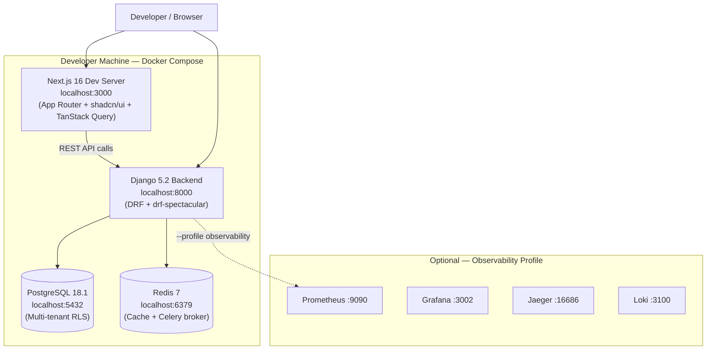
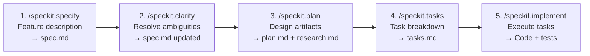
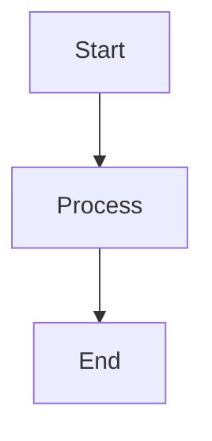

# Developer Onboarding Guide - Gravitea ERP

| Field | Value |
| --- | --- |
| **Audience** | New developers joining the Gravitea ERP project |
| **Version** | 1.1 |
| **Last Updated** | 2026-03-01 |
| **Status** | **Current — Features 001-025 Complete, Rust Acceleration Done, Vertical SaaS Research Phase** |

Welcome to the Gravitea ERP codebase. This guide gets you from zero to a running development environment and explains the key architectural decisions, module structure, and workflows you need to know.

---

## 1. Architecture Overview

Gravitea ERP is a **multi-tenant, offline-first ERP system** originally designed for SMB retail businesses (hardware stores, lumber yards, convenience stores). It runs as a Django + PostgreSQL backend with a **Rust/PyO3 acceleration layer** (9 native modules, specs 017-025), consumed by a Next.js web frontend (current development) and a planned Electron desktop client (production target for branch POS).

> **Strategic Context**: The project is currently in a research phase evaluating a pivot to **Vertical SaaS** targeting specific Argentine industry niches (see ADR-016). The MVP timeline (May 2026) is under review pending research outcomes.

### 1.1 System Diagram (Current — Docker Compose)



### 1.2 Dual-Environment Clarification

| Environment | Frontend | Backend | Database | Status |
|:------------|:---------|:--------|:---------|:-------|
| **Development (current)** | Next.js 16 dev server (:3000) | Docker Compose Django (:8000) | Local PostgreSQL 18.1 (:5432) | Active |
| **Production (planned)** | Electron desktop client | Google Cloud Run | Cloud SQL PostgreSQL 18.1 | Planned — MVP target under review (Vertical SaaS pivot research) |

> **Important**: The Next.js frontend is the **current development interface**. Electron is the **planned production POS client** for branch operations. Never present Electron as the current system.

### 1.3 Module Summary

| Module | App Directory | Status | Description |
|:-------|:-------------|:-------|:------------|
| **auth** | `backend/apps/auth/` | Complete | JWT RS256, RBAC, rate limiting, multi-tenant users |
| **core** | `backend/apps/core/` | Complete | TenantBoundModel, RLS, AES-256-GCM encryption, observability, health checks, tenant customization |
| **inventario** | `backend/apps/inventario/` | Complete | Products (encrypted barcode), StockMovement (immutable ledger), Suppliers (encrypted PII), PriceLists |
| **ventas** | `backend/apps/ventas/` | Complete | Customers (CUIT), SaleOrders (DRAFT→CONFIRMED→INVOICED), SaleOrderItems |
| **facturacion** | `backend/apps/facturacion/` | Complete | ARCA WSAA+WSFEv1, CAE lifecycle, CAEA offline, immutable Comprobantes, fiscal QR |
| **sync** | `backend/apps/sync/` | Complete | Push/Pull/Status APIs, SyncSession (vector clocks), PendingOperation |
| **frontend** | `frontend-prototype/` | Partial (Dev) | Next.js prototype — 9 routes, 52 source files |
| **Rust/PyO3** | `rust/gravitea-core/` | Complete | 9 native acceleration modules (crypto, compute, export, observability, security, sync, arca, validation) |
| **COMPRAS** | (planned) | Partial | Supplier model exists; purchase order workflow pending |
| **REPORTES** | (planned) | Contract defined | OpenAPI contract generated; Rust export engine available (export.rs, spec 020) |
| **Electron POS** | (planned) | Planned | Production desktop client for branches |

---

## 2. Environment Setup

> **Docker Compose is the only supported developer environment.** All services (PostgreSQL, Redis, Django, Next.js) run as containers. Do not use manual virtualenvs for local development.

### 2.1 Prerequisites

- Docker Desktop (Windows/Mac) or Docker Engine + Docker Compose v2 (Linux)
- Git
- A shell (bash/zsh on Mac/Linux; Git Bash or WSL2 on Windows)
- **Optional (for Rust development)**: Rust 1.93.1+ via `rustup`, Maturin 1.12.4+ (`pip install maturin`)

### 2.2 First-Time Setup

```bash
# 1. Clone the repository
git clone <repository-url>
cd GRAVITEA-ERP

# 2. Copy environment file (ask team lead for values)
cp backend/.env.example backend/.env

# 3. Start all services (default profile: postgres, redis, web, frontend)
docker compose up -d

# 4. Wait for services to be healthy (~30 seconds)
docker compose ps

# 5. Run database migrations
docker compose exec web python manage.py migrate

# 6. Seed the database with demo data
docker compose exec web python manage.py seed_all

# 7. Verify everything is working
docker compose exec web python manage.py check
```

### 2.3 Seed Commands

| Command | What it seeds |
|:--------|:-------------|
| `seed_data` | Base tenant, branch, users, roles |
| `seed_inventario` | Products, categories, suppliers, price lists, stock movements |
| `seed_ventas` | Customers, sale orders |
| `seed_facturacion` | ARCA credentials (test cert), PuntosDeVenta, draft comprobantes, fake CAEA |
| **`seed_all`** | **Runs all of the above in order** |

### 2.4 Accessing Services

| Service | URL | Notes |
|:--------|:----|:------|
| **Frontend (Next.js)** | http://localhost:3000 | Hot-reload dev server |
| **Backend API** | http://localhost:8000/api/v1/ | Django REST Framework |
| **Swagger UI** | http://localhost:8000/api/v1/schema/swagger-ui/ | Interactive API docs |
| **Django Admin** | http://localhost:8000/admin/ | Admin interface |
| **Health Check** | http://localhost:8000/health/ | Kubernetes probe endpoint |

**Demo credentials** (after `seed_all`):
- Email: `admin@gravitea-demo.com`
- Password: `admin123`

### 2.5 Optional Profiles

```bash
# Start with observability stack (Prometheus, Grafana, Jaeger, Loki)
docker compose --profile observability up -d

# Access Grafana at http://localhost:3002
# Access Jaeger at http://localhost:16686
# Access Prometheus at http://localhost:9090

# Start production frontend build (port 3001)
docker compose --profile prod up -d frontend-prod
```

### 2.6 Daily Development Workflow

```bash
# Start services
docker compose up -d

# Watch backend logs
docker compose logs -f web

# Apply new migrations after pulling
docker compose exec web python manage.py migrate

# Run a Django management command
docker compose exec web python manage.py <command>

# Open a Django shell
docker compose exec web python manage.py shell

# Stop all services
docker compose down
```

---

## 3. Module Map

### 3.1 Backend Module Status

| Module | Models | Views | URL Patterns | Test Files | Migrations |
|:-------|:-------|:------|:-------------|:-----------|:-----------|
| **auth** | 2 (Role, AppUser) | 5 | 7 | 2 | 3 |
| **core** | 6 (Tenant, Branch, TBM, TenantFieldDef, TenantModuleConfig, BusinessTemplate) | 2 | 2 | 13 | 3 |
| **inventario** | 8 (ProductCategory, Supplier, PriceList, Product, PriceHistory, CostHistory, StockMovement, StockSnapshot) | 8 | 7 | 6 | 6 |
| **ventas** | 3 (Customer, SaleOrder, SaleOrderItem) | 3 | nested routing | 12 | 3 |
| **facturacion** | 7 (ARCACredential, PuntoDeVenta, Comprobante, AlicIva, Tributo, CbteAsoc, CAEA) | 4 | 4 | 12 | 3 |
| **sync** | 2 (SyncSession, PendingOperation) | 4 | 5 | 6 | 5 |
| **Total** | **28** | **26+** | **~32** | **51** | **23** |

### 3.2 Frontend Module Status (frontend-prototype)

| Category | Count | Details |
|:---------|:------|:--------|
| **Page routes** | 9 | login, inventario, ventas, facturación, sync, health, auth-admin, root, protected-layout |
| **Feature components** | 22 | auth(4), facturacion(4), inventario(7), sync(3), ventas(2), shared(7) |
| **shadcn/ui components** | 9 | badge, button, card, dialog, input, separator, sonner, table, tabs |
| **Library files** | 3 | providers.tsx, auth-context.tsx, api-client.ts |
| **Custom hooks** | 2 | use-crud.ts, use-pagination.ts |
| **Total source files** | 52 | 48 TSX + 4 TS |

### 3.3 API Endpoint Summary

| Module | Approximate Endpoints | Key Actions |
|:-------|:---------------------|:------------|
| auth | ~18 | token, refresh, verify, logout, users CRUD, roles CRUD, branches |
| inventario | ~28 | products (+ /stock, /search), movements, categories (+ /tree), suppliers (+ /search), price-lists, history |
| ventas | ~16 | customers (+ soft delete), orders (+ /confirm, /authorize, /invoice), items |
| facturacion | ~16 | puntos-de-venta, credentials, comprobantes (+ /emitir, /qr, /authorize), caeas (+ /solicitar, /sin-movimiento) |
| sync | ~6 | sessions, push, pull, status |
| core | ~4 | field-definitions, module-config |
| health/schema | ~6 | live, ready, combined, spec, swagger, redoc |
| **Total** | **~94** | |

---

## 4. Spec-Driven Development Workflow

Gravitea uses a **spec-first** development approach. Every feature starts with a specification before any code is written.

### 4.1 The Speckit Pipeline



### 4.2 Specification Artifacts

Each feature in `specs/{feature-name}/` contains:

| File | Purpose |
|:-----|:--------|
| `spec.md` | User stories, functional requirements, success criteria |
| `plan.md` | Design decisions, architecture approach, phased implementation |
| `tasks.md` | Ordered task list with IDs (T001, T002, ...) and phase grouping |
| `research.md` | Technical research, references, implementation notes |
| `quickstart.md` | Fast-reference card for developers |

### 4.3 Feature Branch Convention

```bash
# Branch naming: {feature-number}-{feature-name}
git checkout -b 016-my-new-feature

# Commits follow conventional commits
git commit -m "feat(ventas): add customer credit limit validation"
git commit -m "fix(facturacion): correct CAEA period calculation"
git commit -m "test(sync): add conflict resolution edge cases"
git commit -m "docs(onboarding): add environment setup section"
```

**Note**: Feature branches 002–010 were pre-convention era. Numbered feature branches resume at 011.

### 4.4 Definition of Done

A feature is complete when:
- [ ] All tasks in `tasks.md` marked complete
- [ ] Tests written and passing (no skipped/disabled tests)
- [ ] Zero new test regressions
- [ ] Lint/type checks pass
- [ ] `Last Updated` date updated in any modified docs
- [ ] PR created against `develop` (or appropriate branch)

---

## 5. Key Conventions

### 5.1 TenantBoundModel — Every Entity is Tenant-Scoped

All business entities inherit from `TenantBoundModel` (except `Tenant` and `BusinessTemplate`):

```python
# Pattern: Always extend TenantBoundModel for business entities
class MyEntity(TenantBoundModel):
    name = models.CharField(max_length=255)
    # tenant_id is inherited automatically

# TenantBoundManager auto-filters by tenant_id — never bypassed accidentally
MyEntity.objects.all()          # filters by current tenant
MyEntity.all_objects.all()      # bypasses tenant filter (admin use only)
```

**Defense-in-Depth** (3 layers):
1. `TenantBoundManager` — ORM-level query filter
2. PostgreSQL RLS — database-level policy enforcement
3. `_validate_tenant_references()` — IDOR prevention on FK writes

### 5.2 Immutable Ledger Pattern

`StockMovement` and `Comprobante` are **append-only**. Never update or delete them. Corrections use counter-entries.

```python
# ✅ Correct: record a reversal movement
StockMovement.objects.create(
    product=product,
    quantity_delta=-original.quantity_delta,  # negative to reverse
    movement_type=MovementType.ADJUSTMENT,
    notes=f"Reversal of movement {original.id}"
)

# ❌ Wrong: never do this
original.quantity_delta = 0  # FORBIDDEN
original.save()
```

ViewSets enforce this via HTTP: `StockMovementViewSet` allows only GET + POST (no PUT/PATCH/DELETE).

### 5.3 Problem+JSON Error Responses (RFC 7807/9457)

All API errors return structured Problem+JSON:

```json
{
  "type": "https://gravitea.io/errors/validation-error",
  "title": "Validation Error",
  "status": 422,
  "detail": "The quantity_delta field must be non-zero.",
  "instance": "/api/v1/movements/"
}
```

Never return raw DRF error dicts in custom views. Always use the configured `problem_detail_exception_handler`.

### 5.4 Diagrams — Mermaid Only

All diagrams in documentation must use **Mermaid format**. ASCII art is not accepted.

```markdown

```

### 5.5 JWT Claims — Custom Payload

Tokens include custom claims beyond the standard:

```json
{
  "user_id": "uuid",
  "tenant_id": "uuid",
  "branch_id": "uuid",
  "role_id": "uuid",
  "permissions": ["inventario.view", "ventas.create", "facturacion.emitir"]
}
```

Always use `RS256` algorithm. `HS256`/`HS384`/`HS512` are explicitly forbidden.

### 5.6 Encrypted Fields

PII fields use `EncryptedCharField`/`EncryptedTextField` (AES-256-GCM) with `BlindIndexField` for equality search:

```python
# Models with encrypted PII
class Supplier(TenantBoundModel):
    tax_id = EncryptedCharField(max_length=50)
    tax_id_hash = BlindIndexField()  # HMAC-SHA256 for search
    email = EncryptedCharField(max_length=254)
    email_hash = BlindIndexField()

# Search via blind index
Supplier.objects.filter(tax_id_hash=compute_blind_index(search_term))
```

### 5.7 Rust/PyO3 Acceleration Layer

CPU-bound hot-paths are accelerated via 9 Rust modules compiled with PyO3 0.28. Every Rust function has a Python fallback — if the Rust wheel is missing, the system falls back to pure Python with a warning log.

```python
# Dispatcher pattern (all *_engine.py files follow this):
try:
    import gravitea_rust
    _USE_RUST = True
except ImportError:
    _USE_RUST = False
    logger.warning("gravitea_rust not available, using Python fallback")

def my_function(*args):
    if _USE_RUST:
        return gravitea_rust.my_function(*args)
    return _my_function_python(*args)
```

**Building the Rust wheel** (WSL2):
```bash
VIRTUAL_ENV=$(pwd)/backend/venv-wsl maturin develop \
  --manifest-path rust/gravitea-core/Cargo.toml --release
```

**Running Rust tests**:
```bash
# Cargo tests (Rust-side)
cd rust/gravitea-core && cargo test

# Pytest integration tests (Python-side)
cd backend && venv-wsl/bin/python -m pytest tests/rust_integration/ \
  --confcutdir=tests/rust_integration --no-cov -q
```

### 5.8 Tenant Customization

Tenants can add custom fields to entities without schema migrations:

```python
# custom_data is a JSONField on Product, Customer, Supplier, SaleOrder
# TenantFieldDefinition describes valid fields for each entity type
# CustomFieldsMixin handles validation, defaults, and merge updates
```

---

## 6. Directory Structure

```
GRAVITEA-ERP/
├── CLAUDE.md                          # AI agent instructions (Single Source of Truth)
├── docker-compose.yml                 # Single root Compose file (all profiles)
├── backend/
│   ├── gravitea/
│   │   ├── settings/
│   │   │   ├── base.py                # ~550 lines — all shared config
│   │   │   ├── development.py         # Dev overrides (DEBUG=True, etc.)
│   │   │   ├── test.py                # Test settings (test DB, fast password hasher)
│   │   │   └── production.py          # Prod settings (GCP Secret Manager, etc.)
│   │   ├── urls.py                    # Root URL routing
│   │   ├── wsgi.py / asgi.py
│   ├── apps/
│   │   ├── auth/                      # JWT, users, roles, branches
│   │   │   ├── models.py              # Role, AppUser
│   │   │   ├── views.py               # CustomTokenObtainPairView, UserViewSet, etc.
│   │   │   ├── urls.py
│   │   │   ├── jwt.py                 # CustomTokenObtainPairSerializer
│   │   │   └── permissions.py         # Custom DRF permissions
│   │   ├── core/                      # Shared infrastructure
│   │   │   ├── models/
│   │   │   │   ├── tenant.py          # Tenant (root entity)
│   │   │   │   ├── branch.py          # Branch (TenantBoundModel)
│   │   │   │   ├── mixins.py          # TenantBoundModel, TimestampedModel, SoftDeleteModel
│   │   │   │   └── customization.py   # TenantFieldDefinition, TenantModuleConfig, BusinessTemplate
│   │   │   ├── encryption/
│   │   │   │   ├── fields.py          # EncryptedCharField, EncryptedTextField, BlindIndexField
│   │   │   │   └── utils.py           # AES-256-GCM primitives
│   │   │   ├── observability/         # 11 files: metrics, tracing, logging, alerts, uptime, business metrics
│   │   │   ├── middleware/
│   │   │   │   ├── tenant_context.py  # TenantContextMiddleware (sets app.current_tenant_id)
│   │   │   │   └── trace_middleware.py
│   │   │   ├── health/                # Kubernetes probes (/health/live, /health/ready)
│   │   │   ├── fields.py              # PostgresEnumField, MoneyField (DecimalField 16,4)
│   │   │   ├── pagination.py          # StandardCursorPagination (PAGE_SIZE=100)
│   │   │   ├── authentication.py      # TenantAwareJWTAuthentication
│   │   │   ├── secrets.py             # GCP Secret Manager integration
│   │   │   └── validators.py          # PasswordComplexityValidator
│   │   ├── inventario/                # Products, stock, categories, suppliers
│   │   │   ├── models.py              # 8 models
│   │   │   ├── views.py               # 8 ViewSets
│   │   │   ├── urls.py
│   │   │   ├── serializers.py
│   │   │   └── services.py
│   │   ├── ventas/                    # Customers, orders, items
│   │   │   ├── models.py              # 3 models
│   │   │   ├── views.py               # 3 ViewSets
│   │   │   ├── urls.py
│   │   │   ├── serializers.py
│   │   │   └── services.py
│   │   ├── facturacion/               # ARCA electronic invoicing
│   │   │   ├── models.py              # 7 models
│   │   │   ├── views.py               # 4 ViewSets
│   │   │   ├── urls.py
│   │   │   ├── serializers.py
│   │   │   ├── arca/                  # WSAA + WSFEv1 SOAP clients
│   │   │   ├── constants.py           # CbteTipo, DocTipo, CondicionIVA enums
│   │   │   ├── validators.py          # Amount validation
│   │   │   └── qr.py                  # Fiscal QR code generation
│   │   └── sync/                      # Offline sync
│   │       ├── models.py              # SyncSession, PendingOperation
│   │       ├── views.py               # SyncSessionViewSet, SyncPushView, SyncPullView, SyncStatusView
│   │       └── urls.py
│   ├── database/sql/                  # PostgreSQL RLS policies
│   │   ├── facturacion_rls.sql
│   │   └── ventas_rls.sql
│   └── tests/                         # 111+ test files, ~2,500+ test functions
│       ├── conftest.py                # Root fixtures (tenant, branch, users, API clients)
│       ├── factories.py               # Model factories
│       ├── constants.py               # Test constants
│       ├── fixtures/                  # 8 fixture files (cache, docker_models, fuzz, etc.)
│       ├── auth/                      # Auth-specific tests
│       ├── core/                      # Core module tests
│       ├── inventario/                # Inventory tests
│       ├── ventas/                    # Sales tests
│       ├── facturacion/               # Invoicing tests
│       ├── sync/                      # Sync tests
│       ├── security/                  # OWASP + tenant isolation tests
│       └── integration/               # Cross-module integration tests
├── frontend-prototype/
│   ├── src/
│   │   ├── app/                       # Next.js App Router
│   │   │   ├── layout.tsx
│   │   │   ├── login/page.tsx
│   │   │   └── (protected)/           # Auth-gated routes
│   │   │       ├── layout.tsx
│   │   │       ├── inventario/page.tsx
│   │   │       ├── ventas/page.tsx
│   │   │       ├── facturacion/page.tsx
│   │   │       ├── sync/page.tsx
│   │   │       ├── health/page.tsx
│   │   │       └── auth-admin/page.tsx
│   │   ├── components/
│   │   │   ├── auth/                  # 4 components
│   │   │   ├── inventario/            # 7 components (+ dynamic-fields.tsx)
│   │   │   ├── ventas/                # 2 components
│   │   │   ├── facturacion/           # 4 components
│   │   │   ├── sync/                  # 3 components
│   │   │   ├── ui/                    # 9 shadcn/ui components
│   │   │   └── shared/                # 7 shared components
│   │   ├── lib/
│   │   │   ├── providers.tsx          # TanStack Query + Auth providers
│   │   │   ├── auth-context.tsx       # JWT React Context (in-memory)
│   │   │   ├── api-client.ts          # axios client with 401 interceptor
│   │   │   └── utils.ts
│   │   └── hooks/
│   │       ├── use-crud.ts            # Generic CRUD hook
│   │       └── use-pagination.ts      # Cursor-based pagination hook
├── rust/                              # Rust/PyO3 acceleration layer (specs 017-025)
│   └── gravitea-core/
│       ├── Cargo.toml                 # PyO3 0.28, serde, aes-gcm, regex, etc.
│       └── src/
│           ├── lib.rs                 # PyO3 module registration
│           ├── crypto.rs              # AES-256-GCM + HMAC-SHA256 (spec 018)
│           ├── compute.rs             # Fiscal compute: IVA, CUIT, stock (spec 019)
│           ├── export.rs              # CSV/XLSX generation (spec 020)
│           ├── observability.rs       # Metrics hot-path (spec 021)
│           ├── security.rs            # SSRF validation pipeline (spec 022)
│           ├── sync.rs                # Conflict merge engine (spec 023)
│           ├── arca.rs                # CAEA batch builder (spec 024)
│           └── validation.rs          # Custom field validator (spec 025)
├── specs/                             # Feature specifications
│   ├── 015-blueprint-docs-overhaul/
│   │   ├── spec.md
│   │   ├── plan.md
│   │   ├── tasks.md
│   │   └── research.md
│   └── ...
├── skills/                            # AI agent skills (custom)
│   ├── gravitea-auth/SKILL.md
│   ├── gravitea-tenant/SKILL.md
│   ├── gravitea-testing/SKILL.md
│   ├── gravitea-invoice/SKILL.md
│   └── ...
├── claudedocs/                        # AI-generated documentation
│   ├── 015-codebase-facts.md          # Codebase facts (generated by RESEARCHER agent)
│   └── ...
└── Docs/
    └── Project Blueprint/             # This document and peer documents
```

---

## 7. Running Tests

### 7.1 Standard Test Run (Docker)

All tests run inside the Docker container against the test database profile:

```bash
# Run the full test suite
docker compose exec web python -m pytest tests/ --tb=short -q

# Run tests for a specific module
docker compose exec web python -m pytest tests/auth/ -v
docker compose exec web python -m pytest tests/ventas/ -v
docker compose exec web python -m pytest tests/facturacion/ -v

# Run by marker
docker compose exec web python -m pytest -m "security" -v
docker compose exec web python -m pytest -m "unit" -q
docker compose exec web python -m pytest -m "integration" -v

# Run with coverage
docker compose exec web python -m pytest tests/ --cov=apps --cov-report=term-missing -q
```

### 7.2 Test Markers

| Marker | Description | Speed |
|:-------|:------------|:------|
| `@pytest.mark.unit` | Fast tests, no external dependencies | Fast |
| `@pytest.mark.integration` | Requires database access | Medium |
| `@pytest.mark.security` | Security-focused (tenant isolation, OWASP) | Medium |
| `@pytest.mark.auth` | Authentication-specific | Fast/Medium |
| `@pytest.mark.tenant` | Tenant isolation tests | Medium |
| `@pytest.mark.slow` | Long-running tests | Slow |
| `@pytest.mark.docker` | Requires a running Docker environment | Slow (skipped by default) |

**Note**: `@pytest.mark.docker` tests are skipped by default unless `RUN_DOCKER_TESTS=1` is set.

### 7.3 Test Suite Metrics (as of feature 025)

| Metric | Value |
|:-------|:------|
| Total test functions | ~2,500+ |
| Test files | 111+ (including Rust integration tests) |
| Rust integration tests | 131 (cargo tests + pytest tests across specs 017-025) |
| Last known result | ~2,500+ passed, 0 new regressions |
| Test directories | auth, core, inventario, ventas, facturacion, sync, security, integration, contract, docker, fuzz, load, performance, property, smoke, tasks, traceability, unit, **rust_integration** |

### 7.4 Key Fixtures (conftest.py)

```python
# Root fixtures available to all tests
tenant            # Tenant instance
branch            # Branch for the test tenant
admin_user        # AppUser with admin role
api_client        # DRF APIClient authenticated as admin_user
other_tenant      # Separate Tenant (for cross-tenant isolation tests)
other_tenant_client  # APIClient for other_tenant (own instance — do not share)
```

**Critical rule**: `other_tenant_client` must be its own `APIClient()` instance. Sharing a client instance causes credential overwrites between tenants.

### 7.5 External Test Runner (for AI Agents)

AI agents working on this codebase should use the external test runner script to minimize token consumption:

```bash
# Run tests externally (saves output to Docs/Tests/{name}.status + .summary + .log)
bash scripts/run-tests-external.sh "python -m pytest tests/ --tb=short -q" "regression"

# Read summary only (not the full log)
cat Docs/Tests/regression.summary
```

This script runs tests detached from Claude's context window, keeping output consumption minimal.

---

## 8. Feature Status Dashboard

### 8.1 Backend Module Status

| Module | Models | Views | Migrations | Tests | Status |
|:-------|:-------|:------|:-----------|:------|:-------|
| auth | 2 | 5 | 3 | 2 files | ✅ Complete |
| core | 6 | 2 | 3 | 13 files | ✅ Complete |
| inventario | 8 | 8 | 6 | 6 files | ✅ Complete |
| ventas | 3 | 3 | 3 | 12 files | ✅ Complete |
| facturacion | 7 | 4 | 3 | 12 files | ✅ Complete |
| sync | 2 | 4 | 5 | 6 files | ✅ Complete |
| **Rust/PyO3** | 9 modules | 9 dispatchers | — | 131 tests | ✅ Complete (specs 017-025) |
| **COMPRAS** | — | — | — | — | Partial (Supplier model only) |
| **REPORTES** | — | — | — | — | Contract defined (Rust export engine available) |
| **Electron POS** | — | — | — | — | Planned |

**Total migrations**: 23 (auth: 3, core: 3, inventario: 6, ventas: 3, facturacion: 3, sync: 5)

### 8.2 Implemented Feature Branches

| Branch | Status | Key Deliverables |
|:-------|:-------|:----------------|
| `001-sal-invo-inve-backend` | ✅ Merged | Complete backend — Ventas, ARCA, Inventario, Auth, Sync, Core |
| `011-backend-devops-coherence` | ✅ Merged | Docker consolidation, 13 refactoring fixes, 4 analysis reports |
| `012-prototype-frontend` | ✅ Merged | Next.js 16 prototype, seed commands, 9 routes, 52 source files |
| `013-e2e-frontend-testing` | ✅ Merged | Playwright E2E tests, 3 bug fixes (F-015, F-016, F-017) |
| `014-tenant-customization` | ✅ Merged | JSONB custom fields, TenantFieldDefinition/ModuleConfig/BusinessTemplate |
| `015-blueprint-docs-overhaul` | ✅ Merged | Documentation overhaul (12 Project Blueprint documents) |
| `017-rust-bootstrap` | ✅ Merged | Rust/PyO3/Maturin toolchain bootstrap, `hello()` + `GraviteaError` |
| `018-rust-crypto` | ✅ Merged | AES-256-GCM + HMAC-SHA256 blind index via Rust (8.7x speedup) |
| `019-rust-fiscal-compute` | ✅ Merged | IVA, CUIT, stock aggregation via Rust (2.1x-4.4x speedup) |
| `020-rust-data-export` | ✅ Merged | CSV/XLSX generation via Rust with Python fallback |
| `021-rust-observability-hotpath` | ✅ Merged | Metrics normalize_path + sanitize via 24 compiled Regex (2.6x) |
| `022-ssrf-validation-pipeline` | ✅ Merged | SSRF validation with 83-entry adversarial corpus |
| `023-rust-sync-conflict` | ✅ Merged | JSON merge engine for conflict resolution |
| `024-rust-arca-batch` | ✅ Merged | CAEA batch builder via serde JSON construction |
| `025-rust-custom-field-validator` | ✅ Merged | Custom field type validation for 6 field types |

### 8.3 MVP Remaining Items (Target: Under Review — Vertical SaaS Pivot Research)

> The original MVP target (May 2026) is under review as the project evaluates a pivot to Vertical SaaS targeting specific Argentine industry niches (see ADR-016).

| Item | Status | Priority |
|:-----|:-------|:---------|
| **Vertical SaaS research** | 🔄 In progress | P0 |
| COMPRAS — Full purchase order workflow | Partial | P1 |
| REPORTES — Sales, stock, accounting reports | Contract defined | P1 |
| Electron POS desktop client | Planned | P0 |
| GCP deployment (Cloud Run + Cloud SQL) | Planned | P0 |
| CI/CD pipeline | Planned | P1 |

---

## 9. AI Agent Context

### 9.1 CLAUDE.md — Single Source of Truth

The project root `CLAUDE.md` (aliased as `AGENTS.md`) is the **authoritative configuration file** for all AI agents working on this codebase. It defines:
- Auto-invoke rules for skills (which skill loads for which file pattern)
- Available skills and their triggers
- Directory structure
- Security philosophy and critical patterns

Read `CLAUDE.md` at the start of any AI-assisted session.

### 9.2 Skills System

Skills provide on-demand context and patterns for AI agents. They live in two locations:

| Location | Purpose | Git-tracked |
|:---------|:--------|:-----------|
| `skills/` | Custom project skills | Yes |
| `.agents/skills/` | Marketplace skills (agentskills.io) | Yes |
| `.claude/skills/` | Generated by `setup.sh` for Claude Code | No (generated) |

**Available skills**:

| Skill | Trigger |
|:------|:--------|
| `gravitea-auth` | Editing `apps/auth/`, JWT, rate limiting |
| `gravitea-tenant` | Tenant models, cross-tenant queries, IDOR |
| `gravitea-inventory` | `apps/inventario/`, stock movements, ledger |
| `gravitea-invoice` | `apps/facturacion/`, ARCA, CAE, fiscal QR |
| `gravitea-sync` | `apps/sync/`, offline sync, conflict resolution |
| `gravitea-testing` | Writing tests, fixtures, markers |
| `gravitea-encryption` | Encrypted fields, blind indexes, PII |
| `gravitea-observability` | Metrics, tracing, label sanitization |
| `gravitea-docker` | Dockerfile, docker-compose.yml |
| `django-expert` | Models, views, migrations, ORM optimization |
| `skill-creator` | Creating new skills |

**Auto-invoke**: When editing files matching a skill's trigger pattern, Claude Code loads the skill automatically.

### 9.3 Serena Memories

Cross-session context is persisted via Serena MCP memories in `.serena/memories/`. These contain:
- Implementation decisions and rationale per feature branch
- Bug fixes and their root causes
- Session summaries and checkpoints

Key memory prefixes: `session_2026-02-{date}_{feature}_...`

Search memories with:
```
list_memories()
read_memory("session_2026-02-21_015_implement_design")
```

### 9.4 Agent Orchestration

For complex multi-step tasks, this project uses **Agent Teams** (Claude Code's multi-agent orchestration):
- Team lead spawns specialized agent teammates (RESEARCHER, WRITER-A, WRITER-B, etc.)
- Tasks are coordinated via the `TaskCreate`/`TaskUpdate`/`TaskList` tools
- Agent instruction files live in `Docs/Temp-prompting/`
- Full orchestration documentation: `claudedocs/008-multi-agent-orchestration-architecture.md`

### 9.5 GGA — Gentleman Guardian Angel

The project uses GGA for automated AI code review via git pre-commit hooks:

```bash
# Check GGA configuration
gga config

# Run manual review on staged files
gga run

# Install pre-commit hook
gga install
```

GGA enforces: security patterns, tenant isolation, immutable ledger, type hints, test coverage.
