# Development Workflow & Team Practices - Gravitea ERP

## 1. Metadata
| Field | Value |
| --- | --- |
| **Owner** | Tech Lead |
| **Version** | 1.3 |
| **Last Updated** | 2026-03-01 |
| **Status** | **Operational — Features 001-025 Complete, Rust Acceleration Done, Vertical SaaS Research Phase** |
| **Methodology** | Spec-Driven Development (speckit) + Agile |

### Current Technical Stack (March 2026)
| Component | Version | Status |
|:-----------|:--------|:-------|
| **Python** | 3.14.3 | ✅ Production |
| **Django** | 5.2.x | ✅ Production |
| **DRF** | 3.15+ | ✅ Production |
| **PostgreSQL** | 18.x | ✅ Production |
| **Redis** | 7.x | ✅ Production |
| **Rust** | 1.93.1 | ✅ Acceleration Layer (9 modules, specs 017-025) |
| **PyO3** | 0.28 | ✅ Rust-Python FFI bridge |
| **Maturin** | 1.12.4 | ✅ Rust wheel builder |
| **Docker Compose** | Latest | ✅ Production |
| **pytest** | Latest | ✅ ~2,500+ test functions |
| **Next.js** | 16.1.6 (App Router) | ✅ Frontend Prototype |
| **TypeScript** | Latest (strict) | ✅ Frontend |

### Current Quality Metrics (verified — March 2026, post 025 + API audit)
| Metric | Value | Target | Status |
|:--------|:------|:-------|:-------|
| **Test Functions** | ~2,500+ | — | ✅ |
| **Passing Tests** | ~2,500+ passed, 0 new regressions | — | ✅ |
| **Rust Integration Tests** | 131 (cargo + pytest, specs 017-025) | — | ✅ |
| **API Endpoints** | 137 operations across 79 paths | — | ✅ |
| **OpenAPI Contracts** | 9 contracts, 154 schemas | — | ✅ |
| **Database Migrations** | 23 total (auth:3, core:3, inventario:6, ventas:3, facturacion:3, sync:5) | — | ✅ |
| **Lint Errors** | 0 | 0 | ✅ |
| **Test Files** | 111+ | — | ✅ |

> **Metric source**: Run `scripts/run-tests-external.sh` and read `Docs/Tests/*.summary` for verified current counts.

## 2. Software Development Life Cycle (SDLC)

### 2.1 Spec-Driven Development Workflow (speckit)

All features follow the **speckit** workflow — specification artifacts are created before implementation begins:

```mermaid
flowchart LR
    subgraph "Planning Phase"
        SPECIFY["speckit.specify\n(feature description → spec.md)"]
        CLARIFY["speckit.clarify\n(resolve ambiguities)"]
        PLAN["speckit.plan\n(spec.md → plan.md + design docs)"]
        TASKS["speckit.tasks\n(plan.md → tasks.md)"]
        ANALYZE["speckit.analyze\n(cross-artifact consistency check)"]
    end

    subgraph "Implementation Phase"
        IMPLEMENT["speckit.implement\n(tasks.md → code)"]
    end

    subgraph "Artifacts (specs/NNN-feature-name/)"]
        SPEC["spec.md — User stories, requirements, edge cases"]
        PLAN["plan.md — Architecture decisions, component design"]
        TASKS_FILE["tasks.md — Numbered, dependency-ordered tasks"]
    end

    SPECIFY --> CLARIFY --> PLAN --> TASKS --> ANALYZE --> IMPLEMENT
    SPECIFY --> SPEC
    PLAN --> PLAN
    TASKS --> TASKS_FILE
```

**Speckit artifacts location**: `specs/NNN-feature-name/` (e.g., `specs/015-blueprint-docs-overhaul/`).
**Command sequence**: `specify → clarify → plan → tasks → analyze → implement`.

### 2.2 Integration and Deployment Flow (CI/CD Pipeline)

```mermaid
flowchart LR
    subgraph "Local Dev"
        Code[Coding] --> Commit
        Commit --> Push
    end

    subgraph "Continuous Integration (Planned — GitHub Actions)"
        Push --> Build[Build & Lint]
        Build --> RustBuild[Build Rust Wheel\nMaturin + PyO3 0.28]
        RustBuild --> UnitTests[Unit Tests\n~2500+ tests]
        UnitTests --> SecScan[Security Scan]
    end

    subgraph "Continuous Delivery (Planned)"
        SecScan -->|Success| BuildDocker[Build Docker Image\nmulti-stage: rust-builder + app]
        BuildDocker --> PushReg[Push Artifact Registry]
        PushReg --> DeployStaging[Deploy to Cloud Run Staging]
    end

    subgraph "Release (Planned — Manual Trigger)"
        DeployStaging -->|Approve| DeployProd[Deploy to Production]
    end
```



> **Current state**: CI/CD pipeline is planned. Local development uses Docker Compose with the external test runner for quality gates.

## 3. Branching Strategy (Git Strategy)

### 3.1 Feature Branch Naming Convention

Branches follow a **numbered sequential naming convention**:

```
{NNN}-{descriptive-slug}
```

Examples:
- `001-sal-invo-inve-backend` — Sale orders, invoicing, inventory backend
- `011-backend-devops-coherence` — DevOps improvements
- `012-prototype-frontend` — Next.js prototype
- `015-blueprint-docs-overhaul` — Documentation overhaul
- `017-rust-bootstrap` through `025-rust-custom-field-validator` — Rust/PyO3 acceleration layer

**Rules**:
- `main`: Protected. Represents production/staging state.
- Feature branches: Created from the previous feature branch or `develop` as appropriate.
- Branches 001-014 used temporal numbers; formal spec-driven convention started at 001 and continues sequentially.
- Hotfixes: `fix/short-description` format.

### 3.2 Git Flow


## 4. Quality Standards (Quality Gates)

### 4.1 Backend (Python/Django)
*   **Linter**: `Ruff` (strict configuration).
*   **Formatter**: `Black`.
*   **Type Checking**: `mypy` in strict mode.
*   **Testing**: `pytest` with minimum 80% coverage on business logic (`services/`).
*   **Security**: `bandit` for security scanning.
*   **Pre-commit hooks**: GGA (Gentleman Guardian Angel) AI code review on staged files.

### 4.2 Frontend (React/Next.js)
*   **Linter**: `ESLint` with accessibility and hooks rules.
*   **Formatter**: `Prettier`.
*   **Type Checking**: TypeScript `strict: true`. No `any` allowed.
*   **Stack**: Next.js 16.1.6 (App Router) + shadcn/ui + TanStack Query v5 + Tailwind CSS 4.

### 4.3 Definition of Done
A task is considered complete when:
1. [ ] Code merged to `main` (or feature branch ready for merge).
2. [ ] CI pipeline green (when implemented).
3. [ ] DB migrations applied and tested.
4. [ ] Tests pass: `scripts/run-tests-external.sh` shows 0 new failures.
5. [ ] Documentation updated (if architecture changes occurred).
6. [ ] Speckit tasks marked as completed.

## 5. Local Development Environment

The goal is `Local == Prod`. Docker Compose orchestrates all services via a single root `docker-compose.yml` with profiles.

### 5.1 Quick Start

```bash
# 1. Start core services (backend + frontend + db + cache)
docker compose up

# 2. Seed data
docker compose exec web python manage.py seed_all

# 3. Run tests
scripts/run-tests-external.sh pytest

# 4. Access services
# Backend API: http://localhost:8000/api/v1/
# API Docs: http://localhost:8000/api/v1/schema/swagger-ui/
# Frontend: http://localhost:3000
# Django Admin: http://localhost:8000/admin/
```

### 5.2 Current Local Services

| Service | Port | Status | Purpose |
|---------|------|--------|---------|
| `web` | 8000 | ✅ Running | Django REST API (dev server) |
| `postgres` | 5432 | ✅ Running | PostgreSQL 18 |
| `redis` | 6379 | ✅ Running | Cache + Celery broker |
| `frontend` | 3000 | ✅ Running | Next.js dev server (hot reload) |
| `frontend-prod` | 3001 | opt (`--profile prod`) | Next.js production build |

### 5.3 Observability Stack (Optional)

```bash
# Start with full observability stack
docker compose --profile observability up

# Access
# Grafana:    http://localhost:3002 (admin/admin)
# Prometheus: http://localhost:9090
# Jaeger:     http://localhost:16686
```

### 5.4 Test Environment

```bash
# Start isolated test environment
docker compose --profile test up

# Test DB: postgres-test (:5433)
# Test Django: web-test (:8001)
```

### 5.5 Seed Commands

```bash
# Full data seed (all modules)
docker compose exec web python manage.py seed_all

# Individual seed commands
docker compose exec web python manage.py seed_data        # Core tenants/users
docker compose exec web python manage.py seed_inventario  # Products/stock
docker compose exec web python manage.py seed_ventas      # Orders/customers
docker compose exec web python manage.py seed_facturacion # ARCA data/comprobantes
```

**Demo credentials** (after `seed_all`): `admin@gravitea-demo.com` / `admin123`

### 5.6 WSL/Windows Notes

For WSL2 environments (Linux running on Windows):
- Use the **WSL venv** for direct pytest execution: `backend/venv-wsl/bin/python -m pytest`
- WSL venv: Python 3.14.3, full parity with project venv minus `pywin32`.
- **Rust toolchain**: Rust 1.93.1 via `rustup`, Maturin 1.12.4 via pip in venv-wsl. Rebuild Rust wheel after code changes: `VIRTUAL_ENV=$(pwd)/backend/venv-wsl maturin develop --manifest-path rust/gravitea-core/Cargo.toml --release`
- This is an **AI agent workaround only** — human developers should use Docker Compose.

## 6. External Test Runner (for AI Agents)

`scripts/run-tests-external.sh` is a detached pytest runner that provides **96% token reduction** by writing output to summary files instead of stdout.

### 6.1 Usage

```bash
# Run full test suite (background, invisible)
scripts/run-tests-external.sh pytest

# Run specific tests
scripts/run-tests-external.sh pytest tests/auth/ -v

# Run with visible output (Windows Terminal tab)
scripts/run-tests-external.sh --visible pytest tests/

# Run in foreground
scripts/run-tests-external.sh --fg pytest -k "test_tenant_isolation"
```

### 6.2 Output Files

| File | Content | Size |
|------|---------|------|
| `Docs/Tests/{name}.status` | 1 line: PASSED/FAILED + summary | ~50 chars |
| `Docs/Tests/{name}.summary` | ~12 lines: counts, failures | ~400 chars |
| `Docs/Tests/{name}.log` | Full output (grep-only, never read whole) | varies |

### 6.3 Reading Results

```bash
# Check status (always do this first)
cat Docs/Tests/latest.status

# Read summary (12 lines)
cat Docs/Tests/latest.summary

# Grep failures from full log
grep "FAILED\|ERROR" Docs/Tests/latest.log
```

**Policy**: AI agents MUST use this script for all test execution. Never read `.log` files in full.

## 7. AI Agent Skills Architecture

### 7.1 Skills Overview

Skills provide on-demand context for AI agents working with the codebase. Located in `skills/` directory with auto-invoke triggers defined in `CLAUDE.md`.

```
skills/
├── gravitea-auth/SKILL.md          # JWT, rate limiting
├── gravitea-tenant/SKILL.md        # Multi-tenant isolation
├── gravitea-invoice/SKILL.md       # ARCA invoicing (1,138 lines)
├── gravitea-testing/SKILL.md       # pytest patterns
├── gravitea-inventory/SKILL.md     # Products, stock
├── gravitea-sync/SKILL.md          # Offline sync
├── gravitea-observability/SKILL.md # Prometheus, tracing
├── gravitea-encryption/SKILL.md    # AES-256-GCM
├── gravitea-docker/SKILL.md        # Docker Compose
├── django-expert/SKILL.md          # Django 5.2 patterns
└── skill-creator/SKILL.md          # Create new skills
```

### 7.2 Auto-Invoke Triggers (Key Examples)

| File Pattern | Skill Invoked |
|-------------|--------------|
| `apps/auth/**` | `gravitea-auth` |
| `apps/core/models/**` | `gravitea-tenant` |
| `apps/facturacion/**` | `gravitea-invoice` |
| `tests/**` | `gravitea-testing` |
| `**/models.py` | `django-expert` |
| `docker-compose*.yml` | `gravitea-docker` |
| `skills/**/SKILL.md` | `skill-creator` |

### 7.3 Serena Memories

Cross-session context is stored in `.serena/memories/` (60+ files) and Engram (`~/.engram/engram.db`). Key memories document:
- Completed feature implementations (001-025).
- Rust/PyO3 acceleration decisions and benchmarks (specs 017-025).
- Architecture decisions and debugging learnings.
- Test fix patterns and known edge cases.

### 7.4 Agent Teams (Multi-Agent Orchestration)

For complex features (e.g., Rust acceleration specs 017-025), this project uses **Agent Teams** — Claude Code's multi-agent orchestration:
- **TeamCreate** spawns a team with lead + specialized teammates (RUST-EXPERT, SECURITY, QA, etc.)
- Tasks coordinated via `TaskCreate`/`TaskUpdate`/`TaskList` tools
- Teammates run in parallel via tmux split panes on WSL2
- Agent instruction files in `Docs/Temp-prompting/{spec-number}/`
- Full documentation: `claudedocs/008-multi-agent-orchestration-architecture.md`

## 8. Definition of Done

A feature is considered complete when:
1. [ ] All speckit tasks (`tasks.md`) marked completed.
2. [ ] Code merged to feature branch, ready for PR to `main`.
3. [ ] Tests pass: `scripts/run-tests-external.sh` shows 0 new failures.
4. [ ] Blueprint documents updated if architecture changed.
5. [ ] Serena memories updated with key learnings.
6. [ ] No new lint errors.
