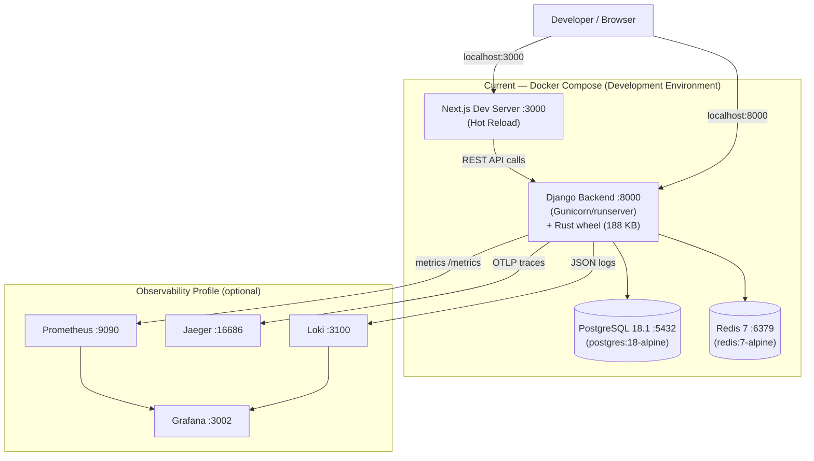
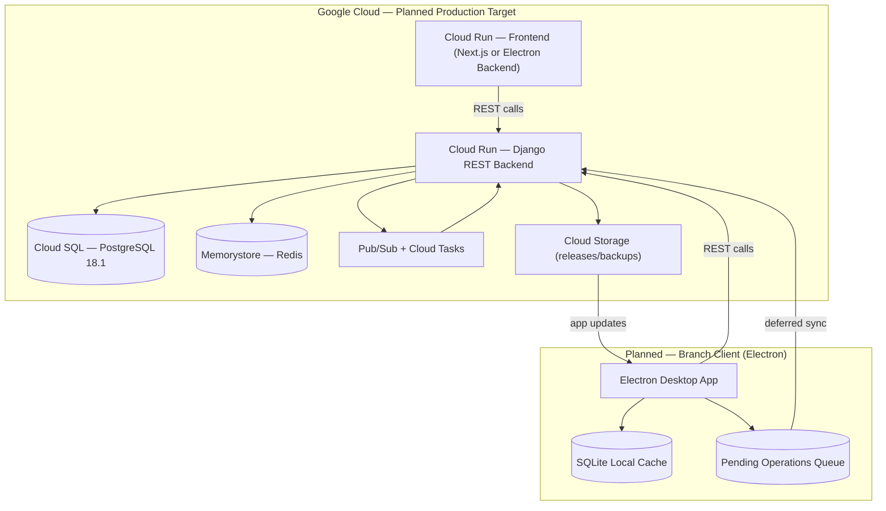
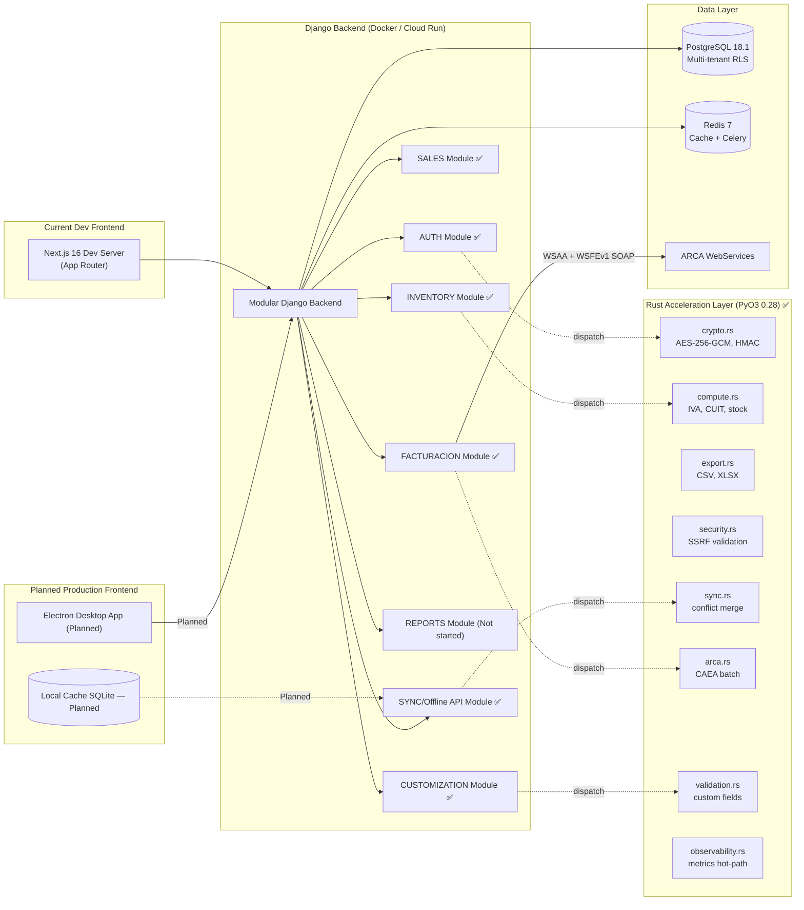
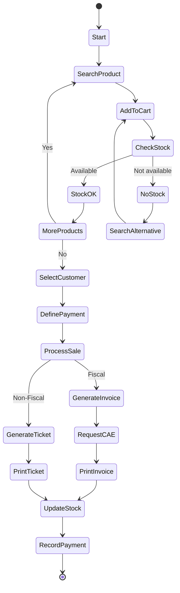
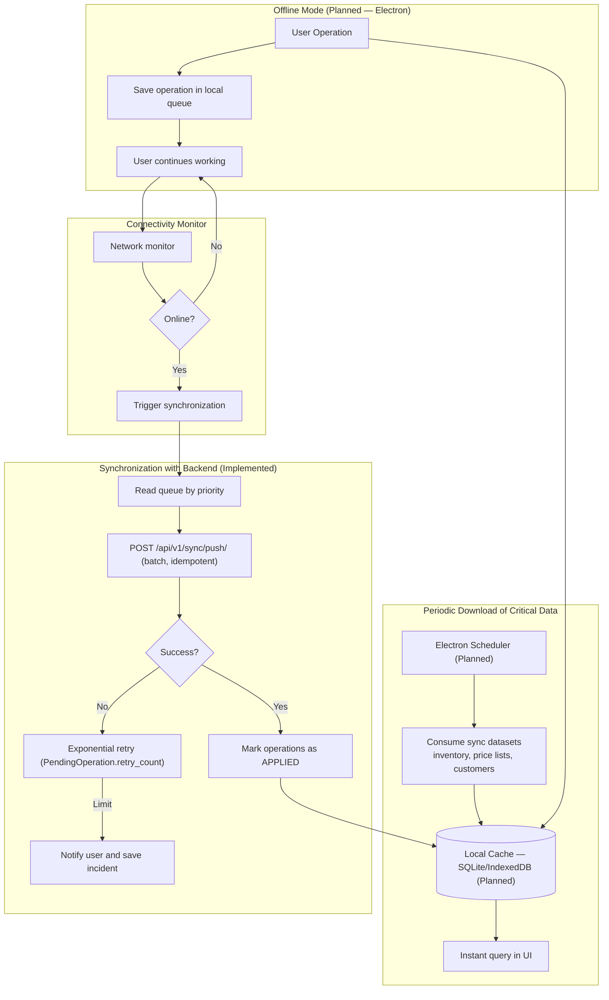
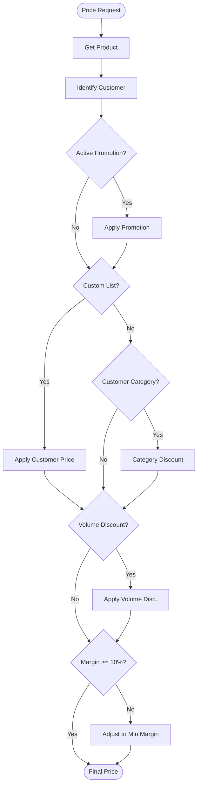
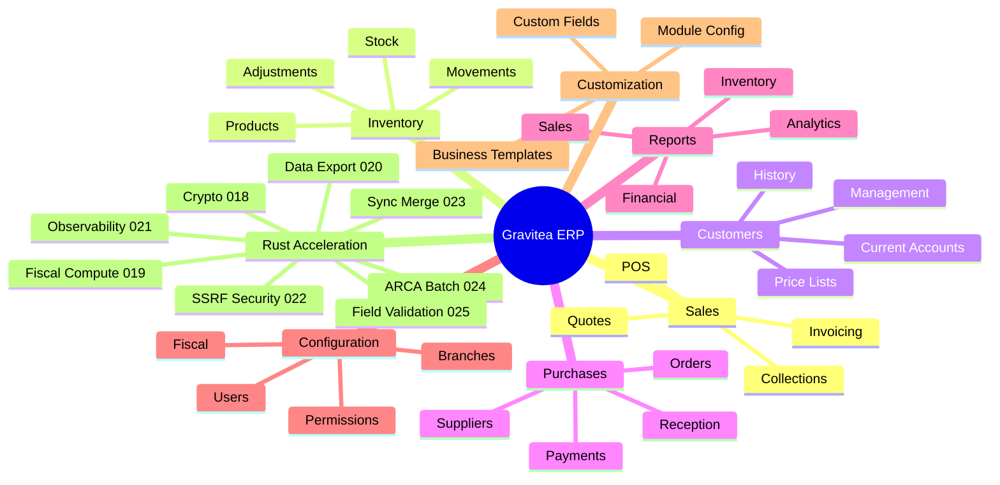
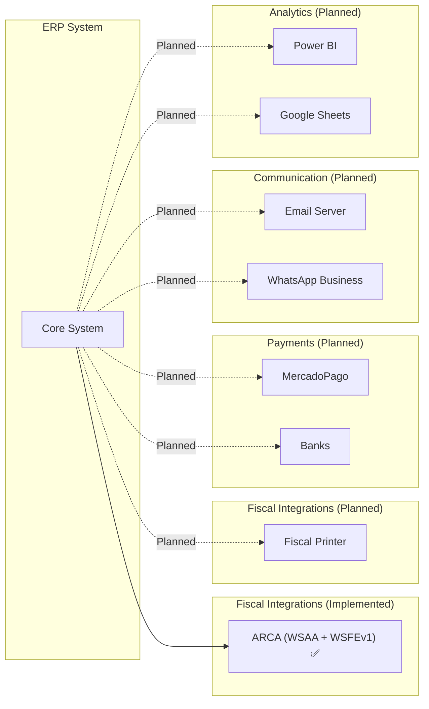

# High-Level Design (HLD) - Gravitea ERP

## 1. Document Metadata
| Field | Value |
| --- | --- |
| **Owner** | CTO / Tech Lead |
| **Implementation** | Tech Lead, Dev Team |
| **Version** | 1.4 |
| **Last Updated** | 2026-03-01 |
| **Status** | **Features 001-025 Complete — Rust Acceleration Done — Vertical SaaS Research Phase** |
| **Related** | Product Vision & Scope, PRD, Data Model & Domain Model, Deployment & Infrastructure Guide, Roadmap |

### Architecture Status (March 2026)

| Component | Status | Implementation |
|:-----------|:-------|:---------------|
| **Backend Django REST** | ✅ Complete | Docker Compose (dev) / Cloud Run (planned); 9 OpenAPI contracts, 79 paths, 137 operations |
| **PostgreSQL 18.1** | ✅ Complete | Multi-tenant RLS active; 23 migrations |
| **Rust/PyO3 Acceleration** | ✅ Complete | 9 Rust modules (crypto, compute, export, observability, security, sync, arca, validation); 2-9x speedup with Python fallback |
| **MOD_AUTH** | ✅ Complete | JWT RS256, RBAC, 3-tier rate limiting, Argon2, multi-tenant users |
| **MOD_INV** | ✅ Complete | Products (encrypted barcode), StockMovement (ledger), Categories, Suppliers (encrypted PII), PriceLists |
| **MOD_SYNC** | ✅ Complete | Push/Pull APIs, SyncSession (vector clocks), PendingOperation, conflict resolution; Rust merge engine (023) |
| **Observability** | ✅ Complete | Prometheus, Grafana, Jaeger, Loki (PLG), OpenTelemetry, 11-file stack; Rust hot-path (021) |
| **MOD_VENT** | ✅ Complete | Customers, SaleOrders (DRAFT→CONFIRMED→INVOICED), SaleOrderItems, nested routing |
| **MOD_FACTURACION (ARCA)** | ✅ Complete | WSAA + WSFEv1, CAE lifecycle, CAEA offline, fiscal QR, immutable Comprobantes; Rust batch builder (024) |
| **Tenant Customization** | ✅ Complete | TenantFieldDefinition, TenantModuleConfig, BusinessTemplate, DynamicFields UI; Rust validator (025) |
| **API Contracts** | ✅ Complete | 9 OpenAPI specs via DRF Spectacular — auth, inventory, sales, invoicing, sync, compras, core, reportes, customization |
| **Frontend — Next.js Dev** | Partial (Dev) | Next.js 16 prototype — 9 routes, 52 source files (current dev environment only) |
| **Frontend — Electron** | Planned | Planned production desktop client (not started) |
| **MOD_COMPRAS** | Partial | Supplier model complete; purchase order workflow pending |
| **MOD_REP** | Not started | Planned before MVP launch |
| **GCP / Cloud Run** | Planned | Production deployment target |

### Global Technology Stack (March 2026)

| Layer | Technology | Version | Purpose |
|:------|:-----------|:--------|:--------|
| **Runtime** | Python | 3.14.3 | Core backend runtime |
| **Native Acceleration** | Rust | 1.93.1 | CPU-bound hot-path modules (crypto, compute, export, security, sync, arca, validation, observability) |
| **FFI Bridge** | PyO3 | 0.28 | Rust↔Python interop with GIL management |
| **Build Tool** | Maturin | 1.12.4 | Rust→Python wheel packaging |
| **Framework** | Django | ≥5.2, <5.3 | Web framework |
| **API** | Django REST Framework | ≥3.15, <4.0 | REST API layer |
| **Database** | PostgreSQL | 18.1 | Primary data store with RLS |
| **Database Driver** | psycopg | ≥3.1, <4.0 | PostgreSQL adapter |
| **Cache/Queue** | Redis | 7.x | Caching and message broker |
| **Task Queue** | Celery | ≥5.3, <6.0 | Async task processing |
| **Authentication** | SimpleJWT | ≥5.3, <6.0 | JWT token management |
| **Password Hashing** | Argon2 | ≥23.1.0 | Secure password storage |
| **Encryption** | cryptography | ≥42.0, <43.0 | AES-256-GCM encryption |
| **Metrics** | Prometheus Client | 0.21.0 | Application metrics |
| **Tracing API** | OpenTelemetry API | 1.27.0 | Distributed tracing |
| **Tracing SDK** | OpenTelemetry SDK | 1.27.0 | Tracing implementation |
| **Tracing Export** | OTLP Exporter | 1.27.0 | Jaeger integration |
| **Log Instrumentation** | OpenTelemetry Logging | 0.48b0 | Structured logging |
| **Django Instrumentation** | OTel Django | 0.48b0 | Auto-instrumentation |
| **Containerization** | Docker | Latest | Application packaging |
| **Orchestration** | Docker Compose | Latest | Local/dev environment (current) |
| **Frontend (Dev)** | Next.js | 16 (App Router) | Current development frontend |
| **Frontend (Planned)** | Electron | — | Planned production desktop client |
| **Cloud Platform (Planned)** | Google Cloud Run | N/A | Production deployment target |
| **Cloud Database (Planned)** | Cloud SQL | PostgreSQL 18.1 | Managed database target |
| **Cloud Cache (Planned)** | Memorystore | Redis | Managed Redis target |

**Observability Stack**:
| Component | Technology | Purpose |
|:----------|:-----------|:--------|
| Metrics | Prometheus + Grafana | Metric collection and dashboards |
| Logging | Loki + Promtail | Centralized log aggregation |
| Tracing | Jaeger + OpenTelemetry | Distributed request tracing |
| Alerting | Grafana Alerting | Real-time notifications |

## 2. Executive Summary

Gravitea ERP is a cloud-first multi-tenant ERP system originally designed for hardware stores and physical retail, now in a **research phase evaluating a pivot to Vertical SaaS** targeting a specific Argentine industry niche. The system combines:
- Django + Django REST Framework backend with a **Rust/PyO3 acceleration layer** for CPU-bound operations (currently running on Docker Compose; planned on Google Cloud Run).
- Next.js 16 frontend as current development interface; Electron desktop client is the **planned production** client for branch POS operation.
- Central database on PostgreSQL 18.1 (local Docker; Cloud SQL planned for production).
- Offline-first operation in branches through local cache and deferred synchronization engine.
- **9 Rust native modules** (specs 017-025) providing 2-9x speedup on crypto, fiscal validation, data export, SSRF protection, sync merge, ARCA batch building, custom field validation, and observability hot paths — all with automatic Python fallback.

**Strategic Context (March 2026)**: The project completed all planned backend features (001-025) and is evaluating a pivot from horizontal ERP to a vertical SaaS solution. Four candidate niches are under research: Distribuidoras, Ferreterías, Acopiadores, and Frigoríficos. See ADR-016 for details.

**Dual-Environment Clarification**:
- **Current (Development)**: Docker Compose stack — Django backend, Next.js dev server, PostgreSQL, Redis, Rust acceleration (Maturin wheel).
- **Planned (Production)**: Google Cloud Run (Django + Next.js), Cloud SQL PostgreSQL, Memorystore Redis; Electron desktop client for branch POS.

The goal of the HLD is to describe **what the system looks like from the outside**: what blocks exist, how they relate, how information flows between cloud and branch, and how the main business Modules connect.

## 3. System Architecture View (Cloud + Branch)

### 3.1 General Architecture — Dual-Environment View

#### Current (Development) — Docker Compose

#### Planned (Production Target) — Google Cloud

**Architecture notes**:
- **Single multi-tenant cloud**: all core business logic lives in a single environment.
- **Branches as "intelligent edges"** (Planned): Electron executes UI, offline resilience logic and synchronization against the Django backend.
- **Stateless backend**: all sessions and short-term state live in Redis and PostgreSQL; containers scale horizontally without affinity.

### 3.2 Module Architecture (Logical View — Current State)

**Module responsibilities**:
- `MOD_AUTH` (AUTH): ✅ **Implemented** — authentication, session management, tenant/branch context (JWT RS256, RBAC, rate limiting). *Rust: AES-256-GCM encryption + HMAC blind index via crypto.rs (8.7x speedup).*
- `MOD_INV` (INVENTORY): ✅ **Implemented** — product catalog, stock ledger (StockMovement), categories, suppliers (encrypted PII), price lists. *Rust: aggregate_stock_levels via compute.rs (2.1x), CSV/XLSX export via export.rs.*
- `MOD_VENT` (SALES): ✅ **Implemented** — customers (CUIT, condicion_iva), sale orders (DRAFT→CONFIRMED→INVOICED), order items, nested routing. *Rust: validate_cuit (3.1x), validate_importes (2.7x) via compute.rs.*
- `MOD_FAC` (FACTURACION/ARCA): ✅ **Implemented** — direct WSAA+WSFEv1 SOAP integration, CAE lifecycle, CAEA offline codes, immutable Comprobantes, fiscal QR. *Rust: IVA breakdown (4.4x) via compute.rs, CAEA batch builder via arca.rs (024).*
- `MOD_SYNC` (SYNC/Offline API): ✅ **Implemented** — push/pull endpoints, SyncSession (vector clocks), PendingOperation (retry + conflict resolution). *Rust: most-complete-wins merge via sync.rs (023), GIL-released batch mode.*
- `MOD_CUSTOM` (CUSTOMIZATION): ✅ **Implemented** — TenantFieldDefinition (6 field types), TenantModuleConfig, BusinessTemplate onboarding. *Rust: field validation for 6 types via validation.rs (025).*
- `MOD_REP` (REPORTS): Not started — planned before MVP launch.
- `RUST_ACCEL` (Rust Acceleration Layer): ✅ **Implemented** — 9 PyO3 modules in `rust/gravitea-core/src/` with Python dispatcher pattern (`*_engine.py`). Each module auto-detects Rust availability, falls back to Python with warning. Docker multi-stage rust-builder produces 188 KB wheel.
- `WORK`: async workers (snapshot recalculation, exports, maintenance tasks) — via Celery/Redis.

## 4. Critical Business Flows (High-Level Technical View)

### 4.1 Sales Flow (POS)

**Backend implementation**: The `MOD_VENT` + `MOD_FAC` backend fully implements this flow via REST API. The sale order follows DRAFT→CONFIRMED→INVOICED with ARCA CAE authorization. Frontend POS (Electron) execution is planned for production.

### 4.2 Offline/Online Synchronization

**High-level Design decisions**:
- **Backend sync endpoints**: `POST /sync/push/`, `GET /sync/pull/`, `GET /sync/status/{device_id}/` — fully implemented.
- **Offline queue on client**: planned for Electron production client; backend is already idempotent (client-generated UUIDs).
- **Synchronization priorities**: fiscal sales and stock adjustments have priority over less critical operations.

### 4.3 Dynamic Pricing System

**Architecture implications**:
- Requires access to price lists, segment rules and promotions both in the cloud and in local cache (Electron — planned).
- The calculation is done "as close as possible to the UI" (Electron — planned) to avoid depending on the API round-trip.
- The truth of prices and rules lives in the central database; Electron only caches snapshots with controlled TTL (planned).

## 5. Main Components and Integrations

### 5.1 Business Modules (Macro View)

> **Note (March 2026)**: The mindmap reflects the current modular architecture. The project is evaluating a pivot to **Vertical SaaS** targeting a specific Argentine industry niche (see ADR-016). Post-pivot, domain-specific modules may replace or extend some generic modules above.

**Relationship with other documents**:
- For detailed capabilities and scope of each module, see `PRD.md` and `Product Vision & Scope.md`.
- This HLD only defines **how these Modules are located within the technical architecture** (what services support them, what integrations they use).

### 5.2 External Integrations

**Integration criteria**:
- Preference for HTTP/REST APIs (or gRPC in the future) with well-versioned contracts.
- ARCA integration is implemented via direct WSAA (authentication) + WSFEv1 (invoicing) SOAP calls in `apps/facturacion/arca/`.
- Any "retry and resilience" logic towards external services is handled in asynchronous workers (Celery + Redis).

## 6. NFRs and Quality Attributes (Architecture View)

- **Availability**: > 99.9% for backend and frontend services; branches continue operating offline during cloud outages (planned for Electron production client).
- **Scalability**: horizontal autoscaling per container; clear separation between reading (cached) and transactional writing.
- **Security**: strict tenant separation via Defense-in-Depth (TenantBoundManager + PostgreSQL RLS + IDOR validation). JWT RS256 with algorithm whitelist. AES-256-GCM for PII fields (Rust-accelerated, 8.7x). Argon2 password hashing. SSRF validation via Rust security.rs (83-entry adversarial corpus, 10 CIDR ranges, 9 hostname patterns).
- **Performance (Rust Acceleration)** ✅ **IMPLEMENTED**:
  - 9 Rust/PyO3 native modules with automatic Python fallback (zero-regression dispatcher pattern)
  - Key benchmarks: AES-256-GCM 8.7x, HMAC blind index 8.8x, IVA breakdown 4.4x, CUIT validation 3.1x, importes validation 2.7x, stock aggregation 2.1x, endpoint sanitization 2.6x
  - Docker: multi-stage rust-builder, 188 KB wheel, 6.8s incremental build
  - GIL management: released for batch operations (sync merge batch, data export), held for single-call validation
- **Observability** ✅ **IMPLEMENTED**:
  - Centralized metrics with **Prometheus + Grafana** (business metrics: sync operations, auth events, inventory movements; Rust hot-path for label sanitization — 021)
  - Centralized logs with **Loki + Promtail** (JSON structured, sensitive data filtered, 30-day retention)
  - Distributed tracing with **Jaeger + OpenTelemetry** (trace_id on all requests via TraceMiddleware)
  - Stack available via `docker compose --profile observability up`
  - 100% of fiscal service failures generate alerts within 1 minute
  - 100% of synchronization failures logged with context (tenant_id, branch_id, operation, error_trace)
- **API Contracts** ✅ **IMPLEMENTED**: 9 OpenAPI specs generated via DRF Spectacular — 79 paths, 154 schemas, 137 operations. Contracts: auth, inventory, sales, invoicing, sync, compras, core, reportes, customization.
- **Test Coverage**: ~2,500+ test functions; 131 Rust integration tests (cargo + pytest) with 0 regressions across specs 017-025. Docker validation suite passing for all Rust modules.

## 7. Relationship with the Low-Level Design (LLD)

This document primarily answers **what blocks exist and how they connect**.
The `Low-Level Design (LLD).md` document details:
- Internal design of Django services, models and layers (views/serializers/services).
- Physical schema, multi-tenancy and RLS policies on PostgreSQL.
- Security strategies (JWT, RBAC), deployment (CI/CD, migrations) and observability (logs, metrics).
