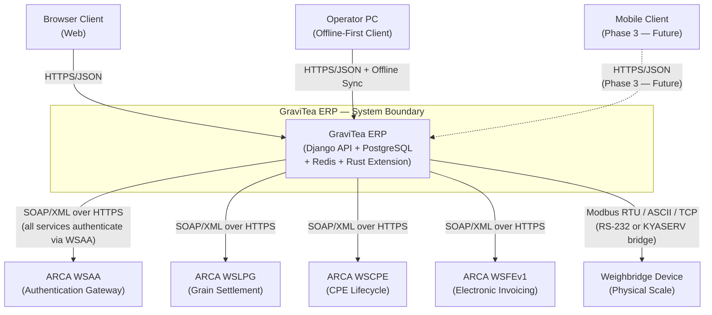
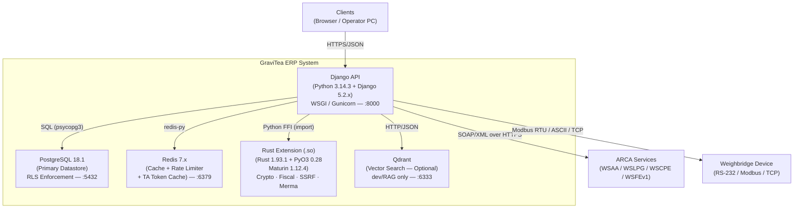
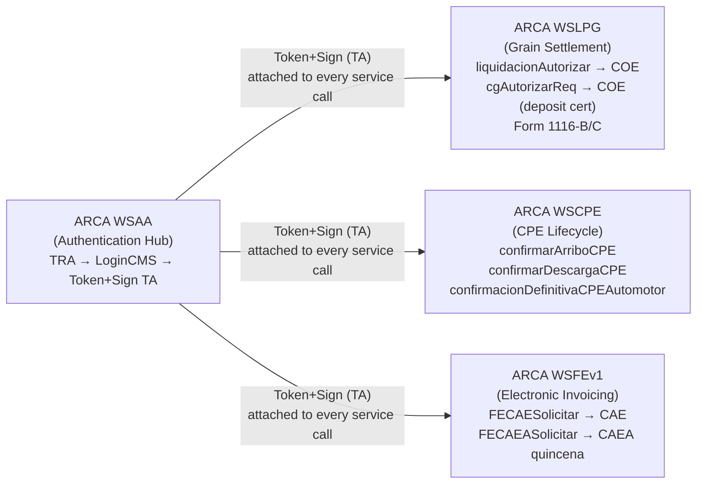
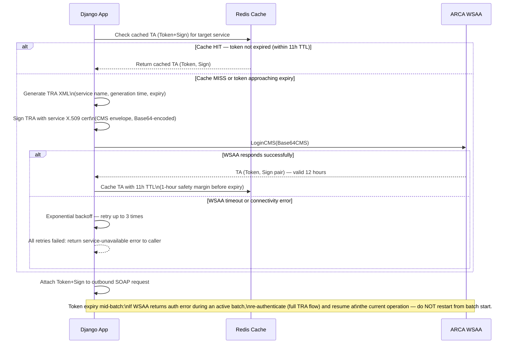
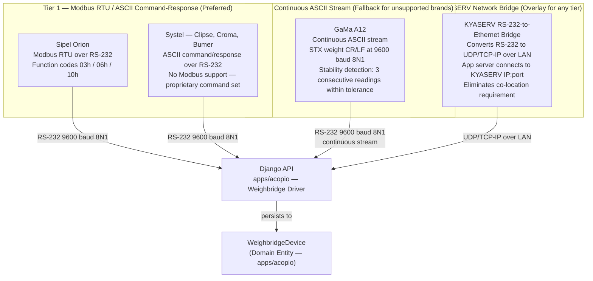
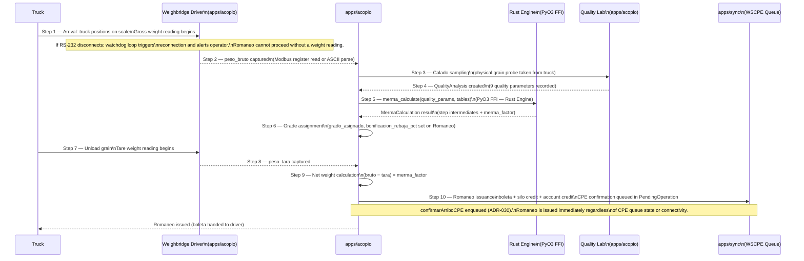
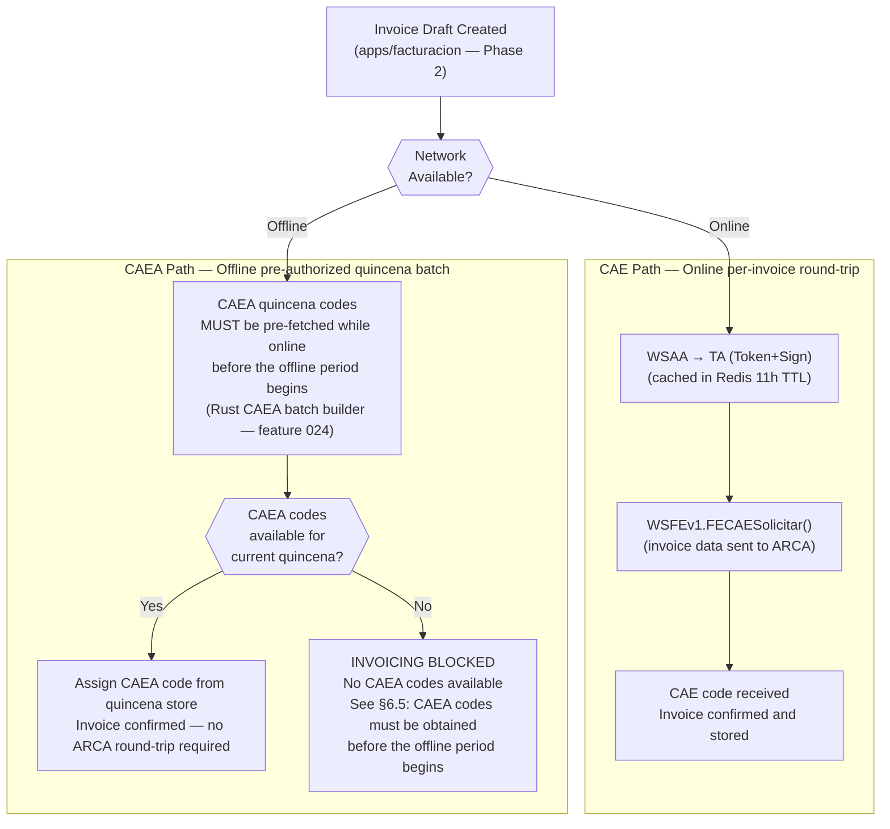
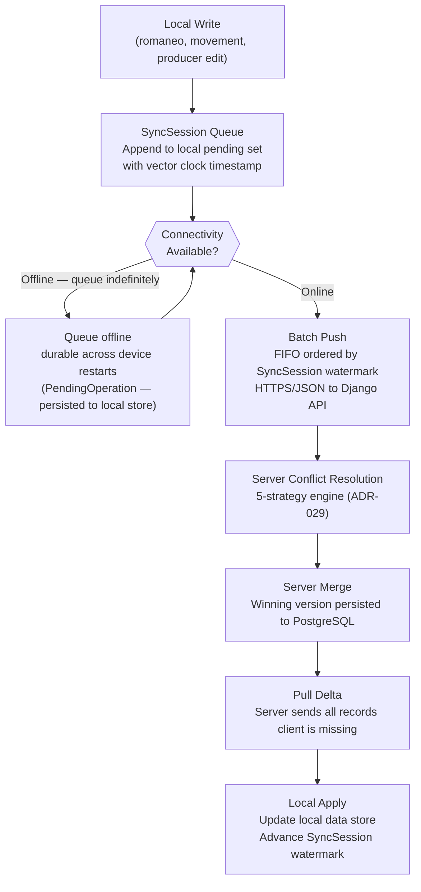
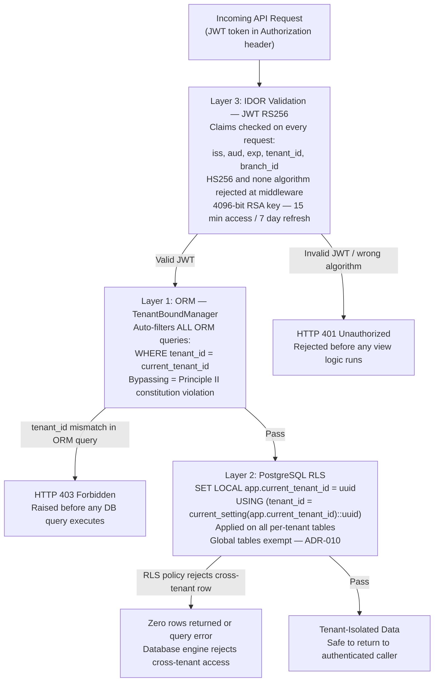
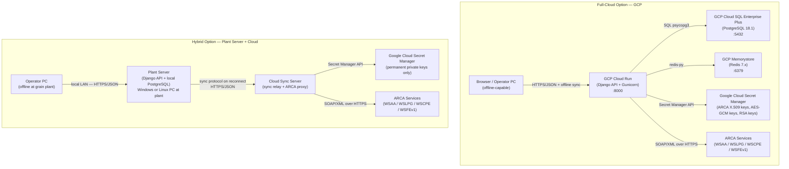

# High-Level Design (HLD) — GraviTea Acopio ERP

> **Version 1.0** · Date: 2026-03-17 · Status: Accepted · Owner: GraviTea Architecture Team

## 1. Document Metadata

| Field | Value |
|-------|-------|
| **Version** | 1.0 |
| **Date** | 2026-03-17 |
| **Status** | Accepted |
| **Owner** | GraviTea Architecture Team |
| **Upstream Documents** | ADR v1.0, Data Model & Domain Model v1.0, PRD v1.0, Product Vision & Scope v1.0 |

---

## 2. System Overview

### 2.1 Purpose

This document is the architecture reference for GraviTea Acopio ERP. It translates 35 architectural decisions — captured in `Docs/Project Blueprint/Architecture Decision Records (ADR).md` — into diagrams and component maps that a developer, architect, or AI implementation agent can use when building or reviewing code. A new engineer reading only this document understands the container structure, external integrations, core data flows, and architectural constraints without consulting specs 01–04.

### 2.2 Out of Scope

The following are explicitly out of scope for this document:

- **Database ERD and entity field details** — documented in spec-03 (`Docs/Project Blueprint/Data Model & Domain Model.md`)
- **Individual ADR rationale text** — documented in spec-04 (`Docs/Project Blueprint/Architecture Decision Records (ADR).md`); the HLD cites ADRs, it does not reproduce their rationale
- **REST API endpoint specifications** — documented in spec-06 (REST API Design)
- **Detailed ARCA SOAP XML schemas and example payloads** — documented in spec-08a (ARCA Grain Integration Guide)
- **Phase 4 ML model implementation details** — referenced informatively only; detailed model architecture deferred to a future specification
- **Frontend architecture** — not yet defined

### 2.3 How to Read This Document

All diagrams use Mermaid text notation (`graph TD`, `sequenceDiagram`, `flowchart TD`). Architecture sections cite architectural decision records in the format **ADR-NNN (Title)** — for example, "ADR-025 (ARCA Web Service Architecture)". For the rationale behind any architectural decision, consult the cited ADR in spec-04. Section §13 provides a complete cross-reference table mapping every HLD section to its governing ADRs.

---

## 3. System Context (C4 Level 1)

### 3.1 C4 Level 1 System Context Diagram



### 3.2 External Actor Descriptions

**ARCA WSAA (Authentication Gateway)**: WSAA is the authentication gateway for all ARCA web services. Every call to WSLPG, WSCPE, and WSFEv1 requires a valid Token+Sign pair issued by WSAA. Authentication follows the TRA → CMS → LoginCMS → TA (Token+Sign) flow. Tokens expire after 12 hours. The system caches tokens in Redis with an 11-hour TTL to avoid redundant round-trips. ADR-025 (ARCA Web Service Architecture) governs the WSAA integration.

**ARCA WSLPG (Grain Settlement)**: WSLPG is the ARCA web service for filing Form 1116-B/C — the Liquidación Primaria de Granos (primary grain settlement). The acopiador (grain receiver and storage operator) files a settlement for each grain type received from a producer. The system calls `liquidacionAutorizar` to obtain a COE (Código de Operación Electrónico) confirming the filing. The SISA producer compliance registry provides the withholding retention tier applied to each settlement. ADR-019 (Single Form 1116-C per Grain Type) and ADR-027 (SISA-Tier Retention Calculation) govern this integration.

**ARCA WSCPE (CPE Lifecycle)**: WSCPE manages the lifecycle of the CPE (Carta de Porte Electrónica — mandatory electronic waybill authorising grain transit by truck). Each grain shipment requires a CPE carrying a CTG (Código de Trazabilidad de Granos — grain traceability code). The system calls WSCPE to confirm arrival, discharge, and definitive confirmation of each CPE. ADR-030 (Store-and-Forward Queue for ARCA Web Service Calls) governs how WSCPE calls are queued during offline periods.

**ARCA WSFEv1 (Electronic Invoicing)**: WSFEv1 issues CAE (Código de Autorización Electrónico) codes for each electronic fiscal document (comprobante). When online, each invoice triggers a per-invoice round-trip to WSFEv1 via `FECAESolicitar`. When offline, the system uses CAEA (Código de Autorización Electrónico Anticipado) — pre-authorized quincena (15-day period) batch codes obtained before the offline period — to issue invoices without a live ARCA connection. ADR-026 (CAEA for Offline Fiscal Operations) governs the CAEA offline path.

**Weighbridge Device (Physical Scale)**: The weighbridge is the industrial truck scale at the grain storage plant. It communicates with the Django API via RS-232 serial through one of three protocol tiers: Modbus RTU (Sipel Orion), continuous ASCII stream (GaMa A12), or TCP/IP via KYASERV RS-232-to-Ethernet bridge. ADR-032 (Weighbridge Integration Architecture) governs the three-tier protocol stack.

**Browser Client**: Browser clients connect to the Django REST API over HTTPS/JSON. They run the operator-facing web application for day-to-day acopio operations. Browser clients require active connectivity — there is no browser-based offline mode.

**Operator PC (Offline-First Client)**: The operator PC at the grain plant runs an offline-capable client that synchronises with the Django API using the store-and-forward sync protocol. It is the primary interface during harvest periods when connectivity is intermittent. ADR-028 (Offline-First as Base Architecture) governs the sync model.

**Mobile Client (Phase 3 — Future)**: A mobile client is planned for Phase 3 to support field operations. It is not part of Phase 1 or Phase 2 delivery. The mobile client uses the same HTTPS/JSON API with offline sync capabilities.

### 3.3 System Boundary

**Inside the system boundary**: The Django API server (Python 3.14.3 + Django 5.2.x + Gunicorn), PostgreSQL 18.1 database, Redis 7.x cache, the Rust extension `.so` module loaded at Django startup via Python FFI, and the optional Qdrant vector search container. These containers are described in §4.

**Outside the system boundary**: All four ARCA web services (WSAA, WSLPG, WSCPE, WSFEv1), the physical weighbridge device, browser clients, the operator PC client application, and the future mobile client. Google Cloud infrastructure management (Cloud Run, Cloud SQL, Secret Manager) is also outside the boundary — those are deployment targets, not application components.

---

## 4. Container Architecture (C4 Level 2)

### 4.1 C4 Level 2 Container Architecture Diagram



### 4.2 Container Descriptions

| Container | Technology | Version | Port | Role |
|-----------|-----------|---------|------|------|
| **Django API** | Python + Django + DRF + Gunicorn | Python 3.14.3 / Django 5.2.x | 8000 | WSGI application server; handles all REST API requests, ARCA integration, weighbridge communication, offline sync, and tenant isolation enforcement |
| **PostgreSQL** | PostgreSQL | 18.1 | 5432 | Primary persistent datastore; PostgreSQL Row Level Security (RLS) enforced on all per-tenant tables; global reference tables (grain type definitions, tolerance tables) exempt from RLS per ADR-010 |
| **Redis** | Redis | 7.x | 6379 | Three roles: (1) session cache and rate-limit counters for API requests, (2) WSAA Token+Sign (TA) cache with 11-hour TTL, (3) token blacklist for logged-out JWT tokens |
| **Rust Extension (.so)** | Rust + PyO3 + Maturin | Rust 1.93.1 / PyO3 0.28 / Maturin 1.12.4 | N/A | Compiled shared library loaded at Django startup via Python FFI. Accelerates: AES-256-GCM encryption, HMAC blind index, IVA/CUIT/importes validation, merma calculation, observability label sanitization, SSRF URL validation, sync conflict resolution, and CAEA batch processing. If the Rust `.so` extension fails to load at Django startup, the Python fallback activates automatically without operator intervention. |
| **Qdrant** | Qdrant | Latest stable | 6333 | Optional vector search container. Used in the development environment for RAG-based query expansion. Not required for Phase 1 or Phase 2 production deployments; disabled by default in production Docker Compose builds. |

### 4.3 Communication Matrix

| From | To | Protocol | Direction | Purpose |
|------|----|----------|-----------|---------|
| Django API | PostgreSQL | SQL (psycopg3) | Request/Response | All persistent data reads and writes; RLS session variable applied at transaction start |
| Django API | Redis | redis-py | Request/Response | (1) Session + rate limiter; (2) WSAA TA token cache; (3) JWT blacklist lookups |
| Django API | Rust Extension | Python FFI (import) | In-process call | Crypto operations, fiscal calculations, merma, SSRF validation, label sanitization, conflict resolution |
| Django API | Qdrant | HTTP/JSON | Request/Response | Vector similarity search for RAG query expansion (dev environment only) |
| Django API | ARCA WSAA | SOAP/XML over HTTPS | Request/Response | TRA authentication → Token+Sign (TA) pair; 12-hour token lifetime |
| Django API | ARCA WSLPG | SOAP/XML over HTTPS | Request/Response | Grain settlement filing (`liquidacionAutorizar` → COE); grain deposit certificate (`cgAutorizarReq` → COE for deposit certificate, triggered at romaneo reception) |
| Django API | ARCA WSCPE | SOAP/XML over HTTPS | Request/Response | CPE lifecycle calls (`confirmarArriboCPE`, `confirmarDescargaCPE`, `confirmacionDefinitivaCPEAutomotor`) |
| Django API | ARCA WSFEv1 | SOAP/XML over HTTPS | Request/Response | Per-invoice CAE (`FECAESolicitar` → CAE code); CAEA quincena pre-fetch |
| Django API | Weighbridge Device | Modbus RTU / ASCII / TCP | Request/Stream | Weight reading acquisition via three-tier protocol stack (see §7) |
| Clients | Django API | HTTPS/JSON | Request/Response | All REST API calls; JWT RS256 authentication on every request |

### 4.4 Rust/PyO3 Acceleration Boundary

The Rust extension accelerates operations that meet **any one** of the following four criteria. All other operations remain in Python. ADR-031 (Rust/PyO3 Acceleration Boundary — When Rust, When Python) governs this boundary.

**Criterion 1 — Hot path throughput**: Operations called more than 1,000 times per second where CPython's Global Interpreter Lock (GIL) becomes a bottleneck under concurrent Django workers.

**Criterion 2 — GIL contention in batch processing**: Operations that release the GIL and run in parallel within multi-request batch operations (for example, CAEA quincena batch assembly processing multiple invoice records simultaneously).

**Criterion 3 — CPU-bound computation**: Cryptography (AES-256-GCM encryption/decryption, HMAC blind index generation), tax calculations (IVA, CUIT validation, importes), and merma weight deduction sequences.

**Criterion 4 — ReDoS-resistant regex**: Adversarial user input patterns (URL validation, SSRF allowlist checking) that require linear-complexity regex engines. CPython's `re` module is vulnerable to exponential backtracking on crafted inputs. ADR-024 (SSRF Validation Pipeline) mandates Rust for all URL validation.

**Benchmark Table** — measured speedups vs. equivalent Python implementation:

| Module | Feature Branch | Speedup vs Python |
|--------|---------------|-------------------|
| AES-256-GCM encryption | 018-rust-crypto | 8.7× |
| HMAC blind index | 018-rust-crypto | 8.8× |
| IVA calculation | 019-rust-fiscal-compute | 4.4× |
| CUIT validation | 019-rust-fiscal-compute | 3.1× |
| Importes validation | 019-rust-fiscal-compute | 2.7× |
| Stock aggregation | 019-rust-fiscal-compute | 2.1× |
| Observability label sanitization | 021-rust-observability | 2.6× |

All Rust modules are compiled into a single `.so` shared library by Maturin and loaded at Django startup. The Python fallback path is maintained alongside every Rust-accelerated function; if the Rust extension fails to load at Django startup, Django falls back to Python implementations automatically without operator intervention.

---

## 5. Component Overview by Django App

The GraviTea ERP backend is a modular monolith (ADR-003) with eight Django apps, each owning a distinct domain. Phase 1 apps (specs 09–12) are delivered first. Apps annotated "(Phase 2)" are fully designed but not activated until their delivery wave.

### 5.1 — `apps/core`

`apps/core` is the shared infrastructure layer. It provides `TenantBoundModel` base class, the `TenantBoundManager` ORM manager that auto-filters all queries by `tenant_id`, AES-256-GCM field encryption utilities, the Prometheus/OpenTelemetry observability stack, and the Rust-accelerated SSRF URL validation pipeline (ADR-024).

**Owned entities**: `Tenant`, `Branch`, `AppUser`, `Role`, `TenantFieldDefinition`, `TenantModuleConfig`

**Key characteristics**: All other apps inherit `TenantBoundModel`. Bypassing this inheritance is a constitution violation (Principle II — Ironclad Multi-Tenant Isolation).

**ADR references**: ADR-003 (Modular Monolith via Django Apps), ADR-005 (Three-Layer Tenant Isolation), ADR-024 (SSRF Validation Pipeline)

### 5.2 — `apps/auth`

`apps/auth` handles JWT RS256 authentication (4096-bit keys), Argon2 password hashing, token lifecycle management (access token 15 min, refresh token 7 days), token blacklisting on logout, and Redis-backed rate limiting on all authentication endpoints.

**Owned entities**: `AppUser` (authentication aspects), JWT token management via djangorestframework-simplejwt with custom `tenant_id` and `branch_id` claims

**Key characteristics**: HS256 and the `none` algorithm are rejected at middleware before any view logic executes. Token blacklisting prevents replay attacks after logout.

**ADR references**: ADR-021 (JWT RS256 with Custom Tenant/Branch Claims), ADR-022 (AES-256-GCM Field-Level Encryption), ADR-023 (Argon2 Password Hashing)

### 5.3 — `apps/acopio`

`apps/acopio` is the core grain domain app. It owns the complete romaneo (grain reception document) workflow — from weighbridge weight capture through quality analysis, merma calculation, grade assignment, and romaneo issuance. It also manages storage units, grain lots, movements, and weighbridge device configuration.

**Owned entities**: `Romaneo`, `QualityAnalysis`, `MermaCalculation`, `CPE`, `StorageUnit`, `GrainLot`, `GrainMovement`, `WeighbridgeDevice`, `CampanaConfig`, `GrainType`, `ToleranceTable`, `MermaTable`

**Key characteristics**: Merma calculation is Rust-accelerated (feature 019-rust-fiscal-compute). CPE lifecycle calls are queued to `apps/sync.PendingOperation` for store-and-forward transmission to WSCPE.

**ADR references**: ADR-014 (MermaTable Scope), ADR-015 (QualityParameter Inline), ADR-016 (WeighbridgeDevice as Separate Entity), ADR-017 (Grade Fields on Romaneo), ADR-031 (Rust/PyO3 Acceleration Boundary), ADR-032 (Weighbridge Integration Architecture)

### 5.4 — `apps/cuentas`

`apps/cuentas` manages producer current accounts (cuentas corrientes). It records all financial movements per producer: grain deliveries, fijación (price-setting) events, advance payments, and account balances. The dual-ledger pattern separates grain quantity tracking from financial value. Account movements are append-only — no UPDATE or DELETE on confirmed entries (ADR-008).

**Owned entities**: `ProducerAccount`, `AccountMovement`, `FijacionRecord`

**ADR references**: ADR-008 (Append-Only Ledger for Financial Immutability), ADR-009 (Dual Inventory Architecture — Grain Continuous vs Discrete SKU), ADR-020 (Own Grain vs Third-Party Grain Accounting Separation)

### 5.5 — `apps/sync`

`apps/sync` implements the offline-first synchronisation protocol. It manages `SyncSession` watermarks, the store-and-forward `PendingOperation` queue, and the conflict resolution engine (5 strategies, ADR-029). On reconnect, the engine dequeues and transmits pending operations FIFO to their target ARCA endpoints. The `most_complete_wins` conflict strategy is Rust-accelerated (feature 023-rust-sync-conflict).

**Owned entities**: `SyncSession`, `PendingOperation`

**ADR references**: ADR-002 (UUID v4 as Primary Key Strategy), ADR-028 (Offline-First as Base Architecture), ADR-029 (Conflict Resolution Taxonomy — 5 Strategies by Data Type), ADR-030 (Store-and-Forward Queue for ARCA Web Service Calls)

### 5.6 — `apps/core/observability`

`apps/core/observability` provides the Prometheus metrics endpoint and OpenTelemetry distributed tracing integration. Prometheus metric label values pass through the Rust-accelerated sanitization pipeline (feature 021-rust-observability-hotpath, 2.6× speedup) before recording, preventing cardinality explosion from adversarial or user-controlled inputs.

**Owned entities**: No persistent database entities. Metrics and traces are emitted to external collectors (Prometheus scrape endpoint, OTLP exporter).

**ADR references**: ADR-031 (Rust/PyO3 Acceleration Boundary)

### 5.7 — `apps/facturacion` (Phase 2)

`apps/facturacion` implements electronic invoicing via ARCA WSFEv1. It manages fiscal comprobantes (invoices), the WSAA client, the WSFEv1 client, CAEA quincena batch codes, ARCA credentials per service, and puntos de venta. This app is **Phase 2** (Wave 6) — not activated in Phase 1 delivery. The CAEA batch builder is Rust-accelerated (feature 024-rust-arca-batch, `serde_json`, GIL-released batch processing).

**Owned entities**: `Comprobante`, `CAEA`, `ArcaCredential`, `PuntoDeVenta`

**ADR references**: ADR-025 (ARCA Web Service Architecture), ADR-026 (CAEA for Offline Fiscal Operations During Harvest), ADR-027 (SISA-Tier Retention Calculation at LPG Filing Time)

### 5.8 — `apps/liquidaciones` (Phase 2)

`apps/liquidaciones` implements WSLPG grain settlement filing. It builds Form 1116-B/C XML payloads, submits them to WSLPG via `liquidacionAutorizar`, applies the SISA retention tier blocking gate, and stores COE confirmation codes. This app is **Phase 2** (spec-14) — not activated in Phase 1 delivery.

**Owned entities**: `LiquidacionPrimaria`

**Key characteristics**: One WSLPG submission per grain type per batch — `codGrano` is at the XML root, making multi-grain submissions impossible in a single call (ADR-019). SISA validation is a blocking gate.

**ADR references**: ADR-019 (Single Form 1116-C per Grain Type), ADR-025 (ARCA Web Service Architecture), ADR-027 (SISA-Tier Retention Calculation at LPG Filing Time)

---

## 6. ARCA Integration Architecture

ARCA (Administración de Ingresos Públicos — formerly AFIP) provides four SOAP web services for the acopio ERP. All service calls authenticate through WSAA first. ADR-025 (ARCA Web Service Architecture) governs this hub-and-spoke architecture.

### 6.1 ARCA Hub-and-Spoke Overview



Every call to WSLPG, WSCPE, or WSFEv1 requires a valid Token+Sign (TA) pair from WSAA. The Django API caches the TA in Redis for 11 hours and attaches it to each downstream service call.

### 6.2 WSAA Authentication Flow

WSAA (Web Service de Autenticación y Autorización) is ARCA's authentication gateway. The TRA (Ticket de Requerimiento de Acceso) is an XML document signed with the service's X.509 certificate. The signed TRA is submitted to WSAA's `LoginCMS` method, which returns a Token+Sign (TA) pair valid for 12 hours.



**Key values**: Token+Sign lifetime = **12 hours**. Redis cache TTL = **11 hours** (1-hour safety margin). Each ARCA service requires its own separate X.509 certificate for TRA signing — a shared certificate across services is rejected at the ARCA service level.

### 6.3 WSLPG Integration

WSLPG (Webservice Liquidación Primaria de Granos) handles Form 1116-B/C grain settlement filings. The method `liquidacionAutorizar` submits a filing and returns a COE (Código de Operación Electrónico) confirming the filing.

**Service URLs**:

| Environment | URL |
|-------------|-----|
| Production | `https://serviciosjava.afip.gob.ar/wslpg/LpgService?wsdl` |
| Homologation (testing) | `https://fwshomo.afip.gov.ar/wslpg/LpgService?wsdl` |

The homologation environment requires pre-seeded ARCA test CUITs. Random or real production CUITs fail validation silently in homologation — this is a known ARCA behaviour.

**Single grain type constraint**: `codGrano` is at the XML root — one WSLPG submission per grain type (ADR-019). A batch containing multiple grain types requires separate `liquidacionAutorizar` calls, one per grain type. ADR-019 (Single Form 1116-C per Grain Type) governs this constraint.

**SISA blocking gate**: Before every WSLPG filing, the system queries SISA (RG 5689/2025 producer compliance registry) to determine the withholding retention tier. SISA validation is blocking — the filing is rejected if the producer's SISA status cannot be confirmed. Retention tiers (ADR-027):

| SISA Estado | IVA Withholding | Ganancias Withholding |
|-------------|-----------------|----------------------|
| Estado 1 (compliant) | 5% | 0% |
| Estado 2 (minor issues) | 8% | 2% |
| Estado 3 (significant issues) | 10.5% | 15% |
| Non-registered | 16% | 30% |

ADR-027 (SISA-Tier Retention Calculation at LPG Filing Time) governs the SISA retention logic.

#### 6.3.1 Grain Deposit Certificates (`cgAutorizarReq`)

WSLPG also handles grain deposit certificates via the `cgAutorizarReq` method. This method submits a deposit certificate request and returns a COE (Código de Operación Electrónico) confirming the certificate.

| Trigger | WSLPG Method | Returns |
|---------|-------------|---------|
| Romaneo reception (grain physically received at plant) | `cgAutorizarReq` | COE for deposit certificate |

**Concurrency note**: WSLPG `cgAutorizarReq` fires concurrent with WSCPE `confirmarDescargaCPE` at romaneo reception. Both calls authenticate independently through WSAA and can execute in parallel since they target different ARCA service endpoints.

### 6.4 WSCPE Lifecycle

WSCPE (Webservice Carta de Porte Electrónica) manages the lifecycle of the CPE (Carta de Porte Electrónica — mandatory electronic waybill authorising grain transit by truck). Each CPE carries a CTG (Código de Trazabilidad de Granos — grain traceability code).

The CPE Automotor (truck transport) validity window is **5 days** from issuance. The four WSCPE protocol states are:

```
Activa         (CPE issued — 5-day Automotor validity window begins)
  → Arribo     (confirmarArriboCPE — truck arrived at destination)
  → Descargada (confirmarDescargaCPE — grain unloaded at destination)
  → Confirmada_Definitiva  (confirmacionDefinitivaCPEAutomotor — definitive confirmation)
```

**Important**: "Vencida" (expired) is a **derived condition** based on elapsed time past the 5-day validity window — it is **not** a WSCPE state code. The system detects CPE records approaching expiry during extended offline periods and alerts the operator. There is no automatic extension of CPE validity; manual intervention is required if a CPE expires before the `confirmarArriboCPE` call is transmitted.

During offline periods, WSCPE calls are queued in `PendingOperation` (store-and-forward, ADR-030) and transmitted on reconnect. See §8.5 for queue mechanics.

### 6.5 WSFEv1/CAEA — Electronic Invoicing

WSFEv1 (Webservice Factura Electrónica v1) issues CAE (Código de Autorización Electrónico) codes for electronic fiscal documents. There are two authorization paths:

**CAE path (online)**: Each invoice triggers a round-trip to WSFEv1 via `FECAESolicitar`. ARCA validates the invoice data and returns a CAE code. The invoice is confirmed only when the CAE code is received and stored.

**CAEA path (offline pre-authorized)**: The CAEA (Código de Autorización Electrónico Anticipado) allows the system to issue invoices during offline periods using pre-authorized quincena (15-day period) batch codes obtained in advance from ARCA. The Rust CAEA batch builder (feature 024-rust-arca-batch, `serde_json`, GIL-released batch processing) assembles and validates the quincena request before submission.

**Legal constraint on CAEA**:

> **CAEA codes MUST be obtained before the offline period begins. An invoice issued with a deferred CAE (authorization obtained after issuance) is a legally invalid fiscal document.**

A CAEA code obtained during or after the offline period provides no retroactive authorization. The system does not implement store-and-forward for fiscal invoice issuance. ADR-026 (CAEA for Offline Fiscal Operations During Harvest) governs the CAEA model.

See §8.6 for the operational consequence of this constraint during harvest planning.

### 6.6 Certificate Management

Each ARCA web service requires a **separate** X.509 certificate with its own private key:

| Service | Certificate Purpose |
|---------|---------------------|
| WSLPG | Grain settlement filing — `liquidacionAutorizar` TRA signing |
| WSCPE | CPE lifecycle calls — `confirmarArriboCPE` TRA signing |
| WSFEv1 | Electronic invoice authorization — `FECAESolicitar` TRA signing |

A shared certificate across services is rejected at the ARCA service level — each service validates that the TRA was signed with the certificate registered specifically for that service. Private keys are stored exclusively in Google Cloud Secret Manager and never in: application code, environment variables (`.env` files), Docker configurations (`docker-compose.yml`, `Dockerfile`), or git history. ADR-022 (AES-256-GCM Field-Level Encryption with HMAC-SHA256 Blind Index) governs key management.

### 6.7 ARCA Error Paths

| Failure Mode | System Response | Operator Action Required |
|--------------|----------------|--------------------------|
| WSAA timeout | Exponential backoff — up to 3 retries with increasing wait intervals | None unless all retries fail (then service-unavailable error displayed) |
| WSAA auth error mid-WSLPG batch | Re-authenticate via full TRA → LoginCMS flow; resume batch at the current operation without restarting from the beginning | None |
| WSLPG schema validation error | Return user-facing error with ARCA error code and field reference | Operator corrects data and resubmits |
| SISA blocking rejection | Return user-facing error identifying the producer and their SISA status | Resolve SISA compliance for the producer before retrying |
| WSCPE CPE validity window expiry (>5 days offline) | Operator alert displayed; system does not automatically extend or cancel the CPE | Manual intervention — contact grain movement counterpart; ARCA manual override process |
| CAEA quincena codes expired during extended outage | Invoicing blocked immediately; no automatic workaround | Restore connectivity and obtain new CAEA quincena codes |
| X.509 certificate expiry | WSAA rejects TRA; all service calls fail | Replace certificate in Google Cloud Secret Manager and redeploy |

---

## 7. Weighbridge Integration Architecture

The weighbridge is the industrial truck scale at the grain storage plant. The Django API communicates with it via RS-232 serial through one of three protocol tiers. ADR-032 (Weighbridge Integration Architecture) governs this integration.

### 7.1 Three-Tier Protocol Stack Diagram



**Tier hierarchy**: Tier 1 is preferred. Tier 2 is the fallback for brands without Modbus support. Tier 3 (KYASERV) overlays any Tier 1 or Tier 2 brand to provide network-accessible weight reading across the plant LAN. ADR-032 (Weighbridge Integration Architecture) governs all three tiers.

### 7.2 Tier 1: Modbus RTU and ASCII Command-Response

RS-232 is the universal physical layer for all Argentine weighbridge brands: **9600 baud, 8N1** (8 data bits, no parity, 1 stop bit).

**Sipel Orion (Modbus RTU over RS-232)**:

Supported Modbus function codes: `03h` (Read Holding Registers), `06h` (Write Single Register — tare reset), `10h` (Write Multiple Registers — configuration).

Sipel Orion memory map:

| Modbus Address | Registers | Data Type | Description |
|----------------|-----------|-----------|-------------|
| 0 | 2 | 32-bit signed int | Gross weight |
| 2 | 2 | 32-bit signed int | Tare weight |
| 4 | 2 | 32-bit signed int | Net weight |
| 6 | 1 | Bitmask | Status flags |

**Systel (Clipse, Croma, Bumer — ASCII command/response)**:

Systel indicators use a proprietary ASCII command/response protocol over RS-232. They do not support Modbus. The weighbridge driver sends an ASCII command string and receives a formatted ASCII response containing the weight value. ADR-032 documents the command set.

### 7.3 Tier 2: Continuous ASCII Stream

**GaMa A12 (continuous ASCII stream — Tier 2 fallback)**:

The GaMa A12 indicator emits a continuous ASCII stream without a request/response cycle. Frame format: `{STX}{weight_value}{CR/LF}` at 9600 baud, 8N1.

The Django weighbridge driver parses the stream continuously and detects a **stable-weight condition** by requiring 3 consecutive readings within ±tolerance before capturing the definitive `peso_bruto` or `peso_tara`. This prevents spurious readings from vehicle movement during approach or departure. ADR-032 governs the stability detection threshold.

### 7.4 Tier 3: KYASERV RS-232-to-Ethernet Bridge

KYASERV converts RS-232 serial output to UDP/TCP-IP over the plant's local area network. The Django API connects to KYASERV's IP address and port number instead of a local serial device path.

This eliminates the requirement for the application server to be physically co-located on the weighbridge PC. A single centralised application server manages multiple weighbridges across the plant, each connected via its own KYASERV device — enabling centralised grain plant management across multiple concurrent weighing lanes. ADR-032 (Weighbridge Integration Architecture) governs the KYASERV integration pattern.

### 7.5 WeighbridgeDevice Entity and Error Paths

#### 7.5 WeighbridgeDevice Entity

`WeighbridgeDevice` is a first-class domain entity (ADR-016 — WeighbridgeDevice as Separate Entity), not a configuration entry. It persists calibration history for audit and provides the anchor for ML-based weighbridge fraud detection (Phase 4 Layer 2 data, see §12.3).

**Key fields**:
- `interface_type` — enumeration: `MODBUS_RTU`, `ASCII_COMMAND_RESPONSE`, `ASCII_STREAM`, `KYASERV`
- `connection_address` — serial port path (e.g., `/dev/ttyUSB0`) or IP:port for KYASERV (e.g., `192.168.1.50:4001`)
- Calibration records — timestamped calibration events with certified measurement values

**Relationship**: `Romaneo.weighbridge_device_id` is a nullable FK with `SET NULL` on decommission. Historical romaneos retain their weight records when the device is decommissioned.

**Coverage**: The 3-tier protocol stack covers all major Argentine weighbridge brands currently in the market. New brands not in this stack require a new driver implementation before integration is possible.

### 7.6 Weighbridge Error Paths

| Failure Mode | System Response | Operator Action Required |
|--------------|----------------|--------------------------|
| RS-232 disconnect during weight capture | Watchdog loop triggers reconnection attempts; operator alert displayed on screen | Check RS-232 cable or KYASERV network connection; reconnect device |
| Stable-weight timeout (default: 60 seconds) | After configurable threshold, system prompts operator for manual weight entry | Enter gross or tare weight manually; system logs the manual entry for audit |
| KYASERV device unreachable | Fall back to manual entry mode; operator alert shows device IP | Check plant LAN; verify KYASERV device power and network configuration |
| Modbus read error (CRC failure or timeout) | Retry up to 3 times; if persistent, fall back to manual entry | Inspect RS-232 cable quality; verify baud rate / parity / stop bit settings |

---

## 8. Offline-First Architecture

### 8.1 Offline-First Principle

GraviTea operates in an environment where internet connectivity is unreliable. Research data confirms: **44% of operators report "regular" (not good) connectivity quality (INTA/ENACOM 2021)**. Harvest operations peak during summer months when rural connectivity is most stressed.

**Offline is the base operating mode, not a degraded fallback.** The system operates with full functionality during offline periods for all non-fiscal operations. Connectivity is required only for: ARCA service calls (WSLPG filings, CAE issuance, WSCPE confirmations), SISA tier validation, and CAEA quincena code refresh. All other operations — romaneo reception, weight capture, quality analysis, producer account management, and inventory movement — function without connectivity. ADR-028 (Offline-First as Base Architecture — Not Fallback) governs this principle.

### 8.2 Local Data Store

**Standalone single-PC deployment**: SQLite on the local machine provides full offline operation. All operations write to local SQLite; the sync protocol pushes changes to the cloud or plant server PostgreSQL on reconnect.

**Plant server deployment**: On-premises PostgreSQL 18.1 on the plant LAN provides offline operation for all workstations within the facility. Only ARCA calls require internet connectivity.

UUID v4 primary keys (ADR-002 — UUID v4 as Primary Key Strategy) on all entities prevent ID collisions when records created offline are later merged with the central database. Sequential auto-increment IDs would create conflicts between records created simultaneously on different offline devices.

### 8.3 Sync Protocol

The synchronisation protocol uses push/pull idempotent operations:

- **Push**: The client sends all locally-created and locally-modified records since the last `SyncSession` watermark, batched and submitted in FIFO order.
- **Pull**: The server responds with all records the client is missing — determined by comparing the client's `SyncSession` watermark against the server's current state.
- **`SyncSession` watermark**: A per-device, per-tenant high-water mark tracking the last successfully synced server sequence position. Prevents re-processing already-synced records.
- **Vector clock**: Ordering ambiguity in concurrent offline edits is resolved using a vector clock attached to each record modification. The conflict resolution engine (§8.4) uses vector clock timestamps to apply the correct strategy per data type.

ADR-029 (Conflict Resolution Taxonomy — 5 Strategies by Data Type) governs conflict handling.

### 8.4 Conflict Resolution Engine

When the same record is modified offline (locally) and on the server concurrently, the conflict resolution engine applies one of five strategies based on the data type. ADR-029 (Conflict Resolution Taxonomy) governs this classification.

| Strategy | Target Data Type | Implementation |
|----------|-----------------|----------------|
| `server_wins` | Configuration data (tenant settings, tolerance tables, grain type definitions) | Server version always wins; all client-side changes to these records are discarded on sync |
| `last_write_wins` | Inventory levels | Latest timestamp (vector clock) wins; older version is discarded |
| `additive` | Sales transactions, romaneo entries | All records are merged; no record is discarded regardless of creation order |
| `most_complete_wins` | Customer and producer data | Records are merged field-by-field; the more completely populated version wins; Rust implementation (feature 023-rust-sync-conflict) |
| `server_assigns_final` | Document numbering (comprobante numbers, romaneo sequential IDs) | Temporary offline UUIDs are replaced with server-assigned sequential numbers at sync time |

### 8.5 Store-and-Forward Queue

The `PendingOperation` entity is the durable store-and-forward queue for ARCA web service calls that cannot be executed during offline periods. ADR-030 (Store-and-Forward Queue for ARCA Web Service Calls) governs this pattern.

**`PendingOperation` fields**:
- `operation_type` — identifies the target ARCA method (e.g., `WSCPE_CONFIRMAR_ARRIBO`)
- `payload` — serialised SOAP request body (JSON-encoded, awaiting transmission)
- `status` — enumeration: `PENDING`, `IN_FLIGHT`, `COMPLETED`, `FAILED`
- `retry_count` — number of transmission attempts

The queue is **durable across device restarts** — records are persisted to the local data store, not held in memory. On reconnect, the sync engine dequeues and transmits pending operations **FIFO** to preserve CPE lifecycle ordering.

**Queued CPE operations** (in lifecycle order):
1. `confirmarArriboCPE` — truck arrival confirmation at destination
2. `confirmarDescargaCPE` — grain discharge at destination
3. `confirmacionDefinitivaCPEAutomotor` — definitive CPE confirmation

**Important**: Store-and-forward is **NOT used for fiscal invoice issuance**. The CAEA offline path handles that separately (see §6.5 and §8.6). Queuing a CAE authorization request (`FECAESolicitar`) for deferred submission produces a legally invalid fiscal document — ARCA does not accept retroactive CAE authorizations.

### 8.6 CAEA Offline Fiscal Path

The CAEA (Código de Autorización Electrónico Anticipado) enables invoice issuance during offline periods using pre-authorized quincena (15-day period) codes obtained from ARCA before the offline period begins.

**Harvest planning requirement**: Harvest operators schedule a connectivity window before the offline harvest period specifically to obtain CAEA quincena codes for the upcoming 15-day period. This is a deliberate, scheduled operation — it is not automatic.

**Blocked invoicing**: If CAEA codes are not obtained before connectivity is lost, **invoicing is blocked for the duration of the outage**. There is no workaround. The system displays a clear error indicating that CAEA codes were not obtained and that invoicing is unavailable until connectivity is restored and new codes are fetched.

**Quincena boundary**: CAEA codes are valid for a specific 15-day quincena period. If an outage extends across a quincena boundary, the codes from the previous quincena expire and new codes must be obtained before invoicing resumes.

See §6.5 for the legal basis of this constraint: an invoice issued with a deferred CAE (authorization obtained after issuance) is a legally invalid fiscal document.

### 8.7 Offline Error Paths

**CPE validity window expiry during extended offline period**:

The CPE Automotor validity window is 5 days from issuance. If the operator PC is offline for more than 5 days with unconfirmed `confirmarArriboCPE` operations queued, those CPEs expire before transmission.

- The system monitors all queued `confirmarArriboCPE` operations and calculates remaining validity.
- An operator alert is displayed when a queued CPE is within 24 hours of expiry.
- The system does **not** automatically extend CPE validity — no WSCPE operation for automatic extension exists.
- Required action: ensure connectivity is restored before the 5-day window expires. If a CPE expires, manual ARCA intervention is required with no automated recovery path.

**CAEA quincena expiry during extended outage**:

- CAEA codes expire at the end of their quincena period.
- When codes expire, invoicing is **immediately blocked**.
- No automatic workaround exists.
- Required action: restore connectivity, authenticate with ARCA WSAA, and obtain new CAEA quincena codes before resuming invoicing.

---

## 9. Data Flow Diagrams

### 9.1 Romaneo Reception Flow

The romaneo (grain reception document) is the core transaction of the acopio operation. It records the complete chain from truck arrival through weight capture, quality analysis, merma calculation, and romaneo issuance. This is the canonical **10-step flow** — silo assignment is a sub-step of romaneo issuance (step 10).



**10-Step Component Mapping**:

| Step | Action | Responsible Component |
|------|--------|-----------------------|
| 1 | Arrival — gross weight reading | Weighbridge Driver (`apps/acopio`) |
| 2 | `peso_bruto` captured | Weighbridge Driver → `apps/acopio` |
| 3 | Calado sampling | `apps/acopio` (lab workflow) |
| 4 | `QualityAnalysis` created (9 parameters) | `apps/acopio` |
| 5 | `merma_calculate(quality_params, tables)` | Rust Engine (via PyO3 FFI) |
| 6 | Grade assignment (`grado_asignado`, `bonificacion_rebaja_pct`) | `apps/acopio` |
| 7 | Unload → tare weight reading | Weighbridge Driver (`apps/acopio`) |
| 8 | `peso_tara` captured | Weighbridge Driver → `apps/acopio` |
| 9 | Net weight = (bruto − tara) × merma_factor | `apps/acopio` |
| 10 | Romaneo issuance (boleta + silo credit + account credit); CPE confirmation queued | `apps/acopio` + `apps/sync` (WSCPE queue) |

### 9.2 Fiscal Authorization Flow

The fiscal authorization flow handles online CAE issuance and offline CAEA pre-authorized issuance. The "INVOICING BLOCKED" terminal state is the direct consequence of the CAEA legal constraint in §6.5.



### 9.3 Sync Data Flow



Offline writes queue indefinitely. The queue is durable across device restarts. Transmission is FIFO on reconnect to preserve operational ordering. ADR-028 (Offline-First as Base Architecture) and ADR-030 (Store-and-Forward Queue) govern the sync mechanics.

---

## 10. Security Architecture

GraviTea applies a **defense-in-depth** strategy with three independent enforcement layers. Each layer is enforced by a different mechanism at a different level of the stack. Bypassing Layer 1 is stopped at Layer 2; bypassing Layer 2 is stopped at Layer 3. ADR-005 (Three-Layer Tenant Isolation — ORM + RLS + IDOR) governs this model.

### 10.1 Defense-in-Depth Diagram



### 10.2 Layer 1: ORM TenantBoundManager

`TenantBoundManager` overrides Django's default `Manager` to inject `WHERE tenant_id = :current_tenant_id` into every ORM query automatically. All domain models inherit from `TenantBoundModel`, which registers `TenantBoundManager` as the default manager.

Standard ORM usage — `Romaneo.objects.all()`, `Romaneo.objects.filter(...)` — is automatically tenant-scoped. Attempting to bypass `TenantBoundModel` (using `Model._default_manager` directly, raw SQL without the tenant filter, or a custom `Manager` that omits the filter) is a violation of Principle II — Ironclad Multi-Tenant Isolation.

**Global tables exempt** (ADR-010): `GrainType`, `ToleranceTable`, and `MermaTable` use the base `Manager` because they contain regulatory reference data shared identically across all tenants. ADR-005 (Three-Layer Tenant Isolation) and ADR-010 (Global vs Per-Tenant Entity Classification) govern these exemptions.

### 10.3 Layer 2: PostgreSQL RLS

PostgreSQL Row Level Security enforces tenant isolation at the database engine level, independent of the Django ORM. Even if a bug in Layer 1 bypasses `TenantBoundManager`, PostgreSQL's RLS policies block cross-tenant data access.

At the start of every database transaction, the Django middleware executes:

```sql
SET LOCAL app.current_tenant_id = '{uuid}';
```

RLS policy on all per-tenant tables:

```sql
USING (tenant_id = current_setting('app.current_tenant_id')::uuid)
```

`SET LOCAL` is transaction-scoped — it resets when the transaction ends, preventing cross-request contamination in connection pool scenarios.

**Global tables exempt from RLS** (ADR-010): `GrainType`, `ToleranceTable`, and `MermaTable` have no RLS policies. These tables contain regulatory reference data (quality parameters, merma deduction percentages, tolerance ranges) that is identical across all tenants. ADR-005 and ADR-010 govern these exemptions.

### 10.4 Layer 3: IDOR Validation and JWT Authentication

Layer 3 validates JWT tokens and IDOR risks on every API request before any view logic executes. ADR-021 (JWT RS256 with Custom Tenant/Branch Claims) governs this layer.

**JWT validation**:

- Algorithm whitelist: **RS256 only**. HS256, RS384, RS512, and the `none` algorithm are rejected at middleware with HTTP 401 before any view logic runs.
- Claims validated on every request: `iss` (issuer), `aud` (audience), `exp` (expiry), `tenant_id`, `branch_id`
- RSA key size: **4096 bits**
- Access token lifetime: **15 minutes**
- Refresh token lifetime: **7 days**
- Token blacklisting on logout: logged-out tokens are added to a Redis blacklist and rejected for the remainder of their validity window, preventing replay attacks

**IDOR prevention**: URL path parameters (e.g., `/api/romaneos/{romaneo_id}/`) are cross-validated against the JWT `tenant_id` claim. An authenticated user from Tenant A cannot access Tenant B's records by guessing or enumerating IDs.

### 10.5 Field-Level Encryption

Sensitive PII fields are encrypted at the application layer using AES-256-GCM before storage. The Rust-accelerated implementation provides 8.7× encryption speedup and 8.8× blind index generation speedup over the Python equivalent (feature 018-rust-crypto).

**Encrypted PII fields**: producer CUIT (tax identifier), producer full name, address, DNI (national identity document number), and contact data (phone, email).

**HMAC-SHA256 blind index**: AES-256-GCM ciphertext is non-deterministic. For fields requiring equality search (producer CUIT lookup), an HMAC-SHA256 deterministic blind index is generated and stored alongside the ciphertext. Searches run against the blind index.

**Blind index limitation**: The blind index supports **equality search only**. Range queries (`WHERE cuit BETWEEN ...`) and pattern searches (`WHERE name LIKE '%garcia%'`) are **not possible** on encrypted fields. Schema design must not require range or LIKE queries on any PII field. ADR-022 (AES-256-GCM Field-Level Encryption with HMAC-SHA256 Blind Index) governs this pattern.

### 10.6 Key Management

All master keys — AES-256-GCM encryption keys, JWT RSA private keys, and ARCA X.509 certificate private keys — are stored exclusively in Google Cloud Secret Manager.

Keys are **never** placed in:
- Application source code
- Environment variables (`.env` files, `os.environ`, shell exports)
- Docker configurations (`docker-compose.yml`, `Dockerfile`, Docker build args)
- Git history (committed configuration files, certificates, or secrets)

Each ARCA service (WSLPG, WSCPE, WSFEv1) has its own separately registered X.509 certificate with a separate Secret Manager secret entry. ADR-022 (AES-256-GCM Field-Level Encryption) governs the key management model.

### 10.7 ARCA TLS Requirements

ARCA production connections require a minimum of **TLS v1.2** as per ARCA's TLS migration schedule. TLS v1.0 and v1.1 are being discontinued across all ARCA web service endpoints.

### 10.8 WSAA Certificate Chain

WSAA uses X.509 certificate chains for TRA signing. The certificate chain differs between the homologation (testing) and production environments.

**Homologation environment**:

- **Issuer CA**: `CN=Computadoras Test, O=AFIP, C=AR`
- **End-entity certificate**: `SERIALNUMBER=CUIT {cuit}, CN={alias}` — where `{cuit}` is the testing CUIT and `{alias}` is the service alias registered in the ARCA homologation portal
- **Validity**: 90 days from issuance

**Production environment**:

- Certificates are obtained via the ARCA portal with **Clave Fiscal Level 3** authentication
- **Validity**: 2 years from issuance
- **Note**: The exact production CA distinguished name requires confirmation from the ARCA portal; it differs from the homologation CA

---

## 11. Deployment Topology

### 11.1 Development Docker Compose Environment

All development work uses Docker Compose with the following services:

| Service | Port | Role | Notes |
|---------|------|------|-------|
| `django-api` | 8000 | Django API (WSGI/Gunicorn) | Hot-reload in dev; runs with `DEBUG=True` |
| `postgres` | 5432 | PostgreSQL 18.1 | Primary datastore; RLS policies applied via migrations |
| `redis` | 6379 | Redis 7.x | Session cache + rate limiter + WSAA TA token cache |
| `rust-builder` | — | Maturin build stage | **Not a runtime service.** Compiles Rust extension to `.so` in multi-stage Docker build; artifact copied into `django-api` image at build time |
| `qdrant` | 6333 | Qdrant vector search | Optional; **disabled by default** in production-profile Docker Compose; enabled for dev RAG workflows |

**Rust build stage**: The `rust-builder` multi-stage image (Rust 1.93.1 + Maturin 1.12.4) compiles the Rust extension into a `.so` shared library. This `.so` is copied into the final `django-api` image at build time. The `rust-builder` service does not run at application startup.

**Weighbridge simulation**: A mock serial device process simulates weighbridge RS-232 communication in the dev environment. Physical weighbridge hardware is not required for development or CI/CD test runs.

### 11.2 Production Topology Narrative

**Target profile**: 1–5 grain plants, small-to-medium acopiadores. The system runs as a **single Django process** — modular monolith (ADR-003), no microservices, no service mesh, no Kubernetes required for initial scale.

**Full-Cloud Option** (recommended for multi-plant or cloud-native operators):

- Django API on GCP Cloud Run (containerised, auto-scaled)
- PostgreSQL 18.1 on GCP Cloud SQL Enterprise Plus (managed, replicated, automated backups)
- Redis on GCP Memorystore (or Cloud Run sidecar for lower-cost deployments)
- All ARCA SOAP calls originate from the Cloud Run service endpoint
- Clients connect to the Cloud Run Django API over HTTPS; offline sync pushes to Cloud Run on reconnect

**Hybrid Option** (recommended for high-frequency harvest plants where connectivity is unreliable):

- **Plant server**: A Windows or Linux PC at the grain facility runs Django API + local PostgreSQL 18.1. All day-to-day romaneo operations execute locally with no internet dependency.
- **Cloud sync server**: A lightweight cloud endpoint relays ARCA service calls and synchronises data between plant servers and the central tenant database.
- ARCA X.509 private keys remain in Google Cloud Secret Manager. The plant server holds only session-scoped WSAA Token+Sign pairs (12-hour lifetime); it never holds permanent private keys.

Both options: deployment unit is a **single Django process**. Compatible with SMB SaaS budgets of **USD 90–360/month** via ADR-004 (Shared Database / Shared Schema Multi-Tenancy) — a single database instance serves all tenants with no per-tenant provisioning.

### 11.3 Production Topology Diagram



### 11.4 Infrastructure Cost Rationale

The shared schema model (ADR-004) means all tenants share a single PostgreSQL instance. There is no per-tenant database provisioning, no per-tenant storage billing, and no per-tenant container. Database cost is fixed regardless of tenant count — scaling from 1 to 50 tenants does not change the database instance size.

The modular monolith pattern (ADR-003) means a single Django process to deploy, monitor, and scale. No inter-service network hops, no distributed tracing across microservices, no service mesh operational overhead.

Both factors together make the system compatible with SMB SaaS budgets of **USD 90–360/month** for the full-cloud option at initial scale. The hybrid option reduces cloud costs further by running grain-reception operations locally on the plant server.

---

## 12. AI/ML Readiness Architecture

### 12.1 Overview

The system collects ML training data as a side effect of normal operations. No special data collection pipelines, no schema changes, and no additional infrastructure are required for Phase 4 ML. The data architecture has four layers — three operational layers collecting data today, and one IoT anchor layer that requires no schema change to populate in a future phase. ADR-033 (AI-Ready Data Architecture — 4-Layer Strategy) governs this model.

### 12.2 Layer 1 — Operational Data

All grain domain events are recorded in real-time with full timestamps. `DECIMAL(17,3)` precision on all weight, financial, and percentage fields — no rounding at rest, no approximation in storage (ADR-007 — DECIMAL(17,3) for Weights/Money). This precision is required for grain quality degradation modelling where small weight differentials across campaigns are significant features.

Key operational signals captured automatically:
- All `Romaneo` weight measurements (`peso_bruto`, `peso_tara`, net calculated value)
- All `MermaCalculation` step intermediates (ADR-018 — not just the final merma factor, but each intermediate deduction step)
- All `AccountMovement` financial records (complete double-entry ledger per producer)
- All storage unit movement timestamps and quantities

### 12.3 Layer 2 — Behavioural Data

Provenance fields on all grain domain models enable operator behaviour analytics and anomaly detection (ADR-034 — Provenance Fields on All Grain Domain Models):

- `operator_id` — which user performed the operation
- `laboratorista_id` — which lab technician performed quality analysis
- `device_id` — which device (weighbridge, terminal) captured the measurement

Six named timestamps on every `Romaneo` record for granular timing analysis (ADR-035 — Measurement-Timestamp Pairing for Behavioral Analytics):

| Field | Event |
|-------|-------|
| `ts_entrada` | Truck arrival recorded |
| `ts_pesada_bruta` | Gross weight captured |
| `ts_calado` | Calado (grain probe) sampling started |
| `ts_analisis` | Quality analysis completed |
| `ts_descarga` | Grain unload completed |
| `ts_tara` | Tare weight captured |

These timestamps enable operator throughput benchmarking, bottleneck detection in the reception workflow, weighbridge utilisation analysis, and anomaly flagging for romaneos with unusual timing gaps between steps.

### 12.4 Layer 3 — Quality History

`QualityAnalysis` records are stored per `(grain_type, campaign, storage_unit)` combination. Each silo accumulates a longitudinal quality record across all romaneo receptions throughout a campaign.

This longitudinal record enables:
- Grain quality degradation prediction per silo (Phase 4 plan: 3D-CNN + LSTM model)
- Campaign-over-campaign quality trend analysis per storage unit
- Blending optimisation — identifying storage units with complementary quality profiles

ADR-035 (Measurement-Timestamp Pairing for Behavioral Analytics) governs the timestamp precision requirements for this layer.

### 12.5 Layer 4 — Physical State (IoT-Ready)

`StorageUnit.environment_sensor_id` is a nullable foreign key anchor for IoT environmental sensors (temperature, humidity, CO₂). This field is present in the schema today with `NULL` values. Populating this FK in a future phase — by deploying IoT sensors and associating their device IDs — **requires no structural schema change**. The anchor is in the schema.

When populated, Layer 4 data enables:
- Real-time silo temperature and humidity monitoring
- Environmental condition correlation with grain quality degradation rates
- Predictive alerts for conditions that historically precede grain quality loss

ADR-033 (AI-Ready Data Architecture — 4-Layer Strategy) governs the IoT anchor design.

### 12.6 Phase 4 ML Capabilities (Informative)

The data architecture in §12.2–§12.5 enables the following Phase 4 ML capabilities. This subsection is **informative only** — these are planned future capabilities, not current-phase requirements.

- **Grain quality degradation prediction**: 3D-CNN + LSTM model trained on longitudinal `QualityAnalysis` records per `(grain_type, campaign, storage_unit)` — Layer 3 data
- **Silo assignment optimisation**: ML-assisted recommendation of the optimal storage unit for incoming grain based on existing silo profiles and target quality grade
- **Weighbridge fraud detection**: Anomalous weight pattern detection using operator behavioural baselines from Layer 2 provenance data
- **Pizarra price forecasting**: Time-series model trained on historical fijación events and Bolsa de Comercio reference prices — Layer 1 financial data

Detailed ML model architecture and training pipeline specifications are out of scope for this document and are deferred to a future specification (ML Architecture Guide).

### 12.7 Qdrant Optional Container

Qdrant is a vector search engine used in the **development environment** for RAG-based query expansion. During the spec-writing pipeline, `scripts/qdrant/qdrant_search.py` queries Qdrant to retrieve domain knowledge from the `acopio_research` collection without reading full research documents.

Qdrant is **not required** for Phase 1 or Phase 2 production deployments. An optional profile flag in Docker Compose disables the Qdrant container by default in production builds. Enabling Qdrant in production is a future decision, dependent on whether semantic search features are added to the operator-facing application. ADR-033 (AI-Ready Data Architecture) governs this optional component.

---

## 13. Technology Decisions Cross-Reference

This table maps every HLD section to its governing ADR(s). For the rationale behind each decision, consult the full ADR text in `Docs/Project Blueprint/Architecture Decision Records (ADR).md`. Every ADR reference uses three-digit format (ADR-NNN).

| HLD Section | ADR IDs | ADR Titles | Category |
|-------------|---------|------------|----------|
| §4.1–§4.2 Container Architecture | ADR-001 | PostgreSQL 18.1 as Primary Database | Infrastructure |
| §8.2 Local Data Store | ADR-002 | UUID v4 as Primary Key Strategy | Infrastructure |
| §4.2, §11.2 Modular Monolith | ADR-003 | Modular Monolith via Django Apps (Not Microservices) | Infrastructure |
| §11.4 Shared Schema Cost | ADR-004 | Shared Database / Shared Schema Multi-Tenancy | Infrastructure |
| §10.1–§10.4 Three-Layer Isolation | ADR-005 | Three-Layer Tenant Isolation (ORM + RLS + IDOR) | Infrastructure |
| §12.2 Financial Precision | ADR-007 | DECIMAL(17,3) for Weights/Money, DECIMAL(5,2) for Percentages | Data Architecture |
| §5.4 Append-Only Ledger | ADR-008 | Append-Only Ledger for Financial Immutability | Data Architecture |
| §5.4 Dual Inventory | ADR-009 | Dual Inventory Architecture (Grain Continuous vs Discrete SKU) | Data Architecture |
| §10.2–§10.3 RLS Global Exemptions | ADR-010 | Global vs Per-Tenant Entity Classification | Data Architecture |
| §5.3 Campaign Segregation | ADR-011 | Campaign-Year Segregation Pattern | Data Architecture |
| §5.3 ON DELETE Behaviour | ADR-012 | ON DELETE Behavior: RESTRICT Default with CASCADE/SET_NULL Exceptions | Data Architecture |
| §5.3 Posición Derivada | ADR-013 | Posición Consolidada as Derived View (Not Stored) | Data Architecture |
| §5.3 MermaTable Scope | ADR-014 | MermaTable Scope: Zarandeo Only, Constants on GrainType | Grain Domain |
| §5.3 QualityParameter Inline | ADR-015 | QualityParameter Inline on QualityAnalysis (Not Separate Entity) | Grain Domain |
| §7.5 WeighbridgeDevice Entity | ADR-016 | WeighbridgeDevice as Separate Entity | Grain Domain |
| §9.1 Grade Fields | ADR-017 | Grade Fields on Romaneo (Not QualityAnalysis) | Grain Domain |
| §12.2 Merma Intermediates | ADR-018 | Per-Step Merma kg Not Stored (Derived from Intermediates) | Grain Domain |
| §6.3, §5.8 Single Grain Per WSLPG | ADR-019 | Single Form 1116-C per Grain Type (WSLPG Constraint) | Grain Domain |
| §5.4 Own vs Third-Party Grain | ADR-020 | Own Grain vs Third-Party Grain Accounting Separation | Grain Domain |
| §10.4 JWT Authentication | ADR-021 | JWT RS256 with Custom Tenant/Branch Claims | Security |
| §10.5–§10.6 Field Encryption | ADR-022 | AES-256-GCM Field-Level Encryption with HMAC-SHA256 Blind Index | Security |
| §5.2 Password Hashing | ADR-023 | Argon2 Password Hashing (Not bcrypt) | Security |
| §5.1 SSRF Validation | ADR-024 | SSRF Validation Pipeline (Rust) | Security |
| §6.1–§6.2 ARCA Architecture | ADR-025 | ARCA Web Service Architecture (WSAA → WSLPG + WSCPE + WSFEv1) | Fiscal Integration |
| §6.5, §8.6, §9.2 CAEA Offline | ADR-026 | CAEA for Offline Fiscal Operations During Harvest | Fiscal Integration |
| §6.3 SISA Retention | ADR-027 | SISA-Tier Retention Calculation at LPG Filing Time | Fiscal Integration |
| §8.1 Offline-First Principle | ADR-028 | Offline-First as Base Architecture (Not Fallback) | Offline & Sync |
| §8.4 Conflict Resolution | ADR-029 | Conflict Resolution Taxonomy (5 Strategies by Data Type) | Offline & Sync |
| §8.5, §9.3 Store-and-Forward | ADR-030 | Store-and-Forward Queue for ARCA Web Service Calls | Offline & Sync |
| §4.4 Rust Acceleration Boundary | ADR-031 | Rust/PyO3 Acceleration Boundary (When Rust, When Python) | Performance |
| §7.1–§7.6 Weighbridge Integration | ADR-032 | Weighbridge Integration Architecture (RS-232 / Modbus / TCP Bridge) | Performance |
| §12.1–§12.5, §12.7 AI/ML Strategy | ADR-033 | AI-Ready Data Architecture (4-Layer Strategy) | AI/ML Readiness |
| §12.3 Provenance Fields | ADR-034 | Provenance Fields on All Grain Domain Models | AI/ML Readiness |
| §12.3–§12.4 Timestamp Pairing | ADR-035 | Measurement-Timestamp Pairing for Behavioral Analytics | AI/ML Readiness |
