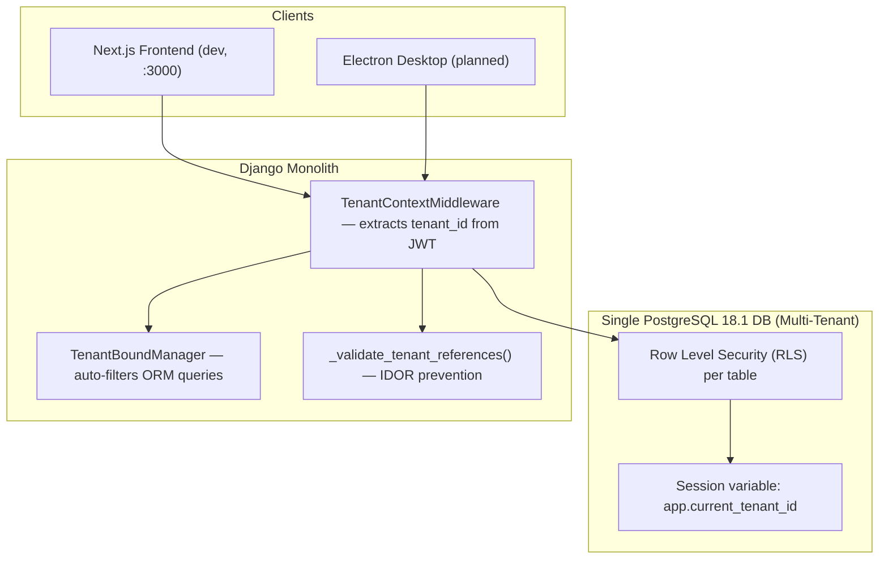
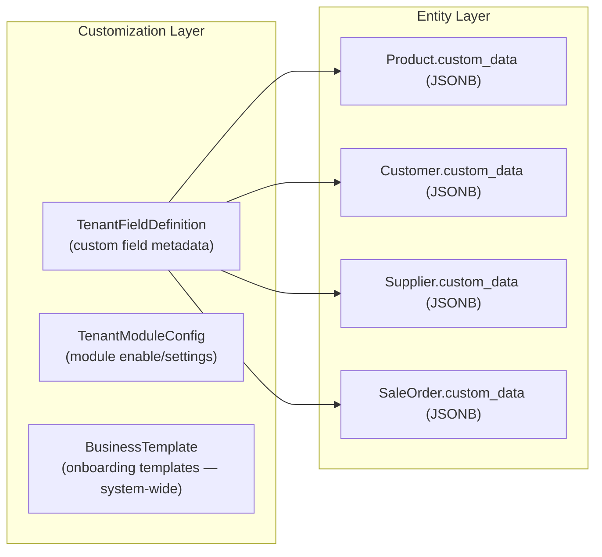
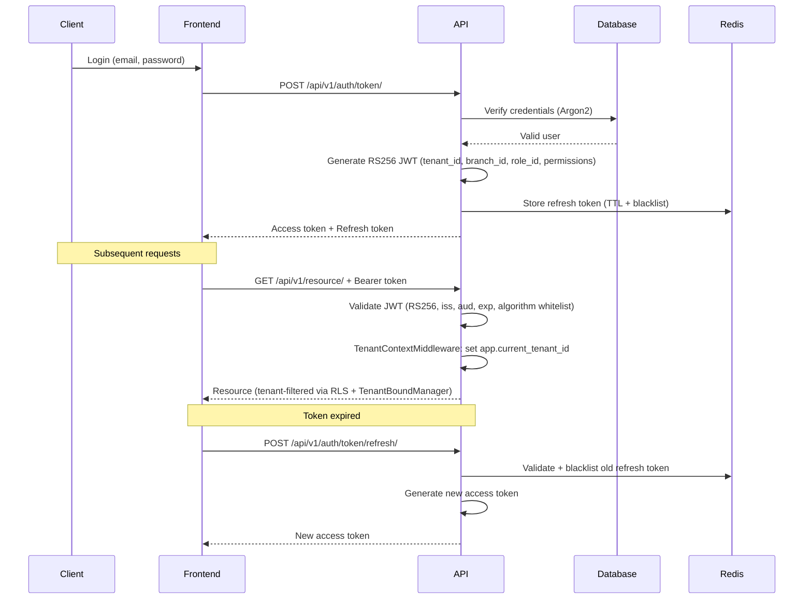
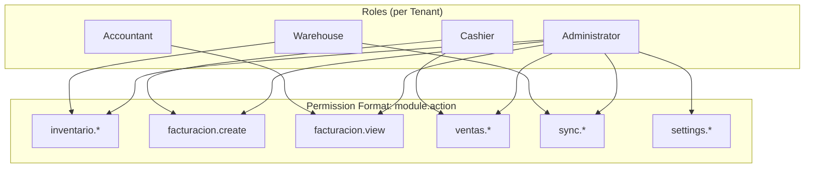
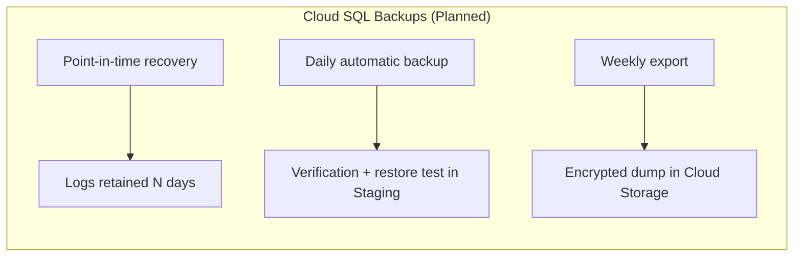
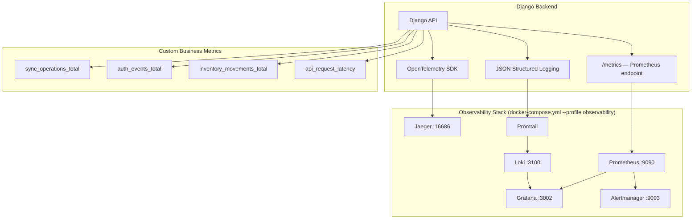

# Low-Level Design (LLD) - Gravitea ERP

## 1. Document Metadata
| Field | Value |
| --- | --- |
| **Owner** | Tech Lead |
| **Implementation** | Backend Team, Infra/DevOps |
| **Version** | 1.4 |
| **Last Updated** | 2026-03-01 |
| **Status** | **Phase 1-25 Completed — Rust Acceleration Done — Vertical SaaS Research Phase** |
| **Related** | Data Model & Domain Model, High-Level Design (HLD), Development Workflow, Architecture Decision Records (ADR) |

### Implementation Summary (March 2026)
| Component | Status | Technical Details |
|:-----------|:-------|:------------------|
| **Django Backend** | ✅ Operational | Django 5.2.x, DRF 3.15+, 9 OpenAPI contracts, 79 paths, 137 operations |
| **Rust/PyO3 Acceleration** | ✅ Complete | 9 Rust modules (crypto, compute, export, observability, security, sync, arca, validation); PyO3 0.28, Maturin 1.12.4; 2-9x speedup with auto Python fallback |
| **PostgreSQL 18.1** | ✅ Operational | RLS active, multi-tenant (facturacion + ventas), TenantBoundManager |
| **AUTH Module** | ✅ Complete | JWT RS256, RBAC, Role/AppUser models, rate limiting; Rust crypto (018) |
| **INVENTARIO Module** | ✅ Complete | StockMovement immutable ledger, BranchStock snapshots, encrypted PII; Rust compute + export (019, 020) |
| **SYNC Module** | ✅ Complete | SyncSession, PendingOperation, Push/Pull, vector clocks; Rust merge engine (023) |
| **Observability** | ✅ Complete | Prometheus, Grafana, Jaeger, Loki; Rust hot-path for label sanitization (021) |
| **VENTAS Module** | ✅ Complete | Customer, SaleOrder (DRAFT→INVOICED), SaleOrderItem, nested routing |
| **FACTURACION Module** | ✅ Complete | ARCA WSAA/WSFEv1, CAE lifecycle, CAEA offline, fiscal QR; Rust IVA compute (019) + CAEA batch (024) |
| **Frontend Prototype** | ✅ Complete | Next.js 16 (App Router), 7 routes, shadcn/ui, TanStack Query v5 |
| **Tenant Customization** | ✅ Complete | JSONB custom_data, TenantFieldDefinition, TenantModuleConfig, BusinessTemplate; Rust field validator (025) |
| **API Contracts** | ✅ Complete | 9 OpenAPI specs via DRF Spectacular — auth, inventario, ventas, facturacion, sync, compras, core, reportes, customization |
| **COMPRAS Module** | ⚠️ Partial | Supplier model only — purchase order workflow not implemented |
| **REPORTES Module** | ⏳ Not started | Planned; Rust export engine available (020) |

**Current Metrics (March 2026)**:
- Test Functions: **~2,500+** (including 131 Rust integration tests across cargo + pytest)
- API Endpoints: **137 operations** across 79 paths (9 OpenAPI contracts)
- Database Migrations: **23** (auth:3, core:3, inventario:6, ventas:3, facturacion:3, sync:5)
- Rust Modules: **9** (crypto.rs, compute.rs, export.rs, observability.rs, security.rs, sync.rs, arca.rs, validation.rs + lib.rs)
- Python: **3.14.3** | Django: **5.2.x** | Rust: **1.93.1** | PyO3: **0.28** | Maturin: **1.12.4**

## 2. Django Backend and Cloud Run Services

### 2.1 Service Decomposition

**Current Implementation**: The backend runs as a **single modular Django monolith** with all modules in one Django project. The architecture is designed to support future decomposition into Cloud Run services.

**Current Implementation (February 2026)**:
- Single Django service exposing all endpoints under `/api/v1/`
- Celery workers configured (Redis broker) for async task processing
- All modules (auth, core, inventario, ventas, facturacion, sync) run in one process
- Ready for separation into Cloud Run services without code changes

**Planned Architecture (Production Target)**:
- `api-core`: REST APIs for Inventory, Customers, Sales, Configuration.
- `api-sync`: Specialized endpoints for offline synchronization.
- `api-auth`: Authentication, token issuance/rotation, session management.
- `jobs-worker`: Async workers (Celery tasks, Pub/Sub/Cloud Tasks).

### 2.2 Internal Layers (Django + Rust)

The internal design follows a clear layer separation:

- **Models (domain/data)**: ORM models aligned with `Data Model & Domain Model.md`.
- **Services**: orchestrate business rules (e.g., emit comprobante, adjust stock).
- **Serializers / DTOs**: define input/output contract.
- **Views / ViewSets**: connect HTTP with domain services.
- **Permissions**: custom DRF permission classes using JWT claims.
- **Rust Dispatchers (`*_engine.py`)**: Python modules that auto-detect Rust availability and dispatch CPU-bound operations to native code. Each dispatcher has a `_USE_RUST` flag and a threshold (e.g., >5 fields, >10 batch items) below which Python fallback executes directly. See Section 2.4.

### 2.3 Rust/PyO3 Acceleration Layer (Features 017-025)

The Rust acceleration layer provides native-speed implementations for CPU-bound hot paths. All Rust code lives in `rust/gravitea-core/src/` and is compiled via Maturin into a Python wheel (`gravitea_rust`).

**Architecture Pattern (Dispatcher)**:

```
Python caller → *_engine.py (dispatcher) → try gravitea_rust.fn()
                                          → except: Python fallback + warning log
```

**Module Inventory**:

| Rust Module | Source | Python Dispatcher | Spec | Key Functions | Speedup |
|:------------|:-------|:------------------|:-----|:--------------|:--------|
| `crypto.rs` | 018 | `crypto_engine.py` → `utils.py` | 018 | `encrypt_value`, `decrypt_value`, `compute_blind_index` | 8.7x |
| `compute.rs` | 019 | `compute_engine.py` | 019 | `validate_importes`, `validate_iva_breakdown`, `calculate_iva_breakdown`, `validate_cuit`, `aggregate_stock_levels` | 2.1-4.4x |
| `export.rs` | 020 | `export_engine.py` | 020 | `generate_csv`, `generate_xlsx` | <2s/10K rows |
| `observability.rs` | 021 | `observability_engine.py` → `metrics.py` | 021 | `normalize_path`, `sanitize_endpoint_label` | 2.6x |
| `security.rs` | 022 | `ssrf_engine.py` | 022 | `validate_url_safety`, `check_resolved_ip` | N/A (new) |
| `sync.rs` | 023 | `sync_engine.py` → `conflict_resolver.py` | 023 | `merge_most_complete`, `merge_most_complete_batch` | N/A (new) |
| `arca.rs` | 024 | `caea_engine.py` → `caea.py` | 024 | `build_caea_batch` | N/A (new) |
| `validation.rs` | 025 | `validation_engine.py` → `customization.py` | 025 | `validate_custom_fields` | <2ms |

**GIL Management**: Single-call functions (validation, crypto) hold the GIL. Batch functions (sync merge batch, data export) release via `py.detach()`.

**Docker**: Multi-stage build with `rust-builder` stage. Produces 188 KB wheel. 6.8s incremental build.

**Fallback Guarantee**: Every dispatcher catches `ImportError` and `RuntimeError`, logs a warning, and falls back to pure Python. Zero regressions confirmed across all specs.

### 2.4 Django Modules (Apps) — Current Status

| Module | Status | Summary |
|--------|--------|---------|
| **AUTH** (`apps/auth`) | ✅ Complete | JWT RS256 + RBAC + rate limiting + multi-tenant users |
| **CORE** (`apps/core`) | ✅ Complete | TenantBoundModel, RLS, encryption (Rust crypto 018), observability (Rust hot-path 021), SSRF validation (Rust security 022), health, customization (Rust validation 025) |
| **INVENTARIO** (`apps/inventario`) | ✅ Complete | Products, categories, suppliers (encrypted PII), price lists, stock movements (immutable ledger) |
| **VENTAS** (`apps/ventas`) | ✅ Complete | Customers, SaleOrder (DRAFT→INVOICED), SaleOrderItem, nested routing |
| **FACTURACION** (`apps/facturacion`) | ✅ Complete | ARCACredential, PuntoDeVenta, Comprobante (WSAA/WSFEv1), CAEA (Rust batch 024), fiscal QR |
| **SYNC** (`apps/sync`) | ✅ Complete | SyncSession, PendingOperation, push/pull/status, vector clocks; Rust merge engine (023) |
| **COMPRAS** | ⚠️ Partial | Supplier model in inventario only — PurchaseOrder workflow not implemented |
| **REPORTES** | ⏳ Not started | Planned before MVP |

`INSTALLED_APPS` order: django.contrib.*, rest_framework, rest_framework_simplejwt, rest_framework_simplejwt.token_blacklist, django_filters, drf_spectacular, corsheaders, apps.core, apps.core.observability, apps.auth, apps.inventario, apps.sync, apps.facturacion, apps.ventas.

## 3. Data Architecture and Multi-Tenancy

### 3.1 Relationship with Data Model

The physical design of the data model (tables, constraints, RLS) is defined in `Data Model & Domain Model.md`, which acts as the **single source of truth**. This LLD describes how services and infrastructure use that model.

- All Django services access a single PostgreSQL 18.1 database.
- Tenant isolation uses a **Defense-in-Depth** strategy (see ADR-003 in `Architecture Decision Records (ADR).md`).

### 3.2 Multi-Tenant Topology



**Defense-in-Depth Layers**:
- Layer 1 (ORM): `TenantBoundManager` auto-filters all ORM queries by `tenant_id`.
- Layer 2 (DB): PostgreSQL RLS with `app.current_tenant_id` session variable (`SET LOCAL`).
- Layer 3 (Validation): `_validate_tenant_references()` on all FK writes.

**RLS Coverage**:
- Direct RLS (SQL policies): facturacion, ventas modules.
- TenantBoundManager (ORM): auth, inventario, sync, core modules.

### 3.3 Tenant Customization Layer

The tenant customization framework (Feature 014) adds an extensibility layer on top of the base models:



- `TenantFieldDefinition` defines 6 field types: text, integer, decimal, boolean, date, select.
- `CustomFieldsMixin` (DRF serializer) validates and manages `custom_data` on serialization.
- `BusinessTemplate` is system-wide (no `tenant_id`) — used for tenant onboarding.

## 4. Offline-First Synchronization Design

### 4.1 Local ↔ Cloud Data Mapping

**In the cloud (Implemented)**:
- `POST /sync/push/`: batch idempotent push with client-generated UUIDs.
- `GET /sync/pull/`: cursor-based pull with entity filtering.
- `GET /sync/sessions/`: synchronization session management.
- `GET /sync/status/{device_id}/`: device status + pending/conflict counts.

**Conflict resolution**:
- Vector clocks (`SyncSession.sync_vector`) for conflict detection.
- Server authoritative: `PendingOperation` ends in `APPLIED` or `CONFLICTED` status.
- Client retry logic with exponential backoff and configurable limits.
- **Rust merge engine** (spec 023): `merge_most_complete` for single payloads, `merge_most_complete_batch` for batch with GIL release. Dispatcher threshold: field_count >= 20 → Rust, < 20 → Python. Both produce identical merge_log entries.

### 4.2 Sync Technical Flow

- `SyncPushView`: validates integrity (references to products/customers) before persisting.
- `StockMovement` and `Comprobante` ledger tables are updated atomically.
- `PendingOperation` tracks each client operation with full payload and retry state.

**Local client (Planned — Electron)**:
- Encrypted SQLite (`SQLCipher`) with subset of server tables.
- `_queue` local tables for offline transactions before upload.

## 5. Security and Authentication

### 5.1 JWT Authentication Flow



**LLD Details**:
- Access tokens: short-lived (15–30 min).
- Refresh tokens: stored in Redis with TTL, mandatory rotation on each use (blacklisting via `rest_framework_simplejwt.token_blacklist`).
- Algorithm: RS256 only. HS256/HS384/HS512 are explicitly forbidden (algorithm whitelist).
- Custom claims: `tenant_id`, `branch_id`, `role_id`, `permissions`.
- Rate limiting: 3-tier on login (5/min → 3/min → 15min lockout after 5 failures).

### 5.2 RBAC Permission Model



**Implementation**:
- `Role.permissions` is a `JSONField` storing a list of `module.action` strings.
- `TenantContextMiddleware` sets tenant context from JWT.
- Custom DRF permission classes check `request.auth.payload['permissions']` against the required permissions.

## 6. Deployment, CI/CD, and Operations

### 6.1 CI/CD Pipeline and Deployment

```mermaid
graph TB
    subgraph "Development"
        DEV["Local Dev (Docker Compose)"]
    end

    subgraph "CI/CD Pipeline (Planned)"
        GIT[GitHub] --> CI[GitHub Actions]
        CI --> TEST[Test Suite (~2500+ tests)]
        TEST --> RUST_BUILD["Build Rust Wheel (Maturin)"]
        RUST_BUILD --> BUILD["Build Docker Backend/Frontend"]
        BUILD --> PUSH[Push to Artifact Registry]
        PUSH --> DEPLOY["Deploy Cloud Run Backend/Frontend (Planned)"]
        DEPLOY --> MIGRATE[Execute migrations on Cloud SQL]
    end

    subgraph "Production on Google Cloud (Planned)"
        CR[Cloud Run Services]
        SQL["Cloud SQL PostgreSQL 18.1"]
        MEMO["Memorystore Redis"]
    end

    DEPLOY --> CR
    MIGRATE --> SQL
    CR --> MEMO
```

**Current state**: CI/CD pipeline is planned. Local development uses Docker Compose with profiles.
**External test runner**: `scripts/run-tests-external.sh` provides 96% token savings for AI agent workflows (see `Development Workflow.md`).

### 6.2 Docker Compose — Current Setup

A single root `docker-compose.yml` with profiles replaces the previous multi-file setup:

| Profile | Services |
|---------|---------|
| (default) | postgres, redis, web, frontend |
| `prod` | + frontend-prod |
| `observability` | + prometheus, grafana, jaeger, loki, promtail, alertmanager |
| `test` | + postgres-test, redis-test, web-test, jaeger-test, prometheus-test |
| `load` | + locust |

Start local development: `docker compose up`
Start with observability: `docker compose --profile observability up`
Seed data: `docker compose exec web python manage.py seed_all`

### 6.3 Backup and Recovery Strategy



- PITR activated with retention window per agreed SLA (planned for production).
- Local development: `docker compose exec postgres pg_dump` for manual backups.

## 7. Monitoring and Observability ✅ IMPLEMENTED

### 7.1 Monitoring Stack — Current Implementation (February 2026)



**Implemented Components**:
- **Prometheus + django-prometheus**: HTTP, DB, cache metrics + custom business metrics.
- **Grafana**: Operational dashboards with tenant variables.
- **Jaeger + OpenTelemetry**: Distributed tracing with `trace_id` propagation via `TraceMiddleware`.
- **Loki + Promtail**: Log centralization with structured JSON logging.
- **Alertmanager**: Alert routing configuration.
- **11 files** in `backend/apps/core/observability/`: metrics.py (imports from Rust observability_engine.py), tracing.py, logging.py, alerts.py, business_metrics.py, uptime.py + config files.
- **Rust hot-path** (spec 021): `normalize_path` and `sanitize_endpoint_label` dispatched to `observability.rs` with 24 compiled `LazyLock<Regex>` patterns (2.6x speedup on label sanitization).

**Local Access**:
- Grafana: `http://localhost:3002` (admin/admin)
- Prometheus: `http://localhost:9090`
- Jaeger: `http://localhost:16686`

**Configuration location**: `docker-compose.yml` (root, `--profile observability`). Previous `backend/docker-compose.observability.yml` has been consolidated into the root file.

### 7.2 Technical and Business KPIs

- **Technical KPIs**:
  - Backend uptime > 99.9%.
  - P95 latency of critical APIs < 200 ms.
  - Global error rate < 0.1%.
  - Fiscal service failures generate alerts within 1 minute.
  - Synchronization failures logged with: tenant_id, branch_id, operation, error_trace, timestamp.
  - Security events (failed auth, IDOR attempts) generate real-time alerts.
- **Business KPIs**:
  - Average billing time per comprobante (ARCA CAE acquisition).
  - Stock accuracy (physical vs. system) > 95%.
  - CAEA offline invoicing availability.

## 8. Relationship with HLD and Other Documents

- This LLD deepens **how to implement** what is defined in `High-Level Design (HLD).md`.
- The detailed data model (entities, ERD, field definitions) is found in `Data Model & Domain Model.md`.
- API surface (endpoint contracts, error schemas) is in `REST API Design.md` and the generated OpenAPI specs.
- `Development Workflow.md` defines testing, quality practices, and the speckit development workflow.
- `Architecture Decision Records (ADR).md` documents WHY key technical decisions were made — see ADR-015 (Rust/PyO3 Acceleration) and ADR-016 (Vertical SaaS Pivot Research).
- `Deployment & Infrastructure Guide.md` covers the full Docker Compose setup (including Rust multi-stage build) and planned GCP infrastructure.
