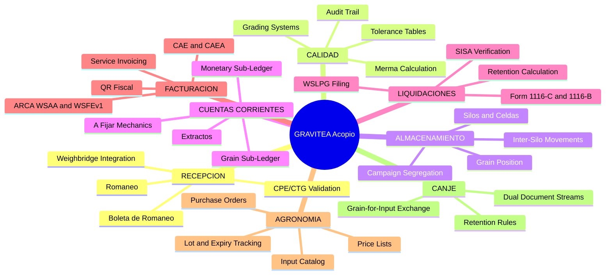
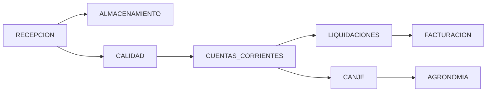
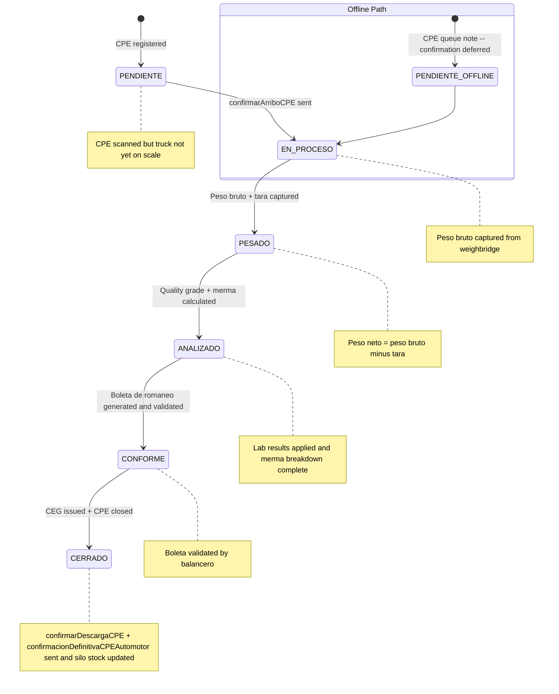
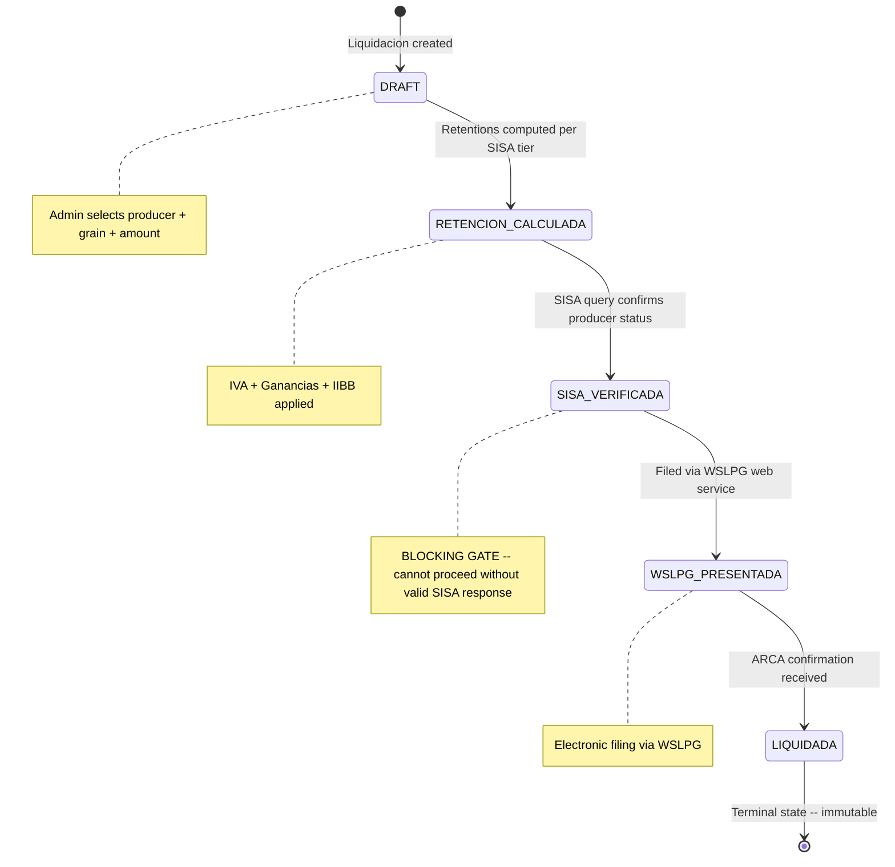
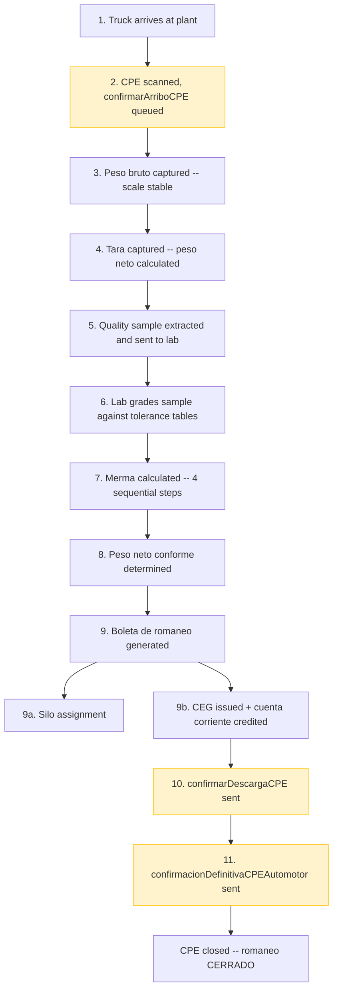
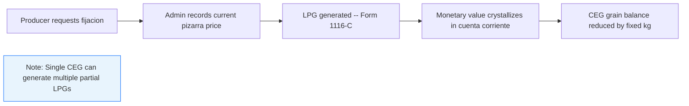
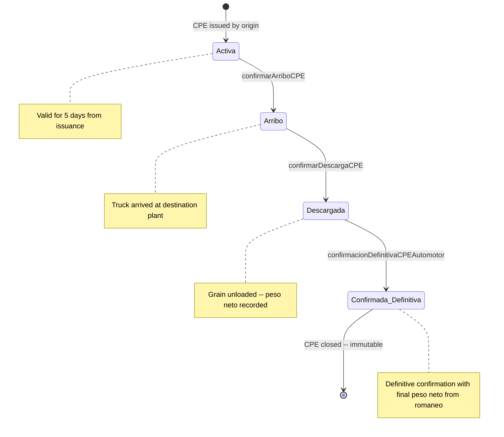

# Product Requirements Document (PRD) -- GRAVITEA ERP

## 1. Metadata

| Field | Value |
|:------|:------|
| **Version** | 1.0 |
| **Date** | 2026-03-16 |
| **Status** | Acopio de Granos Vertical -- Active Development |
| **Owner** | Product Owner |
| **Implementation** | Tech Lead, Dev Team, AI Agents |
| **Cross-Reference** | See [Section 10](#10-implementation-foundation) for full implementation progress and existing infrastructure |
| **Upstream Document** | Product Vision & Scope v1.0 (strategic context, market sizing, pricing, go-to-market) |
| **Technical References** | `High-Level Design (HLD).md`, `Deployment & Infrastructure Guide.md`, `Software Requirements Specification (SRS).md` |

---

## 2. Introduction and Glossary

This document is the functional specification for GRAVITEA ERP -- a multi-tenant, offline-first Enterprise Resource Planning system purpose-built for Argentine grain stockpiling operations (acopio de granos). It translates the strategic vision defined in the Product Vision & Scope v1.0 into prescriptive, implementable requirements: module specifications, state machines, data capture rules, regulatory compliance gates, and acceptance criteria. The development team and AI agents MUST be able to implement every feature described herein without consulting additional sources. Strategic content -- market sizing, pricing model, competitive analysis, and go-to-market strategy -- resides exclusively in the Vision document and is not duplicated here.

**Primary audience**: Development team and AI agents. **Secondary audience**: Product Owner.

### 2.1 Canonical Glossary

| Term (Spanish) | English | Definition |
|:----------------|:--------|:-----------|
| **romaneo** | weighing ticket | The complete reception document generated when a truck is weighed, sampled, and graded at the acopio plant. Ground-truth record of peso bruto, tara, quality, and merma. |
| **merma** | grain loss / shrinkage | Sequential deductions applied to raw peso neto to account for drying, sieving, handling, and volatile losses. |
| **acopiador** | grain collection operator | The enterprise that receives, stores, conditions, and commercializes grain on behalf of producers. |
| **balancero / recibidor** | scale operator | Front-line operator who processes truck arrivals through the romaneo cycle. |
| **laboratorista** | lab analyst | Operator who grades grain samples using tolerance tables and determines quality parameters. |
| **boleta de romaneo** | reception document | The printed or digital document summarizing all romaneo data for the producer. |
| **CEG** | Certificado de Existencia de Granos | Grain deposit certificate -- formal proof of grain held in storage on behalf of a producer. |
| **LPG** | Liquidacion Primaria de Granos (Form 1116-C) | The legally binding electronic fiscal settlement document for primary grain transactions (acopiador to producer). |
| **CPE** | Carta de Porte Electronica | Electronic waybill -- mandatory digital document authorizing grain transit via truck. |
| **CTG** | Codigo de Trazabilidad de Granos | Grain traceability code -- embedded authorization code within each CPE. |
| **SISA** | Registro Sistemico (RG 5689/2025) | Producer compliance registry replacing RUCA. Determines withholding tier (Estado 1/2/3). 24h grain movement registration required. |
| **WSLPG** | Web Service Liquidaciones Primarias de Granos | ARCA web service for electronic filing of Form 1116-B/C liquidaciones. |
| **WSCPE** | Web Service Carta de Porte Electronica | ARCA web service for CPE lifecycle management (arrival confirmation, definitive confirmation). |
| **pizarra** | market board price | Reference price per ton or quintal published by the local Bolsa de Comercio, used for fijacion events. |
| **fijacion** | price-crystallization event | The moment a producer requests conversion of "a fijar" grain into a monetary value at current pizarra. |
| **cuenta corriente** | producer current account | Dual-ledger account per producer: grain sub-ledger (kg by type and campaign) + monetary sub-ledger (ARS/USD). |
| **posicion consolidada** | cross-plant consolidated position | Derived view aggregating per-plant balances for the same producer CUIT across all plants of a tenant. |
| **canje** | grain-for-input exchange | Transaction where a producer's grain credit is exchanged for agricultural inputs (seeds, fertilizers, chemicals). |
| **zarandeo** | sieving | Physical cleaning process that removes foreign matter; triggers a weight deduction (merma de zarandeo). |
| **secado** | drying | Conditioning process that reduces moisture to base level; triggers a weight deduction (merma de secado). |
| **manipuleo** | handling | Fixed percentage deduction for physical grain degradation during mechanical handling through facility equipment. |
| **volatil** | volatile moisture | Fixed percentage deduction for invisible losses (dust, abrasion) during unloading. |
| **paritaria** | inbound handling fee | Fee charged to the producer for reception and conditioning services at the plant. |
| **campana** | campaign / crop year | Split-year identifier for grain segregation (e.g., "2025/26"). Mandatory for all storage and accounting operations. |

---

## 3. Functional Decomposition

### 3.1 Module Architecture



### 3.2 Implementation Status

| Modulo | Estado | Feature Branch | Notas |
|:-------|:-------|:---------------|:------|
| Ventas | ✅ Completo | `001-sal-invo-inve-backend` | Ciclo DRAFT→CONFIRMED→INVOICED |
| Inventario | ✅ Completo | `001-sal-invo-inve-backend` | Ledger inmutable, BranchStock |
| Facturacion ARCA | ✅ Completo | `001-sal-invo-inve-backend` | WSAA + WSFEv1, CAE/CAEA, QR fiscal |
| Clientes | ✅ Completo | `001-sal-invo-inve-backend` | ABM, custom_data, listas de precios |
| Sincronizacion | ✅ Completo | `001-sal-invo-inve-backend` | Push/Pull idempotente, conflictos |
| Plataforma (Auth) | ✅ Completo | `001-sal-invo-inve-backend` | JWT RS256, RBAC, RLS, rate limiting |
| Personalizacion | ✅ Completo | `014-tenant-customization` | 6 tipos campo, module config, templates |
| Rust Bootstrap | ✅ Completo | `017-rust-bootstrap` | PyO3 0.28, Maturin 1.12.4, Docker rust-builder |
| Rust Crypto | ✅ Completo | `018-rust-crypto` | AES-256-GCM 8.7x, HMAC blind index 8.8x |
| Rust Fiscal Compute | ✅ Completo | `019-rust-fiscal-compute` | IVA 4.4x, CUIT 3.1x, importes 2.7x, stock 2.1x |
| Rust Data Export | ✅ Completo | `020-rust-data-export` | CSV (UTF-8 BOM) + XLSX; openpyxl fallback |
| Rust Observability | ✅ Completo | `021-rust-observability-hotpath` | Sanitize endpoint labels 2.6x |
| Rust SSRF Security | ✅ Completo | `022-ssrf-validation-pipeline` | 83-entry adversarial corpus, 10 CIDR ranges |
| Rust Sync Merge | ✅ Completo | `023-rust-sync-conflict` | most-complete-wins merge; GIL-released batch |
| Rust ARCA Batch | ✅ Completo | `024-rust-arca-batch` | CAEA batch builder via serde_json |
| Rust Field Validation | ✅ Completo | `025-rust-custom-field-validator` | 6 tipos; dispatcher threshold >5 |
| API Audit | ✅ Completo | `025-rust-custom-field-validator` | 9 contratos, 79 paths, 154 schemas |
| Compras | Parcial | `001-sal-invo-inve-backend` | Proveedores OK; ordenes pendientes |
| Reportes | No iniciado | -- | Planificado; export engine Rust disponible (020) |

### 3.3 Module Dependency Graph



---

## 4. Module Specifications

### 4.1 RECEPCION

**Purpose**: Process every arriving truck through the complete romaneo cycle -- from CPE validation to CEG issuance -- in under 5 minutes during harvest peak.

**Feature List**:
- Truck reception with CPE/CTG scanning and validation via WSCPE
- Peso bruto and tara capture directly from weighbridge (RS-232 / TCP-IP)
- Automatic peso neto calculation (peso bruto minus tara)
- Quality sample initiation and lab handoff
- Boleta de romaneo generation (digital + print)
- Complete offline mode with CPE confirmation store-and-forward queue
- Campaign year assignment per romaneo

**Romaneo State Machine**:



**Data Capture Requirements**:

| Step | Fields Captured | Source | Offline Behavior |
|:-----|:----------------|:-------|:-----------------|
| CPE Registration | CPE number, CTG, grain type code, campana, producer CUIT, origin plant | WSCPE scan or manual entry | CPE stored locally; confirmarArriboCPE queued for later transmission |
| Truck Identification | Truck plate (chasis), trailer plate (acoplado), driver DNI, transport CUIT | Manual entry or OCR (Phase 3) | Fully offline |
| Peso Bruto | Peso bruto (kg), timestamp, scale ID | Weighbridge RS-232 auto-capture | Fully offline -- scale is local hardware |
| Tara | Tara (kg), timestamp, scale ID | Weighbridge RS-232 auto-capture | Fully offline |
| Peso Neto | Peso neto = peso bruto minus tara | Calculated | Fully offline |
| Quality Analysis | Humidity, foreign matter, damaged kernels, broken kernels, test weight, protein, plus grain-specific params | Lab instruments + manual entry | Fully offline |
| Merma Breakdown | zarandeo %, secado %, manipuleo %, volatil %, intermediate weights | Calculated per CAC Circular 10/86 formula | Fully offline |
| Silo Assignment | Silo/celda ID, lot identifier | Operator selection | Fully offline |
| Peso Neto Conforme | Final adjusted weight after all merma deductions | Calculated | Fully offline |
| Boleta Generation | All above fields consolidated | System-generated document | Fully offline |
| CPE Closure | confirmarDescargaCPE, confirmacionDefinitivaCPEAutomotor | WSCPE web service | Store-and-forward -- queued until connectivity restores |

**Offline Behavior**: The romaneo completes entirely offline. CPE confirmation calls (confirmarArriboCPE, confirmarDescargaCPE, confirmacionDefinitivaCPEAutomotor) are queued in a store-and-forward buffer and transmitted when connectivity restores. Conflict resolution for romaneo data is additive -- concurrent romaneos from different devices are merged, never overwritten.

**Boleta de Romaneo Digital Fields**: Document number, date/time, producer CUIT and razon social, CPE/CTG reference, grain type and campana, peso bruto/tara/neto, full quality parameters, merma breakdown (4 steps with intermediate weights), peso neto conforme, silo assignment, operator signature.

**User Stories -- Balancero/Recibidor**:

**US-R01**: Truck processed in under 5 minutes during harvest peak.
- **Given** a truck arrives at the plant during harvest peak (100+ trucks/day)
- **When** the balancero scans the CPE, captures peso bruto, captures tara, and the lab returns quality results
- **Then** the system generates the boleta de romaneo with peso neto conforme in under 5 minutes total elapsed time, and the truck exits the facility

**US-R02**: Romaneo continues when internet is down.
- **Given** the plant has lost internet connectivity
- **When** the balancero initiates a new romaneo for an arriving truck
- **Then** the system completes all steps (CPE registration, weighing, quality, merma, boleta, silo assignment, account credit) offline, queues CPE confirmation for later transmission, and displays no blocking error to the operator

**US-R03**: Weighbridge auto-captures peso bruto and tara.
- **Given** the weighbridge is connected via RS-232 and the truck is on the scale
- **When** the scale signals a stable reading
- **Then** the system automatically captures the weight value without manual transcription, records the timestamp and scale ID, and the balancero confirms with a single action

### 4.2 CALIDAD

**Purpose**: Grade grain samples using per-grain tolerance tables and calculate merma with full audit trail, producing quality determinations that are transparent and defensible.

**Quality Parameters by Grain Type**:

| Parameter | Trigo (15) | Maiz (19) | Soja (23) | Girasol (2) | Sorgo (22) |
|:----------|:-----------|:----------|:----------|:------------|:-----------|
| Humedad base (%) | 14.0 | 14.5 | 13.5 | 11.0 | 15.0 |
| Hf for merma calc (%) | 13.5 | 13.5 | 13.0 | 10.5 | 13.5 |
| Materias extranas base (%) | 1.0 | 1.0 (G1) | 1.0 | 1.0 | 1.0 |
| Granos danados base (%) | 1.0 | 3.0 (G1) | 1.0 | 1.0 | 3.0 |
| Granos quebrados base (%) | 1.0 | 2.0 (G1) | 5.0 | -- | 2.0 |
| Peso hectolitrico base (kg/hl) | 79 (G1) | 75 (G1) | -- | -- | -- |
| Proteina base (%) | 11.0 | -- | -- | -- | -- |

**Grading Systems**:

| System | Applies To | Classification | Commercial Effect |
|:-------|:-----------|:---------------|:------------------|
| Grado scale (1/2/3) | Cereales: trigo, maiz, sorgo | Grado 1 = bonificacion (premium); Grado 2 = base (no adjustment); Grado 3 = rebaja (deduction) | Grade determines price adjustment per ton |
| Tolerance-based progressive rebajas | Oleaginosas: soja, girasol | No Grado scale; each parameter exceeding tolerance triggers progressive percentage rebajas | Deductions accumulate per parameter excess |
| Fuera de Estandar | All grains | Any parameter exceeding maximum receivable tolerance | Buyer may apply discretionary discounts or reject the load |

**Merma Formula** (CAC Circular 10/86 + Resolucion JNG N. 22027/81):

```
Peso_final = Peso_bruto x (1 - %Z) x (1 - %S) x (1 - %M) x (1 - %V)
```

Sequential multiplicative application -- each merma is calculated on the result of the previous step:

1. **Zarandeo (%Z)**: Excess foreign matter above tolerance, expressed as percentage
2. **Secado (%S)**: `%S = (Hi - Hf) / (100 - Hf)` where Hi = incoming humidity, Hf = base humidity per grain type (see Hf column in quality table)
3. **Manipuleo (%M)**: Fixed -- trigo 0.10%, maiz 0.25%, soja 0.25%, girasol 0.20%, sorgo 0.25%
4. **Volatil (%V)**: Fixed -- cereales (trigo/maiz/sorgo) 0.30%, oleaginosas (soja/girasol) 0.50%

All weight fields MUST use DECIMAL(17,3) precision.

**Audit Trail**: The system MUST store all quality inputs, the tolerance table version applied, and the complete merma breakdown (4 steps with intermediate weights) per romaneo. On-demand export to CSV/XLSX is available via the Rust data export engine (feature 020). Formal quality disputes are escalated externally to the Camara Arbitral de Cereales (CAC) -- the system provides the audit data package for submission.

**User Stories -- Laboratorista**:

**US-Q01**: Grade a sample using per-grain tolerance tables.
- **Given** a grain sample arrives at the lab tagged with romaneo ID and grain type
- **When** the laboratorista enters the measured quality parameters (humidity, foreign matter, damaged kernels, etc.)
- **Then** the system applies the correct tolerance table for that grain type, determines the commercial grade (Grado 1/2/3 for cereales, or tolerance-based rebajas for oleaginosas), and displays bonificaciones and rebajas

**US-Q02**: Automated merma shows all 4 sequential steps with intermediate weights.
- **Given** a romaneo with peso neto of 30,000 kg and humidity of 16.5% for maiz
- **When** the system calculates merma
- **Then** the system displays: (1) peso after zarandeo, (2) peso after secado with the %S formula and Hi/Hf values, (3) peso after manipuleo at 0.25%, (4) peso neto conforme after volatil at 0.30%, each showing the intermediate weight to DECIMAL(17,3)

**US-Q03**: Export full audit trail per romaneo for CAC dispute submission.
- **Given** a producer disputes the quality determination for a specific romaneo
- **When** the administrador requests the audit export
- **Then** the system generates a CSV/XLSX file containing all raw quality inputs, the tolerance table version, the 4-step merma breakdown with intermediate weights, the final peso neto conforme, and the operator who performed the grading

### 4.3 ALMACENAMIENTO

**Purpose**: Track grain position (what grain, where stored, whose grain) with campaign-year segregation and real-time occupancy.

**Feature List**:
- Silo/celda management: identifier, type (vertical silo, horizontal celda, wet bin), capacity in tons, current occupancy by lot
- Grain assignment rules by type, quality grade, and campana
- Grain position report: what grain, in which silo, belonging to which producer, by campana
- Campaign year logical segregation using composite key `(plant_id, grain_code, campaign_id)` per RG 3593
- Inter-silo movements with full audit trail
- Cubicaje (volumetric estimation) support for physical reconciliation
- All storage operations work fully offline
- Campaign transition workflow: see Section 5.3 (cross-reference T033)

**Operational Rules**:
- The system MUST NOT allow mixing different grain types in the same silo unless explicitly overridden by an authorized operator with audit logging.
- The system MUST track occupancy as a running total derived from romaneo deposits and outbound movements (ledger pattern -- append-only).
- The system MUST segregate grain by campana -- grain from campana 2024/25 and 2025/26 MUST be tracked separately even if physically co-located.

**Offline Behavior**: All storage operations -- silo assignment, inter-silo transfers, position queries -- work fully offline. Conflict resolution for silo stock is last_write_wins with audit trail.

### 4.4 CUENTAS CORRIENTES

**Purpose**: Maintain the dual-ledger producer current account that is the financial backbone of every acopio operation.

**Dual-Ledger Architecture**:
- **Grain sub-ledger** (per plant): kilograms by grain type and campana. This is the source of truth.
- **Monetary sub-ledger** (per plant): ARS and USD balances.
- Per-plant ledger is the authoritative record. Posicion consolidada is a derived cross-plant view.

**Transaction Type Catalog**:

| Type | Grain Effect (kg) | Monetary Effect | Trigger |
|:-----|:-------------------|:----------------|:--------|
| CEG deposit | +kg | -- | Romaneo CERRADO (peso neto conforme credited) |
| LPG sale (1116-C) | -kg | +ARS | Liquidacion filed via WSLPG |
| Fijacion | -kg (valued) | +ARS at pizarra | Producer requests price crystallization |
| Retiro (withdrawal) | -kg | -- | Producer withdraws physical grain |
| Service charges | -- | -ARS | Secado, zarandeo, almacenaje, paritaria fees |
| Canje grain debit | -kg | -- | Grain component of canje operation |
| Canje input credit | -- | +ARS (net) | Input component of canje operation |
| Retention deduction | -- | -ARS | IVA, Ganancias, IIBB withholdings per liquidacion |

**"A Fijar" Mechanics**: Grain deposited via CEG carries zero monetary value until the producer requests a fijacion. At fijacion, the administrador records the current pizarra price. The system generates an LPG (Form 1116-C) and the monetary value crystallizes in the cuenta corriente. A single CEG can generate multiple partial LPGs -- the system MUST track the remaining unfixed balance.

**Posicion Consolidada**: A cross-plant derived view (NOT stored) that aggregates per-plant kg and monetary balances for the same producer CUIT across all plants of the same tenant. Visible only to the Dueno/Gerente role. The system MUST NOT use posicion consolidada as a source of truth -- it is always recalculated from per-plant ledgers.

All financial fields MUST use DECIMAL(17,3).

**Extracto (Statement)**: The system MUST generate account statements filterable by grain type, campana, date range, and transaction type.

**User Stories -- Dueno/Gerente**:

**US-D01**: Real-time grain position from mobile across all plants.
- **Given** the dueno is away from the plant and accesses the system from a mobile device
- **When** they navigate to the grain position dashboard
- **Then** the system displays current grain inventory by type, campana, and silo for every plant they manage, with data no older than the last sync cycle

**US-D02**: Posicion consolidada -- aggregated balance per producer across all plants.
- **Given** a producer deposits grain at Plant A and Plant B
- **When** the gerente views the posicion consolidada for that producer
- **Then** the system displays the combined kg balance by grain type and campana across both plants, clearly labeled as a derived view, alongside the per-plant breakdown

**US-D03**: Harvest throughput monitoring.
- **Given** the plant is operating during harvest season
- **When** the dueno accesses the throughput dashboard
- **Then** the system displays trucks processed per hour for the current day at each plant, compared against the campaign average, updated in real-time or at last sync

### 4.5 LIQUIDACIONES

**Purpose**: Generate Form 1116-C (Liquidacion Primaria: acopiador to producer) and Form 1116-B (Liquidacion Secundaria: acopiador to buyer) with automatic SISA-tier retention calculation and WSLPG electronic filing.

**Liquidacion Lifecycle**:



**SISA-Tier Retention Tables**:

**IVA Retention** (RG 2300/2007, SISA-linked):

| SISA Estado | IVA Retention Rate | Base |
|:------------|:-------------------|:-----|
| Estado 1 (Riesgo Bajo) | 5% | Taxable IVA base |
| Estado 2 (Riesgo Medio) | 8% | Taxable IVA base |
| Estado 3 (Riesgo Alto) | 10.5% | Taxable IVA base |
| Non-registered / suspended | 16% | Taxable IVA base |

**Ganancias Retention** (RG 4325/2018, grain-specific, replaces RG 2118/2006):

| SISA Estado | Ganancias Retention Rate | Base |
|:------------|:-------------------------|:-----|
| Estado 1 (Riesgo Bajo) | 0% | No retention |
| Estado 2 (Riesgo Medio) | 2% | Net amount subject to retention |
| Estado 3 (Riesgo Alto) | 15% | Net amount subject to retention |
| Non-registered | 30% | Net amount subject to retention |

**IIBB**: Provincial rate -- not a federal table. The system MUST support configurable provincial IIBB rates per producer domicile.

**SISA Pre-Liquidacion Blocking Gate**: The system MUST query SISA before every settlement. If the SISA query fails or returns an invalid/suspended status, the system MUST block the liquidacion from proceeding to WSLPG filing. This gate cannot be bypassed.

**SICORE Magnetic File**: The system MUST generate the SICORE magnetic file for monthly filing, consolidating all IVA and Ganancias retentions applied during the period.

**WSLPG Electronic Filing**: Form 1116-C and 1116-B are filed electronically via the WSLPG web service. References: RG 3419/2012, RG 3690/2014, RG 3691/2014.

**User Stories -- Administrador/Contable**:

**US-A01**: Liquidacion 1116-C auto-calculates SISA-tier retentions.
- **Given** the administrador creates a liquidacion for a producer in SISA Estado 2
- **When** the system calculates retentions
- **Then** IVA at 8% and Ganancias at 2% are applied automatically based on the producer's SISA tier, the breakdown is displayed, and the administrador can review before filing

**US-A02**: Generate SICORE magnetic file for monthly filing.
- **Given** the month has ended and retentions have been applied across multiple liquidaciones
- **When** the administrador requests SICORE generation
- **Then** the system produces the SICORE magnetic file containing all IVA and Ganancias retentions for the period, formatted per ARCA specifications, ready for upload

**US-A03**: SISA blocking gate prevents settlement when query fails.
- **Given** SISA web service is unreachable or returns an error
- **When** the administrador attempts to advance a liquidacion past the SISA verification step
- **Then** the system blocks the transition, displays a clear error message indicating SISA verification failed, and the liquidacion remains in RETENCION_CALCULADA state

**User Stories -- Contador Rural**:

**US-C01**: Real-time multi-client transaction visibility without requesting files.
- **Given** the contador rural manages 8 acopio clients on the GRAVITEA platform
- **When** they access the contador portal
- **Then** they see all liquidaciones, retentions, and account movements for each client in a unified dashboard, without needing to request Excel files by email

**US-C02**: One-click fiscal summary export for multiple acopio clients.
- **Given** the contador needs to prepare monthly fiscal summaries for their acopio clients
- **When** they select multiple clients and a date range
- **Then** the system exports a consolidated CSV/XLSX file per client containing all liquidaciones, retentions (IVA, Ganancias, IIBB), and SICORE-ready data

**US-C03**: Verify retention calculations against SICORE obligations.
- **Given** the contador is reviewing a client's monthly retention summary
- **When** they view the retention detail for a specific liquidacion
- **Then** the system displays the SISA estado at time of calculation, the rate applied, the base amount, and the retention amount, enabling the contador to verify correctness against the SICORE filing

### 4.6 FACTURACION

**Purpose**: Issue electronic invoices for acopio services using the existing ARCA infrastructure.

**Reuse Note**: The ARCA integration infrastructure (WSAA authentication + WSFEv1 invoice issuance) from feature branch `001-sal-invo-inve-backend` is reused unchanged. ARCACredential (AES-256-GCM encrypted certificates), Comprobante (immutable fiscal ledger), CAEA offline support, and QR fiscal generation are fully implemented.

**Acopio-Specific Service Types**:
- **Secada** (drying): per-ton tariff based on humidity differential
- **Zarandeo** (sieving): per-ton tariff based on foreign matter excess
- **Almacenaje** (storage): per-ton-per-month tariff
- **Paritaria** (handling): inbound reception fee per ton
- **Otros servicios**: configurable per tenant

**Invoice Types**: A (Responsable Inscripto to Responsable Inscripto), B (RI to Consumidor Final/Monotributo), C (Monotributo to any). Credit and debit notes supported.

**Modes**: CAE (online -- real-time ARCA authorization) and CAEA (offline -- pre-authorized fiscal code range for harvest-season continuity).

### 4.7 AGRONOMIA (Insumos)

**Purpose**: Manage the agricultural input catalog (seeds, fertilizers, agrochemicals, spare parts) for sales to producers and canje operations.

**Feature List**:
- Input catalog with categories: seeds, fertilizers, agroquimicos, repuestos
- SKU and lot tracking per item
- Discrete inventory (units, not kg) -- distinct from grain inventory
- Stock by lot and expiry date
- Purchase orders from distributors
- Sales to producers (direct or via canje)
- Price lists with effective-date support (SCD Type 2)

**Offline Behavior**: All insumos operations (inventory queries, stock adjustments, order creation) work fully offline.

### 4.8 CANJE

**Purpose**: Execute grain-for-input exchange operations where a producer's grain credit offsets agricultural input purchases.

**Operational Rules**:
- The system MUST generate two parallel document streams per canje: an LPG (grain component, IVA 10.5%) and a Factura (input component, IVA 21%).
- **Canje total** (full offset, no cash remainder): no withholding retentions apply.
- **Canje parcial** (partial offset with cash remainder): retentions apply only on the cash portion.
- All entries -- grain debit, input credit, retention deductions -- MUST be recorded in the producer's cuenta corriente as individual transactions.
- The grain component is valued at the current pizarra price at the time of the canje.

---

## 5. Operational Workflows

### 5.1 Romaneo Operational Flow



Steps 2, 10, and 11 (highlighted) require connectivity. If offline, these WSCPE calls are queued in the store-and-forward buffer and transmitted when connectivity restores. All other steps complete locally.

### 5.2 "A Fijar" Fijacion Flow



A producer with 100,000 kg deposited under a single CEG may request fijacion of 30,000 kg at today's pizarra, then 50,000 kg next week at a different pizarra. The system MUST track the remaining unfixed balance (20,000 kg) on the original CEG.

### 5.3 Campaign Transition

When a new campana begins, the administrador defines a new split-year code (e.g., "2026/27"). The system validates the format (YYYY/YY where the second component equals the first year plus one, abbreviated) and uniqueness within the tenant. Upon activation, all subsequent romaneos use the new campana code. Existing grain stored under the previous campana retains its original code -- it is never retroactively reassigned. The system generates a carry-stock report (stock carryover by grain type, silo, and producer from the previous campana) for AFIP regulatory purposes.

---

## 6. Regulatory Compliance

### 6.1 CPE/CTG

**CPE Lifecycle**:



**WSCPE Method Catalog**:

| Romaneo Step | WSCPE Method | Required Data | Offline Behavior |
|:-------------|:-------------|:--------------|:-----------------|
| Truck arrival | `confirmarArriboCPE` | CPE number, plant CUIT, arrival timestamp | Store-and-forward -- queued |
| Grain unloaded | `confirmarDescargaCPE` | CPE number, peso neto from romaneo | Store-and-forward -- queued |
| Definitive confirmation | `confirmacionDefinitivaCPEAutomotor` | CPE number, final peso neto conforme | Store-and-forward -- queued |

**Rules**: 1 CPE = 1 truck = 1 romaneo. CPE validity is 5 days from issuance (per RG 5017/2021 and subsequent amendments). After confirmacionDefinitivaCPEAutomotor, the CPE cannot be annulled. RG 5821/2026 links CPE issuance to SISA compliance status.

### 6.2 WSLPG

Form 1116-C (Liquidacion Primaria: acopiador to producer) and Form 1116-B (Liquidacion Secundaria: acopiador to buyer) are filed electronically via the WSLPG web service. SICORE magnetic file generation consolidates all retentions for monthly ARCA filing. Governing regulations: RG 3419/2012, RG 3690/2014, RG 3691/2014.

### 6.3 SISA

RG 5689/2025 establishes the Registro Sistemico (SISA), replacing the former RUCA registry. SISA assigns each registered operator an Estado (1, 2, or 3) that determines withholding rates. The system MUST:
- Query SISA before every liquidacion (blocking gate -- see Section 4.5)
- Register grain movements within 24 hours of reception
- Handle non-registered producers at the maximum retention tier (16% IVA, 30% Ganancias)

### 6.4 Retention Calculation Reference

**IVA Retention** (RG 2300/2007, SISA-linked):

| SISA Estado | Rate |
|:------------|:-----|
| Estado 1 (Riesgo Bajo) | 5% |
| Estado 2 (Riesgo Medio) | 8% |
| Estado 3 (Riesgo Alto) | 10.5% |
| Non-registered / suspended | 16% |

**Ganancias Retention** (RG 4325/2018, grain-specific):

| SISA Estado | Rate |
|:------------|:-----|
| Estado 1 (Riesgo Bajo) | 0% |
| Estado 2 (Riesgo Medio) | 2% |
| Estado 3 (Riesgo Alto) | 15% |
| Non-registered | 30% |

**IIBB**: Provincial rates -- not federally standardized. The system MUST support configurable per-province rates. IIBB is applied per the producer's registered fiscal domicile province.

These tables MUST match the retention tables in Section 4.5 exactly. Any regulatory update to these rates MUST be reflected in both locations simultaneously.

---

## 7. Hardware Integration

**Weighbridge Communication**:
- **Primary protocol**: RS-232 serial connection
- **Secondary protocol**: TCP/IP via RS-232-to-Ethernet converter (serial-to-network bridge device)
- The system MUST support both protocols concurrently across different scales at the same plant

**Dual-Scale Workflow**:
- Primary scale captures peso bruto (loaded truck)
- Secondary scale captures tara (empty truck)
- Peso neto is calculated automatically: peso bruto minus tara
- The system MUST NOT allow manual weight entry when a connected scale is operational -- auto-capture is mandatory

**Stability Detection**: Weight is captured only when the scale signals a stable reading. The system MUST NOT capture fluctuating readings. Scale read latency target: under 500ms from stability signal to captured value.

**Calibration Log**: The system MUST maintain a calibration log per scale recording: calibration date, technician, reference weight, measured weight, deviation, and next calibration due date.

**Detailed Specifications**: Baud rates, frame formats, parity settings, and protocol-specific implementation details are deferred to the Software Requirements Specification (SRS) document (spec-08c).

---

## 8. Non-Functional Requirements

### 8.1 Online/Offline Matrix

| Module | Offline Operations | Connectivity-Required Operations | Store-and-Forward Operations |
|:-------|:-------------------|:---------------------------------|:-----------------------------|
| RECEPCION | Romaneo processing, peso bruto/tara capture, boleta generation | -- | CPE confirmation (confirmarArriboCPE, confirmarDescargaCPE, confirmacionDefinitivaCPEAutomotor) |
| CALIDAD | Quality grading, merma calculation, audit trail recording | -- | -- |
| ALMACENAMIENTO | Silo assignment, inter-silo transfers, position queries, cubicaje | -- | -- |
| CUENTAS CORRIENTES | Account credit (CEG deposit), extracto generation, balance queries | Posicion consolidada (cross-plant aggregation requires sync) | -- |
| LIQUIDACIONES | Retention calculation (pre-computation) | SISA query, WSLPG filing | Pending WSLPG submissions |
| FACTURACION | CAEA invoicing (pre-authorized offline mode) | CAE issuance (online ARCA authorization) | -- |
| AGRONOMIA | Insumos inventory, stock adjustments, order creation | -- | -- |
| CANJE | Canje calculation, grain/input offset computation | WSLPG for LPG component | Pending WSLPG submissions |

**Conflict Resolution Labels**:

| Data Domain | Strategy | Rationale |
|:------------|:---------|:----------|
| Romaneo / account transactions | Additive | Concurrent romaneos from different devices are merged -- no data is lost |
| Silo stock levels | Last write wins | Stock is a snapshot; latest measurement is most accurate |
| Configuration / pizarra prices | Server wins | Central authority for reference data |

### 8.2 Performance

| Metric | Target |
|:-------|:-------|
| Romaneo end-to-end time | Under 5 minutes during harvest peak |
| Plant throughput capacity | 100+ trucks per day per plant |
| Scale read latency | Under 500ms from stability signal to captured value |
| Offline sync reconciliation | Under 2 minutes to reconcile after connectivity restores |
| API latency (p95) | Under 200ms for primary endpoints under nominal load |

### 8.3 Security

| Requirement | Implementation |
|:------------|:---------------|
| PII encryption | AES-256-GCM for CUIT, financial data, ARCA certificates -- Rust-accelerated (8.7x) |
| Tenant isolation | PostgreSQL Row Level Security (RLS) + TenantBoundManager + IDOR validation (Defense-in-Depth) |
| Authentication | JWT RS256 4096-bit with refresh token rotation, blacklisting, and RBAC |
| Financial precision | DECIMAL(17,3) for all weight and monetary fields |
| Audit trail | Immutable ledger pattern for all grain movements and financial transactions |

### 8.4 Edge Cases

| Edge Case | System Behavior |
|:----------|:----------------|
| Offline romaneo with pending CPE queue | Romaneo completes fully offline. CPE confirmations are queued in store-and-forward buffer. When connectivity restores, queued calls are transmitted in order. If a CPE has expired (5-day validity), the system flags it for manual resolution. |
| Campaign carry-stock | When a new campana is activated, existing grain retains its original campana code. The system generates a carry-stock report for AFIP listing all grain by type, silo, producer, and original campana. |
| Quality audit trail export | Full audit data (inputs, tolerance tables, merma breakdown, operator) is exportable per romaneo via CSV/XLSX. This data package supports CAC dispute submissions. |
| Fuera de Estandar for oleaginosas | When any quality parameter exceeds the maximum receivable tolerance for soja or girasol, the system flags the lot as Fuera de Estandar. The operator MUST confirm acceptance or rejection. If accepted, the system applies maximum rebajas and logs the override. |
| SISA service unavailable during liquidacion | The SISA blocking gate prevents the liquidacion from proceeding. The system retains the liquidacion in RETENCION_CALCULADA state and retries SISA verification when the operator requests. |
| Scale malfunction mid-romaneo | If the scale loses connection after peso bruto but before tara, the romaneo remains in EN_PROCESO state. The system MUST NOT allow manual tara entry while the scale is configured as auto-capture. The operator must restore the scale connection or switch to the secondary scale. |

---

## 9. Phased Delivery

### Phase 1: RECEPCION + CALIDAD + ALMACENAMIENTO + CUENTAS CORRIENTES

**Entry Criteria**:
- Existing platform infrastructure (Auth, Sync, ARCA, Rust acceleration) deployed and operational
- ARCA digital certificates provisioned for pilot plant
- Weighbridge RS-232 connectivity verified at pilot site

**Exit Criteria**:
- First real truck reception processed end-to-end on the pilot plant
- Romaneo completes in under 5 minutes including quality grading
- Producer cuenta corriente credited with peso neto conforme
- Offline romaneo demonstrated with successful CPE queue reconciliation

### Phase 2: LIQUIDACIONES + FACTURACION

**Entry Criteria**:
- Phase 1 exit criteria met
- SISA API access credentials provisioned
- WSLPG homologation environment validated

**Exit Criteria**:
- First Form 1116-C settlement filed and confirmed via WSLPG
- SISA blocking gate operational -- verified with all 4 tiers (Estado 1/2/3 and non-registered)
- SICORE magnetic file generated for at least one complete month
- Service invoicing (secado, zarandeo, almacenaje) operational with CAE issuance

### Phase 3: CANJE + AGRONOMIA + OCR + Weighbridge Fraud Detection

**Entry Criteria**:
- Phase 2 exit criteria met
- Insumos (agricultural input) catalog seeded for pilot plant
- OCR model trained on Carta de Porte document samples

**Exit Criteria**:
- First canje operation completed (grain-for-input exchange) with dual document streams (LPG + Factura)
- Insumos inventory operational with lot/expiry tracking
- OCR extracts CPE data with greater than 95% field accuracy
- Weighbridge fraud detection alerts generated on suspicious weight variance patterns

### Phase 4: AI (Quality Prediction, Silo Optimization, Price Forecasting, Predictive Aeration)

**Entry Criteria**:
- Phase 3 exit criteria met
- At least 1 full campana of structured operational data accumulated
- ML infrastructure (model serving, feature store) provisioned

**Exit Criteria**:
- AI recommendations (quality prediction, silo assignment, or price forecast) accepted and acted upon by operators at 3 or more plants
- Predictive aeration scheduling demonstrated with measurable efficiency improvement

This phased delivery is consistent with the Product Vision & Scope v1.0, Section 4.7. Pricing: USD $90/seat/month (per-seat, USD-indexed); see Vision v1.0 Section 8 for pricing strategy and competitive comparison.

---

## 10. Implementation Foundation

This section documents the existing infrastructure that serves as the foundation for acopio module development. All items listed here are implemented and tested.

### 10.1 Implementation Progress

| Capa | Estado | Detalle |
|:-----|:-------|:--------|
| **Backend Core** | ✅ Completo | Auth, Inventario, Ventas, ARCA, Sync (features 001-014) |
| **Rust/PyO3 Aceleracion** | ✅ Completo | 9 modulos nativos (crypto, compute, export, observability, security, sync, arca, validation); 2-9x speedup (features 017-025) |
| **API Contracts** | ✅ Completo | 9 OpenAPI specs -- 79 paths, 154 schemas, 137 operaciones (DRF Spectacular) |
| **Frontend Prototipo** | Parcial | Next.js 16 -- 9 rutas, 52 archivos |
| **Personalizacion** | ✅ Completo | Custom fields, module config, templates; validacion Rust (025) |
| **Compras** | Parcial | Proveedores OK; workflow pendiente |
| **Reportes** | No iniciado | Planificado; exportacion CSV/XLSX acelerada por Rust (020) |
| **Electron POS** | Planificado | Objetivo produccion |

### 10.2 ARCA Integration (Feature 001)

The ARCA electronic invoicing infrastructure is fully implemented:

- **WSAA Authentication**: TRA (Ticket de Requerimiento de Acceso) signed with tenant certificate, exchanged for TA (Ticket de Acceso) with 12-hour validity. Token reuse eliminates redundant auth calls.
- **WSFEv1 Invoice Issuance**: `FECAESolicitar` for online CAE authorization. `FECompUltimoAutorizado` for sequence tracking. Full comprobante lifecycle.
- **ARCACredential**: Certificate and private key encrypted with AES-256-GCM. `is_production` flag for homologation vs. production switching. `cuit_holder` and `cuit_represented` for multi-CUIT support.
- **Comprobante**: Immutable fiscal ledger. AUTORIZADO and OBSERVADO are terminal states -- no UPDATE or DELETE permitted.
- **CAEA Offline**: Pre-authorized fiscal code ranges (`/solicitar`, `/sin-movimiento`) for offline invoicing during connectivity gaps. Batch builder accelerated by Rust (feature 024).
- **QR Fiscal**: Standardized ARCA QR code generation embedded in every issued comprobante.

### 10.3 Sync Engine (Feature 001)

The offline-first synchronization engine is fully implemented:

- **SyncSession**: `device_id`, `sync_vector` (JSON vector clocks), `status` (PG ENUM). Tracks each device's synchronization state.
- **PendingOperation**: `operation_type` (CREATE/UPDATE/DELETE), `entity_type`, `payload` (JSON), `retry_count`, `status` (PENDING/APPLIED/CONFLICTED/REJECTED). Outbox pattern for reliable delivery.
- **Conflict Resolution**:
  - **Configuration / pizarra prices**: Server wins. Central authority prevails.
  - **Stock snapshots**: Last write wins with audit trail.
  - **Sales / romaneos / account transactions**: Additive. Concurrent operations are merged, never overwritten.
- **Idempotency**: `POST /sync/push/` rejects duplicate UUIDs with 409 Conflict.
- **Pagination**: `GET /sync/pull/?cursor=...` returns PAGE_SIZE=100 records per request.
- **Rust Acceleration**: Sync conflict merge via serde_json with GIL-released batch processing (feature 023).

### 10.4 Tenant Customization (Feature 014)

The per-tenant customization framework is fully implemented:

- **`custom_data` (JSONField)**: Present on Product, Customer, Supplier, SaleOrder -- extensible to acopio entities (Producer, Romaneo, Silo).
- **`TenantFieldDefinition`**: Metadata for custom fields -- 6 types: `text`, `integer`, `decimal`, `boolean`, `date`, `select`. Per-entity configuration.
- **`TenantModuleConfig`**: Enable/disable modules with settings JSON. Disabling a module hides functionality but preserves all existing data.
- **`BusinessTemplate`**: System-level onboarding templates (NOT tenant-bound) with predefined `modules` and `field_definitions`. Acopio-specific template to be created.
- **Rust Validation**: Custom field validation accelerated by Rust (feature 025) with dispatcher threshold greater than 5 fields.

### 10.5 Authentication and Security (Feature 001)

The authentication and authorization infrastructure is fully implemented:

- **JWT RS256**: 4096-bit RSA key pair. Access token + refresh token with rotation and blacklisting.
- **RBAC**: Role-based access control with permissions as `module.action` strings in JSONField. Acopio roles (dueno, balancero, laboratorista, administrador, contador_rural) to be defined on existing Role model.
- **Defense-in-Depth**: Three-layer isolation:
  - Layer 1 (Application): TenantBoundManager filters all queries by tenant_id
  - Layer 2 (Database): PostgreSQL RLS policies enforce row-level isolation
  - Layer 3 (Validation): IDOR checks prevent cross-tenant resource access via URL manipulation
- **Rate Limiting**: 3-tier progressive limiting on auth endpoints (5/min, 3/min, lockout 15min).
- **PII Encryption**: AES-256-GCM for all sensitive fields (CUIT, certificates, contact data). HMAC-SHA256 blind indexes for encrypted field search. Rust-accelerated (8.7x speedup, feature 018).

### 10.6 Rust Acceleration Layer (Features 017-025)

Nine Rust/PyO3 modules accelerate CPU-bound hot paths with automatic Python fallback:

| Module | Feature | Benchmark | Acopio Application |
|:-------|:--------|:----------|:-------------------|
| crypto.rs | 018 | AES-256-GCM 8.7x, HMAC 8.8x | Producer CUIT encryption, certificate storage |
| compute.rs | 019 | IVA 4.4x, CUIT 3.1x, importes 2.7x, stock 2.1x | Liquidacion retention calculations, merma computation |
| export.rs | 020 | CSV (UTF-8 BOM) + XLSX | Grain position reports, extracto exports, audit trail |
| observability.rs | 021 | Sanitize labels 2.6x | Endpoint metric sanitization |
| security.rs | 022 | 83-entry adversarial corpus | SSRF validation for webhook/integration URLs |
| sync.rs | 023 | GIL-released batch merge | Multi-plant offline conflict resolution |
| arca.rs | 024 | CAEA batch builder | Offline fiscal code pre-authorization |
| validation.rs | 025 | Dispatcher threshold >5 | Custom field validation for grain quality parameters |
| lib.rs | 017 | 188KB wheel | PyO3 0.28, Maturin 1.12.4, Docker rust-builder stage |
