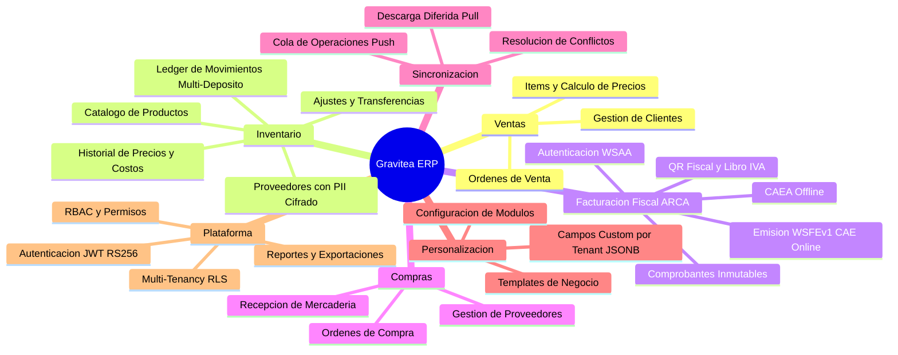
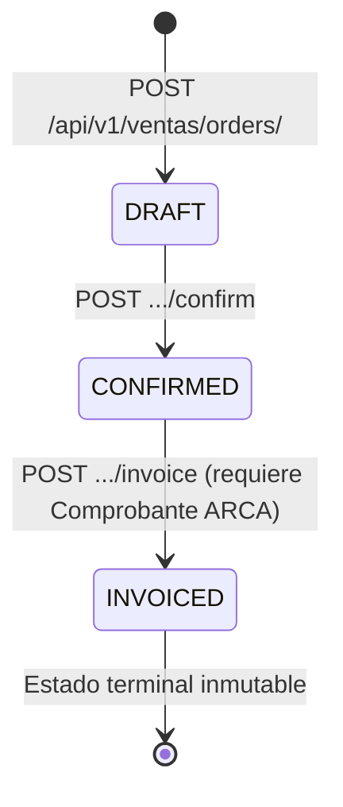
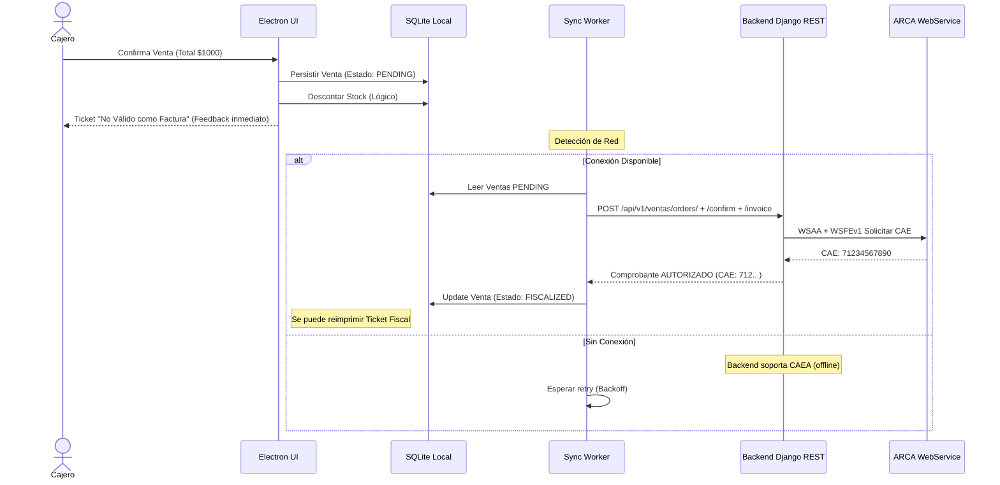
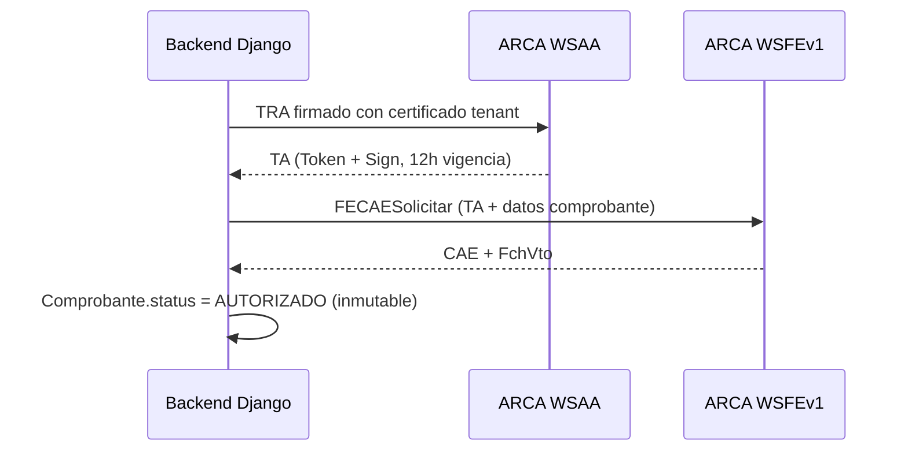
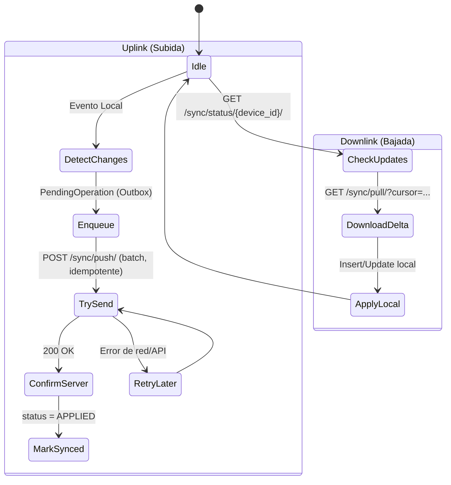

# Product Requirements Document (PRD) - Gravitea ERP

## 1. Metadatos del Documento
| Campo | Valor |
| --- | --- |
| **Owner** | Product Owner |
| **Implementación** | Tech Lead, Dev Team |
| **Versión** | 0.4 |
| **Última Actualización** | 2026-03-01 |
| **Estado** | **Features 001-025 Completas — Aceleración Rust Done — Fase de Investigación Vertical SaaS** |
| **Referencia Técnica** | `High-Level Design (HLD).md`, `Deployment & Infrastructure Guide.md` |

### Progreso de Implementación (Marzo 2026)

| Capa | Estado | Detalle |
|:-----|:-------|:--------|
| **Backend Core** | ✅ Completo | Auth, Inventario, Ventas, ARCA, Sync (features 001-014) |
| **Rust/PyO3 Aceleración** | ✅ Completo | 9 módulos nativos (crypto, compute, export, observability, security, sync, arca, validation); 2-9x speedup (features 017-025) |
| **API Contracts** | ✅ Completo | 9 OpenAPI specs — 79 paths, 154 schemas, 137 operaciones (DRF Spectacular) |
| **Frontend Prototipo** | Parcial | Next.js 16 — 9 rutas, 52 archivos |
| **Personalización** | ✅ Completo | Custom fields, module config, templates; validación Rust (025) |
| **Compras** | Parcial | Proveedores OK; workflow pendiente |
| **Reportes** | No iniciado | Planificado; exportación CSV/XLSX acelerada por Rust (020) |
| **Electron POS** | Planificado | Objetivo producción |

> **Nota estratégica (Marzo 2026)**: El proyecto ha completado todas las features planificadas (001-025) y se encuentra en fase de investigación para un posible pivot a **Vertical SaaS**. Se evalúan 4 nichos argentinos: Distribuidoras, Ferreterías, Acopiadores y Frigoríficos. El objetivo MVP original (mayo 2026) está en revisión. Ver ADR-016.

## 2. Introducción

Este documento traduce la visión de Gravitea ERP en requisitos funcionales detallados. Gravitea es una plataforma de gestión integral diseñada para **PyMEs minoristas** que requieren alta disponibilidad operativa. El sistema utiliza una arquitectura **dual-entorno** (ver sección 7 para detalle de la estrategia dual-entorno).

### 2.1 Glosario de Términos

| Término | Definición |
|:--------|:-----------|
| **Tenant** | La organización cliente (Comercio/Empresa). UUID como PK. |
| **Sync Worker** | Servicio en segundo plano (Electron — planificado) que orquesta la replicación de datos. |
| **CAE** | Código de Autorización Electrónico (ARCA/AFIP). |
| **CAEA** | Código de Autorización Electrónico Anticipado (modalidad offline de ARCA). |
| **Payload** | Estructura de datos JSON transmitida entre cliente y servidor. |
| **Optimistic UI** | Patrón donde la interfaz asume éxito antes de la confirmación del servidor. |
| **Comprobante** | Documento fiscal (Factura A/B/C) gestionado por el módulo de facturación. |
| **TenantBoundModel** | Clase base abstracta Django que aísla datos por tenant (TenantBoundManager + RLS + IDOR). |
| **Ledger** | Registro inmutable tipo libro mayor; solo operaciones append (INSERT), nunca UPDATE/DELETE. |
| **Blind Index** | Índice HMAC-SHA256 que permite búsqueda por igualdad sobre campos cifrados sin descifrar. |
| **Defense-in-Depth** | Estrategia de seguridad en 3 capas: aplicación (Manager) → base de datos (RLS) → validación (IDOR). |
| **Problem+JSON** | RFC 7807/9457 — formato estándar de respuestas de error en la API REST. |
| **BranchStock** | Tabla materializada (snapshot) de stock actual por producto y sucursal. |
| **RLS** | Row Level Security — políticas de seguridad a nivel de fila en PostgreSQL. |
| **DRF** | Django REST Framework. |
| **PII** | Personally Identifiable Information — datos personales cifrados con AES-256-GCM. |
| **SCD Type 2** | Slowly Changing Dimension Type 2 — patrón de historial con rango de fechas (PriceHistory, CostHistory). |

## 3. Descomposición Funcional

### 3.1 Arquitectura Funcional

Estructura jerárquica de las capacidades del sistema.

### 3.2 Estado de Implementación

| Módulo | Estado | Feature Branch | Notas |
|:-------|:-------|:---------------|:------|
| Ventas | ✅ Completo | `001-sal-invo-inve-backend` | Ciclo DRAFT→CONFIRMED→INVOICED |
| Inventario | ✅ Completo | `001-sal-invo-inve-backend` | Ledger inmutable, BranchStock |
| Facturación ARCA | ✅ Completo | `001-sal-invo-inve-backend` | WSAA + WSFEv1, CAE/CAEA, QR fiscal |
| Clientes | ✅ Completo | `001-sal-invo-inve-backend` | ABM, custom_data, listas de precios |
| Sincronización | ✅ Completo | `001-sal-invo-inve-backend` | Push/Pull idempotente, conflictos |
| Plataforma (Auth) | ✅ Completo | `001-sal-invo-inve-backend` | JWT RS256, RBAC, RLS, rate limiting |
| Personalización | ✅ Completo | `014-tenant-customization` | 6 tipos campo, module config, templates |
| Rust Bootstrap | ✅ Completo | `017-rust-bootstrap` | PyO3 0.28, Maturin 1.12.4, Docker rust-builder |
| Rust Crypto | ✅ Completo | `018-rust-crypto` | AES-256-GCM 8.7x, HMAC blind index 8.8x |
| Rust Fiscal Compute | ✅ Completo | `019-rust-fiscal-compute` | IVA 4.4x, CUIT 3.1x, importes 2.7x, stock 2.1x |
| Rust Data Export | ✅ Completo | `020-rust-data-export` | CSV (UTF-8 BOM) + XLSX; openpyxl fallback |
| Rust Observability | ✅ Completo | `021-rust-observability-hotpath` | Sanitize endpoint labels 2.6x |
| Rust SSRF Security | ✅ Completo | `022-ssrf-validation-pipeline` | 83-entry adversarial corpus, 10 CIDR ranges |
| Rust Sync Merge | ✅ Completo | `023-rust-sync-conflict` | most-complete-wins merge; GIL-released batch |
| Rust ARCA Batch | ✅ Completo | `024-rust-arca-batch` | CAEA batch builder via serde_json |
| Rust Field Validation | ✅ Completo | `025-rust-custom-field-validator` | 6 tipos; dispatcher threshold >5 |
| API Audit | ✅ Completo | `025-rust-custom-field-validator` | 9 contratos, 79 paths, 154 schemas |
| Compras | Parcial | `001-sal-invo-inve-backend` | Proveedores OK; órdenes pendientes |
| Reportes | No iniciado | — | Planificado; export engine Rust disponible (020) |

## 4. Requerimientos Funcionales Detallados

### 4.1 Módulo de Ventas
**Criticidad: P0 — ✅ Backend implementado (feature 001)**

El backend del módulo de ventas está completamente implementado. Los endpoints REST soportan el ciclo completo de órdenes de venta.

**Ciclo de vida de la SaleOrder**:

**Entidades implementadas**:
- `Customer`: CUIT, doc_tipo, condicion_iva, razon_social, custom_data (JSONB)
- `SaleOrder`: subtotal/total_iva/total_amount (MoneyField 16,4), created_by, branch
- `SaleOrderItem`: quantity, unit_price (snapshot), subtotal/iva_amount (calculados)

#### POS-01: Facturación con Manejo de Contingencia

> Flujo de producción objetivo con cliente Electron. El backend ya soporta este flujo vía REST.

> **Nota**: Los componentes Electron, SQLite Local y Sync Worker están planificados para producción. El backend y la integración ARCA están implementados.

**Criterios de Aceptación**:
1. Una venta CONFIRMED puede emitir comprobante ARCA y recibir CAE en < 5s
2. Con CAEA vigente, la facturación offline no requiere conexión a ARCA
3. El estado INVOICED es inmutable — no permite modificación ni eliminación

#### POS-02: Búsqueda de Productos de Alta Performance
*   **Requerimiento**: Búsqueda por texto completo sobre `nombre`, `sku`, `código de barras` (blind index), `tags` o `marca`.
*   **Performance**: Respuesta en < 50ms para catálogos de hasta 50.000 ítems.
*   **Implementación actual**: Barcode search vía blind index HMAC-SHA256 en `/products/search/`. FTS5 en SQLite local planificado para Electron.

**Criterios de Aceptación**:
1. Búsqueda por barcode cifrado retorna resultado correcto en < 50ms
2. La búsqueda no expone datos cifrados en la respuesta ni en logs

#### POS-03: Flujo de Venta Completo
*   **Endpoints**: `POST /ventas/orders/` (DRAFT), `POST .../confirm`, `POST .../invoice`.
*   **Items anidados**: `POST /ventas/orders/{order_pk}/items/`.
*   **Estado INVOICED** es inmutable terminal — vinculado a Comprobante AUTORIZADO.

**Criterios de Aceptación**:
1. No se puede crear un ítem con cantidad ≤ 0 ni precio unitario < 0
2. `POST .../invoice` falla con 400 si la orden no está en estado CONFIRMED
3. Un Comprobante AUTORIZADO vinculado a una SaleOrder impide modificación o eliminación de la orden

### 4.2 Módulo de Inventario y Logística
**Criticidad: P1 — ✅ Implementado (feature 001)**

#### INV-01: Trazabilidad de Stock (Ledger Inmutable)
El sistema utiliza un modelo de "Ledger" (Libro Mayor) para el inventario. Los movimientos son append-only; no se sobrescribe la cantidad actual.

*   **Modelo**: `StockMovement` — IMMUTABLE LEDGER (solo GET + POST, nunca PUT/PATCH/DELETE)
*   **Atributos**: `product_id`, `branch_id`, `quantity_delta` (±, DecimalField 16,4), `movement_type` (PG ENUM: SALE/PURCHASE/ADJUSTMENT/TRANSFER_IN/TRANSFER_OUT), `status` (PG ENUM: COMMITTED/RESERVED/CANCELLED), `reference_number`, FKs opcionales a `SaleOrder` y `Comprobante`
*   **Stock actual**: calculado via `StockSnapshot` (BranchStock) — tabla materializada branch+product

**Criterios de Aceptación**:
1. No existe endpoint PUT/PATCH/DELETE para StockMovement
2. Cada movimiento genera actualización automática del BranchStock correspondiente
3. `quantity_delta` puede ser negativo (salidas) o positivo (entradas)

#### INV-02: Catálogo de Productos
*   Alta, baja lógica (`is_active`) y modificación de productos.
*   SKU único por tenant, barcode cifrado (AES-256-GCM + blind index), custom_data (JSONB).

**Criterios de Aceptación**:
1. Dos productos del mismo tenant no pueden tener el mismo SKU
2. El barcode se almacena cifrado; la búsqueda opera sobre el blind index

### 4.3 Módulo de Facturación ARCA
**Criticidad: P0 — ✅ Implementado (feature 001)**

#### ARCA-01: Integración Directa WSAA + WSFEv1
El sistema implementa integración directa con los webservices de ARCA/AFIP.

*   **ARCACredential**: certificado y clave privada cifrados (AES-256-GCM), `is_production` flag, `cuit_holder`/`cuit_represented`
*   **Comprobante**: Ledger fiscal inmutable — AUTORIZADO/OBSERVADO son estados terminales
*   **CAEA**: códigos de autorización anticipada para operación offline (`/solicitar`, `/sin-movimiento`)
*   **QR Fiscal**: generación de QR fiscal estandarizado por ARCA

**Criterios de Aceptación**:
1. Un Comprobante AUTORIZADO no puede modificarse ni eliminarse
2. El TA se reutiliza mientras no expire (< 12h); no se solicita uno nuevo por cada comprobante
3. Si ARCA retorna OBSERVADO, el sistema acepta el CAE y registra las observaciones

### 4.4 Módulo de Sincronización (Sync Engine)
**Criticidad: P0 — ✅ Backend implementado (feature 001)**

#### SYNC-01: Estrategia de Sincronización Bidireccional

> **Nota**: El backend (endpoints REST, modelos, resolución de conflictos) está implementado. La lógica del cliente local (SQLite, Sync Worker) está planificada para Electron.

*   **SyncSession**: `device_id`, `sync_vector` (JSON — relojes vectoriales), `status` (PG ENUM)
*   **PendingOperation**: `operation_type` (CREATE/UPDATE/DELETE), `entity_type`, `payload` (JSON), `retry_count`, `status` (PENDING/APPLIED/CONFLICTED/REJECTED)
*   **Resolución de Conflictos**:
    *   **Precios/Productos**: "Server Wins". La configuración central prevalece.
    *   **Stock**: "Last Write Wins" con auditoría. Si se vende sin stock, el stock queda negativo hasta el ajuste.

**Criterios de Aceptación**:
1. `POST /sync/push/` es idempotente — reenviar el mismo UUID no crea duplicados (retorna 409)
2. `GET /sync/pull/?cursor=...` retorna máximo PAGE_SIZE=100 registros por request
3. Una PendingOperation con status CONFLICTED requiere resolución manual o automática documentada

### 4.5 Módulo de Personalización por Tenant
**Criticidad: P2 — ✅ Implementado (feature 014)**

#### CUSTOM-01: Campos Personalizados (JSONB Pattern)
El sistema permite a cada tenant extender el esquema de datos sin modificar la base de datos.

*   **`custom_data` (JSONField)**: presente en `Product`, `Customer`, `Supplier`, `SaleOrder`
*   **`TenantFieldDefinition`**: metadata de campos — 6 tipos: `text/integer/decimal/boolean/date/select`; entidades: `product/customer/supplier/sale_order`
*   **`TenantModuleConfig`**: habilitar/deshabilitar módulos (`inventario/ventas/facturacion/sync`) con settings JSON
*   **`BusinessTemplate`**: templates de onboarding del sistema (NOT tenant-bound) con `modules` y `field_definitions` predefinidos
*   **`CustomFieldsMixin`**: mixin DRF para validación, creación con defaults, y actualización (merge) de custom_data

**Criterios de Aceptación**:
1. Un campo `required=True` impide guardar la entidad sin ese campo en `custom_data`
2. Un campo tipo `select` solo acepta valores definidos en `choices`
3. Deshabilitar un módulo (`is_enabled=False`) oculta sus endpoints pero no elimina los datos existentes

### 4.6 Módulo de Autenticación y Seguridad
**Criticidad: P0 — ✅ Implementado (feature 001)**

#### AUTH-01: Autenticación JWT RS256
*   Login por email/password → access token (RS256, 4096-bit) + refresh token.
*   Refresh tokens revocables (token_blacklist) y rotables.
*   Logout: `POST /auth/logout/` — blacklistea el refresh token.
*   Claims personalizados: `tenant_id`, `branch_id`, `role_id`, `permissions`.

**Criterios de Aceptación**:
1. Los algoritmos HS256/HS384/HS512 están explícitamente rechazados (whitelist RS256)
2. Un refresh token usado para logout no puede generar nuevos access tokens
3. El access token incluye `tenant_id` y `branch_id` en sus claims

#### AUTH-02: RBAC y Multi-Tenancy
*   `Role` con permissions JSONField: lista de strings `module.action`.
*   Defense-in-Depth: TenantBoundManager (Capa 1) + PostgreSQL RLS (Capa 2) + validación IDOR (Capa 3).
*   Rate limiting de 3 niveles: 5/min → 3/min → lockout 15min.

**Criterios de Aceptación**:
1. Un usuario del tenant A no puede acceder a datos del tenant B, incluso manipulando IDs en la URL
2. Después de 5 intentos fallidos de login, la cuenta queda bloqueada por 15 minutos
3. La variable de sesión PG `app.current_tenant_id` se establece en cada request autenticado

### 4.7 Módulo de Clientes
**Criticidad: P1 — ✅ Implementado (feature 001)**

#### CLI-01: ABM de Clientes
*   Alta, edición y baja lógica (soft delete) de clientes.
*   Datos: `razon_social`, `CUIT`, `doc_tipo` (código ARCA), `condicion_iva` (código ARCA), `email`, `phone`, `address`, `custom_data` (JSONB).
*   Asociación de lista de precios por defecto.

**Criterios de Aceptación**:
1. Un cliente eliminado (soft delete) no aparece en listados pero sus datos persisten en la base de datos
2. `doc_tipo` y `condicion_iva` solo aceptan valores definidos en las constantes ARCA (`DocTipo`, `CondicionIVA`)

### 4.8 Módulo de Compras
**Criticidad: P1 — Parcial**

#### COMP-01: Gestión de Proveedores ✅
*   ABM de proveedores con PII cifrado (razón social, CUIT/tax_id, contactos — AES-256-GCM).
*   Blind index HMAC-SHA256 para búsqueda en campos cifrados (`/suppliers/search/`).
*   `custom_data` JSONB para campos adicionales por tenant.

**Criterios de Aceptación**:
1. Los campos PII (tax_id, email, address) se almacenan cifrados; nunca en texto plano
2. La búsqueda por tax_id opera sobre el blind index sin descifrar el campo original

#### COMP-02: Órdenes de Compra (Planificado)
*   Crear órdenes de compra por sucursal y proveedor.
*   Ciclo: DRAFT → SENT → PARTIAL_RECEIVED → COMPLETED.

**Criterios de Aceptación**:
1. Una orden COMPLETED no puede recibir más mercadería
2. Cada recepción genera movimientos de stock tipo PURCHASE automáticamente

### 4.9 Módulo de Reportes
**Criticidad: P1 — No iniciado (export engine Rust disponible)**

#### REP-01: Reportes de Ventas y Stock (Planificado)
*   Ventas agregadas por fecha, sucursal, vendedor y cliente.
*   Stock actual, rotación y quiebres de stock.
*   Exportación a CSV/XLSX — **motor de exportación Rust disponible** (export.rs, spec 020): CSV con UTF-8 BOM RFC 4180, XLSX con auto-numeric y column widths. Fallback a openpyxl Python.

**Criterios de Aceptación**:
1. Los reportes respetan el aislamiento de tenant — un tenant solo ve sus propios datos
2. La exportación CSV/XLSX no incluye campos PII en texto plano

#### REP-02: Reportes para Contabilidad (Planificado)
*   Libros IVA, resúmenes de ventas, retenciones/percepciones.

**Criterios de Aceptación**:
1. El libro IVA incluye todos los comprobantes AUTORIZADO y OBSERVADO del período

## 5. Requerimientos No Funcionales (NFRs)

### 5.1 Seguridad y Compliance
*   **NFR-SEC-01**: Cifrado en tránsito (HTTPS) y en reposo. AES-256-GCM para campos PII (tax_id, email, address en Supplier; barcode en Product; certs en ARCACredential) — **acelerado por Rust** (crypto.rs, 8.7x speedup). SSRF validation via Rust security.rs (83-entry adversarial corpus). **Planificado** para Electron: SQLCipher para SQLite local.
*   **NFR-SEC-02**: Autenticación JWT RS256 con claims personalizados (`tenant_id`, `branch_id`, `role_id`, `permissions`). Rotación de Refresh Tokens. Almacenamiento en memory (Next.js actual) / system keychain (Electron planificado).
*   **NFR-SEC-03**: RLS estricta en base de datos multi-tenant. Defense-in-Depth: TenantBoundManager + PostgreSQL RLS + validación IDOR.
*   **NFR-SEC-04**: Rate limiting de 3 niveles en endpoints de auth (5/min → 3/min → lockout 15min).

### 5.2 Disponibilidad y Rendimiento
*   **NFR-PERF-01** (Electron — Planificado): La aplicación debe ser funcional (permitir agregar ítems al carrito) en < 3 segundos desde el lanzamiento.
*   **NFR-PERF-02** (Electron — Planificado): El uso de memoria RAM del cliente Electron no debe exceder los 500MB en operación normal.
*   **NFR-PERF-03** (API): Latencia p95 de principales endpoints: < 200ms bajo carga nominal.
*   **NFR-PERF-04** (Sync): Pull con cursor-based pagination, PAGE_SIZE=100; idempotencia garantizada por UUID de cliente.
*   **NFR-PERF-05** (Rust Acceleration — ✅ Implementado): 9 módulos Rust/PyO3 aceleran hot-paths CPU-bound con fallback automático a Python. Benchmarks: AES-256-GCM 8.7x, IVA breakdown 4.4x, CUIT validation 3.1x, endpoint sanitization 2.6x. Docker multi-stage produce wheel de 188 KB.

### 5.3 Manejo de Contingencias y Casos Límite
*   **NFR-EDGE-01**: Si ARCA retorna OBSERVADO (autorizado con advertencias), el sistema acepta el CAE, registra las observaciones en `Comprobante.observations`, y notifica al operador.
*   **NFR-EDGE-02**: Si el stock queda negativo en modo offline (venta sin verificación de stock en tiempo real), el sistema permite la operación, registra el movimiento, y marca el BranchStock para reconciliación en la próxima sincronización.
*   **NFR-EDGE-03**: Si un campo cifrado (EncryptedCharField/EncryptedTextField) no puede descifrarse (corrupción o rotación de clave), el sistema falla de forma cerrada (fail-closed) — retorna error 500 y alerta al administrador. No expone datos parciales.
*   **NFR-EDGE-04**: Si una PendingOperation en `POST /sync/push/` tiene un UUID que ya existe con status APPLIED, el sistema retorna 409 Conflict (rechazo idempotente) sin crear duplicados.

## 6. Matriz de Trazabilidad de Requisitos

| ID | Requisito | Componente | Prioridad | Estado | Criterio Clave |
|:---|:----------|:-----------|:----------|:-------|:---------------|
| POS-01 | Facturación con contingencia offline | Backend + ARCA (✅); Electron (Planificado) | P0 | Parcial | CAE en < 5s; CAEA sin conexión |
| POS-02 | Búsqueda de productos | Blind index (✅); FTS5 Electron (Planificado) | P1 | Parcial | < 50ms; sin exposición de datos cifrados |
| POS-03 | Flujo de venta completo | SaleOrder, SaleOrderItem, Customer | P0 | ✅ | INVOICED inmutable; validación de items |
| INV-01 | Ledger de stock inmutable | StockMovement, BranchStock | P1 | ✅ | Sin PUT/DELETE; actualización automática snapshot |
| INV-02 | Catálogo de productos | Product (SKU, barcode cifrado) | P1 | ✅ | SKU único por tenant |
| ARCA-01 | Integración WSAA + WSFEv1 | ARCACredential, Comprobante | P0 | ✅ | AUTORIZADO inmutable; TA reutilizado |
| SYNC-01 | Sync bidireccional | SyncSession, PendingOperation | P0 | ✅ | Push idempotente; PAGE_SIZE=100 |
| CUSTOM-01 | Campos personalizados JSONB | TenantFieldDefinition, custom_data | P2 | ✅ | Validación 6 tipos; disable preserva datos |
| AUTH-01 | Autenticación JWT RS256 | AppUser, Role, token_blacklist | P0 | ✅ | Whitelist RS256; refresh revocable |
| AUTH-02 | RBAC + Multi-Tenancy | TenantBoundManager, RLS | P0 | ✅ | Defense-in-Depth 3 capas; lockout 15min |
| CLI-01 | ABM de clientes | Customer | P1 | ✅ | Soft delete; códigos ARCA válidos |
| COMP-01 | Gestión de proveedores | Supplier (PII cifrado) | P1 | ✅ | PII cifrado; blind index |
| COMP-02 | Órdenes de compra | Módulo COMPRAS | P1 | Planificado | COMPLETED inmutable; stock PURCHASE auto |
| REP-01 | Reportes de ventas y stock | Módulo REPORTES | P1 | Planificado | Aislamiento tenant; export sin PII plano |
| REP-02 | Reportes contables | Módulo REPORTES | P1 | Planificado | Libro IVA incluye AUTORIZADO + OBSERVADO |

## 7. Supuestos y Restricciones

1.  **Hardware (Producción — Planificado)**: El cliente dispondrá de PCs con Windows 10/11 x64 y al menos 4GB de RAM para el cliente Electron.
2.  **Hardware (Desarrollo actual)**: Navegadores modernos (Chrome/Firefox/Edge) para la interfaz Next.js actual.
3.  **Conectividad**: Se asume conexión diaria para sincronización fiscal; no se soporta operación 100% offline perpetua (ARCA requiere reporte periódico). El sistema soporta CAEA para operación offline temporal.
4.  **Certificados**: El cliente gestiona la renovación de sus certificados digitales ARCA, aunque el sistema avisa de su vencimiento.
5.  **Objetivo MVP**: Originalmente 1 de mayo de 2026 — **en revisión** debido a la fase de investigación de pivot a Vertical SaaS (ver ADR-016). Pendientes técnicos: Módulo REPORTES, cliente Electron POS, despliegue GCP. Pendientes estratégicos: definición de nicho vertical, customer discovery, alcance MVP vertical.
6.  **Dual-entorno**: Next.js 16 es el frontend de desarrollo actual (implementado, 9 rutas, 52 archivos). Electron es el objetivo de producción planificado para sucursales. Ambos se comunican con el mismo backend Django vía REST API. No deben confundirse en documentación ni comunicaciones.
7.  **Desactivación de módulos**: Deshabilitar un módulo vía `TenantModuleConfig.is_enabled=False` oculta funcionalidad pero preserva todos los datos existentes. La reactivación restaura el acceso sin pérdida de información.
