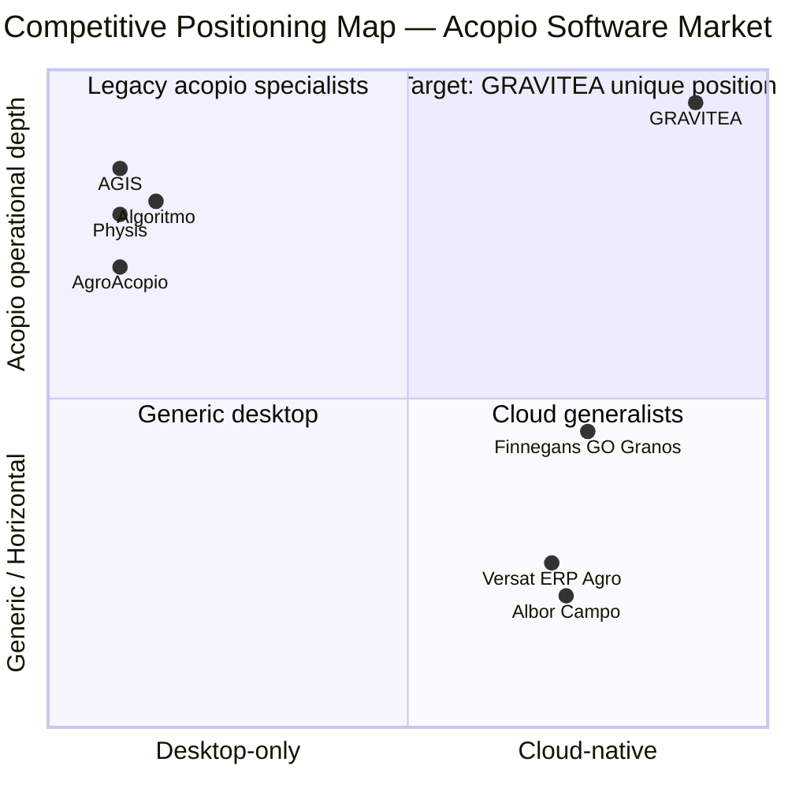
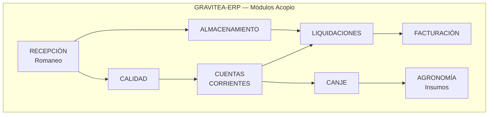
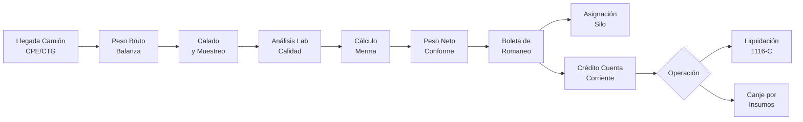
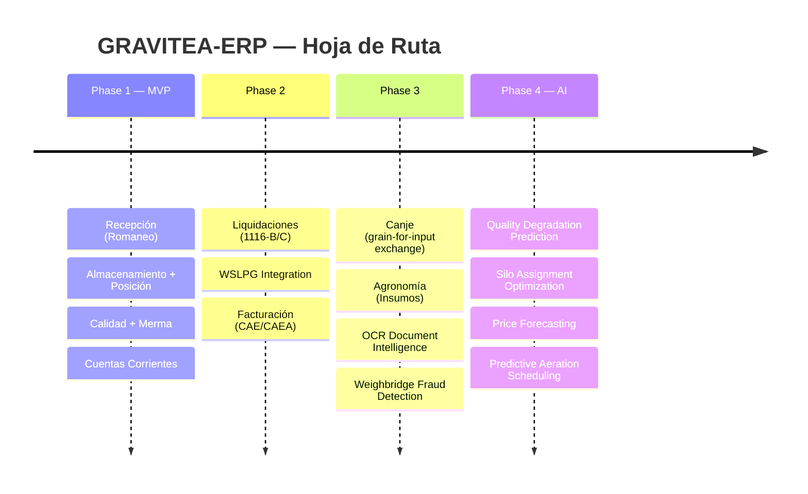
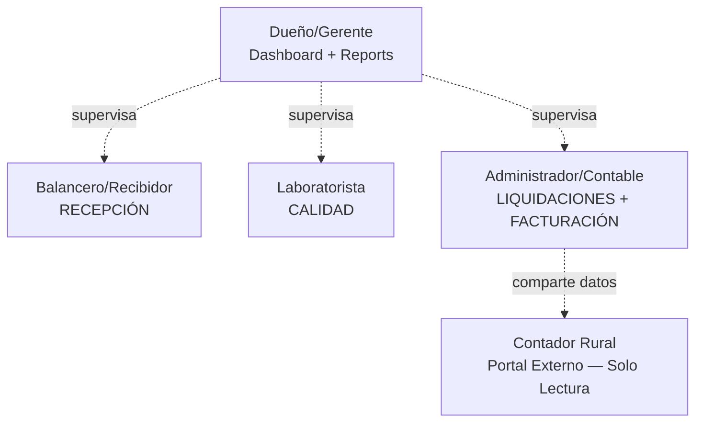

# Product Vision & Scope

**Version**: 1.0 | **Date**: 2026-03-15 | **Status**: Vision Document — Committed

---

## 1. Document Metadata

### Implementation Progress (March 2026)

| Layer | Status | Details |
|:------|:-------|:--------|
| **Backend Core** | ✅ Complete | Auth, Inventory, Ventas, ARCA, Sync — all modules implemented |
| **Rust/PyO3 Acceleration** | ✅ Complete | 9 Rust modules (crypto, compute, export, observability, security, sync, arca, validation) via PyO3 0.28 |
| **Frontend Prototype** | Partial (Dev) | Next.js 16 prototype — 9 routes, 52 source files |
| **Tenant Customization** | ✅ Complete | Custom fields (6 types), module config, business templates |
| **Observability** | ✅ Complete | Prometheus + Grafana + Jaeger + Loki |
| **API Contracts** | ✅ Complete | 9 OpenAPI contracts, 79 paths, 154 schemas, 137 operations |
| **Purchases (COMPRAS)** | Partial | Supplier model + API contract defined; purchase workflow pending |
| **Reports (REPORTES)** | Partial | API contract defined; implementation pending |
| **Electron POS** | Planned | Planned production target |
| **GCP Deployment** | Planned | Planned after vertical decision |

**Current Metrics (March 2026):** 2,500+ tests (backend + Rust integration) | 79 API paths | 9 OpenAPI contracts | 9 Rust modules | 7,184 GitNexus symbols

### Implementation Summary (March 2026)

- **Completed modules**: Core/Auth, Inventory, Sync Engine, Observability, Ventas, ARCA/Fiscal, Tenant Customization, Rust Acceleration Layer
- **Test Suite**: 2,500+ tests (backend + Rust integration); 0 regressions from Rust layer
- **API Contracts**: 9 OpenAPI contracts, 79 paths, 154 schemas, 137 operations (via drf-spectacular)
- **Rust Modules**: 9 compiled modules (crypto, compute, export, observability, security, sync, arca, validation, lib)
- **Migrations**: 23 total (auth: 3, core: 3, inventario: 6, ventas: 3, facturacion: 3, sync: 5)
- **Tech Stack**: Python 3.14.3, Django 5.2.x, DRF, PostgreSQL 18.1, Redis 7.x, **Rust 1.93.1 (PyO3 0.28, Maturin 1.12.4)**

### Feature Branch History (001–025)

The following feature branches have been delivered as of March 2026. Branches 002–010 were pre-formal-convention era (orchestration docs, ARCA module groundwork, GGA setup); the formal numbered convention resumed at 011.

| Branch | Commit | Summary |
|:-------|:-------|:--------|
| 001-sal-invo-inve-backend | `91cb4a1` | Complete backend for Ventas, Facturación (ARCA/WSAA/WSFEv1, CAE, fiscal QR), and Inventario (ledger, encrypted suppliers) — core infrastructure for acopio operations |
| 002-project-constitution | — | Project constitution, speckit workflow, and development environment setup (pre-convention) |
| 003-api-contracts-design | — | API contract specifications, endpoint schemas, and initial OpenAPI definitions (pre-convention) |
| 004-database-rls-setup | — | PostgreSQL configuration, Row Level Security policies, and initial database migrations (pre-convention) |
| 005-docker-infrastructure | — | Docker multi-stage builds, compose files, and deployment infrastructure setup (pre-convention) |
| 006-debug-hardening | — | Debug hardening, test stabilization, and CI pipeline configuration (pre-convention) |
| 007-gga-code-review | — | GGA automated code review integration and quality enforcement rules (pre-convention) |
| 008-facturacion-arca-patterns | — | ARCA integration patterns, WSAA authentication flows, and fiscal module planning (pre-convention) |
| 009-engineering-hardening | — | Engineering hardening, agent orchestration, and multi-agent prompt systems (pre-convention) |
| 010-ventas-integration | — | Ventas integration planning and sales workflow specification (pre-convention) |
| 011-backend-devops-coherence | `81b29de` | 59 tasks: Docker consolidation, 13 refactoring fixes, 4 analysis reports — infrastructure coherence for multi-plant deployments |
| 012-prototype-frontend | `c567815` | Next.js 16 frontend prototype — 46 tasks, 9 page routes, 52 source files, seed commands, OpenAPI integration |
| 013-e2e-frontend-testing | `9505190` | Browser E2E testing — phases 1–3B, 3 bug fixes (F-015 field mapping, F-016 seed, F-017 SQL trigger) |
| 014-tenant-customization | `81837ea` | Tenant customization framework — JSONB custom_data, TenantFieldDefinition (6 field types), TenantModuleConfig, BusinessTemplate, DynamicFields React component |
| 015-blueprint-docs-overhaul | `b2a2c58` | Complete rewrite of 12 Project Blueprint documents — aligned with acopio vertical strategy |
| 016-prd-overhaul | `a3c1e7f` | PRD rewrite aligned with features 001–014 and vertical SaaS direction |
| 017-rust-bootstrap | `2db3189` | Rust/PyO3/Maturin toolchain bootstrap — `hello()`, `GraviteaError`, Docker rust-builder stage |
| 018-rust-crypto | `3db703e` | AES-256-GCM + HMAC-SHA256 blind index via Rust — 8.7x speedup for producer data encryption |
| 019-rust-fiscal-compute | `710994e` | 5 fiscal functions: validate_importes, IVA, CUIT, aggregate_stock — 2.1–4.4x speedups for grain liquidación calculations |
| 020-rust-data-export | `6e73eda` | CSV (UTF-8 BOM) + XLSX generation with Python openpyxl fallback — grain position and account exports |
| 021-rust-observability-hotpath | `d7d934f` | 24 compiled regex for normalize_path + sanitize_endpoint_label — 2.4x speedup on observability hot path |
| 022-ssrf-validation-pipeline | `d7d934f` | SSRF validation: validate_url_safety + check_resolved_ip — 831 lines, 308 tests |
| 023-rust-sync-conflict | `bb3a780` | Sync conflict merge via serde_json (single + batch with GIL release) — critical for multi-plant offline synchronization |
| 024-rust-arca-batch | `aa3b65f` | CAEA quincena batch builder via serde_json — enables offline fiscal operations during harvest |
| 025-rust-custom-field-validator | `d22686a` | Custom field validator — 6 types, dispatcher threshold >5 — configurable grain quality parameters per plant |

---

## 2. Strategic Purpose & Vision

### 2.1 Vision Statement

> Empower independent Argentine grain operators (acopiadores de granos) with the first cloud-native, offline-first ERP purpose-built for grain stockpiling operations — delivering automatic regulatory compliance, real-time grain position visibility, and enterprise-grade security to the small-to-medium acopiador who has been historically underserved by desktop-era software.

### 2.2 Vertical Commitment

GRAVITEA is purpose-built for the Argentine acopio de granos vertical. This is not a horizontal ERP adapted to agriculture — it is a grain stockpiling platform from the ground up. Every module, every workflow, and every integration decision prioritizes the operational reality of independent acopiadores over generic functionality. The existing infrastructure (2,500+ tests, 9 Rust modules, ARCA integration, offline-first sync engine) provides a proven foundation purpose-directed toward grain operations.

### 2.3 Ironclad Design Principles

1. **Pragmatic Offline-First**: Offline is the base architecture, not a fallback mode. The system assumes the network is unreliable. Synchronization is a secondary, non-blocking process — every truck reception completes locally regardless of connectivity.

2. **Transactional Integrity (Ledger)**: No `UPDATE` on grain movements — only `INSERT` contra-entries. This guarantees forensic traceability for every kilogram from romaneo (weighing ticket) entry to liquidación (settlement) completion.

3. **Encapsulated Complexity**: The balancero (weighbridge operator) sees "Green = Approved" — not "CTG Issued via WSLPG endpoint 2.2.1". The system abstracts regulatory bureaucracy (ARCA/SISA) into intuitive status indicators.

4. **Enterprise Security for SMBs**: Corporate-grade security — PostgreSQL Row Level Security, AES-256-GCM encryption at rest, full audit trails — for small-to-medium grain operators who handle sensitive producer data and fiscal certificates.

5. **Regulatory Automation**: CPE/CTG issuance, C-1116 liquidaciones, and SISA registrations happen automatically — operators manage grain, not compliance paperwork.

6. **AI-Ready Data Architecture**: Every weighing event, quality grade, and storage movement is captured as structured data from day one — enabling ML features in Phase 4 without data migration (see [Section 9: AI Differentiation Roadmap](#9-ai-differentiation-roadmap)).

---

## 3. Market Context & Opportunity

### 3.1 Market Sizing

Argentina's grain stockpiling sector represents a concentrated, high-value addressable market [Research 6.1].

**Total Addressable Market (TAM)**:
- ~1,259 acopiador-consignatario enterprises operating ~2,458 storage plants nationwide
- Combined installed capacity: approximately 75–80 million tons
- Average: 2.15 plants per company, 31,800 tons average capacity per plant

**Serviceable Addressable Market (SAM)**:
- ~1,073 private (non-cooperative) acopiadores operating ~1,622 plants (~68% of total plants)
- 24 Mt combined capacity (30–32% of national installed capacity)
- Size distribution: 60% small (<20,000 tons), 32% medium (20,000–80,000 tons), 8% large (>80,000 tons)

**Serviceable Obtainable Market (SOM)**:
- Initial beachhead: Córdoba (81 Federación members) + Santa Fe (58 Federación members) = **139 target enterprises** [Research 6.1]
- Geographic concentration: 88% of storage plants are in the Pampas region
  - Buenos Aires: ~40% of plants (96 Federación members)
  - Santa Fe: largest total capacity at ~14.8 Mt (58 Federación members)
  - Córdoba: ~5.5 Mt capacity (81 Federación members)
  - Entre Ríos: ~2.1 Mt (27 Federación members) | La Pampa: ~1.2 Mt

### 3.2 Competitive Landscape

**GRAVITEA unique position**: The only solution combining cloud-native architecture + offline-first operations + acopio operational depth. No incumbent occupies this three-axis combination simultaneously.

#### Specialized Desktop Vendors [Research 4.1]

| Competitor | Founded | Location | Platform | Clients | Strengths | Key Weakness |
|:-----------|:--------|:---------|:---------|:--------|:----------|:-------------|
| **Algoritmo** | 1985 | Rosario, SF | Desktop + Silohub cloud overlay | ~125 acopio | Deep acopio workflow (romaneo, liquidación, 1116); Silohub partnership adds cloud visibility | No native cloud; 2-platform cost; Silohub is an overlay, not integrated |
| **AGIS (AmericaGIS)** | ~1985 | Villa María, CBA | VB6/.NET desktop | **2,000+ acopio** | 38+ years domain expertise; IRAM/IQNET certified; largest installed base [Research 4.2] | 3 fragmented tech stacks (VB6 EOL 2008, .NET, web portal); no offline-first cloud migration path |
| **Physis** | ~1988 | CABA / Rosario | Desktop Windows | Unknown | Established Rosario/CABA presence; strong fiscal integration | No web, mobile, or cloud capability |
| **AgroAcopio** | 1983 | Buenos Aires | Desktop | Unknown | 40+ years market presence; Buenos Aires base | Oldest tech stack in the market |
| **Agrosistemas** | 1990 | Mar del Plata | Desktop | Unknown | ISO certified; established regional base | Desktop-only despite ISO quality certification |
| **Gestagro/Kernel** | 1988 | Rosario | Desktop + Android | Unknown | Android mobile app for field operations | Cooperative-focused only; limited private acopiador market |
| **Siscoop** | 1986 | Bahía Blanca | Desktop + partial web | Unknown | Partial web modernization; southern Argentina coverage | Cooperative-focused only; incomplete web migration |
| **Informática Tandil** | Unknown | Tandil | Desktop | Unknown | Strong local presence in southern Buenos Aires | Regional reach limited to Tandil area |
| **SYNAgro** | Unknown | Unknown | On-premise + consulting | Unknown | Enterprise-grade consulting model | 1-year minimum implementation timeline |

#### Cloud Generalists (No Acopio Operational Depth) [Research 4.1]

| Competitor | Founded | Location | Platform | Clients | Strengths | Key Weakness |
|:-----------|:--------|:---------|:---------|:--------|:----------|:-------------|
| **Finnegans GO Granos** | 1992 | Buenos Aires | Cloud SaaS (AWS) | ~1,500 agro total | True cloud-native on AWS; modern architecture | Enterprise-tier pricing; lacks romaneo/liquidación/merma operational depth |
| **Versat ERP Agro** | Unknown | Unknown | Cloud SaaS | Unknown | Cloud-native; modern tech stack | Not acopio-specific; USD 200–640/month; generic agricultural ERP |
| **Albor Campo** | Unknown | Mar del Plata | Cloud SaaS | 4,000+ users | Large user base; modern platform | Farm-focused (precision agriculture), not acopio operations |

> **Mandatory Government Integrations** (must integrate, not competitors):
> **SIO Granos** (grain buy/sell registration) | **SISA / Registro Sistémico** (RG 5689/2025 — 24h grain movement registration) | **BolsaTech** (soy technology commercialization)

#### Market Segmentation [Research 4.1]

| Tier | Market Share | Segment | Current Solution |
|:-----|:-------------|:--------|:-----------------|
| Large acopios + cooperatives | 10–15% | >80,000 tons capacity | Full specialized ERP (Algoritmo, Finnegans, SAP) |
| Medium private acopiadores | 20–30% | 20,000–80,000 tons | Specialized desktop (AGIS, Physis, AgroAcopio, Agrosistemas) |
| Small — generic tools | 25–35% | <20,000 tons | Generic ERP + Excel (Tango/Bejerman + spreadsheets) |
| Small — manual | 20–30% | <20,000 tons | Primarily Excel/manual + ARCA web portals |

**GRAVITEA's primary target**: The bottom two tiers (45–65% of the market) — small-to-medium acopiadores currently using generic tools, Excel, or manual processes. These operators are underserved by desktop incumbents that require on-site installation and lack offline-first cloud capabilities.

### 3.3 Pain Points & Technology Adoption

#### Six Critical Pain Points [Research 4.3]

**1. Regulatory Compliance Burden**
CPE (Carta de Porte Electrónica) and CTG (Código de Trazabilidad de Granos) require real-time filing since 2021. Liquidaciones primarias (Form 1116-C) and secundarias (Form 1116-B) are governed by RG 3419/2012, RG 3690/2014, and RG 3691/2014. The SISA / Registro Sistémico (RG 5689/2025) requires 24-hour grain movement registration — failure to comply results in sanctions including suspension of Cartas de Porte issuance. RG 5821/2026 further links CPE issuance to SISA compliance status. The RUCA registry was eliminated in 2025 and migrated into SISA.

**2. Tax Withholding Complexity**
Every liquidación requires simultaneous calculation of: IVA 8% (RG 4310/2018 + RG 2300; refund delays exceed 12 months; ARS 500K–1.5M trapped capital per producer), Ganancias 2–15% (RG 2118/2006), IIBB variable by province, and SICORE magnetic file generation. All retenciones must be computed per liquidación simultaneously [Research 4.3].

**3. Grain Inventory Reconciliation**
Acopiadores must track grain position (posición de granos): quantity comprado (purchased) vs vendido (sold) vs stored physical stock. Manual tracking leads to cubicaje (volumetric estimation) discrepancies, overselling risk, and audit failures against CTG records, 1116 certificates, LPGs, and the ARCA Systemic Register [Research 4.3].

**4. Producer Account Disputes**
Quality grading determines bonificaciones (bonuses) and rebajas (deductions) applied to each romaneo. Conditioning costs — secado (drying), zarandeo (sieving), fumigación (fumigation) — are disputed when calculated manually. Settlement timing for "a fijar" (to-be-priced) operations adds complexity. Once grain enters the silo, it loses physical identity, making retroactive disputes intractable [Research 4.3].

**5. Manual Data Entry During Harvest Peak**
Peak harvest means hundreds of trucks per day at a single plant. Manual weighbridge transcription introduces errors in peso bruto (gross weight), tara (tare), and calado (sampling) data. According to Albor Agtech, 7 out of 10 acopio software implementations fail due to poor process alignment — not technology limitations [Research 4.3].

**6. Connectivity During Harvest Operations**
Acopio plants are located in small towns with generally adequate connectivity — not remote fields. However, brief outages during peak harvest halt real-time CTG and SISA operations, creating a bottleneck at the moment of highest operational intensity. 44% of operators report only "regular" connectivity quality (INTA/ENACOM 2021), and cloud-dependent systems require internet for all operations, not just ARCA filings [Research 4.3].

#### Technology Adoption & Buying Behavior [Research 4.3]

- **Digital penetration**: 92% of the agricultural sector uses apps or digital platforms; 65% use dedicated digital platforms for operations
- **Smartphone penetration**: 62.1 million connections nationwide, 97% on 4G — WhatsApp is the de facto management communication tool
- **Cloud resistance**: Connectivity dependence is the primary barrier; on-premise systems only need internet for ARCA filings, while cloud systems need it for everything
- **Generational shift**: Younger operators (via ACA Jóvenes networks) are more technology-friendly; older generation holds decision authority
- **Typical IT setup**: 1–2 shared PCs, Windows desktop, electronic scale, sometimes connected to weighbridge
- **Buying decision**: Dual influence — Owner + Accountant (contador)
- **Budget**: USD 150–500/month
- **Switching barrier #1**: Data migration (decades of accumulated operational data)
- **Optimal switching window**: April–June (post-soybean harvest, lowest operational intensity)

---

## 4. Product Vision & Scope

### 4.1 Module Map

Eight core modules built for the acopio operational cycle:

| Module | Description |
|:-------|:-----------|
| **RECEPCIÓN** (Romaneo) | Truck entry, CPE/CTG validation, peso bruto (balanza), calado y muestreo, quality analysis, merma calculation, peso neto conforme, boleta de romaneo |
| **ALMACENAMIENTO** | Silos and cells with capacity and state; assignment by grain type, quality, and campaña (campaign year); grain position (what, where, whose); inter-silo movements |
| **CALIDAD** | Tolerance tables per grain type (Cámara Arbitral de Rosario standards); bonificaciones and rebajas; merma tables for drying; plant-configurable quality parameters |
| **CUENTAS CORRIENTES** | Producer account: saldo in granos (kg by type), pesos, and dollars; movement history; account statements (extractos) |
| **LIQUIDACIONES** | Liquidación Primaria (Form 1116-C), Secundaria (Form 1116-B); tax retentions (IVA, Ganancias, IIBB); ARCA electronic filing (WSLPG); SISA status verification; price per ton/quintal |
| **FACTURACIÓN** | Electronic invoices A/B/C; plant services (secada, zarandeo, almacenaje, paritaria); credit/debit notes; CAE (online) and CAEA (offline mode) |
| **AGRONOMÍA** (Insumos) | Input catalog (seeds, fertilizers, agroquímicos, repuestos); stock by lot and expiry; purchases from distributors; sales to producers; price lists |
| **CANJE** | Grain-for-input exchange: automatic compensation of grain credit (valued at pizarra price) against input debit; fiscal documentation generation |

### 4.2 Core Operational Flow

This romaneo-to-position loop is the daily heartbeat of every acopio plant. Every truck that arrives follows this exact sequence. The speed and accuracy of this workflow directly determines harvest throughput capacity.

### 4.3 MVP Scope — Phase 1: Romaneo-to-Position Loop

The MVP delivers the complete daily operational cycle that every acopiador runs from the first truck of each harvest:

1. **Reception (RECEPCIÓN)**: Truck arrival registration, CPE/CTG validation, peso bruto capture from weighbridge, calado (sampling) initiation
2. **Quality Analysis (CALIDAD)**: Laboratory grading against Cámara Arbitral de Rosario tolerance tables, bonificación/rebaja calculation, merma (shrinkage) computation for moisture/impurities
3. **Storage Assignment (ALMACENAMIENTO)**: Silo allocation by grain type, quality grade, and campaign year; real-time grain position tracking
4. **Producer Account Credit (CUENTAS CORRIENTES)**: Automatic credit of peso neto conforme to producer's grain balance (saldo granos kg); full movement history

### 4.4 Technical Differentiators

1. **Offline-first hybrid architecture**: The system operates without internet — every truck reception, quality analysis, and storage assignment completes locally. Synchronization happens when connectivity restores, using vector clocks and conflict resolution. This is not a "disconnected mode" — it is the primary operating mode.

2. **Rust acceleration layer**: Merma engine, quality grading calculations, fiscal validation, and sync conflict resolution run in compiled Rust via PyO3 — delivering 2–9x speedups on hot paths (crypto 8.7x, compute 2.1–4.4x, observability 2.4x). Python fallback ensures zero-downtime if the Rust module is unavailable.

3. **PostgreSQL RLS multi-tenancy**: Plant-level data isolation enforced at the database level. It is physically impossible for Plant A to query Plant B's grain data — even if application code has bugs, RLS prevents cross-tenant access.

4. **ARCA direct integration**: WSAA authentication, WSFEv1 invoice issuance, and WSLPG liquidación filing — direct SOAP integration without intermediary services. CAE (online) for connected operations; CAEA (offline) for harvest-season fiscal continuity.

5. **AI-ready data architecture**: Every romaneo, quality grade, storage movement, and price event is captured as structured, typed data from day one. This enables Phase 4 ML capabilities (see [Section 9](#9-ai-differentiation-roadmap)) without data migration or retroactive structuring.

6. **Field-level encryption**: AES-256-GCM encryption for all PII — producer CUIT, tax certificates, contact information. HMAC-SHA256 blind indexes enable encrypted field search without decryption. Rust-accelerated (8.7x) to eliminate encryption as a performance bottleneck.

### 4.5 Dual Inventory

The system manages two fundamentally distinct inventory types within the same platform:

| Dimension | Grain (Activo Líquido) | Insumos — Agronomía (Activo Contable) |
|:----------|:----------------------|:--------------------------------------|
| **Measurement** | Continuous, in kilograms | Discrete, in units |
| **Stock derivation** | Derived from romaneo peso neto conforme, adjusted by quality, campaña, and merma | Counted: N units in, N units out |
| **Segregation** | By grain type, quality grade, campaña, silo, and producer | By category, supplier, lot, and branch |
| **Control** | Cubicaje (volumetric), quality sampling, campaign tracking | Lot, barcode, expiry date |

Both converge in the producer's cuenta corriente (current account): grain credits against input debits enable the canje (exchange) operation.

### 4.6 Out of Scope

The following are explicitly excluded from GRAVITEA's product scope:

- **Generic point-of-sale (POS)**: No retail counter operations
- **B2C e-commerce**: No consumer-facing online sales
- **Manufacturing / industrial processes**: No production line management
- **Field agriculture**: No farm management, precision agriculture, or soil testing (this is what Albor Campo does)
- **Fleet / logistics management**: No truck routing or last-mile delivery
- **Payroll / HR**: No employee management or salary processing

### 4.7 Phased Roadmap

---

## 5. User Personas

### 5.1 Persona Hierarchy

### 5.2 Dueño/Gerente (Owner/Manager)

- **Role**: Strategic and operational oversight of 1–5 acopio plants
- **Primary JTBD**: See the real-time grain position and financial status of all plants from a mobile phone — without being physically present
- **Key Pain**: Cannot see grain inventory or producer account balances without traveling to the plant; relies on phone calls to the balancero for stock updates
- **Tech Comfort**: Medium-high (smartphone daily user, comfortable with WhatsApp and banking apps)

### 5.3 Balancero/Recibidor (Weighbridge Operator)

- **Role**: Front-line operator who processes every arriving truck through the romaneo cycle
- **Primary JTBD**: Complete a truck reception in under 5 minutes without the system making him wait — especially during harvest peak with 100+ trucks/day
- **Key Pain**: Manual transcription of peso bruto, tara, and quality data during harvest peak leads to errors; system downtime during internet outages stops all operations
- **Tech Comfort**: Medium (Windows desktop daily user; relies on the plant's PC and weighbridge integration)

### 5.4 Laboratorista (Lab Analyst)

- **Role**: Analyzes grain samples from calado and determines commercial grade using tolerance tables
- **Primary JTBD**: Grade samples and calculate merma without spreadsheets — producing a quality determination that is transparent and defensible to the producer
- **Key Pain**: Quality disputes with producers due to manual calculation errors in bonificaciones/rebajas; inconsistent application of Cámara Arbitral tolerance tables
- **Tech Comfort**: Medium (uses desktop tools for quality tables; familiar with standardized grading protocols)

### 5.5 Administrador/Contable (Administrator/Accountant)

- **Role**: Handles regulatory filings, liquidaciones, invoicing, and producer account management
- **Primary JTBD**: File all CPE/CTG, 1116-B/C liquidaciones, and SISA registrations automatically — reducing 3+ hours/day of manual ARCA compliance work
- **Key Pain**: 3+ hours daily on ARCA/SISA compliance; ARS 500K–1.5M trapped capital per producer in IVA refund delays exceeding 12 months; SICORE magnetic file generation for multiple retention types simultaneously
- **Tech Comfort**: Medium-high (daily AFIP portal user; manages certificates and digital signatures)

### 5.6 Contador Rural (External Accountant)

- **Role**: External advisor managing fiscal and accounting affairs for 5–15 acopio clients (20–50 total agricultural clients per estudio)
- **Primary JTBD**: Real-time multi-client fiscal visibility — see transaction data, automated books, and retention summaries without chasing Excel files by email
- **Key Pain**: Chasing spreadsheets and PDF exports from 5–15 acopio clients by email; reconciling data across multiple systems; no real-time view of client fiscal status
- **Tech Comfort**: High (power user of cloud accounting tools like Xubio/Colppy; comfortable with multi-client SaaS dashboards)

### 5.7 Ideal Customer Profile (ICP)

Independent (non-cooperative) acopiador operating 1–5 plants in the Pampas region, with small-to-medium storage capacity (<80,000 tons), currently using desktop software (AGIS, Physis) or generic ERP + Excel, and experiencing a generational management transition from founder to next generation. The contador rural (external accountant) participates in systemization decisions as a trusted advisor.

---

## 6. Value Proposition Canvas

| Acopiador Pain | GRAVITEA Gain |
|:---------------|:--------------|
| CPE/CTG/SISA compliance burden — multiple ARCA portals, 24h filing deadlines, sanctions for non-compliance | **Automatic regulatory filings** — CPE/CTG, 1116-B/C, and SISA registrations submitted automatically via direct WSAA/WSLPG integration, zero manual portal access required |
| Tax withholding complexity — IVA 8%, Ganancias 2–15%, IIBB per province, SICORE files — all per liquidación simultaneously | **Instant retention calculations** — IVA, Ganancias, and IIBB computed per liquidación with automatic SICORE magnetic file generation (Rust-accelerated fiscal compute) |
| Grain inventory reconciliation discrepancies — manual cubicaje, overselling risk, audit mismatches | **Real-time grain position** — comprado vs vendido vs physical stock by grain type, quality, and campaña — derived automatically from romaneo entries |
| Producer account disputes — manual quality grading errors, contested bonificaciones/rebajas, opaque conditioning costs | **Transparent quality grading** — Cámara Arbitral de Rosario tolerance tables applied automatically; merma calculated by Rust engine; full audit trail per romaneo |
| Manual weighbridge transcription during harvest peak — 100+ trucks/day, error-prone data entry | **Direct weighbridge integration** — peso bruto and tara captured from the balanza; offline romaneo completes without internet; < 5 minute truck cycle target |
| Internet outages halting CTG/SISA operations during harvest — cloud systems go down, operations stop | **Hybrid CAEA mode** — daily operations (romaneo, quality, storage) continue offline; CAEA pre-authorized fiscal codes enable invoicing without connectivity; data syncs when online |

---

## 7. Go-to-Market Strategy

### 7.1 Contador Rural Channel

The contador rural (external accountant specializing in agricultural clients) is the primary distribution channel — a trusted advisor who participates in systemization and investment decisions for acopiadores.

**Free Portal Mechanics**:
- Real-time transaction visibility across all acopio clients
- Automated accounting books (no manual reconciliation)
- Multi-client dashboard with one-click switching
- One-click export of fiscal summaries and retention reports

**Referral Flow**: "Invitar a tu contador" — when an acopiador onboards, they invite their contador to the free portal. The contador sees value immediately (no more chasing Excel files by email), then recommends GRAVITEA to their other 5–14 acopio clients. Each agro-specialized estudio contable manages 5–15 acopio/cooperative/contractor clients (20–50 total agricultural clients) [Research 6.2].

**Channel Events**: FACPCE seminars (RT 22, RT 41 accounting standards updates) and CPCE Córdoba agro-specific professional development events. This mirrors the proven Xubio/Colppy model that successfully penetrated the Argentine SMB accounting market through accountant channel advocacy.

### 7.2 Geographic Beachhead

**Villa María, Córdoba → Córdoba Province → Pampas Region**

Rationale (Decision D-005): Founder's base city with direct professional network access. The Sociedad de Acopiadores de Córdoba is headquartered in the Villa María corridor, and Córdoba has 81 Federación de Acopiadores members — the second-largest provincial concentration after Buenos Aires. The San Francisco area of Córdoba has a 4x production-to-capacity ratio, indicating strong demand for acopio infrastructure [Research 6.1].

**Risk acknowledged**: AGIS (AmericaGIS) is also headquartered in Villa María — founded there circa 1985 with 2,000+ acopio clients built over four decades. This means dissatisfied AGIS clients represent immediate conversion targets (local relationships, face-to-face demos), but AGIS also has deep local relationships that create switching friction. The beachhead strategy requires directly competing for AGIS's weakest accounts (those frustrated with VB6 desktop limitations and lack of offline-first cloud capability).

### 7.3 Trade Events

| Tier | Event | Date | Location |
|:-----|:------|:-----|:---------|
| 1 | A Todo Trigo | May 2026 | Mar del Plata |
| 1 | Sociedad de Acopiadores de Córdoba | Annual | Villa María corridor |
| 1 | Federación de Acopiadores de Cereales | Ongoing | Buenos Aires |
| 2 | Grano SAC / Expo Poscosecha | November | Rosario |
| 2 | ExpoAgro | Annual | San Nicolás |
| 2 | AgroActiva | Annual | Armstrong, SF |

Tier 1 events provide direct access to acopiador decision-makers and their contadores. Tier 2 events are broader agricultural expositions with acopio presence [Research 6.3].

### 7.4 Switching Strategy

- **Optimal window**: April–June (post-soybean harvest) — the lowest operational intensity period when acopiadores have bandwidth for system transitions
- **Migration tools**: Structured import utilities targeting AGIS, Physis, and Excel data formats — addressing the #1 switching barrier (decades of accumulated data) with automated data migration
- **Generational targeting**: ACA Jóvenes (young agricultural leaders network) for reaching the next-generation operators who are technology-friendly and inheriting management responsibility from founders

---

## 8. Pricing Strategy

### 8.1 Pricing Model

| Plan | Price | Model | Target |
|:-----|:------|:------|:-------|
| **Monthly** | $90/seat/month | Per-seat, USD-indexed | Standard |
| **Annual** | $75/seat/month | Per-seat, USD-indexed (17% discount) | Committed |
| **Contador Portal** | Free | Unlimited read-only access | Distribution channel |

**USD-indexing rationale**: Grain operations are priced in US dollars — acopiadores think in USD for grain purchases and sales. USD-indexing protects both parties from ARS devaluation, eliminating the need for inflation-adjusted repricing cycles.

### 8.2 Competitive Comparison

| Solution | Pricing | Model | Acopio Depth |
|:---------|:--------|:------|:-------------|
| **GRAVITEA** | $90/seat ($180 for 2 seats) | Per-seat, USD-indexed | Full operational (romaneo → liquidación) |
| Desktop incumbents (AGIS, Physis) | ~$500–800/establishment | Per-install, ARS-denominated | Full operational (desktop-only) |
| Versat ERP Agro | USD 200–640/month | Per-establishment | Generic agricultural (no romaneo/merma) |
| Finnegans GO Granos | Enterprise pricing | Per-organization | Partial (lacks operational depth) |
| Contador portal | $0 (free forever) | Free tier | Fiscal view only (read-only) |

### 8.3 Disruption Math

> A small acopio with 2 operational users (1 balancero + 1 administrador) pays **2 × $90 = $180/month** — compared to the incumbent per-establishment model of **$500–800/month**. This represents a **2.8x to 4.4x cost reduction** while delivering cloud-native + offline-first capabilities that desktop incumbents cannot match.

For the median 4-seat deployment (dueño + balancero + laboratorista + administrador): 4 × $90 = **$360/month** — still below the incumbent floor, with cloud access, multi-plant visibility, and offline operations included.

---

## 9. AI Differentiation Roadmap

### 9.1 Why AI Comes Later

The platform being built in Phases 1–3 captures structured, typed data at every operational touchpoint: every romaneo weighing event, every quality grade determination, every storage movement, every price negotiation. This structured capture is Ironclad Principle 6 (AI-Ready Data Architecture) in action — when Phase 4 ML capabilities activate, the training data is already clean, structured, and accumulated without requiring retroactive data migration or manual labeling.

### 9.2 AI Capabilities

| Capability | Model Architecture | Phase | Expected Outcome |
|:-----------|:-------------------|:------|:-----------------|
| Quality degradation prediction | 3D-CNN + LSTM | Phase 4 | 97.38% grain condition classification accuracy |
| Silo assignment optimization | MILP (Mixed Integer Linear Programming) | Phase 4 | 27% reduction in truck queue times via optimal allocation |
| Price forecasting (Matba Rofex futures) | VMD-SGMD-LSTM | Phase 4 | Grain futures price prediction for liquidación timing |
| Price forecasting (local pizarra basis) | XGBoost | Phase 4 | Local basis prediction for purchasing decisions |
| Weighbridge fraud detection | Anomaly detection on weight patterns | Phase 3 | Alert on suspicious weight variance across romaneos |
| Document intelligence (Carta de Porte) | OCR + structured extraction | Phase 3 | Automatic CPE data extraction — reduce manual entry |
| Predictive aeration scheduling | SVM-Poly (Support Vector Machine) | Phase 4 | 99.98% aeration efficiency classification for stored grain |

All capabilities are Phase 3 or Phase 4 — no ML feature appears in the MVP (Phase 1) or Phase 2. This is by design: data capture first, intelligence later [Research 9.1].

---

## 10. Success Metrics

### Operational

| Metric | Target | Baseline |
|:-------|:-------|:---------|
| Harvest throughput | > 10 trucks/hour per balancero | 4–6 trucks/hour (manual process) |
| Sync latency | < 60 seconds for critical data propagation | N/A (offline systems don't sync) |
| System uptime | 99.5%+ | Offline mode ensures local availability during cloud outages |

### Adoption

| Metric | Target | Timeframe |
|:-------|:-------|:----------|
| Balancero onboarding | < 1 day from zero to first processed romaneo | First week |
| Active user rate | > 80% of provisioned users actively using the system | 30 days post-onboarding |

### Business

| Metric | Target | Context |
|:-------|:-------|:--------|
| Stock discrepancy rate | < 2% (grain position vs physical) | vs. 10–15% industry standard with manual tracking |
| Regulatory compliance rate | > 99.5% CTG/LPG successfully filed | Automatic ARCA filing via WSAA/WSLPG |
| ARPU | $360/month/tenant | 4 seats × $90/seat — see [Section 8](#8-pricing-strategy) |

---

## 11. Risks & Mitigation

| Risk | Severity | Mitigation |
|:-----|:---------|:-----------|
| **Connectivity gaps during harvest** | High | Offline-first is the primary competitive moat — all daily operations (romaneo, quality, storage assignment) work without internet. CAEA enables fiscal continuity. |
| **Regulatory change velocity (ARCA/SISA)** | High | Modular ARCA integration architecture; Rust acceleration layer enables fast compliance updates; direct WSAA/WSLPG avoids intermediary dependency. |
| **Competitor response (Algoritmo + Silohub partnership)** | Medium | First-mover in the cloud-native + offline-first + acopio-depth combination; faster iteration cycle than desktop incumbents carrying legacy codebases. |
| **Adoption resistance (generational divide)** | Medium | Target younger operators via ACA Jóvenes networks; contador rural channel provides trusted third-party advocacy; encapsulated complexity (Principle 3) minimizes training burden. |
| **Data migration barrier (#1 switching barrier)** | High | Structured import tools from AGIS/Physis/Excel data formats; April–June switching window (post-soybean harvest) minimizes operational risk during migration. |
| **7-in-10 implementation failure rate** [Albor Agtech] | High | Process-first onboarding (not technology-first); contador as built-in training advocate who already understands the client's workflows; white-glove onboarding for first 10 clients. |
