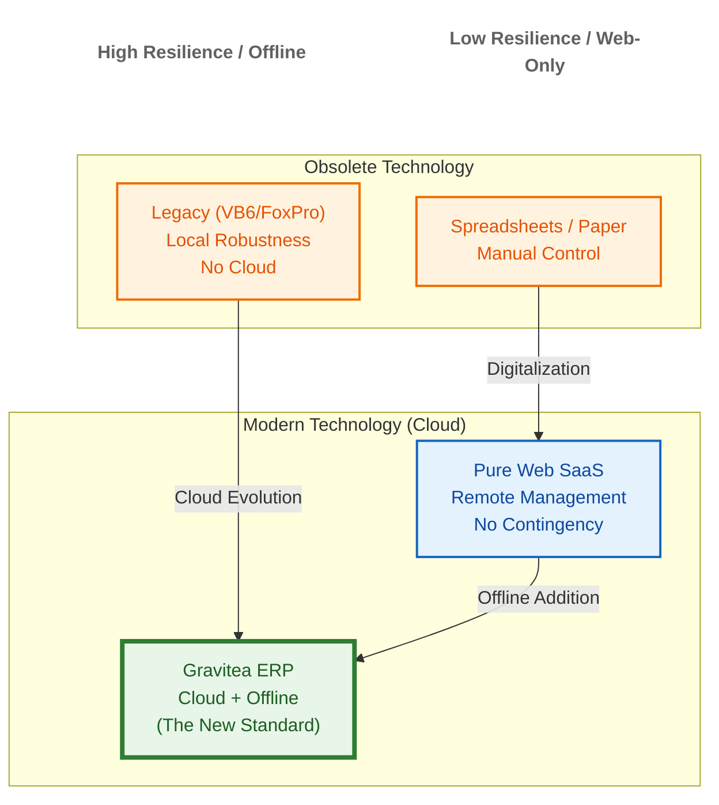
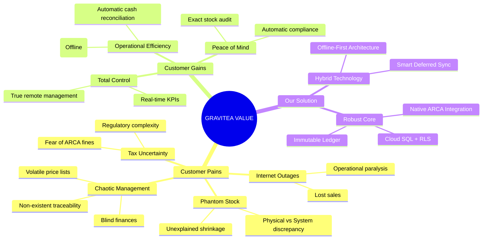
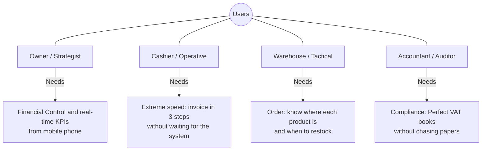
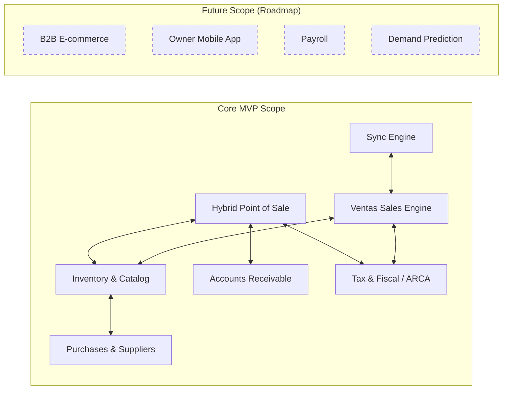

# Product Vision & Scope - Gravitea ERP

## 1. Document Metadata
| Field | Value |
| --- | --- |
| **Owner** | Product Owner (Gravitea) |
| **Key Stakeholders** | CTO, Technical Lead, Commercial Manager |
| **Version** | 0.4 |
| **Last Updated** | 2026-03-01 |
| **Status** | **Research Phase — Evaluating Vertical SaaS Pivot** |
| **Related** | PRD, Roadmap, High-Level Architecture |

### Implementation Progress (March 2026)

| Layer | Status | Details |
|:------|:-------|:--------|
| **Backend Core** | ✅ Complete | Auth, Inventory, Ventas, ARCA, Sync — all modules implemented |
| **Rust/PyO3 Acceleration** | ✅ Complete | 9 Rust modules (crypto, compute, export, observability, security, sync, arca, validation) via PyO3 0.28 |
| **Frontend Prototype** | Partial (Dev) | Next.js 16 prototype — 9 routes, 52 source files |
| **Tenant Customization** | ✅ Complete | Custom fields (6 types), module config, business templates |
| **Observability** | ✅ Complete | Prometheus + Grafana + Jaeger + Loki |
| **API Contracts** | ✅ Complete | 9 OpenAPI contracts, 79 paths, 154 schemas, 137 operations |
| **Purchases (COMPRAS)** | Partial | Supplier model + API contract defined; purchase workflow pending |
| **Reports (REPORTES)** | Partial | API contract defined; implementation pending |
| **Electron POS** | Planned | Planned production target |
| **GCP Deployment** | Planned | Planned after vertical decision |

**Current Metrics (March 2026):** 2,500+ tests (backend + Rust integration) | 79 API paths | 9 OpenAPI contracts | 9 Rust modules | 7,184 GitNexus symbols

### Strategic Inflection Point (March 2026)

> The project has entered a **research and validation phase** to evaluate pivoting from a general-purpose ERP to a **Vertical SaaS** product focused on a specific Argentine industry niche. The general ERP scope proved unsustainable for a team of 4 (2 developers). Four candidate niches are under evaluation: beverage/food distributors, hardware stores, grain collectors, and meat processors. See Roadmap Section 9 for details.

## 2. Strategic Purpose
This document defines the **"North Star"** for Gravitea ERP. It establishes market positioning, differential value proposition, and MVP functional scope. Its goal is to align engineering and business under a unified vision: **Transform traditional SMB retailers into data-driven resilient companies, democratizing Enterprise technology for wholesale and retail stores.**

> **Update (March 2026):** The vision statement above reflects the original general-purpose ERP concept. The team is actively researching a pivot to a **vertical SaaS** model, where the core platform would be adapted to dominate a single industry niche rather than compete horizontally against incumbents (SAP Business One, Odoo, Colppy). The underlying technology (offline-first, ARCA integration, Rust acceleration, tenant customization) remains the same — the change is in **market focus and feature prioritization**.

## 3. Market Context and Opportunity

### 3.1 Positioning Map
Gravitea is strategically positioned in the "Hero" quadrant, resolving the historical tension between legacy software robustness and cloud flexibility.

### 3.2 Pain Points and Solutions (Value Proposition Canvas)

### 3.3 Pain Point Analysis (Deep Dive)
1.  **Network Fragility**: Physical retail cannot depend on a cable. A 10-minute outage during peak hours is devastating for reputation and cash flow, whether it's a hardware store or a convenience store.
2.  **Stock Blindness (Non-existent Traceability)**: Without an immutable record of movements, petty theft and loading errors become "unexplained shrinkage".
3.  **Financial and Supplier Chaos**: Price lists change constantly. Managing replacement costs vs. selling prices without an agile tool leads to decapitalization in any commercial sector.

## 4. Product Vision

### 4.1 Vision Statement
> "Transform Gravitea ERP into the central nervous system of modern retail, guaranteeing absolute operational continuity at the counter and granting owners managerial omnipresence through the cloud, eliminating technical friction from the equation."

### 4.2 Design Guiding Principles
1.  **Pragmatic Offline-First**: It's not an "offline mode", it's the base architecture. The system assumes the network is hostile. Synchronization is a secondary, non-blocking process.
2.  **Transactional Integrity (Ledger)**: We adopt strict accounting practices. There are no `UPDATE stock` operations, only `INSERT movement`. This guarantees forensic traceability for any discrepancy.
3.  **Encapsulated Complexity**: The cashier doesn't need to know what a CAE or a WebService is. The system abstracts tax bureaucracy (ARCA) into a simple user experience: "Green = Approved".
4.  **Enterprise Security for SMBs**: We bring corporate standards (Row Level Security, Encryption at Rest, Audit) to a mass-market segment.

## 5. Target Segment and Personas

### 5.1 Ideal Customer Profile (ICP)

> **Under Review (March 2026):** The ICP is being refined as part of the vertical SaaS pivot research. The original horizontal framing below is being replaced by a niche-first strategy. See Roadmap Section 9 for the four candidate verticals.

Gravitea is pivoting from a horizontal ERP to a **vertical SaaS** product focused on one industry niche.
*   **Candidate Verticals (under evaluation)**:
    * **Distribuidoras de bebidas/alimentos** — ~20,000 businesses, strong offline-first fit (delivery drivers), envases retornables tracking
    * **Ferreterías y materiales de construcción** — ~70,000+ businesses, lowest codebase gap (~30% new code), bulk price updates
    * **Acopiadores de granos** — ~3,000 businesses, highest ARPU ($500-2,000/mo), regulatory moat (AFIP Form 1116)
    * **Frigoríficos y matarifes** — ~3,000 businesses, dual compliance (SENASA + AFIP), highest ARPU potential
*   **Size**: SMBs with 1 to 10 branches (Sweet spot: 2-5).
*   **Maturity**: Businesses in professional or family transition.

### 5.2 Detailed User Archetypes

## 6. Product Scope (MVP v1)

The MVP covers the complete commercial cycle with operational depth, prioritizing robustness over breadth of accessory features.

> **MVP target launch is under review.** The original May 1, 2026 date is paused pending the vertical SaaS niche decision. The MVP scope will be redefined once a target niche is confirmed (expected late March 2026).

### 6.1 In-Scope Modules (Value Proposition per Module)

| Module | Job to be Done (JTBD) | Gravitea Technical Differential | Status | Current Details (Feb 2026) |
| :--- | :--- | :--- | :--- | :--- |
| **Core/Auth** | "I need granular and secure access control." | JWT RS256 with custom claims, RBAC, PostgreSQL RLS, Multi-tenancy, Argon2 passwords | ✅ Complete | Roles, Permissions, Branches, UserViewSet; 3-tier rate limiting |
| **Inventory** | "I want to trust that the stock shown on screen is what's on the shelf." | "Double-Entry Inventory" model. Differential sync of massive catalogs. Encrypted PII for suppliers. | ✅ Complete | Product (encrypted barcode), StockMovement (ledger), BranchStock, Categories, Suppliers (AES-256-GCM), PriceLists, Price/Cost History |
| **Sync Engine** | "I need data to sync without intervention." | SyncSession with vector clocks, PendingOperation with retry logic and idempotency | ✅ Complete | Push/Pull APIs, SyncStatus, conflict resolution, cursor-based pull; **Rust-accelerated merge** (023) |
| **Observability** | "I need complete system visibility." | Prometheus + Grafana + Jaeger + Loki (PLG stack) + OpenTelemetry | ✅ Complete | 11-file observability stack; **Rust-accelerated path normalization** (021) |
| **Ventas (Sales)** | "I want to manage the complete sales cycle." | DRAFT→CONFIRMED→INVOICED lifecycle; immutable INVOICED state; nested order items | ✅ Complete | Customers (CUIT, condicion_iva), SaleOrders, SaleOrderItems; `/confirm`, `/authorize`, `/invoice` actions |
| **ARCA/Tax Fiscal** | "I want to comply with the law without being a tax expert." | Direct WSAA/WSFEv1 SOAP integration; multi-tenant certificates; CAE (online) + CAEA (offline) | ✅ Complete | ARCACredential (encrypted certs), Comprobantes (immutable fiscal ledger), PuntosDeVenta, fiscal QR, CAEA offline codes; **Rust-accelerated IVA validation** (019) + **CAEA batch** (024) |
| **Tenant Customization** | "I want to adapt the ERP to my business without IT." | JSONB custom_data + TenantFieldDefinition metadata; 6 field types; business templates | ✅ Complete | custom_data on Product/Customer/Supplier/SaleOrder; DynamicFields React component; module config; **Rust-accelerated field validation** (025) |
| **Rust Acceleration Layer** | "I need enterprise-grade performance without enterprise costs." | Compiled Rust modules via PyO3 with automatic Python fallback; 2-9x speedups on hot paths | ✅ Complete | 9 modules: crypto (8.7x), compute (2.1-4.4x), export (GIL release), observability (2.4x), security (fail-closed SSRF), sync, arca, validation |
| **Frontend Prototype** | "I need a developer-facing web UI." | Next.js 16 (App Router) + TypeScript + shadcn/ui + TanStack Query v5 | Partial (Dev Prototype) | 9 page routes, 52 source files, JWT in-memory auth; development prototype only — Electron is the planned production client |
| **Purchases & Suppliers** | "I want to update 5,000 prices in 1 minute to avoid losing money." | Smart Excel importer. Automatic PPP and margin calculation. | Partial | Supplier model with encrypted PII (tax_id, email, address) + blind index search; purchase order workflow pending |
| **Hybrid POS (Electron)** | "I want to serve customers quickly and without errors, even if the power goes out." | Optimized Electron engine. Encrypted local SQLite database. Direct RAW printing. | Planned | Planned production target (not started) |
| **Accounts Receivable** | "I want to know who owes me and block their sale if they exceed the limit." | Local credit rules engine (works offline). | Planned | Planned Phase post-MVP |
| **Reports (REPORTES)** | "I want analytics on sales, stock, and financials." | Aggregated reports, BI export, fiscal books. | Not started | Planned before MVP launch |

**Implementation Summary (March 2026):**
- **Completed modules**: Core/Auth, Inventory, Sync Engine, Observability, Ventas, ARCA/Fiscal, Tenant Customization, Rust Acceleration Layer
- **Test Suite**: 2,500+ tests (backend + Rust integration); 0 regressions from Rust layer
- **API Contracts**: 9 OpenAPI contracts, 79 paths, 154 schemas, 137 operations (via drf-spectacular)
- **Rust Modules**: 9 compiled modules (crypto, compute, export, observability, security, sync, arca, validation, lib)
- **Migrations**: 23 total (auth: 3, core: 3, inventario: 6, ventas: 3, facturacion: 3, sync: 5)
- **Tech Stack**: Python 3.14.3, Django 5.2.x, DRF, PostgreSQL 18.1, Redis 7.x, **Rust 1.93.1 (PyO3 0.28, Maturin 1.12.4)**

### 6.2 Functional Ecosystem

### 6.3 Out-of-Scope (Phase 1)
*   **B2C E-commerce**: We won't compete with dedicated platforms (TiendaNube/Shopify) in this phase.
*   **Advanced Production/Manufacturing**: Support will be limited to basic kits/combos, not complex industrial processes.
*   **Last-Mile Logistics**: We won't manage truck fleets or routing in the MVP.

### 6.4 Feature Branch History (001–014)

The following feature branches have been delivered as of February 2026. Branches 002–010 were pre-feature-branch era (orchestration docs, ARCA module groundwork, GGA setup); the formal numbered convention resumed at 011.

| Branch | Commit | Summary |
|:-------|:-------|:--------|
| `001-sal-invo-inve-backend` | `91cb4a1` | Complete backend for Ventas (SaleOrders, Customers), Facturación (ARCA/WSAA/WSFEv1, CAE, fiscal QR), and Inventario (ledger, encrypted suppliers) |
| `011-backend-devops-coherence` | `81b29de` | 59 tasks: Docker consolidation, 13 refactoring fixes, 4 analysis reports (cloud-sql-readiness, arca-gap, cohesion, proposals) |
| `012-prototype-frontend` | `c567815` | Next.js 16 frontend prototype — 46 tasks, 9 page routes, 52 source files, seed commands, OpenAPI integration |
| `013-e2e-frontend-testing` | `9505190` | Browser E2E testing — phases 1–3B, 3 bug fixes (F-015 field mapping, F-016 seed, F-017 SQL trigger), agent instruction files |
| `014-tenant-customization` | `81837ea` | Tenant customization framework — JSONB custom_data, TenantFieldDefinition (6 field types), TenantModuleConfig, BusinessTemplate, DynamicFields React component |
| `015-blueprint-docs-overhaul` | `b2a2c58` | Complete rewrite of 12 Project Blueprint documents |
| `016-prd-overhaul` | `a3c1e7f` | PRD rewrite aligned with features 001-014 |
| `017-rust-bootstrap` | `2db3189` | Rust/PyO3/Maturin toolchain bootstrap — `hello()`, `GraviteaError`, Docker rust-builder stage |
| `018-rust-crypto` | `3db703e` | AES-256-GCM + HMAC-SHA256 blind index via Rust (8.7x speedup) |
| `019-rust-fiscal-compute` | `710994e` | 5 fiscal functions: validate_importes, IVA, CUIT, aggregate_stock (2.1-4.4x) |
| `020-rust-data-export` | `6e73eda` | CSV (UTF-8 BOM) + XLSX generation with Python openpyxl fallback |
| `021-rust-observability-hotpath` | `d7d934f` | 24 compiled regex for normalize_path + sanitize_endpoint_label (2.4x) |
| `022-ssrf-validation-pipeline` | `d7d934f` | SSRF validation: validate_url_safety + check_resolved_ip (831 lines, 308 tests) |
| `023-rust-sync-conflict` | `bb3a780` | Sync conflict merge via serde_json (single + batch with GIL release) |
| `024-rust-arca-batch` | `aa3b65f` | CAEA quincena batch builder via serde_json |
| `025-rust-custom-field-validator` | `d22686a` | Custom field validator — 6 types, dispatcher threshold >5 |
| API Audit | `fa96dc5` | 9 OpenAPI contracts (79 paths, 154 schemas, 137 ops) — merged to develop `bee970d` |

## 7. Success Metrics (KPIs)

1.  **Operational Stability (The "Uptime" Metric)**:
    *   **Goal**: 100% local sales availability.
    *   **Measurement**: Failed sales attempts due to system errors = 0.
2.  **Synchronization Efficiency**:
    *   **Goal**: < 60 seconds to propagate a critical price change to all branches.
3.  **User Adoption**:
    *   **Goal**: New cashier training time < 4 hours.
4.  **Data Health**:
    *   **Goal**: Stock discrepancy < 2% after 3 months of use (vs. 10-15% industry standard).
