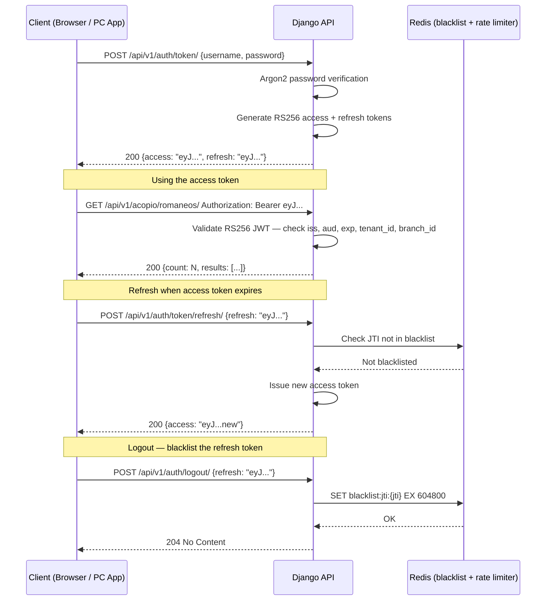
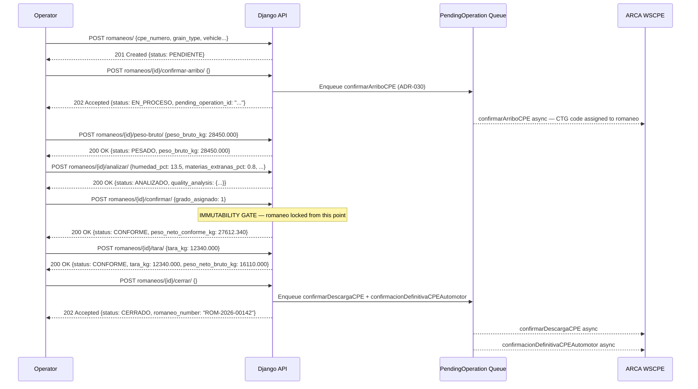

# REST API Design — GraviTea Acopio ERP

> **Version 1.0** · Date: 2026-03-17 · Status: Accepted · Owner: GraviTea Architecture Team

---

## §1 — Document Metadata

| Property | Value |
|----------|-------|
| **Version** | 1.0 |
| **Date** | 2026-03-17 |
| **Status** | Accepted |
| **Owner** | GraviTea Architecture Team |
| **Deliverable type** | Blueprint Specification |
| **Upstream sources** | Data Model v1.0, HLD v1.0, ADR v1.0 |
| **Branch** | `006-acopio-api-design` |

### Changelog

| Version | Date | Author | Changes |
|---------|------|--------|---------|
| Version 1.0 | 2026-03-17 | GraviTea Architecture Team | Initial release — all Phase 1 endpoints defined |

### How to Read This Document

This document is the authoritative REST API contract for GraviTea Acopio ERP. It defines every Phase 1 endpoint — authentication, grain reference data, romaneo lifecycle, quality analysis, storage, weighbridge, producer accounts, and offline sync — with exact request and response field tables, HTTP status codes, and security constraints.

Phase 2 endpoints (WSLPG grain settlement and electronic invoicing via WSFEv1) are included in §12 as deferred endpoint shapes without field tables. They stabilise URL contracts for planning purposes; full schemas are deferred until the corresponding Phase 2 specs are written.

Implementation teams delivering specs 09–12 must conform exactly to the contracts defined here. No deviation from URL structure, field names, or status codes is permitted without a new ADR.

---

## §2 — Design Principles

### §2.1 — RESTful Resource Orientation

Resources are nouns. URL paths represent entities or collections. Actions that do not fit the standard CRUD pattern are expressed as sub-resource verbs (action endpoints) nested under the parent resource.

**Examples**:
- Collection: `GET /api/v1/acopio/romaneos/`
- Member: `GET /api/v1/acopio/romaneos/{id}/`
- Action: `POST /api/v1/acopio/romaneos/{id}/confirmar-arribo/`

Action endpoints are preferred over overloaded PATCH semantics for state transitions. Each transition endpoint has a clear name that reflects the domain operation (confirmar-arribo, peso-bruto, analizar, confirmar, tara, cerrar).

### §2.2 — Versioning Policy

All endpoints are prefixed with `/api/v1/`. When a breaking change is required, a new prefix `/api/v2/` is introduced alongside `/api/v1/`. The previous version is supported for a minimum of **12 months** from the announcement date before deprecation.

Version negotiation is path-based only. No `Accept` header or query-parameter versioning is used.

### §2.3 — Authentication Model

All Phase 1 endpoints (except the auth token endpoints themselves) require a valid Bearer token in the `Authorization` header:

```
Authorization: Bearer <access_token>
```

Tokens are RS256-signed JWTs. **HS256 and the `none` algorithm are rejected at middleware with HTTP 401 before any view logic runs.** The RSA key is 4096 bits. Access tokens expire after 15 minutes. Refresh tokens expire after 7 days and are blacklisted in Redis on logout.

### §2.4 — Tenant Scope Enforcement

The `tenant_id` claim in the JWT is the sole source of tenant context. **`tenant_id` must never appear in the URL path or request body.** Every ORM query is automatically scoped to the requesting tenant via `TenantBoundManager`. PostgreSQL Row Level Security (RLS) enforces isolation at the database engine level as a second independent layer.

Cross-tenant access returns **HTTP 404** (not 403) to prevent enumeration of other tenants' resource identifiers. This rule applies uniformly across all endpoints.

### §2.5 — Error Format

All error responses use RFC 7807 Problem Details (`application/problem+json`):

```json
{
  "type": "https://gravitea.io/errors/{error_type}",
  "title": "Human-readable title",
  "status": 422,
  "detail": "Specific error description",
  "instance": "/api/v1/acopio/romaneos/3fa85f64-5717-4562-b3fc-2c963f66afa6/cerrar/"
}
```

Domain-specific extensions are added as additional top-level fields (e.g., `romaneo_status`, `conflict_strategy`). The full domain error catalog is in §11.

### §2.6 — Pagination Strategy

Two pagination strategies are used depending on data type:

| Strategy | Applied to | Envelope |
|----------|-----------|---------|
| **Cursor-based** | Append-only ledgers: `AccountMovement`, `GrainMovement` | `{ "next": "...", "previous": "...", "results": [...] }` |
| **Page-number** | Reference data (grain types, campaigns) and romaneo lists | `{ "count": N, "next": "...", "previous": "...", "results": [...] }` |

Cursor-based pagination is mandatory for append-only ledgers because they grow unboundedly and page-number pagination would produce unstable page boundaries as new records are appended.

### §2.7 — Filtering and Ordering

Filtering is done via query parameters. Multiple filter values are comma-separated or repeated. Date range filters use ISO 8601 format (`?ts_entrada_after=2026-01-01T00:00:00Z&ts_entrada_before=2026-03-31T23:59:59Z`).

Ordering uses the `ordering` parameter with `-` for descending: `?ordering=-ts_entrada,romaneo_number`.

Boolean filters use `true`/`false` lowercase strings. UUID filters accept the standard hyphenated format.

### §2.8 — Rate Limiting Headers

All responses include rate-limit headers:

| Header | Description |
|--------|-------------|
| `X-RateLimit-Limit` | Request limit for the current window |
| `X-RateLimit-Remaining` | Remaining requests in the current window |
| `X-RateLimit-Reset` | Unix timestamp when the window resets |

Rate limits by endpoint category:

| Category | Limit | Window |
|----------|-------|--------|
| Auth endpoints (`/api/v1/auth/`) | 10 requests | Per IP per minute |
| Standard endpoints | 1,000 requests | Per tenant per minute |

When the limit is exceeded, the response is HTTP 429 with `Retry-After` header.

---

## §3 — Authentication API

Base path: `/api/v1/auth/`

### §3.1 — POST /api/v1/auth/token/

Obtain an access and refresh token pair by authenticating with username and password.

**Request Body** (`application/json`):

| Field | Type | Required | Description |
|-------|------|----------|-------------|
| `username` | string | Yes | User's login identifier |
| `password` | string | Yes | User's password (verified with Argon2) |

**Response** (`200 OK`):

| Field | Type | Description |
|-------|------|-------------|
| `access` | string | RS256-signed JWT access token (15 min TTL) |
| `refresh` | string | RS256-signed JWT refresh token (7 day TTL) |

**Error Responses**:

| Status | Condition |
|--------|-----------|
| 401 | Invalid credentials or account inactive |
| 429 | Rate limit exceeded (10/min/IP) |

### §3.2 — POST /api/v1/auth/token/refresh/

Exchange a valid refresh token for a new access token.

**Request Body** (`application/json`):

| Field | Type | Required | Description |
|-------|------|----------|-------------|
| `refresh` | string | Yes | Valid refresh token |

**Response** (`200 OK`):

| Field | Type | Description |
|-------|------|-------------|
| `access` | string | New RS256-signed JWT access token (15 min TTL) |

**Error Responses**:

| Status | Condition |
|--------|-----------|
| 401 | Refresh token expired, blacklisted, or invalid |

### §3.3 — POST /api/v1/auth/logout/

Invalidate the refresh token by adding its JTI to the Redis blacklist. Access tokens expire naturally after 15 minutes.

**Request Body** (`application/json`):

| Field | Type | Required | Description |
|-------|------|----------|-------------|
| `refresh` | string | Yes | Refresh token to blacklist |

**Response**: `204 No Content`

**Error Responses**:

| Status | Condition |
|--------|-----------|
| 401 | Token already expired or invalid |

### §3.4 — JWT Claim Reference

All JWT tokens issued by GraviTea Acopio ERP contain the following claims:

| Claim | Type | Description |
|-------|------|-------------|
| `sub` | UUID string | AppUser UUID |
| `tenant_id` | UUID string | Owning tenant UUID — authoritative scope source |
| `branch_id` | UUID string | Active branch UUID at login time |
| `exp` | Unix timestamp | Expiry time (15 min for access, 7 days for refresh) |
| `iat` | Unix timestamp | Issued-at time |
| `jti` | UUID string | Unique token identifier (used for blacklist lookup) |
| `iss` | string | Issuer: `https://api.gravitea.io` |
| `aud` | string | Audience: `gravitea-erp-api` |

### §3.5 — Authentication Flow Sequence Diagram



---

## §4 — Grain Reference API

Base path: `/api/v1/acopio/`

Reference data endpoints. `GrainType`, `ToleranceTable`, and `MermaTable` are **global tables with no tenant scope** (ADR-010 — Global vs Per-Tenant Entity Classification). `CampanaConfig` is per-tenant.

### §4.1 — GET /api/v1/acopio/grain-types/

List all grain types. **Global table — no tenant filtering applied.**

**Query Parameters**: `?is_active=true`

**Response** (`200 OK`) — page-number paginated:

| Field | Type | Description |
|-------|------|-------------|
| `id` | UUID | Grain type identifier |
| `codigo` | string | ARCA grain code (e.g., `23` for soja) |
| `nombre` | string | Grain species name |
| `humedad_base_pct` | decimal | Standard moisture base percentage |
| `hf_secado_pct` | decimal | Final moisture target for secado formula (regulatory) |
| `manipuleo_fijo_pct` | decimal | Fixed manipuleo deduction percentage |
| `volatil_fijo_pct` | decimal | Fixed volatil deduction percentage |
| `is_active` | boolean | Whether grain type is in active use |

### §4.2 — GET /api/v1/acopio/tolerance-tables/

List tolerance table versions. **Global table — no tenant filtering.**

**Query Parameters**: `?grain_type={uuid}&valid_from_before={date}`

**Response** (`200 OK`) — page-number paginated:

| Field | Type | Description |
|-------|------|-------------|
| `id` | UUID | Tolerance table identifier |
| `grain_type` | UUID | Grain type this table applies to |
| `version_label` | string | Human-readable version label |
| `valid_from` | date | Effective from date |
| `entries` | array | Tolerance band entries (grade boundaries per quality parameter) |

### §4.3 — GET /api/v1/acopio/merma-tables/

List merma (deduction) table versions. **Global table — no tenant filtering.**

**Query Parameters**: `?grain_type={uuid}`

**Response** (`200 OK`) — page-number paginated:

| Field | Type | Description |
|-------|------|-------------|
| `id` | UUID | Merma table identifier |
| `grain_type` | UUID | Grain type this table applies to |
| `version_label` | string | Human-readable version label |
| `valid_from` | date | Effective from date |
| `entries` | array | Merma band entries (`materias_extranas_from_pct` → `zarandeo_deduction_pct`) |

### §4.4 — GET /api/v1/acopio/campaigns/

List campaign configurations for the requesting tenant.

**Query Parameters**: `?is_active=true&active_now=true`

`?active_now=true` returns campaigns whose `start_date ≤ today ≤ end_date`.

**Response** (`200 OK`) — page-number paginated:

| Field | Type | Description |
|-------|------|-------------|
| `id` | UUID | Campaign identifier |
| `label` | string | Campaign label (e.g., `"Campaña 2025/2026"`) |
| `grain_type` | UUID | Grain type for this campaign |
| `start_date` | date | Campaign start date |
| `end_date` | date | Campaign end date (inclusive) |
| `is_active` | boolean | Manually activated/deactivated flag |

---

## §5 — Romaneo API

Base path: `/api/v1/acopio/romaneos/`

The Romaneo is the central grain reception document. It tracks a truck from arrival through gross weight, quality analysis, merma calculation, grade assignment, tare weight, and final romaneo issuance. The lifecycle spans 6 API state transitions across 6 status values.

### §5.1 — Romaneo Resource Schema

The full Romaneo resource contains 31 fields across 7 groups:

#### Group 1 — Identification

| Field | Type | Null | Description |
|-------|------|------|-------------|
| `id` | UUID | No | Primary key (UUID v4) |
| `romaneo_number` | string | No | Auto-generated sequential number per branch |
| `status` | string | No | `PENDIENTE`\|`EN_PROCESO`\|`PESADO`\|`ANALIZADO`\|`CONFORME`\|`CERRADO` |
| `grain_type` | UUID | No | FK → GrainType |
| `campaign` | UUID | No | FK → CampanaConfig |
| `branch` | UUID | No | FK → Branch (receiving plant) |

#### Group 2 — Timestamps

| Field | Type | Null | Description |
|-------|------|------|-------------|
| `ts_entrada` | datetime | No | Arrival timestamp (used for tolerance table version lookup) |
| `ts_pesada_bruta` | datetime | Yes | Gross weight capture timestamp |
| `ts_calado` | datetime | Yes | Sampling (calado) timestamp |
| `ts_analisis` | datetime | Yes | Quality analysis completion timestamp |
| `ts_descarga` | datetime | Yes | Unloading/discharge timestamp |
| `ts_tara` | datetime | Yes | Tare weight capture timestamp |

#### Group 3 — Vehicle

| Field | Type | Null | Description |
|-------|------|------|-------------|
| `patente_chasis` | string | No | Truck chassis plate (max 15 chars) |
| `patente_acoplado` | string | Yes | Trailer plate (null for single-unit trucks) |
| `driver_name` | string | No | Driver full name |
| `driver_dni` | string | No | Driver DNI |

#### Group 4 — Weight

| Field | Type | Null | Description |
|-------|------|------|-------------|
| `peso_bruto_kg` | decimal(17,3) | Yes | Gross weight from weighbridge |
| `tara_kg` | decimal(17,3) | Yes | Tare weight (captured post-unload via tara/ endpoint) |
| `peso_neto_bruto_kg` | decimal(17,3) | Yes | Computed: peso_bruto_kg − tara_kg |
| `weighbridge_device` | UUID | Yes | FK → WeighbridgeDevice used for weighing |

#### Group 5 — CPE / Origin

| Field | Type | Null | Description |
|-------|------|------|-------------|
| `cpe_numero` | string | No | Carta de Porte Electrónica number |
| `ctg_codigo` | string | Yes | CTG code assigned by ARCA at confirmarArriboCPE |
| `producer_cuit` | string | No | Depositing producer CUIT (plaintext in API; encrypted at rest) |
| `origin_locality` | string | No | Field/establishment origin locality |

#### Group 6 — Storage Assignment

| Field | Type | Null | Description |
|-------|------|------|-------------|
| `storage_unit` | UUID | Yes | FK → StorageUnit (set at discharge) |
| `grain_lot` | UUID | Yes | FK → GrainLot (set at CONFORME) |

#### Group 7 — Quality Outcome

| Field | Type | Null | Description |
|-------|------|------|-------------|
| `operator_id` | UUID | No | FK → AppUser (responsible operator) |
| `laboratorista_id` | UUID | Yes | FK → AppUser (lab analyst; null if external) |
| `device_id` | string | Yes | Device identifier for AI provenance |
| `grado_asignado` | integer | Yes | Assigned grade (1/2/3 cereals; 0 oleaginosas; null before confirmar/) |
| `bonificacion_rebaja_pct` | decimal(5,2) | Yes | Net price adjustment % (positive=bonus, negative=deduction) |
| `tolerance_table_version` | UUID | Yes | FK → ToleranceTable version used for grading |
| `peso_neto_conforme_kg` | decimal(17,3) | Yes | Final net weight after all merma deductions |

### §5.2 — POST /api/v1/acopio/romaneos/

Create a new romaneo in PENDIENTE status.

**Request Body** (`application/json`):

| Field | Type | Required | Description |
|-------|------|----------|-------------|
| `grain_type` | UUID | Yes | Grain type being received |
| `campaign` | UUID | Yes | Active campaign UUID |
| `cpe_numero` | string | Yes | CPE document number from the truck |
| `producer_cuit` | string | Yes | Depositing producer CUIT |
| `origin_locality` | string | Yes | Origin locality |
| `patente_chasis` | string | Yes | Truck chassis plate |
| `patente_acoplado` | string | No | Trailer plate (omit for single-unit) |
| `driver_name` | string | Yes | Driver full name |
| `driver_dni` | string | Yes | Driver DNI |
| `ts_entrada` | datetime | Yes | Arrival timestamp (ISO 8601) |
| `operator_id` | UUID | Yes | Responsible operator UUID |

**Response** (`201 Created`): Full romaneo resource (§5.1) with `status: PENDIENTE`.

### §5.3 — GET /api/v1/acopio/romaneos/

List romaneos for the requesting tenant. Page-number paginated.

**Query Parameters**:

| Parameter | Type | Description |
|-----------|------|-------------|
| `status` | string | Filter by status value |
| `grain_type` | UUID | Filter by grain type |
| `campaign` | UUID | Filter by campaign |
| `branch` | UUID | Filter by branch |
| `ts_entrada_after` | datetime | Arrival timestamp lower bound (ISO 8601) |
| `ts_entrada_before` | datetime | Arrival timestamp upper bound (ISO 8601) |
| `ordering` | string | Sort fields (e.g., `-ts_entrada`) |

**Response** (`200 OK`):

```json
{
  "count": 142,
  "next": "/api/v1/acopio/romaneos/?page=2",
  "previous": null,
  "results": [ ... ]
}
```

Each result is the full romaneo resource (§5.1).

### §5.4 — GET /api/v1/acopio/romaneos/{id}/

Retrieve a single romaneo by UUID. Response includes nested `quality_analysis` and `merma_calculation` objects when present.

**Response** (`200 OK`): Full romaneo resource (§5.1) with optional nested objects:

| Nested field | Present when | Content |
|---|---|---|
| `quality_analysis` | status ≥ ANALIZADO | QualityAnalysis resource (§6.1) |
| `merma_calculation` | status ≥ CONFORME | MermaCalculation summary (inputs + intermediates + peso_final_kg) |

**Error Responses**:

| Status | Condition |
|--------|-----------|
| 404 | Romaneo not found or belongs to different tenant |

### §5.5 — PATCH /api/v1/acopio/romaneos/{id}/

Update editable fields on a romaneo. **Guard: only PENDIENTE or EN_PROCESO romaneos may be patched.** Attempting to PATCH a CONFORME or CERRADO romaneo returns HTTP 409 `romaneo_immutable`.

**Patchable fields**: `patente_chasis`, `patente_acoplado`, `driver_name`, `driver_dni`, `origin_locality`, `storage_unit`, `laboratorista_id`.

**Error Responses**:

| Status | Error type | Condition |
|--------|-----------|-----------|
| 409 | `romaneo_immutable` | Romaneo is in CONFORME or CERRADO state |
| 404 | — | Romaneo not found |

### §5.6 — State Transition Endpoints

These endpoints advance the romaneo through its lifecycle. Each is a POST to a sub-resource action URL nested under the romaneo member.

#### §5.6.1 — POST /api/v1/acopio/romaneos/{id}/confirmar-arribo/

Advance romaneo from PENDIENTE → EN_PROCESO. Enqueues `confirmarArriboCPE` to the ARCA WSCPE store-and-forward queue (ADR-030). Returns HTTP **202 Accepted** because the ARCA call is asynchronous — the romaneo state advances immediately regardless of connectivity.

**Request Body**: Empty `{}` or omit body.

**Response** (`202 Accepted`):

| Field | Type | Description |
|-------|------|-------------|
| `id` | UUID | Romaneo UUID |
| `status` | string | `EN_PROCESO` |
| `pending_operation_id` | UUID | ID of the enqueued WSCPE confirmarArriboCPE operation |

**Error Responses**:

| Status | Error type | Condition |
|--------|-----------|-----------|
| 409 | `invalid_state_transition` | Romaneo not in PENDIENTE state |
| 404 | — | Romaneo not found |

#### §5.6.2 — POST /api/v1/acopio/romaneos/{id}/peso-bruto/

Advance romaneo from EN_PROCESO → PESADO. Captures gross weight from weighbridge.

**Request Body** (`application/json`):

| Field | Type | Required | Description |
|-------|------|----------|-------------|
| `peso_bruto_kg` | decimal(17,3) | Yes | Gross weight reading |
| `weighbridge_device_id` | UUID | No | Weighbridge device used (null for manual entry) |
| `ts_pesada_bruta` | datetime | No | Capture timestamp (defaults to now) |

**Response** (`200 OK`):

| Field | Type | Description |
|-------|------|-------------|
| `id` | UUID | Romaneo UUID |
| `status` | string | `PESADO` |
| `peso_bruto_kg` | decimal(17,3) | Recorded gross weight |
| `ts_pesada_bruta` | datetime | Capture timestamp |

**Error Responses**:

| Status | Error type | Condition |
|--------|-----------|-----------|
| 409 | `invalid_state_transition` | Romaneo not in EN_PROCESO state |
| 422 | — | `peso_bruto_kg` ≤ 0 |

#### §5.6.3 — POST /api/v1/acopio/romaneos/{id}/analizar/

Advance romaneo from PESADO → ANALIZADO. Creates the `QualityAnalysis` satellite record with all 9 quality parameters inline.

**Request Body** (`application/json`):

| Field | Type | Required | Notes |
|-------|------|----------|-------|
| `humedad_pct` | decimal(5,2) | Yes | Moisture % — input Hi to secado formula |
| `materias_extranas_pct` | decimal(5,2) | Yes | Foreign material % — drives zarandeo lookup |
| `granos_danados_pct` | decimal(5,2) | Yes | Damaged grains % |
| `granos_quebrados_pct` | decimal(5,2) | Yes | Broken grains % |
| `granos_ardidos_pct` | decimal(5,2) | Yes | Heat-damaged grains % |
| `cuerpos_extranos_pct` | decimal(5,2) | Yes | Foreign bodies % |
| `peso_hectolitrico_kg` | decimal(5,2) | No | Hectolitre weight — cereals only (trigo, maíz, sorgo) |
| `proteina_pct` | decimal(5,2) | No | Protein % — trigo only |
| `granos_verdes_pct` | decimal(5,2) | No | Green grains % — soja only |
| `analysis_timestamp` | datetime | No | Defaults to now |
| `sample_reference` | string | No | Lab sample reference number |

**Response** (`200 OK`):

| Field | Type | Description |
|-------|------|-------------|
| `id` | UUID | Romaneo UUID |
| `status` | string | `ANALIZADO` |
| `quality_analysis` | object | Created QualityAnalysis resource (§6.1) |

**Error Responses**:

| Status | Error type | Condition |
|--------|-----------|-----------|
| 409 | `invalid_state_transition` | Romaneo not in PESADO state |
| 422 | — | Required quality field missing or value out of range |

#### §5.6.4 — POST /api/v1/acopio/romaneos/{id}/confirmar/

Advance romaneo from ANALIZADO → CONFORME. Triggers merma calculation (Rust-accelerated via PyO3 FFI) and sets final quality outcome fields. **This is the immutability gate — no PATCH is possible on a CONFORME or CERRADO romaneo.**

**Request Body** (`application/json`):

| Field | Type | Required | Description |
|-------|------|----------|-------------|
| `grado_asignado` | integer | Yes | Assigned grade (1, 2, or 3 for cereals; 0 for oleaginosas) |
| `bonificacion_rebaja_pct` | decimal(5,2) | No | Net price adjustment % (positive=bonus, negative=deduction; default 0.00) |

**Response** (`200 OK`):

| Field | Type | Description |
|-------|------|-------------|
| `id` | UUID | Romaneo UUID |
| `status` | string | `CONFORME` |
| `grado_asignado` | integer | Assigned grade |
| `bonificacion_rebaja_pct` | decimal(5,2) | Net price adjustment % |
| `tolerance_table_version` | UUID | ToleranceTable version used |
| `peso_neto_conforme_kg` | decimal(17,3) | Final net weight after all merma deductions |
| `merma_calculation` | object | Full MermaCalculation result (all 4 steps + intermediates) |

**Error Responses**:

| Status | Error type | Condition |
|--------|-----------|-----------|
| 409 | `invalid_state_transition` | Romaneo not in ANALIZADO state |
| 422 | — | `grado_asignado` out of valid range for grain type |

#### §5.6.5 — POST /api/v1/acopio/romaneos/{id}/tara/

Capture tare weight after grain unloading. The romaneo remains in CONFORME state; this endpoint sets `tara_kg` and computes `peso_neto_bruto_kg`. It is a prerequisite for `cerrar/`.

**Request Body** (`application/json`):

| Field | Type | Required | Description |
|-------|------|----------|-------------|
| `tara_kg` | decimal(17,3) | Yes | Tare (empty truck) weight |
| `weighbridge_device_id` | UUID | No | Weighbridge device used (null for manual entry) |
| `ts_tara` | datetime | No | Tare capture timestamp (defaults to now) |

**Response** (`200 OK`):

| Field | Type | Description |
|-------|------|-------------|
| `id` | UUID | Romaneo UUID |
| `status` | string | `CONFORME` (unchanged) |
| `tara_kg` | decimal(17,3) | Recorded tare weight |
| `peso_neto_bruto_kg` | decimal(17,3) | Computed: peso_bruto_kg − tara_kg |
| `ts_tara` | datetime | Tare capture timestamp |

**Error Responses**:

| Status | Error type | Condition |
|--------|-----------|-----------|
| 409 | `invalid_state_transition` | Romaneo not in CONFORME state |
| 409 | `romaneo_immutable` | Romaneo is already CERRADO |
| 422 | — | `tara_kg` ≥ `peso_bruto_kg` |

#### §5.6.6 — POST /api/v1/acopio/romaneos/{id}/cerrar/

Advance romaneo from CONFORME → CERRADO. Requires `tara_kg` to be present. Enqueues `confirmarDescargaCPE` and `confirmacionDefinitivaCPEAutomotor` to the ARCA WSCPE store-and-forward queue. Returns HTTP **202 Accepted** because both ARCA calls are asynchronous.

**Request Body**: Empty `{}` or omit body.

**Response** (`202 Accepted`):

| Field | Type | Description |
|-------|------|-------------|
| `id` | UUID | Romaneo UUID |
| `status` | string | `CERRADO` |
| `romaneo_number` | string | Final romaneo number (server-assigned sequential if created offline) |
| `pending_operation_id` | UUID | ID of the first enqueued WSCPE operation |

**Error Responses**:

| Status | Error type | Condition |
|--------|-----------|-----------|
| 409 | `invalid_state_transition` | Romaneo not in CONFORME state |
| 422 | `tare_weight_required` | `tara_kg` is null — must call `tara/` first |

### §5.7 — GET /api/v1/acopio/romaneos/{id}/merma-preview/

Non-persisting merma calculation preview. Returns projected deductions based on the romaneo's current quality analysis values. Does not create or modify any record. Available when romaneo is in PESADO or ANALIZADO state.

**Response** (`200 OK`):

| Field | Type | Description |
|-------|------|-------------|
| `peso_neto_bruto_kg` | decimal(17,3) | Input gross-minus-tare weight used for projection |
| `zarandeo_pct` | decimal(5,2) | Projected zarandeo deduction % |
| `secado_pct` | decimal(5,2) | Projected secado deduction % (0.00 if Hi ≤ Hf) |
| `manipuleo_pct` | decimal(5,2) | Fixed manipuleo % from GrainType |
| `volatil_pct` | decimal(5,2) | Fixed volatil % from GrainType |
| `projected_peso_neto_conforme_kg` | decimal(17,3) | Projected final net weight |
| `total_merma_kg` | decimal(17,3) | Total projected deduction in kg |

### §5.8 — Romaneo Lifecycle Sequence Diagram



### §5.9 — Immutability Rules

A romaneo in CONFORME or CERRADO state is immutable. Any attempt to PATCH or PUT the romaneo, or to call a state transition that requires a prior state the romaneo has already passed, returns HTTP 409.

**Immutable-state PATCH error response** (`application/problem+json`):

```json
{
  "type": "https://gravitea.io/errors/romaneo_immutable",
  "title": "Romaneo is immutable",
  "status": 409,
  "detail": "Romaneo ROM-2026-00142 is in CONFORME state and cannot be modified.",
  "instance": "/api/v1/acopio/romaneos/3fa85f64-5717-4562-b3fc-2c963f66afa6/",
  "romaneo_status": "CONFORME"
}
```

The same applies to all out-of-sequence state transitions (e.g., calling `cerrar/` on a PESADO romaneo). In those cases the error type is `invalid_state_transition` and `current_status` and `attempted_transition` extension fields are included.

---

## §6 — Quality Analysis API

Nested under romaneo. QualityAnalysis is a one-to-one satellite of Romaneo.

Base path: `/api/v1/acopio/romaneos/{romaneo_id}/quality-analysis/`

### §6.1 — QualityAnalysis Resource Schema

| Field | Type | Null | Notes |
|-------|------|------|-------|
| `id` | UUID | No | Primary key |
| `romaneo` | UUID | No | Parent romaneo UUID |
| `humedad_pct` | decimal(5,2) | No | Moisture % (Hi for secado formula) |
| `materias_extranas_pct` | decimal(5,2) | No | Foreign material % (zarandeo lookup input) |
| `granos_danados_pct` | decimal(5,2) | No | Damaged grains % |
| `granos_quebrados_pct` | decimal(5,2) | No | Broken grains % |
| `granos_ardidos_pct` | decimal(5,2) | No | Heat-damaged grains % |
| `cuerpos_extranos_pct` | decimal(5,2) | No | Foreign bodies % |
| `peso_hectolitrico_kg` | decimal(5,2) | Yes | Hectolitre weight — cereals only |
| `proteina_pct` | decimal(5,2) | Yes | Protein % — trigo only |
| `granos_verdes_pct` | decimal(5,2) | Yes | Green grains % — soja only |
| `analysis_timestamp` | datetime | No | When the sample was analysed |
| `sample_reference` | string | Yes | Lab sample reference number |

### §6.2 — POST /api/v1/acopio/romaneos/{romaneo_id}/quality-analysis/

Create a quality analysis record. **Guard: romaneo must be in EN_PROCESO or PESADO state.** This endpoint does not advance the romaneo state — use `analizar/` (§5.6.3) for the combined create-and-advance action.

**Request Body**: QualityAnalysis fields from §6.1 (excluding `id` and `romaneo`).

**Response** (`201 Created`): Full QualityAnalysis resource.

**Error Responses**:

| Status | Condition |
|--------|-----------|
| 409 | Romaneo is in ANALIZADO or later state (record already exists) |
| 409 | Romaneo is in PENDIENTE state (must be at least EN_PROCESO) |

### §6.3 — GET /api/v1/acopio/romaneos/{romaneo_id}/quality-analysis/

Retrieve the quality analysis record for a romaneo.

**Response** (`200 OK`): Full QualityAnalysis resource (§6.1).

**Error Responses**:

| Status | Condition |
|--------|-----------|
| 404 | Quality analysis not yet created for this romaneo |

### §6.4 — PATCH /api/v1/acopio/romaneos/{romaneo_id}/quality-analysis/

Update quality analysis parameters. **Guard: romaneo must be in ANALIZADO state.** Once romaneo is CONFORME or CERRADO, no changes are permitted.

**Request Body**: Partial QualityAnalysis fields (any measurable parameters from §6.1).

**Response** (`200 OK`): Updated QualityAnalysis resource.

**Error Responses**:

| Status | Condition |
|--------|-----------|
| 409 | Romaneo is in CONFORME or CERRADO state (immutable) |
| 409 | Romaneo is in PESADO or earlier state (use POST, not PATCH) |

---

## §7 — Storage API

Base path: `/api/v1/acopio/`

Manages physical storage infrastructure (silos, bins) and grain lot inventory.

### §7.1 — GET /api/v1/acopio/storage-units/

List storage units for the requesting tenant.

**Query Parameters**: `?branch={uuid}&unit_type=SILO_VERTICAL&is_active=true`

**Response** (`200 OK`) — page-number paginated:

| Field | Type | Description |
|-------|------|-------------|
| `id` | UUID | Storage unit identifier |
| `name` | string | Silo or bin name |
| `unit_type` | string | `SILO_VERTICAL`\|`CELDA_HORIZONTAL`\|`SECADERO_BIN` |
| `branch` | UUID | FK → Branch |
| `capacity_tonnes` | decimal(12,3) | Nominal capacity in tonnes |
| `current_grain_type` | UUID | FK → GrainType currently stored (null if empty) |
| `current_occupancy_kg` | decimal(17,3) | **Derived** — sum of GrainMovements for this unit (computed on demand) |
| `is_active` | boolean | Active/inactive flag |

`current_occupancy_kg` is a computed field derived on demand from `GrainMovement` ledger aggregation — it is not stored.

### §7.2 — GET /api/v1/acopio/storage-units/{id}/

Retrieve a single storage unit with full detail including grain lot membership list.

**Response** (`200 OK`): Full storage unit resource (§7.1) plus `environment_sensor_id` and list of current `grain_lots`.

### §7.3 — GET /api/v1/acopio/grain-lots/

List grain lots for the requesting tenant.

**Query Parameters**: `?branch={uuid}&grain_type={uuid}&campaign={uuid}&grado={int}&storage_unit={uuid}`

**Response** (`200 OK`) — page-number paginated:

| Field | Type | Description |
|-------|------|-------------|
| `id` | UUID | Grain lot identifier |
| `lot_code` | string | Generated code: `BRANCH-GRAIN-CAMPAIGN-GRADE` |
| `branch` | UUID | FK → Branch |
| `grain_type` | UUID | FK → GrainType |
| `campaign` | UUID | FK → CampanaConfig |
| `grado` | integer | Grade (1/2/3 cereals; 0 oleaginosas per RG 3593) |
| `storage_unit` | UUID | FK → StorageUnit |
| `total_kg` | decimal(17,3) | Running grain balance (updated on each GrainMovement) |
| `is_own_grain` | boolean | True = balance-sheet asset (1.3.XX); False = off-balance-sheet custody (8.1.XX) |

### §7.4 — GET /api/v1/acopio/grain-lots/{id}/

Retrieve a single grain lot with full detail.

**Response** (`200 OK`): Full grain lot resource (§7.3).

### §7.5 — GET /api/v1/acopio/grain-lots/{id}/movements/

Cursor-paginated grain movement ledger for a grain lot. **Append-only — PATCH and DELETE return HTTP 405 (`append_only_violation`).**

**Query Parameters**: `?cursor={cursor_token}&movement_type=DEPOSIT&ordering=-movement_at`

**Response** (`200 OK`) — cursor-paginated:

| Field | Type | Description |
|-------|------|-------------|
| `id` | UUID | Movement identifier |
| `grain_lot` | UUID | Parent grain lot UUID |
| `movement_type` | string | `DEPOSIT`\|`WITHDRAWAL`\|`TRANSFER_IN`\|`TRANSFER_OUT` |
| `romaneo` | UUID | Source romaneo (DEPOSIT type only; null otherwise) |
| `quantity_kg` | decimal(17,3) | Positive = inflow; negative = outflow |
| `movement_at` | datetime | Timestamp (auto_now_add — immutable) |
| `reference_document` | string | Document reference for non-romaneo movements |

---

## §8 — Weighbridge API

Base path: `/api/v1/acopio/weighbridges/`

### §8.1 — GET /api/v1/acopio/weighbridges/

List weighbridge devices for the requesting tenant.

**Query Parameters**: `?branch={uuid}&is_active=true&interface_type=TCP_IP`

**Response** (`200 OK`) — page-number paginated:

| Field | Type | Description |
|-------|------|-------------|
| `id` | UUID | Device identifier |
| `name` | string | Human label (e.g., "Báscula Principal") |
| `serial_number` | string | Manufacturer serial number |
| `branch` | UUID | FK → Branch |
| `interface_type` | string | `RS232`\|`TCP_IP` |
| `is_active` | boolean | Active/inactive flag |
| `last_calibration_date` | date | Date of most recent calibration record |
| `next_calibration_due` | date | Next mandatory calibration date |

### §8.2 — GET /api/v1/acopio/weighbridges/{id}/live-reading/

Request the current weight reading from a connected weighbridge device over its configured protocol (Modbus RTU, Modbus ASCII, or TCP/IP). Returns HTTP **503** if the device is unreachable.

**Response** (`200 OK`):

| Field | Type | Description |
|-------|------|-------------|
| `device_id` | UUID | Weighbridge device UUID |
| `reading_kg` | decimal(17,3) | Current weight reading |
| `is_stable` | boolean | True if weight has stabilised within threshold |
| `read_at` | datetime | Timestamp of reading |

**Error Responses**:

| Status | Error type | Condition |
|--------|-----------|-----------|
| 503 | `weighbridge_disconnected` | Device unreachable or not responding |

---

## §9 — Producer Accounts API

Base path: `/api/v1/cuentas/`

Manages producer current accounts (cuentas corrientes de productores), grain and monetary balances, price fixation events, and the posición consolidada view.

### §9.1 — Account Resource Schema

| Field | Type | Null | Description |
|-------|------|------|-------------|
| `id` | UUID | No | Primary key |
| `producer_cuit` | string | No | Depositing producer CUIT (plaintext in API; AES-256-GCM encrypted at rest — see §9.8) |
| `branch` | UUID | No | FK → Branch (per-plant scope) |
| `grain_type` | UUID | No | FK → GrainType |
| `campaign` | UUID | No | FK → CampanaConfig |
| `grain_balance_kg` | decimal(17,3) | No | Running grain balance in kg |
| `ars_balance` | decimal(17,3) | No | ARS monetary balance |
| `usd_balance` | decimal(17,3) | No | USD monetary balance |
| `is_active` | boolean | No | Active/inactive flag |

Logical uniqueness: `(tenant, producer_cuit, branch, grain_type, campaign)`.

### §9.2 — GET /api/v1/cuentas/accounts/

List producer accounts for the requesting tenant.

**Query Parameters**: `?producer_cuit={cuit}&grain_type={uuid}&campaign={uuid}&branch={uuid}&is_active=true`

`?producer_cuit=` uses the HMAC-SHA256 blind index — see §9.8.

**Response** (`200 OK`) — page-number paginated: list of account resources (§9.1).

### §9.3 — GET /api/v1/cuentas/accounts/{id}/

Retrieve a single producer account.

**Response** (`200 OK`): Full account resource (§9.1).

**Error Responses**:

| Status | Condition |
|--------|-----------|
| 404 | Account not found or belongs to different tenant |

### §9.4 — GET /api/v1/cuentas/accounts/{id}/movements/

Cursor-paginated movement ledger for a producer account. **Append-only — PATCH and DELETE return HTTP 405 (`append_only_violation`).**

**Query Parameters**: `?cursor={token}&movement_type=CEG_DEPOSIT&ordering=-movement_at`

**Response** (`200 OK`) — cursor-paginated:

| Field | Type | Description |
|-------|------|-------------|
| `id` | UUID | Movement identifier |
| `producer_account` | UUID | Parent account UUID |
| `movement_type` | string | One of 8 types: `CEG_DEPOSIT`\|`LPG_SALE`\|`FIJACION`\|`RETIRO`\|`SERVICE_CHARGE`\|`CANJE_GRAIN_DEBIT`\|`CANJE_INPUT_CREDIT`\|`RETENTION_DEDUCTION` |
| `romaneo` | UUID | Source romaneo (CEG_DEPOSIT only; null otherwise) |
| `quantity_kg` | decimal(17,3) | Grain sub-ledger delta (positive=inflow, negative=outflow; null for monetary-only) |
| `ars_amount` | decimal(17,3) | ARS monetary delta (positive=credit, negative=debit; null for grain-only) |
| `usd_amount` | decimal(17,3) | USD monetary delta |
| `movement_at` | datetime | Timestamp (auto_now_add — immutable) |
| `reference_document` | string | External document reference |
| `notes` | string | Operator notes |

### §9.5 — GET /api/v1/cuentas/posicion-consolidada/

Returns the **derived view** of a producer's consolidated position across all branches of the requesting tenant for a given campaign. This is a computed SQL aggregation over `ProducerAccount` records — no stored entity is queried directly (ADR-013 — Posición Consolidada as Derived View). The result is always current; no cache invalidation is required.

**Query Parameters**:

| Parameter | Type | Required | Description |
|-----------|------|----------|-------------|
| `producer_cuit` | string | Yes | Producer CUIT (uses blind index equality search) |
| `campaign` | UUID | Yes | Campaign UUID |

**Response** (`200 OK`):

| Field | Type | Description |
|-------|------|-------------|
| `producer_cuit` | string | Producer CUIT |
| `campaign` | UUID | Campaign UUID |
| `total_grain_balance_kg` | decimal(17,3) | Sum of grain_balance_kg across all branches |
| `total_ars_balance` | decimal(17,3) | Sum of ars_balance across all branches |
| `total_usd_balance` | decimal(17,3) | Sum of usd_balance across all branches |
| `branch_breakdown` | array | Per-branch balance rows (`branch`, `grain_type`, `grain_balance_kg`, `ars_balance`, `usd_balance`) |

### §9.6 — POST /api/v1/cuentas/fijaciones/

Create a price fixation record linking a grain deposit to a LiquidacionPrimaria.

**Request Body** (`application/json`):

| Field | Type | Required | Description |
|-------|------|----------|-------------|
| `deposit_movement` | UUID | Yes | Source CEG_DEPOSIT AccountMovement UUID |
| `liquidacion` | UUID | Yes | Target LiquidacionPrimaria UUID |
| `pizarra_price` | decimal(17,3) | Yes | Published pizarra price at fixation time |
| `kg_fixed` | decimal(17,3) | Yes | Kg quantity being fixed in this record |

**Response** (`201 Created`): Full FijacionRecord resource.

**Error Responses**:

| Status | Error type | Condition |
|--------|-----------|-----------|
| 422 | `insufficient_grain_balance` | `kg_fixed` exceeds `remaining_unfixed_kg` of the deposit movement |

### §9.7 — GET /api/v1/cuentas/fijaciones/

List price fixation records for the requesting tenant.

**Query Parameters**: `?producer_cuit={cuit}&campaign={uuid}&ordering=-fixed_at`

**Response** (`200 OK`) — page-number paginated:

| Field | Type | Description |
|-------|------|-------------|
| `id` | UUID | Fixation record identifier |
| `deposit_movement` | UUID | Source CEG_DEPOSIT movement UUID |
| `pizarra_price` | decimal(17,3) | Pizarra price at fixation time |
| `kg_fixed` | decimal(17,3) | Kg quantity fixed in this record |
| `remaining_unfixed_kg` | decimal(17,3) | Remaining unfixed kg from original deposit (0.000 = fully fixed) |
| `fixed_at` | datetime | Fixation timestamp (immutable) |
| `fixed_by` | UUID | Operator UUID |

### §9.8 — Encrypted CUIT Field Behaviour

`producer_cuit` is stored encrypted at rest using AES-256-GCM (ADR-022 — AES-256-GCM Field-Level Encryption). The API accepts and returns the CUIT in plaintext — encryption and decryption are transparent to the client at the application layer.

**Search behaviour**: Filtering by `?producer_cuit=` uses the **HMAC-SHA256 blind index** stored alongside the encrypted value. Only equality search (`?producer_cuit=20123456789`) is supported. LIKE queries, range queries, and prefix searches on CUIT are not supported and return HTTP 422.

The blind index is deterministic for the same CUIT under the same HMAC key, enabling equality lookup without decrypting any records. The blind index is recomputed for all affected records when the HMAC key is rotated.

---

## §10 — Offline Sync API

Base path: `/api/v1/sync/`

### §10.1 — Sync Model Overview

GraviTea Acopio ERP is **offline-first** — connectivity is treated as unreliable and all non-fiscal operations function without internet access (ADR-028 — Offline-First as Base Architecture). The sync protocol uses:

- **SyncSession watermarks**: Per-device, per-tenant sequence counters tracking the last successfully synced server position.
- **Delta pull**: The client sends its last watermark; the server returns all changes since that position.
- **Batch push**: The client sends all locally created or modified records; the server applies conflict resolution and returns per-item results.

**Conflict Resolution Strategies** (ADR-029 — 5 strategies by data type):

| Strategy | Applied to |
|----------|-----------|
| `server_wins` | Configuration data (tenant settings, tolerance tables, grain type definitions) |
| `last_write_wins` | Inventory levels |
| `additive` | Sales transactions, romaneo entries (all records merged — none discarded) |
| `most_complete_wins` | Customer and producer data (field-by-field merge; Rust implementation, spec-023) |
| `server_assigns_final` | Document numbering (comprobante numbers, romaneo sequential IDs) |

**PendingOperation queue** (ADR-030 — Store-and-Forward Queue for ARCA Calls): ARCA WSCPE calls that cannot execute during offline periods are enqueued in `PendingOperation` and transmitted FIFO on reconnect. This queue is durable across device restarts.

### §10.2 — GET /api/v1/sync/delta/

Pull all server changes since the client's last known watermark.

**Query Parameters**:

| Parameter | Type | Required | Description |
|-----------|------|----------|-------------|
| `last_seq` | integer | Yes | Client's last known server sequence position |
| `limit` | integer | No | Maximum number of changes to return (default 500) |

**Response** (`200 OK`):

| Field | Type | Description |
|-------|------|-------------|
| `server_seq` | integer | Current server sequence number after this response |
| `has_more` | boolean | True if additional changes remain beyond this batch |
| `changes` | array | Array of change objects |

Each change object:

| Field | Type | Description |
|-------|------|-------------|
| `seq` | integer | Server sequence number of this change |
| `entity_type` | string | Entity type (e.g., `romaneo`, `producer_account`) |
| `entity_id` | UUID | Entity UUID |
| `operation` | string | `create`\|`update`\|`delete` |
| `data` | object | Full entity state at this sequence position |
| `changed_at` | datetime | Server-side change timestamp |

### §10.3 — POST /api/v1/sync/push/

Push locally created or modified records to the server. Each mutation is processed independently — a failure on one record does not block others.

**Request Body** (`application/json`):

| Field | Type | Required | Description |
|-------|------|----------|-------------|
| `client_seq` | integer | Yes | Client's watermark at time of push |
| `mutations` | array | Yes | Array of mutation objects |

Each mutation object:

| Field | Type | Required | Description |
|-------|------|----------|-------------|
| `entity_type` | string | Yes | Entity type |
| `entity_id` | UUID | Yes | Entity UUID (UUID v4 generated offline) |
| `operation` | string | Yes | `create`\|`update`\|`delete` |
| `data` | object | Yes | Full entity state |
| `client_timestamp` | datetime | Yes | Vector clock timestamp for conflict resolution |

**Response** (`200 OK`):

| Field | Type | Description |
|-------|------|-------------|
| `server_seq` | integer | Updated server sequence after merge |
| `results` | array | Per-mutation conflict signal objects (see §10.6) |

### §10.4 — GET /api/v1/sync/pending-ops/

List pending ARCA operations in the store-and-forward queue.

**Query Parameters**: `?status=PENDING&operation_type=WSCPE_CONFIRMAR_ARRIBO`

**Response** (`200 OK`) — page-number paginated:

| Field | Type | Description |
|-------|------|-------------|
| `id` | UUID | PendingOperation identifier |
| `operation_type` | string | Target ARCA method (`WSCPE_CONFIRMAR_ARRIBO`, `WSCPE_DESCARGAR_DESTINO`, `WSCPE_CONFIRMACION_DEFINITIVA`) |
| `status` | string | `PENDING`\|`IN_FLIGHT`\|`COMPLETED`\|`FAILED` |
| `retry_count` | integer | Number of transmission attempts |
| `created_at` | datetime | Enqueue timestamp |
| `last_attempted_at` | datetime | Last transmission attempt timestamp |

### §10.5 — POST /api/v1/sync/pending-ops/{id}/retry/

Manually trigger a retry for a FAILED pending operation. Status is reset to PENDING and the operation is re-enqueued.

**Request Body**: Empty `{}` or omit body.

**Response** (`200 OK`):

| Field | Type | Description |
|-------|------|-------------|
| `id` | UUID | PendingOperation UUID |
| `status` | string | `PENDING` (reset) |
| `retry_count` | integer | Incremented retry counter |

### §10.6 — Conflict Signal Response Schema

Each element of the `results` array in the push response (§10.3) follows this schema:

| Field | Type | Description |
|-------|------|-------------|
| `entity_id` | UUID | Entity UUID from the push request |
| `status` | string | `accepted`\|`conflict`\|`rejected` |
| `conflict_strategy` | string | Strategy applied (present only when `status: conflict`) |
| `server_version` | object | Server-winning entity state (present only when `status: conflict`) |
| `error` | string | Rejection reason (present only when `status: rejected`) |

**Status meanings**:
- `accepted` — mutation applied without conflict
- `conflict` — mutation conflicted; `conflict_strategy` was applied; `server_version` shows the winning state that the client must adopt
- `rejected` — mutation could not be applied; `error` explains the specific reason (e.g., append-only violation)

### §10.7 — Offline Sync Round-Trip Sequence Diagram

```mermaid
sequenceDiagram
    participant Client as Mobile / PC Client
    participant API as Django API
    participant DB as PostgreSQL
    participant Queue as PendingOperation Queue

    Note over Client: Device reconnects after offline period

    Client->>API: GET /api/v1/sync/delta/?last_seq=1042
    API->>DB: SELECT changes WHERE server_seq > 1042
    DB-->>API: 47 changes since seq 1042, server_seq now 1089
    API-->>Client: 200 {server_seq: 1089, has_more: false, changes: [...47 records...]}

    Note over Client: Client applies 47 server changes to local store

    Client->>API: POST /api/v1/sync/push/ {client_seq: 1042, mutations: [3 records]}
    API->>API: Conflict resolution engine — 5 strategies per entity type (ADR-029)
    API->>DB: Persist winning versions; advance server_seq to 1092
    DB-->>API: OK
    API-->>Client: 200 {server_seq: 1092, results: [{status: accepted}, {status: accepted}, {status: conflict, conflict_strategy: "most_complete_wins", server_version: {...}}]}

    Note over Client: Client handles per-item conflict signals

    Client->>Client: Apply accepted changes; present conflict to operator

    Client->>API: GET /api/v1/sync/pending-ops/?status=PENDING
    API-->>Client: 200 {results: [{id: "...", operation_type: "WSCPE_CONFIRMAR_ARRIBO", status: "PENDING"}]}

    Note over Queue,API: Background transmission — FIFO ordering
    Queue->>API: Dequeue and transmit confirmarArriboCPE to ARCA WSCPE
```

---

## §11 — Error Reference

### §11.1 — RFC 7807 Problem Details Format

All error responses use `Content-Type: application/problem+json`. The standard schema is RFC 7807 with GraviTea domain extensions added as additional top-level fields:

```json
{
  "type": "https://gravitea.io/errors/romaneo_immutable",
  "title": "Romaneo is immutable",
  "status": 409,
  "detail": "Romaneo ROM-2026-00142 is in CONFORME state and cannot be modified.",
  "instance": "/api/v1/acopio/romaneos/3fa85f64-5717-4562-b3fc-2c963f66afa6/",
  "romaneo_status": "CONFORME"
}
```

Domain extensions are present only when the error type requires additional programmatic context. The `type` URI is stable and machine-readable; clients should dispatch on `type`, not on `title` (which may be localised in future).

### §11.2 — Domain Error Type Catalog

| Error type | HTTP status | Domain extension fields | Triggered by |
|------------|-------------|------------------------|--------------|
| `romaneo_immutable` | 409 | `romaneo_status` | PATCH/PUT on CONFORME or CERRADO romaneo |
| `invalid_state_transition` | 409 | `current_status`, `attempted_transition` | State transition endpoint called when romaneo is not in the required prior state |
| `tenant_mismatch` | 404 | — | Cross-tenant resource access (returns 404 to prevent enumeration) |
| `cpe_not_confirmed` | 422 | `cpe_numero` | CPE-dependent operation attempted before confirmarArriboCPE has been processed by ARCA |
| `insufficient_grain_balance` | 422 | `requested_kg`, `available_kg` | Grain withdrawal or fixation amount exceeds available balance in ProducerAccount |
| `arca_unavailable` | 502 | `service`, `retry_after` | ARCA service unreachable and operation cannot be queued to PendingOperation |
| `tare_weight_required` | 422 | — | `cerrar/` called when `tara_kg` is null |
| `weighbridge_disconnected` | 503 | `device_id`, `last_seen_at` | Live reading requested from a device that is not responding |
| `append_only_violation` | 405 | `entity_type` | PATCH or DELETE attempted on an append-only ledger endpoint |
| `token_expired` | 401 | `expired_at` | JWT access or refresh token has passed its `exp` claim |
| `invalid_algorithm` | 401 | `attempted_algorithm` | JWT presented with HS256, RS384, RS512, or `none` algorithm — only RS256 is accepted |

### §11.3 — HTTP Status Code Decision Table

| Status | Meaning | When used |
|--------|---------|-----------|
| 200 | OK | Successful GET or synchronous action endpoint |
| 201 | Created | Successful POST that creates a new persistent resource |
| 202 | Accepted | Action accepted; async operation enqueued (confirmar-arribo, cerrar) |
| 204 | No Content | Successful action with no response body (logout) |
| 400 | Bad Request | Malformed JSON, missing required field, or unparseable request |
| 401 | Unauthorized | Invalid, expired, or missing JWT; HS256/none algorithm detected |
| 404 | Not Found | Resource does not exist or belongs to different tenant (cross-tenant returns 404) |
| 405 | Method Not Allowed | PATCH/DELETE attempted on append-only ledger endpoint |
| 409 | Conflict | State machine violation or immutability constraint |
| 422 | Unprocessable Entity | Semantically invalid input (negative weight, CUIT format, tare required) |
| 429 | Too Many Requests | Rate limit exceeded; `Retry-After` header included |
| 500 | Internal Server Error | Unhandled server-side error |
| 502 | Bad Gateway | ARCA web service unreachable and cannot be queued |
| 503 | Service Unavailable | Weighbridge device disconnected; live weight reading unavailable |

---

## §12 — Phase 2 Endpoints

> **Phase 2 — Not active in Phase 1 delivery.** The endpoints below are deferred and will not be active in specs 09–12 Phase 1 builds. They are documented here as URL contracts to stabilise planning for Phase 2 delivery waves (spec-13, spec-14, and beyond). Field tables are omitted and will be defined in the corresponding Phase 2 specs.

### §12.1 — Liquidaciones (WSLPG Grain Settlement)

Delivered by spec-14. Requires `apps/liquidaciones` and WSLPG integration.

**Key constraint**: One submission per grain type per batch (`codGrano` is at the WSLPG XML root — a single Form 1116-C cannot span multiple grain types; see ADR-019).

| Method | URL | Description |
|--------|-----|-------------|
| `POST` | `/api/v1/liquidaciones/` | Create and submit a Form 1116-C grain settlement to WSLPG (one grain type per call) |
| `GET` | `/api/v1/liquidaciones/` | List liquidaciones for the requesting tenant |
| `GET` | `/api/v1/liquidaciones/{id}/` | Retrieve a single liquidacion with WSLPG response, COE code, and retention detail |

### §12.2 — Facturación (WSFEv1 Electronic Invoicing)

Delivered by a Phase 2 spec (assigned). Requires `apps/facturacion` and WSFEv1 integration.

| Method | URL | Description |
|--------|-----|-------------|
| `POST` | `/api/v1/facturacion/comprobantes/` | Request CAE authorisation (online) or assign CAEA quincena code (offline) |
| `GET` | `/api/v1/facturacion/comprobantes/` | List comprobantes for the requesting tenant |
| `GET` | `/api/v1/facturacion/comprobantes/{id}/` | Retrieve comprobante with CAE/CAEA code and fiscal QR |
| `GET` | `/api/v1/facturacion/comprobantes/{id}/pdf/` | Download invoice PDF |
| `GET` | `/api/v1/facturacion/caea/current/` | Retrieve current quincena CAEA codes (must be pre-fetched before offline periods) |

### §12.3 — ARCA Queue Integration Notes

Phase 2 fiscal endpoints follow the same async enqueue pattern as the romaneo `cerrar/` endpoint:

- `POST /api/v1/liquidaciones/` → enqueues `WSLPG_LIQUIDACION_AUTORIZAR` to PendingOperation (async)
- `POST /api/v1/facturacion/comprobantes/` (online) → immediate `WSFEv1.FECAESolicitar` round-trip; returns CAE synchronously
- `POST /api/v1/facturacion/comprobantes/` (offline) → assigns from pre-fetched CAEA quincena store; no ARCA round-trip required

If CAEA codes are not obtained before connectivity is lost, invoicing is blocked for the duration of the outage. There is no workaround (see HLD §8.6 — CAEA Offline Fiscal Path).

### §12.4 — Grain Certificate & Padrón (WSLPG / WS Padrón A4)

Delivered by Phase 2 acopio specs. Requires WSLPG certificate module and WS Padrón A4 integration.

#### POST /api/v1/arca/wslpg/grain-certificate

**Purpose**: Authorize a grain deposit certificate via WSLPG `cgAutorizarReq` upon grain reception
**Authorization**: JWT — tenant-scoped; requires `acopio.grain_cert.write` permission
**Trigger**: Internal call upon romaneo reception confirmation
**Tag**: `arca-grain`

**Request Body** (`application/json`):

| Field | Type | Required | Description |
|-------|------|----------|-------------|
| romaneo_id | UUID | Yes | Reception record that triggered the certificate |
| grain_species | string | Yes | ARCA grain species code |
| kg_received | decimal | Yes | Gross kg received at establishment |
| humidity_percent | decimal | Yes | Humidity percentage at reception |
| establishment_id | string | Yes | ARCA-registered establishment ID |

**Response 201** (Created):

| Field | Type | Description |
|-------|------|-------------|
| certificado_id | UUID | Internal CertificadoDepositoCereal record ID |
| nro_certificado | string | Certificate COE from WSLPG `cgAutorizarReq` |
| estado | string | `Emitido` (ARCA accepted) |
| created_at | datetime | ISO 8601 timestamp |

**Response 202** (Accepted — ARCA unavailable, queued for retry):

| Field | Type | Description |
|-------|------|-------------|
| certificado_id | UUID | Internal record ID |
| estado | string | `Pendiente` |
| message | string | "Certificate queued for retry — ARCA unavailable" |

**Error Responses**: 400 (validation), 404 (romaneo not found), 409 (certificate exists), 422 (ARCA rejection), 503 (ARCA unavailable)

#### GET /api/v1/arca/padron/sisa-status/{cuit}

**Purpose**: Retrieve producer SISA registration status and retention tier from ARCA WS Padrón A4
**Authorization**: JWT — tenant-scoped; requires `acopio.padron.read` permission
**Caching**: 24-hour TTL per CUIT (Redis)
**Tag**: `arca-padron`

**Path Parameters**:

| Parameter | Type | Required | Description |
|-----------|------|----------|-------------|
| cuit | string(11) | Yes | Producer CUIT (digits only, no hyphens) |

**Response 200**:

| Field | Type | Description |
|-------|------|-------------|
| cuit | string | Queried CUIT |
| sisa_category | string | SISA registration category (derived from `impuesto` array) |
| iva_retention_percent | decimal | IVA retention % applicable at liquidation |
| ganancias_retention_percent | decimal | Ganancias retention % applicable at liquidation |
| inscripto | boolean | Whether producer has active IVA/SISA inscription |
| cache_expires_at | datetime | When cached result expires (ISO 8601) |
| source | string | `arca_live` or `cache` |

**Error Responses**: 400 (invalid CUIT format), 404 (CUIT not found), 503 (ARCA unavailable)

---

## §13 — Endpoint Summary Table

Complete endpoint inventory for Phase 1 and Phase 2 (deferred). All Phase 1 endpoints require JWT Bearer authentication unless noted in the Auth column.

| Method | URL | App | Phase | Auth | Description |
|--------|-----|-----|-------|------|-------------|
| `POST` | `/api/v1/auth/token/` | auth | P1 | None | Obtain access + refresh token pair |
| `POST` | `/api/v1/auth/token/refresh/` | auth | P1 | None | Refresh access token using valid refresh token |
| `POST` | `/api/v1/auth/logout/` | auth | P1 | Bearer | Blacklist refresh token (Redis JTI) |
| `GET` | `/api/v1/acopio/grain-types/` | acopio | P1 | Bearer | List grain types (global — no tenant scope) |
| `GET` | `/api/v1/acopio/tolerance-tables/` | acopio | P1 | Bearer | List tolerance table versions (global) |
| `GET` | `/api/v1/acopio/merma-tables/` | acopio | P1 | Bearer | List merma table versions (global) |
| `GET` | `/api/v1/acopio/campaigns/` | acopio | P1 | Bearer | List campaign configurations (per-tenant) |
| `POST` | `/api/v1/acopio/romaneos/` | acopio | P1 | Bearer | Create romaneo — initial PENDIENTE state |
| `GET` | `/api/v1/acopio/romaneos/` | acopio | P1 | Bearer | List romaneos with filtering and ordering |
| `GET` | `/api/v1/acopio/romaneos/{id}/` | acopio | P1 | Bearer | Retrieve romaneo with nested quality + merma |
| `PATCH` | `/api/v1/acopio/romaneos/{id}/` | acopio | P1 | Bearer | Update romaneo fields (PENDIENTE/EN_PROCESO only) |
| `POST` | `/api/v1/acopio/romaneos/{id}/confirmar-arribo/` | acopio | P1 | Bearer | PENDIENTE → EN_PROCESO (202 async WSCPE confirmarArribo) |
| `POST` | `/api/v1/acopio/romaneos/{id}/peso-bruto/` | acopio | P1 | Bearer | EN_PROCESO → PESADO (capture gross weight) |
| `POST` | `/api/v1/acopio/romaneos/{id}/analizar/` | acopio | P1 | Bearer | PESADO → ANALIZADO (inline 9 quality parameters) |
| `POST` | `/api/v1/acopio/romaneos/{id}/confirmar/` | acopio | P1 | Bearer | ANALIZADO → CONFORME (immutability gate + merma calc) |
| `POST` | `/api/v1/acopio/romaneos/{id}/tara/` | acopio | P1 | Bearer | Capture tare weight while CONFORME |
| `POST` | `/api/v1/acopio/romaneos/{id}/cerrar/` | acopio | P1 | Bearer | CONFORME → CERRADO (202 async WSCPE × 2) |
| `GET` | `/api/v1/acopio/romaneos/{id}/merma-preview/` | acopio | P1 | Bearer | Non-persisting merma projection |
| `POST` | `/api/v1/acopio/romaneos/{id}/quality-analysis/` | acopio | P1 | Bearer | Create quality analysis satellite record |
| `GET` | `/api/v1/acopio/romaneos/{id}/quality-analysis/` | acopio | P1 | Bearer | Retrieve quality analysis record |
| `PATCH` | `/api/v1/acopio/romaneos/{id}/quality-analysis/` | acopio | P1 | Bearer | Update quality parameters (ANALIZADO only) |
| `GET` | `/api/v1/acopio/storage-units/` | acopio | P1 | Bearer | List storage units with derived occupancy_kg |
| `GET` | `/api/v1/acopio/storage-units/{id}/` | acopio | P1 | Bearer | Retrieve storage unit detail |
| `GET` | `/api/v1/acopio/grain-lots/` | acopio | P1 | Bearer | List grain lots |
| `GET` | `/api/v1/acopio/grain-lots/{id}/` | acopio | P1 | Bearer | Retrieve grain lot detail |
| `GET` | `/api/v1/acopio/grain-lots/{id}/movements/` | acopio | P1 | Bearer | Cursor-paginated grain movement ledger (append-only) |
| `GET` | `/api/v1/acopio/weighbridges/` | acopio | P1 | Bearer | List weighbridge devices |
| `GET` | `/api/v1/acopio/weighbridges/{id}/live-reading/` | acopio | P1 | Bearer | Live weight reading (503 if disconnected) |
| `GET` | `/api/v1/cuentas/accounts/` | cuentas | P1 | Bearer | List producer accounts (blind index CUIT search) |
| `GET` | `/api/v1/cuentas/accounts/{id}/` | cuentas | P1 | Bearer | Retrieve producer account |
| `GET` | `/api/v1/cuentas/accounts/{id}/movements/` | cuentas | P1 | Bearer | Cursor-paginated account movement ledger (append-only) |
| `GET` | `/api/v1/cuentas/posicion-consolidada/` | cuentas | P1 | Bearer | Derived consolidated position (ADR-013) |
| `POST` | `/api/v1/cuentas/fijaciones/` | cuentas | P1 | Bearer | Create price fixation record |
| `GET` | `/api/v1/cuentas/fijaciones/` | cuentas | P1 | Bearer | List fixation records |
| `GET` | `/api/v1/sync/delta/` | sync | P1 | Bearer | Pull delta changes since last_seq watermark |
| `POST` | `/api/v1/sync/push/` | sync | P1 | Bearer | Push local mutations; receive per-item conflict signals |
| `GET` | `/api/v1/sync/pending-ops/` | sync | P1 | Bearer | List ARCA pending operations queue |
| `POST` | `/api/v1/sync/pending-ops/{id}/retry/` | sync | P1 | Bearer | Manually retry a FAILED pending operation |
| `POST` | `/api/v1/liquidaciones/` | liquidaciones | P2 | Bearer | Submit Form 1116-C to WSLPG — deferred |
| `GET` | `/api/v1/liquidaciones/` | liquidaciones | P2 | Bearer | List liquidaciones — deferred |
| `GET` | `/api/v1/liquidaciones/{id}/` | liquidaciones | P2 | Bearer | Retrieve liquidacion with WSLPG response — deferred |
| `POST` | `/api/v1/facturacion/comprobantes/` | facturacion | P2 | Bearer | Request CAE / assign CAEA — deferred |
| `GET` | `/api/v1/facturacion/comprobantes/` | facturacion | P2 | Bearer | List comprobantes — deferred |
| `GET` | `/api/v1/facturacion/comprobantes/{id}/` | facturacion | P2 | Bearer | Retrieve comprobante — deferred |
| `GET` | `/api/v1/facturacion/comprobantes/{id}/pdf/` | facturacion | P2 | Bearer | Download invoice PDF — deferred |
| `GET` | `/api/v1/facturacion/caea/current/` | facturacion | P2 | Bearer | Retrieve current CAEA quincena codes — deferred |
| `POST` | `/api/v1/arca/wslpg/grain-certificate` | acopio | P2 | Bearer | Authorize grain deposit certificate via WSLPG — deferred |
| `GET` | `/api/v1/arca/padron/sisa-status/{cuit}` | acopio | P2 | Bearer | Retrieve SISA status and retention tier — deferred |
