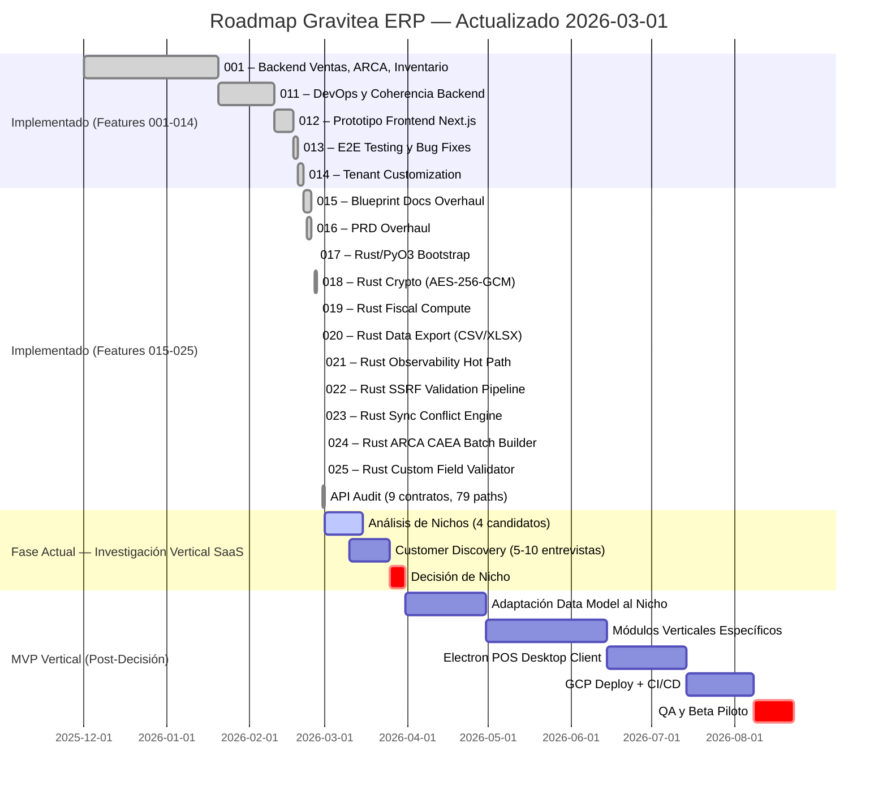
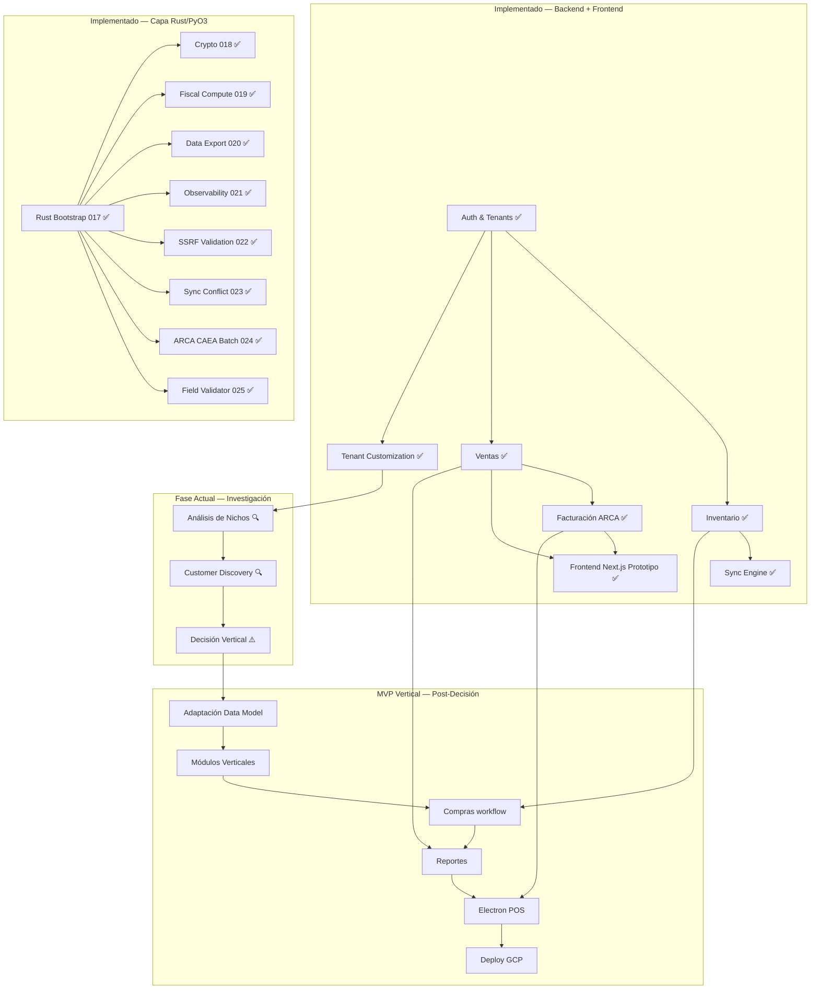

# Roadmap & Plan de Fases - Gravitea ERP MVP

## 1. Metadatos
| Campo | Valor |
| --- | --- |
| **Owner** | CTO / Product Owner |
| **Versión** | 0.3 |
| **Última Actualización** | 2026-03-01 |
| **Horizonte** | Q4 2025 - Q3 2026 |
| **Objetivo MVP** | **En revisión — Pivotando a Vertical SaaS** |

## 2. Estrategia de Ejecución
El roadmap adopta una estrategia **"Backend First / Domain Driven"**. Se priorizó la solidez del modelo de datos y la lógica de negocio en un entorno local controlado (Docker Compose) antes de introducir la complejidad de la infraestructura en la nube. La construcción es modular y secuencial, comenzando por el núcleo del sistema (Core/Auth + Inventario) y avanzando hacia la transacción (Ventas + Facturación ARCA + Frontend).

### Cambio Estratégico (Marzo 2026)

A partir de marzo 2026, el equipo entró en una **fase de investigación** para evaluar el pivoteo de GRAVITEA de un ERP general a un **ERP Vertical SaaS** enfocado en un nicho específico del mercado argentino. La razón: un ERP general implica un scope infinito insostenible para un equipo de 4 personas (2 devs). Se están evaluando 4 nichos candidatos (ver Sección 9). El roadmap MVP se encuentra **en pausa** hasta que se confirme la dirección vertical.

## 3. Estado Actual (Marzo 2026) — Cronograma Real

## 4. Historial de Features Entregadas (001–014)

> Nota: Las branches 002–010 fueron de era pre-feature-branch (docs de orquestación, módulo ARCA inicial, setup GGA, etc.). La convención numerada formal se retomó en 011.

### Feature 001: Backend Ventas + Facturación ARCA + Inventario
**Commit**: `91cb4a1`

| Entregable | Detalle |
|:-----------|:--------|
| **MOD_VENT** | Customers (CUIT, condicion_iva), SaleOrders (DRAFT→CONFIRMED→INVOICED), SaleOrderItems, nested routing |
| **MOD_FAC** | ARCACredential (certs cifrados), Comprobantes (ledger inmutable), PuntosDeVenta, WSAA+WSFEv1, CAE, CAEA, QR fiscal |
| **MOD_INV** | Products (barcode cifrado), StockMovement (ledger), BranchStock, Categories (jerárquicas), Suppliers (PII cifrado), PriceLists, Price/Cost History |
| **MOD_AUTH** | JWT RS256, RBAC, 3-tier rate limiting, Argon2, AppUser+Role+Branch |
| **MOD_SYNC** | Push/Pull/Status APIs, SyncSession (vector clocks), PendingOperation (retry+conflict) |
| **MOD_CORE** | TenantBoundModel, RLS, AES-256-GCM encryption, observability (11 archivos), health checks |
| **Tests** | 334 tests pasando en facturación; suite completa con regression multi-módulo |

### Feature 011: DevOps & Coherencia Backend
**Commit**: `81b29de`

| Entregable | Detalle |
|:-----------|:--------|
| **Docker** | Consolidación a docker-compose.yml único; perfiles (default, prod, observability, test, load) |
| **Refactoring** | 13 correcciones aplicadas (C-001, C-003, C-005 CRITICAL; 5 HIGH; 7 MEDIUM) |
| **Reportes** | 4 informes: cloud-sql-readiness, arca-gap-analysis, backend-cohesion, refactoring-proposals |
| **Migraciones** | Fix H-004 (UniqueConstraint email por tenant); 23 migraciones totales |
| **Tests** | 2,059 pasando; 23 fallos pre-existentes; 177 skipped; 78% cobertura |

### Feature 012: Prototipo Frontend Next.js
**Commit**: `c567815`

| Entregable | Detalle |
|:-----------|:--------|
| **Stack** | Next.js 16 (App Router), TypeScript strict, React 19, shadcn/ui, TanStack Query v5, Tailwind CSS 4 |
| **Rutas** | 9 page routes: login, inventario, ventas, facturación, sync, health, auth-admin, root, protected-layout |
| **Componentes** | 22 feature components + 9 shadcn/ui + 7 shared components — 52 archivos fuente totales |
| **Seed commands** | `seed_all` (chains: seed_data → seed_inventario → seed_ventas → seed_facturacion) |
| **Build** | npm run build pasa; 0 errores TypeScript |

### Feature 013: E2E Testing & Bug Fixes
**Commit**: `9505190`

| Entregable | Detalle |
|:-----------|:--------|
| **E2E Tests** | Testing browser con Playwright MCP; fases 1–3B |
| **Bug F-015** | `movements-tab.tsx`: campo `qty` → `quantity_delta` (mismatch frontend-backend) |
| **Bug F-016** | `seed_inventario.py`: añadido `_create_cost_history()` faltante |
| **Bug F-017** | SQL trigger guarda para movimientos RESERVED + handler IntegrityError en views |
| **Agent files** | 8 archivos de instrucción de agente en `Docs/Temp-prompting/` |

### Feature 014: Tenant Customization Framework
**Commit**: `81837ea`

| Entregable | Detalle |
|:-----------|:--------|
| **TenantFieldDefinition** | 6 tipos: text/integer/decimal/boolean/date/select; 4 entidades: product/customer/supplier/sale_order |
| **TenantModuleConfig** | Habilitar/deshabilitar módulos (inventario/ventas/facturacion/sync) + settings JSON |
| **BusinessTemplate** | Templates de onboarding del sistema con modules y field_definitions predefinidos |
| **CustomFieldsMixin** | Mixin DRF: validación, creación con defaults, actualización (merge) de custom_data |
| **DynamicFields** | Componente React `DynamicFields` en products-tab.tsx |
| **Tests** | 2,202 pasando; 25 fallos pre-existentes (Docker/deployment); 0 nuevas regresiones |

### Feature 015: Blueprint Docs Overhaul
**Commit**: `b2a2c58`

| Entregable | Detalle |
|:-----------|:--------|
| **Docs** | Reescritura completa de 12 documentos del Project Blueprint |
| **Diagrams** | Diagramas Mermaid actualizados en HLD, LLD, Data Model |

### Feature 016: PRD Overhaul
**Commit**: `a3c1e7f`

| Entregable | Detalle |
|:-----------|:--------|
| **PRD** | Reescritura completa del Product Requirements Document |
| **Scope** | Alineación de alcance con features 001-014 implementadas |

### Features 017–025: Capa de Aceleración Rust/PyO3
**Commits**: `2db3189` → `d22686a` | **Branch de consolidación**: `025-rust-custom-field-validator`

> Fase intensiva de 4 días (25-28 Feb 2026) que introdujo una capa de aceleración Rust compilada vía PyO3 0.28 sobre el backend Django existente. Cada módulo tiene un dispatcher Python con fallback automático si el módulo Rust no está disponible.

| Spec | Módulo Rust | Función | Speedup |
|:-----|:-----------|:--------|:--------|
| **017** | `lib.rs` | Bootstrap: `hello()`, `GraviteaError` (3 variantes) | N/A |
| **018** | `crypto.rs` | AES-256-GCM encrypt/decrypt, HMAC-SHA256 blind index | 8.7x |
| **019** | `compute.rs` | validate_importes, IVA breakdown, CUIT, aggregate_stock | 2.1–4.4x |
| **020** | `export.rs` | CSV (UTF-8 BOM, RFC 4180), XLSX (auto-numeric) | GIL release |
| **021** | `observability.rs` | normalize_path, sanitize_endpoint_label (24 regex) | 2.4x |
| **022** | `security.rs` | SSRF: validate_url_safety, check_resolved_ip (831 líneas) | Fail-closed |
| **023** | `sync.rs` | merge_most_complete, merge_most_complete_batch (serde) | GIL release (batch) |
| **024** | `arca.rs` | CAEA batch builder — quincena reporting (serde_json) | GIL release |
| **025** | `validation.rs` | Custom field validator — 6 tipos de campo | <2ms |

**Infraestructura Rust**:
- Toolchain: Rust 1.93.1 + Maturin 1.12.4 + PyO3 0.28
- Docker: rust-builder multi-stage (-68 MB imagen, 188 KB wheel)
- Tests: 25 cargo tests + 31–308 pytest por spec; 0 regresiones
- Orquestación: Agent Teams (4-5 agentes) vía TeamCreate + tmux

### API Audit (Post-025)
**Commit**: `fa96dc5` | **Merged to develop**: `bee970d`

| Métrica | Antes | Después |
|:--------|:------|:--------|
| Contratos OpenAPI | 6 | 9 |
| Paths | 62 | 79 |
| Schemas | 115 | 154 |
| Operations | — | 137 |

**Nuevos contratos**: `compras-api.yaml`, `core-api.yaml`, `reportes-api.yaml`

## 5. Items Restantes para MVP (Objetivo: En revisión)

### Fase Actual: Investigación Vertical SaaS

> El MVP general fue **pausado** en favor de investigar un pivoteo a ERP vertical. Ver Sección 9 para detalles.

| Item | Estado Actual | Prioridad | Notas |
|:-----|:-------------|:----------|:------|
| **Análisis de nichos** | En curso | P0 | 4 nichos candidatos evaluados; research prompt creado |
| **Customer Discovery** | Pendiente | P0 | 5-10 entrevistas en los 2 nichos top |
| **Decisión de nicho** | Pendiente | P0 | Confirmar vertical antes de continuar desarrollo |

### MVP Vertical (Post-Decisión de Nicho)

| Item | Estado Actual | Prioridad | Notas |
|:-----|:-------------|:----------|:------|
| **Adaptación Data Model** | Bloqueado por decisión | P0 | Mapear modelo de datos existente al nicho elegido |
| **Módulos Verticales** | Bloqueado | P0 | Funcionalidad específica del nicho (ej: rutas para distribuidoras, precios bulk para ferreterías) |
| **COMPRAS** — Módulo de Compras | Parcial (Supplier OK) | P1 | Órdenes de compra, recepciones, facturas de proveedor |
| **REPORTES** — Módulo de Reportes | Contrato API definido | P1 | Reportes de ventas, stock, exportaciones para contabilidad |
| **Electron** — Cliente POS de escritorio | Planificado | P1 | POS en sucursal con SQLite cifrado |
| **GCP** — Despliegue en Nube | Planificado | P2 | Cloud Run (Django + frontend), Cloud SQL, Memorystore Redis |
| **CI/CD** — Pipeline de Integración Continua | Planificado | P2 | GitHub Actions u equivalente; tests automáticos en PR |

### Post-MVP (Roadmap Futuro)

| Item | Descripción |
|:-----|:------------|
| **B2C E-commerce** | Integración con plataformas (TiendaNube/Shopify) |
| **App Móvil para Dueño** | KPIs y control remoto desde celular |
| **Payroll** | Módulo de sueldos y liquidación |
| **Predicción de Demanda (IA)** | ML para sugerencias de reposición |

## 6. Secuencia de Dependencias Lógicas

## 7. Riesgos y Mitigaciones

| Riesgo | Probabilidad | Estado | Mitigación |
| :--- | :--- | :--- | :--- |
| **Scope creep de ERP general** | Alta | **ACTIVO — Razón del pivoteo** | Pivotear a vertical SaaS con nicho definido. Equipo de 4 personas no puede competir con SAP/Odoo en scope general. |
| **Elegir el nicho equivocado** | Media | Activo | Customer discovery (5-10 entrevistas) + research con datos reales antes de comprometer recursos de desarrollo. |
| **Codebase gap del nicho** | Media | Mitigado parcialmente | Análisis de gap por nicho ya realizado (30-60% código nuevo según nicho). La capa Rust/PyO3 y la customización por tenant reducen la adaptación necesaria. |
| **"Integration Hell" al ir a Cloud** | Media | Mitigado parcialmente | Dockerfiles locales idénticos al runtime de Cloud Run desde el día 1. Docker Compose consolidado (feature 011). Rust-builder multi-stage probado. |
| **Deuda Técnica en Sync** | Alta | Mitigado | Modelo de datos con UUIDs y timestamps. Sync conflict engine acelerado con Rust (023). |
| **Feedback Tardío de Usuario** | Alta | Parcialmente mitigado | Prototipo Next.js disponible. Customer discovery del pivoteo busca feedback temprano. |
| **Complejidad de Electron** | Media | Activo | Backend Electron-ready (REST idempotente, sync, CAEA offline). SQLite/FTS5/SQLCipher como riesgo técnico. |
| **Certificación ARCA en Producción** | Alta | Activo | Requiere homologación ARCA. `is_production=False` en desarrollo. Gestión de certificados por tenant implementada. |
| **Complejidad de Rust/PyO3 para el equipo** | Baja | Mitigado | Patrón dispatcher con fallback Python automático. 9 módulos Rust compilados sin regresiones. Equipo tiene experiencia demostrada (017-025 en 4 días). |

## 8. Métricas del Proyecto (Marzo 2026)

| Métrica | Valor |
|:--------|:------|
| **Features entregadas** | 25 (001–025) |
| **Tests pasando** | 2,202+ (backend) + 308 (Rust integration) |
| **Módulos Rust** | 9 (`crypto`, `compute`, `export`, `observability`, `security`, `sync`, `arca`, `validation`, `lib`) |
| **Cargo tests** | 25+ |
| **OpenAPI contracts** | 9 (79 paths, 154 schemas, 137 operations) |
| **GitNexus symbols** | 7,184 (16,909 relationships, 300 execution flows) |
| **Cluster Rust_integration** | 237 symbols, 87% cohesion |
| **Docker image** | -68 MB (rust-builder multi-stage), 188 KB wheel |

## 9. Investigación Vertical SaaS (Marzo 2026)

### Contexto

El equipo (4 personas, 2 devs) determinó que un ERP general es insostenible: scope infinito, competencia con incumbentes (SAP, Odoo, Colppy), y falta de diferenciación. La decisión es pivotar a un **ERP Vertical SaaS** enfocado en un nicho del mercado argentino donde GRAVITEA pueda ser el "best in class".

### Nichos Candidatos

| Nicho | TAM Argentina | ARPU/mes | Gap de código | Fit con offline-first | GTM Speed |
|:------|:-------------|:---------|:-------------|:---------------------|:----------|
| **Distribuidoras de bebidas/alimentos** | ~20,000 | $200–600 USD | ~40% nuevo | Muy alto (drivers) | Rápido |
| **Ferreterías y materiales** | ~70,000+ | $100–300 USD | ~30% nuevo (menor) | Medio | Rápido |
| **Acopiadores de granos** | ~3,000 | $500–2,000 USD | ~60% nuevo | Alto (rural) | Lento |
| **Frigoríficos y matarifes** | ~3,000 | $1,000–5,000 USD | ~50% nuevo | Medio | Muy lento |

### Criterios de Evaluación

1. **Moat regulatorio**: ¿Hay compliance obligatorio que dificulte la entrada de competidores genéricos?
2. **ARPU**: ¿El cliente paga lo suficiente para sustentar un equipo chico?
3. **Mercado desatendido**: ¿Los competidores actuales son mediocres o inexistentes?
4. **Fit con codebase**: ¿Cuánto código nuevo se necesita vs. reutilización del core existente?
5. **GTM speed**: ¿Se puede validar en < 3 meses con demos y pilotos?
6. **Fit offline-first**: ¿El nicho necesita operar sin conexión?
7. **Efectos de red**: ¿Hay cadena de valor que amplifique adopción?

### Estado Actual

- Research prompt creado: `Docs/Brainstorming/niche-erp-argentina-research-prompt.md`
- Pendiente: ejecutar research con Perplexity/Gemini Deep Research
- Pendiente: 5-10 entrevistas de customer discovery en los 2 nichos top
- Lean preliminar: **Distribuidoras** (mejor fit con arquitectura offline-first) o **Ferreterías** (menor gap de código, validación más rápida)

---

*Última actualización: 2026-03-01 — v0.3*
