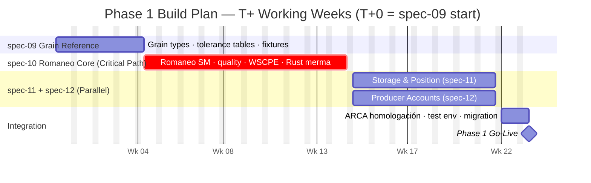
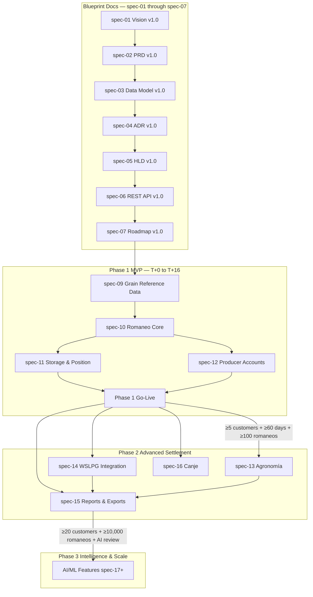

# GraviTea Acopio ERP — Roadmap v1.0

> **Version 1.0** · Date: 2026-03-17 · Status: Draft · Owner: GraviTea Architecture Team

---

## §1 — Document Metadata

| Property | Value |
|----------|-------|
| **Version** | 1.0 |
| **Date** | 2026-03-17 |
| **Status** | Draft |
| **Owner** | GraviTea Architecture Team |
| **Deliverable type** | Blueprint Specification |
| **Upstream sources** | Product Vision v1.0 · PRD v1.0 · Data Model v1.0 · ADR v1.0 · HLD v1.0 · REST API Design v1.0 |
| **Branch** | `007-acopio-roadmap` |

### Changelog

| Version | Date | Author | Changes |
|---------|------|--------|---------|
| Version 1.0 | 2026-03-17 | GraviTea Architecture Team | Initial release — 3-phase delivery plan, GTM calendar, risk register, KPIs |

### How to Read This Document

This Version 1.0 document is the master strategic execution plan for GraviTea Acopio ERP. It synthesises all prior blueprint specifications (spec-01 through spec-06) into a single actionable reference serving three audiences:

- **Technical team**: §4–§8 define what to build, in what order, and what "done" means for each phase.
- **Business / GTM**: §9 provides the go-to-market calendar anchored to Argentine grain harvest seasonality.
- **Advisors**: §2–§3 provide a 10-minute strategic briefing on market opportunity, competitive positioning, and execution plan.

The scope of this Roadmap is **GraviTea Acopio ERP exclusively** — the grain vertical SaaS product. General ERP modules (inventario, ventas) are paused pending vertical validation and are not referenced here.

---

## §2 — Executive Summary

GraviTea Acopio ERP is a cloud-native, offline-first grain storage management system purpose-built for Argentine independent acopiadores (grain handling operators). It addresses a market of approximately 1,073 private SMB operators — most currently running software on VB6/.NET Windows desktop applications that have no web or mobile capability — with a modern platform that operates fully offline during harvest and synchronises to the server when connectivity permits. Total addressable market is approximately **$2.9M ARR** (estimated, ~800 addressable SMBs × ~$300/month average; directional, not audited).

**Why now**: The dominant incumbent, AGIS (AmericaGIS), has 2,000+ clients but its core acopio product runs on VB6 — a technology Microsoft ended mainstream support for in 2008. No cloud-native competitor has reached meaningful market penetration. Two Argentine regulatory changes (RG 5689/2025 and RG 5821/2026) increase ARCA fiscal compliance requirements, creating a moat for the first vendor to ship compliant updates. Post-soybean harvest (April–June) is the only low-friction switching window — missing it means a 12-month delay. A generational shift is underway: younger operators actively seek web-native alternatives.

**Execution plan**: Phase 1 MVP targets go-live at T+16 working weeks from spec-09 start with two developers. Phase 1 delivers four implementation specs: spec-09 (Grain Reference Data), spec-10 (Romaneo Core), spec-11 (Storage & Position), spec-12 (Producer Accounts). Phase 2 (Advanced Settlement — spec-13 through spec-16) begins only after three observable triggers are met: ≥5 paying customers, Phase 1 stable for ≥60 calendar days with no P1/P2 bugs, and ≥100 romaneos processed in production. Phase 3 (AI/ML Intelligence) begins after ≥20 paying customers and ≥10,000 romaneos provide sufficient training data.

**Go-to-market**: The primary distribution channel is the **contador rural** (rural accountant) — trusted advisor to 5–15 acopio clients per estudio. A free accountant portal converts each enrolled contador into a 10× distribution multiplier. Target: 10 enrolled contadores before public launch (50–100 warm prospects). Primary conversion campaigns are timed to the April–June post-harvest switching window and anchored to Expoagro (March, Buenos Aires) and Agroactiva (June, Santa Fe).

> **Key facts**: TAM ~$2.9M ARR (estimated) · Phase 1 go-live T+16 weeks · Main incumbent AGIS on VB6 · Channel: contador rural (10× multiplier) · Switching window: April–June post-harvest

---

## §3 — Strategic Context

### §3.1 — Market Opportunity

The Argentine grain handling sector consists of approximately **1,073 private acopio companies** operating **1,622 storage plants**, concentrated in the Pampa Húmeda across Buenos Aires, Córdoba, and Santa Fe provinces. This count excludes large cooperatives and vertically-integrated exporters that operate dedicated enterprise ERP platforms.

Software budget ranges by operator size:

| Segment | Monthly budget (USD) | Estimated count |
|---------|---------------------|----------------|
| Small SMB (≤3 branches) | 150–300 | ~450 |
| Medium SMB (3–8 branches) | 300–500 | ~250 |
| Medium-large (8–20 branches) | 500–2,000 | ~100 |
| Cooperative / enterprise | 2,000+ | outside scope |

Addressable market (independent SMB only, excluding cooperatives and micro-operators below the USD 150 threshold): approximately **800 operators** × USD 300/month average = **~$2.9M ARR (estimated)**. Directional estimate for advisor context — not a fundraising figure.

An INTA/ENACOM 2021 connectivity survey found that **44% of rural operators report only "regular" connectivity quality** during harvest. Systems that assume reliable connectivity fail exactly when demand is highest. This creates a structural moat for an offline-first architecture that legacy VB6 desktop applications cannot replicate by adding a web layer.

### §3.2 — Competitive Positioning

The acopio software market has four meaningful incumbents:

| Vendor | Platform | Clients | Critical weakness |
|--------|----------|---------|------------------|
| **AGIS (AmericaGIS)** | VB6/.NET desktop, Windows-only | 2,000+ | No web/mobile for acopio; VB6 end-of-life (support ended 2008) |
| **Algoritmo S.A.** | Desktop + Silohub web integration | ~125 (20M+ tons) | Large-operator focus; not SMB-accessible |
| **AgroSistemas S.A.** | Desktop, ISO 9001 certified | Undisclosed | Enterprise tier; limited SMB presence |
| **AgroAcopio (AEA&A)** | Desktop, no web confirmed | Undisclosed | Legacy architecture since 1983; no cloud |

**AGIS** is the dominant target — 2,000+ clients, 35+ years of brand recognition, but fundamentally incompatible with modern expectations. VB6 is an end-of-life technology (AGIS was still hiring VB6 developers as recently as October 2023); no web-based acopio module; no mobile companion for grain operators; SQL Server backend with no clean export capabilities. R&D is spread thin across GPS, general ERP, distributor, and acopio product lines.

**Algoritmo S.A.** is the most dangerous direct competitor — similar founding year, larger engineering team, dominant position by grain volume, and a Silohub web partnership for digital capabilities. However, its client base is concentrated among the largest operators (125 clients handling 20M+ tons), leaving the SMB long tail underserved.

**GraviTea differentiators**: cloud-native (web + mobile) · offline-first base architecture · ARCA regulatory velocity · SMB pricing · contador rural distribution channel · open migration path from AGIS SQL Server.

### §3.3 — Regulatory Tailwind

Two Argentine fiscal regulations directly expand ARCA compliance requirements for grain operators:

- **RG 5689/2025**: Introduces SISA (Sistema de Información Simplificado Agrícola), replacing RUCA as the producer registration system. SISA Estado determines IVA and Ganancias withholding rates at grain settlement filing time. Non-registered producers attract maximum retention rates automatically.
- **RG 5821/2026**: Adds real-time validation requirements for grain transport certificates (CPE — Carta de Porte Electrónica via ARCA WSCPE service).

**Phase 1 ARCA integration** (spec-10, Romaneo Core): CPE lifecycle via WSCPE — confirmarArribo at truck arrival, confirmation events through the romaneo state machine, final close at CERRADO state. Grain deposit certificate authorization via WSLPG `cgAutorizarReq` fires concurrent with CPE confirmation at romaneo reception. All WSCPE and grain certificate calls are async via the PendingOperation queue. Architecture: WSAA hub-and-spoke per ADR-025.

**Phase 2 ARCA integration** (spec-14, WSLPG): grain settlement filing (Form 1116 B/C) via WSLPG — a completely separate ARCA SOAP service with its own certificate, token lifecycle, and XML schema. **WSCPE and WSLPG are distinct services** — see §6.4.

**Compliance velocity as a moat**: ARCA regulation evolves faster than legacy VB6 can be updated. The first vendor to ship compliant updates wins customer trust. GraviTea's WSAA adapter layer (ADR-025) isolates schema changes to one module — a structural advantage over codebase-wide changes.

### §3.4 — Window of Opportunity

**Post-soybean harvest (April–June)** is the only calendar window when acopiadores can switch software systems without operational disruption. During harvest itself, no operator changes their core system. After harvest, operators review season performance and make decisions for the next campaign — this is the primary conversion window. Missing it means a 12-month delay.

Three tailwinds reinforce the window:

1. **Generational shift**: Younger-generation operators (under 40) actively seek web-native, mobile-accessible platforms. ACA Jóvenes (youth wing of Asociación de Cooperativas Argentinas) are early adopters within the cooperative network.
2. **AGIS VB6 modernisation risk**: A full VB6-to-web rewrite is a multi-year, high-risk project. Cloud-native entrants have a **5–8 year window** before AGIS can credibly match modern UX.
3. **Data lock-in compounds over time**: The more romaneos an operator processes in GraviTea, the harder switching becomes (full audit trail, regulatory history, producer account ledgers). Locking in operators during Phase 1 raises Phase 2 switching costs for competitors.

---

## §4 — Product Phases Overview

GraviTea Acopio ERP is delivered in three phases. Each phase is gated by observable trigger conditions — not calendar dates — to prevent premature scope expansion.

| Phase | Name | Implementation Specs | Entry Criteria | Phase Trigger (Exit) |
|-------|------|---------------------|----------------|---------------------|
| **Phase 1** | Grain Reception MVP | spec-09, spec-10, spec-11, spec-12 | spec-09 start (T+0) | All 4 spec PRs merged to `main` + DoD checklist PASS (§5.4) |
| **Phase 2** | Advanced Settlement & Agronomía | spec-13, spec-14, spec-15, spec-16 | Phase 1 go-live | ≥5 paying customers + Phase 1 stable ≥60 calendar days (no P1/P2 bugs) + ≥100 romaneos in production |
| **Phase 3** | Intelligence & Scale | spec-17+ (AI/ML) | Phase 2 delivered | ≥20 paying customers + ≥10,000 romaneos in production + AI data pipeline reviewed |

**Critical rule**: Starting any spec-13+ work before the Phase 2 trigger conditions are fully met is out of scope and risks destabilising Phase 1 operations.

---

## §5 — Phase 1: Grain Reception MVP

Phase 1 delivers the minimum viable product for grain reception operations: a complete romaneo lifecycle from truck arrival to grain-in-silo, with ARCA CPE compliance and a live producer account ledger.

### §5.1 — Phase 1 Scope

| Spec | Name | Module Path | Key Deliverables |
|------|------|-------------|------------------|
| **spec-09** | Grain Reference Data | `backend/apps/acopio/` (app_label: `gravitea_acopio`) | `GrainType`, `ToleranceTable`, `MermaTable`, `Campaign` models + Argentine grain species fixtures |
| **spec-10** | Romaneo Core | `backend/apps/acopio/` + `rust/gravitea-core/src/merma.rs` | `Romaneo` state machine (6 states), `QualityAnalysis`, `MermaCalculation`, WSCPE CPE lifecycle, `PendingOperation` async queue |
| **spec-11** | Storage & Position | `backend/apps/acopio/` (app_label: `gravitea_acopio`) | `StorageUnit`, `GrainLot`, `GrainMovement` (append-only ledger), `WeighbridgeDevice` live reading |
| **spec-12** | Producer Accounts | `backend/apps/cuentas/` (app_label: `gravitea_cuentas`) | `ProducerAccount` (encrypted CUIT + HMAC-SHA256 blind index), `AccountMovement` (append-only ledger), `Fijacion` price fixation |

All Phase 1 models inherit `TenantBoundModel` (multi-tenant isolation, RLS enforcement). All grain domain models carry the four ADR-034 provenance fields (`created_at`, `updated_at`, `created_by`, `device_id`).

### §5.2 — Critical Path

Phase 1 has a strict dependency chain that must be respected in branch planning:

1. **spec-09 → spec-10**: `Romaneo.grain_type` is a FK to `GrainType` (spec-09). spec-10 migrations cannot run until spec-09 is merged.
2. **spec-10 → spec-11**: `GrainMovement` is created when a `Romaneo` reaches `CERRADO` state. spec-11 cannot test grain flows until spec-10's state machine is stable.
3. **spec-10 → spec-12**: `AccountMovement` is created at `Romaneo` closure (kilos credited, net proceeds recorded). spec-12 account ledger depends on spec-10's CONFORME → CERRADO transition.
4. **spec-11 ∥ spec-12**: Once spec-10 is merged to `main`, spec-11 and spec-12 run in parallel on separate branches.

**spec-10 is the serial bottleneck**: 7-week estimate (Romaneo state machine + Rust merma FFI via PyO3 + WSCPE async integration + 6-state transition endpoints). If spec-10 slips past T+10, Phase 1 go-live extends proportionally. Monitor spec-10 progress weekly from T+0.

### §5.3 — Deliverables by Spec

| Spec | App label | Django models | Rust modules | Phase 1 endpoints |
|------|-----------|---------------|--------------|-------------------|
| spec-09 | `gravitea_acopio` | `GrainType`, `ToleranceTable`, `MermaTable`, `Campaign` | — | 4 |
| spec-10 | `gravitea_acopio` | `Romaneo`, `QualityAnalysis`, `MermaCalculation`, `PendingOperation` | `merma.rs`, `grading.rs` (PyO3 0.28) | 14 |
| spec-11 | `gravitea_acopio` | `StorageUnit`, `GrainLot`, `GrainMovement`, `WeighbridgeDevice` | — | 7 |
| spec-12 | `gravitea_cuentas` | `ProducerAccount`, `AccountMovement`, `Fijacion` | — | 6 |
| sync (cross-cutting) | — | `SyncSession` (existing) | — | 4 |
| auth (cross-cutting) | — | — | — | 3 |
| **Total Phase 1** | | **16 models** | **2 Rust modules** | **38 endpoints** |

`GrainMovement` and `AccountMovement` are **append-only ledgers** — no PATCH or DELETE on these entities. Corrections are handled by compensating entries appended to the ledger; historical records are immutable.

### §5.4 — Go-Live Definition of Done

Phase 1 go-live requires ALL criteria below to be PASS. Every item is binary — no subjective criteria.

| # | Criterion | Pass Condition |
|---|-----------|----------------|
| 1 | All 4 spec PRs merged | spec-09, spec-10, spec-11, spec-12 all merged to `main`; no open P1/P2 issues in any spec |
| 2 | End-to-end romaneo | ≥1 complete romaneo: truck arrival → quality analysis → CONFORME → CERRADO → grain in `GrainLot` → `AccountMovement` appended |
| 3 | ARCA WSCPE CPE test | `confirmarArribo` + final confirmation both accepted by ARCA WSCPE **test environment** (not mock) |
| 4 | Offline-first sync | Romaneo created with network disconnected; synced to server successfully when connectivity restored; zero data loss |
| 5 | Paying customer in production | ≥1 paying customer has completed ≥1 romaneo in the production environment |
| 6 | All pytest suites PASS | Zero P1/P2 test failures across all Phase 1 modules |
| 7 | Data migration tested | ≥1 pilot dataset migrated (grain types + producer accounts); ≤2 hours from upload to first romaneo |

### §5.5 — Target Timeline

All offsets are working weeks from spec-09 start (T+0). Two-developer team. No absolute calendar dates.

| Milestone | T+ Offset | Critical? | Notes |
|-----------|-----------|-----------|-------|
| spec-09 start | T+0 | — | Grain reference data + fixtures |
| spec-09 merged to `main` | T+3 | — | GrainType, tables, Campaign fixtures complete |
| spec-10 start | T+3 | — | Romaneo state machine begins immediately |
| spec-10 merged to `main` | T+10 | **Yes — bottleneck** | 7-week estimate for full spec-10 scope |
| spec-11 + spec-12 start (parallel) | T+10 | — | Begin immediately after spec-10 merge |
| ARCA homologación submission | T+13 | **Yes — do not defer** | Allow ≥4 weeks for ARCA processing |
| spec-11 merged | T+15 | — | Storage & Position complete |
| spec-12 merged | T+15 | — | Producer Accounts complete |
| Integration sprint: ARCA test env + migration | T+15 → T+16 | **Yes** | Buffer week; DoD validation |
| Phase 1 Go-Live | T+16 | **Hard constraint** | DoD checklist all PASS |

---

## §6 — Phase 2: Advanced Settlement & Agronomía

Phase 2 extends Phase 1 with grain settlement (liquidación primaria via WSLPG), agronomic quality tracking, reporting, and canje (input exchange). Phase 2 scope is locked until trigger conditions in §6.2 are fully met.

### §6.1 — Phase 2 Scope

| Spec | Name | Module Path | Key Deliverables |
|------|------|-------------|------------------|
| **spec-13** | Agronomía Adaptation | extends `backend/apps/acopio/` | Agronomic quality parameters, varietal tracking, crop season attributes |
| **spec-14** | WSLPG Integration | `backend/apps/facturacion/wslpg/` | `LiquidacionPrimaria` (Form 1116 B/C), SISA-tier retention (ADR-027), WSLPG SOAP client |
| **spec-15** | Reports & Exports | `backend/apps/reportes/` | Grain position reports, producer account statements, SICORE/IVA export bundles, contador dashboard exports |
| **spec-16** | Canje | `backend/apps/acopio/canje/` | Input exchange workflow, tri-party settlement (grain kilos ↔ input invoice), compensation accounting |

### §6.2 — Phase 2 Trigger Conditions

**Starting any spec-13, spec-14, spec-15, or spec-16 work before ALL THREE conditions are met is out of scope.** These are binary observable conditions.

| # | Condition | Measurement |
|---|-----------|-------------|
| 1 | ≥5 paying customers | Billing records in production payment system |
| 2 | Phase 1 production-stable ≥60 calendar days | No P1/P2 bugs open in spec-09 through spec-12 modules for 60 consecutive calendar days |
| 3 | ≥100 romaneos processed in production | `COUNT(Romaneo WHERE estado = CERRADO)` in production database |

Rationale: 5 paying customers provides meaningful Phase 1 UX feedback before committing Phase 2 scope. The 60-day stability window confirms the romaneo state machine and ARCA queue are stable before adding WSLPG complexity. 100 romaneos validates merma calculations and account accuracy with real-world data.

### §6.3 — Phase 2 Deliverables

| Spec | New endpoints | New Django models | Complexity estimate |
|------|---------------|-------------------|---------------------|
| spec-13 | 3–5 quality endpoints | `AgronomicAttribute`, `CropVariety` | 2–3 weeks |
| spec-14 | 5 liquidación endpoints (pre-shaped in REST API Design §12) | `LiquidacionPrimaria`, `RetencionDetalle` | 4–6 weeks |
| spec-15 | 8–10 report endpoints | `ReporteConfig`, export job queue | 3–4 weeks |
| spec-16 | 6–8 canje endpoints | `CanjeOperation`, `CanjeItem` | 3–4 weeks |

### §6.4 — WSLPG Integration Notes

**Critical service distinction** — do not conflate:

| Service | ARCA Name | Phase | Purpose |
|---------|-----------|-------|---------|
| **WSCPE** | Web Service CPE (Carta de Porte Electrónica) | **Phase 1** | Grain transport certificate — initiated at truck arrival (romaneo creation) |
| **WSLPG** | Web Service Liquidación Primaria de Granos | **Phase 2** | Settlement document — Form 1116 B/C — generated after grain is sold |

These are completely separate ARCA SOAP services with distinct X.509 certificates, XML schemas, authentication tokens, and business events. WSCPE is active in Phase 1; WSLPG is strictly deferred to Phase 2.

**WSLPG technical notes for spec-14**:

- SOAP service version: WSLPG v1.22+
- Architecture: WSAA hub-and-spoke (ADR-025) — WSLPG requires its own certificate registration and 12-hour token lifecycle, independent from WSCPE
- SISA retention: rates queried and calculated at WSLPG filing time (blocking gate per ADR-027 — if SISA query fails, the liquidación is blocked)
- SISA Estado rates: Estado 1 → IVA 5% / Ganancias 0%; Estado 2 → IVA 8% / 2%; Estado 3 → IVA 10.5% / 15%; non-registered → IVA 16% / 30%
- Reference implementation: pyafipws (Python ARCA/AFIP web services library)
- Effort estimate: 4–6 weeks for spec-14 (SOAP XML complexity + homologación in WSLPG test environment)

---

## §7 — Phase 3: Intelligence & Scale

Phase 3 adds ML-powered features using longitudinal data accumulated during Phase 1 and Phase 2 operations. Scope is locked until Phase 3 trigger conditions (§7.4) are met.

### §7.1 — AI/ML Feature Roadmap

Features prioritised by data availability + implementation risk at ≥10,000 romaneos:

| Priority | Feature | Training Data Source | Approach |
|----------|---------|---------------------|----------|
| P3-Q1 | **Predictive merma modelling** | Romaneo quality params + humidity + ambient conditions (Phase 1 data) | Regression on tabular data — highest ROI for operators |
| P3-Q2 | **Price optimisation signals** | MAT (Mercado a Término) feed + `AccountMovement` history | Time-series on account movement + external price data |
| P3-Q3 | **Storage condition anomaly detection** | IoT sensor readings via `StorageUnit.environment_sensor_id` anchor (ADR-033 Layer 4) | Threshold-based anomaly detection on temperature/humidity |
| P3-Q4 | **Natural language grain position queries** | `GrainLot` + `GrainMovement` aggregates | LLM → SQL: "¿Cuánta soja tengo hoy?" |
| Deferred | **Computer vision grain grading** | Camera hardware partnership required | Beyond Phase 3 — requires device partner |

### §7.2 — Multi-Tenant Growth

Phase 3 growth levers beyond the initial SMB segment:

- **White-label for estudios contables**: accountant firms become resellers for their acopio client portfolios (builds on the Phase 1 contador portal)
- **Cooperative chains**: extend multi-branch model to cooperative federations (CONINAGRO network) with inter-branch grain position consolidation
- **Automated compliance bundles**: Phase 3 expands the Phase 1 contador portal to one-click SICORE + F.2005 + libro IVA ventas exports across all client tenants
- **Benchmarking premium tier**: ML-powered storage performance benchmarking compared to anonymised peer operators in the same region

### §7.3 — Data Readiness Prerequisites

All Phase 3 AI/ML features depend on data architecture decisions implemented in Phase 1. These cannot be retrofitted post-go-live without costly migrations — they must ship in spec-09 through spec-12:

| ADR | Decision | Phase 1 Deliverable | Phase 3 Benefit |
|-----|----------|--------------------|----------------|
| **ADR-033** | 4-layer AI-ready data architecture | Operational data + behavioural data (operator_id, device_id, 6 named process timestamps per Romaneo) + quality history + IoT anchor (`StorageUnit.environment_sensor_id`) | ML models train on production data from day 1 — no data archaeology or schema migration |
| **ADR-034** | Provenance fields on all grain domain models | `created_by` (FK → AppUser) + `device_id` on every grain entity | Fraud detection baseline: operator/device anomaly patterns from the first romaneo in production |
| **ADR-035** | Measurement-timestamp pairing | Six named timestamps per Romaneo (`ts_entrada` through `ts_tara`) + `MermaCalculation` intermediate values | Per-step cycle time analysis; arrival-to-departure throughput bottleneck identification per operator |

### §7.4 — Phase 3 Trigger Conditions

| # | Condition | Rationale |
|---|-----------|-----------|
| 1 | ≥20 paying customers | Sufficient feedback diversity to validate AI feature priorities before ML investment |
| 2 | ≥10,000 romaneos processed in production | Minimum training data for merma prediction (≥6 months of time-series at typical volumes) |
| 3 | AI data pipeline review completed | Confirm ADR-033/034/035 data quality meets minimum threshold for first ML model training run |

---

## §8 — Milestone & Dependency Diagrams

### §8.1 — Phase 1 Gantt

> **Note**: Dates in the diagram below are placeholder offsets — T+0 represents spec-09 start. Add the actual spec-09 start date to derive real calendar milestones. All durations are working weeks; weekends excluded.

### §8.2 — Spec Dependency Graph

---

## §9 — Go-to-Market Strategy

### §9.1 — Contador Rural Flywheel

The **contador rural** (rural public accountant) is GraviTea's primary distribution channel and a structural competitive advantage. Unlike direct B2B software sales, the contador channel converts one relationship into 5–15 customer prospects.

**Why the contador is the key decision-maker**:

- Argentine grain SMB operators trust their contador for systemisation decisions — which ERP to adopt — not just tax compliance.
- An agro-specialized estudio typically serves **5–15 acopio/cooperative clients** alongside farm producers (5–10 as a conservative working range per research).
- Cloud accounting platforms (Colppy, Xubio) have validated the "sell through the contador" model in Argentina — contadores adopt tools that save them time, then recommend them to clients.
- FACPCE (Federación Argentina de Consejos Profesionales de Ciencias Económicas) publishes RT-22 / RT-41 agro accounting guidelines actively used by contadores rurales — targeting CPCE events puts GraviTea directly in front of this audience.

**The flywheel**:

1. GraviTea offers a **free accountant portal** (no per-seat cost for the contador)
2. Portal delivers: multi-client grain position dashboard · SICORE/IVA export bundles · vencimientos calendar · one-click tax reporting per client
3. Contador saves 2–4 hours/month per acopio client → actively recommends GraviTea to avoid managing Excel imports from legacy platforms
4. Each enrolled contador = 5–15 warm prospects who trust the recommendation

**GTM targets**:

- T+10 → T+14: Identify and contact 3–5 target contadores in Villa María (Córdoba), Río Cuarto (Córdoba), and Venado Tuerto (Santa Fe)
- T+14 → T+16: Enrol first 3 contadores as beta testers during integration sprint
- Pre-launch goal: **10 enrolled contadores** → 50–100 warm prospects

### §9.2 — Sales Motion Calendar

Sales campaigns are anchored to Argentine grain harvest seasonality. The switching window is fixed by agriculture — not by the development schedule.

| Period | Season | Activity |
|--------|---------|----------|
| **January – March** | Pre-harvest (soybean) | Pipeline: contador outreach · demo bookings · Expoagro presence (March) · identify AGIS clients dissatisfied with update cadence |
| **April – June** | **Post-harvest — primary conversion window** | Conversion: migration offers · free trial + guided onboarding · Agroactiva presence (June) · close pilots |
| **July – September** | Off-season | Onboarding confirmed customers · case study development · contador referral campaigns |
| **October – December** | Pre-summer | Renewals · upsell to medium tier · second-wave pipeline for next April–June window |

**The April–June switching window is the single most important GTM milestone.** Missing post-harvest = 12-month delay. If Phase 1 go-live slips past June, the first conversion campaign targets the following post-harvest season.

### §9.3 — Pricing Tiers

Pricing below is directional — ranges validated with customer discovery before public launch.

| Tier | Monthly price (USD) | Branches | Users | Target segment |
|------|---------------------|----------|-------|----------------|
| **SMB** | 199–499 | 1 | ≤5 | Small independent acopiadores — first season |
| **Medium** | 499–999 | 2–5 | ≤20 | Growing multi-branch acopiadores |
| **Accountant Portal** | Free | — | 1 per estudio | Enrolled contadores (distribution channel only) |

Note: Exact pricing validated post-customer-discovery. Ranges are directional only.

### §9.4 — Migration Playbook

The strongest AGIS lock-in factor is data migration complexity — SQL Server backend with limited clean export tooling. GraviTea ships a migration playbook as a first-class feature to remove this barrier.

| Step | Description | Target duration |
|------|-------------|-----------------|
| 1 | Export from AGIS: grain types, producer list, opening balances (CSV or Excel) | 30 min |
| 2 | Upload to GraviTea import wizard | 5 min |
| 3 | Validation report: field mapping, CUIT format, duplicate detection | 15 min |
| 4 | Confirm and import | 5 min |
| 5 | First test romaneo | 5 min |
| **Total** | | **≤60 min** |

**Fiscal continuity** (Argentine regulatory requirement): grain operators must retain fiscal records for 10 years (ARCA/AFIP). GraviTea provides a **read-only archive view** for all historical records imported from AGIS — operators can produce fiscal documentation from historical data without returning to AGIS.

### §9.5 — Trade Events Calendar

| Event | Location | Month | Audience | GraviTea action |
|-------|----------|-------|----------|-----------------|
| **Expoagro** | San Nicolás, Buenos Aires | March (annual) | 100,000+ — machinery, tech, inputs | Demo presence; pipeline for April–June conversion |
| **Agroactiva** | Armstrong, Santa Fe | June (bi-annual) | Córdoba / Santa Fe grain belt | Conversion event — coincides with post-harvest switching window |
| **CONINAGRO annual assembly** | Rotating city | Annual | National cooperative network | Relationship-building with cooperative decision-makers (Phase 2+ segment) |
| **CPCE Córdoba agro seminars** | Córdoba city | Quarterly | Contadores rurales (RT-22 / FACPCE) | Primary contador recruitment channel |

---

## §10 — Risk Register

| # | Risk | Probability | Impact | Mitigation |
|---|------|-------------|--------|------------|
| R1 | ARCA RG change invalidates WSCPE CPE schema mid-Phase 1 | Medium | High | Monitor ARCA bulletin calendar; ADR-025 adapter layer isolates schema changes to one module |
| R2 | ARCA WSCPE SOAP service instability delays Phase 1 integration testing | Medium | High | Begin ARCA test environment integration at T+8 (not T+15); all CPE calls use PendingOperation offline queue |
| R3 | Offline sync edge case (concurrent romaneos from two devices) surfaces post-go-live | Low | High | Simulate multi-device concurrent sync before Phase 1 DoD sign-off; validate against ADR-029 conflict strategies |
| R4 | Data migration friction (AGIS SQL Server extraction) blocks first pilot onboarding | High | Medium | Ship AGIS CSV/Excel import tooling in parallel with spec-09; validate with real AGIS export before T+16 |
| R5 | spec-10 (Romaneo Core) slips past T+10, extending Phase 1 beyond T+16 | Medium | High | Weekly status from T+0; if slip at T+6, reassess scope; ship core romaneo flow before advanced features |
| R6 | Algoritmo S.A. ships a web-native acopio product before Phase 1 go-live | Low | High | Monitor Silohub/Algoritmo channels; GraviTea advantage: CAEA offline + Rust layer + SMB pricing |
| R7 | Contador channel adoption slower than expected (< 5 enrolled pre-launch) | Medium | Medium | Begin outreach at T+10 via CPCE Córdoba and personal network; fallback: direct-to-owner via ACA Jóvenes |
| R8 | Post-harvest switching window missed — Phase 1 go-live slips past June | Medium | High | T+16 is a hard constraint; scope deferrals (non-critical features → post-launch patches) before missing window |
| R9 | ARCA homologación production certification delayed by ARCA internal queue | Medium | Medium | Submit homologación application at T+13 — do not defer to T+16; track weekly via ARCA portal |

---

## §11 — Success Metrics & KPIs

| KPI | Target | Measurement Method | Phase |
|-----|--------|--------------------|-------|
| Phase 1 go-live timeline | ≤ T+16 working weeks | spec-09 start date → Phase 1 DoD sign-off date | Phase 1 |
| First paying customer onboarded | ≥1 by Phase 1 go-live | Billing record in production payment system | Phase 1 |
| Romaneos in first 60 days post-launch | ≥50 | `COUNT(Romaneo WHERE estado=CERRADO)` in production | Phase 1 |
| Customer onboarding time | ≤2 hours from AGIS data upload to first romaneo | Timed measurement during pilot onboarding sessions | Phase 1 |
| Contador enrollments pre-public launch | ≥10 enrolled contadores | Accountant portal registration records | Phase 1 |
| ARCA CPE success rate | ≥99% CPE submissions accepted | `PendingOperation` EXITO / total CPE operations in production | Phase 1 |
| Phase 2 trigger | ALL THREE met: ≥5 paying customers + ≥100 romaneos + ≥60 stable days | Billing records + romaneo count + bug tracker | Phase 2 |
| Phase 3 trigger | ≥20 paying customers + ≥10,000 romaneos | Billing records + romaneo count in production | Phase 3 |

---

## §12 — Team & Resource Requirements

### §12.1 — Two-Developer Delivery Model

Phase 1 is planned for **2 developers** working sequentially on spec-09 and spec-10, then in parallel from T+10:

| Developer | Primary Responsibility | Specs |
|-----------|----------------------|-------|
| **Dev 1** (Backend / Domain) | Grain domain logic, Rust FFI, state machine | spec-09, spec-10 (primary driver), spec-11 |
| **Dev 2** (Fullstack / Integration) | Producer accounts, ARCA test environment, migration tooling | spec-12, WSCPE test integration, data migration scripts |

**Parallel tracks from T+10**: Dev 1 drives spec-11 (Storage & Position); Dev 2 drives spec-12 (Producer Accounts). This eliminates 5 weeks of sequential build time.

**Serial bottleneck T+3 → T+10**: spec-10 requires Dev 1 exclusively. Dev 2 uses this window for spec-12 domain design, migration tooling scaffolding, and ARCA test environment access provisioning.

### §12.2 — External Dependencies

| Dependency | Required by | Action |
|------------|-------------|--------|
| ARCA WSCPE test environment access | T+8 | Request via ARCA homologación portal at T+0 (lead time ~4–6 weeks) |
| WSAA X.509 certificate (WSCPE) | T+13 | Submit CSR at T+8; allow ≥4 weeks for ARCA processing |
| WSAA X.509 certificate (WSLPG) | Phase 2 start | Do not request until Phase 2 trigger met; separate certificate from WSCPE |
| Weighbridge integration test data | T+12 | Use simulated weight readings from `WeighbridgeDevice` mock interface during spec-11 development |
| Contador network (3–5 estudios) | T+14 (beta) | Personal network: Villa María / Río Cuarto / Venado Tuerto — contact at T+10 |

### §12.3 — Tooling & Infrastructure

All tooling carried over from HLD v1.0 — Phase 1 introduces **no new infrastructure**:

| Layer | Technology | Notes |
|-------|------------|-------|
| Backend | Django 5.2 + DRF + PostgreSQL 18.1 + Redis 7.x | Existing production configuration |
| Rust layer | Rust 1.93.1 + PyO3 0.28 + Maturin 1.12.4 | `merma.rs` + `grading.rs` added in spec-10 |
| Sync | `PendingOperation` queue (async store-and-forward) | WSCPE CPE calls queued for async retry |
| Auth | JWT RS256 (simplejwt) + Argon2 | Existing — no changes in Phase 1 |
| ARCA client | WSCPE SOAP client (pyafipws) | New integration module in spec-10 |
| Testing | pytest + pytest-django | Existing suite extended per spec |

---

*Version 1.0 — GraviTea Acopio ERP Roadmap — 2026-03-17*
