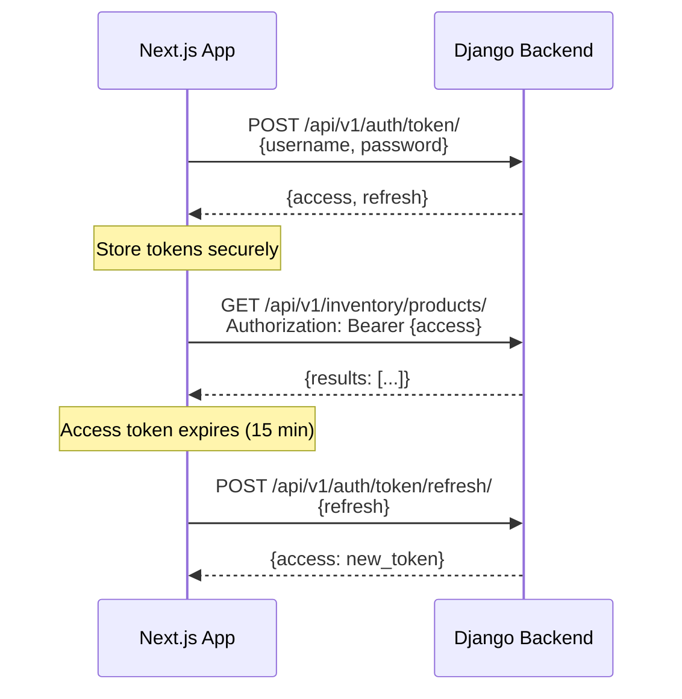
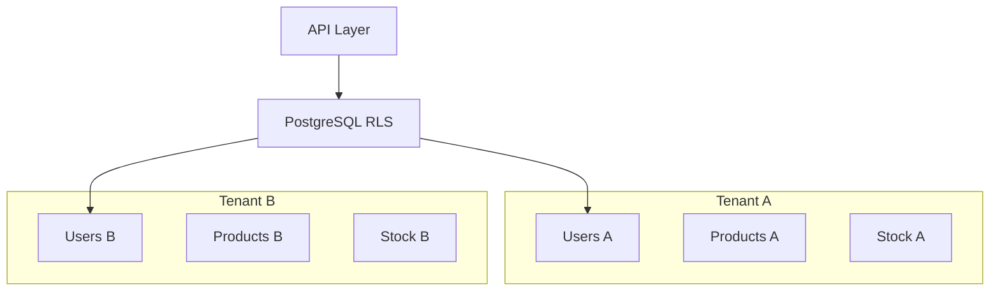

# Backend Connection Guide for Frontend Developers

This guide explains how to connect the GRAVITEA-ERP Next.js frontend to the Django backend.

---

## Table of Contents

1. [Tech Stack Overview](#tech-stack-overview)
2. [Prerequisites](#prerequisites)
3. [Quick Start](#quick-start)
4. [Docker Desktop Installation](#docker-desktop-installation)
5. [Backend Setup](#backend-setup)
6. [API Authentication](#api-authentication)
7. [Available Endpoints](#available-endpoints)
8. [API Client Setup](#api-client-setup)
9. [Next.js Integration Patterns](#nextjs-integration-patterns)
10. [Common Scenarios](#common-scenarios)
11. [Error Handling](#error-handling)
12. [Troubleshooting](#troubleshooting)
13. [Backend Capabilities Overview](#backend-capabilities-overview)

---

## Tech Stack Overview

The frontend uses:

| Technology | Version | Purpose |
|------------|---------|---------|
| **Next.js** | 16.1.0 | React framework with App Router |
| **React** | 19.2.3 | UI library |
| **Tailwind CSS** | 4.0.0 | Utility-first CSS |
| **shadcn/ui** | new-york | Component library (Radix primitives) |
| **pnpm** | latest | Package manager |
| **lucide-react** | latest | Icons |

**Project Structure:**
```
apps/web/
├── src/
│   ├── app/
│   │   ├── (app)/          # Authenticated routes
│   │   │   ├── inventory/
│   │   │   └── layout.tsx
│   │   ├── (auth)/         # Public routes
│   │   │   └── login/
│   │   ├── globals.css
│   │   └── layout.tsx
│   ├── components/
│   │   ├── layout/         # App shell, sidebar
│   │   └── ui/             # shadcn/ui components
│   ├── hooks/
│   ├── lib/
│   └── services/
│       └── http.ts         # API client
├── components.json          # shadcn/ui config
├── tailwind.config.js
└── package.json
```

---

## Prerequisites

Before starting, ensure you have:

- [ ] **Node.js 20+** (required for Next.js 16)
- [ ] **pnpm** (`npm install -g pnpm`)
- [ ] **Git** installed
- [ ] **Docker Desktop** (for backend services)
- [ ] 8GB RAM minimum (16GB recommended)
- [ ] 10GB free disk space

---

## Quick Start

```bash
# 1. Start the backend (from project root)
cd backend
docker compose up -d

# 2. Verify backend is running
curl http://localhost:8000/health/live

# 3. Start the frontend (from project root)
cd apps/web
pnpm install
pnpm dev

# Frontend: http://localhost:3000
# Backend API: http://localhost:8000/api/v1
```

---

## Docker Desktop Installation

Docker is required to run the backend infrastructure (PostgreSQL, Redis, Django).

### Windows Installation

1. **Download Docker Desktop**
   - Visit: https://www.docker.com/products/docker-desktop/
   - Click **"Download for Windows"**

2. **Run the Installer**
   - Enable WSL 2 (recommended)
   - Add shortcut to desktop

3. **Verify Installation**
   ```powershell
   docker --version
   docker compose version
   ```

### macOS Installation

1. **Download Docker Desktop**
   - Visit: https://www.docker.com/products/docker-desktop/
   - Choose **Apple Silicon** (M1/M2/M3) or **Intel**

2. **Verify Installation**
   ```bash
   docker --version
   docker compose version
   ```

### Linux Installation (Ubuntu/Debian)

```bash
# Install Docker Engine
curl -fsSL https://get.docker.com | sh
sudo usermod -aG docker $USER
newgrp docker

# Verify
docker --version
docker compose version
```

---

## Backend Setup

### Step 1: Navigate to Backend Directory

```bash
cd backend
```

### Step 2: Create Environment File

```bash
# Windows (PowerShell)
Copy-Item .env.example .env

# macOS/Linux
cp .env.example .env
```

### Step 3: Start Docker Services

```bash
docker compose up -d
```

This starts:
- **PostgreSQL 16** - Database (port 5432)
- **Redis 7** - Cache (port 6379)
- **Django** - Backend API (port 8000)

### Step 4: Verify Services

```bash
# Check service status
docker compose ps

# Check backend health
curl http://localhost:8000/health/live
```

Expected response:
```json
{"status": "healthy", "timestamp": "2026-01-21T12:00:00Z"}
```

### Step 5: Seed Test Data

```bash
docker compose exec web python manage.py seed --scenario standard
```

### Test Credentials

| Username | Password | Role | Description |
|----------|----------|------|-------------|
| `admin` | `admin123` | Admin | Full access |
| `sales` | `sales123` | Sales | Sales operations |
| `viewer` | `viewer123` | Viewer | Read-only access |

### Port Reference

When the backend is running with all services active, the following ports are used:

#### Core Services (`docker-compose.yml`)

| Service | Port | URL | Description |
|---------|------|-----|-------------|
| **Django API** | `8000` | http://localhost:8000 | Backend REST API |
| **PostgreSQL** | `5432` | localhost:5432 | Database |
| **Redis** | `6379` | localhost:6379 | Cache & Celery broker |

#### Observability Stack (`docker-compose.observability.yml`)

These ports are only active when running the observability stack:

```bash
# Start observability (optional)
docker compose -f docker-compose.yml -f docker-compose.observability.yml up -d
```

| Service | Port | URL | Description |
|---------|------|-----|-------------|
| **Grafana** | `3001` | http://localhost:3001 | Dashboards (admin/admin) |
| **Prometheus** | `9090` | http://localhost:9090 | Metrics collection |
| **Jaeger UI** | `16686` | http://localhost:16686 | Distributed tracing |
| **Jaeger OTLP gRPC** | `4317` | localhost:4317 | Trace ingestion (gRPC) |
| **Jaeger OTLP HTTP** | `4318` | localhost:4318 | Trace ingestion (HTTP) |
| **Jaeger Admin** | `14269` | localhost:14269 | Health checks |
| **Loki** | `3100` | http://localhost:3100 | Log aggregation |
| **Alertmanager** | `9093` | http://localhost:9093 | Alert routing |

#### Quick Port Summary

```
# Core (always active)
Backend API:     http://localhost:8000
PostgreSQL:      localhost:5432
Redis:           localhost:6379

# Observability (when enabled)
Grafana:         http://localhost:3001
Prometheus:      http://localhost:9090
Jaeger:          http://localhost:16686
Loki:            http://localhost:3100
Alertmanager:    http://localhost:9093
```

> **Note**: Grafana runs on port `3001` to avoid conflict with the Next.js frontend (port `3000`).

---

## API Authentication

The backend uses **JWT (JSON Web Tokens)** with RS256 asymmetric signing.

### Token Lifecycle



### Token Details

| Token Type | Lifetime | Storage Recommendation |
|------------|----------|------------------------|
| Access Token | 15 minutes | Memory or secure cookie |
| Refresh Token | 7 days | HttpOnly cookie |

---

## Available Endpoints

### Base URL

```
http://localhost:8000/api/v1/
```

### Health Checks (No Auth Required)

| Endpoint | Method | Description |
|----------|--------|-------------|
| `/health/live` | GET | Liveness probe |
| `/health/ready` | GET | Readiness probe |
| `/health/startup` | GET | Startup probe |

### Authentication

| Endpoint | Method | Description |
|----------|--------|-------------|
| `/auth/token/` | POST | Obtain JWT tokens |
| `/auth/token/refresh/` | POST | Refresh access token |
| `/auth/token/verify/` | POST | Verify token validity |
| `/auth/logout/` | POST | Revoke refresh token |
| `/auth/users/me/` | GET/PUT | Current user profile |
| `/auth/users/me/change-password/` | POST | Change password |

### Inventory

| Endpoint | Method | Description |
|----------|--------|-------------|
| `/inventory/products/` | GET/POST | Product catalog |
| `/inventory/products/{id}/` | GET/PUT/DELETE | Product CRUD |
| `/inventory/categories/` | GET/POST | Category management |
| `/inventory/categories/tree/` | GET | Hierarchical tree |
| `/inventory/suppliers/` | GET/POST | Supplier management |
| `/inventory/stock-movements/` | GET/POST | Stock ledger (immutable) |
| `/inventory/stock-snapshots/` | GET | Current stock levels |

### Sync (POS Terminal)

| Endpoint | Method | Description |
|----------|--------|-------------|
| `/sync/sessions/` | POST | Start sync session |
| `/sync/push/` | POST | Upload offline changes |
| `/sync/pull/` | GET | Download server changes |

---

## API Client Setup

### Environment Variables

Create `.env.local` in `apps/web/`:

```bash
# apps/web/.env.local
NEXT_PUBLIC_API_BASE_URL=http://localhost:8000/api/v1
```

### Enhanced HTTP Service

Replace `apps/web/src/services/http.ts` with this enhanced version:

```typescript
// apps/web/src/services/http.ts

const BASE_URL = process.env.NEXT_PUBLIC_API_BASE_URL ?? "http://localhost:8000/api/v1";

type HttpMethod = "GET" | "POST" | "PUT" | "PATCH" | "DELETE";

interface RequestOptions {
  method?: HttpMethod;
  body?: unknown;
  headers?: Record<string, string>;
  token?: string;
}

interface ApiError {
  type: string;
  title: string;
  status: number;
  detail: string;
  errors?: Record<string, string[]>;
}

export class HttpError extends Error {
  constructor(
    public status: number,
    public detail: string,
    public errors?: Record<string, string[]>
  ) {
    super(detail);
    this.name = "HttpError";
  }
}

export async function http<T>(
  path: string,
  options: RequestOptions = {}
): Promise<T> {
  const headers: Record<string, string> = {
    "Content-Type": "application/json",
    ...options.headers,
  };

  if (options.token) {
    headers["Authorization"] = `Bearer ${options.token}`;
  }

  const res = await fetch(`${BASE_URL}${path}`, {
    method: options.method ?? "GET",
    headers,
    body: options.body ? JSON.stringify(options.body) : undefined,
  });

  if (!res.ok) {
    const contentType = res.headers.get("content-type") ?? "";

    if (contentType.includes("application/json")) {
      const error: ApiError = await res.json();
      throw new HttpError(res.status, error.detail, error.errors);
    }

    throw new HttpError(res.status, res.statusText);
  }

  const contentType = res.headers.get("content-type") ?? "";
  if (!contentType.includes("application/json")) {
    return undefined as T;
  }

  return (await res.json()) as T;
}
```

### Type Definitions

Create `apps/web/src/types/api.ts`:

```typescript
// apps/web/src/types/api.ts

// Auth Types
export interface AuthTokens {
  access: string;
  refresh: string;
}

export interface User {
  id: string;
  username: string;
  email: string;
  first_name: string;
  last_name: string;
  role: string;
  tenant_id: string;
  branch_id: string | null;
  is_active: boolean;
}

// Pagination
export interface PaginatedResponse<T> {
  count: number;
  next: string | null;
  previous: string | null;
  results: T[];
}

// Inventory Types
export interface Product {
  id: string;
  sku: string;
  barcode: string | null;
  name: string;
  description: string | null;
  unit_price: string;      // DECIMAL as string
  cost_price: string;      // DECIMAL as string
  tax_rate: string;        // DECIMAL as string
  min_stock: string | null;
  is_active: boolean;
  category_id: string | null;
  supplier_id: string | null;
  created_at: string;      // ISO 8601
  updated_at: string;
}

export interface Category {
  id: string;
  name: string;
  description: string | null;
  parent_id: string | null;
  is_active: boolean;
}

export interface CategoryTree extends Category {
  children: CategoryTree[];
}

export interface StockSnapshot {
  id: string;
  product_id: string;
  branch_id: string;
  quantity: string;        // DECIMAL as string
  reserved_quantity: string;
  available_quantity: string;
  last_updated: string;
}

// Stock Movement (immutable)
export type MovementType = "SALE" | "PURCHASE" | "ADJ" | "TRANS_IN" | "TRANS_OUT";

export interface StockMovement {
  id: string;
  product_id: string;
  branch_id: string;
  type: MovementType;
  quantity_delta: string;  // DECIMAL as string (negative for outbound)
  cost_snapshot: string | null;
  reference_id: string | null;
  created_at: string;
}
```

### Auth Service

Create `apps/web/src/services/auth.ts`:

```typescript
// apps/web/src/services/auth.ts
import { http, HttpError } from "./http";
import type { AuthTokens, User } from "@/types/api";

const TOKEN_KEY = "gravitea_tokens";

export function getStoredTokens(): AuthTokens | null {
  if (typeof window === "undefined") return null;
  const stored = localStorage.getItem(TOKEN_KEY);
  return stored ? JSON.parse(stored) : null;
}

export function storeTokens(tokens: AuthTokens): void {
  localStorage.setItem(TOKEN_KEY, JSON.stringify(tokens));
}

export function clearTokens(): void {
  localStorage.removeItem(TOKEN_KEY);
}

export async function login(username: string, password: string): Promise<AuthTokens> {
  const tokens = await http<AuthTokens>("/auth/token/", {
    method: "POST",
    body: { username, password },
  });
  storeTokens(tokens);
  return tokens;
}

export async function refreshAccessToken(): Promise<string> {
  const tokens = getStoredTokens();
  if (!tokens?.refresh) {
    throw new HttpError(401, "No refresh token");
  }

  const response = await http<{ access: string }>("/auth/token/refresh/", {
    method: "POST",
    body: { refresh: tokens.refresh },
  });

  storeTokens({ ...tokens, access: response.access });
  return response.access;
}

export async function logout(): Promise<void> {
  const tokens = getStoredTokens();
  if (tokens?.refresh) {
    try {
      await http("/auth/logout/", {
        method: "POST",
        body: { refresh: tokens.refresh },
        token: tokens.access,
      });
    } catch {
      // Ignore logout errors
    }
  }
  clearTokens();
}

export async function getCurrentUser(): Promise<User> {
  const tokens = getStoredTokens();
  if (!tokens?.access) {
    throw new HttpError(401, "Not authenticated");
  }
  return http<User>("/auth/users/me/", { token: tokens.access });
}
```

---

## Next.js Integration Patterns

### Auth Context Provider

Create `apps/web/src/contexts/auth-context.tsx`:

```tsx
// apps/web/src/contexts/auth-context.tsx
"use client";

import { createContext, useContext, useState, useEffect, useCallback, ReactNode } from "react";
import type { User, AuthTokens } from "@/types/api";
import * as authService from "@/services/auth";

interface AuthContextType {
  user: User | null;
  isLoading: boolean;
  isAuthenticated: boolean;
  login: (username: string, password: string) => Promise<void>;
  logout: () => Promise<void>;
  getAccessToken: () => Promise<string>;
}

const AuthContext = createContext<AuthContextType | null>(null);

export function AuthProvider({ children }: { children: ReactNode }) {
  const [user, setUser] = useState<User | null>(null);
  const [isLoading, setIsLoading] = useState(true);

  useEffect(() => {
    // Check for existing session on mount
    const tokens = authService.getStoredTokens();
    if (tokens?.access) {
      authService.getCurrentUser()
        .then(setUser)
        .catch(() => authService.clearTokens())
        .finally(() => setIsLoading(false));
    } else {
      setIsLoading(false);
    }
  }, []);

  const login = useCallback(async (username: string, password: string) => {
    await authService.login(username, password);
    const user = await authService.getCurrentUser();
    setUser(user);
  }, []);

  const logout = useCallback(async () => {
    await authService.logout();
    setUser(null);
  }, []);

  const getAccessToken = useCallback(async (): Promise<string> => {
    const tokens = authService.getStoredTokens();
    if (!tokens?.access) throw new Error("Not authenticated");

    // TODO: Check expiration and refresh if needed
    return tokens.access;
  }, []);

  return (
    <AuthContext.Provider
      value={{
        user,
        isLoading,
        isAuthenticated: !!user,
        login,
        logout,
        getAccessToken,
      }}
    >
      {children}
    </AuthContext.Provider>
  );
}

export function useAuth() {
  const context = useContext(AuthContext);
  if (!context) {
    throw new Error("useAuth must be used within AuthProvider");
  }
  return context;
}
```

### Protected Route Wrapper

Create `apps/web/src/components/auth/protected-route.tsx`:

```tsx
// apps/web/src/components/auth/protected-route.tsx
"use client";

import { useAuth } from "@/contexts/auth-context";
import { useRouter } from "next/navigation";
import { useEffect } from "react";

export function ProtectedRoute({ children }: { children: React.ReactNode }) {
  const { isAuthenticated, isLoading } = useAuth();
  const router = useRouter();

  useEffect(() => {
    if (!isLoading && !isAuthenticated) {
      router.push("/login");
    }
  }, [isAuthenticated, isLoading, router]);

  if (isLoading) {
    return (
      <div className="flex h-screen items-center justify-center">
        <div className="text-muted-foreground">Cargando...</div>
      </div>
    );
  }

  if (!isAuthenticated) {
    return null;
  }

  return <>{children}</>;
}
```

### Data Fetching Hook

Create `apps/web/src/hooks/use-api.ts`:

```tsx
// apps/web/src/hooks/use-api.ts
"use client";

import { useState, useEffect, useCallback } from "react";
import { http, HttpError } from "@/services/http";
import { useAuth } from "@/contexts/auth-context";

interface UseApiOptions {
  immediate?: boolean;
}

export function useApi<T>(
  path: string,
  options: UseApiOptions = { immediate: true }
) {
  const { getAccessToken } = useAuth();
  const [data, setData] = useState<T | null>(null);
  const [error, setError] = useState<HttpError | null>(null);
  const [isLoading, setIsLoading] = useState(options.immediate ?? true);

  const fetchData = useCallback(async () => {
    setIsLoading(true);
    setError(null);

    try {
      const token = await getAccessToken();
      const result = await http<T>(path, { token });
      setData(result);
    } catch (err) {
      setError(err instanceof HttpError ? err : new HttpError(500, "Unknown error"));
    } finally {
      setIsLoading(false);
    }
  }, [path, getAccessToken]);

  useEffect(() => {
    if (options.immediate) {
      fetchData();
    }
  }, [fetchData, options.immediate]);

  return { data, error, isLoading, refetch: fetchData };
}
```

---

## Common Scenarios

### Scenario 1: Login Form with shadcn/ui

```tsx
// apps/web/src/app/(auth)/login/page.tsx
"use client";

import { useState } from "react";
import { useRouter } from "next/navigation";
import { useAuth } from "@/contexts/auth-context";
import { Button } from "@/components/ui/button";
import { Input } from "@/components/ui/input";
import { HttpError } from "@/services/http";

export default function LoginPage() {
  const router = useRouter();
  const { login } = useAuth();
  const [username, setUsername] = useState("");
  const [password, setPassword] = useState("");
  const [error, setError] = useState<string | null>(null);
  const [isLoading, setIsLoading] = useState(false);

  async function handleSubmit(e: React.FormEvent) {
    e.preventDefault();
    setError(null);
    setIsLoading(true);

    try {
      await login(username, password);
      router.push("/inventory");
    } catch (err) {
      if (err instanceof HttpError) {
        setError(err.status === 401
          ? "Credenciales incorrectas"
          : err.detail
        );
      } else {
        setError("Error de conexión");
      }
    } finally {
      setIsLoading(false);
    }
  }

  return (
    <div className="flex min-h-screen items-center justify-center">
      <form onSubmit={handleSubmit} className="w-full max-w-sm space-y-4 p-6">
        <div className="space-y-2 text-center">
          <h1 className="text-2xl font-bold">GraviTea ERP</h1>
          <p className="text-muted-foreground">Ingrese sus credenciales</p>
        </div>

        {error && (
          <div className="rounded-md bg-destructive/10 p-3 text-sm text-destructive">
            {error}
          </div>
        )}

        <div className="space-y-4">
          <Input
            type="text"
            placeholder="Usuario"
            value={username}
            onChange={(e) => setUsername(e.target.value)}
            disabled={isLoading}
            required
          />
          <Input
            type="password"
            placeholder="Contraseña"
            value={password}
            onChange={(e) => setPassword(e.target.value)}
            disabled={isLoading}
            required
          />
          <Button type="submit" className="w-full" disabled={isLoading}>
            {isLoading ? "Ingresando..." : "Ingresar"}
          </Button>
        </div>

        <p className="text-center text-xs text-muted-foreground">
          Demo: admin / admin123
        </p>
      </form>
    </div>
  );
}
```

### Scenario 2: Product List with Pagination

```tsx
// apps/web/src/app/(app)/inventory/page.tsx
"use client";

import { useApi } from "@/hooks/use-api";
import { Skeleton } from "@/components/ui/skeleton";
import type { PaginatedResponse, Product } from "@/types/api";

export default function InventoryPage() {
  const { data, error, isLoading } = useApi<PaginatedResponse<Product>>(
    "/inventory/products/"
  );

  if (isLoading) {
    return (
      <div className="space-y-4">
        <h1 className="text-2xl font-bold">Inventario</h1>
        <div className="space-y-2">
          {[...Array(5)].map((_, i) => (
            <Skeleton key={i} className="h-16 w-full" />
          ))}
        </div>
      </div>
    );
  }

  if (error) {
    return (
      <div className="rounded-md bg-destructive/10 p-4">
        <p className="text-destructive">Error: {error.detail}</p>
      </div>
    );
  }

  return (
    <div className="space-y-4">
      <div className="flex items-center justify-between">
        <h1 className="text-2xl font-bold">Inventario</h1>
        <p className="text-muted-foreground">{data?.count} productos</p>
      </div>

      <div className="rounded-md border">
        <table className="w-full">
          <thead className="border-b bg-muted/50">
            <tr>
              <th className="p-3 text-left text-sm font-medium">SKU</th>
              <th className="p-3 text-left text-sm font-medium">Nombre</th>
              <th className="p-3 text-right text-sm font-medium">Precio</th>
              <th className="p-3 text-right text-sm font-medium">Costo</th>
            </tr>
          </thead>
          <tbody>
            {data?.results.map((product) => (
              <tr key={product.id} className="border-b last:border-0">
                <td className="p-3 text-sm font-mono">{product.sku}</td>
                <td className="p-3 text-sm">{product.name}</td>
                <td className="p-3 text-right text-sm">
                  ${parseFloat(product.unit_price).toFixed(2)}
                </td>
                <td className="p-3 text-right text-sm text-muted-foreground">
                  ${parseFloat(product.cost_price).toFixed(2)}
                </td>
              </tr>
            ))}
          </tbody>
        </table>
      </div>
    </div>
  );
}
```

### Scenario 3: Create Product

```typescript
// Example: Creating a product
import { http } from "@/services/http";
import { getStoredTokens } from "@/services/auth";
import type { Product } from "@/types/api";

interface CreateProductData {
  sku: string;
  name: string;
  unit_price: string;  // Always send as string
  cost_price: string;
  tax_rate?: string;
  min_stock?: string;
  category_id?: string;
  supplier_id?: string;
}

async function createProduct(data: CreateProductData): Promise<Product> {
  const tokens = getStoredTokens();
  if (!tokens?.access) throw new Error("Not authenticated");

  return http<Product>("/inventory/products/", {
    method: "POST",
    body: data,
    token: tokens.access,
  });
}

// Usage:
await createProduct({
  sku: "PROD-001",
  name: "Nuevo Producto",
  unit_price: "99.990",   // 3 decimal places
  cost_price: "49.995",
  tax_rate: "21.00",
});
```

### Scenario 4: Stock Movement (Sale)

```typescript
// Recording a sale (reduces stock)
import { http } from "@/services/http";
import type { StockMovement } from "@/types/api";

interface CreateMovementData {
  product: string;       // product UUID
  branch: string;        // branch UUID
  type: "SALE" | "PURCHASE" | "ADJ" | "TRANS_IN" | "TRANS_OUT";
  quantity_delta: string; // Negative for outbound
  reference_id?: string;
}

async function recordSale(
  productId: string,
  branchId: string,
  quantity: number,
  saleId?: string
): Promise<StockMovement> {
  const tokens = getStoredTokens();
  if (!tokens?.access) throw new Error("Not authenticated");

  return http<StockMovement>("/inventory/stock-movements/", {
    method: "POST",
    token: tokens.access,
    body: {
      product: productId,
      branch: branchId,
      type: "SALE",
      quantity_delta: (-Math.abs(quantity)).toFixed(4), // Always negative
      reference_id: saleId,
    },
  });
}
```

---

## Error Handling

The API uses **RFC 7807 Problem Details** for error responses.

### Error Response Format

```json
{
  "type": "https://gravitea.io/problems/validation-error",
  "title": "Validation Error",
  "status": 400,
  "detail": "The provided data did not pass validation",
  "instance": "/api/v1/inventory/products/",
  "errors": {
    "sku": ["This field is required."],
    "unit_price": ["Ensure this value is greater than 0."]
  }
}
```

### Error Handler Component

```tsx
// apps/web/src/components/ui/error-message.tsx
import { HttpError } from "@/services/http";

interface ErrorMessageProps {
  error: HttpError | Error | null;
}

export function ErrorMessage({ error }: ErrorMessageProps) {
  if (!error) return null;

  if (error instanceof HttpError) {
    return (
      <div className="rounded-md bg-destructive/10 p-4 space-y-2">
        <p className="font-medium text-destructive">{error.detail}</p>
        {error.errors && (
          <ul className="text-sm text-destructive/80 list-disc list-inside">
            {Object.entries(error.errors).map(([field, messages]) => (
              <li key={field}>
                <span className="font-medium">{field}:</span> {messages.join(", ")}
              </li>
            ))}
          </ul>
        )}
      </div>
    );
  }

  return (
    <div className="rounded-md bg-destructive/10 p-4">
      <p className="text-destructive">{error.message}</p>
    </div>
  );
}
```

### Common Error Codes

| Status | Meaning | Frontend Action |
|--------|---------|-----------------|
| 400 | Validation Error | Show field errors |
| 401 | Not Authenticated | Redirect to login |
| 403 | Permission Denied | Show access denied |
| 404 | Not Found | Show not found message |
| 409 | Conflict | Show duplicate error |
| 429 | Rate Limited | Show retry message |
| 500 | Server Error | Show generic error |

### Rate Limiting

| User Type | Rate Limit |
|-----------|------------|
| Anonymous | 100 requests/hour |
| Authenticated | 1,000 requests/hour |

---

## Troubleshooting

### Backend Won't Start

```bash
# Check Docker is running
docker info

# Check port availability (Windows)
netstat -ano | findstr :8000

# Reset Docker environment
docker compose down -v
docker compose up -d
```

### Cannot Connect to Backend

```bash
# Verify backend is running
docker compose ps
curl http://localhost:8000/health/live

# Check container logs
docker compose logs web
```

### CORS Errors

1. Check `.env` in backend:
   ```bash
   CORS_ALLOWED_ORIGINS=http://localhost:3000
   ```

2. Restart backend:
   ```bash
   docker compose restart web
   ```

### Authentication Fails

1. Seed test data:
   ```bash
   docker compose exec web python manage.py seed --scenario standard
   ```

2. Verify token format:
   ```
   ✓ Authorization: Bearer eyJ0eXAiOiJKV1Q...
   ✗ Authorization: eyJ0eXAiOiJKV1Q...
   ✗ Authorization: JWT eyJ0eXAiOiJKV1Q...
   ```

### "Not Authenticated" After Refresh

The access token expires after 15 minutes. Implement token refresh:

```typescript
// In your auth context or API wrapper
if (error.status === 401) {
  try {
    const newToken = await refreshAccessToken();
    // Retry the original request with new token
  } catch {
    // Refresh failed, redirect to login
    clearTokens();
    router.push("/login");
  }
}
```

---

## Backend Capabilities Overview

### Multi-Tenant Architecture



- Each user belongs to one tenant
- Data is automatically isolated by tenant
- Cross-tenant access is impossible by design

### Data Types

**Money Fields** - DECIMAL(17,3) as strings:
```json
{"unit_price": "99.990", "cost_price": "49.995", "tax_rate": "21.00"}
```

**Quantities** - DECIMAL(16,4) as strings:
```json
{"quantity": "100.0000", "quantity_delta": "-5.0000"}
```

**UUIDs** - All entity IDs:
```json
{"id": "123e4567-e89b-12d3-a456-426614174000"}
```

**Timestamps** - ISO 8601 with timezone:
```json
{"created_at": "2026-01-21T10:30:00Z"}
```

### Security Features

| Feature | Description |
|---------|-------------|
| **JWT RS256** | Asymmetric token signing |
| **PostgreSQL RLS** | Row-level security for tenant isolation |
| **Field Encryption** | AES-256-GCM for PII |
| **Rate Limiting** | Protection against abuse |
| **RFC 7807 Errors** | Standardized error responses |

---

## Quick Reference

### Essential Commands

```bash
# Backend
cd backend && docker compose up -d     # Start
docker compose stop                     # Stop
docker compose logs -f web              # Logs
docker compose down -v                  # Reset

# Frontend
cd apps/web && pnpm dev                 # Start dev server
pnpm build                              # Build
pnpm lint                               # Lint
pnpm typecheck                          # Type check
```

### Essential Endpoints

```
POST   /api/v1/auth/token/           # Login
POST   /api/v1/auth/token/refresh/   # Refresh token
GET    /api/v1/auth/users/me/        # Current user
GET    /api/v1/inventory/products/   # List products
POST   /api/v1/inventory/products/   # Create product
GET    /health/live                  # Health check
```

### Test Credentials

```
admin / admin123  - Full access
sales / sales123  - Sales operations
viewer / viewer123 - Read only
```

---

## Additional Resources

- [Backend README](../backend/README.md) - Development status and architecture
- [API Documentation](../api/openapi/README.md) - Detailed endpoint documentation
- [Test Suite](../backend/tests/README.md) - Testing documentation
- [shadcn/ui Docs](https://ui.shadcn.com) - Component reference

---

*Last Updated: January 2026*
*Frontend: Next.js 16.1.0 | React 19 | Tailwind CSS 4 | shadcn/ui*
*Backend: Django 5.2 | PostgreSQL 16 | Redis 7*
