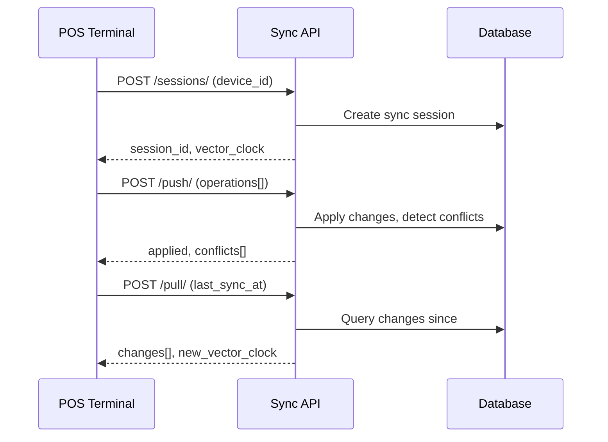

# Gravitea ERP - API Contracts

OpenAPI 3.1.0 specifications for frontend integration.

---

## Table of Contents

1. [Quick Start](#quick-start)
2. [Contract Overview](#contract-overview)
3. [Authentication API](#authentication-api)
4. [Procurement (Compras) API](#procurement-compras-api)
5. [Core Configuration API](#core-configuration-api)
6. [Electronic Invoicing (Facturacion) API](#electronic-invoicing-facturacion-api)
7. [Health Check API](#health-check-api)
8. [Inventory API](#inventory-api)
9. [Reports API](#reports-api)
10. [Sales (Ventas) API](#sales-ventas-api)
11. [Sync API](#sync-api)
12. [Common Patterns](#common-patterns)
13. [Error Handling](#error-handling)
14. [Rate Limiting](#rate-limiting)
15. [Field Reference](#field-reference)
16. [Version History](#version-history)

---

## Quick Start

```bash
# View Swagger UI (when server running)
http://localhost:8000/api/v1/schema/swagger-ui/

# Download OpenAPI schema
http://localhost:8000/api/v1/schema/

# ReDoc documentation
http://localhost:8000/api/v1/schema/redoc/
```

### Contract Files

| Contract | Description | Base Path | Paths | Ops | Version |
|----------|-------------|-----------|-------|-----|---------|
| `auth-api.yaml` | Authentication, Users, Roles, Branches | `/api/v1/auth/` | 12 | 21 | 2.0.0 |
| `compras-api.yaml` | Purchase Orders, Goods Receipts, Suppliers | `/api/v1/compras/` | 10 | 18 | 1.0.0 |
| `core-api.yaml` | Field Definitions, Module Configuration | `/api/v1/` | 4 | 4 | 1.0.0 |
| `facturacion-api.yaml` | ARCA Credentials, Comprobantes, CAE/CAEA | `/api/v1/facturacion/` | 13 | 21 | 2.0.0 |
| `health-api.yaml` | Liveness, readiness, startup probes | `/api/v1/health/`, `/health/` | 4 | 4 | 2.0.0 |
| `inventario-api.yaml` | Products, Categories, Stock, Prices | `/api/v1/` | 16 | 29 | 2.0.0 |
| `reportes-api.yaml` | Report Definitions, Export Jobs, Saved Reports | `/api/v1/reportes/` | 6 | 13 | 1.0.0 |
| `sync-api.yaml` | Offline-first POS synchronization | `/api/v1/sync/` | 5 | 7 | 2.0.0 |
| `ventas-api.yaml` | Customers, Sale Orders, Order Items | `/api/v1/ventas/` | 9 | 20 | 2.0.0 |

> All contracts auto-generated from DRF Spectacular on 2026-02-28. Source of truth: backend Python code.

---

## Contract Overview

```mermaid
graph TB
    subgraph "API Gateway"
        AUTH[Auth API<br>/api/v1/auth/]
        HEALTH[Health API<br>/api/v1/health/]
        INV[Inventory API<br>/api/v1/]
        COMPRAS[Compras API<br>/api/v1/compras/]
        VENTAS[Ventas API<br>/api/v1/ventas/]
        FACT[Facturacion API<br>/api/v1/facturacion/]
        SYNC[Sync API<br>/api/v1/sync/]
        REPORTES[Reports API<br>/api/v1/reportes/]
        CORE[Core API<br>/api/v1/]
    end

    subgraph "Authentication Flow"
        LOGIN[POST /token/]
        REFRESH[POST /token/refresh/]
        VERIFY[POST /token/verify/]
    end

    subgraph "Inventory Operations"
        PROD[Products CRUD]
        STOCK[Stock Movements]
        PRICE[Price Management]
    end

    subgraph "Procurement Operations"
        PO[Purchase Orders]
        GR[Goods Receipts]
        SUPP[Suppliers]
    end

    subgraph "Sync Operations"
        PUSH[Push Changes]
        PULL[Pull Updates]
        SESSION[Session Mgmt]
    end

    AUTH --> LOGIN
    AUTH --> REFRESH
    AUTH --> VERIFY
    INV --> PROD
    INV --> STOCK
    INV --> PRICE
    COMPRAS --> PO
    COMPRAS --> GR
    COMPRAS --> SUPP
    SYNC --> PUSH
    SYNC --> PULL
    SYNC --> SESSION
```



---

## Authentication API

**Base URL**: `/api/v1/auth/`

JWT RS256 authentication with 15-minute access tokens and 7-day refresh tokens.

### JWT Token Structure

```json
{
  "sub": "user-uuid",
  "tenant_id": "tenant-uuid",
  "branch_id": "branch-uuid",
  "role": "admin",
  "permissions": ["products.read", "products.write"],
  "exp": 1234567890,
  "iat": 1234567890
}
```

### Token Endpoints

| Method | Endpoint | Description | Auth |
|--------|----------|-------------|------|
| `POST` | `/token/` | Obtain JWT token pair | No |
| `POST` | `/token/refresh/` | Refresh access token | No |
| `POST` | `/token/verify/` | Verify token validity | No |
| `POST` | `/logout/` | Blacklist refresh token | Yes |

#### POST /token/ - Obtain Token Pair

**Request:**
```json
{
  "username": "admin@tenant.com",
  "password": "secure_password"
}
```

**Response (200):**
```json
{
  "access": "eyJhbGciOiJSUzI1NiIs...",
  "refresh": "eyJhbGciOiJSUzI1NiIs...",
  "user": {
    "id": "550e8400-e29b-41d4-a716-446655440000",
    "username": "admin@tenant.com",
    "email": "admin@tenant.com",
    "role": "admin",
    "tenant_id": "tenant-uuid",
    "branch_id": "branch-uuid"
  }
}
```

**Response (401):**
```json
{
  "type": "https://api.gravitea.io/errors/authentication-failed",
  "title": "Authentication Failed",
  "status": 401,
  "detail": "Invalid credentials"
}
```

#### POST /token/refresh/ - Refresh Access Token

**Request:**
```json
{
  "refresh": "eyJhbGciOiJSUzI1NiIs..."
}
```

**Response (200):**
```json
{
  "access": "eyJhbGciOiJSUzI1NiIs..."
}
```

#### POST /token/verify/ - Verify Token

**Request:**
```json
{
  "token": "eyJhbGciOiJSUzI1NiIs..."
}
```

**Response (200):**
```json
{
  "valid": true,
  "exp": 1234567890
}
```

#### POST /logout/ - Blacklist Token

**Headers:** `Authorization: Bearer <access_token>`

**Request:**
```json
{
  "refresh": "eyJhbGciOiJSUzI1NiIs..."
}
```

**Response (204):** No content

---

### User Management Endpoints

| Method | Endpoint | Description | Auth | Permission |
|--------|----------|-------------|------|------------|
| `GET` | `/users/` | List users (paginated) | Yes | `users.read` |
| `POST` | `/users/` | Create user | Yes | `users.write` |
| `GET` | `/users/{id}/` | Get user details | Yes | `users.read` |
| `PATCH` | `/users/{id}/` | Update user | Yes | `users.write` |
| `DELETE` | `/users/{id}/` | Deactivate user | Yes | `users.delete` |
| `GET` | `/users/me/` | Current user profile | Yes | - |
| `PATCH` | `/users/me/` | Update own profile | Yes | - |
| `POST` | `/users/me/change-password/` | Change password | Yes | - |

#### GET /users/ - List Users

**Query Parameters:**
| Param | Type | Description |
|-------|------|-------------|
| `cursor` | string | Pagination cursor |
| `page_size` | integer | Items per page (default: 100, max: 500) |
| `is_active` | boolean | Filter by active status |
| `role` | string | Filter by role name |
| `branch_id` | uuid | Filter by branch |

**Response (200):**
```json
{
  "results": [
    {
      "id": "550e8400-e29b-41d4-a716-446655440000",
      "username": "admin@tenant.com",
      "email": "admin@tenant.com",
      "first_name": "Admin",
      "last_name": "User",
      "role": "admin",
      "branch_id": "branch-uuid",
      "is_active": true,
      "created_at": "2026-01-21T10:00:00Z",
      "last_login": "2026-01-21T09:00:00Z"
    }
  ],
  "next": "cursor_token_for_next_page",
  "previous": null
}
```

#### POST /users/ - Create User

**Request:**
```json
{
  "username": "newuser@tenant.com",
  "email": "newuser@tenant.com",
  "password": "secure_password",
  "first_name": "New",
  "last_name": "User",
  "role_id": "role-uuid",
  "branch_id": "branch-uuid"
}
```

**Response (201):**
```json
{
  "id": "new-user-uuid",
  "username": "newuser@tenant.com",
  "email": "newuser@tenant.com",
  "first_name": "New",
  "last_name": "User",
  "role": "cashier",
  "branch_id": "branch-uuid",
  "is_active": true,
  "created_at": "2026-01-21T10:00:00Z"
}
```

#### POST /users/me/change-password/

**Request:**
```json
{
  "old_password": "current_password",
  "new_password": "new_secure_password"
}
```

**Response (200):**
```json
{
  "detail": "Password changed successfully"
}
```

---

### Role Management Endpoints

| Method | Endpoint | Description | Auth | Permission |
|--------|----------|-------------|------|------------|
| `GET` | `/roles/` | List roles | Yes | `roles.read` |
| `POST` | `/roles/` | Create role | Yes | `roles.write` |
| `GET` | `/roles/{id}/` | Get role details | Yes | `roles.read` |
| `PATCH` | `/roles/{id}/` | Update role | Yes | `roles.write` |
| `DELETE` | `/roles/{id}/` | Delete role | Yes | `roles.delete` |

#### GET /roles/ - List Roles

**Response (200):**
```json
{
  "results": [
    {
      "id": "role-uuid",
      "name": "admin",
      "display_name": "Administrator",
      "description": "Full system access",
      "permissions": [
        "products.read", "products.write", "products.delete",
        "users.read", "users.write", "users.delete",
        "reports.read", "settings.write"
      ],
      "is_system": true,
      "created_at": "2026-01-01T00:00:00Z"
    },
    {
      "id": "role-uuid-2",
      "name": "cashier",
      "display_name": "Cashier",
      "description": "POS operations only",
      "permissions": ["products.read", "sales.write"],
      "is_system": true,
      "created_at": "2026-01-01T00:00:00Z"
    }
  ]
}
```

---

### Branch Endpoints

| Method | Endpoint | Description | Auth |
|--------|----------|-------------|------|
| `GET` | `/branches/` | List tenant branches | Yes |

#### GET /branches/ - List Branches

**Response (200):**
```json
{
  "results": [
    {
      "id": "branch-uuid",
      "name": "Main Store",
      "code": "MAIN",
      "address": "123 Main St",
      "is_active": true,
      "is_default": true
    },
    {
      "id": "branch-uuid-2",
      "name": "Downtown Branch",
      "code": "DT01",
      "address": "456 Downtown Ave",
      "is_active": true,
      "is_default": false
    }
  ]
}
```

---

## Inventory API

**Base URL**: `/api/v1/`

Multi-tenant inventory management with encrypted PII and immutable stock ledger.

### Product Endpoints

| Method | Endpoint | Description | Auth | Permission |
|--------|----------|-------------|------|------------|
| `GET` | `/products/` | List products (paginated) | Yes | `products.read` |
| `POST` | `/products/` | Create product | Yes | `products.write` |
| `GET` | `/products/{id}/` | Get product details | Yes | `products.read` |
| `PATCH` | `/products/{id}/` | Update product | Yes | `products.write` |
| `DELETE` | `/products/{id}/` | Soft-delete product | Yes | `products.delete` |
| `GET` | `/products/{id}/stock/` | Get stock by branch | Yes | `products.read` |
| `POST` | `/products/search/` | Search by barcode | Yes | `products.read` |

#### GET /products/ - List Products

**Query Parameters:**
| Param | Type | Description |
|-------|------|-------------|
| `cursor` | string | Pagination cursor |
| `page_size` | integer | Items per page (default: 100, max: 500) |
| `category_id` | uuid | Filter by category |
| `supplier_id` | uuid | Filter by supplier |
| `is_active` | boolean | Filter by active status |
| `min_stock_alert` | boolean | Filter products below min_stock |
| `search` | string | Search in name/SKU |

**Response (200):**
```json
{
  "results": [
    {
      "id": "product-uuid",
      "sku": "SKU-001",
      "barcode": "7501234567890",
      "name": "Example Product",
      "description": "Product description",
      "unit_price": "99.990",
      "cost_price": "49.995",
      "tax_rate": "21.00",
      "category_id": "category-uuid",
      "supplier_id": "supplier-uuid",
      "min_stock": "10.0000",
      "max_stock": "1000.0000",
      "is_active": true,
      "created_at": "2026-01-21T10:00:00Z",
      "updated_at": "2026-01-21T10:00:00Z"
    }
  ],
  "next": "cursor_token",
  "previous": null
}
```

#### POST /products/ - Create Product

**Request:**
```json
{
  "sku": "SKU-002",
  "barcode": "7501234567891",
  "name": "New Product",
  "description": "Product description",
  "unit_price": "149.990",
  "cost_price": "74.995",
  "tax_rate": "21.00",
  "category_id": "category-uuid",
  "supplier_id": "supplier-uuid",
  "min_stock": "5.0000",
  "max_stock": "500.0000"
}
```

**Response (201):** Product object as shown above.

#### GET /products/{id}/stock/ - Get Stock Levels

**Response (200):**
```json
{
  "product_id": "product-uuid",
  "stock_by_branch": [
    {
      "branch_id": "branch-uuid",
      "branch_name": "Main Store",
      "quantity": "150.0000",
      "reserved_quantity": "5.0000",
      "available_quantity": "145.0000",
      "last_updated": "2026-01-21T10:00:00Z"
    }
  ],
  "total_quantity": "150.0000",
  "total_reserved": "5.0000",
  "total_available": "145.0000"
}
```

#### POST /products/search/ - Barcode Search

Uses HMAC-SHA256 blind index for encrypted barcode lookup.

**Request:**
```json
{
  "barcode": "7501234567890"
}
```

**Response (200):**
```json
{
  "id": "product-uuid",
  "sku": "SKU-001",
  "barcode": "7501234567890",
  "name": "Example Product",
  "unit_price": "99.990",
  "cost_price": "49.995",
  "tax_rate": "21.00"
}
```

**Response (404):**
```json
{
  "type": "https://api.gravitea.io/errors/not-found",
  "title": "Not Found",
  "status": 404,
  "detail": "Product with barcode not found"
}
```

---

### Category Endpoints

| Method | Endpoint | Description | Auth | Permission |
|--------|----------|-------------|------|------------|
| `GET` | `/categories/` | List categories (flat) | Yes | `categories.read` |
| `POST` | `/categories/` | Create category | Yes | `categories.write` |
| `GET` | `/categories/{id}/` | Get category details | Yes | `categories.read` |
| `PATCH` | `/categories/{id}/` | Update category | Yes | `categories.write` |
| `DELETE` | `/categories/{id}/` | Delete category | Yes | `categories.delete` |
| `GET` | `/categories/tree/` | Get hierarchical tree | Yes | `categories.read` |

#### GET /categories/tree/ - Hierarchical Tree

**Response (200):**
```json
{
  "results": [
    {
      "id": "category-uuid",
      "name": "Electronics",
      "slug": "electronics",
      "parent_id": null,
      "level": 0,
      "children": [
        {
          "id": "child-uuid",
          "name": "Smartphones",
          "slug": "smartphones",
          "parent_id": "category-uuid",
          "level": 1,
          "children": []
        },
        {
          "id": "child-uuid-2",
          "name": "Laptops",
          "slug": "laptops",
          "parent_id": "category-uuid",
          "level": 1,
          "children": []
        }
      ]
    }
  ]
}
```

---

### Supplier Endpoints

| Method | Endpoint | Description | Auth | Permission |
|--------|----------|-------------|------|------------|
| `GET` | `/suppliers/` | List suppliers | Yes | `suppliers.read` |
| `POST` | `/suppliers/` | Create supplier | Yes | `suppliers.write` |
| `GET` | `/suppliers/{id}/` | Get supplier details | Yes | `suppliers.read` |
| `PATCH` | `/suppliers/{id}/` | Update supplier | Yes | `suppliers.write` |
| `DELETE` | `/suppliers/{id}/` | Soft-delete supplier | Yes | `suppliers.delete` |
| `GET` | `/suppliers/search/` | Search suppliers | Yes | `suppliers.read` |

#### GET /suppliers/ - List Suppliers

PII fields (tax_id, email, phone, contact_person) are encrypted with AES-256-GCM.

**Response (200):**
```json
{
  "results": [
    {
      "id": "supplier-uuid",
      "name": "Acme Supplies",
      "tax_id": "ES12345678A",
      "email": "contact@acme.com",
      "phone": "+34 612 345 678",
      "contact_person": "John Doe",
      "address": "123 Industrial Zone",
      "is_active": true,
      "created_at": "2026-01-21T10:00:00Z"
    }
  ]
}
```

#### GET /suppliers/search/ - Search Suppliers

**Query Parameters:**
| Param | Type | Description |
|-------|------|-------------|
| `q` | string | Search in name, tax_id, email |

**Response (200):** Same as list response, filtered.

---

### Stock Movement Endpoints

**IMPORTANT**: Stock movements are **immutable**. No PUT, PATCH, or DELETE allowed.

| Method | Endpoint | Description | Auth | Permission |
|--------|----------|-------------|------|------------|
| `GET` | `/movements/` | List movements (paginated) | Yes | `stock.read` |
| `POST` | `/movements/` | Create movement | Yes | `stock.write` |
| `GET` | `/movements/{id}/` | Get movement details | Yes | `stock.read` |

#### Movement Types

| Type | Direction | Description |
|------|-----------|-------------|
| `SALE` | Out (-) | Stock out via sale |
| `PURCHASE` | In (+) | Stock in via purchase |
| `ADJ` | Either | Manual stock adjustment |
| `TRANS_IN` | In (+) | Transfer in from another branch |
| `TRANS_OUT` | Out (-) | Transfer out to another branch |

#### GET /movements/ - List Movements

**Query Parameters:**
| Param | Type | Description |
|-------|------|-------------|
| `cursor` | string | Pagination cursor |
| `page_size` | integer | Items per page (default: 100, max: 500) |
| `product_id` | uuid | Filter by product |
| `branch_id` | uuid | Filter by branch |
| `type` | string | Filter by movement type |
| `created_after` | datetime | Filter by date range |
| `created_before` | datetime | Filter by date range |

**Response (200):**
```json
{
  "results": [
    {
      "id": "movement-uuid",
      "product_id": "product-uuid",
      "product_sku": "SKU-001",
      "product_name": "Example Product",
      "branch_id": "branch-uuid",
      "branch_name": "Main Store",
      "type": "SALE",
      "quantity_delta": "-5.0000",
      "cost_snapshot": "49.995",
      "reference_id": "sale-uuid",
      "notes": "POS Sale #12345",
      "created_at": "2026-01-21T10:00:00Z",
      "created_by": "user-uuid"
    }
  ],
  "next": "cursor_token",
  "previous": null
}
```

#### POST /movements/ - Create Movement

**Request:**
```json
{
  "product_id": "product-uuid",
  "branch_id": "branch-uuid",
  "type": "PURCHASE",
  "quantity_delta": "100.0000",
  "cost_snapshot": "45.000",
  "reference_id": "purchase-order-uuid",
  "notes": "PO #67890"
}
```

**Response (201):** Movement object as shown above.

#### Correcting Movements

To correct a movement, create a reversal (never modify the original):

```json
{
  "product_id": "product-uuid",
  "branch_id": "branch-uuid",
  "type": "ADJ",
  "quantity_delta": "5.0000",
  "reference_id": "original-movement-uuid",
  "notes": "Reversal of movement movement-uuid"
}
```

---

### Price Management Endpoints

| Method | Endpoint | Description | Auth | Permission |
|--------|----------|-------------|------|------------|
| `GET` | `/price-lists/` | List price lists | Yes | `prices.read` |
| `POST` | `/price-lists/` | Create price list | Yes | `prices.write` |
| `GET` | `/price-lists/{id}/` | Get price list details | Yes | `prices.read` |
| `PATCH` | `/price-lists/{id}/` | Update price list | Yes | `prices.write` |
| `DELETE` | `/price-lists/{id}/` | Delete price list | Yes | `prices.delete` |
| `POST` | `/price-lists/{id}/set-default/` | Set as default | Yes | `prices.write` |
| `GET` | `/price-history/` | Product price history | Yes | `prices.read` |
| `GET` | `/cost-history/` | Product cost history | Yes | `prices.read` |

#### GET /price-lists/ - List Price Lists

**Response (200):**
```json
{
  "results": [
    {
      "id": "pricelist-uuid",
      "name": "Retail",
      "description": "Standard retail prices",
      "currency": "EUR",
      "is_default": true,
      "is_active": true,
      "valid_from": "2026-01-01T00:00:00Z",
      "valid_to": null,
      "created_at": "2026-01-01T00:00:00Z"
    }
  ]
}
```

#### GET /price-history/ - Price History (SCD Type 2)

**Query Parameters:**
| Param | Type | Description |
|-------|------|-------------|
| `product_id` | uuid | Required - Product to get history for |
| `price_list_id` | uuid | Filter by price list |

**Response (200):**
```json
{
  "results": [
    {
      "id": "history-uuid",
      "product_id": "product-uuid",
      "price_list_id": "pricelist-uuid",
      "unit_price": "99.990",
      "valid_from": "2026-01-15T00:00:00Z",
      "valid_to": null,
      "is_current": true,
      "changed_by": "user-uuid",
      "change_reason": "Price increase"
    },
    {
      "id": "history-uuid-2",
      "product_id": "product-uuid",
      "price_list_id": "pricelist-uuid",
      "unit_price": "89.990",
      "valid_from": "2026-01-01T00:00:00Z",
      "valid_to": "2026-01-14T23:59:59Z",
      "is_current": false,
      "changed_by": "user-uuid",
      "change_reason": "Initial price"
    }
  ]
}
```

#### GET /cost-history/ - Cost History (SCD Type 2)

Same structure as price history but for cost_price tracking.

---

## Sync API

**Base URL**: `/api/v1/sync/`

Offline-first POS synchronization with vector clock conflict resolution.

### Sync Flow



### Session Management Endpoints

| Method | Endpoint | Description | Auth |
|--------|----------|-------------|------|
| `GET` | `/sessions/` | List device sessions | Yes |
| `POST` | `/sessions/` | Register device | Yes |
| `GET` | `/sessions/{id}/` | Get session details | Yes |
| `DELETE` | `/sessions/{id}/` | Unregister device | Yes |

#### POST /sessions/ - Register Device

**Request:**
```json
{
  "device_id": "POS-001",
  "device_name": "Main Counter POS",
  "device_type": "tablet"
}
```

**Response (201):**
```json
{
  "id": "session-uuid",
  "device_id": "POS-001",
  "device_name": "Main Counter POS",
  "device_type": "tablet",
  "branch_id": "branch-uuid",
  "status": "PENDING",
  "sync_vector": {},
  "last_sync_at": null,
  "created_at": "2026-01-21T10:00:00Z"
}
```

---

### Data Transfer Endpoints

| Method | Endpoint | Description | Auth |
|--------|----------|-------------|------|
| `POST` | `/push/` | Push offline operations | Yes |
| `POST` | `/pull/` | Pull server changes | Yes |
| `GET` | `/status/{device_id}/` | Get sync status | Yes |

#### POST /push/ - Push Offline Operations

Operations are idempotent via client-generated UUIDs.

**Request:**
```json
{
  "session_id": "session-uuid",
  "operations": [
    {
      "id": "client-generated-uuid",
      "entity_type": "product",
      "entity_id": "product-uuid",
      "operation": "UPDATE",
      "data": {
        "unit_price": "109.990"
      },
      "client_timestamp": "2026-01-21T10:00:00Z",
      "vector_clock": {"POS-001": 5}
    },
    {
      "id": "client-generated-uuid-2",
      "entity_type": "stock_movement",
      "entity_id": null,
      "operation": "CREATE",
      "data": {
        "product_id": "product-uuid",
        "branch_id": "branch-uuid",
        "type": "SALE",
        "quantity_delta": "-2.0000"
      },
      "client_timestamp": "2026-01-21T10:01:00Z",
      "vector_clock": {"POS-001": 6}
    }
  ]
}
```

**Response (200):**
```json
{
  "applied": [
    {
      "operation_id": "client-generated-uuid",
      "status": "SUCCESS",
      "server_id": "server-entity-uuid"
    },
    {
      "operation_id": "client-generated-uuid-2",
      "status": "SUCCESS",
      "server_id": "movement-uuid"
    }
  ],
  "conflicts": [],
  "new_vector_clock": {"POS-001": 6, "server": 1500}
}
```

**Response with Conflicts (200):**
```json
{
  "applied": [],
  "conflicts": [
    {
      "operation_id": "client-generated-uuid",
      "entity_type": "product",
      "entity_id": "product-uuid",
      "conflict_type": "CONCURRENT_MODIFICATION",
      "client_data": {"unit_price": "109.990"},
      "server_data": {"unit_price": "119.990"},
      "server_timestamp": "2026-01-21T09:55:00Z",
      "resolution_options": ["CLIENT_WINS", "SERVER_WINS", "MERGE"]
    }
  ],
  "new_vector_clock": {"POS-001": 5, "server": 1501}
}
```

#### POST /pull/ - Pull Server Changes

**Request:**
```json
{
  "session_id": "session-uuid",
  "last_sync_at": "2026-01-21T09:00:00Z",
  "entity_types": ["product", "category", "price_list"]
}
```

**Response (200):**
```json
{
  "changes": [
    {
      "entity_type": "product",
      "entity_id": "product-uuid",
      "operation": "UPDATE",
      "data": {
        "id": "product-uuid",
        "sku": "SKU-001",
        "name": "Updated Product Name",
        "unit_price": "119.990"
      },
      "server_timestamp": "2026-01-21T09:30:00Z",
      "vector_clock": {"server": 1501}
    }
  ],
  "new_vector_clock": {"POS-001": 6, "server": 1505},
  "has_more": false,
  "next_cursor": null
}
```

#### GET /status/{device_id}/ - Sync Status

**Response (200):**
```json
{
  "device_id": "POS-001",
  "session_id": "session-uuid",
  "status": "COMPLETED",
  "last_sync_at": "2026-01-21T10:05:00Z",
  "pending_push_count": 0,
  "pending_pull_count": 0,
  "conflict_count": 0,
  "sync_health": "HEALTHY"
}
```

### Sync Status Values

| Status | Description |
|--------|-------------|
| `PENDING` | Session created, no sync yet |
| `IN_PROGRESS` | Sync operation active |
| `COMPLETED` | Last sync successful |
| `FAILED` | Last sync failed |
| `CONFLICT` | Unresolved conflicts exist |

---

## Procurement (Compras) API

**Base URL**: `/api/v1/compras/`
**Contract**: `compras-api.yaml`

Purchase order lifecycle, goods receipt management, and supplier directory.

| Method | Endpoint | Description | Auth |
|--------|----------|-------------|------|
| `GET` | `/compras/purchase-orders/` | List purchase orders | Yes |
| `POST` | `/compras/purchase-orders/` | Create purchase order | Yes |
| `GET` | `/compras/purchase-orders/{id}/` | Get order detail | Yes |
| `PATCH` | `/compras/purchase-orders/{id}/` | Update order | Yes |
| `DELETE` | `/compras/purchase-orders/{id}/` | Delete order | Yes |
| `POST` | `/compras/purchase-orders/{id}/confirm/` | Confirm order | Yes |
| `POST` | `/compras/purchase-orders/{id}/cancel/` | Cancel order | Yes |
| `POST` | `/compras/purchase-orders/{id}/receive/` | Receive goods | Yes |
| `GET` | `/compras/goods-receipts/` | List goods receipts | Yes |
| `GET` | `/compras/goods-receipts/{id}/` | Get receipt detail | Yes |
| `GET` | `/compras/suppliers/` | List suppliers | Yes |
| `POST` | `/compras/suppliers/` | Create supplier | Yes |
| `GET` | `/compras/suppliers/{id}/` | Get supplier detail | Yes |
| `PATCH` | `/compras/suppliers/{id}/` | Update supplier | Yes |
| `DELETE` | `/compras/suppliers/{id}/` | Delete supplier | Yes |
| `GET` | `/compras/suppliers/search/` | Search suppliers | Yes |

### Purchase Order Lifecycle

```
DRAFT --> CONFIRMED --> RECEIVED
  |                      |
  +----> CANCELLED       +----> GoodsReceipt (immutable)
```

---

## Core Configuration API

**Base URL**: `/api/v1/`
**Contract**: `core-api.yaml`

Tenant-scoped customization engine: custom field definitions and module configuration.

| Method | Endpoint | Description | Auth |
|--------|----------|-------------|------|
| `GET` | `/field-definitions/` | List field definitions | Yes |
| `GET` | `/field-definitions/{id}/` | Get definition detail | Yes |
| `GET` | `/module-config/` | List module configurations | Yes |
| `GET` | `/module-config/{id}/` | Get config detail | Yes |

> Field definitions define custom fields per entity (e.g., custom product attributes).
> Module config controls which ERP modules are enabled per tenant.

---

## Reports API

**Base URL**: `/api/v1/reportes/`
**Contract**: `reportes-api.yaml`

Report definitions, async export jobs (CSV/XLSX via Rust engine), and saved report configurations.

| Method | Endpoint | Description | Auth |
|--------|----------|-------------|------|
| `GET` | `/reportes/definitions/` | List report definitions | Yes |
| `POST` | `/reportes/definitions/` | Create report definition | Yes |
| `GET` | `/reportes/definitions/{id}/` | Get definition detail | Yes |
| `PATCH` | `/reportes/definitions/{id}/` | Update definition | Yes |
| `DELETE` | `/reportes/definitions/{id}/` | Delete definition | Yes |
| `GET` | `/reportes/export-jobs/` | List export jobs | Yes |
| `POST` | `/reportes/export-jobs/` | Create export job | Yes |
| `GET` | `/reportes/export-jobs/{id}/` | Get job detail/status | Yes |
| `GET` | `/reportes/saved-reports/` | List saved reports | Yes |
| `POST` | `/reportes/saved-reports/` | Save a report | Yes |
| `GET` | `/reportes/saved-reports/{id}/` | Get saved report | Yes |
| `PATCH` | `/reportes/saved-reports/{id}/` | Update saved report | Yes |
| `DELETE` | `/reportes/saved-reports/{id}/` | Delete saved report | Yes |

---

## Common Patterns

### Authentication Header

All authenticated endpoints require:

```
Authorization: Bearer <access_token>
```

### Pagination

All list endpoints use cursor-based pagination:

```json
{
  "results": [...],
  "next": "cursor_token_for_next_page",
  "previous": "cursor_token_for_previous_page"
}
```

**Default page size**: 100
**Maximum page size**: 500

### Monetary Fields

All monetary values use `DECIMAL(17,3)` precision and are serialized as strings:

```json
{
  "unit_price": "99.990",
  "cost_price": "49.995",
  "tax_rate": "21.00"
}
```

### Quantity Fields

All quantity values use `DECIMAL(16,4)` precision:

```json
{
  "quantity_delta": "-5.0000",
  "min_stock": "10.0000"
}
```

### UUID Fields

All IDs are UUIDs:

```json
{
  "id": "550e8400-e29b-41d4-a716-446655440000"
}
```

### Timestamps

All timestamps are ISO 8601 in UTC:

```json
{
  "created_at": "2026-01-21T10:00:00Z",
  "updated_at": "2026-01-21T10:30:00Z"
}
```

---

## Error Handling

All errors follow RFC 7807 Problem Details format:

```json
{
  "type": "https://api.gravitea.io/errors/{error-type}",
  "title": "Human Readable Title",
  "status": 400,
  "detail": "Detailed error message",
  "instance": "/api/v1/products/invalid-uuid"
}
```

### Common Error Types

| Status | Type | Description |
|--------|------|-------------|
| 400 | `validation-error` | Request validation failed |
| 401 | `authentication-failed` | Invalid or missing credentials |
| 403 | `permission-denied` | Insufficient permissions |
| 404 | `not-found` | Resource not found |
| 409 | `conflict` | Resource conflict (e.g., duplicate SKU) |
| 422 | `unprocessable-entity` | Business rule violation |
| 429 | `rate-limit-exceeded` | Too many requests |
| 500 | `internal-error` | Server error |

### Validation Error Response

```json
{
  "type": "https://api.gravitea.io/errors/validation-error",
  "title": "Validation Error",
  "status": 400,
  "detail": "Request validation failed",
  "errors": {
    "sku": ["This field is required."],
    "unit_price": ["Ensure this value is greater than 0."]
  }
}
```

---

## Rate Limiting

| Client Type | Limit |
|-------------|-------|
| Anonymous | 100 requests/hour |
| Authenticated | 1000 requests/hour |

### Response Headers

| Header | Description |
|--------|-------------|
| `X-RateLimit-Limit` | Maximum requests allowed |
| `X-RateLimit-Remaining` | Remaining requests in window |
| `X-RateLimit-Reset` | Unix timestamp when limit resets |
| `Retry-After` | Seconds to wait (only on 429) |

### 429 Response

```json
{
  "type": "https://api.gravitea.io/errors/rate-limit-exceeded",
  "title": "Rate Limit Exceeded",
  "status": 429,
  "detail": "Request was throttled. Expected available in 3600 seconds.",
  "retry_after": 3600
}
```

---

## Field Reference

### Product Fields

| Field | Type | Description |
|-------|------|-------------|
| `sku` | string(50) | Stock Keeping Unit |
| `barcode` | encrypted | Encrypted barcode (AES-256-GCM) |
| `name` | string(255) | Product name |
| `unit_price` | decimal(17,3) | Selling price |
| `cost_price` | decimal(17,3) | Cost price |
| `tax_rate` | decimal(5,2) | VAT rate percentage |
| `min_stock` | decimal(16,4) | Reorder alert threshold |
| `max_stock` | decimal(16,4) | Maximum stock level |

### Supplier Fields (Encrypted PII)

| Field | Storage | Description |
|-------|---------|-------------|
| `tax_id` | AES-256-GCM + blind index | Tax identification |
| `email` | AES-256-GCM + blind index | Contact email |
| `phone` | AES-256-GCM | Phone number |
| `contact_person` | AES-256-GCM | Contact name |

### Sync Session Fields

| Field | Type | Description |
|-------|------|-------------|
| `device_id` | string(100) | POS terminal identifier |
| `sync_vector` | JSON | Vector clock for sync state |
| `status` | enum | PENDING, IN_PROGRESS, COMPLETED, FAILED, CONFLICT |
| `last_sync_at` | datetime | Last successful sync timestamp |

---

## Contract Architecture

This project uses a **hybrid contract approach**:

| Location | Purpose | Source |
|----------|---------|--------|
| `api/openapi/*.yaml` | Manual contracts for frontend integration | Hand-crafted |
| `backend/openapi-generated.yaml` | Auto-generated from code | drf-spectacular |

### CI Validation (Drift Detection)

```bash
# Run locally to check for drift
cd backend
python scripts/validate_openapi_contracts.py --verbose

# Regenerate auto-generated spec
python manage.py spectacular --file openapi-generated.yaml --validate
```

### Synchronization Workflow

When backend API changes:

1. **Regenerate spec**: `python manage.py spectacular --file openapi-generated.yaml`
2. **Run validation**: `python scripts/validate_openapi_contracts.py --verbose`
3. **Update manual contracts** if drift detected
4. **Update version numbers** in contract `info.version`
5. **Update this README** with changelog entry

---

## Version History

| Date | Version | Change |
|------|---------|--------|
| 2026-02-28 | 2.1.0 | Full API audit: regenerated all contracts from DRF Spectacular; added compras-api.yaml, core-api.yaml, reportes-api.yaml; 9 modules, 79 paths, 137 operations |
| 2026-01-21 | 1.3.0 | Comprehensive endpoint documentation added |
| 2026-01-21 | 1.2.0 | Enhanced contracts with frontend integration docs |
| 2025-12-04 | 1.1.0 | Added rate limiting documentation |
| 2025-12-04 | - | Added CI drift detection workflow |
| 2025-12-02 | 1.0.0 | Added sync-api.yaml |
| 2025-12-02 | 1.1.0 | Synchronized inventory-api.yaml with backend |

---

*Last Updated: February 2026*
*OpenAPI Version: 3.1.0*
