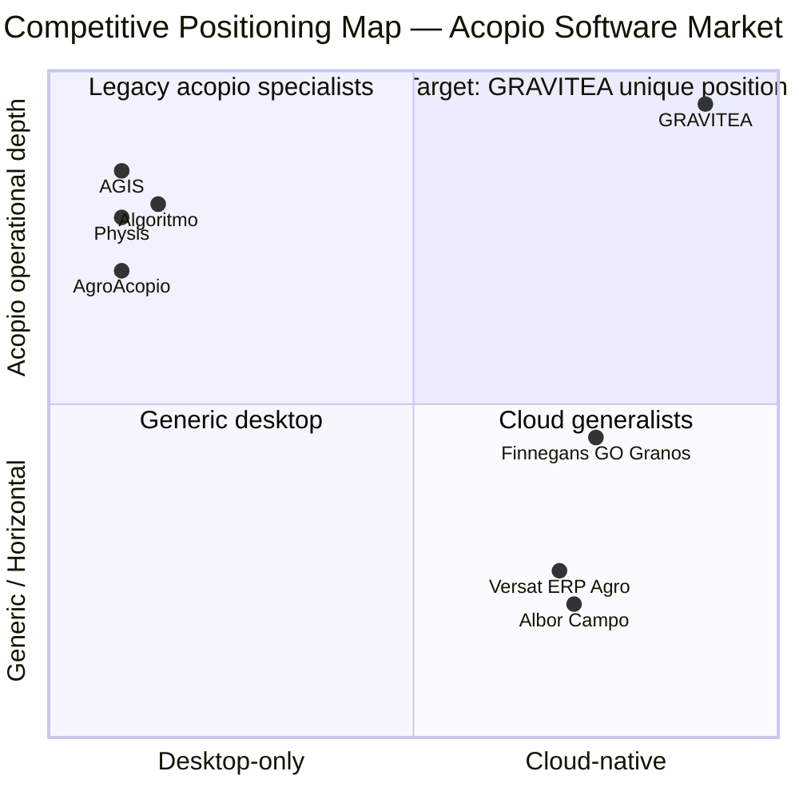
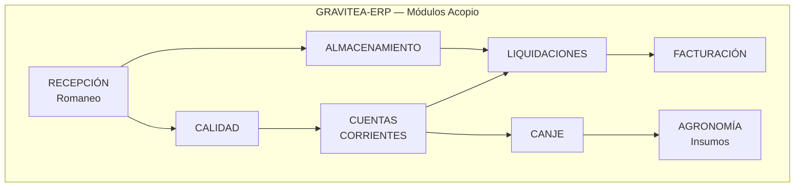
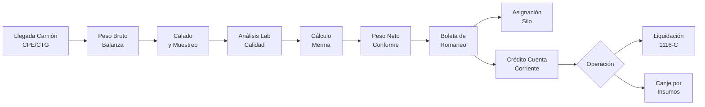
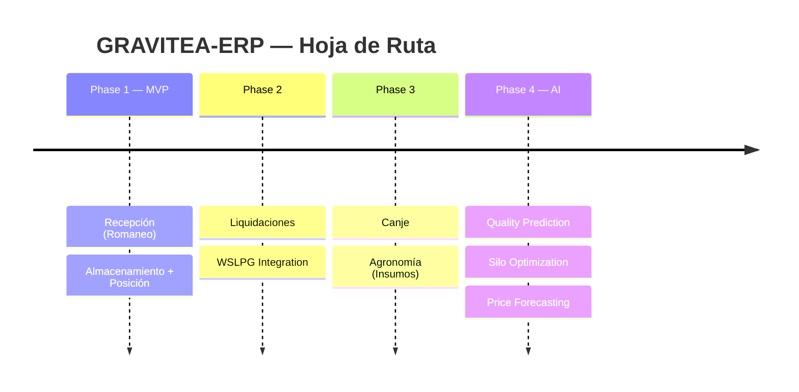
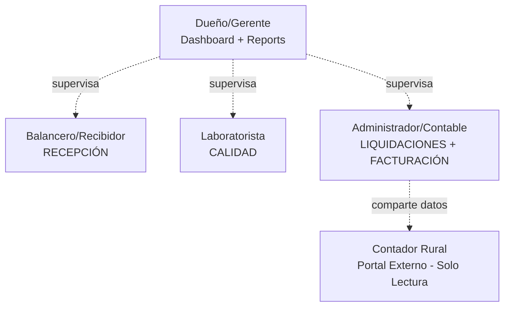

# Quickstart: Writing Product Vision & Scope v1.0

**Phase 1 output for**: `specs/001-acopio-vision/plan.md`
**Target file**: `Docs/Project Blueprint/Product Vision & Scope.md`
**Estimated writing time**: 4-6 hours (single author)
**Date**: 2026-03-15

---

## TL;DR — 3 Steps

1. **Read** the 4 pre-writing references (15 min)
2. **Write** sections in dependency order: S3 → S2 → S4 → S5 → S6 → S7 → S8 → S9 → S10 → S11 → S1
3. **Validate** against 7 checkpoint gates in `Docs/PROMPTS/spec-01-vision/01-plan.md`

**Your primary data source**: `specs/001-acopio-vision/research.md` — all facts are RAG-verified.
**Your section contracts**: `specs/001-acopio-vision/contracts/document-structure.md` — section-by-section acceptance tests.

---

## Pre-Writing Setup (15 minutes)

Read these 4 files in order before writing a single line:

```bash
# 1. Your data source (RAG-verified facts + 7 decisions)
cat specs/001-acopio-vision/research.md

# 2. Module names authority (must match exactly)
cat "Docs/Project Blueprint/Descripción General del Producto.md"

# 3. Existing document to preserve/replace
cat "Docs/Project Blueprint/Product Vision & Scope.md"

# 4. Section contracts (what each section must contain)
cat specs/001-acopio-vision/contracts/document-structure.md
```

**Key things to extract from pre-reading**:
- From v0.4: Copy the Implementation Progress table (lines 13-28) verbatim
- From v0.4: Copy the Feature Branch History table (001-025) — update descriptions for acopio
- From Descripción General: Note exact module names (8 modules in Spanish)
- From research.md: The Decision Log (D-001 through D-007) is your strategic backbone

---

## Writing Order

Write sections in this dependency order — NOT document order:

```
Section 3 → Section 2 → Section 4 → Section 5 → Section 6
→ Section 7 → Section 8 → Section 9 → Section 10 → Section 11
→ Section 1 (written last)
```

Rationale: S3 (market data) validates the S2 vision statement. S4 (product scope) requires S3's
gap analysis. S1 is last because it copies tables from v0.4 and stamps the date.

---

## Section-by-Section Writing Guide

### Section 3: Market Context (Start here)

**Why first**: All other sections cite market facts from this section.

**What to write**:

**3.1 Market Sizing**
Use verbatim figures from `research.md §Section 3 — 3.1 Market Sizing`:
```
TAM: ~1,259 enterprises, ~2,458 plants [Research 6.1]
SAM: ~1,073 private acopiadores, ~1,622 plants [Research 6.1]
SOM: Córdoba (81 members) + Santa Fe (58 members) [Research 6.1]
```

**3.2 Competitive Landscape**
Create a Mermaid quadrant diagram:


Then write individual competitor profile cards using the table in `research.md §3.2`.
**CRITICAL**: Use "2,000+ acopio clients" for AGIS — NOT "3,000+" [Research 4.2].

Add the government systems callout box:
> **Mandatory government integrations** (not competitors — must integrate):
> SIO Granos | SISA / Registro Sistémico (RG 5689/2025) | BolsaTech

Include 4-tier market segmentation with percentages.

**3.3 Pain Points** (6 pain points)
Copy from `research.md §3.4 Pain Points` — include all regulatory citations.
**Connectivity nuance**: write "acopio plants are located in small towns with better connectivity
than remote fields — brief outages during peak harvest halt CTG/SISA operations" — do NOT
simply say "40.2% have no internet" as if plants have no connectivity.

**Checkpoint Gate 1** (run after S3):
- [ ] TAM/SAM/SOM figures present with [Research 6.1]
- [ ] Mermaid quadrant renders
- [ ] AGIS shows "2,000+" not "3,000+"
- [ ] Government systems box labeled "mandatory" or "must integrate"
- [ ] Connectivity nuance is present (not just the 40.2% stat)

---

### Section 2: Strategic Purpose & Vision

**Why second**: S3 validates the market opportunity claim in the vision statement.

**What to write**:

**Vision statement** (replace all of the old generic content):
```
Empower independent Argentine grain operators (acopiadores de granos) with the first
cloud-native, offline-first ERP purpose-built for grain stockpiling operations —
delivering automatic regulatory compliance, real-time grain position visibility, and
enterprise-grade security to the small-to-medium acopiador who has been historically
underserved by desktop-era software.
```

**Vertical commitment declaration** (after vision statement):
A clear statement that the acopio vertical is the committed product direction — no hedging.

**6 Ironclad Principles** (adapt from v0.4, add 2 new):
Copy the existing 4 from v0.4 and add at the end:
5. **Regulatory Automation**: CPE/CTG, C-1116, SISA registrations happen automatically —
   operators manage grain, not compliance paperwork.
6. **AI-Ready Data Architecture**: Every weighing, quality grade, and storage movement is
   structured data first — enabling ML features in Phase 4 without data migration.

**Checkpoint Gate 2** (run after S2):
- [ ] Vision statement contains "acopiadores de granos", "offline-first", "regulatory compliance"
- [ ] No generic retail language in this section
- [ ] Exactly 6 Ironclad principles (including 2 new ones)
- [ ] Commitment language is declarative (no "may", "could", "considering")

---

### Section 4: Product Vision & Scope

**Why third**: Competitor gaps from S3 inform what we build.

**What to write**:

**4.1 Module Map** (Mermaid diagram)
Use EXACT Spanish names from Descripción General del Producto.md:


**4.2 Core Operational Flow** (Mermaid flowchart)


**4.3 MVP Scope** (Phase 1 = Romaneo-to-Position loop)
Explicitly define the 4 sub-components and their scope boundary.

**4.4 Technical Differentiators** (6 items — offline-first MUST be first)
1. Offline-first hybrid architecture
2. Rust acceleration layer (merma engine, grading — 2-9x via PyO3)
3. PostgreSQL RLS multi-tenancy (plant-level isolation)
4. ARCA direct integration (WSAA/WSFEv1/WSLPG; CAE online + CAEA offline)
5. AI-ready data architecture (structured capture for Phase 4 ML)
6. Field-level encryption (AES-256-GCM for PII)

**4.5 Dual Inventory** (brief explanation)
Grain (activo líquido): continuous, measured in kg | Insumos: discrete, measured in units.

**4.6 Out of Scope** (explicit list of 6+ items)
Include: Generic POS, B2C e-commerce, Manufacturing, Field agriculture, Fleet management, Payroll/HR.

**4.7 Phased Roadmap** (Mermaid)


**Checkpoint Gate 3** (run after S4):
- [ ] Exactly 8 modules with Spanish names matching Descripcion General
- [ ] Offline-first is differentiator #1
- [ ] Phase 4 contains AI (not Phase 1, 2, or 3)
- [ ] Operational flow Mermaid includes "merma" step
- [ ] All Mermaid diagrams render without errors

---

### Section 5: User Personas

**Why fourth**: Pain points from S3 + modules from S4 define each persona's scope.

**What to write**:

**5.1 Persona Hierarchy** (Mermaid)


**5.2-5.6 Individual Persona Cards**
One card per persona using data from `research.md §Section 5`:
- Name, role description
- Primary JTBD (1 sentence, domain-specific)
- Key pain (1 sentence with specifics — time, data, regulatory impact)
- Tech comfort level + current tools
- Success looks like (1 sentence)

**5.7 ICP Definition**
"Independent (non-cooperative) acopiador, 1-5 plants, Pampas region, small-medium storage capacity,
currently using desktop software or generic ERP + Excel, experiencing generational management
transition from founder to next generation."

**Checkpoint Gate 4** (run after S5):
- [ ] Exactly 5 persona cards
- [ ] No generic roles (search: "cashier", "clerk", "store manager" → zero)
- [ ] Each card has JTBD + pain + tech comfort
- [ ] ICP definition is domain-specific

---

### Section 6: Value Proposition Canvas

**Why fifth**: Synthesizes pains from S3 + S5 with product features from S4.

**What to write**:

Write a structured table (or Mermaid diagram) mapping 6 pains to 6 gains:

| Acopiador Pain | GRAVITEA Gain |
|----------------|---------------|
| CPE/CTG/SISA compliance burden | Automatic regulatory filings — zero manual submission |
| Tax withholding complexity (IVA/Ganancias/IIBB) | Instant retention calculations per liquidación with SICORE output |
| Grain inventory reconciliation discrepancies | Real-time grain position: comprado vs vendido vs físico |
| Producer account disputes over quality | Transparent grading via tolerance tables (Cámara Arbitral) |
| Manual weighbridge transcription during harvest | Direct weighbridge integration + offline romaneo |
| Internet outages halting CTG operations during harvest | Hybrid CAEA mode: operations continue, sync when online |

**Checkpoint Gate 5** (run after S6):
- [ ] Exactly 6 pain-gain pairs
- [ ] "CAEA" appears in connectivity row
- [ ] "IVA" or "retenciones" in tax row
- [ ] All gains reference specific product features (not vague "better software")

---

### Section 7: Go-to-Market Strategy

**Why sixth**: Uses market map from S3 + personas from S5 for targeting.

**What to write**:

**7.1 Contador Rural Channel**
- Free portal mechanics: real-time transactions, automated books, multi-client dashboard, one-click exports
- "Invitar a tu contador" referral flow: acopiador client onboarded → invites their contador → contador sees value → recommends to 5-14 other acopio clients
- 5-15 acopio clients per agro-specialized estudio (20-50 total agricultural clients)
- Target events: FACPCE seminars (RT 22, RT 41) + CPCE Córdoba agro-specific events
- Model: mirrors Xubio/Colppy success in Argentine SMB accounting market

**7.2 Geographic Beachhead**
Villa María, Córdoba → Córdoba province → Pampas region
- Rationale: Sociedad de Acopiadores de Córdoba HQ, 81 Federación members, founder network
- Risk acknowledged: AGIS is also headquartered in Villa María — this means dissatisfied AGIS
  clients are conversion targets but also that AGIS has deep local relationships

**7.3 Trade Events**
| Tier | Event | Date | Location |
|------|-------|------|----------|
| 1 | A Todo Trigo | May 2026 | Mar del Plata |
| 1 | Sociedad de Acopiadores de Córdoba | Annual | Villa María corridor |
| 1 | Federación de Acopiadores de Cereales | Ongoing | Buenos Aires |
| 2 | Grano SAC / Expo Poscosecha | November | Rosario |
| 2 | ExpoAgro | Annual | San Nicolás |
| 2 | AgroActiva | Annual | Armstrong, SF |

**7.4 Switching Strategy**
- Optimal window: April-June (post-soybean harvest, lowest operational intensity)
- Migration tools targeting AGIS/Physis/Excel data formats
- ACA Jóvenes networks for generational transition targeting

**Checkpoint Gate 6** (run after S7):
- [ ] "Invitar a tu contador" phrase present verbatim
- [ ] "5-15 acopio clients per estudio" figure present
- [ ] Villa María named as first beachhead with AGIS risk acknowledged
- [ ] A Todo Trigo: May 2026, Mar del Plata
- [ ] April-June switching window with "post-soybean harvest" rationale

---

### Section 8: Pricing Strategy

**Why seventh**: Follows naturally from GTM (pricing is part of the sales story).

**What to write**:

**8.1 Pricing Model**
- Monthly: $90/seat/month (USD-indexed)
- Annual: $75/seat/month (17% discount)
- Free: Contador rural portal (unlimited read-only)
- Why USD-indexed: grain operations are USD-denominated; operators think in USD; protects both
  parties from ARS devaluation (no inflation-adjusted repricing needed)

**8.2 Competitive Comparison**
| Solution | Pricing | Model | Acopio depth |
|----------|---------|-------|-------------|
| GRAVITEA | $90/seat ($180 for 2 seats) | Per-seat, USD | Full acopio |
| Desktop incumbents | ~$500-800/establishment | Per-install, ARS | Full acopio |
| Versat ERP Agro | USD 200-640/month | Per-establishment | Generic |
| Free portal (contador) | $0 | Free forever | Fiscal view only |

**8.3 Disruption Math** (make this explicit)
> A small acopio with 2 operational users pays approximately $180/month — 2.8x to 4.4x less
> than the incumbent per-establishment model while getting cloud + offline capabilities
> incumbents cannot match.

**Checkpoint Gate 6 continued** (after S8):
- [ ] Both $90 and $75 figures present
- [ ] "$500-800" incumbent range cited
- [ ] 2 users = $180/month disruption math shown
- [ ] USD-indexing rationale explicitly stated

---

### Section 9: AI Differentiation Roadmap

**Why eighth**: Phase 4 in S4's roadmap; AI-Ready principle from S1.

**What to write**:

**9.1 Why AI Comes Later**
Brief paragraph: the platform being built in Phases 1-3 captures structured data (romaneos,
quality grades, storage movements) that makes Phase 4 ML possible without data migration.
This is the "AI-Ready Data Architecture" Ironclad principle in action.

**9.2 Capabilities Table**
| Capability | Model Architecture | Phase | Expected Outcome |
|-----------|-------------------|-------|-----------------|
| Quality degradation prediction | 3D-CNN + LSTM | Phase 4 | 97.38% classification accuracy |
| Silo assignment optimization | MILP | Phase 4 | 27% reduction in truck queue times |
| Price forecasting (Matba Rofex) | VMD-SGMD-LSTM | Phase 4 | Grain futures prediction |
| Price forecasting (local pizarra) | XGBoost | Phase 4 | Local basis prediction |
| Weighbridge fraud detection | Anomaly detection | Phase 3 | Alert on suspicious weight variance |
| Document intelligence | OCR (Carta de Porte) | Phase 3 | Automatic CPE data extraction |
| Predictive aeration scheduling | SVM-Poly | Phase 4 | 99.98% efficiency classification |

Add citation: [Research 9.1]

**Checkpoint Gate 7** (run after S9):
- [ ] All capabilities are Phase 3 or Phase 4 (none in Phase 1 or 2)
- [ ] "3D-CNN" and "LSTM" appear together
- [ ] "MILP" appears
- [ ] "SVM-Poly" appears
- [ ] [Research 9.1] citation present
- [ ] Forward reference to AI-Ready Data Architecture principle

---

### Section 10: Success Metrics

**What to write** (use research.md §Section 10 verbatim):

Organize in 3 categories:

**Operational**:
- Harvest throughput: > 10 trucks/hour per balancero (vs. manual 4-6/hour)
- Sync latency: < 60 seconds for critical data propagation to all plants
- System uptime: 99.5%+ (offline mode ensures local availability during cloud outages)

**Adoption**:
- Balancero onboarding: < 1 day from zero to first processed romaneo
- Active user rate: > 80% of provisioned users active within 30 days of onboarding

**Business**:
- Stock discrepancy rate: < 2% after 3 months (vs. 10-15% industry standard with manual tracking)
- Regulatory compliance: CTG/LPG successfully filed > 99.5% of attempts
- ARPU: $360/month/tenant in Year 1 (4 seats × $90/seat)

---

### Section 11: Risks & Mitigation

**What to write** (use research.md §Section 11 table):

| Risk | Severity | Mitigation |
|------|---------|-----------|
| Connectivity gaps during harvest | High | Offline-first is the primary competitive moat — all daily operations work without internet |
| Regulatory change velocity (ARCA/SISA) | High | Modular ARCA integration; Rust acceleration enables fast compliance updates |
| Competitor response (Algoritmo + Silohub partnership) | Medium | First-mover in cloud+offline+depth combination; faster iteration than desktop incumbents |
| Adoption resistance (generational divide) | Medium | Target younger operators via ACA Jóvenes; contador channel provides trusted third-party advocacy |
| Data migration barrier (#1 switching barrier) | High | Structured import tools from AGIS/Physis/Excel formats; April-June switching window minimizes operational risk |
| 7-in-10 implementation failure rate [Albor Agtech] | High | Process-first onboarding (not technology-first); contador as built-in training advocate; white-glove onboarding for first 10 clients |

---

### Section 1: Document Metadata (Write Last)

**Why last**: Copies tables from v0.4 and stamps today's date.

**What to write**:

**Header**:
```markdown
# Product Vision & Scope

**Version**: 1.0 | **Date**: 2026-03-15 | **Status**: Vision Document — Committed
```

**Implementation Progress table**: Copy verbatim from v0.4 (lines 13-28):
```markdown
| Area | Status | Details |
|------|--------|---------|
| Backend Core | ✅ Complete | Auth, Inventory, Ventas, ARCA, Sync |
| Rust/PyO3 | ✅ Complete | 9 modules |
| ... (copy all rows verbatim) |
```

**Feature Branch History**: Copy from v0.4 and update descriptions to reflect acopio context.
All 25 branches (001-025) must appear. Update branch descriptions to say "infrastructure that
supports acopio vertical" where the old descriptions said "ERP" generically.

---

## After Writing: Validation Checklist

Run this in order after completing all 11 sections:

```bash
# 1. Full-text search for forbidden terms
grep -i "hardware store\|beverage distributor\|cashier\|under evaluation" \
  "Docs/Project Blueprint/Product Vision & Scope.md"
# Expected output: (no output = pass)

# 2. Count Feature Branch History rows
grep -c "^| 0[0-2][0-9]-\|^| 025" "Docs/Project Blueprint/Product Vision & Scope.md"
# Expected: 25

# 3. Count Mermaid blocks
grep -c "^\`\`\`mermaid" "Docs/Project Blueprint/Product Vision & Scope.md"
# Expected: 5 or more

# 4. Verify AGIS client count (must be 2,000 not 3,000)
grep -i "AGIS" "Docs/Project Blueprint/Product Vision & Scope.md" | grep -i "clients\|acopio"
# Check output: should show "2,000" not "3,000"

# 5. Verify line count
wc -l "Docs/Project Blueprint/Product Vision & Scope.md"
# Expected: 500-1000 lines

# 6. Verify all Research citations present
grep "\[Research" "Docs/Project Blueprint/Product Vision & Scope.md" | wc -l
# Expected: 10+ citation references
```

Then run the full acceptance checklist from `contracts/document-structure.md` manually.

---

## Common Pitfalls to Avoid

1. **Wrong AGIS client count**: Use "2,000+ acopio clients" — the "3,000+" figure was for all
   product lines; 2,000+ is the acopio-specific number from [Research 4.2].

2. **Connectivity overstated**: Don't write "acopio plants have no internet". Write "brief outages
   during peak harvest halt real-time CTG/SISA operations" — plants are in towns with generally
   adequate connectivity.

3. **AI in Phase 1**: All AI capabilities are Phase 3-4. Do not position any ML feature as MVP.

4. **Generic value props**: Every gain in the Value Prop Canvas must reference a specific GRAVITEA
   capability (CAEA mode, tolerance tables, Rust merma engine) — not "faster" or "easier".

5. **Module names**: Use the exact Spanish names from Descripción General del Producto.md.
   "RECEIPCIÓN" vs "RECEPCIÓN" — the accent matters for professional appearance.

6. **Missing disruption math**: In S8, the 2-user = $180/month vs $500-800 comparison must
   include the actual arithmetic, not just claim it's cheaper.

7. **Missing Villa María/AGIS tension**: D-005 says to acknowledge AGIS risk in the same
   section as the beachhead. Don't write Villa María as all upside — name the risk.

---

## Mermaid Syntax Quick Reference

Test all diagrams at: https://mermaid.live (or GitHub preview)

```text
QUADRANT chart:   quadrantChart + x-axis + y-axis + quadrant-1..4 + Competitor: [x, y]
FLOWCHART:        flowchart LR/TD + A[label] --> B[label]
TIMELINE:         timeline + title + SectionName : Item
GRAPH:            graph TB/LR + Node[label] --> Node2[label] + subgraph + end
```

Avoid `mindmap` and `block` diagram types — limited GitHub GFM support.
