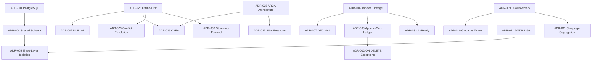

# Quickstart: Writing the ADR Document

**Branch**: `004-acopio-adr` | **Date**: 2026-03-17
**Target deliverable**: `Docs/Project Blueprint/Architecture Decision Records (ADR).md`

This is a single-author writing task, not a code implementation. No code changes, migrations, or tests.

---

## 1. Target File

```
Docs/Project Blueprint/Architecture Decision Records (ADR).md
```

This file does not exist yet. Create it fresh.

---

## 2. ADR Entry Template (Use for Every Entry)

```markdown
### ADR-NNN: Title

**Status**: Accepted | **Date**: 2026-03-17

**Context**: [2-4 sentences: the problem, need, or constraint that prompted this decision]

**Decision**: [1-3 sentences: what was decided, stated declaratively]

**Consequences**:
- (+) [Positive consequence 1]
- (+) [Positive consequence 2]
- (-) [Negative consequence 1]
- (-) [Negative consequence 2]

**Alternatives Considered**:
- [Alternative A] — Rejected because [specific rationale]
- [Alternative B] — Rejected because [specific rationale] (optional)

**Cross-References**: [Upstream document, specific section]
```

Rules:
- Every field is mandatory — no exceptions
- Consequences must include at least 1 positive and 1 negative
- Alternatives Considered must include at least 1 rejected option with explicit rationale
- Cross-References must use exact format: "Vision v1.0 Section 2.3" or "Constitution Principle VII"
- No "TBD", "TODO", "FIXME", "possibly", "might consider" anywhere

---

## 3. Document Sections (Writing Order)

Write in this order — do NOT write §2 (Index) first; it is built last from completed entries:

| Order | Section | Source |
|-------|---------|--------|
| 1 | §1 Document Metadata | New (table: Title, Version 1.0, Date 2026-03-17, Owner, Status Accepted) |
| 2 | §3 How to Read This Document | New (template, status lifecycle, cross-ref convention, supersession rules) |
| 3 | §4 Infrastructure Decisions (ADR-001–005) | research.md §4 |
| 4 | §5 Data Architecture Decisions (ADR-006–013) | research.md §5 |
| 5 | §6 Grain Domain Decisions (ADR-014–020) | research.md §6 |
| 6 | §7 Security Decisions (ADR-021–024) | research.md §7 |
| 7 | §8 Fiscal Integration Decisions (ADR-025–027) | research.md §8 |
| 8 | §9 Offline & Sync Decisions (ADR-028–030) | research.md §9 |
| 9 | §10 Performance Decisions (ADR-031–032) | research.md §10 |
| 10 | §11 AI/ML Readiness Decisions (ADR-033–035) | research.md §11 |
| 11 | §12 Decision Dependency Graph (Mermaid) | Derived from completed ADRs |
| 12 | §2 ADR Index (master table) | Derived from completed ADRs |

---

## 4. §3 "How to Read This Document" Outline

This section must cover:

**§3.1 ADR Format Template**: Show the exact template with all fields labeled.

**§3.2 Status Lifecycle**:
- `Proposed` — decision under consideration, not yet committed
- `Accepted` — committed architectural decision, all entries in this document are Accepted
- `Superseded` — replaced by a newer ADR; original preserved for history
- `Deprecated` — no longer relevant, technology/context has changed

**§3.3 Cross-Reference Convention**: Explain format "Document vX.Y Section Z.Z" and list where to find each upstream doc in the repository. Example: "Constitution Principle I" → `.specify/memory/constitution.md`.

**§3.4 Supersession Rules**: A new ADR supersedes an existing one by: (a) creating a new entry with status Proposed referencing the original, (b) updating the original's status to Superseded with a forward reference to the new ADR. Both coexist in the document until the new ADR is accepted.

---

## 5. §12 Decision Dependency Graph

Use this Mermaid structure as the starting point and expand:



---

## 6. §2 ADR Index Template

Build this table last, after all ADRs are written. One row per ADR, sorted by category:

```markdown
## 2. ADR Index

| ID | Title | Category | Status | Date |
|----|-------|----------|--------|------|
| [ADR-001](#adr-001-title) | PostgreSQL 18.1 as Primary Database | Infrastructure | Accepted | 2026-03-17 |
| ... | ... | ... | ... | ... |
```

Verify: total rows ≥ 30 before finalizing.

---

## 7. Checkpoint Gates (Quick Reference)

Run these 5 checkpoints as you write:

| Gate | After | Key checks |
|------|-------|-----------|
| Gate 1 | §1–§3 | Metadata v1.0 present; index placeholder; template shown; 4 status states explained |
| Gate 2 | §4–§5 | 13 ADRs written; Constitution I/II/III cross-referenced; ADR-010 names GLOBAL entities; ADR-012 lists all CASCADE exceptions |
| Gate 3 | §6–§8 | 14 ADRs written; all 7 spec-03 decisions captured; ADR-019 states single-grain WSLPG constraint; ADR-026 explains CAEA legal requirement |
| Gate 4 | §9–§11 | 8 ADRs written; ADR-029 lists all 5 strategies; ADR-031 has measured benchmark table; Constitution VII/VIII cross-referenced |
| Gate 5 | Final | §2 Index ≥30 rows with anchors; §12 Mermaid renders; no "TBD"/"TODO"; all 11 principles traceable |

---

## 8. Done Criteria Checklist

Before saving the file as complete:

- [ ] File created at `Docs/Project Blueprint/Architecture Decision Records (ADR).md`
- [ ] ADR count ≥ 30 (target: 35)
- [ ] §2 Index table populated with working Markdown anchor links
- [ ] All 11 Constitution principles (I–XI) traceable to at least 1 ADR
- [ ] All 7 spec-03 decisions (D-001–D-007) captured as individual ADRs
- [ ] Every ADR has all template fields: title, status, date, context, decision, consequences (+/-), alternatives (≥1 rejected), cross-references
- [ ] ADR-006 reconciles all three principle sets (Constitution, Vision, Data Model)
- [ ] ADR-031 includes measured benchmark evidence (speedup table from feature branches 018–025)
- [ ] ADR-029 maps all 5 conflict strategies to specific data types
- [ ] ADR-026 explains legal constraint on authorization timing (CAEA vs store-and-forward)
- [ ] §12 Mermaid dependency graph renders without syntax errors
- [ ] Zero hedging language: grep for "TBD", "TODO", "FIXME", "possibly", "might consider" — must return zero matches
