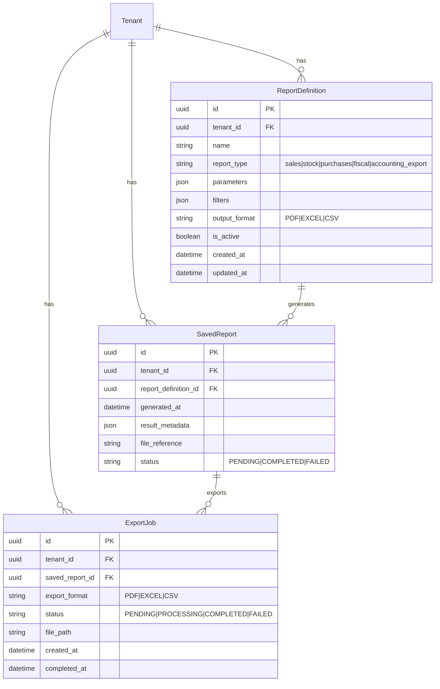
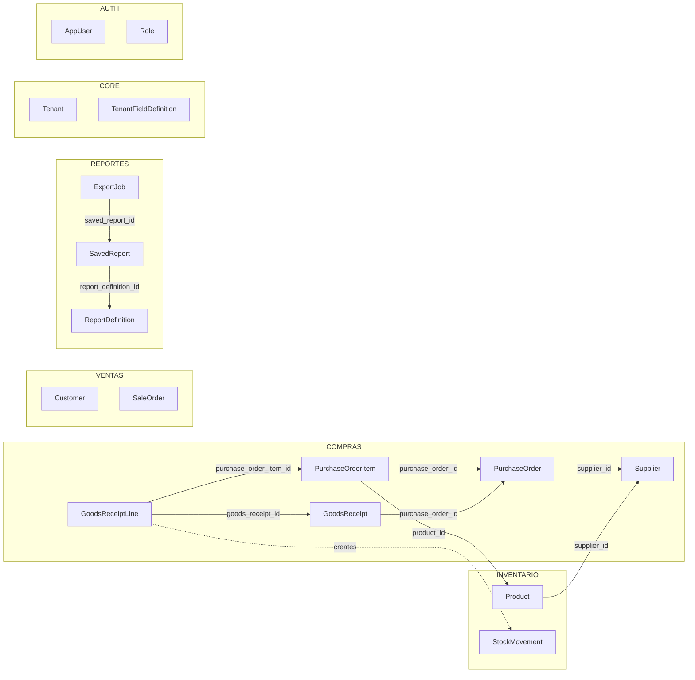

# Data Model: Backend Modules Solidification

**Branch**: `016-backend-modules-solidification` | **Date**: 2026-02-24

## Entity Relationship Diagram — COMPRAS Module

```mermaid
erDiagram
    Tenant ||--o{ Supplier : "has"
    Tenant ||--o{ PurchaseOrder : "has"
    Tenant ||--o{ GoodsReceipt : "has"

    Supplier ||--o{ PurchaseOrder : "supplies"
    Supplier ||--o{ Product : "default supplier"

    PurchaseOrder ||--|{ PurchaseOrderItem : "contains"
    PurchaseOrder ||--o{ GoodsReceipt : "receives"

    PurchaseOrderItem }o--|| Product : "orders"

    GoodsReceipt ||--|{ GoodsReceiptLine : "details"
    GoodsReceiptLine }o--|| PurchaseOrderItem : "receives against"
    GoodsReceiptLine ..|| StockMovement : "creates"

    Supplier {
        uuid id PK
        uuid tenant_id FK
        string name
        binary tax_id_encrypted
        string tax_id_hash
        binary contact_info_encrypted
        binary email_encrypted
        string email_hash
        binary address_encrypted
        int lead_time_days
        decimal current_balance
        boolean is_active
        json custom_data
        datetime created_at
        datetime updated_at
    }

    PurchaseOrder {
        uuid id PK
        uuid tenant_id FK
        uuid supplier_id FK
        string order_number
        string status "DRAFT|CONFIRMED|PARTIAL_RECEIVED|RECEIVED|CANCELLED"
        date order_date
        date expected_delivery_date
        text notes
        json custom_data
        decimal total_amount
        datetime created_at
        datetime updated_at
    }

    PurchaseOrderItem {
        uuid id PK
        uuid purchase_order_id FK
        uuid product_id FK
        decimal quantity
        decimal unit_price
        decimal line_total
        decimal received_quantity
    }

    GoodsReceipt {
        uuid id PK
        uuid tenant_id FK
        uuid purchase_order_id FK
        string receipt_number
        date receipt_date
        uuid received_by FK
        text notes
        datetime created_at
    }

    GoodsReceiptLine {
        uuid id PK
        uuid goods_receipt_id FK
        uuid purchase_order_item_id FK
        uuid product_id FK
        decimal quantity_received
    }
```

## Entity Relationship Diagram — REPORTES Module



## Cross-Module FK Diagram



## New Entity Definitions

### PurchaseOrder (apps/compras/)

| Field | Type | Constraints | Notes |
|-------|------|-------------|-------|
| id | UUIDField | PK, auto | Inherited from TenantBoundModel |
| tenant | ForeignKey(Tenant) | NOT NULL | Inherited from TenantBoundModel |
| supplier | ForeignKey(Supplier) | NOT NULL, RESTRICT | Cannot delete supplier with open POs |
| order_number | CharField(32) | UNIQUE per tenant | Auto-generated or user-supplied |
| status | CharField(20) | TextChoices | DRAFT, CONFIRMED, PARTIAL_RECEIVED, RECEIVED, CANCELLED |
| order_date | DateField | NOT NULL | Date PO was created |
| expected_delivery_date | DateField | NULL | Optional estimated arrival |
| notes | TextField | NULL, blank | Free-text notes |
| custom_data | JSONField | default={} | CustomFieldsMixin validated |
| total_amount | DecimalField(17,3) | default=0 | Sum of line_total values |
| created_at | DateTimeField | auto_now_add | Inherited from TenantBoundModel |
| updated_at | DateTimeField | auto_now | Inherited from TenantBoundModel |

**State Machine**:
```python
class PurchaseOrderStatus(models.TextChoices):
    DRAFT = "DRAFT", "Borrador"
    CONFIRMED = "CONFIRMED", "Confirmado"
    PARTIAL_RECEIVED = "PARTIAL_RECEIVED", "Parcialmente Recibida"
    RECEIVED = "RECEIVED", "Recibida"
    CANCELLED = "CANCELLED", "Cancelada"

PURCHASE_ORDER_TRANSITIONS = {
    PurchaseOrderStatus.DRAFT: {PurchaseOrderStatus.CONFIRMED, PurchaseOrderStatus.CANCELLED},
    PurchaseOrderStatus.CONFIRMED: {PurchaseOrderStatus.PARTIAL_RECEIVED, PurchaseOrderStatus.CANCELLED},
    PurchaseOrderStatus.PARTIAL_RECEIVED: {PurchaseOrderStatus.RECEIVED, PurchaseOrderStatus.CANCELLED},
    PurchaseOrderStatus.RECEIVED: set(),      # Terminal
    PurchaseOrderStatus.CANCELLED: set(),     # Terminal
}
```

**Mutable fields by state**:
- DRAFT: All fields editable
- CONFIRMED: Only `notes`, `expected_delivery_date`, `custom_data` (if spec allows — research says custom_data locked after confirmation per edge case)
- PARTIAL_RECEIVED: Only `notes`
- RECEIVED / CANCELLED: No fields editable

### PurchaseOrderItem (apps/compras/)

| Field | Type | Constraints | Notes |
|-------|------|-------------|-------|
| id | UUIDField | PK, auto | |
| purchase_order | ForeignKey(PO) | NOT NULL, CASCADE | Deleting PO deletes items |
| product | ForeignKey(Product) | NOT NULL, RESTRICT | Cannot delete product on open PO |
| quantity | DecimalField(17,3) | > 0, CHECK | Ordered quantity |
| unit_price | DecimalField(17,3) | >= 0, CHECK | Price per unit |
| line_total | DecimalField(17,3) | computed | quantity * unit_price |
| received_quantity | DecimalField(17,3) | default=0 | Accumulated from GoodsReceiptLines |

### GoodsReceipt (apps/compras/)

| Field | Type | Constraints | Notes |
|-------|------|-------------|-------|
| id | UUIDField | PK, auto | TenantBoundModel |
| tenant | ForeignKey(Tenant) | NOT NULL | Inherited |
| purchase_order | ForeignKey(PO) | NOT NULL, RESTRICT | |
| receipt_number | CharField(32) | UNIQUE per tenant | Auto-generated |
| receipt_date | DateField | NOT NULL, auto | Date goods arrived |
| received_by | ForeignKey(AppUser) | NULL | Optional: who received |
| notes | TextField | NULL, blank | |
| created_at | DateTimeField | auto_now_add | |

**Immutable**: No update or delete operations. Corrections handled by adjustment StockMovements.

### GoodsReceiptLine (apps/compras/)

| Field | Type | Constraints | Notes |
|-------|------|-------------|-------|
| id | UUIDField | PK, auto | |
| goods_receipt | ForeignKey(GR) | NOT NULL, CASCADE | |
| purchase_order_item | ForeignKey(POItem) | NOT NULL, RESTRICT | |
| product | ForeignKey(Product) | NOT NULL, RESTRICT | Denormalized for easy access |
| quantity_received | DecimalField(17,3) | > 0, CHECK | Must not exceed remaining |

**Validation**: `quantity_received + POItem.received_quantity <= POItem.quantity` (over-receipt rejected)

### ReportDefinition (apps/reportes/)

| Field | Type | Constraints | Notes |
|-------|------|-------------|-------|
| id | UUIDField | PK, auto | TenantBoundModel |
| tenant | ForeignKey(Tenant) | NOT NULL | Inherited |
| name | CharField(200) | NOT NULL | Human-readable name |
| report_type | CharField(30) | TextChoices | sales, stock, purchases, fiscal, accounting_export |
| parameters | JSONField | default={} | Report-specific config |
| filters | JSONField | default={} | Filter criteria |
| output_format | CharField(10) | TextChoices | PDF, EXCEL, CSV |
| is_active | BooleanField | default=True | Soft disable |
| created_at | DateTimeField | auto_now_add | |
| updated_at | DateTimeField | auto_now | |

### SavedReport (apps/reportes/)

| Field | Type | Constraints | Notes |
|-------|------|-------------|-------|
| id | UUIDField | PK, auto | TenantBoundModel |
| tenant | ForeignKey(Tenant) | NOT NULL | Inherited |
| report_definition | ForeignKey(RD) | NOT NULL, CASCADE | |
| generated_at | DateTimeField | auto_now_add | |
| result_metadata | JSONField | default={} | Row count, execution time, etc. |
| file_reference | CharField(500) | NULL | Path or blob key |
| status | CharField(20) | TextChoices | PENDING, COMPLETED, FAILED |

### ExportJob (apps/reportes/)

| Field | Type | Constraints | Notes |
|-------|------|-------------|-------|
| id | UUIDField | PK, auto | TenantBoundModel |
| tenant | ForeignKey(Tenant) | NOT NULL | Inherited |
| saved_report | ForeignKey(SR) | NOT NULL, CASCADE | |
| export_format | CharField(10) | TextChoices | PDF, EXCEL, CSV |
| status | CharField(20) | TextChoices | PENDING, PROCESSING, COMPLETED, FAILED |
| file_path | CharField(500) | NULL | Generated file location |
| created_at | DateTimeField | auto_now_add | |
| completed_at | DateTimeField | NULL | When export finished |

## Modified Entities

### Supplier (MOVED inventario → compras)
- **No field changes** — only app ownership
- All encrypted fields + blind indexes preserved
- `custom_data` preserved, entity_type remains `supplier`
- `db_table` may keep `inventario_supplier` or rename to `compras_supplier`

### Product (inventario)
- `supplier` FK target: `inventario.Supplier` → `compras.Supplier`
- No other changes

### StockMovement (inventario)
- No changes needed — `PURCHASE` type already exists in MovementType choices

### TenantFieldDefinition (core)
- Add `PURCHASE_ORDER = "purchase_order"` to EntityType choices

### Role (auth)
- `purchases` and `reports` already in VALID_MODULES
- Add `export` to VALID_ACTIONS set
